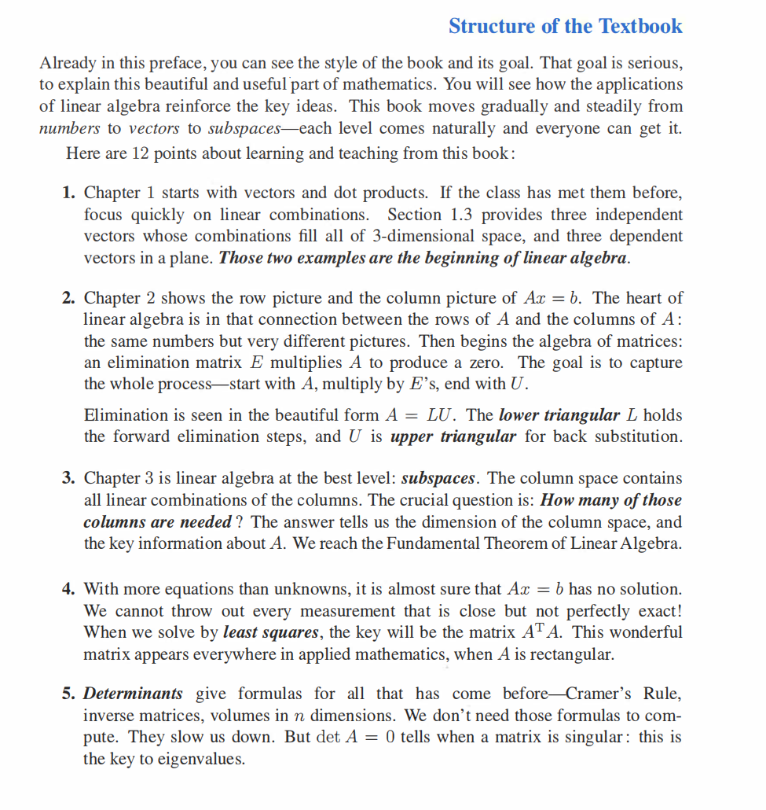

# CHAPTER 0

线性代数全书导读与知识地图（基于两页目录）
=====================

这两张目录页基本覆盖了一本经典线代教材的全栈知识：从“向量—方程—子空间—正交—特征—SVD—数值计算—到概率统计中的线代”。下面我把每个章节与小节都讲清楚：核心概念、代表性公式、典型算法/思路、常见误区与和工程/机器学习的连接。你可以把这份笔记当作“自学路线 + 一章一页速记”。

* * *

总体主线（先看这个就不迷路）
--------------

*   **一条线索**：从线性方程  $A x=b$  出发。
    *   列空间/行空间/零空间/左零空间 = **四大子空间**。
    *   消元 →  $LU$ ；正交与最小二乘 → 投影/QR；对称与正定 → 谱定理/Cholesky；一般矩阵 → **SVD**。
*   **六个“压轴”定理**（贯穿全书）
    1.  可逆矩阵定理（IMT）：关于“可逆/满秩/零空间只含零”等等的一组**等价**条件。
    2.  秩-零空间维数定理（Rank–Nullity）： $\mathrm{rank}(A)+\mathrm{nullity}(A)=n$ 。
    3.  正交投影与最小二乘： $\hat y=P_A y,\ P_A=A(A^\top A)^{-1}A^\top$ 。
    4.  对称矩阵谱定理：实对称  $A$  可正交对角化  $A=Q\Lambda Q^\top$ 。
    5.  正定矩阵的等价刻画： $x^\top A x>0$  ⇔  $A=R^\top R$ （Cholesky）⇔  $A$  特征值全正…
    6.  奇异值分解（SVD）： $A=U\Sigma V^\top$ ，普适分解，联通秩/最小二乘/低秩逼近/PCA。
*   **实践路径**：解方程（消元/LU）→ 子空间和秩 → 正交/QR/最小二乘 → 特征与对角化 → SVD/PCA → 数值稳定性与条件数 → 在统计/信号/图网络中的应用。

* * *

第1章 Introduction to Vectors
---------------------------

### 1.1 Vectors and Linear Combinations（向量与线性组合）

*   **线性组合**： $\sum c_i a_i$ 。**矩阵-向量乘**就是“列的线性组合”： $Ax=[a_1\ \cdots\ a_n]x=\sum x_i a_i$ 。
*   **生成子空间（span）**：所有线性组合的集合。是否能“生成” $\mathbb R^m$  取决于列是否**张成**。
*   **几何直觉**：2D是线/面，3D是平面/空间；高维同理。

### 1.2 Lengths and Dot Products（长度与点积）

*   范数/长度： $\|x\|_2=\sqrt{x^\top x}$ 。
*   点积： $x^\top y=\|x\|\|y\|\cos\theta$ 。不等式：**柯西–施瓦茨**  $|x^\top y|\le \|x\|\|y\|$ ；**三角不等式**。
*   **投影**： $\mathrm{proj}_a(y)=\dfrac{a^\top y}{a^\top a}a$ 。误差与 $a$ 正交。

### 1.3 Matrices（矩阵）

*   形状、加法、数乘、乘法（**不交换**）、转置。单位矩阵  $I$ 、零矩阵  $0$ 。

* * *

第2章 Solving Linear Equations
----------------------------

### 2.1 Vectors and Linear Equations（向量式看方程）

*    $Ax=b$  的可解 ⇔  $b$  在 **列空间**  $\mathcal C(A)$  中。
*   **欠定/超定/满秩** 情况区分。

### 2.2 The Idea of Elimination（消元思想）

*   **高斯消元** 把  $A$  化成上三角  $U$ ，回代求解。
*   **行初等变换** = 左乘**消元矩阵**。

### 2.3 Elimination Using Matrices（矩阵化的消元）

*   一系列下三角消元矩阵  $E_k\cdots E_1 A=U$ 。
*   若无主元交换： $A=LU$ 。

### 2.4 Rules for Matrix Operations（运算规则）

*   结合律/分配律成立；一般不交换： $AB\ne BA$ 。
*   维度匹配与**块矩阵**运算。

### 2.5 Inverse Matrices（逆矩阵）

*   定义： $A^{-1}A=I$ 。存在条件： $\det A\ne0$  ⇔ 秩满。
*   **Gauss–Jordan** 求逆；线性方程解： $x=A^{-1}b$ （但数值上通常不用直接求逆）。

### 2.6 Elimination = Factorization:  $A=LU$ 

*   **LU分解**：便于多右端  $Ax=b_i$ ；带主元交换时  $PA=LU$ （ $P$  置换矩阵）。
*   前代/回代的 ** $O(n^2)$ **，分解 ** $O(n^3)$ **。

### 2.7 Transposes and Permutations（转置与置换）

*    $ (AB)^\top=B^\top A^\top$ 。
*   **置换矩阵  $P$ **：选主元/交换行； $P^{-1}=P^\top$ 。

* * *

第3章 Vector Spaces and Subspaces
-------------------------------

### 3.1 Spaces of Vectors（向量空间）

*   向量空间/子空间：对加法与数乘封闭。常见： $\mathcal C(A)$ 、 $\mathcal N(A)$  等。

### 3.2 The Nullspace of  $A$ : Solving  $Ax=0$  and  $A^\top x=0$ 

*   **零空间**  $\mathcal N(A)$ ：齐次解；**左零空间**  $\mathcal N(A^\top)$ 。
*   维数 = 自由变量个数。

### 3.3 The Complete Solution to  $Ax=b$ 

*   若有特解  $x_p$ ，则通解  $x=x_p+x_n$ ，其中  $x_n\in\mathcal N(A)$ 。

### 3.4 Independence, Basis and Dimension（无关/基/维数）

*   线性无关：只能零组合得零。
*   **基** = 最小生成集 & 无关；维数=基向量个数。
*   列秩=行秩=**秩**。

### 3.5 Dimensions of the Four Subspaces（四大子空间维数）

*    $\dim\mathcal C(A)=\mathrm{rank}(A)$ 。
*   **秩-零度定理**： $\mathrm{rank}(A)+\dim\mathcal N(A)=n$ 。
*    $\mathcal C(A)\perp \mathcal N(A^\top)$ ， $\mathcal C(A^\top)\perp \mathcal N(A)$ 。

* * *

第4章 Orthogonality
-----------------

### 4.1 Orthogonality of the Four Subspaces（四子空间的正交性）

*   两对正交伴侣： $\mathcal C(A)\perp\mathcal N(A^\top)$ ， $\mathcal C(A^\top)\perp\mathcal N(A)$ 。

### 4.2 Projections（投影）

*   到子空间  $\mathcal C(A)$  的最小二乘投影：
    $$
    \hat y=P_A y,\quad P_A=A(A^\top A)^{-1}A^\top\quad(\text{列满秩})
    $$
*   几何条件：残差  $r=y-\hat y \perp \mathcal C(A)$ 。

### 4.3 Least Squares Approximations（最小二乘）

*   **法方程**： $A^\top A x = A^\top b$ 。
*   更稳定：**QR分解**  $A=QR$  ⇒  $Rx=Q^\top b$ 。

### 4.4 Orthonormal Bases and Gram–Schmidt（正交归一与格拉姆–施密特）

*   **改进（MGS）** 更数值稳定。
*   **QR**： $A=Q R$ ， $Q$  列正交归一， $R$  上三角。
*   QR在最小二乘、特征值迭代中都关键。

* * *

第5章 Determinants
----------------

### 5.1 Properties（性质）

*   体积缩放因子： $|\det A|$  = 平行多面体体积。
*   行交换变号、某行加倍倍增、行加到行上不变； $\det(AB)=\det A\cdot\det B$ 。

### 5.2 Permutations and Cofactors（置换与余子式）

*   拉普拉斯展开；伴随矩阵  $A^{-1}=\dfrac{1}{\det A}\operatorname{adj}(A)$ （**理论用，数值不推荐**）。

### 5.3 Cramer’s Rule, Inverses, and Volumes

*   克拉默法则：教学意义 > 实用价值；连接体积/几何直觉。

* * *

第6章 Eigenvalues and Eigenvectors
--------------------------------

### 6.1 Introduction（引言）

*    $A v=\lambda v$ ， $\det(\lambda I-A)=0$ 。
*   幂法/位移幂法寻找主特征值/向量。

### 6.2 Diagonalizing a Matrix（对角化）

*   若有  $n$  个线性无关特征向量： $A=X\Lambda X^{-1}$ 。
*   不可对角化时可用Jordan（本书更偏应用，不深纠）。

### 6.3 Systems of Differential Equations（微分方程）

*    $x'(t)=A x(t)\Rightarrow x(t)=e^{At}x(0)$ ；若可对角化： $e^{At}=X e^{\Lambda t} X^{-1}$ 。

### 6.4 Symmetric Matrices（对称矩阵）

*   **谱定理**：实对称  $A$  有正交特征基，特征值全实。
*    $A=Q\Lambda Q^\top$  在PCA、滤波、能量分解里无处不在。

### 6.5 Positive Definite Matrices（正定）

*   等价条件链：  
     $x^\top A x>0\ \forall x\neq0$  ⇔ 特征值全正 ⇔  $A=R^\top R$ （Cholesky） ⇔ 存在唯一最小二乘解且法方程可逆。

* * *

第7章 The Singular Value Decomposition (SVD)
------------------------------------------

### 7.1 Image Processing by Linear Algebra（图像处理）

*   低秩近似： $\min_{\mathrm{rank}\le k}\|A-\tilde A\|_F$  的最优解由前  $k$  个奇异值/向量给出。
*   压缩/去噪/重建的通用工具。

### 7.2 Bases and Matrices in the SVD（基与矩阵）

*    $A=U\Sigma V^\top$ ：
    *    $V$  给域  $\mathbb R^n$  的正交基；
    *    $U$  给值域  $\mathbb R^m$  的正交基；
    *    $\Sigma$  在两组基之间只做缩放。
*   秩 = 非零奇异值个数；条件数  $ \kappa_2=\sigma_{\max}/\sigma_{\min}$ 。

### 7.3 PCA by the SVD（用SVD做PCA）

*   数据中心化  $X$ ，协方差  $C=\frac1N X^\top X$ 。
*    $X=U\Sigma V^\top$ ，主成分=  $V$  的列；解释方差与  $\Sigma^2$  成正比。

### 7.4 Geometry of the SVD（几何）

*   单位球被映射为**主轴为奇异向量**、轴长为奇异值的椭球。

* * *

第8章 Linear Transformations
--------------------------

### 8.1 思想

*   线性变换  $T$  满足  $T(\alpha x+\beta y)=\alpha T(x)+\beta T(y)$ 。

### 8.2 矩阵表示

*   选基  $B$ 、 $C$ ，有  $[T]_{C\leftarrow B}$ ；换基矩阵  $S$  使表示变为  $S^{-1}[T]S$ 。

### 8.3 寻找好基（The Search for a Good Basis）

*   对角化/块对角化/正交基（QR/SVD）都是在“把问题变简单”的换基。

* * *

第9章 Complex Vectors and Matrices
--------------------------------

### 9.1 复数

*   内积改为  $\langle x,y\rangle = y^* x$ ，共轭转置  $(\cdot)^*$ 。

### 9.2 Hermitian & Unitary

*   Hermitian： $A=A^*$ （复对称），特征值实；Unitary： $U^*U=I$ 。
*   复谱定理：Hermitian 可酉对角化。

### 9.3 FFT（快速傅里叶变换）

*   通过分治把 DFT 的  $O(n^2)$  降为  $O(n\log n)$ 。

* * *

第10章 Applications（应用）
---------------------

### 10.1 图与网络

*   邻接矩阵  $A$ 、度矩阵  $D$ 、拉普拉斯  $L=D-A$ 。二次型  $x^\top L x$  与割/平滑相关。

### 10.2 工程矩阵

*   刚度矩阵常为对称正定；求解用 Cholesky/共轭梯度。

### 10.3 马尔可夫 & 经济

*   随机矩阵特征值 1；稳态向量是特征向量（PageRank 思路）。

### 10.4 线性规划（LP）

*   基本可行解、对偶；几何上在多面体顶点上取最优。

### 10.5 傅里叶级数（函数的线性代数）

*   正交基展开、最小二乘意义下的最佳逼近。

### 10.6 计算机图形

*   齐次坐标与仿射/投影变换矩阵链。

### 10.7 密码学

*   线性代数在编码、格密码、LWE 等中的角色。

* * *

第11章 Numerical Linear Algebra（数值线代）
-----------------------------------

### 11.1 Gaussian Elimination in Practice

*   主元策略、填充、稀疏结构、复杂度。
*   **不要**用显式逆矩阵解方程；用分解（LU/QR/Cholesky）。

### 11.2 Norms and Condition Numbers（范数与条件数）

*   条件数  $\kappa(A)=\|A\|\,\|A^{-1}\|$  反映对数据扰动的敏感性；病态问题要正则化/重缩放。

### 11.3 Iterative Methods and Preconditioners（迭代法与预条件）

*   共轭梯度（SPD）、GMRES（一般）、多重网格与预条件提升收敛。

* * *

第12章 Linear Algebra in Probability & Statistics
-----------------------------------------------

### 12.1 Mean, Variance, and Probability

*   随机向量  $X$ ： $\mathbb E[X]$ 、 $\mathrm{Var}(X)$ 。

### 12.2 Covariance Matrices and Joint Probabilities

*   协方差矩阵  $\Sigma$  对称半正定；白化、相关性、马氏距离。

### 12.3 Multivariate Gaussian and Weighted Least Squares

*    $\mathcal N(\mu,\Sigma)$  的几何是椭球；极大似然与**加权最小二乘**：
    $$
    \min_x \|W(Ax-b)\|_2^2 \ \Rightarrow\ (A^\top W^\top W A)x=A^\top W^\top W b
    $$

* * *

附：常用分解一览（目录中“Matrix Factorizations”提示）
--------------------------------------

*    $PA=LU$ （消元/直接法）
*    $A=QR$ （正交/最小二乘/特征迭代）
*    $A=Q\Lambda Q^\top$ （对称谱分解）
*    $A=U\Sigma V^\top$ （SVD/PCA）
*    $A=R^\top R$ （Cholesky，SPD）

* * *

学习与做题建议（按目录顺序配练习）
-----------------

1.  **第1–2章**：手算 2–3 阶消元、写出列空间与可解性判据。
2.  **第3章**：给矩阵写出四大子空间的基与维数；验证 Rank–Nullity。
3.  **第4章**：推导/计算  $P_A$ ；用 QR 解最小二乘并和法方程对比残差。
4.  **第5章**：用行变换理解  $\det$ ；几何上解释体积变化。
5.  **第6章**：求实对称矩阵的特征分解；微分方程的解用  $e^{At}$ 。
6.  **第7章**：对一张灰度图做 rank-k SVD 重构，观察 PSNR/误差与奇异值衰减。
7.  **第8–10章**：把图拉普拉斯做二次型与谱聚类的最小例子。
8.  **第11章**：比较直接法（LU）与迭代法（CG）在 SPD 稀疏问题上的收敛。
9.  **第12章**：用 SVD/PCA 降维到 2D，画出投影，演示加权最小二乘。

* * *

小结
--

*   目录展示的结构就是“**方程—子空间—正交—谱—SVD**”的递进。
*   实务中：解方程优先 **LU/Cholesky/QR**；拟合优先 **QR/SVD**；对称/正定用 **谱/Cholesky/CG**；高维数据用 **SVD/PCA**。
*   牢记六个压轴定理与四大子空间的几何图景，贯穿所有章节与应用。

《线性代数导论》第五版——前言精读与课程起步全笔记
=========================

（三页前言 + 课程开场内容的完整讲解）

> **概览**：前言交代了本书的学习方式、三大配套网站、第五版新增内容与课程主线。随后用“**四大子空间**”与“**从  $Ax=b$  出发的三层解法**”点明整本书的框架与方法论，并提醒读者：**别把“求逆”和“行列式公式”当成一上来就用的工具**。本笔记按图片顺序逐条展开，补足必要定义、公式与直觉，读完即可独立把握全书的逻辑。

* * *

Ⅰ. Preface（前言，第1页）：学习资源与第五版新增
-----------------------------

### 1) 三个官方网站与课程形态

*   **OCW/YouTube（ocw.mit.edu 与 YouTube）**：配套视频课 _18.06 / 18.06 SC_（SC 含完整学期素材）。可用作全书的独立复习路径。
*   **课程主页（web.mit.edu/18.06）**：历年 **作业与考试（含解答）**、评阅要点、历史材料。
*   **教材站（math.mit.edu/linearalgebra）**：本书专属站点，提供
    *   **习题解答**（Exercises Solutions）、**练习题与示例**（practice & examples）、
    *   **代码**（MATLAB/Julia/Python），
    *   以及**整卷考试合集**（含 18.06 与其他课程），便于自测与进阶。

> **使用建议**：每学完一节，先看该节开头的\*\*“简明摘要行”**（第五版新增），再做书后题 → 对照网站**完整解答\*\*核对思路 → 选做 Challenge Problems。

### 2) 第五版的两类“新”

*   **内容新增**：补充了与**概率、统计、数据理解**有关的两章（对应目录第12章），把线性代数与现代数据分析紧密相连（协方差、PCA、加权最小二乘、多元高斯几何等）。
*   **版面新增**：**每节开头的“速览摘要”**，用于**先导阅读**与**回顾记忆**（复习时快速抓住该节的核心结论与图景）。

* * *

Ⅱ. The Fifth Edition（前言，第2页上半）：封面图与“四大子空间”
------------------------------------------

### 1) 四大子空间（Four Fundamental Subspaces）

给定  $m\times n$  矩阵  $A$ ，围绕  $A$  的线性变换有四个核心子空间：

*   **列空间**  $\mathcal C(A)$ ：由  $A$  的**列向量**张成，是所有**列的线性组合**的集合；决定了哪些  $b$  能被  $Ax=b$  表达。
*   **行空间**  $\mathcal C(A^\top)$ ：由 **行**张成（等价看  $A^\top$  的列空间）。
*   **零空间**  $\mathcal N(A)$ ：满足  $Ax=0$  的解集合（齐次解）。
*   **左零空间**  $\mathcal N(A^\top)$ ：满足  $A^\top y=0$  的向量集合。

**正交结构**（第4章主线）：

$$
\mathcal C(A)\ \perp\ \mathcal N(A^\top),\qquad \mathcal C(A^\top)\ \perp\ \mathcal N(A).
$$

**秩–零空间维数定理**（rank–nullity，第3章主线）：

$$
\operatorname{rank}(A)+\dim\mathcal N(A)=n.
$$

### 2) “列线性组合”的语言

*   **矩阵–向量乘法的本质**
    $$
    Ax=[a_1\ \cdots\ a_n] \begin{bmatrix}x_1\\[-2pt]\vdots\\[-2pt]x_n\end{bmatrix} =\sum_{i=1}^n x_i\,a_i.
    $$
    也就是“**用列向量线性组合得到  $b$ **”。因此：
    *   **是否可解**： $Ax=b$  可解 **当且仅当**  $b\in\mathcal C(A)$ 。
    *   **几何直觉**： $\mathcal C(A)$  是  $b$  可能落入的“目标子空间”。

### 3) 读书法提示（作者特别强调 1.3 节）

*   第 1.3 节很早就出现**矩阵、向量空间与列空间的几何图**，并引入**逆矩阵**（与微积分连接）。思路是“**通过使用来学习**”，而不是先堆砌抽象定义。

### 4) 书中“挑战型例题”（前言列举的4个样题）——要点/提示

*   **Sec 2.1**：**数独矩阵**在**哪些“换行”操作**后仍是数独？  
    _要点_：把行交换写成**置换矩阵  $P$ ** 作用  $PA$ 。为了不破坏  $3\times 3$  宫格结构，**允许在同一“行带”（3行一组）内交换**，以及**整组行带之间互换**；跨带单行互换会破坏宫格约束（同理列）。
*   **Sec 2.7**：若  $P$  是置换矩阵，为什么存在  $k$  使  $P^k=I$ ？  
    _要点_：置换分解为**有限个循环**（cycles）。每个长度为  $l$  的循环满足  $P^l=I$ ；取所有循环长度的 **最小公倍数**  $k$ ，就有  $P^k=I$ （置换群是有限群）。
*   **Sec 3.4**：若对 **每个**  $b$ ，方程组  $Ax=b$  与  $Cx=b$  的**解集相同**，是否  $A=C$ ？  
    _结论_：**是**。证法只需取任意向量  $y$ ，令  $b=Ay$ 。此时  $x=y$  解  $Ax=b$ 。解集相同 ⇒  $y$  也解  $Cx=b$ ，即  $Cy=Ay$ 。对任意  $y$  成立 ⇒  $A=C$ 。
*   **Sec 4.1**：对  $2\times 2$  情形，什么条件下单个向量  $r,n,c,\ell$  分别能作为**行空间、零空间、列空间、左零空间**的基？  
    _要点_（秩为 1 的典型情形）：
    $$
    A = c\, r^\top \quad(\text{外积})
    $$
    行空间 =  $\operatorname{span}\{r^\top\}$ ，列空间 =  $\operatorname{span}\{c\}$ ；  
    零空间 =  $\{x:\ r^\top x=0\}=\operatorname{span}\{n\}$ ，要求  $r^\top n=0$ ；  
    左零空间 =  $\{y:\ y^\top c=0\}=\operatorname{span}\{\ell\}$ ，要求  $\ell^\top c=0$ 。  
    因此需要 ** $r\perp n$ 、 $c\perp \ell$ **，且四者均非零；这正体现了“**行空间 ⟂ 零空间**、**列空间 ⟂ 左零空间**”。

* * *

Ⅲ. The Start of the Course（前言第2页下半–第3页）：从  $Ax=b$  起步的“三层解法”
------------------------------------------------------------

### 0) 统一语言：线性组合视角

*   **题意**： $Ax=b$  问的是“**是否存在系数  $x$ ** 使**列的线性组合**产生  $b$ ”。
*   **主线**：解  $x$  的三种层级方法，**都重要**，但各有适用性与数值考量。

### 1) **Direct solution（直接法）**

**高斯消元 + 回代**（第2章）：

*   把  $A$  化为上三角  $U$ ，然后回代；带主元交换  $PA=LU$ 。
*   **首选的工程算法**（科学计算里用得最多）。
*   复杂度约  $O(n^3)$ ；多右端时先做一次  $LU$ ，每次解只需前/回代  $O(n^2)$ 。

### 2) **Matrix solution（矩阵“求逆”法）**

*   形式解  $x=A^{-1}b$ （当  $A$  可逆）。
*   **重要提醒**：在数值计算中**不直接求逆再相乘**，因为
    *   显式求逆**慢且不稳定**；
    *   更好的做法是 **LU/QR/Cholesky** 分解后解方程。
*   记住：求逆是**概念上**漂亮的公式，不是**工程上**的首选步骤。

### 3) **Complete solution（通解结构）**

*   若方程可解，通解写成
    $$
    x = x_p + x_n,\qquad x_n\in\mathcal N(A),
    $$
    其中  $x_p$  是任一特解（如经消元得到）。
*   **几何意义**：所有解组成一个**仿射子空间**（平移了的零空间）。
*   **与四大子空间的连接**： $b\in\mathcal C(A)$  ⇔ 有解； $\mathcal N(A)$  给出自由度。

### 4) “别把时间全花在消元”与“何时谈行列式”

*   **现实世界的核心算子**是“**解  $Ax=b$ **”（超级计算机也拿它做基准）。
*   **用逆矩阵太慢**，**行列式公式更慢**；行列式在几何与理论上很重要，但**不该作为课程起点**。
*   课程会把时间放在：**子空间结构、正交与最小二乘、特征与 SVD** 上，这些才是现代线代的“工作马”。

* * *

Ⅳ. 衔接后续章节的“最小公式表”
-----------------

1.  **列组合**： $Ax=\sum_i x_i a_i$ 。
2.  **通解**： $x=x_p+x_n,\ x_n\in\mathcal N(A)$ 。
3.  **秩–零度**： $\operatorname{rank}(A)+\dim\mathcal N(A)=n$ 。
4.  **正交投影（列满秩）**： $P_A=A(A^\top A)^{-1}A^\top$ ， $\hat y=P_Ay$ ， $y-\hat y\perp\mathcal C(A)$ 。
5.  **谱/Cholesky/SVD（预告）**：
    *   对称谱分解  $A=Q\Lambda Q^\top$ ；
    *   正定  $A=R^\top R$ （Cholesky）；
    *   **SVD**  $A=U\Sigma V^\top$ （最小二乘与低秩近似/PCA 的“通用钥匙”）。

* * *

Ⅴ. 学习法与做题路线（基于前言的建议）
--------------------

*   **每节**先看“**摘要行**”→ 做基础题 → 做 **Challenge**（训练抽象理解与构造能力）。
*   练习把“行交换/置换”写成  $PA$ ；把“块结构不变性”（如数独的行带/列带）当成**群作用**直观掌握。
*   解方程优先 **消元/LU/QR**，把**求逆**当成概念工具；**行列式**放在**几何/理论**位置上理解（体积、可逆性判据等）。

* * *

小结
--

*   **第五版**以“**四大子空间** + ** $Ax=b$  三层解法**”为全书导引，辅以三大网站的**解答/代码/试卷**生态。
*   **核心认识**：
    *    $Ax=b$  ⇔  $b\in\mathcal C(A)$ ；
    *   解的结构由  $\mathcal N(A)$  决定；
    *   置换与行交换用矩阵  $P$  严格表达；
    *   工程求解靠分解（LU/QR/Cholesky），而不是“先求逆”；
    *   行列式重要但不应当课程的第一主角。
*   后续学习按目录推进：**方程 → 子空间 → 正交/最小二乘 → 特征 → SVD → 数值稳定性与统计应用**。

《Structure of the Textbook》两页精读：整本书的结构、主线和学习路线
==============================================

**概况**  
这两页把全书的教学目标与路线图一次性讲清：从**数—向量—子空间**层层抽象，围绕核心问题  $Ax=b$  展开，最后进入特征值、SVD、数值计算与统计应用。下面我按书中 **12 条要点**逐条拆解，每条都给出：核心结论 ▸ 必背公式/算法 ▸ 直觉与常见误区 ▸ 学习动作（练习建议）。

* * *

1\. 第1章：向量与点积 → 快速进入“线性组合”
--------------------------

**核心**：矩阵–向量乘法本质上是**列向量的线性组合**。  
**必背**： $Ax=[a_1\,\cdots\,a_n]x=\sum_{i=1}^{n}x_i a_i$ 。  
**直觉**： $\mathcal C(A)$ （列空间）= 所有可能的输出  $Ax$ 。三维中“3个线性无关向量张成整个空间；3个相关向量只能张成一个平面/直线”。  
**易错**：把“线性相关/无关”混同于“几何正交”。正交 ⇒ 无关，但无关未必正交。  
**练习**：给出 3 组三维向量，判定是否张成  $\mathbb R^3$ ，并写出任意给定  $b$  的线性组合系数（若存在）。

* * *

2\. 第2章：从“行视图/列视图”理解  $Ax=b$  → 消元与  $A=LU$ 
--------------------------------------------

**核心**：

*   **列视图**： $b\in\mathcal C(A)$ ？
*   **行视图**：行运算把  $A$  化简；消元矩阵  $E$  把主元下方变 0。  
    **必背**： $E_k\cdots E_1A=U$  上三角；若无换主元， $A=LU$ 。带主元交换： $PA=LU$ 。  
    **直觉**： $L$  记录“前向消元”， $U$  适合“回代”。  
    **易错**：把“乘以  $E$ ”和“在纸上做行变换”割裂开；它们是同一件事。  
    **练习**：手工对一个  $3\times3$  矩阵做消元，写出对应的  $E_1,E_2$ ，并还原  $L,U$ 。

* * *

3\. 第3章：**子空间**视角（线代的“最高级视角”）
-----------------------------

**核心**：四大子空间： $\mathcal C(A)$ 、 $\mathcal C(A^\top)$ 、 $\mathcal N(A)$ 、 $\mathcal N(A^\top)$ 。  
**必背**（秩–零度定理）： $\mathrm{rank}(A)+\dim\mathcal N(A)=n$ 。  
**直觉**： $\mathcal C(A)$  告诉我们能到达哪里； $\mathcal N(A)$  决定解集的自由度。  
**易错**：把“维数=列数”当真。维数取决于**线性无关的列数**（秩），不是总列数。  
**练习**：对任意  $m\times n$  矩阵，用行最简形找出四大子空间的**基**与**维数**。

* * *

4\. 方程常超定（方程多于未知量）→ **最小二乘**与  $A^\top A$ 
------------------------------------------

**核心**：若  $Ax=b$  无解，求使  $\|Ax-b\|$  最小的  $x$ 。  
**必背**：法方程  $A^\top A x=A^\top b$ ；正交投影  $\hat b=P_A b$ ，

$$
P_A=A(A^\top A)^{-1}A^\top\quad(\text{当 }A\text{ 列满秩})
$$

**数值**：用 **QR 分解**（ $A=QR$ ）解最小二乘更稳定： $Rx=Q^\top b$ 。  
**易错**：直接解法方程放大条件数，易不稳定；优先 QR/SVD。  
**练习**：做一次多项式拟合（如二次曲线），分别用法方程与 QR 比较残差与稳定性。

* * *

5\. **行列式**的角色：判别奇异，不是首选计算工具
----------------------------

**核心**：行列式给出体积缩放与可逆性判断（ $\det A=0$  ⇒ 奇异），也支撑克拉默法则、伴随式、体积几何。  
**立场**：**不是**解方程或数值计算的起点（又慢又不稳）。  
**练习**：用行变换理解  $\det$  的性质（交换变号、倍乘倍增、某行加到另一行不变）。

* * *

6\. **6.1 先讲  $2\times2$  的特征值**；对称矩阵对角化与正定
-------------------------------------------

**核心**：

*    $2\times2$  速算： $\lambda=\dfrac{\mathrm{tr}\,A\pm\sqrt{(\mathrm{tr}\,A)^2-4\det A}}{2}$ 。
*   **跟随特征向量**（follow the eigenvectors）：在线性系统  $u'(t)=Au$  的**特征方向**上问题变一维。
*   **对称矩阵**： $A=Q\Lambda Q^\top$  可正交对角化；若特征值全正 ⇒ **正定**。  
    **串联全书的钥匙**：正主元 ↔ 正定 ↔ 特征值正 ↔ Cholesky。  
    **练习**：写出对称  $3\times3$  的谱分解；用对角化求解  $u'(t)=Au$ 。

* * *

7\. **SVD**（本版重点新章）：奇异值与奇异向量
----------------------------

**核心**： $A=U\Sigma V^\top$ 。奇异值按重要性排序；自然给出**低秩近似**。  
**必背**：最优秩- $k$  逼近（Eckart–Young）：保留前  $k$  个奇异值/向量。  
**连接**：图像压缩、噪声抑制、数据分析（PCA）。  
**练习**：对一幅灰度图做 rank- $k$  重构，画  $\|\cdot\|_F$  误差随  $k$  的衰减。

* * *

8\. **线性变换**：几何无坐标，矩阵有坐标
------------------------

**核心**：选定基之后，线性变换  $T$  才以矩阵表示；**换基**可让矩阵“最好看”（对角/块对角/正交）。  
**练习**：对同一  $T$  在不同基下写出矩阵，体会“寻找好基”的威力。

* * *

9\. 复数与复矩阵 → **傅里叶矩阵/FFT**
--------------------------

**核心**：

*   内积改为  $\langle x,y\rangle=y^*x$ ，共轭转置  $(\cdot)^*$ 。
*   **酉矩阵**  $U^*U=I$  保长度与能量。
*   **傅里叶矩阵**  $F$ （酉 up to 标准化）；**FFT** 将  $O(n^2)$  的 DFT 降为  $O(n\log n)$ 。  
    **练习**：验证标准化后  $F^*F=I$ ；数值实现长度 1024 的 FFT 与直接 DFT 时间对比。

* * *

10\. 应用百宝箱（10.1–10.7）
---------------------

**10.1 图与网络**：拉普拉斯  $L=D-A$ ；二次型  $x^\top Lx$  与切割/平滑。  
**10.2 工程矩阵**：刚度矩阵常为 SPD；适合 Cholesky/共轭梯度。  
**10.3 马尔可夫矩阵**：行（或列）随机；稳态向量是特征向量（PageRank 思想）。  
**10.4 线性规划**：在多面体顶点取最优；与单纯形/对偶息息相关。  
**10.5 傅里叶级数**：用正交基展开做逼近（本质是最小二乘）。  
**10.6 计算机图形**：仿射与投影变换矩阵链。  
**10.7 线代与密码学**：Hill 密码等，模  $p$  算术与可逆性（ $\det\not\equiv0\pmod p$ ）。  
**练习**：对一个小图做谱聚类（用  $L$  的前几个特征向量）。

* * *

11\. 线代课里的“计算”该如何融入？
--------------------

**立场**：概念与数值并重。  
**工具**：MATLAB/Maple/Mathematica；**Julia/Python**（NumPy/SciPy）开源易用。  
**实践准则**：

*   解  $Ax=b$ ：**别显式求逆**；用 **LU/QR/Cholesky**。
*   大规模稀疏：优先迭代法（CG/GMRES），关注预条件与条件数。  
    **练习**：在 Python 里对比 `np.linalg.solve`、`np.linalg.inv@b`、`scipy.linalg.lu_factor/lu_solve` 的速度与误差。

* * *

12\. 概率与统计中的线代（新内容，深度应用）
------------------------

**核心**：

*   随机向量  $X$  的协方差  $\Sigma=\mathbb E[(X-\mu)(X-\mu)^\top]$  **对称半正定**；独立 ⇒ 协方差为 0（反之不一定）。
*   **多元高斯**的几何是椭球；白化用  $\Sigma^{-\tfrac12}$ 。
*   **加权最小二乘** / 最大似然： $(A^\top W^\top W A)x=A^\top W^\top W b$ 。  
    **连接**：与第6章（对称/正定）和第7章（SVD/PCA）紧密互通。  
    **练习**：对中心化数据矩阵  $X$  做 SVD，验证 PCA 主成分与协方差特征向量的一致性。

* * *

贯穿全书的三条“总原则”
------------

1.  **从  $Ax=b$  出发**：可解性看  $\mathcal C(A)$ ，解的结构看  $\mathcal N(A)$ 。
2.  **用分解而非求逆**：LU/QR/Cholesky/SVD 是工程与科研的“工作马”。
3.  **跟随特征向量/奇异向量**：对称谱分解与 SVD 是理解与计算的最佳基。

* * *

建议的学习/刷题顺序（配合目录）
----------------

1→2→3（扎实子空间）→4（正交/最小二乘/QR）→6（特征与对称）→7（SVD/PCA）→11（数值）→12（统计）→10（选做应用专题）。

* * *

小结
--

*   **结构**：数 → 向量 → 子空间 → 正交 → 特征/对称/正定 → SVD → 数值与统计。
*   **方法**：把一切都写成“在好基下更简单”的故事（对角化/正交化/低秩化）。
*   **应用**：图网络、信号处理、优化、图形学、密码学与数据科学形成闭环。

线代的多样性·作者背景·矩阵字母表（前言后半精读笔记）
===========================

**概况**：这两页完成三件事——(1) 说明“为什么线性代数是当代数学/计算的通用语言”，并用**对称/正交/三角**三类矩阵举例教你“读矩阵”；(2) 交代本书使用建议与作者背景；(3) 给出一份“**矩阵字母表**”，把常见对象和符号一次性对齐。读完可直接作为课程导入讲义。

* * *

一、The Variety of Linear Algebra：线代的多样性与“读矩阵”的能力
-----------------------------------------------

**核心观点**

*   与“只有导数/积分两把锤子”的微积分不同，线代是**离散/数字化时代**的语言：向量与矩阵无处不在。
*   课程目标之一：**学会“读”一个矩阵**——从数字里看出结构与意义（模式→性质→算法）。

### 1) 三个代表矩阵（图片中的三个例子）

#### (a) **对称矩阵**（Symmetric）

示例（典型的三对角）：

$$
S=\begin{bmatrix} 2&-1&0&0\\ -1&2&-1&0\\ 0&-1&2&-1\\ 0&0&-1&2 \end{bmatrix}
$$
*   **定义**： $S=S^\top$ 。
*   **关键性质**：
    *   **谱定理**：实对称必可正交对角化  $S=Q\Lambda Q^\top$ ，特征值全实；
    *   若所有特征值  $>0$  则**正定**（SPD），可做 **Cholesky**： $S=R^\top R$ ；
    *   在偏微分方程离散/图拉普拉斯中频繁出现（稳定、能量最小化）。

#### (b) **正交矩阵**（Orthogonal）

图片给的是 **Hadamard  $H_4$ ** 的缩放版： $\tfrac12 H_4$ 。

*   **定义**： $Q^\top Q=I$ （列向量两两正交、单位长度）。
*   **性质**：
    *   保长度/角度： $\|Qx\|_2=\|x\|_2$ 、条件数  $\kappa_2(Q)=1$ ；
    *    $\det Q=\pm1$ ；在 **QR 分解**、数值稳定性中是主角。
*   **为何有“ $\tfrac12$ ”**：未缩放的  $H_4$  满足  $H_4H_4^\top=4I$ ，乘  $\tfrac12$  后才真正正交。

#### (c) **三角矩阵**（Triangular）

示例（单位上三角）：

$$
U=\begin{bmatrix} 1&1&1&1\\0&1&1&1\\0&0&1&1\\0&0&0&1 \end{bmatrix}
$$
*   **性质**：
    *   **回/前代**求解只需  $O(n^2)$ ；
    *    $\det U$  为对角线乘积；
    *   **特征值=对角元**；消元把一般矩阵化成  $U$ （或  $PA=LU$ ）。

> **读矩阵要点**：看到“对称”就想谱定理/能量；看到“正交”就想长度守恒/稳定分解；看到“三角”就想到**回代快**与“对角上的东西才决定行列式和特征值”。

* * *

二、Help With This Book：如何高效用书
----------------------------

*   书中用**斜体/黑体**标出关键词；每节开头有**摘要行**，适合先导与复习。
*   配套网站提供**完整习题解答、代码（MATLAB/Julia/Python）、考试卷**。建议“先做题→再对答案→查代码实现”。
*   给老师的建议：“**给学生一次机会**”——课程目标是把线代开放给所有人，而非只给数学专业。

* * *

三、Background of the Author：作者背景与“学习数据”的预告
-----------------------------------------

*   Strang 的 18.06 课程把传统“抽象线代”改造为“**子空间—分解—应用**”的路径，面向所有工科与数据学科。
*   **PS（Learning from Data 预告）**：用简单的深度网络近似函数
    $$
    x_1=f(A_1x+b_1),\ x_2=f(A_2x_1+b_2),\ \ldots,\ x_n=f(A_n x_{n-1}+b_n),\quad f(z)=\max(0,z)
    $$
    训练就是**调矩阵和偏置**使输出逼近目标  $F(x)$ ——线代语言直接进入深度学习。

* * *

四、THE MATRIX ALPHABET：矩阵字母表（逐条速通 + 关键性质）
----------------------------------------

> 下面把图片里的条目按“**定义 ▸ 关键性质 ▸ 常见场景**”列成速记。遇到就能“读”出含义。

*   **A Any Matrix**：任意矩阵。▸ 无特定结构。
*   **B Basis Matrix**：把基向量作列堆叠的矩阵。▸ 列无关；坐标变换常写成  $x=Bc$ 。
*   **C Cofactor Matrix**：余子式矩阵。▸ 伴随矩阵  $\operatorname{adj}(A)=C^\top$ ， $A^{-1}=\frac1{\det A}\operatorname{adj}(A)$ （**理论用**）。
*   **D Diagonal Matrix**：对角矩阵  $\mathrm{diag}(d_i)$ 。▸ 易逆/易幂；与任意矩阵相乘只缩放列或行。
*   **E Elimination Matrix**：一次“消元”的左乘矩阵。▸ 典型  $E=I-m\,e_ie_j^\top$ （把  $a_{ij}$  减去  $m a_{jj}$ ）。连乘给  $LU$ 。
*   **F Fourier Matrix**： $F_{jk}=\omega^{(j-1)(k-1)}/\sqrt n$ ， $\omega=e^{2\pi i/n}$ 。▸ 酉矩阵，FFT 的理论基。
*   **H Hadamard Matrix**：元素  $\pm1$ ； $\frac1{\sqrt n}H$  酉。▸ 快速变换、编码、压缩感知。
*   **I Identity Matrix**：单位矩阵。▸ 线性变换的单位元，投影/分解里常出现  $I-P$ 。
*   **J Jordan Matrix**：Jordan 块在对角线+上对角的 1。▸ 一般矩阵的极限情形（本书轻触）。
*   **K Stiffness Matrix**：刚度矩阵（FEM/工程）。▸ 多为**对称正定**，适合 Cholesky/CG。
*   **L Lower Triangular Matrix**：下三角。▸ **前代**；在  $LU$  里记录消元。
*   **M Markov Matrix**：行（或列）随机矩阵（每行和=1）。▸ 主特征值 1，稳态由 Perron–Frobenius。
*   **N Nullspace Matrix**：其列为  $\mathcal N(A)$  的一组基，满足  $AN=0$ 。▸ 给出通解  $x=x_p+N\alpha$ 。
*   **P Permutation Matrix**：置换矩阵。▸  $P^\top=P^{-1}$ 、 $\det P=\pm1$ ；做行/列交换、**主元选取**。
*   **P Projection Matrix**（同字母 P，语义不同）：投影到子空间的算子。▸  $P^2=P$ ；正交投影还满足  $P=P^\top$ ；若  $A$  列满秩， $P_A=A(A^\top A)^{-1}A^\top$ 。
*   **Q Orthogonal Matrix**：正交矩阵。▸  $Q^\top Q=I$ ；长度/角度守恒；**QR 分解**主角。
*   **R Upper Triangular Matrix**：上三角（在 **QR** 中出现）。▸ 回代、 $\det$  与特征值看对角。
*   **R Reduced Echelon Matrix**：行最简形（RREF）。▸ 唯一；直接读出秩/主元/自由变量。
*   **S Symmetric Matrix**：对称矩阵。▸ **谱定理**；若正定可 Cholesky；二次型/能量。
*   **T Linear Transformation**：把抽象线性算子记作  $T$ 。▸ 选基后才得到矩阵表示。
*   **U Left Singular Vectors**：SVD 里的  $U$ 。▸  $A=U\Sigma V^\top$ ，列给出值域的正交基。
*   **V Right Singular Vectors**：SVD 里的  $V$ 。▸ 列给出定义域的正交基。
*   **X Eigenvector Matrix**：把特征向量作列（若满）可对角化  $A=X\Lambda X^{-1}$ ；对称时  $X=Q$  且正交。
*   ** $\Lambda$  Eigenvalue Matrix**： $\mathrm{diag}(\lambda_i)$ 。
*   ** $\Sigma$  Singular Value Matrix**： $\mathrm{diag}(\sigma_i)$ ， $\sigma_i\ge0$  且降序；控制低秩近似质量。

> **速读技巧**：看到字母就联想它的“典型分解位置”：  
>  $PA=LU$ （ $P,L,U$ ）， $A=QR$ （ $Q,R$ ）， $A=Q\Lambda Q^\top$ （对称）， $A=U\Sigma V^\top$ （SVD），投影  $P$ ，协方差/正定  $\Sigma,\Lambda,S$ 。

* * *

五、与工程/数据的三条快速连接
---------------

1.  **稳定计算**：尽量用分解（LU/QR/Cholesky/SVD），**不要显式求逆**。
2.  **结构识别**：对称→用谱分解；正定→Cholesky/CG；稀疏/三对角→线性时间求解；正交→条件数好。
3.  **数据分析**：协方差是对称半正定 → PCA；马尔可夫矩阵→稳态/随机过程；Hadamard/Fourier→变换与压缩。

* * *

六、总结
----

*   本部分用三个矩阵范型训练“读矩阵”的眼力；
*   给出作者路线与教材用法（斜体/黑体/网站资源）；
*   “矩阵字母表”把后续各章的常见对象一次性对齐，便于记忆与检索。  
    真正掌握线代的标志，是**一眼读出矩阵的结构并立刻想到合适的分解/算法**。

