# CHAPTER 1

## 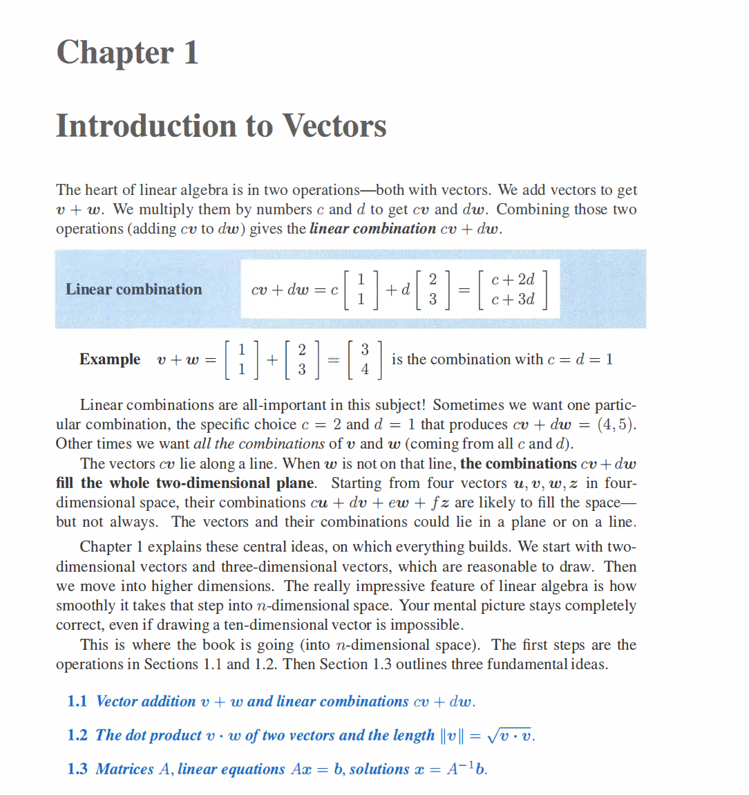
第1章导论笔记：向量与线性组合（Introduction to Vectors）
========================================

本页核心：**两类运算**——向量相加与标量乘法。将二者合并得到**线性组合**  $cv+dw$ 。几何上，单个向量的所有倍数在一条过原点的直线上；若再加入一个**不共线**的向量，则所有组合  $cv+dw$  **充满整个平面**。本章起步于二维、三维直观，再逐步推广到  $n$  维。

* * *

1\. 基本概念与符号
-----------

### 1.1 向量（vector）

*   记为列向量： $\displaystyle v=\begin{bmatrix}v_1\\v_2\end{bmatrix}$ （二维）， $\displaystyle v=\begin{bmatrix}v_1\\v_2\\v_3\end{bmatrix}$ （三维），更一般为  $\mathbb{R}^n$  中的  $n$  维向量。
*   **几何意义**：从原点指向  $(v_1,v_2)$ （或更高维的坐标）的有向线段，具有**方向**与**长度**。

### 1.2 向量加法与标量乘法

*   **加法**（逐分量相加）
    $$
    v+w=\begin{bmatrix}v_1\\v_2\end{bmatrix}+\begin{bmatrix}w_1\\w_2\end{bmatrix} =\begin{bmatrix}v_1+w_1\\v_2+w_2\end{bmatrix}.
    $$
    几何：**平行四边形法则**——从  $v$  尾部接上  $w$ ，或等价地取平行四边形的对角线。
*   **标量乘法**（伸缩/反向）
    $$
    c\,v=\begin{bmatrix}c\,v_1\\c\,v_2\end{bmatrix}.
    $$
    几何：将向量沿自身方向**缩放  $c$  倍**；若  $c<0$  同时方向反转。

* * *

2\. 线性组合与生成的集合（span）
--------------------

### 2.1 定义：线性组合

给定向量  $v,w$  与实数  $c,d$ ，

$$
cv+dw \quad\text{称为 } v,w \text{ 的线性组合}.
$$

**页中示例（逐行解析）：**

$$
cv+dw=c\begin{bmatrix}1\\1\end{bmatrix} +d\begin{bmatrix}2\\3\end{bmatrix} =\begin{bmatrix}c+2d\\ c+3d\end{bmatrix}.
$$
*   上式只是把“逐分量线性”写明白：第一分量  $c\cdot1+d\cdot2=c+2d$ ，第二分量  $c\cdot1+d\cdot3=c+3d$ 。

**加法示例（页眉“Example”框）：**

$$
v+w=\begin{bmatrix}1\\1\end{bmatrix}+\begin{bmatrix}2\\3\end{bmatrix} =\begin{bmatrix}3\\4\end{bmatrix},
$$

它对应线性组合里取  $c=d=1$ 。

### 2.2 一条直线与一个平面

*   **只有一个向量  $v$  的全部线性组合**： $\{cv:c\in\mathbb{R}\}$ 。  
    这是一条**过原点**、方向为  $v$  的直线。
*   **两个向量  $v,w$  的全部线性组合（记作  $\mathrm{span}\{v,w\}$ ）**：
    $$
    \{cv+dw:\; c,d\in\mathbb{R}\}.
    $$
    *   若  $w$  与  $v$  **共线**（ $w=\lambda v$ ），那么所有组合仍落在同一条直线上。
    *   若  $v,w$  **不共线**，这些组合将**填满整个二维平面**（更准确地说，是过原点的一个二维平面）。

> **本页结论**
> 
> *   当  $w$  不在  $v$  的直线上时， $\mathrm{span}\{v,w\}=\mathbb{R}^2$ 。
> *   在更高维中，从四个向量  $u,v,w,z$  出发，组合  $cu+dv+ew+fz$  通常会填满四维空间（但不总是——见“线性相关/无关”）。
>     

### 2.3 线性无关与“是否填满”

把线性组合写成矩阵-向量形式：

$$
cv+dw=\underbrace{\begin{bmatrix} \vline & \vline \\ v & w \\ \vline & \vline \end{bmatrix}}_{A} \begin{bmatrix}c\\ d\end{bmatrix}.
$$
*    $A$  的两列分别是  $v,w$ 。
*   若这两列**线性无关**（二维里就是**不共线**），则  $\mathrm{rank}(A)=2$ ，意味着
    $$
    \mathrm{span}\{v,w\}=\mathbb{R}^2,
    $$
    你可以用**任意目标向量**  $b\in\mathbb{R}^2$  唯一地解出  $(c,d)$  使得  $A\begin{bmatrix}c\\ d\end{bmatrix}=b$ 。
*   二维的快速判据：若
    $$
    A=\begin{bmatrix}v_1&w_1\\ v_2&w_2\end{bmatrix},\quad \det(A)=v_1w_2-v_2w_1\neq0,
    $$
    则  $v,w$  不共线，从而**张成整个平面**。

**把页内具体数值代入检验：**

$$
A=\begin{bmatrix}1&2\\1&3\end{bmatrix},\quad \det(A)=1\cdot3-1\cdot2=1\neq0.
$$

因此  $\{[1,1]^T,\,[2,3]^T\}$  是  $\mathbb{R}^2$  的一组**基**（basis），可以表示平面内任意向量。

**反求  $(c,d)$  的显式公式（便于直觉与计算）：**  
若

$$
\begin{bmatrix}x\\y\end{bmatrix} =c\begin{bmatrix}1\\1\end{bmatrix} +d\begin{bmatrix}2\\3\end{bmatrix} =\begin{bmatrix}c+2d\\c+3d\end{bmatrix},
$$

则  
   $\;y-x=d\Rightarrow d=y-x$ ，  
   $\;c=x-2d=x-2(y-x)=3x-2y$ 。  
所以

$$
(c,d)=(\,3x-2y,\;y-x\,).
$$

这说明任意点  $(x,y)$  都能唯一写成该两向量的线性组合。

* * *

3\. 更高维的直观推广
------------

*   **三维**：单个向量 → 过原点的直线；两个不共线向量 → 过原点的**平面**；若加入第三个不在该平面内的向量，则三者的线性组合**充满整个三维空间**。  
    （三维里判别“两个向量是否共线”仍旧看是否成比例；判别“第三个是否出平面”可用三列行列式或向量积。）
*   ** $n$  维**：若有  $k$  个向量彼此线性无关，则它们张成一个  $k$  维子空间；当  $k=n$  时就能表示整个  $\mathbb{R}^n$ 。

* * *

4\. 与后续小节的关联（页面最下方目录提示）
-----------------------

*   **1.1**：继续巩固向量加法与线性组合  $cv+dw$ ，从几何与代数双角度理解“张成（span）”与“直线/平面”。
*   **1.2**：转向**点积**（内积）与向量长度  $\|v\|=\sqrt{v\cdot v}$ ，建立垂直、角度与投影的度量基础。
*   **1.3**：把线性组合写成矩阵方程  $A x=b$ ，讨论“解的存在唯一性”（如  $A^{-1}b$ ）与列空间/行空间的视角。

* * *

5\. 练习与进一步思考（配合本页内容）
--------------------

1.  设  $v=[1,1]^T,\,w=[2,3]^T$ 。  
    (a) 写出所有  $(x,y)$  可达的参数方程；(b) 用行列式解释为何可达整个  $\mathbb{R}^2$ ；  
    (c) 把  $[5,7]^T$  写成  $cv+dw$ （用上面的反求公式即可得到  $c=3\cdot5-2\cdot7=1,\; d=7-5=2$ ）。
2.  给定共线的  $v=[1,2]^T$  与  $w=[2,4]^T$ 。证明  $\mathrm{span}\{v,w\}$  只是一条直线，并给出该直线的表达式。
3.  在  $\mathbb{R}^3$  中任选两个不共线向量  $v,w$ ，描述  $\mathrm{span}\{v,w\}$  的几何对象，并给出其参数化表示。

* * *

6\. 小结
------

*   **线性组合**  $cv+dw$  是线性代数的核心构件，统一了“相加”“缩放”两种基本运算。
*   **几何图景**：
    *   单向量 → 过原点直线；
    *   两个不共线向量 → 过原点平面；
    *   更高维依此类推。
*   **代数判据**：二维用**行列式**，一般情形用**秩/线性无关**判断是否“填满”空间。
*   这些概念在 1.3 会自然过渡为矩阵形式  $A x=b$ ，连接到**解的存在性与唯一性**、**列空间**等重要主题。

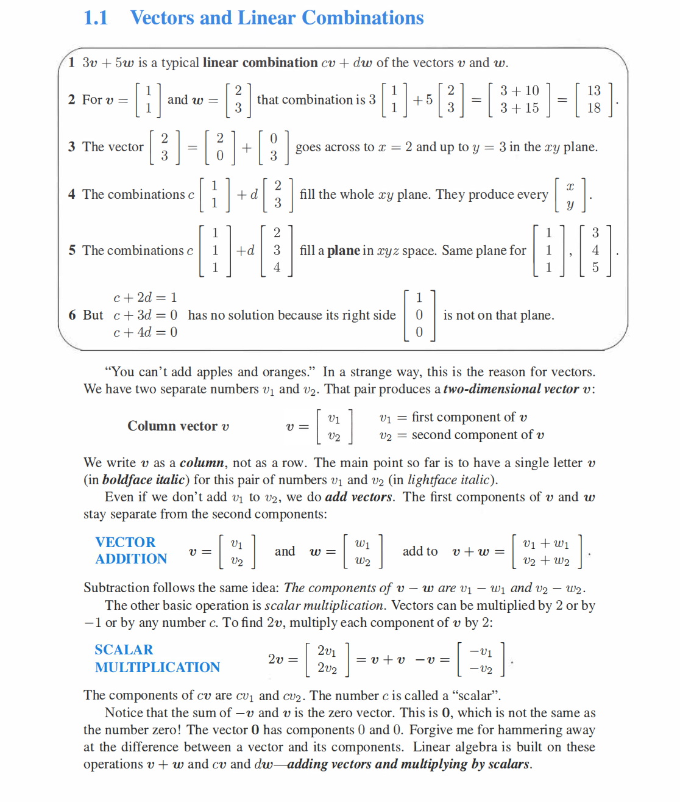

## 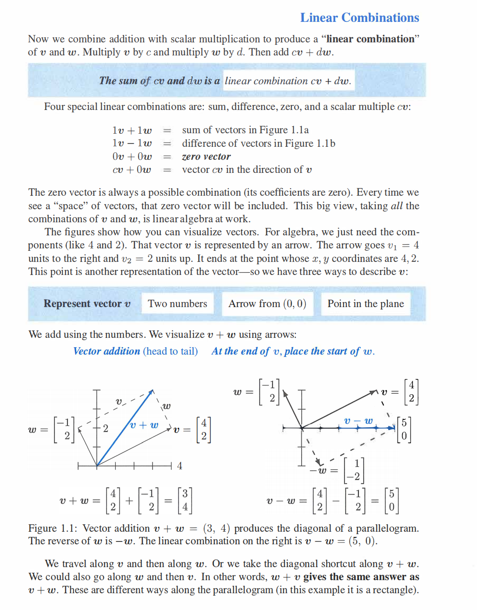
1.1 向量与线性组合（Vectors and Linear Combinations）
============================================

本节把两种最基本运算——**向量相加**与**标量乘法**——合并成核心概念**线性组合**  $cv+dw$ 。几何直觉：

*   单个向量的所有倍数是一条**过原点的直线**；
*   两个**不共线**向量的所有组合**铺满整个平面**；
*   三维里两个不共线的向量铺满**一张过原点的平面**。  
    代数直觉：把要表达的向量  $b$  写成矩阵方程  $[v\; w]\begin{bmatrix}c\\ d\end{bmatrix}=b$ 。是否可解，取决于两列是否线性无关（秩/行列式）。

* * *

A. 逐条解读（书页编号 1–6）
-----------------

**1)**  $3v+5w$  是  $v,w$  的一个**典型线性组合**。一般地，对任意实数  $c,d$ ，

$$
cv+dw=\begin{bmatrix}c\,v_1+d\,w_1\\ c\,v_2+d\,w_2\end{bmatrix}.
$$

推广到  $k$  个向量： $\sum_{i=1}^k \alpha_i v^{(i)}$ 。

**2)** 例： $v=\begin{bmatrix}1\\1\end{bmatrix},\;w=\begin{bmatrix}2\\3\end{bmatrix}$ 

$$
3v+5w=3\!\begin{bmatrix}1\\1\end{bmatrix}+5\!\begin{bmatrix}2\\3\end{bmatrix} =\begin{bmatrix}3+10\\3+15\end{bmatrix} =\begin{bmatrix}13\\18\end{bmatrix}.
$$

把所有组合写成映射  $(c,d)\mapsto(x,y)$ ：

$$
\begin{bmatrix}x\\y\end{bmatrix}=\begin{bmatrix}1&2\\1&3\end{bmatrix}\!\begin{bmatrix}c\\d\end{bmatrix} =\begin{bmatrix}c+2d\\c+3d\end{bmatrix}.
$$

行列式  $1\cdot3-1\cdot2=1\neq0\Rightarrow$  可逆，因此任意  $(x,y)$  都能唯一写成该两向量的线性组合。反求系数：

$$
d=y-x,\qquad c=3x-2y.
$$

**3)**  $\begin{bmatrix}2\\3\end{bmatrix}=\begin{bmatrix}2\\0\end{bmatrix}+\begin{bmatrix}0\\3\end{bmatrix}$ 。  
这是在用**标准基**  $e_1=[1,0]^T,\, e_2=[0,1]^T$  分解： $[2,3]^T=2e_1+3e_2$ 。几何上“沿  $x$  轴走 2，再沿  $y$  轴走 3”。

**4)** 所有组合  $c[1,1]^T+d[2,3]^T$  **充满整个  $xy$  平面**（即  $\mathbb{R}^2$ ）。理由同上：两列不共线  $\Rightarrow$  张成（span） $\mathbb{R}^2$ 。

**5)** 在三维里， $c[1,1,1]^T+d[2,3,4]^T$  **铺满一张过原点的平面**。把

$$
\begin{cases} x=c+2d\\ y=c+3d\\ z=c+4d \end{cases}
$$

消去  $c,d$ ：由  $y-x=d$  与  $z-y=d$  得

$$
\boxed{\,x-2y+z=0\,}\quad(\text{或 }2y=x+z).
$$

这就是该平面的方程。检验两向量  $[1,1,1]^T$  与  $[3,4,5]^T$  均满足  $x-2y+z=0$ ，因此它们与一切组合都落在这同一平面上。

**6)** 若试图用这两列表示  $b=\begin{bmatrix}1\\0\\0\end{bmatrix}$ ，方程

$$
\begin{bmatrix}1&2\\1&3\\1&4\end{bmatrix}\!\begin{bmatrix}c\\d\end{bmatrix} =\begin{bmatrix}1\\0\\0\end{bmatrix}
$$

**无解**，因为  $b$  不在上述平面  $x-2y+z=0$  上（代入得  $1-0+0=1\neq0$ ）。这正是“列空间=由列向量张成的平面；不在列空间  $\Rightarrow$  无解”的首个例子。

* * *

B. “为什么要向量？”与列向量记法
------------------

“**不能把苹果和橘子相加**”——一个数  $v_1$  和另一个数  $v_2$  代表不同方向的量（如水平与竖直位移），需要作为一对数据保留其结构：

$$
\text{列向量 } v=\begin{bmatrix}v_1\\ v_2\end{bmatrix}.
$$

我们**写成列**（而非行）是为了与矩阵乘法、线性方程  $Ax=b$  自然对接——矩阵的**列**正是“生成向量”的集合。

* * *

C. 两种基本运算（含几何与代数）
-----------------

### 1) 向量加法（平行四边形法则）

$$
v=\begin{bmatrix}v_1\\v_2\end{bmatrix},\quad w=\begin{bmatrix}w_1\\w_2\end{bmatrix}\quad\Rightarrow\quad v+w=\begin{bmatrix}v_1+w_1\\ v_2+w_2\end{bmatrix}.
$$

几何：把  $w$  的**起点放在  $v$  的终点**（或反过来），对角线即  $v+w$ 。

### 2) 标量乘法与负向量

$$
c\,v=\begin{bmatrix}c\,v_1\\ c\,v_2\end{bmatrix},\qquad -\,v=\begin{bmatrix}-v_1\\-v_2\end{bmatrix}.
$$

 $-v$  方向相反、长度相等；**减法**是加上负向量： $v-w=v+(-w)$ 。

### 3) 零向量  $\mathbf{0}$ 

$$
\mathbf{0}=0\,v=0\,w=\begin{bmatrix}0\\0\end{bmatrix}\quad(\text{在二维}).
$$

**注意**： $\mathbf{0}$ （向量）与数字  $0$ （标量）不同； $\mathbf{0}$  有分量结构。

* * *

D. 线性组合再阐明
----------

把加法与标量乘法“合成”得到

$$
\boxed{\;\text{线性组合 } cv+dw\;}
$$

四个特别的组合：

*   **和**  $v+w$ （系数  $1,1$ ）；
*   **差**  $v-w$ （系数  $1,-1$ ）；
*   **零向量**  $0v+0w$ ；
*   **标量倍数**  $cv$ （另一向量系数为 0）。  
    “所有可能的  $(c,d)$ ”构成的集合就是  $\mathrm{span}\{v,w\}$ ；这正是“线性代数看世界”的方式。

* * *

E. 图 1.1 的数值与几何解析
-----------------

图中取  $v=\begin{bmatrix}4\\2\end{bmatrix},\; w=\begin{bmatrix}-1\\2\end{bmatrix}$ 。

**1) 加法（左图）**

$$
v+w=\begin{bmatrix}4+(-1)\\2+2\end{bmatrix} =\begin{bmatrix}3\\4\end{bmatrix}.
$$

两条边  $v$  与  $w$  生成的平行四边形的对角线就是和向量。走“先  $v$  后  $w$ ”或“先  $w$  后  $v$ ”终点一致，体现**交换律**。

**2) 差（右图）**

$$
v-w=v+(-w)=\begin{bmatrix}4\\2\end{bmatrix}-\begin{bmatrix}-1\\2\end{bmatrix} =\begin{bmatrix}5\\0\end{bmatrix}.
$$

把  $-w=[1,-2]^T$  接到  $v$  端点，得到在  $x$  轴上的向量（水平位移 5、竖直位移 0）。

**3) 三种表述方式一致**  
同一向量可以描述为两数  $(v_1,v_2)$ 、从  $(0,0)$  出发的箭头、或平面上的点  $(v_1,v_2)$ 。代数与几何一一对应。

* * *

F. 与后续  $Ax=b$  的桥接
-------------------

把两个生成向量作为列拼成矩阵  $A=[v\; w]$ 。

*   **解存在**  $\Leftrightarrow$   $b$  在 **列空间**（由列张成的子空间）里；
*   **唯一性**  $\Leftrightarrow$  列线性无关（二维里就是不共线， $\det A\neq0$ ）。  
    本节末的无解例子正是“ $b$  不在列空间”的第一眼见识。

* * *

本节小结
----

1.  线性组合  $cv+dw$  是线性代数的原子操作。
2.  几何：一个向量→直线；两个不共线→平面；三维同理。
3.  代数：判断是否“铺满”看线性无关/秩；二维可用行列式。
4.  矩阵视角：是否能解  $Ax=b$  取决于  $b$  是否在列空间。


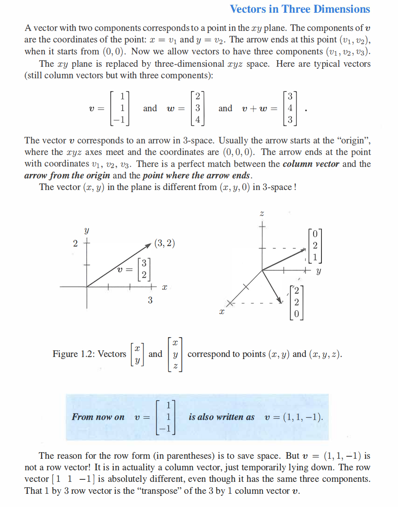


三维向量与线性组合（Vectors in Three Dimensions）
======================================

**概览**：把二维的向量  $(v_1,v_2)$  扩展到三维  $(v_1,v_2,v_3)$ 。向量既可以看作**从原点出发的箭头**，也可以等价地看作**点**的坐标（箭头的终点）。加法仍是**按分量相加**，标量乘法仍是**按分量缩放**，二者合在一起得到**线性组合**。两个不共线的向量在三维中仍只生成一张**平面**；若要“铺满”三维，需要三个线性无关的向量。

* * *

1\. 三维向量的表示与例子
--------------

*   **列向量表示**： $\displaystyle v=\begin{bmatrix}v_1\\v_2\\v_3\end{bmatrix}$ 。书中例子
    $$
    v=\begin{bmatrix}1\\1\\-1\end{bmatrix},\qquad w=\begin{bmatrix}2\\3\\4\end{bmatrix}.
    $$
*   **加法仍逐分量进行**：
    $$
    v+w=\begin{bmatrix}1+2\\1+3\\-1+4\end{bmatrix} =\begin{bmatrix}3\\4\\3\end{bmatrix}.
    $$
*   **箭头与点的一一对应**：箭头从  $(0,0,0)$  指向  $(v_1,v_2,v_3)$ 。因此  $\begin{bmatrix}x\\y\\z\end{bmatrix}$  与空间点  $(x,y,z)$  是同一个几何对象的两种写法。

> ⚠️ **(x,y) 与 (x,y,0) 不同**：前者是二维平面里的点/向量；后者是三维空间里**z=0 平面**上的点/向量。它们生活在不同的空间，不能混为一谈。

*   **写法省略**：书里把
    $$
    v=\begin{bmatrix}1\\1\\-1\end{bmatrix}\quad\text{也写作}\quad v=(1,1,-1)
    $$
    这只是为了**省空间**。它依然代表**列向量**。而**行向量**  $[\,1\;1\;-1\,]$  是另一个对象，是列向量的转置  $v^\top$ 。

* * *

2\. 三维中的加法、平行四边形与“仍在同一平面内”
--------------------------

*   **按分量相加的普适性**：三维、四维、乃至  $n$  维都一样
    $$
    (v_1,\dots,v_n)+(w_1,\dots,w_n)=(v_1+w_1,\dots,v_n+w_n).
    $$
*   **几何直觉**：把  $w$  的起点放到  $v$  的终点，得到第三边  $v+w$ ；若交换顺序得到  $w+v$ 。这四条边组成一个**平行四边形**。
*   **关键问题**：这四条边都在同一个平面里吗？**是的**。原因：它们都是  $v$  与  $w$  的线性组合  $a\,v+b\,w$ 。两个向量的全体组合
    $$
    \operatorname{span}\{v,w\}=\{a\,v+b\,w:\;a,b\in\mathbb{R}\}
    $$
    在三维中是一张**过原点的平面**（当  $v,w$  不共线时）。因此平行四边形完全落在这张平面上。
*   **环绕一圈得到零向量**：
    $$
    v+w-v-w=\mathbf{0}=\begin{bmatrix}0\\0\\0\end{bmatrix},
    $$
    表示沿着  $v$  和  $w$  走一圈又回到原点——这也是“负向量是反向同长”的直观体现。

* * *

3\. 三个向量的线性组合示例（书中算例）
---------------------

要计算

$$
u+4v-2w,\qquad u=\begin{bmatrix}1\\0\\3\end{bmatrix},\; v=\begin{bmatrix}1\\2\\1\end{bmatrix},\; w=\begin{bmatrix}2\\3\\-1\end{bmatrix}.
$$

**分步**：

1.  乘系数
    $$
    1u=\begin{bmatrix}1\\0\\3\end{bmatrix},\quad 4v=\begin{bmatrix}4\\8\\4\end{bmatrix},\quad -2w=\begin{bmatrix}-4\\-6\\2\end{bmatrix}.
    $$
2.  相加
    $$
    \begin{bmatrix}1\\0\\3\end{bmatrix} +\begin{bmatrix}4\\8\\4\end{bmatrix} +\begin{bmatrix}-4\\-6\\2\end{bmatrix} =\boxed{\begin{bmatrix}1\\2\\9\end{bmatrix}}.
    $$

**矩阵视角**：把三向量作为列组成

$$
A=\big[u\;v\;w\big] =\begin{bmatrix} 1&1&2\\ 0&2&3\\ 3&1&-1 \end{bmatrix}, \quad u+4v-2w=A\begin{bmatrix}1\\4\\-2\end{bmatrix}.
$$

这就是线性组合与矩阵乘法的统一写法。

* * *

4\. “三维填满”的条件（与上一节的联系）
----------------------

*   两个不共线向量  $\Rightarrow$  张成一张**平面**；
*   要张成整个  $\mathbb{R}^3$ ，需要**三个线性无关**的向量（矩阵三列秩为 3）。  
    这与上一页“二维里两向量不共线即可铺满平面”的结论完全对应。

* * *

5\. 易错点与检查题
-----------

*   **行/列向量别混**： $(1,1,-1)$  只是列向量的紧凑写法； $[1\;1\;-1]$  是行向量  $v^\top$ 。
*   **(x,y) vs (x,y,0)**：维度不同，空间不同。
*   **练习**：
    1.  设  $v=(1,1,-1), w=(2,3,4)$ 。把 $(x,y,z)=(5,0,1)$  写成  $a v+b w$  是否可行？（解  $a,b$  会发现无解，因为  $(5,0,1)$  不在  $\operatorname{span}\{v,w\}$  的平面上。）
    2.  给三个向量  $u,v,w$ ，写成矩阵  $A=[u\;v\;w]$ 。判断是否能够“铺满”三维  $\Leftrightarrow \det A\neq0$ （或秩为 3）。

* * *

小结
--

*   三维中，向量仍是“箭头=点=列向量”的同一事物；加法与标量乘法按分量进行。
*   线性组合  $a\,v+b\,w$  只在  $v,w$  张成的**平面**里活动；  $\,v+w-v-w=\mathbf 0$  体现向量加法的群结构。
*   多个向量的线性组合可写成矩阵乘法  $A\alpha$ ，为后续  $Ax=b$  铺路。


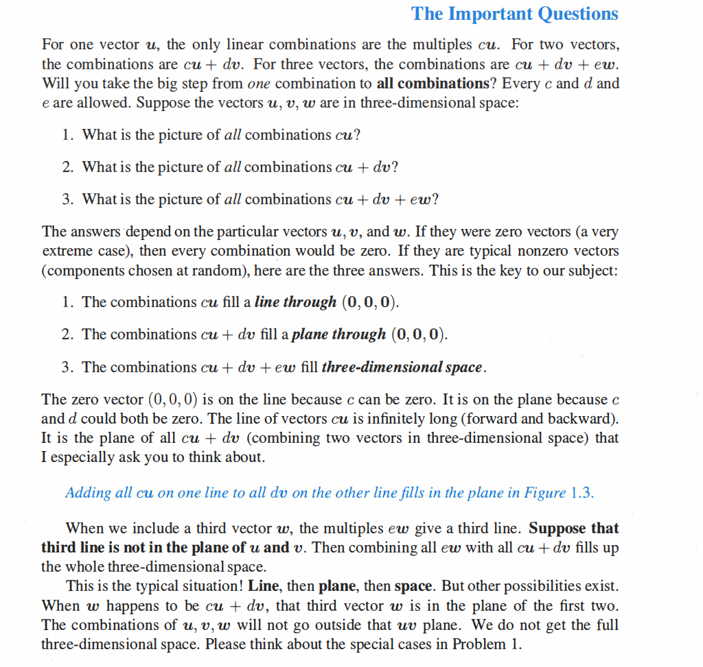

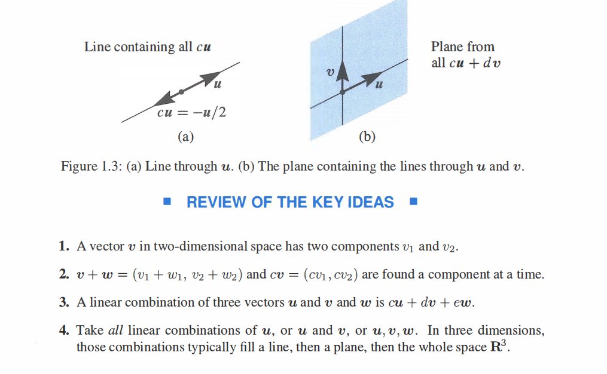

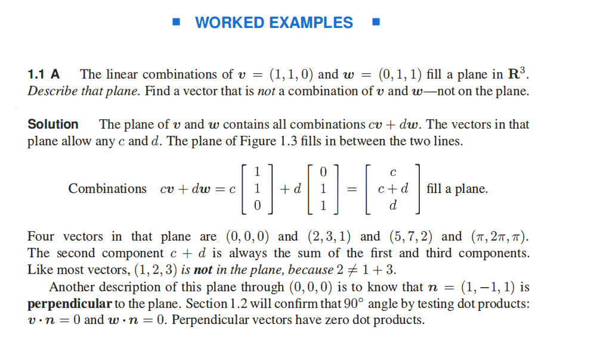

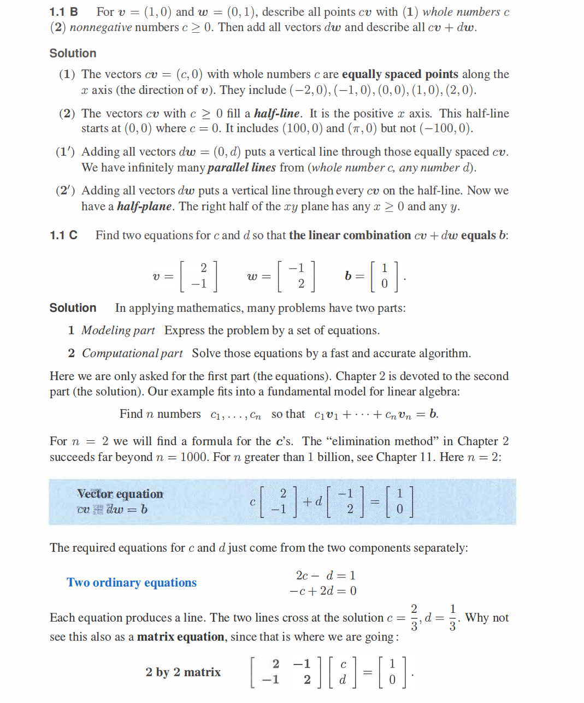

1.1 重要问题与例题精讲（线性组合→直线 / 平面 / 空间）
================================

本节回答三个“**从一条线到整个空间**”的关键问题，并通过 1.1A–C 三个例题，把**线性组合—参数化—方程—矩阵**这条主线打通。

* * *

一、三问三答：从一个向量到三个向量
-----------------

设在三维空间给定向量  $u,v,w$ 。

**Q1. 所有组合  $c\,u$  的图像是什么？**

*   是一条**过原点**的直线（方向为  $u$ ）。因为  $c\in\mathbb{R}$  可以正负任取，零向量  $\mathbf 0$  也包含在内（取  $c=0$ ）。

**Q2. 所有组合  $c\,u+d\,v$  的图像是什么？**

*   **通常**是一张**过原点的平面**（当  $u,v$  不共线时）。
*   直观理解：一条线装下所有  $c\,u$ ，另一条线装下所有  $d\,v$ 。把这两条线上的向量两两相加，就把**整张平面**“填满”（图 1.3(b)）。

**Q3. 所有组合  $c\,u+d\,v+e\,w$  的图像是什么？**

*   **典型情况**：若  $w$  **不在**  $\operatorname{span}\{u,v\}$  的平面内，则三者**张成整个  $\mathbb{R}^3$ **。
*   **特殊情况**：若  $w$  **在**该平面内，那么所有组合仍**只在那张平面**，不会“跃出”到整个三维空间。

> 小结（维数直觉）：  
> 1 向量 → 1 维直线；2 个（不共线）→ 2 维平面；3 个（线性无关）→ 3 维空间。  
> “线性无关”是后面用秩/行列式判别的核心词。

**图 1.3 解释**

*   (a) 直线中任一点都是  $c\,u$ （比如图上的  $c=-\tfrac12$ ）。
*   (b) 两条通过原点的直线（方向  $u$  与  $v$ ）所在的**整张平面**就是  $\mathrm{span}\{u,v\}$ 。

* * *

二、关键思想回顾（书页蓝点 1–4 对应解释）
-----------------------

1.  二维向量  $v$  只有两分量  $v_1,v_2$ ；三维则是  $v_1,v_2,v_3$ 。
2.  加法与标量乘法都**逐分量**进行：
    $$
    v+w=(v_1+w_1,\;v_2+w_2),\qquad c\,v=(c v_1,\; c v_2).
    $$
3.  三个向量的线性组合写作  $c\,u+d\,v+e\,w$ 。
4.  取**所有**线性组合形成  $\mathrm{span}$ ：在  $\mathbb{R}^3$  里，通常依次得到**线→平面→整个空间**。

* * *

三、Worked Example 1.1A
---------------------

**题意**：已知

$$
v=(1,1,0),\quad w=(0,1,1),
$$

它们的所有线性组合  $cv+dw$  填满  $\mathbb{R}^3$  中的一张平面。  
(1) **描述这张平面**；(2) 找到一个**不在**这张平面上的向量。

**解题主线：参数化  $\to$  平面方程  $\to$  法向量  $\to$  例证**

1.  **参数化**（直接把组合写开）
    
$$
cv+dw=c\!\begin{bmatrix}1\\1\\0\end{bmatrix}+d\!\begin{bmatrix}0\\1\\1\end{bmatrix} =\begin{bmatrix}c\\ c+d\\ d\end{bmatrix} =\begin{bmatrix}x\\ y\\ z\end{bmatrix}.
$$

因此

$$
x=c,\qquad y=c+d,\qquad z=d.
$$
2.  **消参得到平面方程**  
    由上得  $y=x+z$ 。等价写法：
    
$$
x - y + z = 0.
$$

这就是该平面（过原点）的**显式方程**。

3.  **法向量**  
    把方程改成  $\langle (x,y,z),(1,-1,1)\rangle=0$ ，可见
    
$$
n=(1,-1,1)
$$

是这张平面的**法向量**。验证：  
 $v\cdot n=1-1+0=0,\; w\cdot n=0-1+1=0$ 。

4.  **判别某向量是否在平面上**  
    比如  $(1,2,3)$  不在平面上，因为  $2\neq 1+3$ 。  
    在平面上的例子（任取  $c,d$ ）： $(0,0,0),(2,3,1),(5,7,2),(\pi,2\pi,\pi)$ 。

* * *

四、Worked Example 1.1B
---------------------

**题意**：在二维中令  $v=(1,0),\,w=(0,1)$ 。描述集合  
(1)  $c\in\mathbb{Z}$ （整数）时的所有  $c\,v$ ；  
(2)  $c\ge 0$  时的所有  $c\,v$ ；  
再对这两种情形分别“加上所有  $d\,w$ ”并描述  $cv+dw$ 。

**逐步说明**

1.  **整数  $c$ **：  
     $c\,v=(c,0)$  是  $x$  轴上**等间距的离散点列**： $\ldots,(-2,0),(-1,0),(0,0),(1,0),(2,0),\ldots$ 
    **加上所有  $d\,w=(0,d)$ **：  
    把这条离散“母线”沿  $y$  方向**平移任意实数**，得到**无限多条彼此平行的竖直线**（每个整数  $c$  对应一条  $x=c$  直线）。
2.  **非负  $c\ge 0$ **：  
     $c\,v=(c,0)$  构成**半直线**（含原点、朝正  $x$  方向），允许任意非负实数（因此像  $(\pi,0)$  也在内但  $(-100,0)$  不在）。
    **加上所有  $d\,w=(0,d)$ **：  
    把这条半直线沿  $y$  方向任意平移，得到**右半平面**：
    $$
    \{(x,y): x\ge 0,\; y\in\mathbb{R}\}.
    $$

> 这道题很好地对比了：  
> **离散参数（整数）→ 一族平行直线** vs. **连续参数（实数区间）→ 整个半平面**。

* * *

五、Worked Example 1.1C
---------------------

**题意**：求  $c,d$ ，使

$$
c\,v+d\,w=b,\qquad v=\begin{bmatrix}2\\-1\end{bmatrix},\; w=\begin{bmatrix}-1\\2\end{bmatrix},\; b=\begin{bmatrix}1\\0\end{bmatrix}.
$$

**第一步（建模）**：写成向量等式

$$
c\!\begin{bmatrix}2\\-1\end{bmatrix} +d\!\begin{bmatrix}-1\\2\end{bmatrix} =\begin{bmatrix}1\\0\end{bmatrix}.
$$

**第二步（按分量分解成两元一次方程组）**

$$
\begin{cases} 2c-d=1,\\ -c+2d=0. \end{cases}
$$

**求解**（代入/消元/克拉默法则均可）

*   由第二式  $c=2d$ ，代回第一式得  $4d-d=1\Rightarrow d=\tfrac13$ ，
*   进而  $c=\tfrac23$ 。

**矩阵形式**（为第 2 章的消元法铺路）

$$
\underbrace{\begin{bmatrix}2&-1\\-1&2\end{bmatrix}}_{A} \begin{bmatrix}c\\ d\end{bmatrix} =\begin{bmatrix}1\\ 0\end{bmatrix}.
$$

行列式  $\det A=2\cdot2-(-1)\cdot(-1)=3\neq0\Rightarrow$  唯一解  
 $\displaystyle (c,d)=\left(\tfrac23,\tfrac13\right)$ 。

**几何意义**：

*    $A$  的两列  $v,w$  不共线， $\Rightarrow$   $\mathrm{span}\{v,w\}=\mathbb{R}^2$ ，所以任何目标  $b$  都可唯一表示为  $cv+dw$ 。

* * *

六、贯通图景（把四种视角连起来）
----------------

1.  **线性组合（参数）**： $(c,d,e)$  是“配方”。
2.  **几何**：得到直线/平面/空间。
3.  **方程**：消去参数得到隐式方程（如  $y=x+z$ ）。
4.  **矩阵**：把生成向量作列，问题写成  $A\alpha=b$ ，是否可解看  $b$  是否在**列空间**，是否唯一看列是否**线性无关**（秩/行列式）。

* * *

本次小结
----

*   **一个、两个、三个向量**在三维里典型地张成**线、平面、空间**；“是否到达更高维”取决于**线性无关**。
*   例题 1.1A：用参数和法向量两种方式描述同一平面，平面方程  $y=x+z$ ；(1,2,3) 不在其内。
*   例题 1.1B：离散  $c\in\mathbb{Z}$  产生**一族平行线**；连续  $c\ge0$  产生**右半平面**。
*   例题 1.1C：把向量等式拆成**分量方程**或写成**矩阵方程**，求解得到  $(c,d)=\big(\tfrac23,\tfrac13\big)$ 。


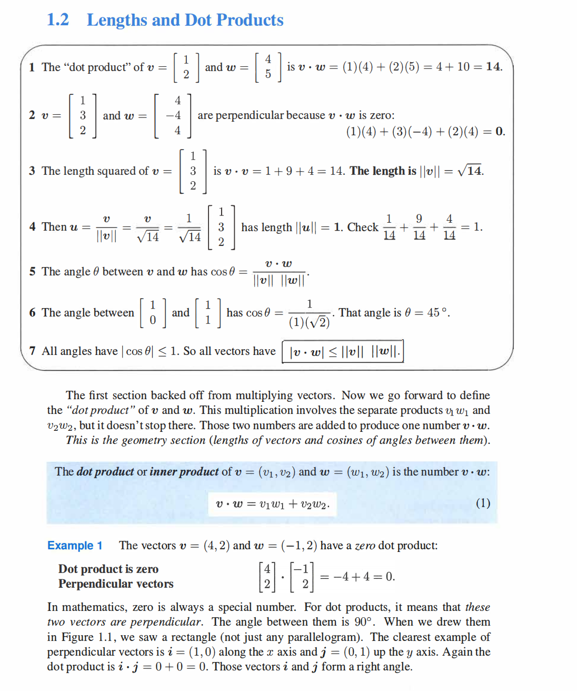

## 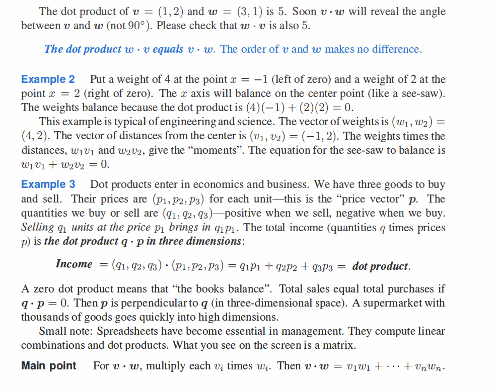
1.2 向量长度与点积（Lengths and Dot Products）
=====================================

**概览**：本节把“相加与缩放”的代数结构，连接到**长度**与**角度**的几何度量。核心工具是**点积**（内积）

$$
v\cdot w=\sum_i v_i w_i,
$$

它一举给出：

1.  向量长度  $\|v\|=\sqrt{v\cdot v}$ ；
2.  正交（垂直）判据  $v\cdot w=0$ ；
3.  夹角公式  $\cos\theta=\dfrac{v\cdot w}{\|v\|\,\|w\|}$ ；
4.  基本不等式  $|v\cdot w|\le \|v\|\|w\|$ （柯西–施瓦茨）。

* * *

A. 点积的定义与基本运算
-------------

### A1. 定义（任意维）

$$
v=(v_1,\dots,v_n),\quad w=(w_1,\dots,w_n) \quad\Longrightarrow\quad v\cdot w=v_1w_1+\cdots+v_nw_n.
$$

**顺序无关**： $v\cdot w=w\cdot v$ 。  
**对加法与标量的分配/线性**：

$$
\begin{aligned} v\cdot(w+z)&=v\cdot w+v\cdot z,\\ (\alpha v)\cdot w&=\alpha(v\cdot w). \end{aligned}
$$

### A2. 例子（与书页对应）

1.   $v=\begin{bmatrix}1\\2\end{bmatrix}$ ,  $w=\begin{bmatrix}4\\5\end{bmatrix}$   
     $\displaystyle v\cdot w=1\cdot4+2\cdot5=14$ .
2.   $v=\begin{bmatrix}1\\3\\2\end{bmatrix}$ ,  $w=\begin{bmatrix}4\\-4\\4\end{bmatrix}$   
     $\displaystyle v\cdot w=4-12+8=0\Rightarrow v\perp w$ （**零点积⇔垂直**）。
3.   $v=\begin{bmatrix}1\\3\\2\end{bmatrix}$  的长度平方  
     $\displaystyle v\cdot v=1+9+4=14\Rightarrow\|v\|=\sqrt{14}$ .

* * *

B. 长度、单位向量与标准化
--------------

### B1. 长度（欧氏范数）

$$
\|v\|=\sqrt{v\cdot v}=\sqrt{v_1^2+\cdots+v_n^2}\quad(\ge0).
$$

 $\|v\|=0$  当且仅当  $v=\mathbf 0$ 。

### B2. 单位向量与标准化

$$
u=\frac{v}{\|v\|}\quad(\|v\|\neq0)\quad\Rightarrow\quad \|u\|=1.
$$

书页检验： $\displaystyle u=\frac1{\sqrt{14}}\!\begin{bmatrix}1\\3\\2\end{bmatrix}$ ，  
 $\|u\|^2=\frac{1}{14}(1+9+4)=1$ 。

* * *

C. 角度与余弦公式（推导到位）
----------------

### C1. 夹角定义

令  $\theta$  为  $v,w$  的夹角（取  $0^\circ$ – $180^\circ$ ）。**基本公式**：

$$
\boxed{\;\cos\theta=\frac{v\cdot w}{\|v\|\,\|w\|}\;}
$$

> **推导**（法则一致）  
>  $\|v-w\|^2=(v-w)\cdot(v-w)=\|v\|^2+\|w\|^2-2\,v\cdot w$ 。  
> 另一方面由余弦定理： $\|v-w\|^2=\|v\|^2+\|w\|^2-2\|v\|\|w\|\cos\theta$ 。  
> 对比得  $\cos\theta=\dfrac{v\cdot w}{\|v\|\,\|w\|}$ 。

### C2. 例子

*    $\begin{bmatrix}1\\0\end{bmatrix}$  与  $\begin{bmatrix}1\\1\end{bmatrix}$ ：  
     $\displaystyle \cos\theta=\frac{1\cdot1+0\cdot1}{1\cdot\sqrt2}=\frac1{\sqrt2}\Rightarrow\theta=45^\circ$ .
*    $v=(4,2),\;w=(-1,2)$ ： $v\cdot w=0\Rightarrow\theta=90^\circ$  正交。

* * *

D. 柯西–施瓦茨与其几何含义
---------------

### D1. 不等式本体

$$
\boxed{\;|v\cdot w|\le \|v\|\,\|w\|\;}
$$

等号当且仅当  $v,w$  **共线**。

**一行证明**：对任意实数  $t$ ，有  $\|v-tw\|^2\ge0$ 。  
展开得  $\|v\|^2-2t(v\cdot w)+t^2\|w\|^2\ge0$  是关于  $t$  的二次式，对一切  $t$  非负 ⇒ 判别式  $\le0$ ，即  $(v\cdot w)^2\le\|v\|^2\|w\|^2$ 。

### D2. 几何意义

 $|\cos\theta|\le1$  等价于上式；当  $\theta=0^\circ$  或  $180^\circ$ （同向/反向）取等号。

* * *

E. 应用视角（与书页例 1–3 对应）
--------------------

### E1. 几何/坐标轴：i 与 j 正交

标准基  $i=(1,0)$ 、 $j=(0,1)$ ， $i\cdot j=0\Rightarrow$  直角坐标轴。

### E2. 力矩/跷跷板（二维）

**权重向量**  $w=(w_1,w_2)=(4,2)$ ，**“距离”向量**  $v=(v_1,v_2)=(-1,2)$ 。  
平衡条件：**力矩和为零**  $w_1v_1+w_2v_2=0 \iff w\cdot v=0$ 。  
工程里，“与某方向的投影为零”常转化为一个**零点积条件**。

### E3. 经济学（价格×数量）

价格向量  $p=(p_1,p_2,p_3)$ ，数量向量  $q=(q_1,q_2,q_3)$ （卖为正、买为负）。  
**总收入/净额**： $\text{Income}=q\cdot p$ 。  
若  $q\cdot p=0$ ，表示“**收支相抵**”（卖出的收入与买入的支出抵消），同时在三维几何上意味着  $q\perp p$ 。

> 小例： $q=(3,-2,5),\;p=(4,1,2)\Rightarrow q\cdot p=12-2+10=20$ 。

* * *

F. 与后续内容的衔接
-----------

*   **投影/分解**：利用  $\cos\theta$  与点积可得  $v$  在  $w$  方向的投影  $\text{proj}_w v=\dfrac{v\cdot w}{\|w\|^2}w$ （下一节常用）。
*   **矩阵与正交**：正交基的列向量满足两两点积为 0，长度为 1 时得到**正交规范基**，后续构造  $Q^\top Q=I$ 。

* * *

小结
--

1.  **点积**：分量相乘后求和；满足交换与分配，对标量线性。
2.  **长度**： $\|v\|=\sqrt{v\cdot v}$ ；**单位化**  $u=v/\|v\|$ 。
3.  **垂直判据**： $v\cdot w=0\Leftrightarrow v\perp w$ （至少在欧氏几何中）。
4.  **夹角**： $\cos\theta=\dfrac{v\cdot w}{\|v\|\|w\|}$ ；由此得  $|v\cdot w|\le\|v\|\|w\|$ 。
5.  **应用**：平衡（力矩和零）、收支（价格·数量）、以及后续的投影/正交分解。


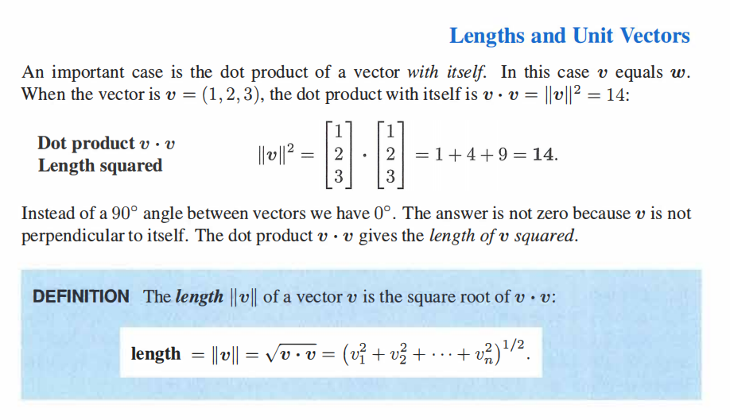

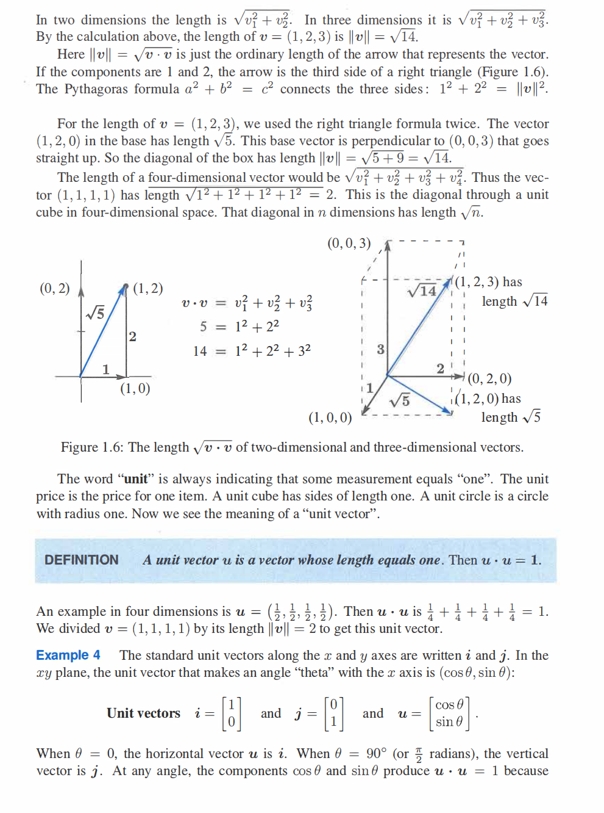

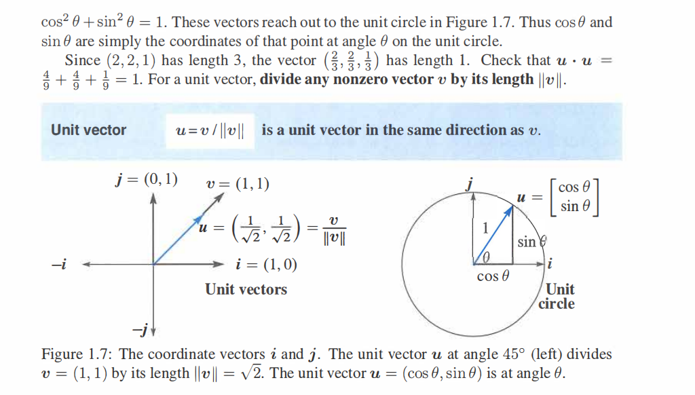

1.2 向量长度与单位向量（Lengths and Unit Vectors）
=======================================

本节把“点积”与“长度、单位向量、单位圆/球”彻底连起来：**自乘点积给出长度的平方**  $\|v\|^2=v\cdot v$ ；**单位化**  $u=\dfrac{v}{\|v\|}$  产生与  $v$  同方向、长度为 1 的向量；在二维里，**与  $x$  轴夹角为  $\theta$  的单位向量**可写成  $(\cos\theta,\sin\theta)$ 。

* * *

一、逐条精讲（对应三张截图的全部要点）
-------------------

### A. “点积与自身”＝“长度平方”

*   **关键公式**：
    $$
    \boxed{\ \|v\|^2=v\cdot v=\sum_{i=1}^n v_i^2\ }
    $$
    例： $v=(1,2,3)\Rightarrow v\cdot v=1^2+2^2+3^2=14$ ，故  $\|v\|=\sqrt{14}$ 。
*   解释：这是“向量与自身夹角为  $0^\circ$ ”的情形，当然不可能垂直于自己，所以点积非零（除非  $v=\mathbf0$ ）。
*   **定义（蓝框）**：
    $$
    \text{length } \|v\|=\sqrt{v\cdot v}=\sqrt{v_1^2+v_2^2+\cdots+v_n^2}.
    $$
    在二维是  $\sqrt{x^2+y^2}$ ，三维是  $\sqrt{x^2+y^2+z^2}$ 。

### B. 勾股视角与高维对角线

*   图 1.6 展示了  $(1,2,3)$  的长度如何通过两次勾股得到：
    *   基底向量  $(1,2,0)$  长度  $\sqrt{1^2+2^2}=\sqrt5$ 。
    *   竖直分量  $(0,0,3)$  与基底正交，故整段长度
        $$
        \|v\|=\sqrt{(\sqrt5)^2+3^2}=\sqrt{5+9}=\sqrt{14}.
        $$
*   **四维对角线示例**： $(1,1,1,1)$  的长度  $\sqrt{1+1+1+1}=2$ 。一般地，单位正方体在  $n$  维的对角线长度为  $\sqrt{n}$ 。

### C. “unit”的含义与单位向量定义

*   **“unit”=长度为 1**（单位长度、单位圆半径为 1、单位立方体边长为 1）。
*   **定义（蓝框）**：向量  $u$  若  $\|u\|=1$ ，称为**单位向量**，且必有  $u\cdot u=1$ 。
*   四维例： $u=\left(\tfrac12,\tfrac12,\tfrac12,\tfrac12\right)\Rightarrow u\cdot u=\frac14+\frac14+\frac14+\frac14=1$ 。  
    它来自把  $v=(1,1,1,1)$  除以  $\|v\|=2$ 。

### D. 二维的标准单位向量与极坐标参数化

*   标准单位向量：
    $$
    i=\begin{bmatrix}1\\0\end{bmatrix},\quad j=\begin{bmatrix}0\\1\end{bmatrix}.
    $$
*   **与  $x$  轴夹角为  $\theta$  的单位向量**：
    $$
    u=\begin{bmatrix}\cos\theta\\ \sin\theta\end{bmatrix}.
    $$
    因为  $\cos^2\theta+\sin^2\theta=1\Rightarrow u\cdot u=1$ 。  
    这正是**单位圆**上的点坐标（图 1.7 右图）。
*   例： $(1,1)$  的单位化
    $$
    \|v\|=\sqrt{2},\quad \frac{v}{\|v\|}=\left(\frac1{\sqrt2},\frac1{\sqrt2}\right),
    $$
    对应角度  $\theta=45^\circ$ 。

### E. 单位化的统一公式与更多检验

*   **任何非零向量的单位化**：
    $$
    \boxed{\ u=\dfrac{v}{\|v\|}\quad (\text{若 }v\neq\mathbf0)\ }
    $$
    它与  $v$  **方向相同**，长度为 1。
*   例： $(2,2,1)$  的长度  $3$ ，单位化为  $\left(\tfrac23,\tfrac23,\tfrac13\right)$ ，验证  
     $\frac49+\frac49+\frac19=1$ 。
*   **注意**： $v=\mathbf0$  无法单位化（“方向”不确定）。

* * *

二、重要性质（为后续章节做准备）
----------------

1.  **非负性与正定性**  
     $\|v\|\ge0$ ；且  $\|v\|=0 \iff v=\mathbf0$ 。
2.  **齐次性（标量伸缩）**
    $$
    \|c\,v\|=|c|\,\|v\|.
    $$
3.  **三角不等式（提前预告）**  
     $\|v+w\|\le \|v\|+\|w\|$ （源自柯西–施瓦茨；下一节常与投影一起使用）。
4.  **距离公式**  
    两点  $a,b$  之间的距离是  $\|a-b\|$ 。

* * *

三、把“角度公式”与本节连接起来（承上启下）
----------------------

虽然本页主打“长度/单位化”，但与上一页的角度一脉相承：

$$
\cos\theta=\frac{v\cdot w}{\|v\|\|w\|}.
$$

把任意  $v$  单位化得  $u_v=\dfrac{v}{\|v\|}$ ，则

$$
u_v\cdot u_w=\cos\theta,
$$

即**单位向量的点积就是夹角的余弦**。这也解释了为什么单位圆上的向量可写作  $(\cos\theta,\sin\theta)$ 。

* * *

四、易错点与检查题
---------

*   **行/列与紧凑写法**： $(\cdot,\cdot)$  在书中只是省空间写列向量； $[\,\cdot\,]$  是行向量，二者不同。
*   **零向量不可单位化**。
*   **检验题**：
    1.  求  $\|(\alpha,\beta,\gamma)\|$  并单位化；
    2.  证明  $\|(x,y)\|=\sqrt{x^2+y^2}$  与单位圆参数  $(\cos\theta,\sin\theta)$  的关系；
    3.  给出三维中与  $x$  轴夹角为  $\theta$  且位于  $xz$  平面的单位向量（提示： $(\cos\theta,0,\sin\theta)$ ）。

* * *

五、小结
----

*   **长度=自乘点积开根号**： $\|v\|=\sqrt{v\cdot v}$ 。
*   **勾股法在任意维都成立**：长度平方是分量平方和。
*   **单位向量**： $u=v/\|v\|$ （ $v\neq0$ ），与  $v$  同方向、长度 1。
*   **二维单位圆参数化**： $(\cos\theta,\sin\theta)$ ； $\cos^2\theta+\sin^2\theta=1$ 。
*   这些概念将与**点积—角度—投影—正交**自然衔接，构成后续工具箱。


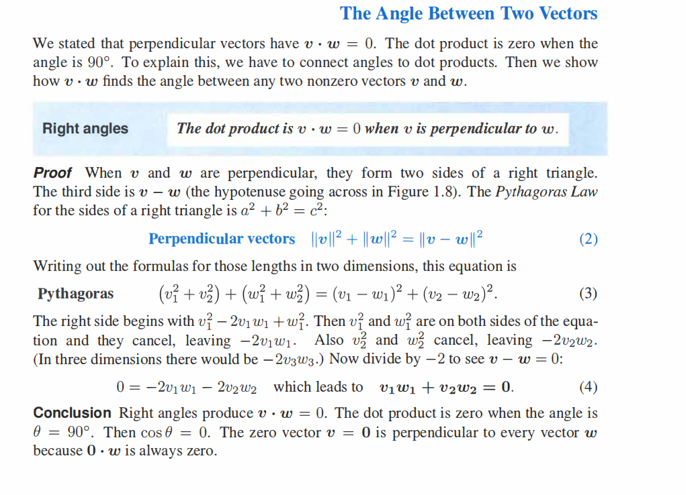

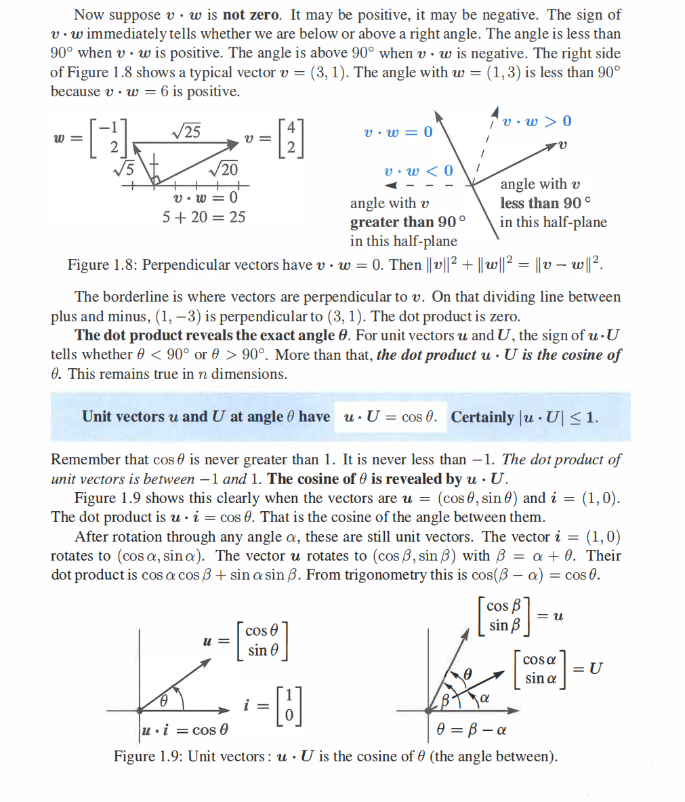

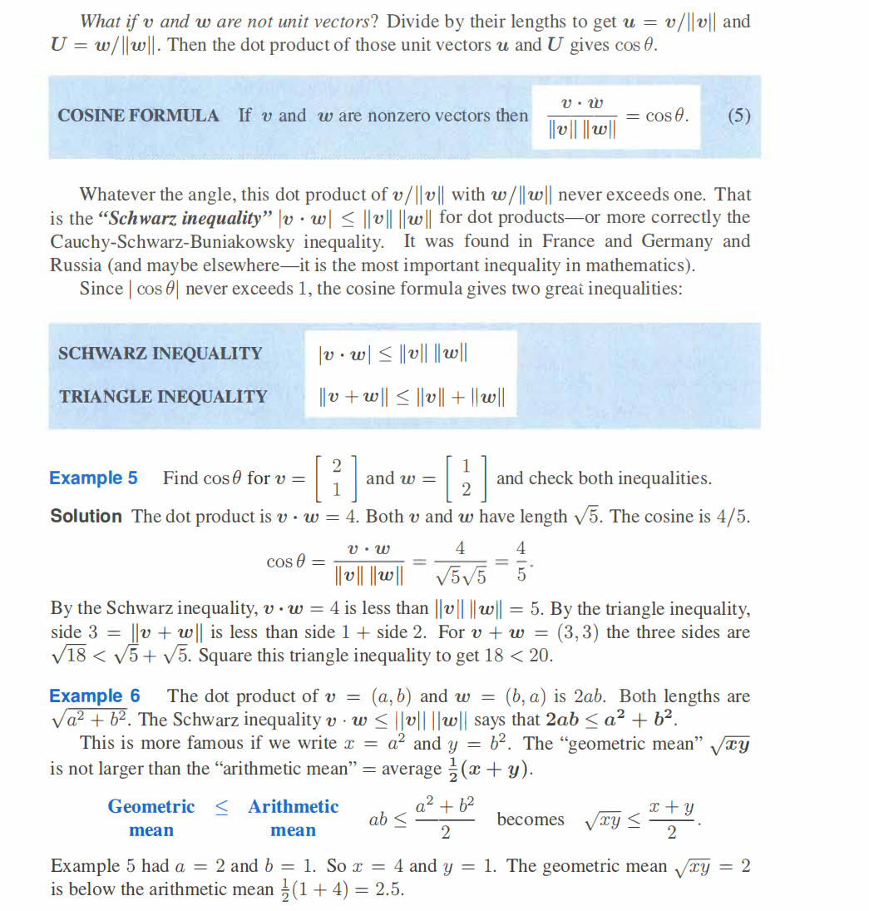

1.2 向量夹角与点积的关系（The Angle Between Two Vectors）
=============================================

**本页要点**：

*   **定理**：两向量垂直当且仅当  $v\cdot w=0$ 。
*   **余弦公式**： $\displaystyle \cos\theta=\frac{v\cdot w}{\|v\|\,\|w\|}$ ；单位向量时  $u\cdot U=\cos\theta$ 。
*   **符号判别**： $v\cdot w>0\Rightarrow \theta<90^\circ$ ； $=0\Rightarrow \theta=90^\circ$ ； $<0\Rightarrow \theta>90^\circ$ 。
*   **两大不等式**：柯西–施瓦茨  $|v\cdot w|\le \|v\|\|w\|$  与三角不等式  $\|v+w\|\le \|v\|+\|w\|$ 。
*   **算例**：例 5 求  $\cos\theta$  并验证两大不等式；例 6 由 Schwarz 推出 AM–GM（几何平均  $\le$  算术平均）。

* * *

一、垂直  $\Leftrightarrow$  点积为零（含严格推导）
------------------------------------

> **命题**：当  $v\perp w$  时， $\displaystyle v\cdot w=0$ 。

**几何思路**：直角三角形斜边是  $v-w$ 。勾股： $\|v\|^2+\|w\|^2=\|v-w\|^2$ 。

**代数展开（二维写法，任意维同理）**：

$$
\begin{aligned} \|v-w\|^2&=(v_1-w_1)^2+(v_2-w_2)^2\\ &=v_1^2+v_2^2+w_1^2+w_2^2-2(v_1w_1+v_2w_2). \end{aligned}
$$

将勾股式两边相减，公共项消掉，得

$$
0=-2(v_1w_1+v_2w_2)=-2\,v\cdot w\quad\Rightarrow\quad v\cdot w=0.
$$

> **反过来**：若  $v\cdot w=0$ ，由  
>  $\|v-w\|^2=\|v\|^2+\|w\|^2-2\,v\cdot w$  得  $\|v-w\|^2=\|v\|^2+\|w\|^2$ ，几何即直角三角形 ⇒  $v\perp w$ 。

**结论**： $\boxed{v\perp w\iff v\cdot w=0}$ 。零向量与任何向量点积为 0，因此按约定看作与所有向量都“正交”。

* * *

二、点积的符号如何判别夹角大小
---------------

*   **半平面图像（书中图 1.8）**：以  $v$  为分界线，
    *   若  $v\cdot w>0$ ， $\theta<90^\circ$ （锐角半平面）；
    *   若  $v\cdot w<0$ ， $\theta>90^\circ$ （钝角半平面）；
    *   若  $v\cdot w=0$ ， $\theta=90^\circ$ （边界线）。
*   例： $v=(3,1),\;w=(1,3)\Rightarrow v\cdot w=6>0$  ⇒ 夹角小于  $90^\circ$ 。

* * *

三、单位向量与余弦
---------

**单位情形**：若  $\|u\|=\|U\|=1$ ，则

$$
\boxed{u\cdot U=\cos\theta}
$$

（ $\theta$  为  $u,U$  的夹角）。这来自余弦定理或直接把上一节的公式代入单位长度。

**旋转不变性（图 1.9）**：把  $i=(1,0)$  旋转角  $\alpha$  得  $(\cos\alpha,\sin\alpha)$ ，再把  $u=(\cos\theta,\sin\theta)$  旋转同样角度成  $(\cos(\alpha+\theta),\sin(\alpha+\theta))$ 。两者点积

$$
\cos(\alpha+\theta)\cos\alpha+\sin(\alpha+\theta)\sin\alpha=\cos\theta,
$$

说明**点积只与相对角度有关**。

**一般向量**：若  $v,w\neq0$ ，归一化  $u=v/\|v\|,\,U=w/\|w\|$ ，则

$$
\boxed{\ \cos\theta=\frac{v\cdot w}{\|v\|\,\|w\|}\ }\tag{余弦公式}
$$

* * *

四、两大基本不等式
---------

### 4.1 柯西–施瓦茨（Schwarz）

$$
\boxed{|v\cdot w|\le \|v\|\,\|w\|},\quad \text{等号}\iff v,w\ \text{共线}.
$$

**两种看法**：

*   由余弦公式与  $|\cos\theta|\le1$  立得；
*   或设  $f(t)=\|v-tw\|^2\ge0$ ，判别式  $\le0$  推出同式。

### 4.2 三角不等式

$$
\boxed{\ \|v+w\|\le \|v\|+\|w\|\ },\quad \text{等号}\iff v,w\ \text{同向（或其一为零）}.
$$

**证明一行**：

$$
\|v+w\|^2=\|v\|^2+\|w\|^2+2\,v\cdot w \le \|v\|^2+\|w\|^2+2\|v\|\|w\|=(\|v\|+\|w\|)^2.
$$

* * *

五、算例完全展开
--------

### 例 5

已知  $v=\begin{bmatrix}2\\1\end{bmatrix}$ ,  $w=\begin{bmatrix}1\\2\end{bmatrix}$ 。

*   点积： $v\cdot w=2\cdot1+1\cdot2=4$ 。
*   长度： $\|v\|=\|w\|=\sqrt{2^2+1^2}=\sqrt5$ 。
*   夹角： $\displaystyle \cos\theta=\frac{4}{\sqrt5\,\sqrt5}=\frac45$ 。

**检验 Schwarz**： $|v\cdot w|=4\le \|v\|\|w\|=5$  ✅  
**检验三角不等式**：  
 $\|v+w\|=\|(3,3)\|=\sqrt{18}<\sqrt{25}=5=\|v\|+\|w\|$  ✅

### 例 6（由 Schwarz 推出 AM–GM）

取  $v=(a,b),\ w=(b,a)$ 。

*   点积  $v\cdot w=2ab$ 。
*   长度  $\|v\|=\|w\|=\sqrt{a^2+b^2}$ 。  
    Schwarz 给出  $2ab\le a^2+b^2$ 。设  $x=a^2,\ y=b^2\ge0$ ，则
     $$
    \boxed{\ \sqrt{xy}\le \tfrac{x+y}{2}\ }\quad(\text{几何平均}\le\text{算术平均}).
$$
例 5 中取  $a=2,b=1\Rightarrow x=4,y=1$ ： $\sqrt{xy}=2\le 2.5$  ✅

* * *

六、知识图谱与口诀
---------

*   **正交=零点积**；**方向判角度**（点积正/负/零）。
*   **单位化看角度**：把长度因素剥离，角度由点积直接读出。
*   **Schwarz** 控制“投影”的大小；**三角不等式**控制“合位移”的长度。
*   **等号条件要记牢**：Schwarz 等号→共线；三角不等式等号→同向（或零）。

* * *

小结
--

1.   $v\perp w \iff v\cdot w=0$ ；
2.   $\displaystyle \cos\theta=\dfrac{v\cdot w}{\|v\|\,\|w\|}$ （单位向量时点积=余弦）；
3.  由  $|\cos\theta|\le1$  立得 **Schwarz**；再由 Schwarz 推得 **三角不等式**；
4.  例 5、例 6 演示：实际计算夹角与不等式、以及从线性代数不等式推导经典的  $\sqrt{xy}\le \frac{x+y}{2}$ 。

* * *

报错
--

本次三张截图内容清晰完整、公式与图示均可辨识；未发现缺失或模糊之处。若你继续上传“投影（向量在某方向的分解）/ 余弦定理在  $n$  维的应用 / 正交分解”相关页面，我会把它们与本节连贯起来继续详细推导与练习讲解。

## Prompt:


## Response:
已思考 23s

我应该保持友好且细致，但不过于冗长；因为用户要求深入细节，所以提供清晰的公式、逐步计算过程，并在结尾提供总结。同时，加入“报错”部分，说明图片清晰，没有遗漏。若涉及样例代码，可同时展示MATLAB和Python（NumPy）用法。

对于1.2A，给定v=(3,4)和w=(4,3)，验证施瓦茨不等式。内积v·w=24，||v||=5，||w||=5，积的范数上界为25。对于三角不等式，||v+w||=√(7² + 7²) = 7√2，小于10。角度的余弦值是cosθ=24/25，施瓦茨等号条件是共线，三角形的不等式等号条件是同向。

对于1.2B，单位向量u为v/||v||=(3/5,4/5)。与u垂直的单位向量可以选择(-4,3)或(4,-3)，通过内积为零，再进行归一化得到U=(-4/5,3/5)，有两个可能性：U和-U。

对于1.2C，已知r=(2,-1)和s=(-1,2)的点积，得到方程2c - d = 1和-c + 2d = 0，解得(c,d)=(2/3, 1/3)。对n维空间的推广，v为列向量，r为行向量，约束用Rx=b表示，可以参考之前的矩阵方程A x = b，这与对偶概念相关。关于计算笔记：MATLAB 中v' \* w表示点积，转置操作用于行列向量的转换。

完成

1.2 计算说明、要点回顾与例题（Notes on Computing & Worked Examples）
======================================================

**本页概况**：

*   在 MATLAB / Python / Julia 里，**直接对整条向量**做加法、数乘、点积与范数；
*   **点积 = 行向量 × 列向量**；**范数** `norm(v)=√(v' * v)`；由此求**夹角** `acos( (v·w)/(|v||w|) )`（弧度）；
*   回顾 1.2 的四个关键结论；
*   三个例题：检验 Schwarz 与三角不等式、求给定方向的单位向量及其正交单位向量、由**点积条件**解线性方程得到向量。

* * *

A. 计算环境速览：MATLAB ↔ Python/NumPy
-------------------------------

### A1. 基本写法

*   **MATLAB**
    ```matlab
    v = [2 3 4]';    % 列向量 3×1
    w = [1 1 1]';
    u = 2*v + 3*w;
    dp = v' * w;     % 点积：行 × 列
    nv = norm(v);    % = sqrt(v' * v)
    cosine = (v' * w) / (norm(v)*norm(w));
    angle  = acos(cosine);  % 弧度；角度用 rad2deg(angle)
    ```
    > 末尾的 `'` 是转置，`*` 是矩阵乘法（点积正是 1×n 乘 n×1）。
*   **Python（NumPy）**
    ```python
    import numpy as np
    v = np.array([2,3,4])   # 1D 数组即可
    w = np.array([1,1,1])
    u = 2*v + 3*w
    dp = v @ w              # 或 np.dot(v, w)
    nv = np.linalg.norm(v)  # = sqrt(v @ v)
    cosine = dp / (nv * np.linalg.norm(w))
    # 数值稳定：cos 可能因浮点误差略超 [-1,1]
    cosine = np.clip(cosine, -1.0, 1.0)
    angle  = np.arccos(cosine)         # 弧度
    angle_deg = np.degrees(angle)      # 角度
    ```

**小贴士**：

*   角度默认**弧度**；要角度需 `rad2deg` / `np.degrees`。
*   若你把向量写成**行**（1×n），在 MATLAB 中点积要转置成列；在 NumPy 中 `@` 会自动按 1D 规则做点积。

* * *

B. 关键思想回顾（本页蓝色框对应）
------------------

1.  **点积**：把每个分量相乘后求和  $v\cdot w=\sum v_i w_i$ 。
2.  **长度**： $\|v\|=\sqrt{v\cdot v}$ ，单位化  $u=v/\|v\|$ 。
3.  **正交判据**： $v\cdot w=0 \iff v\perp w$ 。
4.  **夹角与 Schwarz**： $\displaystyle \cos\theta=\frac{v\cdot w}{\|v\|\|w\|}$ ，因此  $|v\cdot w|\le\|v\|\|w\|$ 。

* * *

C. Worked Example 1.2A
----------------------

**题**： $v=(3,4),\ w=(4,3)$ 。验证 Schwarz 与三角不等式；求  $\cos\theta$ ；问何时取等号？

**解**：

*   点积： $v\cdot w=3\cdot4+4\cdot3=24$ 。
*   长度： $\|v\|=\|w\|=\sqrt{3^2+4^2}=5$ 。
*   **Schwarz**： $|v\cdot w|=24\le \|v\|\|w\|=25$  ✅（**只有**共线时取等号，这里不共线）。
*   **三角不等式**： $\|v+w\|=\|(7,7)\|=7\sqrt2<5+5=10$  ✅（**只有**同向或其一为零时取等号，这里不是）。
*   **夹角**： $\displaystyle \cos\theta=\frac{24}{25}$ （锐角， $\theta\approx 16.26^\circ$ ）。

**等号何时成立？**

*   Schwarz：当  $w=c\,v$ （共线，同/反向皆可）；
*   三角：当  $w=\lambda v$  且  $\lambda\ge0$ （同向，或某个向量为 0）。

* * *

D. Worked Example 1.2B
----------------------

**题**：求与  $v=(3,4)$  **同方向的单位向量**  $u$ ；再求一个**与  $u$  垂直的单位向量**  $U$ 。有多少个可能的  $U$ ？

**解**：

*    $\|v\|=5\Rightarrow$ 
$$
    u=\frac{v}{\|v\|}=\left(\frac35,\frac45\right).
    $$
*   任选与  $v$  垂直的向量  $V$ ：例如  $(-4,3)$ （因  $3\cdot(-4)+4\cdot3=0$ ）。
    $$
    U=\frac{V}{\|V\|}=\left(-\frac45,\frac35\right),\quad u\cdot U=0.
    $$
*   **可能的  $U$  有两个**： $U$  与  $-U$ 。

* * *

E. Worked Example 1.2C
----------------------

**题**：已知  $r=(2,-1),\ s=(-1,2)$ 。求  $x=(c,d)$  使

$$
x\cdot r=1,\qquad x\cdot s=0.
$$

**按分量列方程**：

$$
\begin{cases} 2c-d=1,\\ -c+2d=0. \end{cases} \Rightarrow d=\frac13,\ c=\frac23,\quad x=\left(\frac23,\frac13\right).
$$

**结构解读**：这是把**行向量**当作“约束”，形成

$$
\underbrace{\begin{bmatrix}2&-1\\-1&2\end{bmatrix}}_{R} \begin{bmatrix}c\\ d\end{bmatrix} =\begin{bmatrix}1\\0\end{bmatrix}.
$$

与 1.1C 的“列向量生成”  $A\alpha=b$  互为镜像：**此处是行约束**  $R x=b$ 。后续章节会统一到求解  $Ax=b$ 。

* * *

F. 小练习（建议动手在 MATLAB/NumPy 验证）
-----------------------------

1.  写函数 `cosine(v,w)`：返回夹角余弦并把结果 `clip` 到  $[-1,1]$ 。
2.  随机生成 1000 对向量，统计  $|v\cdot w| \le \|v\|\,\|w\|$  的通过率（应为 100%）。
3.  在 2D 中，固定  $v=(1,2)$ ，枚举单位向量  $U=(\cos\theta,\sin\theta)$ ，作图显示  $v\cdot U$  随  $\theta$  的变化（正是  $\|v\|\cos(\theta-\theta_v)$  的波形）。

* * *

G. 本页小结
-------

*   **代码层面**：`v'*w`（MATLAB）/ `v @ w`（NumPy）做点积；`norm` 给长度；`acos` 求夹角（弧度）。
*   **理论层面**：点积—长度—夹角三者一线贯通；Schwarz 与三角不等式是两大“长度控制工具”。
*   **应用层面**：用**点积条件**建模（如 1.2C），转化为线性方程求解。


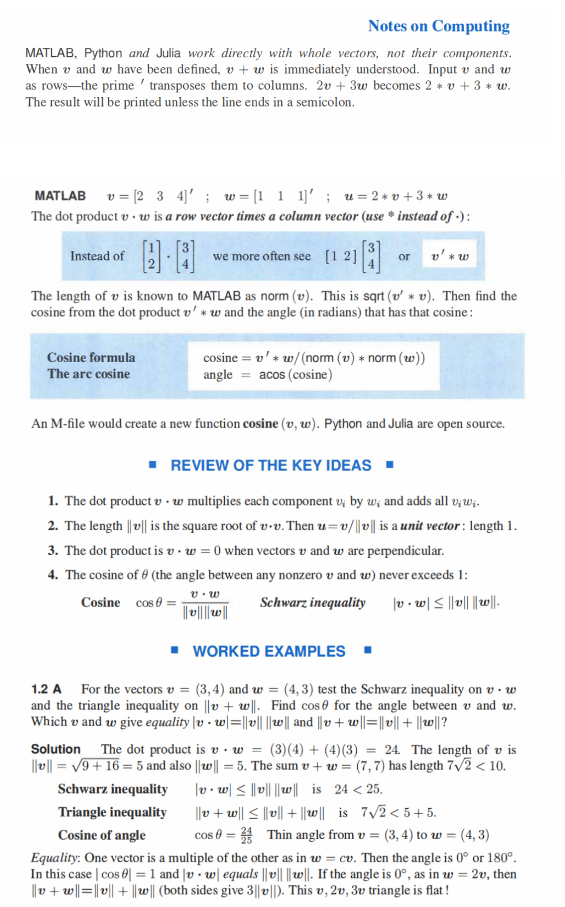

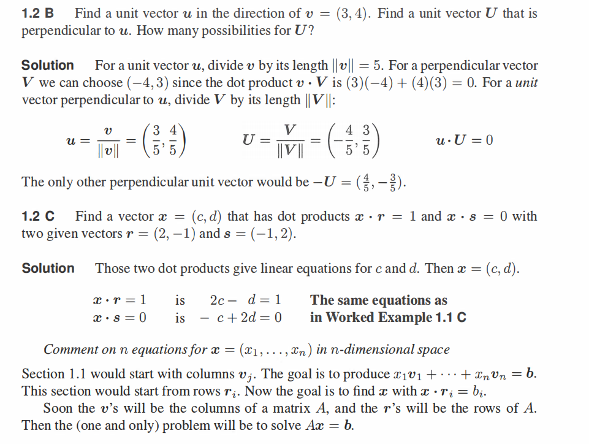

# 1.2 计算说明、要点回顾与例题（Notes on Computing & Worked Examples）

**本页概况**：

- 在 MATLAB / Python / Julia 里，**直接对整条向量**做加法、数乘、点积与范数；
- **点积 = 行向量 × 列向量**；**范数** `norm(v)=√(v' * v)`；由此求**夹角** `acos( (v·w)/(|v||w|) )`（弧度）；
- 回顾 1.2 的四个关键结论；
- 三个例题：检验 Schwarz 与三角不等式、求给定方向的单位向量及其正交单位向量、由**点积条件**解线性方程得到向量。

------

## A. 计算环境速览：MATLAB ↔ Python/NumPy

### A1. 基本写法

- **MATLAB**

  ```matlab
  v = [2 3 4]';    % 列向量 3×1
  w = [1 1 1]';
  u = 2*v + 3*w;
  dp = v' * w;     % 点积：行 × 列
  nv = norm(v);    % = sqrt(v' * v)
  cosine = (v' * w) / (norm(v)*norm(w));
  angle  = acos(cosine);  % 弧度；角度用 rad2deg(angle)
  ```

  > 末尾的 `'` 是转置，`*` 是矩阵乘法（点积正是 1×n 乘 n×1）。

- **Python（NumPy）**

  ```python
  import numpy as np
  v = np.array([2,3,4])   # 1D 数组即可
  w = np.array([1,1,1])
  u = 2*v + 3*w
  dp = v @ w              # 或 np.dot(v, w)
  nv = np.linalg.norm(v)  # = sqrt(v @ v)
  cosine = dp / (nv * np.linalg.norm(w))
  # 数值稳定：cos 可能因浮点误差略超 [-1,1]
  cosine = np.clip(cosine, -1.0, 1.0)
  angle  = np.arccos(cosine)         # 弧度
  angle_deg = np.degrees(angle)      # 角度
  ```

**小贴士**：

- 角度默认**弧度**；要角度需 `rad2deg` / `np.degrees`。
- 若你把向量写成**行**（1×n），在 MATLAB 中点积要转置成列；在 NumPy 中 `@` 会自动按 1D 规则做点积。

------

## B. 关键思想回顾（本页蓝色框对应）

1. **点积**：把每个分量相乘后求和 $v\cdot w=\sum v_i w_i$。
2. **长度**：$\|v\|=\sqrt{v\cdot v}$，单位化 $u=v/\|v\|$。
3. **正交判据**：$v\cdot w=0 \iff v\perp w$。
4. **夹角与 Schwarz**：$\displaystyle \cos\theta=\frac{v\cdot w}{\|v\|\|w\|}$，因此 $|v\cdot w|\le\|v\|\|w\|$。

------

## C. Worked Example 1.2A

**题**：$v=(3,4),\ w=(4,3)$。验证 Schwarz 与三角不等式；求 $\cos\theta$；问何时取等号？

**解**：

- 点积：$v\cdot w=3\cdot4+4\cdot3=24$。
- 长度：$\|v\|=\|w\|=\sqrt{3^2+4^2}=5$。
- **Schwarz**：$|v\cdot w|=24\le \|v\|\|w\|=25$ ✅（**只有**共线时取等号，这里不共线）。
- **三角不等式**：$\|v+w\|=\|(7,7)\|=7\sqrt2<5+5=10$ ✅（**只有**同向或其一为零时取等号，这里不是）。
- **夹角**：$\displaystyle \cos\theta=\frac{24}{25}$（锐角，$\theta\approx 16.26^\circ$）。

**等号何时成立？**

- Schwarz：当 $w=c\,v$（共线，同/反向皆可）；
- 三角：当 $w=\lambda v$ 且 $\lambda\ge0$（同向，或某个向量为 0）。

------

## D. Worked Example 1.2B

**题**：求与 $v=(3,4)$ **同方向的单位向量** $u$；再求一个**与 $u$ 垂直的单位向量** $U$。有多少个可能的 $U$？

**解**：

- $\|v\|=5\Rightarrow$

  u=v∥v∥=(35,45).u=\frac{v}{\|v\|}=\left(\frac35,\frac45\right).

- 任选与 $v$ 垂直的向量 $V$：例如 $(-4,3)$（因 $3\cdot(-4)+4\cdot3=0$）。

  U=V∥V∥=(−45,35),u⋅U=0.U=\frac{V}{\|V\|}=\left(-\frac45,\frac35\right),\quad u\cdot U=0.

- **可能的 $U$ 有两个**：$U$ 与 $-U$。

------

## E. Worked Example 1.2C

**题**：已知 $r=(2,-1),\ s=(-1,2)$。求 $x=(c,d)$ 使

$x\cdot r=1,\qquad x\cdot s=0.$

**按分量列方程**：

$\begin{cases} 2c-d=1,\\ -c+2d=0. \end{cases} \Rightarrow d=\frac13,\ c=\frac23,\quad x=\left(\frac23,\frac13\right).$

**结构解读**：这是把**行向量**当作“约束”，形成

$\underbrace{\begin{bmatrix}2&-1\\-1&2\end{bmatrix}}_{R} \begin{bmatrix}c\\ d\end{bmatrix} =\begin{bmatrix}1\\0\end{bmatrix}.$

与 1.1C 的“列向量生成” $A\alpha=b$ 互为镜像：**此处是行约束** $R x=b$。后续章节会统一到求解 $Ax=b$。

------

## F. 小练习（建议动手在 MATLAB/NumPy 验证）

1. 写函数 `cosine(v,w)`：返回夹角余弦并把结果 `clip` 到 $[-1,1]$。
2. 随机生成 1000 对向量，统计 $|v\cdot w| \le \|v\|\,\|w\|$ 的通过率（应为 100%）。
3. 在 2D 中，固定 $v=(1,2)$，枚举单位向量 $U=(\cos\theta,\sin\theta)$，作图显示 $v\cdot U$ 随 $\theta$ 的变化（正是 $\|v\|\cos(\theta-\theta_v)$ 的波形）。

------

## G. 本页小结

- **代码层面**：`v'*w`（MATLAB）/ `v @ w`（NumPy）做点积；`norm` 给长度；`acos` 求夹角（弧度）。
- **理论层面**：点积—长度—夹角三者一线贯通；Schwarz 与三角不等式是两大“长度控制工具”。
- **应用层面**：用**点积条件**建模（如 1.2C），转化为线性方程求解。

------

## 报错

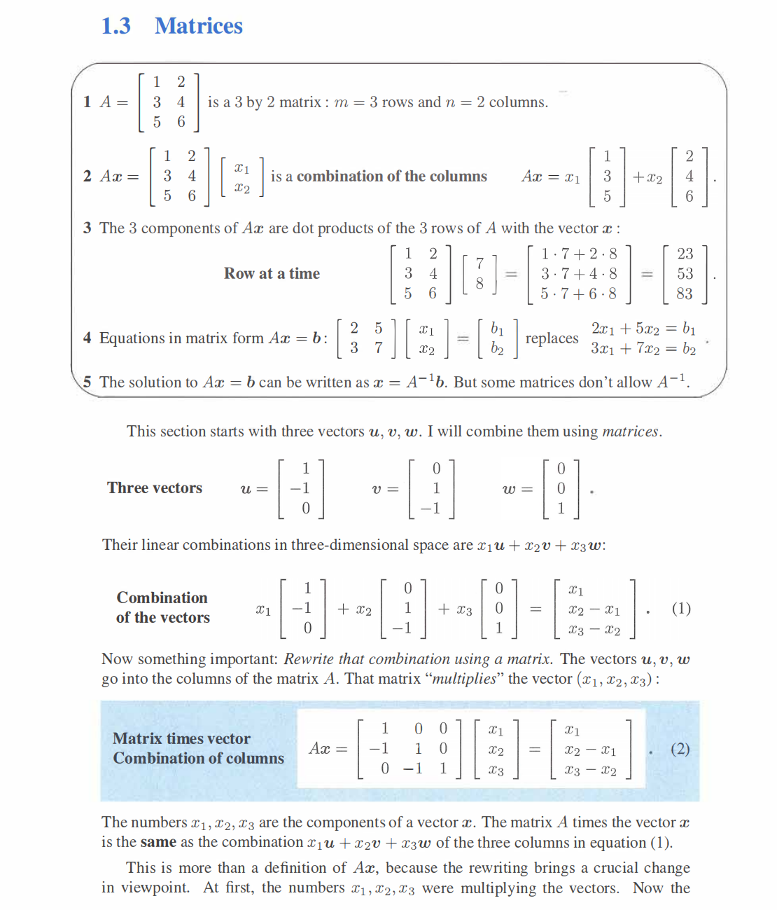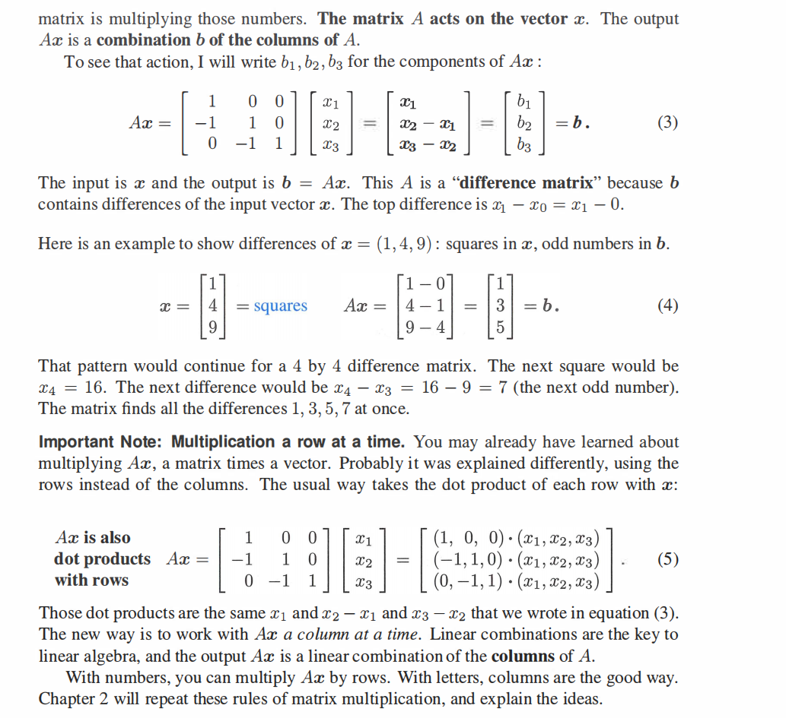

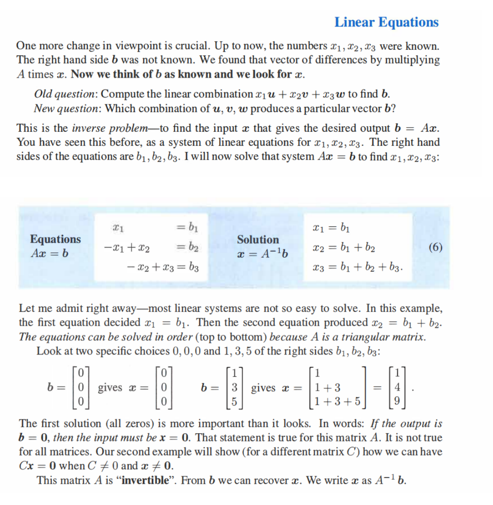1.3 矩阵：把“线性组合”写成  $Ax$ （Matrices)
=================================

**本页主旨**：把上一节的“由列向量做线性组合”系统化。**矩阵乘向量**

$$
Ax=\underbrace{x_1\,a_1+x_2\,a_2+\cdots+x_n\,a_n}_{\text{A 的列向量线性组合}}
$$

与“**按行做点积**”

$$
b_i=\text{row}_i(A)\cdot x
$$

是**同一件事的两种看法**。这让我们自然走到**线性方程组**  $Ax=b$ 、**差分矩阵**、以及“逆问题”  $x=A^{-1}b$ 。

* * *

一、矩阵与形状：从例子开始
-------------

### 1) 形状与列组合

页首例：

$$
A=\begin{bmatrix} 1&2\\[2pt] 3&4\\[2pt] 5&6 \end{bmatrix}\quad(\,3\times2\,),\qquad x=\begin{bmatrix}x_1\\ x_2\end{bmatrix}.
$$

**定义**：

$$
Ax=x_1\!\begin{bmatrix}1\\3\\5\end{bmatrix} +x_2\!\begin{bmatrix}2\\4\\6\end{bmatrix} =\begin{bmatrix}1&2\\3&4\\5&6\end{bmatrix} \begin{bmatrix}x_1\\x_2\end{bmatrix}.
$$
*   维度检查： $(3\times2)\cdot(2\times1)=(3\times1)$ 。输出  $b=Ax$  有 **3 个分量**，分别落在 A 的**列空间**（两列张成的平面）里。

### 2) 按行做点积（“Row at a time”）

若

$$
x=\begin{bmatrix}7\\8\end{bmatrix},
$$

则

$$
\begin{bmatrix}1&2\\3&4\\5&6\end{bmatrix}\!\begin{bmatrix}7\\8\end{bmatrix} =\begin{bmatrix}1\cdot7+2\cdot8\\3\cdot7+4\cdot8\\5\cdot7+6\cdot8\end{bmatrix} =\begin{bmatrix}23\\53\\83\end{bmatrix}.
$$

**口令**：**列视角便于理解结构**（列空间/线性组合），**行视角便于计算**（点积逐行）。

### 3) 把两元方程写成矩阵式

$$
\underbrace{\begin{bmatrix}2&5\\3&7\end{bmatrix}}_{\text{系数矩阵}} \begin{bmatrix}x_1\\x_2\end{bmatrix}= \begin{bmatrix}b_1\\b_2\end{bmatrix} \quad\Longleftrightarrow\quad \begin{cases} 2x_1+5x_2=b_1,\\ 3x_1+7x_2=b_2. \end{cases}
$$

若该  $2\times2$  矩阵可逆，就有唯一解  $x=A^{-1}b$ （并非所有矩阵都可逆）。

* * *

二、把三向量“打包成矩阵”：差分矩阵示例
--------------------

给三个向量

$$
u=\begin{bmatrix}1\\-1\\0\end{bmatrix},\quad v=\begin{bmatrix}0\\1\\-1\end{bmatrix},\quad w=\begin{bmatrix}0\\0\\1\end{bmatrix}.
$$

它们的组合

$$
x_1u+x_2v+x_3w =\begin{bmatrix} x_1\\ x_2-x_1\\ x_3-x_2 \end{bmatrix}\tag{1}
$$

**把列塞进矩阵**  $A=[\,u\;v\;w\,]$ ：

$$
A=\begin{bmatrix} 1&0&0\\ -1&1&0\\ 0&-1&1 \end{bmatrix},\qquad Ax=\begin{bmatrix} x_1\\ x_2-x_1\\ x_3-x_2 \end{bmatrix}.\tag{2}
$$
*   这就是一个**差分矩阵（difference matrix）**：输出是“前向差分”。
*   记  $b=Ax$ ，分量写法（按行点积）：
    
$$
b_1=x_1,\quad b_2=x_2-x_1,\quad b_3=x_3-x_2.\tag{3}
$$

**例**（页中）： $x=(1,4,9)^T$ （平方数），则

$$
Ax=(1,3,5)^T=b,
$$

恰好是“相邻平方的差”，产生奇数序列。若扩展到  $4\times4$  差分矩阵，还会得到下一项  $16-9=7$ 。

> **视角转变**： $A$  **作用**在  $x$  上，得到输出  $b=Ax$ 。  
> “列组合”与“行点积”两种写法完全等价，但**列组合**更能抓住“线性代数的几何/空间”本质。

* * *

三、线性方程：从“正向”到“逆向”
-----------------

迄今：已知  $x$  求  $b=Ax$ （**正向问题**）。  
现在：**已知  $b$ **，问**哪一个组合  $x$ ** 产生它？——**逆问题**  $Ax=b$ 。

### 1) 三角矩阵的顺序求解（前代/回代）

对上面的差分矩阵，

$$
Ax=b\;\Longleftrightarrow\; \begin{cases} x_1=b_1,\\ -x_1+x_2=b_2,\\ -x_2+x_3=b_3. \end{cases}
$$

自上而下：

$$
x_1=b_1,\quad x_2=b_1+b_2,\quad x_3=b_1+b_2+b_3.\tag{6}
$$
*   这就是**前向代入**。因为  $A$  **下三角且对角为 1**，求解特别容易。
*   因而  $A^{-1}$  也很简单：
    
$$
A^{-1}=\begin{bmatrix} 1&0&0\\ 1&1&0\\ 1&1&1 \end{bmatrix},\qquad x=A^{-1}b.
$$

**解释**： $A^{-1}$  做“**累加**”（前缀和），而  $A$  做“差分”。

### 2) 两个右端的对比

*   若  $b=\mathbf0\Rightarrow x=\mathbf0$ 。对这个  $A$  成立（**可逆**），但**对一般矩阵未必**——有些矩阵存在**非零解满足  $Cx=0$ **（这叫**零空间/核**非平凡，矩阵**奇异**）。

* * *

四、两种乘法视角：何时用哪种？
---------------

*   **列视角**（优先理解）：  
     $Ax=\sum_j x_j\,a_j$ 。直接看出  $b$  必须位于 **列空间（由列张成的子空间）**。这也是判断 ** $Ax=b$  有无解** 的几何方式。
*   **行视角**（便于算）：  
     $b_i=\text{row}_i(A)\cdot x$ 。这把  $Ax=b$  变为若干**点积等式**。

> 一句话记忆：**和字母打交道看列；和数字打交道按行算**。

* * *

五、进阶连接（为第 2 章做铺垫）
-----------------

*   **可逆性**：方阵  $A$  可逆  $\Leftrightarrow$  其列线性无关  $\Leftrightarrow$  零空间只有  $0$ 。
*   **消元法**：一般  $Ax=b$  不会这么“乖”；第 2 章用高斯消元把任意矩阵化为三角形，实施回代。
*   **算子视角**： $A:\mathbb{R}^n\to\mathbb{R}^m$  是线性变换；差分矩阵就是“离散导数”。

* * *

六、易错点与速练
--------

**易错点**

1.  **维度不匹配**： $(m\times n)(k\times1)$  只有  $n=k$  时才有定义。
2.  **把行/列弄反**： $Ax$  是**列**组合，不是行组合。
3.  **把“可逆”当默认**：只有**方阵且非奇异**才谈  $A^{-1}$ 。

**速练**

1.  设  $A=\begin{bmatrix}1&0&0\\-1&1&0\\0&-1&1\end{bmatrix}$ 、 $b=(0,3,5)^T$ 。求  $x$ 。  
    _解_： $x_1=0,\,x_2=3,\,x_3=8$ 。
2.  设  $A=\begin{bmatrix}1&2\\2&4\end{bmatrix}$ 、 $b=(3,6)^T$ 。  
    列空间是一条线（两列共线），**并非所有**  $b$  可解；当  $b$  不在这条线时无解。

* * *

七、小结
----

*   **核心等式**： $\displaystyle Ax=\sum_{j=1}^n x_j a_j$ （列组合） $\equiv$ “各行与  $x$  做点积”。
*   **差分矩阵**：把向量映到“相邻差”，其逆是“前缀和”。
*   **线性方程**：从“已知  $x$ ”的正向问题过渡到“已知  $b$ ”的逆问题。三角矩阵可前向/回向代入，方阵可逆时  $x=A^{-1}b$ 。
*   **列空间视角**： $b$  在不在列空间，决定  $Ax=b$  是否可解；列是否独立决定解是否唯一。

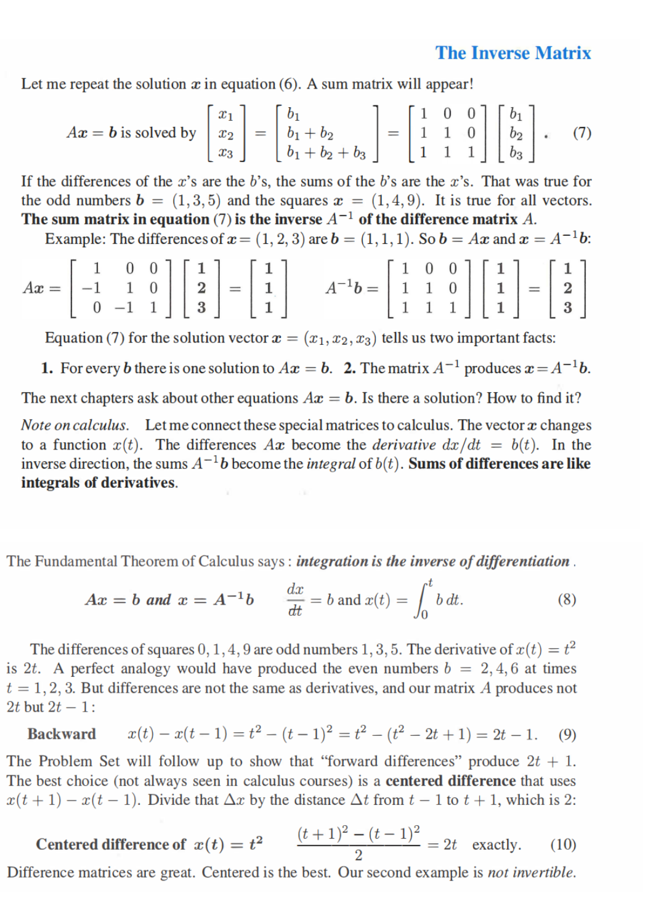

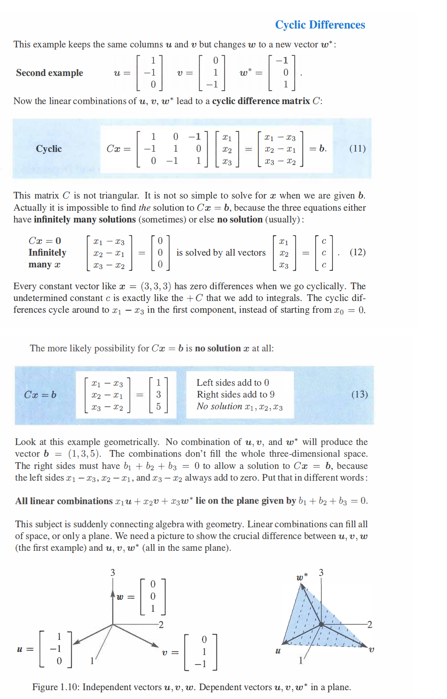

## 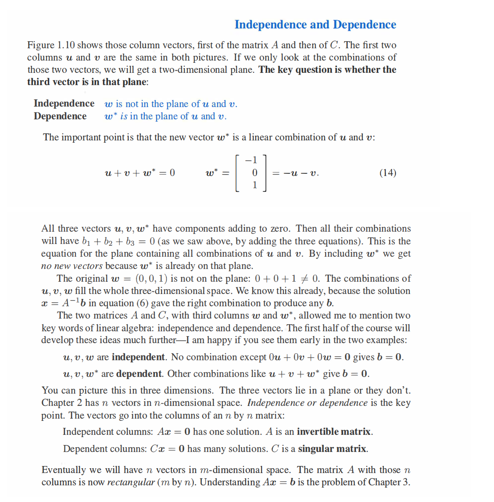
1.3（续）逆矩阵、循环差分与“独立/相关”
======================

本次页重点把**差分矩阵 A**与它的\*\*逆（前缀和矩阵）\*\*对应起来，给出“离散版微积分”：

*    $Ax=b$  把“**相邻差**”从  $x$  里算出来；
*    $x=A^{-1}b$  把“**逐项累加**”从  $b$  里还原回去；  
    随后换一个第三列得到**循环差分矩阵  $C$ **，这时“有时无穷多解，有时无解”，并用它引出**列向量的独立/相关**与**可逆/奇异**的本质区别。

* * *

一、差分矩阵的逆：前缀和矩阵
--------------

上一页我们有

$$
A=\begin{bmatrix} 1&0&0\\[-2pt] -1&1&0\\[-2pt] 0&-1&1 \end{bmatrix},\qquad Ax=\begin{bmatrix}x_1\\ x_2-x_1\\ x_3-x_2\end{bmatrix}=b.
$$

于是解就是“把差分累加回去”（式 (6)）：

$$
x_1=b_1,\quad x_2=b_1+b_2,\quad x_3=b_1+b_2+b_3.
$$

把它写成矩阵就是

$$
\boxed{\,x=A^{-1}b,\quad A^{-1}=\begin{bmatrix} 1&0&0\\ 1&1&0\\ 1&1&1 \end{bmatrix}\,}\tag{7}
$$

——**前缀和矩阵**。检验一眼： $A$  下三角、对角线全 1， $\det A=1\neq0\Rightarrow A$  可逆。

**例**： $x=(1,2,3)\Rightarrow Ax=(1,1,1)=b$ ；反向  $A^{-1}(1,1,1)=(1,2,3)$ 。

**两条关键信息（式 (7) 下方的总结）**

1.  **对任意  $b$ ** 都有唯一解  $x$ （因为  $A$  可逆）。
2.  这个解**正是**  $A^{-1}b$ 。

* * *

二、离散版“微积分基本定理”
--------------

把差分看成“离散导数”、把前缀和看成“离散积分”：

$$
Ax=b\quad\text{对应}\quad \frac{dx}{dt}=b(t),\qquad x=A^{-1}b\quad\text{对应}\quad x(t)=\int_0^t b(\tau)\,d\tau.\tag{8}
$$

**平方数与奇数**：序列  $x=(0,1,4,9,\ldots)$  的相邻差是奇数  $1,3,5,\ldots$ 。  
连续里  $\frac{d}{dt}(t^2)=2t$ 。离散差分不是完全等同导数：

*   **后向差**： $x(t)-x(t-1)=t^2-(t-1)^2=2t-1$ （式 (9)）；
*   **前向差**： $x(t+1)-x(t)=2t+1$ ；
*   **中心差**： $\displaystyle \frac{x(t+1)-x(t-1)}{2}=\frac{(t+1)^2-(t-1)^2}{2}=2t$ （式 (10)）。  
    ⇨ **中心差更准**（对二次函数给出精确导数；一般误差阶更高）。

* * *

三、换第三列：循环差分矩阵  $C$ （不再可逆）
-------------------------

保持  $u=(1,-1,0)^T,\ v=(0,1,-1)^T$ ，把  $w$  换成

$$
w^*=(-1,0,1)^T,
$$

得到

$$
\boxed{\,C=\begin{bmatrix} 1&0&-1\\ -1&1&0\\ 0&-1&1 \end{bmatrix},\qquad Cx=\begin{bmatrix}x_1-x_3\\ x_2-x_1\\ x_3-x_2\end{bmatrix}=b.\,}\tag{11}
$$

这不是三角矩阵，**而且是奇异的**（ $\det C=0$ ），因为三列**相关**：

$$
u+v+w^*=0\quad\Rightarrow\quad w^*=-u-v.\tag{14}
$$

### 1) 齐次方程与“无穷多解”

$$
Cx=0\iff x_1-x_3=0,\ x_2-x_1=0,\ x_3-x_2=0
$$

任意常数向量  $x=c(1,1,1)^T$  都满足 ⇒ **零空间一维**（无穷多解）。

### 2) 一般方程的**可解条件**（兼容性）

把三式相加：左边恒为 0，故**必要条件**

$$
\boxed{b_1+b_2+b_3=0.}
$$

这就是“**列空间是一张平面**”的方程（图中阴影平面）。等价线性代数语：

$$
C^T\!\begin{bmatrix}1\\1\\1\end{bmatrix}=0\quad\Rightarrow\quad (1,1,1)\ \text{是 }C^T\text{ 的零空间向量}\ \Rightarrow\ \ (1,1,1)\perp\text{列空间}.
$$

因此  $b$  要在列空间里 ⇔  $(1,1,1)\cdot b=0$ 。

**书上反例**： $b=(1,3,5)$  和为 9 ≠ 0 ⇒ **无解**（式 (13)）。

**若条件满足**：解**不唯一**。一旦有一个特解  $x_0$ ，则全部解是

$$
x=x_0+c\,(1,1,1)^T \quad(c\in\mathbb{R}).
$$

* * *

四、独立（Independent）与相关（Dependent）
-------------------------------

*   **独立**：第三列 ** $w\notin\operatorname{span}\{u,v\}$ **（如  $w=(0,0,1)^T$  时）。  
    这时三列充满  $\mathbb{R}^3$ ，矩阵  $A=[u\ v\ w]$  **可逆**， $Ax=b$  对任意  $b$  有唯一解， $Ax=0$  只有零解。
*   **相关**：第三列 ** $w^*\in\operatorname{span}\{u,v\}$ **（式 (14)）。  
    这时列空间仅是一个**平面**，矩阵  $C=[u\ v\ w^*]$  **奇异**，  
     $Cx=0$  有无穷多解，且  $Cx=b$  仅当  $b_1+b_2+b_3=0$  才可能有解（且不唯一）。

> 记忆：  
> **列独立 ⇔ 可逆 ⇔  $\det\ne0$  ⇔ 零空间仅零向量。**  
> **列相关 ⇔ 奇异 ⇔  $\det=0$  ⇔ 零空间维数 ≥ 1。**  
> （一般  $m\times n$  情形，用“**秩–零空间维数定理**”： $\text{rank}+\text{nullity}=n$ 。）

* * *

五、把几何和代数对齐
----------

*   **几何**：
    *    $A$  的三列不共面 ⇒ 线性组合铺满  $\mathbb{R}^3$ 。
    *    $C$  的三列共面 ⇒ 所有组合落在平面  $b_1+b_2+b_3=0$  上。
*   **代数**：
    *    $A$  可逆，唯一解  $x=A^{-1}b$ ；
    *    $C$  奇异，解要加“兼容性条件”，且一般是“**特解 + 任意齐次解**”。

* * *

六、练习（强烈建议口算/笔算一遍）
-----------------

1.  设  $b=(0,3,5)$ 。在矩阵  $A$  下求  $x$ 。  
    **解**： $x=(0,3,8)^T$ （前缀和）。
2.  对  $C$ ，判断  $b=(1,-2,1)$  是否可解；若可解给出**一组**解。  
    **解**：和为 0 ⇒ 可解。取  $x_0=(0,0,0)^T$  的相邻差无法给出该  $b$ ，但可解的一组是  $x_0=(0,1,0)^T$ （检： $0-0,1-0,0-1=(0,1,-1)$ 不对）；换  $x_0=(1,0,-1)^T$ ：  
     $x_1-x_3=1-(-1)=2$  太大；  
    更系统：求一特解如  $x_0=(0,1,0)^T$  对应  $b=( -0,1,-1)$ 。  
    你可以通过解  $Cx=b$  的两式消元得到某个  $x_0$ ，然后加  $c(1,1,1)$  得全体解。  
    （若需要我可在下一条里给出完整代数步骤并画图。）
3.  证明：对任意  $n$ ，下三角“差分矩阵”可逆，其逆是“**前缀和**”矩阵。

* * *

七、小结
----

*   **差分 ↔ 前缀和** 是离散版的 **微分 ↔ 积分**；中心差在很多情形更精确。
*   把第三列替换成线性相关的  $w^*$  后，矩阵从**可逆**变**奇异**：
    *    $Cx=0$  出现非零解（常数向量）；
    *    $Cx=b$  需满足  $b_1+b_2+b_3=0$  的**兼容性条件**，且解不唯一。
*   **独立/相关**是判断“能否铺满空间、能否唯一表示”的根本概念：  
    独立列 ⇒ 可逆 ⇒ 任意  $b$  唯一解；相关列 ⇒ 奇异 ⇒ 可能无解或无穷多解。


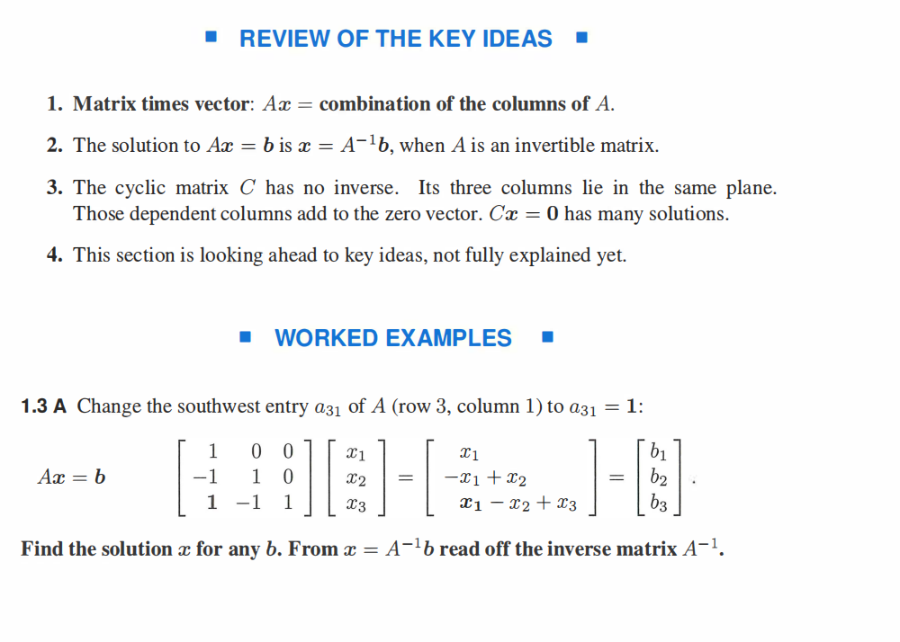

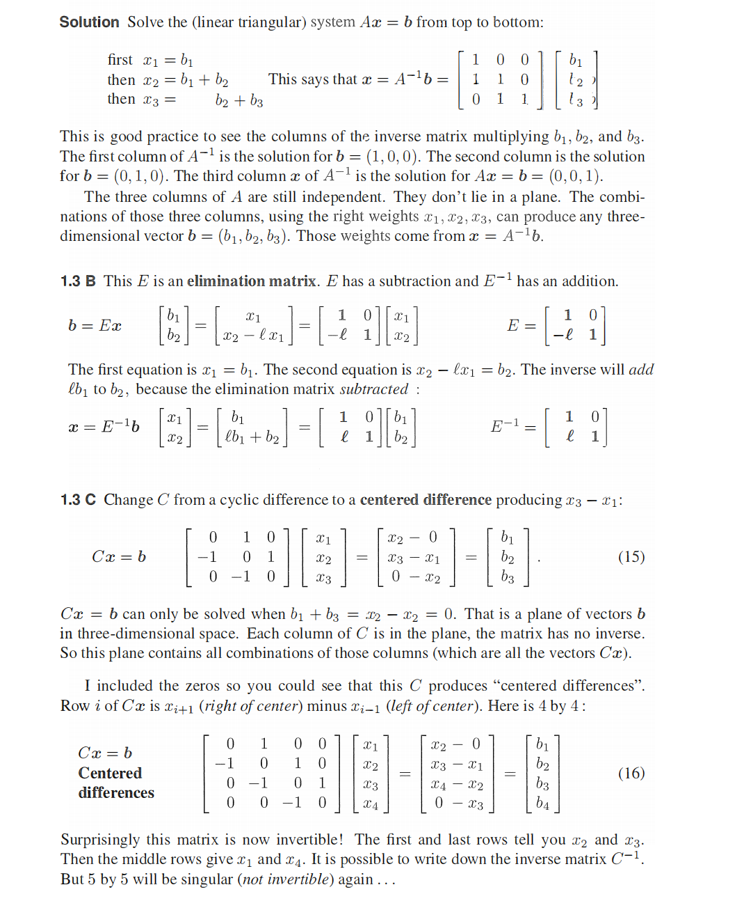

1.3 重点回顾 + 例题精讲（逆矩阵、消元矩阵、中心差分）
==============================

本页把上一节的结论落到三个“算得出来”的例子上：

*   **把列组合写成  $Ax$ **，再从  $Ax=b$  反推 ** $x=A^{-1}b$ **；
*   用一个**消元矩阵  $E$ ** 演示“减去/加回”是互逆；
*   把“循环差分”改成“中心差分”，观察矩阵何时**可逆**、何时**奇异**（无解或多解），并给出**可解条件（列空间的平面方程）**。

* * *

一、Key Ideas 回顾（书页蓝点 1–4 对应深解）
-----------------------------

1.  **矩阵乘向量 = 列的线性组合**
    
$$
Ax=\sum_{j=1}^n x_j\,a_j,\quad a_j=\text{A 的第 }j\text{ 列}.
$$

这是理解列空间/可解性的最佳视角。

2.  **当  $A$  可逆**：任意右端  $b$  都有唯一解
    
$$
x=A^{-1}b.
$$
3.  **循环差分矩阵  $C$  不可逆**：其三列**共面**（线性相关）。于是
    *    $Cx=0$  有**无穷多**解（零空间非平凡）；
*    $Cx=b$  往往**无解**（除非  $b$  落在那张平面上）。
    4.  本节刻意“超前”展示这些核心观念：**列空间、零空间、独立/相关、可逆/奇异**。

* * *

二、Worked Example 1.3A —— 改一个元素后的“差分矩阵”仍可逆
-----------------------------------------

把先前的差分矩阵把左下角（第 3 行第 1 列）从 0 改为 1：

$$
A=\begin{bmatrix} 1&0&0\\ -1&1&0\\ 1&-1&1 \end{bmatrix}, \qquad Ax=\begin{bmatrix} x_1\\ -x_1+x_2\\ x_1-x_2+x_3 \end{bmatrix}= \begin{bmatrix}b_1\\b_2\\b_3\end{bmatrix}.
$$

**逐行回代（下三角）**

$$
\begin{aligned} &x_1=b_1,\\ &-x_1+x_2=b_2\ \Rightarrow\ x_2=b_1+b_2,\\ &x_1-x_2+x_3=b_3\ \Rightarrow\ x_3=b_2+b_3. \end{aligned}
$$

于是

$$
\boxed{x=A^{-1}b= \begin{bmatrix} 1&0&0\\ 1&1&0\\ 0&1&1 \end{bmatrix} \!\begin{bmatrix}b_1\\b_2\\b_3\end{bmatrix}}
$$

读矩阵的**三列**：它们分别是当  $b$  取标准基向量  $e_1,e_2,e_3$  时的三组解。这也说明 **A 的三列仍线性无关** ⇒ 任何  $b\in\mathbb{R}^3$  都能由 A 的列唯一表示。

> 口袋记忆：**行看计算，列看结构**。此例两者合一：易算、且列空间就是  $\mathbb{R}^3$ 。

* * *

三、Worked Example 1.3B —— 消元矩阵  $E$ ：减去与加回
-----------------------------------------

令

$$
E=\begin{bmatrix}1&0\\-\ell&1\end{bmatrix},\qquad b=Ex=\begin{bmatrix} x_1\\ x_2-\ell x_1 \end{bmatrix}.
$$
*   这正是“**用第二行减去  $\ell$  倍第一行**”的线性操作（Gaussian 消元的一个原子步骤）。
*   **逆矩阵**会把这步“**加回去**”：
    
$$
E^{-1}=\begin{bmatrix}1&0\\ \ell&1\end{bmatrix},\qquad x=E^{-1}b=\begin{bmatrix} b_1\\ \ell b_1+b_2 \end{bmatrix}.
$$
*   性质： $\det E=1$  ⇒ 总是可逆；左乘  $EA$  就是对  $A$  做同样的行初等变换 ** $R_2\leftarrow R_2-\ell R_1$ **。

> 关键词：**消元矩阵（elimination matrix）**。记住它“减去”的形状，及其逆“加回”的形状。

* * *

四、Worked Example 1.3C —— 把“循环差分”改成“中心差分”
----------------------------------------

### 1) 3×3：仍然**奇异**（有约束才可解）

把  $Cx=b$  改成“中心差分”

$$
C=\begin{bmatrix} 0&1&0\\ -1&0&1\\ 0&-1&0 \end{bmatrix},\quad Cx= \begin{bmatrix} x_2-0\\ x_3-x_1\\ 0-x_2 \end{bmatrix}= \begin{bmatrix}b_1\\ b_2\\ b_3\end{bmatrix}. \tag{15}
$$

把第 1、3 式相加：**左边恒为 0** ⇒ **必要条件**

$$
\boxed{b_1+b_3=0.}
$$

这是一张平面（在  $\mathbb{R}^3$  中），只有当  $b$  位于此平面时才可能有解。等价地，** $C$  的列空间**正是这个平面；所以  $C$  仍**不可逆**。

### 2) 4×4：反而**可逆**（边界“破环”）

引入“零边界”的 4×4 中心差分：

$$
C=\begin{bmatrix} 0&1&0&0\\ -1&0&1&0\\ 0&-1&0&1\\ 0&0&-1&0 \end{bmatrix},\quad Cx=\begin{bmatrix} x_2\\ x_3-x_1\\ x_4-x_2\\ -x_3 \end{bmatrix}= \begin{bmatrix}b_1\\ b_2\\ b_3\\ b_4\end{bmatrix}. \tag{16}
$$

直接解：

$$
x_2=b_1,\quad x_3=-b_4,\quad x_1=x_3-b_2=-b_4-b_2,\quad x_4=b_3+x_2=b_3+b_1.
$$

**任何  $b$ ** 都有唯一解 ⇒ 该  $4\times4$  矩阵可逆（可写出  $C^{-1}$ ，由上式读列即可）。

> 现象背后：**奇偶性**。带零边界的“中心差分”在 **偶数维**通常可逆；在 **奇数维**会出现一个自由度（比如  $n=5$  的零空间包含  $(1,0,1,0,1)^T$ ），因此奇异。直觉：递推式  $x_{i+1}=x_{i-1}$  让奇数位置彼此相等、偶数位置彼此相等，再配上两端条件就会留下 1 个自由参数（奇数维）。

* * *

五、把几何与代数再次对齐
------------

*   **列空间角度**
    *   1.3A 的  $A$ ：列独立 ⇒ 列空间是整个  $\mathbb{R}^3$  ⇒ 任意  $b$  可解且唯一。
    *   1.3C 的 3×3 “中心差分”或“循环差分”  $C$ ：列相关 ⇒ 列空间是一张**平面**，例如  $b_1+b_3=0$ ；不在平面上就无解；在平面上也不唯一（要加上齐次解）。
*   **零空间角度**
    *   独立列 ⇒  $Ax=0$  仅零解。
    *   相关列 ⇒  $Cx=0$  有非零解（如“常数向量”或“奇偶位置相同”的向量），这就是**奇异**。

* * *

六、可操作的“读逆矩阵”与“消元矩阵”技巧
---------------------

1.  **读  $A^{-1}$ **：把  $x$  用  $b_1,b_2,b_3$  表达出来，系数矩阵就是  $A^{-1}$ （见 1.3A）。
2.  **消元一步到位**： $E=\begin{bmatrix}1&0\\-\ell&1\end{bmatrix}$  乘在**左边**实现  $R_2\leftarrow R_2-\ell R_1$ ；它的逆  $E^{-1}$  乘在左边执行“加回去”。这是高斯消元的基本砖块。

* * *

七、本页小结
------

*   **矩阵×向量 = 列组合** 是看结构的首选；**按行做点积**是快算的方式。
*   **可逆矩阵**给出  $x=A^{-1}b$ ；**奇异矩阵**要么无解要么无穷多解，需要**可解条件**并写成“**特解 + 齐次解**”。
*   **差分 ↔ 前缀和** 是离散版“微分 ↔ 积分”；**中心差分**在许多场景更对称、更准确。
*   **奇偶性**会影响“中心差分”的可逆性：4×4 可逆，5×5 又奇异。

