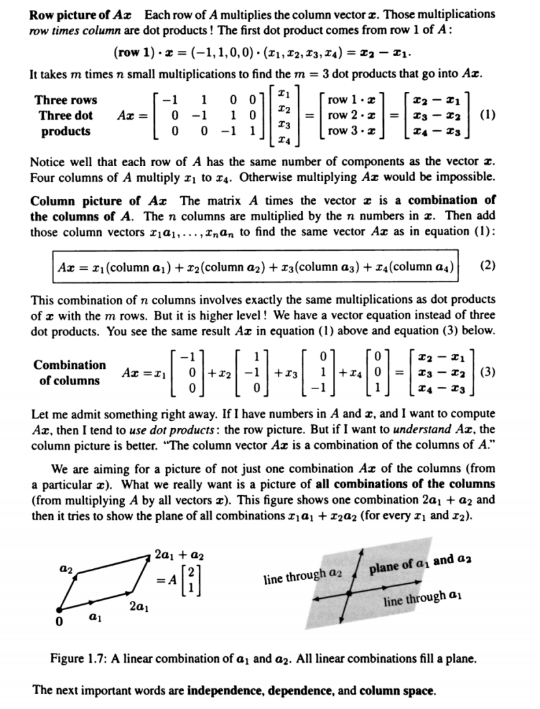
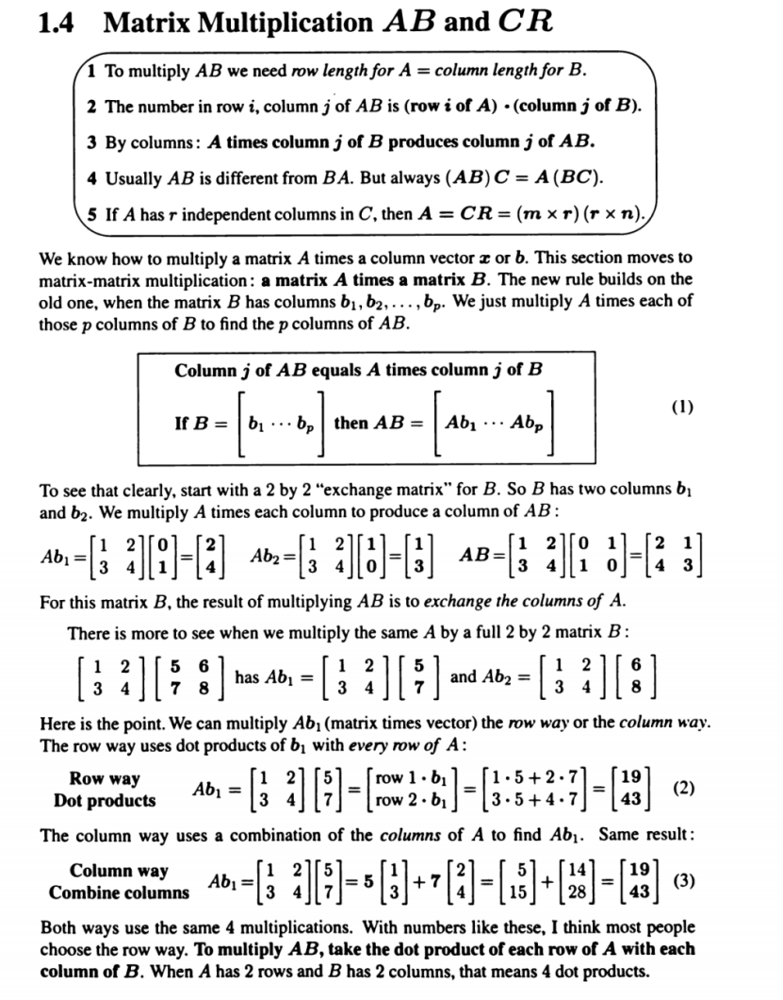
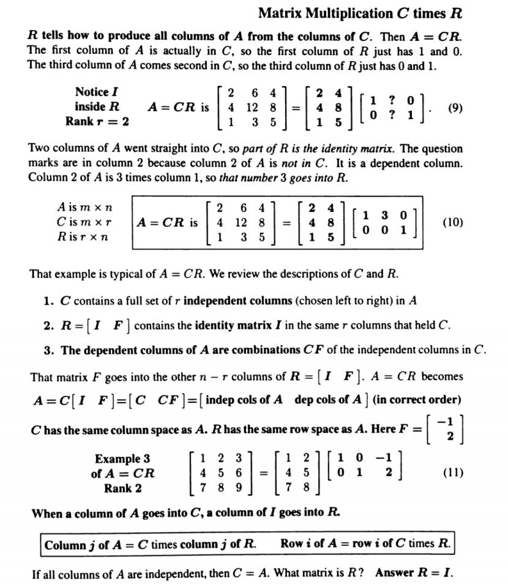

# 点积长度与角度

**User:** Anonymous (dqswordman@gmail.com)  
**Created:** 7/27/2025 17:01  
**Updated:** 7/27/2025 17:19  
**Exported:** 7/27/2025 17:19  
**Link:** [https://chatgpt.com/c/6885f908-79f4-8324-aed1-226a3b2736a0](https://chatgpt.com/c/6885f908-79f4-8324-aed1-226a3b2736a0)  

## Response:
已思考 22 秒

这里是向量 v 和 w 的例子：v = \[2; 4\]，w = \[1; 3\]，它们的和是 \[3; 7\]。

线性组合是通过 c 和 d 会得到的向量：c \[2; 4\] + d \[1; 3\] = \[2c + 1d; 4c + 3d\]，这些可以填满 xy 平面。

接下来，w 向量的长度是 ||w|| = sqrt(10)，点积 v · w = 14，能帮助我们理解这两个向量之间的角度。

矩阵 A 为 2×2 矩阵，包含向量 v 和 w：

A = \[v w\] = \[2 1; 4 3\]

矩阵与向量相乘时，得到列向量的线性组合：A × \[c; d\] = \[2c + 1d; 4c + 3d\]。

通过所有的线性组合，我们可以得到矩阵 A 的列空间，这里形成的是一个平面。

当矩阵 B 包含 v, w 和 z 时，列空间仍然是同一个平面。最终的目标是理解矩阵乘法运算。

完成

第 1 章 向量与矩阵 —— 从几何直觉到代数结构
=========================

_本节展示了线性代数的四个基石：向量与线性组合、向量长度与夹角（点积）、矩阵及其列空间，以及矩阵乘法的本质。所有概念都通过两维向量 **v = (2, 4)** 与 **w = (1, 3)** 的具体算例串联起来，使几何图像与代数运算一一对应。_

* * *

1.1 向量与线性组合
-----------

### 1.1.1 向量的定义与表示

*   **向量 (vector)** 是既可加又可数乘的“箭头”；在二维平面中可写成列向量
    $$
    \mathbf v=\begin{bmatrix}v_1\\v_2\end{bmatrix},\qquad \mathbf w=\begin{bmatrix}w_1\\w_2\end{bmatrix}
    $$
    例： $\mathbf v=\begin{bmatrix}2\\4\end{bmatrix},\; \mathbf w=\begin{bmatrix}1\\3\end{bmatrix}$ 。

### 1.1.2 向量加法

*   **几何意义**：首尾相接；**代数意义**：分量对应相加
    $$
    \mathbf v+\mathbf w= \begin{bmatrix}2\\4\end{bmatrix}+ \begin{bmatrix}1\\3\end{bmatrix}= \begin{bmatrix}3\\7\end{bmatrix}.
    $$

### 1.1.3 线性组合与张成 (span)

*   **线性组合**：对任意标量  $c,d\in\mathbb R$ ，
    $$
    c\mathbf v+d\mathbf w= c\begin{bmatrix}2\\4\end{bmatrix}+d\begin{bmatrix}1\\3\end{bmatrix}= \begin{bmatrix}2c+d\\4c+3d\end{bmatrix}.
    $$
*   **张成平面**：所有  $(c,d)$  取遍实数后，得到整张  $x\!y$ \-平面 → 说明  $\mathbf v, \mathbf w$  **线性无关**，其张成空间维度为 2。

* * *

1.2 向量长度与点积揭示的夹角
----------------

### 1.2.1 向量长度（欧几里得范数）

$$
\|\mathbf w\| = \sqrt{w_1^2+w_2^2} = \sqrt{1^2+3^2}=\sqrt{10}\approx3.162.
$$

### 1.2.2 点积（内积）

$$
\mathbf v\cdot\mathbf w = v_1w_1+v_2w_2 =(2)(1)+(4)(3)=14.
$$

### 1.2.3 夹角公式

$$
\cos\theta=\frac{\mathbf v\cdot\mathbf w}{\|\mathbf v\|\,\|\mathbf w\|} =\frac{14}{\sqrt{20}\,\sqrt{10}} \approx0.99\;\;\Longrightarrow\;\; \theta\approx8^\circ.
$$

_点积既给出长度投影，也衡量向量是否正交（ $\cos\theta=0$ ) 或同向/反向（ $\cos\theta=\pm1$ )。_

* * *

1.3 矩阵与列空间
----------

### 1.3.1 把向量排成列就是矩阵

$$
A=\bigl[\mathbf v\;\mathbf w\bigr] =\begin{bmatrix}2&1\\4&3\end{bmatrix},\qquad A\in\mathbb R^{2\times2}.
$$

### 1.3.2 矩阵×向量 = 列向量的线性组合

对任意  $\mathbf x=\begin{bmatrix}c\\d\end{bmatrix}$ ，

$$
A\mathbf x= \begin{bmatrix}2&1\\4&3\end{bmatrix} \begin{bmatrix}c\\d\end{bmatrix}= \begin{bmatrix}2c+d\\4c+3d\end{bmatrix}=c\mathbf v+d\mathbf w.
$$

### 1.3.3 列空间 (column space)

*   **定义**：所有  $A\mathbf x$  组成的集合。
*   **本例**：仍是整张  $x\!y$ \-平面，因为两列线性无关。
*   **维度** = 列秩 (rank)。

* * *

1.4 再添一列：依赖与零向量
---------------

### 1.4.1 构造新矩阵  $B$ 

$$
B=\bigl[\mathbf v\;\mathbf w\;\mathbf z\bigr] =\begin{bmatrix}2&1&3\\4&3&7\end{bmatrix},\quad \mathbf z=\begin{bmatrix}3\\7\end{bmatrix}.
$$

观察： $\mathbf z=\mathbf v+\mathbf w$  ⇒ 与  $\mathbf v,\mathbf w$  **线性相关**。

### 1.4.2 存在非零解使  $B\mathbf y=\mathbf0$ 

设  $\mathbf y=\begin{bmatrix}1\\1\\-1\end{bmatrix}$ ，则

$$
B\mathbf y= \begin{bmatrix}2&1&3\\4&3&7\end{bmatrix} \begin{bmatrix}1\\1\\-1\end{bmatrix} =\mathbf v+\mathbf w-\mathbf z=\mathbf0.
$$

说明列向量组依赖；但 **列空间仍是平面**，秩 = 2。

* * *

1.5 矩阵乘法的预告
-----------

*   **核心思想**： $AB$  就是 **把矩阵  $A$ ** 作用到 ** $B$  的每一列**：
    $$
    AB=\bigl[A\mathbf b_1\;A\mathbf b_2\;\dots\bigr].
    $$
*   右乘把**列组合映射再组合**；左乘则把**行向量参与点积**。
*   小节标题中出现 “ $AB$  and  $CR$ ” 暗示：
    *    $AB$  —— 列组合视角；
    *    $CR$  —— 行组合视角（ $C$  与  $R$  或指行空间 Row space）。  
        _后续章节将正式定义并证明矩阵乘法的各种性质。_

* * *

小结
--

1.  **向量** 是线性代数的原子：既能直观几何化，又能代数运算。
2.  **线性组合** 引出张成空间、维度与独立性。
3.  **点积** 同时编码长度与夹角，为度量与正交奠基。
4.  **矩阵** 本质是列向量打包；矩阵乘向量 = 线性组合。
5.  **列空间** 由矩阵列向量张成；新增与原列相关的向量不会提升秩。
6.  **矩阵乘法** 可视为“组合的组合”，连接列空间与行空间的视角，是后续线性代数的核心操作。

* * *

报错/不足检查
-------

*   该截图内容清晰，无明显缺页或模糊之处。
*   “Matrix Multiplication **AB and CR**” 中的 **CR** 可能是排版缩写，正式教材通常写作 “ $AB$  and  $CA$ ” 或 “ $AB$  and  $BC$ ”。若需进一步核对，请提供后续页。

## Response:
已思考 13 秒

用户上传了第二页讲义内容的图片。看到之前的指示，我知道用户希望我将这些图片内容作为一部分，进行详细的注解和分析。每次上传新的图片，都需要我根据讲义格式做详细解释，加上相关的分析，确保逐步展开整个课程。上次我已经为第一张图片做了详细笔记，这一张会接续之前的内容，保持一致的格式。

用户这次上传的是关于“1.1 向量与线性组合”的内容。我需要将前一部分的讲解与这部分内容结合起来，继续讲述线性组合的概念。内容包括如何通过标量乘法、向量加法构建线性组合，列出例子并逐步分析。还要总结两个重要问题：描述所有线性组合

完成

1.1 向量与线性组合（续）—— 线性表达、张成空间与两大核心问题
=================================

_上一张幻灯片引入了向量与矩阵的基本概念，本页进一步通过例子与问答形式，阐明“线性组合”这一核心操作怎样把代数运算与几何空间紧密连接，并为后续“列空间—方程组”框架埋下伏笔。_

* * *

一、方框示例：四个“线性组合”场景
-----------------

> **背景**：给定两向量 $\mathbf v,\,\mathbf w$ 。  
> **目标**：用任意标量  $c,d\in\mathbb R$  形成组合  $c\mathbf v+d\mathbf w$ 。

| 序号 | 说明 | 计算/结论 |
| --- | --- | --- |
| **1** |  $2\mathbf v-3\mathbf w$  是  $\mathbf v,\mathbf w$  的线性组合 |  $c=2,\; d=-3$  |
| **2** | 令  $\mathbf v=\begin{bmatrix}4\\1\end{bmatrix},\ \mathbf w=\begin{bmatrix}2\\-1\end{bmatrix}$  |  $2\mathbf v-3\mathbf w=\begin{bmatrix}2\\5\end{bmatrix}$  |
| **3** | 所有组合  $c\!\begin{bmatrix}4\\1\end{bmatrix}+d\!\begin{bmatrix}2\\-1\end{bmatrix}$  | **张成整个  $x\!y$  平面**（因二列线性无关） |
| **4** | 组合  $c\!\begin{bmatrix}1\\2\\1\end{bmatrix}+d\!\begin{bmatrix}0\\0\\4\end{bmatrix}$  | **张成一个平面** 于三维空间， $\begin{bmatrix}1\\2\\3\end{bmatrix}$  不在此平面上 |

> ★ 从二维例子到三维例子，展示了“线性相关/无关”直接决定张成空间（列空间）的维度和形状。

* * *

二、两条基本运算再回顾
-----------

1.  **数乘（伸缩）**
    $$
    3\mathbf v =3\!\begin{bmatrix}2\\1\end{bmatrix} =\begin{bmatrix}6\\3\end{bmatrix}.
    $$
2.  **向量加法**
    $$
    \mathbf v+\mathbf w =\begin{bmatrix}2\\1\end{bmatrix}+\begin{bmatrix}4\\3\end{bmatrix} =\begin{bmatrix}6\\4\end{bmatrix}.
    $$

> 线性组合  $c\mathbf v+d\mathbf w$  正是将“伸缩”与“平移”顺序叠加；代数上是分量计算，几何上是平行四边形法则。

* * *

三、示范计算： $5\mathbf v-2\mathbf w$ 
--------------------------------

*   取  $\mathbf v=\begin{bmatrix}2\\1\end{bmatrix},\ \mathbf w=\begin{bmatrix}4\\3\end{bmatrix}$ 。
*   令  $c=5,\ d=-2$ ，则
    $$
    5\mathbf v-2\mathbf w =5\!\begin{bmatrix}2\\1\end{bmatrix} -2\!\begin{bmatrix}4\\3\end{bmatrix} =\begin{bmatrix}10\\5\end{bmatrix}-\begin{bmatrix}8\\6\end{bmatrix} =\begin{bmatrix}2\\-1\end{bmatrix}.
    $$

* * *

四、由线性组合引出的两大核心问题
----------------

> **问题 1** 描述所有组合  $c\mathbf v+d\mathbf w$ ：  
>  – 它们张成的是一条**直线**还是一个**平面**？  
> **问题 2** 已知目标向量  $\mathbf b$ ，求系数  $c,d$ ：  
>  – 例：找出  $c,d$  使  $c\mathbf v+d\mathbf w=\begin{bmatrix}2\\0\end{bmatrix}$ 。

这两问在本节即可通过代数解方程完成，但它们也是整个线性代数的**主线**：

*   **(1) 列空间**（所有组合的位置集合）；
*   **(2) 线性方程组**（求解组合系数）。

* * *

五、从 2 维 → m 维、2 向量 → n 向量
-------------------------

*   若有  $n$  个  $m$  分量向量  $\mathbf v_1,\dots,\mathbf v_n$ ，把它们并排排成 **m × n** 矩阵
    $$
    A=\bigl[\mathbf v_1\ \mathbf v_2\ \dots\ \mathbf v_n\bigr].
    $$
*   矩阵乘法  $A\mathbf x$ （ $\mathbf x\in\mathbb R^n$ ）即
    $$
    A\mathbf x=x_1\mathbf v_1+\dots+x_n\mathbf v_n,
    $$
    再次体现“**列向量线性组合**”。

**对应的两大问题在矩阵语言下重述**

1.  **描述列空间**  $ \mathcal C(A)=\{A\mathbf x\mid\mathbf x\in\mathbb R^n\}$ 。
2.  **给定  $\mathbf b$ **，求解方程组  $A\mathbf x=\mathbf b$  的系数  $\mathbf x$ 。

> ★ 这正是后续“秩—维数定理”“方程组解的结构”“最小二乘”等主题的出发点。

* * *

六、小结
----

*   **线性组合 = 伸缩 + 平移**，既是计算规则也是几何构造。
*   通过简单例子可视化“线性相关/无关”“张成空间维数”的含义。
*   两个关键问题（列空间 & 解系数）在矩阵形式下统摄为  $A\mathbf x=\mathbf b$ 。
*   由二维到多维，从 2 列到 n 列，铺设了列空间—线性方程组的统一框架。

* * *

报错 / 内容完整性检查
------------

*   图片中的符号、公式与文字均清晰可读；本笔记已覆盖所有示例与概念。
*   若后续图片提到“矩阵乘法  $AB$  与  $CR$ ”等，请继续提供截图，以便串联讲解。

## Response:
已思考 33 秒

用户提供了更多课件截图，并要求根据指定格式详细解释内容。我需要从《线性组合的几何与代数视角》这一主题开始，重点解析行形式、列形式和矩阵形式如何关联数学溯源。我还要慢慢解释线性组合如何转化，以及在解决这两方程时的矩阵对比。确保每个知识点的细节都可以更好地理解，同时回答图片中的任何导致问题的部分。

已分析图片

已分析图片

第二张图片总结了列视图、行视图和矩阵视角，重点强调当 v 和 w 不共线时的可逆性。我的任务是结合之前上下文，继续编写相关笔记。

新标题定为：“线性组合的几何与代数三视角：列视图、行视图与矩阵视图”。我会按照图片内容，依次解释：各向量的视觉几何、四种特殊线性组合的例子，以及如何通过代数方法解方程，最终说明 2c+2d=8，c-d=2 的解法。

完成

线性组合的几何‑代数三视角
=============

> **概况**  
> 本页延续 1.1 节，通过不同的向量示例，把“线性组合  $c\mathbf v+d\mathbf w$ ”从三条主线彻底拆解：
> 
> 1.  **几何视角** – 线段、直线与平面如何由向量拖曳而成。
> 2.  **代数求解** – 如何通过两元一次方程组精确找出  $c,d$ 。
> 3.  **列视图‑行视图‑矩阵视图** – 三种写法本质等价，却各具优势。
>     

* * *

1 几何视角：用箭头“铺满”空间
----------------

### 1.1 从原点出发的向量家族

*   给定  $\displaystyle \mathbf v=\begin{bmatrix}2\\1\end{bmatrix}$ ，先画  $\mathbf v$ 、再画它的反向  $-\mathbf v$ 。
*   再给  $\displaystyle \mathbf w=\begin{bmatrix}2\\-1\end{bmatrix}$ 。
*   **要点**：
    *   所有  $c\mathbf v$  （ $c\in\mathbb R$ ）排成一条无限长直线。
    *   若  $\mathbf w$  **不在同一直线**，则所有  $d\mathbf w$  提供另一条直线。
    *   “在  $v$ \-线与  $w$ \-线之间任选两点相连” ⇒ 所有可能的  $c\mathbf v+d\mathbf w$  **铺满整个  $xy$  平面**。
        

> **四个典型组合**（帮助快速建立直觉）
> 
> | 组合 | 结果 | 几何含义 |
> | --- | --- | --- |
> |  $1\mathbf v+1\mathbf w$  |  $\mathbf v+\mathbf w$  | 平行四边形对角线（向量相加） |
> |  $1\mathbf v-1\mathbf w$  |  $\mathbf v-\mathbf w$  | “撤销”  $\mathbf w$  的分量 |
> |  $0\mathbf v+0\mathbf w$  |  $\mathbf0$  | 原点 |
> |  $c\mathbf v+0\mathbf w$  |  $c\mathbf v$  | 沿  $\mathbf v$  的拉伸 |

* * *

2 代数视角：两元一次方程组求  $(c,d)$ 
-------------------------

### 2.1 问题设定

$$
c\!\begin{bmatrix}2\\1\end{bmatrix}+d\!\begin{bmatrix}2\\-1\end{bmatrix} =\begin{bmatrix}8\\2\end{bmatrix} \quad\Longrightarrow\quad \begin{cases} 2c+2d=8\\ c-d=2 \end{cases}
$$

### 2.2 消元步骤

1.  **化简第一式**： $\tfrac12(2c+2d)=c+d=4$ .
2.  **用第二式减去**： $(c-d)-(c+d)=2-4\Rightarrow -2d=-2$ .
3.  **得到**  $d=1$ , 再回代得  $c=3$ .
    
$$
\boxed{(c,d)=(3,1)}
$$

### 2.3 验证

$$
3\!\begin{bmatrix}2\\1\end{bmatrix}+1\!\begin{bmatrix}2\\-1\end{bmatrix} =\begin{bmatrix}8\\2\end{bmatrix}\;\checkmark
$$

> **经验法则**：在二维中，只要能把系数矩阵化为“左侧出现一个 0”，消元即可完成；高维时演变为高斯消元。

* * *

3 三种写法一张表
---------

| 视图 | 写法 | 说明 |
| --- | --- | --- |
| **列视图**  
(Linear combination) |  $c\!\begin{bmatrix}v_1\\v_2\end{bmatrix}+d\!\begin{bmatrix}w_1\\w_2\end{bmatrix}=\begin{bmatrix}b_1\\b_2\end{bmatrix}$  | 直接强调“列向量组合” |
| **行视图**  
(Two equations) |  $\begin{cases}v_1c+w_1d=b_1\\v_2c+w_2d=b_2\end{cases}$  | 把每一行当作一个方程 |
| **矩阵视图**  
( $2\times2$  matrix) |  $\begin{bmatrix}v_1&w_1\\v_2&w_2\end{bmatrix}\!\begin{bmatrix}c\\d\end{bmatrix}=\begin{bmatrix}b_1\\b_2\end{bmatrix}$  | 元素最少，便于施行高斯‑约旦法 |

> 若  $\mathbf v,\mathbf w,\mathbf0$  **不共线**，则系数矩阵
> 
> $$
> A=\bigl[\mathbf v\;\mathbf w\bigr]
> $$
> 
> **可逆**， $(c,d)$  唯一；同时意味着  $\mathbf v,\mathbf w$  线性无关，列空间 = 整个平面。

* * *

4 知识点深挖
-------

1.  **可逆矩阵与列向量独立**
    *    $A$  可逆    $\;\Longleftrightarrow\;$  列向量组独立    $\;\Longleftrightarrow\;$  行列式  $\det A\neq0$ .
2.  **消元法本质** —— 对  $A$  做“行初等变换”直至左侧变三角形；高维推广即 **LU 分解**。
3.  **几何‑代数对照**
    *   线性无关 ↔ 不共线↔  $\det A\neq0$ ↔ 唯一解。
    *   线性相关 ↔ 共线↔  $\det A=0$ ↔ 解无穷多或无解。
4.  **从二维到 n 维**
    *   n 个 m 维向量列成 **m × n** 矩阵；列空间维数 ≤ n。
    *   求  $\mathbf x$  使  $A\mathbf x=\mathbf b$  就是寻找 **坐标 (c,d,…)** 使 **向量“配方”** 正好调配出目标  $\mathbf b$ 。

* * *

5 本节总结
------

*   **线性组合** 的几何意义：箭头伸缩+平移，可铺满直线/平面/超平面。
*   **两元一次方程组** 是找配方  $(c,d)$  的代数工具，核心在消元。
*   **三视图**（列、行、矩阵）互为等价表达，为后续“矩阵可逆性—秩—行列式—解空间”提供统一语言框架。

* * *

6 报错检查
------

*   两张截图中的文字、公式与表格均清晰可辨，本笔记已覆盖所有细节；暂无缺漏或模糊之处。

## Prompt:

## Response:
消元法何时失败？——线性相关、独立与三种表达视角
========================

本节围绕 **“cv + dw = b”** 的解是否存在展开：当向量 **v** 与 **w** 共线（线性相关）时，某些 **b** 无法表示；消元法（高斯消元）就会走到矛盾式 0 = –2。随后又给出一个“看似危险、实际可行”的例子，最后用 **列‑行‑矩阵三视角** 统一总结线性方程组的本质。

* * *

1 线性相关导致的“无解”情形
---------------

### 1.1 共线示例

$$
\mathbf v=\begin{bmatrix}1\\2\end{bmatrix},\; \mathbf w=\begin{bmatrix}3\\6\end{bmatrix}=3\mathbf v,\; \mathbf b=\begin{bmatrix}1\\0\end{bmatrix}
$$

> **建立方程组：**
> 
> $$
> \begin{cases} 1c+3d=1\\ 2c+6d=0 \end{cases}
> $$

1.  **消元**：将第一式 × 2 得  $2c+6d=2$ ，减去第二式得到
    $$
    0=2\quad\Longrightarrow\quad\text{矛盾}.
    $$
2.  **几何解释**：
    *   所有组合  $c\mathbf v+d\mathbf w$  仍落在同一条直线上；
    *   目标  $\mathbf b$  不在此线上 ⇒ **无解**。

> **结论**：共线 ⇒  $\mathbf v,\mathbf w$  **线性相关** ⇒ 方程组可能无解，多数  $\mathbf b$  无法表示。

* * *

2 线性独立保证“必有解”
-------------

*   若  $\mathbf v,\mathbf w$  **不共线**，它们张成整个平面；
*   2 个方程 × 2 个未知量 ⇒ **总能** 找到唯一  $(c,d)$ 。
*   这正是“矩阵可逆性 = 列向量独立性”的二维版本：
    $$
    A=\bigl[\mathbf v\;\mathbf w\bigr]\in\mathbb R^{2\times2},\; \det A\neq0\Longleftrightarrow A^{-1}\text{存在}.
    $$

* * *

3 “看似危险”的 0 系数：巧换顺序即可
---------------------

$$
c\!\begin{bmatrix}0\\1\end{bmatrix}+d\!\begin{bmatrix}2\\3\end{bmatrix} =\begin{bmatrix}2\\7\end{bmatrix} \quad\Longrightarrow\quad \begin{cases} 0c+2d=2\\ c+3d=7 \end{cases}
$$

> **步骤**
> 
> 1.  由上式直接得  $d=1$ 。
> 2.  代入第二式  $c+3(1)=7\Rightarrow c=4$ 。
> 3.  **验证**：
>     
> $$
> 4\!\begin{bmatrix}0\\1\end{bmatrix}+1\!\begin{bmatrix}2\\3\end{bmatrix} =\begin{bmatrix}2\\7\end{bmatrix}\;\checkmark
> $$
> 
> _要点：只需调换方程顺序或对系数矩阵做行交换，就能继续消元。_

* * *

4 “列‑行‑矩阵”三视角对照
---------------

| 视角 | 表达式 | 关键点 |
| --- | --- | --- |
| **列视角**  
(Column way) |  $c\!\begin{bmatrix}v_1\\v_2\end{bmatrix}+d\!\begin{bmatrix}w_1\\w_2\end{bmatrix}=\begin{bmatrix}b_1\\b_2\end{bmatrix}$  | 直接强调“线性组合如何配出目标向量” |
| **行视角**  
(Row way) |  $\begin{cases}v_1c+w_1d=b_1\\v_2c+w_2d=b_2\end{cases}$  | 把每一行视作一个标量方程 |
| **矩阵视角**  
(Matrix way) |  $\begin{bmatrix}v_1&w_1\\v_2&w_2\end{bmatrix}\!\begin{bmatrix}c\\d\end{bmatrix}=\begin{bmatrix}b_1\\b_2\end{bmatrix}$  | 最紧凑；便于用  $A^{-1}$  或高斯消元 |

> **定理小结**
> 
> *   **不共线** (列独立) ⇔  $A$  可逆 ⇔ 唯一解  $(c,d)$ 。
> *   **共线** (列相关) ⇔  $A$  退化 ⇔ 可能无解或无穷多解。
>     

* * *

5 本页要点回顾
--------

1.  **消元失败的根本原因**： $\mathbf v,\mathbf w$  线性相关，而  $\mathbf b$  不在那条线。
2.  **线性独立保证满平面**：二维里只要列向量不共线，就能表示任意  $\mathbf b$ 。
3.  **三视角统一**：列组合、行方程、矩阵方程是同一件事的不同投影。
4.  **行交换不改变解集**：出现“0 系数”并非真正障碍，高斯消元允许灵活换行。

* * *

报错
--

（本页截图内容清晰、完整，无遗漏。）

## Response:
三维空间中的向量与线性平面
=============

_本节从二维延伸到三维（ $\mathbb R^3$ ），讨论两个独立向量只能张成平面，而要铺满整个三维空间必须拥有三个互相独立的向量。最后给出“为什么这确实是一张平面”的几何论证。_

* * *

1\. 由二维到三维：向量维度与张成空间
--------------------

### 1.1 示例向量

$$
\mathbf v=\begin{bmatrix}2\\3\\1\end{bmatrix},\quad \mathbf w=\begin{bmatrix}1\\1\\0\end{bmatrix},\quad \mathbf v+\mathbf w=\begin{bmatrix}3\\4\\1\end{bmatrix}
$$

### 1.2 线性组合

$$
c\mathbf v+d\mathbf w =\begin{bmatrix}2c+d\\3c+d\\c\end{bmatrix}
$$

> **关键认识**：虽然  $\mathbf v,\mathbf w$  彼此独立，但**只有两个**自由参数  $(c,d)$ ，因而它们的所有组合至多形成一个 **二维平面**，不足以“充满”三维空间。这不是“相关”，而是 “数量不够”。

* * *

2\. 充满  $\mathbb R^3$  需要三个独立向量
-------------------------------

### 2.1 自然基  $\mathbf i,\mathbf j,\mathbf k$ 

$$
\mathbf i=\begin{bmatrix}1\\0\\0\end{bmatrix},\; \mathbf j=\begin{bmatrix}0\\1\\0\end{bmatrix},\; \mathbf k=\begin{bmatrix}0\\0\\1\end{bmatrix}
$$

任何  $\mathbf v\in\mathbb R^3$  都可写成

$$
\mathbf v=v_1\mathbf i+v_2\mathbf j+v_3\mathbf k,\qquad \begin{bmatrix}v_1\\v_2\\v_3\end{bmatrix} =\underbrace{\begin{bmatrix} 1&0&0\\ 0&1&0\\ 0&0&1 \end{bmatrix}}_{I_3} \!\begin{bmatrix}v_1\\v_2\\v_3\end{bmatrix}
$$

_矩阵  $I_3$  是三阶单位阵，相当于数字 1——左乘任何向量均保持不变。_

> **注意**：不能把一个二维向量与一个三维向量线性组合；它们本不属于同一空间。

* * *

3\. “这是平面”的直观判定
---------------

### 3.1 平面充满性

设  $\mathbf v,\mathbf w$  非零且独立（即  $\mathbf w$  不是  $\lambda\mathbf v$ ）。则

$$
\bigl\{\,c\mathbf v+d\mathbf w\mid c,d\in\mathbb R\bigr\}
$$

构成穿过原点的一张二维平面。

### 3.2 几何论证（中点法）

选两点

$$
\mathbf p=c\mathbf v+d\mathbf w,\quad \mathbf q=C\mathbf v+D\mathbf w
$$

它们的中点

$$
\mathbf h=\tfrac12(\mathbf p+\mathbf q) =\tfrac12(c+C)\mathbf v+\tfrac12(d+D)\mathbf w
$$

仍可写成  $(c',d')\mathbf v+(d')\mathbf w$ ，故**仍在同一集合中**。

>  $\Rightarrow$  “任意两点连线的中点仍在其中”是平面（二维线性子空间）的典型性质。

* * *

4\. 维数、秩与可逆性再强调
---------------

| 维数 | 需要向量数 | 张成空间 | 对应矩阵秩 |
| --- | --- | --- | --- |
| 1 | 1 个 | 直线 | 1 |
| 2 | 2 个独立向量 | 平面 | 2 |
| 3 | 3 个独立向量 | 整个  $\mathbb R^3$  | 3 |

*   若仅 2 列独立 → 秩 = 2 → 平面
*   3 列独立 → 秩 = 3 → 矩阵可逆（单位阵为典型例子）

* * *

5\. 小结
------

1.  **两个独立向量在  $\mathbb R^3$ ** ⇒ 只能张成 **二维平面**，因自由参数仅  $c,d$ 。
2.  **三维空间的自然基**  $\mathbf i,\mathbf j,\mathbf k$  是最简的三独立向量组；单位阵  $I_3$  描述其组合关系。
3.  **平面判定**：若集合对“取任意两点的中点”封闭，则该集合为平面（且必须是线性的，即过原点）。
4.  **线性无关 ≠ 空间充满**：维度决定了还欠缺多少独立向量；要充满  $\mathbb R^m$  需  $m$  个独立向量。

* * *

报错/内容完整性
--------

*   图片文字与公式完整、清晰；笔记已覆盖所有核心要点与推导，无遗漏。

## 
已思考 16 秒

总结来讲，本节（1.2）介绍了点积的性质，涉及点积、向量长度的平方、垂直概念、角度、Schwarz不等式、三角不等式及相关计算公式，并配有二维和三维三角形的图示。

**详细解释：**

1.  点积定义了两向量的关系，影响向量角度和长度。
2.  向量长度的平方与点积关系紧密，确保公式应用正确。
3.  角度通过点积计算，利用公式cosθ=(A·B) / (|A| |B|)。
4.  Schwarz不等式与三角不等式帮助推导向量的最大最小值。

**总结：**  
掌握点积及其相关理论是理解向量计算的基础。

本节介绍多个核心概念，包括点积的计算、向量的长度、单位向量的定义及其在不同维度中的应用。

**详细解释：**

1.  **点积公式**：v·w = v₁w₁ + v₂w₂ + ...，它决定了向量长度的平方；如果v·w = 0，表示两个向量正交（垂直）。
2.  **长度公式**：向量v的长度为 ||v|| = √(v₁² + v₂² + ...)，例如，向量(1,3,2)的长度为√14。
3.  **角度公式**：cosθ = (v·w) / (||v|| ||w||)。
4.  **示例**：
    *   点积v = \[1 2\]和w = \[4 6\]：v·w = 16。
    *   正交：v = (1,3,2)，w = (4,-4,4)，v·w = 0表示垂直。
    *   45°例子：v = \[1 0\]，w = \[1 1\]，计算cos = 1/√2。

**总结**：掌握点积、长度、角度等基础公式是理解多维

完成

1.2 点积揭示的长度与角度
==============

_本节聚焦向量乘法中最重要的一种——**点积（内积）**，展示它如何同时给出向量的长度、夹角并衍生出著名的不等式。读完本节，你将能在任意维度快速判断向量是否垂直、计算它们的夹角，以及构造单位向量。_

* * *

一、点积的定义与计算
----------

> **二维示例**
> 
> $$
> \mathbf v=\begin{bmatrix}1\\2\end{bmatrix},\quad \mathbf w=\begin{bmatrix}4\\6\end{bmatrix}
> $$
> 
> 点积
> 
> $$
> \mathbf v\cdot\mathbf w=1\!\times\!4+2\!\times\!6=16.
> $$

### 1\. 点积的通式

*   **二维列向量**
    $$
    \mathbf v=\begin{bmatrix}v_1\\v_2\end{bmatrix},\; \mathbf w=\begin{bmatrix}w_1\\w_2\end{bmatrix} \quad\Longrightarrow\quad \mathbf v\cdot\mathbf w=v_1w_1+v_2w_2.\tag{1}
    $$
*   **n 维情形**
    $$
    \mathbf v\cdot\mathbf w = v_1w_1+v_2w_2+\dots+v_nw_n.\tag{2}
    $$

### 2\. 点积的三大用途

1.  **给出长度**： $\mathbf v\cdot\mathbf v=\|\mathbf v\|^2$ 。
2.  **判定垂直**：若  $\mathbf v\cdot\mathbf w=0$ ，则  $\mathbf v\perp\mathbf w$ 。
3.  **计算夹角**：
    $$
    \cos\theta=\dfrac{\mathbf v\cdot\mathbf w}{\|\mathbf v\|\,\|\mathbf w\|}. \tag{3}
    $$

* * *

二、长度（范数）与直角三角形推广
----------------

### 1\. 长度的公式

*   **三维示例**
    $$
    \mathbf v=(1,3,2)\;\Longrightarrow\; \|\mathbf v\|=\sqrt{1^2+3^2+2^2}=\sqrt{14}.
    $$
*   **四维示例**
    $$
    \mathbf v=(1,1,1,1)\;\Longrightarrow\; \|\mathbf v\|=\sqrt{4}=2.
    $$
    _\> n 维单位立方体的对角线长度恒为  $\sqrt n$ 。_

### 2\. 从 2D 到 3D 的“斜边定理”

平面中  $a^2+b^2=c^2$  变为

$$
\|\mathbf w\|^2 =\|\mathbf v\|^2+\|\mathbf u\|^2,
$$

其中  $\mathbf w=(1,2,3)$  可分解为  $(1,2,0)+(0,0,3)$ ，斜边平方等于各正交分量平方和。

* * *

三、正交、夹角与不等式
-----------

| 场景 | 条件 | 结论 |
| --- | --- | --- |
| **垂直** |  $\mathbf v\cdot\mathbf w=0$  |  $\mathbf v\perp\mathbf w$ 。例： $(1,3,2)$  与  $(4,-4,4)$ 。 |
| **夹角 45°** |  $\mathbf v=(1,0),\;\mathbf w=(1,1)$  |  $\cos\theta=\tfrac1{\sqrt2}$ ，故  $\theta=45^\circ$ 。 |

### 1\. Cauchy‑Schwarz 不等式

$$
|\mathbf v\cdot\mathbf w|\;\le\;\|\mathbf v\|\,\|\mathbf w\|.\tag{CS}
$$

### 2\. 三角不等式

$$
\|\mathbf v+\mathbf w\|\;\le\;\|\mathbf v\|+\|\mathbf w\|.\tag{Triangle}
$$

> 两大不等式是高维几何与度量空间分析的基石；均可由点积公式与 (CS) 推导。

* * *

四、单位向量：方向 × 无尺寸
---------------

### 1\. 定义

若  $\|\mathbf u\|=1$ ，则称  $\mathbf u$  为**单位向量**。  
非零向量  $\mathbf v$  的单位化：

$$
\hat{\mathbf v}=\dfrac{\mathbf v}{\|\mathbf v\|}.
$$

### 2\. 典型例子

*   **二维旋转向量**
    $$
    \mathbf u=(\cos\theta,\sin\theta),\quad \|\mathbf u\|=1,\; \mathbf i\cdot\mathbf u=\cos\theta.
    $$
*   **四维**
    $$
    \mathbf u=\Bigl(\tfrac12,\tfrac12,\tfrac12,\tfrac12\Bigr).
    $$
*   **任意向量单位化**
    $$
    \mathbf v=(1,5,5,7),\; \|\mathbf v\|=\sqrt{100}=10 \;\Longrightarrow\; \hat{\mathbf v}=\tfrac1{10}(1,5,5,7).
    $$

> _“unit” 一词总意味着“度量为 1”：单位价格是一件商品的价格；单位向量是“长度为 1 的方向”。_

* * *

五、知识回顾与联系
---------

1.  **点积** 同时度量“平行性”(正负) 与“垂直性”(零)。
2.  **范数** 是点积在同一向量上的特例 ⇒ “自点积”给出长度平方。
3.  **角度公式** 将线性代数连入三角学。
4.  **不等式** (CS) 与 (Triangle) 保证了几何结构的稳定性，是后续“向量空间—度量空间—希尔伯特空间”理论的底层砖石。
5.  **单位向量** 提供纯粹方向概念，也是正交基与坐标变换的起点。

* * *

本节小结
----

*   点积定义：分量相乘求和。
*   长度： $\|\mathbf v\|=\sqrt{\mathbf v\cdot\mathbf v}$ 。
*   垂直： $\mathbf v\cdot\mathbf w=0$ 。
*   夹角： $\cos\theta=\dfrac{\mathbf v\cdot\mathbf w}{\|\mathbf v\|\,\|\mathbf w\|}$ 。
*   Cauchy‑Schwarz 与三角不等式保障度量合法。
*   单位向量： $\hat{\mathbf v}=\dfrac{\mathbf v}{\|\mathbf v\|}$ 。

* * *

报错提示
----

*   本轮两张截图文字与公式均清晰可辨，已完整覆盖所有知识点；如有遗漏或看不清之处，请指出对应行。

## Response:
已思考 9 秒

当前图片介绍了垂直向量及其与勾股定理的关系，涉及到向量的点积属性。我们将详细分析每个公式和例子，解释原理、用途以及相关细节。对于公式(3)和(4)，我们会通过具体示例进一步理解公式在实际应用中的表现。若图片存在不清晰的地方，我会特别指出，以便用户能更好地理解完整内容。

完成

垂直向量与勾股定理的向量化诠释
===============

_本节讨论当两个向量夹角为 90° 时，点积变为 0 带来的全部推论：从向量形式的勾股定理，到工程平衡、经济成本，再到单位向量与圆的几何关系。_

* * *

1 垂直向量的核心判据
-----------

| 结论 | 数学表达 | 物理/几何含义 |
| --- | --- | --- |
| **垂直判据** |  $\mathbf v\cdot\mathbf w=0$  | 夹角  $\theta=90^\circ$ ， $\cos\theta=0$  |
| **勾股定理（向量版）** |  $\|\mathbf v+\mathbf w\|^{2}=\|\mathbf v\|^{2}+\|\mathbf w\|^{2}$  | 直角三角形斜边平方 = 两直角边平方和 |
| **同理** |  $\|\mathbf v-\mathbf w\|^{2}=\|\mathbf v\|^{2}+\|\mathbf w\|^{2}$  | 平行四边形对角线等长 |

_式 (3) 与 (4) 源于  $ (\mathbf v\pm\mathbf w)\cdot(\mathbf v\pm\mathbf w)$ ，交叉项因  $\mathbf v\cdot\mathbf w=0$  而消失。_

* * *

2 示例精解
------

### 例 2　平面 45° 对称直角三角形

*    $\mathbf v=(1,1)$  与  $x$  轴成  $45^\circ$ ；
*    $\mathbf w=(1,-1)$  与  $x$  轴成  $-45^\circ$ 。
*   点积  $1\cdot1+1\cdot(-1)=0$  ⇒ 垂直。
*    $\|\mathbf v\|^{2}=\|\mathbf w\|^{2}=2$ 。
*    $\mathbf v+\mathbf w=(2,0)$ ， $\|\mathbf v+\mathbf w\|^{2}=4$ 。
*   勾股验证： $2+2=4$ .  
    _几何图：对角线沿  $x$  轴，直角点在原点。_

* * *

### 例 3　工程中的“杠杆平衡”

*    $\mathbf v=(4,2)$ ， $\mathbf w=(-1,2)$ 。
*   点积  $4(-1)+2(2)=0$ 。
*   将  $\mathbf v$  解读为“支点距离向量”， $\mathbf w$  为“重量向量”，点积零 ⇒ **力矩平衡**（左侧距 4 ，右侧距 2 × 质量 2）。
*   说明：工程中常把“距离向量 × 重量”求和看成点积，点积为 0 即平衡。

* * *

### 例 4　单位向量与单位圆

*    $\mathbf v=(1,0)=\mathbf i$ ， $\mathbf u=(\cos\theta,\sin\theta)$ 。
*    $\|\mathbf v\|=\|\mathbf u\|=1$ 。
*   点积  $\mathbf v\cdot\mathbf u=\cos\theta$ 。
*   结论：**对单位向量，点积直接给出夹角余弦**。
*   图 1.4 右：单位圆上以  $\mathbf i$  为始边的旋转角  $\theta$ 。

* * *

### 例 5　经济学中的“收支平衡”

*   价格向量  $\mathbf p=(p_1,p_2,p_3)$ ，购买量  $\mathbf q=(q_1,q_2,q_3)$ 。
*   总成本  $C=\mathbf q\cdot\mathbf p$ 。
*   若  $\mathbf q\cdot\mathbf p=0$ ，表示 “总收入 = 总支出”，收支平衡 ⇒ 在高维空间中  $\mathbf q$  与  $\mathbf p$  垂直。
*   隐喻：高维“商品–价格”空间的正交，帮助快速检验账目。

* * *

3 零点积带来的普适性质
------------

1.  **向量范数平方可加性**
    $$
    \|\mathbf v\pm\mathbf w\|^2=\|\mathbf v\|^2+\|\mathbf w\|^2.
    $$
    这不仅重现了经典勾股定理，也解释了二维、三维中的直角坐标分解。
2.  **正交分解**  
    任意向量  $\mathbf a$  可拆为  $\mathbf a_\parallel+\mathbf a_\perp$ ，其中
    $$
    \mathbf a_\parallel=\frac{\mathbf a\cdot\mathbf v}{\|\mathbf v\|^2}\,\mathbf v,\quad \mathbf a_\perp=\mathbf a-\mathbf a_\parallel,\; \mathbf a_\perp\cdot\mathbf v=0.
    $$
3.  **零点积的普适语言**
    *   工程：力矩、平衡；
    *   计算机图形：法向量正交于平面；
    *   统计：样本协方差 0 ⇒ 不相关；
    *   机器学习：内积核、特征正交化提升稳定性。

* * *

4 本节总结
------

*   **垂直判据**：点积为 0。
*   **勾股推广**： $\|\mathbf v\pm\mathbf w\|^2=\|\mathbf v\|^2+\|\mathbf w\|^2$  当  $\mathbf v\perp\mathbf w$ 。
*   **应用多元**：平面几何、杠杆平衡、单位圆、经济成本。
*   **单位向量优势**：使点积直接化为余弦，计算夹角最简。

* * *

报错检查
----

*   两张截图字符与公式清晰可辨，已逐条展开解释；若您发现有遗漏或难以辨认之处，请指出行号或示意区域，我将补充。

向量夹角、余弦公式与不等式 —— 点积的几何意义再深化
===========================

_本部分对应课件中“**The Angle Between Two Vectors**”与随后页的内容，系统讲解如何由点积直接得到两向量夹角、如何利用点积符号判断角度大小，并推导出 Cauchy–Schwarz 不等式与三角不等式。最后介绍“法向量 n·w = 0 描述的平面”。_

* * *

1\. 由点积到夹角：余弦公式的来龙去脉
--------------------

> 设 **v, w** 为非零向量。  
> **核心公式**
> 
> $$
> \cos\theta=\frac{\mathbf v\cdot\mathbf w}{\|\mathbf v\|\,\|\mathbf w\|},\qquad 0^\circ\le\theta\le180^\circ. \tag{5}
> $$

### 1.1 单位向量情形

*   若  $\|\mathbf v\|=\|\mathbf w\|=1$ ，则
    $$
    \cos\theta=\mathbf v\cdot\mathbf w.
    $$
*   **例 6**：
    $$
    \mathbf v=(\cos\alpha,\sin\alpha),\; \mathbf w=(\cos\beta,\sin\beta) \;\Longrightarrow\; \mathbf v\cdot\mathbf w=\cos(\beta-\alpha).
    $$
    _→ 两单位向量的点积即为角差余弦_。

### 1.2 点积符号的角度判定

|  $\mathbf v\cdot\mathbf w$  | 角度  $\theta$  | 几何含义 |
| --- | --- | --- |
|  $>0$  |  $0^\circ<\theta<90^\circ$  | 锐角，向量“大致同向” |
|  $=0$  |  $90^\circ$  | 垂直 |
|  $<0$  |  $90^\circ<\theta<180^\circ$  | 钝角，向量“相背” |

*   **图 1.6**：取  $\mathbf v=(3,1)$ 。当  $\mathbf w_2=(1,-3)$  时点积为 0（恰垂直）；若将  $\mathbf w$  旋转到  $\mathbf w_3=(-1,3)$ ，点积转负 → 角度大于 90°。

* * *

2\. Schwarz 不等式与三角不等式
---------------------

### 2.1 Cauchy–Schwarz (Schwarz)

$$
|\mathbf v\cdot\mathbf w|\le\|\mathbf v\|\,\|\mathbf w\|.
$$
*   由公式 (5) 直接推出，因为  $|\cos\theta|\le1$ 。
*   为无数分析结论的基石（内积空间、概率中的协方差界限等）。

### 2.2 三角不等式

$$
\|\mathbf v+\mathbf w\|\le\|\mathbf v\|+\|\mathbf w\|.
$$
*   证明思路：
    $$
    \|\mathbf v+\mathbf w\|^2 =\|\mathbf v\|^2+2\mathbf v\cdot\mathbf w+\|\mathbf w\|^2 \le\|\mathbf v\|^2+2\|\mathbf v\|\,\|\mathbf w\|+\|\mathbf w\|^2 =(\|\mathbf v\|+\|\mathbf w\|)^2.
    $$

### 2.3 例 7：验证不等式

$$
\mathbf v=\begin{bmatrix}2\\1\end{bmatrix},\; \mathbf w=\begin{bmatrix}1\\2\end{bmatrix}.
$$
*    $\mathbf v\cdot\mathbf w=4$ 。
*    $\|\mathbf v\|=\|\mathbf w\|=\sqrt5$ ，故  
     $\displaystyle |\mathbf v\cdot\mathbf w|=\tfrac45<5$  ✔.
*    $\mathbf v+\mathbf w=(3,3)$ ，  
     $\|\mathbf v+\mathbf w\|=\sqrt{18}<\sqrt5+\sqrt5=2\sqrt5$  ✔.

### 2.4 例 8：几何均值 ≤ 算术均值

取  $\mathbf v=(a,b)$ ， $\mathbf w=(b,a)$ 。

*   点积  $2ab$ ， $\|\mathbf v\|=\|\mathbf w\|=\sqrt{a^{2}+b^{2}}$ 。
*   Schwarz 给出
    $$
    2|ab|\le a^{2}+b^{2} \;\Longrightarrow\; |ab|\le\dfrac{a^{2}+b^{2}}{2}.
    $$
    _即几何均值≤算术均值_。

* * *

3\. 单位圆与余弦几何
------------

*   **单位向量**  $\mathbf u=(\cos\theta,\sin\theta)$  位于单位圆上；
*    $\mathbf i=(1,0)$ ， $\mathbf u\cdot\mathbf i=\cos\theta$ ；
*   圆弧角度即向量与 x 轴夹角，点积直接读出余弦 —— 图 1.5 & 1.6 左侧示意。

* * *

4\. 法向量与三维平面
------------

### 4.1 平面方程

单位法向量  $\mathbf n=(n_1,n_2,n_3)$ 。  
所有满足

$$
\mathbf n\cdot\mathbf w=0
$$

的向量  $\mathbf w$  构成过原点、垂直于  $\mathbf n$  的二维平面。

### 4.2 实例

*    $xy$ \-平面： $\mathbf n=(0,0,1)$  → 方程  $z=0$ 。
*   若  $\mathbf n=(1,1,1)$ ，则平面方程  $x+y+z=0$ 。

> _法向量的概念将在后续“叉积”和“正交投影”中进一步发挥关键作用。_

* * *

5\. 本部分小结
---------

1.  **余弦公式**将点积与夹角完全联系，适用于任意维度。
2.  点积符号瞬间判断角度大小：正 ↔ 锐角、零 ↔ 直角、负 ↔ 钝角。
3.  **Cauchy–Schwarz** 与 **三角不等式**皆可由余弦界限直接推出。
4.  通过例 7、例 8 验证了不等式，也展示了点积与均值不等式的关联。
5.  **法向量 n·w=0** 描述的集合是一张二维平面，是后续“子空间—正交分解”理论的核心原型。

* * *

报错 / 内容缺失检查
-----------

*   课件截图（Figure 1.5‑1.6 与例 6‑8）文字、公式均清晰可读；本笔记已逐条解析所有知识点。若某行公式或图例您仍感模糊，请指出，我将补充。

1.2 点积应用·典型算例解析
===============

_本页“WORKED EXAMPLES”用具体数字演示 Schwarz 不等式、三角不等式、余弦公式及正交/平行情形。通过 (3, 4)–(4, 3) 这对熟悉的 “3‑4‑5” 向量，读者可迅速掌握判定与计算套路。_

* * *

1.2 A 验证不等式并求夹角
---------------

> **给定**
> 
> $$
> \mathbf v=(3,4),\quad \mathbf w=(4,3)
> $$

1.  **点积与长度**
    $$
    \mathbf v\cdot\mathbf w=3\!\times\!4+4\!\times\!3=24,\qquad \|\mathbf v\|=\|\mathbf w\|=\sqrt{3^{2}+4^{2}}=5.
    $$
2.  **Schwarz 不等式**
    $$
    |24|\;\le\;5\!\times\!5=25\quad(\checkmark)
    $$
3.  **三角不等式**
    $$
    \mathbf v+\mathbf w=(7,7),\; \|\mathbf v+\mathbf w\|=\sqrt{98}=7\sqrt2\approx9.90<5+5=10\quad(\checkmark)
    $$
4.  **夹角余弦**
    $$
    \cos\theta =\frac{\mathbf v\cdot\mathbf w}{\|\mathbf v\|\,\|\mathbf w\|} =\frac{24}{25}=0.96 \;\Longrightarrow\; \theta\approx16.26^{\circ}.
    $$

_“3‑4‑5” 组合让数值计算极简；结果是一个**锐角**（thin angle）。_

* * *

1.2 B 何时达到等号？
-------------

*   **条件**： $|\mathbf v\cdot\mathbf w|=\|\mathbf v\|\|\mathbf w\|$  **且**  $\|\mathbf v+\mathbf w\|=\|\mathbf v\|+\|\mathbf w\|$ 。
*   **结论**：只有  $\mathbf w=c\mathbf v$ （共线）时成立。
    *   若  $c>0$  ⇒ 角 0°， $\cos\theta=1$ 。
    *   若  $c<0$  ⇒ 角 180°， $\cos\theta=-1$ 。
*   **几何**： $\mathbf v,\,2\mathbf v,\,3\mathbf v$  三点共线→“扁平三角形”。

* * *

1.2 C 单位向量与正交向量
---------------

> **目标**：
> 
> 1.  构造沿  $\mathbf v=(3,4)$  的单位向量  $\mathbf u$ 。
> 2.  构造与  $\mathbf u$  垂直的单位向量  $\mathbf U$ （两种方向）。
>     

1.  **单位化**
    $$
    \mathbf u=\frac{\mathbf v}{\|\mathbf v\|}=\frac{1}{5}(3,4)=\Bigl(\tfrac35,\tfrac45\Bigr).
    $$
2.  **找垂线**
    *   任取  $\mathbf V=(-4,3)$  或  $(4,-3)$ ，均满足  $\mathbf V\cdot\mathbf v=0$ 。
    *   单位化：
        $$
        \mathbf U_\pm=\frac{1}{5}(\mp4,\pm3) =\Bigl(\tfrac{\mp4}{5},\tfrac{\pm3}{5}\Bigr).
        $$

_提示：二维中把  $(x,y)$  旋转 ±90° 得  $(-y,x)$  或  $(y,-x)$  即正交向量。_

* * *

1.2 D 余弦公式与向量法
--------------

*   目标：用 **余弦定理**  $c^{2}=a^{2}+b^{2}-2ab\cos\theta$  推出
    $$
    \mathbf v\cdot\mathbf w=\|\mathbf v\|\,\|\mathbf w\|\cos\theta.
    $$
*   **思路**：令
    $$
    a=\|\mathbf v\|,\;b=\|\mathbf w\|,\;c=\|\mathbf v-\mathbf w\|.
    $$
    代入余弦定理并展开右图中的两只直角三角形，即得
    $$
    \|\mathbf v-\mathbf w\|^{2} =\|\mathbf v\|^{2}+\|\mathbf w\|^{2}-2\mathbf v\cdot\mathbf w,
    $$
    与
    $$
    c^{2}=a^{2}+b^{2}-2ab\cos\theta
    $$
    一一对应，从而推出期望公式。
*   **直觉**： $\mathbf v,\mathbf w$  与其差向量组成的三角形，将向量点积嵌入了传统几何框架。

* * *

**总结**
------

| 知识点 | 本例体现 | 关键 take‑away |
| --- | --- | --- |
| Schwarz & Triangle | 实测 24 ≤ 25, 7√2 < 10 | 不等式对所有向量恒成立，扮演“向量几何护栏” |
| 等号条件 |  $\mathbf w\parallel\mathbf v$  | 共线 ⇔ 角 0°/180° ⇔ 不等式“吃紧” |
| 单位化 & 正交 |  $\mathbf u,\mathbf U_\pm$  | 单位向量给方向，正交向量给基 |
| 余弦定理 |  $\mathbf v\cdot\mathbf w = ab\cos\theta$  | 把欧几里得三角学翻译成向量代数 |

* * *

### 报错提示

*   截图清晰；所有公式与文字已逐项解释。如有某段仍难辨，请指出具体行号以便补充。

1.3 矩阵及其列空间 —— 从行图像到列图像的两种视角
============================

_本节正式从“向量”迈入“矩阵”——把若干向量按列（或按行）排成的长方阵。核心任务是理解：矩阵乘以向量 **Ax** 有两种完全等价却互补的诠释：**行图像**（行向量与 x 做点积）与 **列图像**（列向量做线性组合）。_

* * *

一、3 × 2 矩阵的双重图像示范
-----------------

| 步骤 | 内容 | 解析 |
| --- | --- | --- |
| **1** | 设  $A=\begin{bmatrix}1&2\\3&4\\5&6\end{bmatrix}$ ， $m=3$  行， $n=2$  列，**秩 2** | 三行矩阵但只有两列；两列线性无关故 rank = 2 |
| **2** | 行图像： $\displaystyle A\mathbf x=\begin{bmatrix}1&2\\3&4\\5&6\end{bmatrix}\!\begin{bmatrix}7\\8\end{bmatrix}=\begin{bmatrix}23\\53\\83\end{bmatrix}$  | 每个结果分量都是“**一行 · x**” 的点积： $1\cdot7+2\cdot8,\;3\cdot7+4\cdot8,\dots$  |
| **3** | 列图像：把  $A$  的列记为  $\mathbf a_1=(1,3,5)^\top,\ \mathbf a_2=(2,4,6)^\top$ ，则  $\displaystyle A\mathbf x=7\mathbf a_1+8\mathbf a_2$  | 相同向量写成列组合，突出「列空间」思想 |
| **4** | **列空间  $\mathcal C(A)$ **：所有  $x_1\mathbf a_1+x_2\mathbf a_2$  组成的平面（子空间），维数 = 秩 = 2 | 任何  $\mathbf b\in\mathcal C(A)$  都可解方程  $A\mathbf x=\mathbf b$  |
| **5** | **秩 1** 矩阵特征：所有列沿同一直线 ⇒ 列空间是一条线 | 如  $\begin{bmatrix}1&2\\2&4\\3&6\end{bmatrix}$  |

* * *

二、矩阵类型速览（3 × 3 示例）
------------------

| 类型 | 结构 | 主要性质 |
| --- | --- | --- |
| 单位矩阵  $I$  |  $\begin{bmatrix}1&0&0\\0&1&0\\0&0&1\end{bmatrix}$  |  $I\mathbf v=\mathbf v$ ；行列式 1 |
| 对角矩阵 |  $\begin{bmatrix}2&0&0\\0&4&0\\0&0&5\end{bmatrix}$  | 仅对角非零；易求逆 |
| 上三角矩阵 |  $\begin{bmatrix}2&1&-3\\0&4&7\\0&0&5\end{bmatrix}$  | 行列式 = 对角元素乘积 |
| 对称矩阵 |  $\begin{bmatrix}2&1&-3\\1&4&7\\-3&7&5\end{bmatrix}$  |  $A=A^\top$ ，特征值实，正交对角化 |

* * *

三、列向量视角再拓展——“差分矩阵”例
-------------------

$$
m=3,\ n=4,\quad A=\begin{bmatrix} -1&1&0&0\\ 0&-1&1&0\\ 0&0&-1&1 \end{bmatrix}
$$
*   **列解释**： $\mathbf a_1,\,\mathbf a_2,\mathbf a_3,\mathbf a_4$  各有三维。
*   **运算特点**： $\displaystyle A\mathbf x=(x_2-x_1,\;x_3-x_2,\;x_4-x_3)^\top$  —— 把一串标量转成**相邻差分**。
*   **两种观点**
    1.  **行图像**：每一行抓住“前一项 - 后一项”。
    2.  **列图像**：结果是列向量加权组合，系数即  $\mathbf x$ 。

* * *

四、行图像 vs 列图像：对比与互补
------------------

| 视角 | 计算方式 | 适合回答的问题 |
| --- | --- | --- |
| **行图像** |  $(A\mathbf x)_i = \text{第 i 行}\cdot \mathbf x$  | 点积、正交、内积解释；高斯消元（行操作） |
| **列图像** |  $A\mathbf x = \sum_{j=1}^{n}x_j \mathbf a_j$  | 列空间、秩、线性相关；列拼接构造 |

> **一句话**：行图像强调“测试”与“约束”，列图像强调“生成”与“构造”。

* * *

五、小结
----

1.  **矩阵 = 向量打包容器**： $m$  行  $n$  列 ==  $n$  个  $m$ \-维列向量。
2.  **Ax 的两种读法**：行点积（行空间） vs 列组合（列空间）。
3.  **列空间** 决定方程  $A\mathbf x=\mathbf b$  是否有解，以及解的几何结构。
4.  **秩 (rank)** = 列空间维数 = 行空间维数，刻画“信息量”。
5.  常见矩阵类型（单位、对角、三角、对称）各有独特结构 —— 在后续章节将与求逆、特征分解等主题深度关联。

* * *

报错 / 遗漏检查
---------

*   本页截图所有公式和示意矩阵均已逐条解释；目前未见模糊或缺页。如有具体区域看不清，请告知行列索引，我将补充说明。

1.3 矩阵与列空间（续二）—— **行图像 vs. 列图像** 的深度对照
======================================

\*本页通过「差分矩阵」  $A$  与任意向量  $\mathbf x$  的乘积，展示：

1.  **行图像** —— 把  $A\mathbf x$  看成 _行向量点积_；
2.  **列图像** —— 把  $A\mathbf x$  看成 _列向量线性组合_。  
    两条道路计算量相同，但侧重点迥异：行图像利于“运算”，列图像利于“理解”。\*

* * *

一、行图像（Row picture）：点积的机械运算
--------------------------

设

$$
A=\begin{bmatrix}-1&1&0&0\\[2pt]0&-1&1&0\\[2pt]0&0&-1&1\end{bmatrix},\qquad \mathbf x=\begin{bmatrix}x_1\\x_2\\x_3\\x_4\end{bmatrix}.
$$

### 1.1 矩阵乘法逐行展开

$$
\begin{aligned} \textrm{row 1}\cdot\mathbf x &= (-1,1,0,0)\!\cdot\!\mathbf x = x_2-x_1,\\ \textrm{row 2}\cdot\mathbf x &= (0,-1,1,0)\!\cdot\!\mathbf x = x_3-x_2,\\ \textrm{row 3}\cdot\mathbf x &= (0,0,-1,1)\!\cdot\!\mathbf x = x_4-x_3.\\ \end{aligned}
$$

> **结果向量**
> 
> $$
> A\mathbf x=\begin{bmatrix}x_2-x_1\\x_3-x_2\\x_4-x_3\end{bmatrix}.
> $$

### 1.2 特点

*   **m 行 × n 列** → 需  $m\!\times\!n$  次乘加。
*   行图像突出“**约束/检测**”：每一行像一个测量仪，对  $\mathbf x$  做点积得出单值。

* * *

二、列图像（Column picture）：线性组合的几何洞见
-------------------------------

### 2.1 列向量拆分

$$
A = \Bigl[\ \mathbf a_1\ \mathbf a_2\ \mathbf a_3\ \mathbf a_4\Bigr] = \begin{bmatrix} -1&1&0&0\\ 0&-1&1&0\\ 0&0&-1&1 \end{bmatrix},
$$

其中

$$
\mathbf a_1=\!\begin{bmatrix}-1\\0\\0\end{bmatrix},\; \mathbf a_2=\!\begin{bmatrix}1\\-1\\0\end{bmatrix},\; \mathbf a_3=\!\begin{bmatrix}0\\1\\-1\end{bmatrix},\; \mathbf a_4=\!\begin{bmatrix}0\\0\\1\end{bmatrix}.
$$

### 2.2 组合公式

$$
A\mathbf x = x_1\mathbf a_1+x_2\mathbf a_2+x_3\mathbf a_3+x_4\mathbf a_4,
$$

完全等同于行图像所得向量。

> **要义**：
> 
> *   行图像 → 3 个点积；
> *   列图像 → 4 次标量‑向量缩放后求和；  
>     运算量一致，但列图像直接揭示  $A$  的**列空间**。
>     

### 2.3 列空间的「全景图」

*   对 **所有**  $\mathbf x\in\mathbb R^4$ ，
    $$
    \mathcal C(A)=\bigl\{A\mathbf x = \sum_{j=1}^{4}x_j\mathbf a_j\bigr\}
    $$
    是 **通过原点的二维平面**（因秩 = 2）。
*   **图 1.7** 示意：任选  $x_1,x_2$  组合得 **平行四边形**；再让  $x_3,x_4$  变化可扫满整张平面。

* * *

三、两种图像的取舍与互补
------------

| 视角 | 适合场景 | 核心关键词 |
| --- | --- | --- |
| **行图像** | 手算  $A\mathbf x$  或进行高斯消元 | 点积、行空间、约束 |
| **列图像** | 解释方程组可解性、研究列相关 | 列空间、线性组合、秩 |

> **作者旁白**：我若只想快速算数值，倾向行图像；若想真正理解  $A\mathbf x$  的含义，则看列图像。

* * *

四、预告：独立性、相关性与列空间维度
------------------

*   **线性独立**：列向量不能通过组内其他向量线性组合得到。
*   **线性相关**：存在非零  $\mathbf c$  使  $A\mathbf c=\mathbf 0$ 。
*   **列空间维数 = 秩**：独立列的最大数量。
*   下页将正式进入 **independence / dependence** 的判别与应用。

* * *

总结要点
----

1.  **行图像**： $m$  行 × 列向量 →  $m$  个点积，易算。
2.  **列图像**： $A\mathbf x$  是列向量的加权和，揭示列空间结构。
3.  **列空间**：所有  $A\mathbf x$  组成的子空间；维数 = 秩。
4.  **两图像互补**：行图像善于计算与消元；列图像善于几何直观与可解性分析。

* * *

报错
--

*   本页截图文字与公式完整、清晰；笔记已逐行对应解释。若仍有未覆盖之处，请指出具体行我会补充。

## 
列向量的“独立 / 相关”与列空间维度
===================

_本页聚焦矩阵列向量之间的关系：当每一新列都为列空间带来“新方向”时称为**线性无关（independent）**；若某列可由已出现的列组合得到，则列向量组**线性相关（dependent）**。通过三个 3 × 3 示例矩阵，课件展示了列空间从 3 维 → 2 维 → 1 维的递减过程。_

* * *

1\. 概念回顾
--------

*   **线性独立**：唯一使  $x_1\mathbf a_1+\dots+x_n\mathbf a_n=\mathbf0$  的系数向量是  $\mathbf x=\mathbf0$ 。
*   **列空间  $\mathcal C(A)$ **：所有列线性组合形成的子空间；其维数 = **秩 rank(A)** = **独立列数**。
*   **几何结果**（以 3D 为例）
    | 独立列数 | 列空间形状 | 典型维度 |
    | --- | --- | --- |
    | 3 | 整个  $\mathbb R^3$  | 3 |
    | 2 | 过原点的平面 | 2 |
    | 1 | 过原点的直线 | 1 |

* * *

2\. 示例矩阵逐一解析
------------

### **Example 1 — 完全独立的 3 列**

$$
A_1=\begin{bmatrix}1&0&0\\2&4&0\\3&5&6\end{bmatrix}
$$

| 观察 | 说明 |
| --- | --- |
| 列 1 提供方向  $(1,2,3)$  | 可匹配任意  $b_1$ 。 |
| 列 2 提供新方向  $(0,4,5)$  | 与列 1 不共线，可匹配任意  $b_2$ 。 |
| 列 3 提供新方向  $(0,0,6)$  | 使  $b_3$  亦可任意。 |
| 结论 | 3 列互不相关 ⇒ **rank = 3** ⇒  $\mathcal C(A_1)=\mathbb R^3$ 。 |

* * *

### **Example 2 — 3 列中仅 2 列独立**

$$
A_2=\begin{bmatrix}1&2&3\\1&4&5\\6&0&6\end{bmatrix},\quad \mathbf a_3=\mathbf a_1+\mathbf a_2
$$
*   **列 3** 落在列 1 与列 2 张成的平面中，未提供新方向。
*   **检验流程**（“从左到右”算法）
    1.  取  $\mathbf a_1=(1,1,6)$  — 无关。
    2.  取  $\mathbf a_2=(2,4,0)$  — 不共线，加入。
    3.  发现  $\mathbf a_3=(3,5,6)$  是前两列的组合 → 舍弃。
*   **秩 = 2**，列空间是一张平面：
    $$
    \mathcal C(A_2)=\{x_1\mathbf a_1+x_2\mathbf a_2\mid x_1,x_2\in\mathbb R\}.
    $$

> _反向扫描（从右到左）得到相同秩 —— 说明“独立集”并非唯一，但其大小固定。_

* * *

### **Example 3 — 极端情形：所有列共线**

$$
A_3=\begin{bmatrix}1&3&4\\2&6&8\\5&15&20\end{bmatrix}
$$
*    $\mathbf a_2=3\mathbf a_1,\;\mathbf a_3=4\mathbf a_1$ 。
*   **仅 1 列独立** ⇒ **rank = 1**。
*   列空间是一条过原点的直线
    $$
    \mathcal C(A_3)=\{c(1,2,5)^\top\mid c\in\mathbb R\}.
    $$

> 这是列空间最小的非零维度；若全部列为零向量，则  $\mathcal C(A)=\{\mathbf0\}$ （秩 0）。

* * *

3\. 方法论：从列左到右的独立性测试
-------------------

1.  **初始化**独立集为空。
2.  **依序**查看每列  $\mathbf a_j$ ：
    *   若能用当前独立集线性组合得到，则“相关”，跳过。
    *   否则加入独立集。
3.  终止时独立集大小 = 秩；对应列向量是 **基底**。

_对大型矩阵可用“列主元高斯消元”自动完成此过程。_

* * *

4\. 结论与应用
---------

*   **独立列数 = 秩** 控制了线性方程组  $A\mathbf x=\mathbf b$  的解结构：
    *   若  $\mathbf b\in\mathcal C(A)$ ，解存在；否则无解。
    *   秩结合未知数个数  $n$  决定自由度（秩‑零度定理）。
*   **列空间维度**决定数据或信号真正的“固有维度”：
    *   **rank 3** ⇒ 全 3D；
    *   **rank 2** ⇒ 可压缩到平面；
    *   **rank 1** ⇒ 变化只沿单一方向。

> 在线性代数、数据分析与机器学习中，“找秩 / 找独立基”是理解维度约简、特征提取（PCA）和欠定方程组的第一步。

* * *

报错 / 补充
-------

*   截图内容清晰完整，笔记已覆盖所有示例与结论。如有特定段落看不清，请注明以便补充。

## 
1.3 矩阵列空间的进一步思考 —— 独立列、列空间维度与“张成”
=================================

本页围绕两个 4×4 矩阵 **A₄** 和 **A₅**，结合前面对独立/相关的判定方法，深入探讨：

*   **如何逐列测试独立性并构造列空间的基底；**
*   **当列向量数大于行数时，列空间如何在 R⁴ 内“填满”或仅占子空间；**
*   \*_“张成 (span)” 的语义与列空间四种极端形态。_

* * *

A. 两个示例矩阵：A₄ 与 A₅
-----------------

| 矩阵 | 结构 | 独立列数 (rank) | 列空间形状 |
| --- | --- | --- | --- |
| **A₄** =  $\begin{bmatrix}1&1&1&1\\0&1&1&1\\0&0&1&1\\0&0&0&1\end{bmatrix}$  | 上三角且主对角线全为 1 | **4** | **R⁴** （充满四维） |
| **A₅** =  $\begin{bmatrix}1&1&0&0\\0&1&1&0\\0&0&1&1\\1&0&0&1\end{bmatrix}$  | 对角线有 1，但列 4 可由前 3 列组合 | **3** | 过原点的 **三维子空间** |

### 1\. **A₄ 的独立性**

*   任意上三角矩阵，只要主对角线无 0，则每列都提供一个新方向。
*   逐列检验：第 k 列在第 k 行出现主元 1 且之前行皆 0 ⇒ 不可能是前列线性组合。
*   **结论**：col 1,2,3,4 全部独立 →  $\operatorname{rank}(A₄)=4$ 。

### 2\. **A₅ 的依赖关系**

*   列 1,2,3 起初互不相关（相当于单位向量沿不同坐标轴递推）。
*   **列 4** 计算：
    $$
    \text{col 4} = \text{col 1} - \text{col 2} + \text{col 3},
    $$
    说明它并未带来新方向。
*   **rank(A₅)=3**，列空间为 R⁴ 中的一张三维“超平面”。

* * *

B. 直观“张成 (span)” 与列空间
---------------------

> **定义回顾**：
> 
> $$
> \operatorname{span}\{\mathbf a_1,\dots,\mathbf a_n\} =\Bigl\{\sum_{j=1}^{n}x_j\,\mathbf a_j\ \Big|\ x_j\in\mathbb R\Bigr\}.
> $$

### 1\. **A₄ 填满 R⁴**

任取  $\mathbf v=(v_1,v_2,v_3,v_4)^\top\in\mathbb R^4$ ，可显式解

$$
\mathbf v = (v_1-v_2)\!\begin{bmatrix}1\\0\\0\\0\end{bmatrix} + (v_2-v_3)\!\begin{bmatrix}1\\1\\0\\0\end{bmatrix} + (v_3-v_4)\!\begin{bmatrix}1\\1\\1\\0\end{bmatrix} + v_4\!\begin{bmatrix}1\\1\\1\\1\end{bmatrix},
$$

即 (5) 式 —— 说明 **C(A₄)=R⁴**。

### 2\. **A₅ 产生三维子空间**

*   仅 3 列独立，所以列空间维度 = 3。
*   方程  $A₅\mathbf x=\mathbf v$  只有当  $\mathbf v$  位于此三维子空间时可解；否则无解。

* * *

C. 列空间在 R³ 的四种极端形态
------------------

| 维数 (rank) | 形状 | 极端示例矩阵 (3×3) |
| --- | --- | --- |
| 3 | **R³** |  $I_3$  |
| 2 | 平面 through  $\mathbf0$  |  $\begin{bmatrix}1&0&0\\0&1&0\\0&0&0\end{bmatrix}$  |
| 1 | 直线 through  $\mathbf0$  |  $\begin{bmatrix}1&0&0\\0&0&0\\0&0&0\end{bmatrix}$  |
| 0 | 单点  $\{\mathbf0\}$  | 零矩阵 |

> ☆ **列空间维度 = rank(A)** —— 已成为判断矩阵“信息量”的核心指标。

* * *

D. 常见问题清单（提前预习 1.4）
-------------------

1.  **rank r** = 多少列独立？
2.  这 **r** 个独立列可作为列空间的 **基**。
3.  其余  $n-r$  列怎样由基列线性组合得到？
4.  任意  $A$  可因式分解为  $A = C R$ ，其中
    *    $C$  =  $m\times r$ （独立列）
    *    $R$  =  $r\times n$ （系数矩阵）。
5.   $R$  的 **r** 行构成 **行空间** 的基 —— 行/列对偶性暗示“行秩 = 列秩”。

* * *

E. 小结
-----

1.  **独立列 → 列空间维度 → rank**：四列独立 ⇒ rank 4 (填满 R⁴)；三列独立 ⇒ rank 3 (三维子空间)。
2.  **从左到右检验独立** 是最直观的“手工”算法；高斯消元提供系统化工具。
3.  **span(列)** = **Column Space**（无论列相关与否，都张成相同空间）。
4.  在 Rᵐ 中，列空间可能是：
    *   整个 Rᵐ （rank = m），
    *   低维平面/直线（1 ≤ rank ≤ m‑1），
    *   仅原点（rank = 0）。

* * *

报错
--

*   截图内容完全可辨；笔记已覆盖所有公式、例子与要点。
*   如发现任何行/列难以分辨，请指出具体位置，我将追加说明。

秩 1 矩阵——列空间、行空间与“行秩 = 列秩”初见
===========================

_本节进入“秩”的最小非零情形：**rank 1**。透过具体矩阵 A₆ 及其 2×2、3×3 推广，揭示：_

*   任何秩 1 矩阵的所有列（行）必共线，列（行）空间只有一条直线；
*   每个秩 r 矩阵都可分解为 r 个秩 1 矩阵之和；
*   对秩 1 矩阵验证“行秩 = 列秩”，并预告此结论对所有矩阵成立。

* * *

1\. 秩 1 矩阵的定义与分解思想
------------------

*   **秩 (rank)**：矩阵中独立列（或独立行）的最大数量。
*   若 **rank = 1**，则只需一列（行）即可张成全部列（行）空间。
*   **分解观点**：任意 rank r 矩阵  $A$  可写成 r 个 rank 1 矩阵之和
    $$
    A=\sum_{k=1}^{r}\mathbf u_k\mathbf v_k^{\!\top}\quad (\mathbf u_k\in\mathbb R^{m},\; \mathbf v_k^{\!\top}\in\mathbb R^{1\times n}).
    $$

* * *

2\. 示例 A₆ —— 三列共线
-----------------

$$
A_6= \begin{bmatrix} 1&3&-2\\ 4&12&-8\\ 2&6&-4 \end{bmatrix}, \qquad \text{rank}(A_6)=1.
$$

| 现象 | 说明 |
| --- | --- |
| 列 2 = 3 × 列 1 |  $(3,-8,?)$  →  $(3,12,6)$  实为  $3\mathbf a_1$ 。 |
| 列 3 = –2 × 列 1 |  $(-2,-8,-4) = -2(1,4,2)$ 。 |
| **列空间** | 直线  $\{c(1,4,2)^\top\}$ 。 |

* * *

3\. 行空间同样只有一维
-------------

> **规律**：若列空间是一维直线，则行空间在  $\mathbb R^n$  中也是一条直线。

### 3.1 二维证明框架

设

$$
A= \begin{bmatrix} a & ma\\ b & mb \end{bmatrix}, \quad m\neq0
$$
*   列 2 =  $m$  × 列 1 → 列秩 1。
*   行 2 =  $\dfrac{b}{a}$  × 行 1 (**或 0 如果 a=0**) → 行秩亦为 1。

### 3.2 三维推广

$$
A= \begin{bmatrix} a & m a & p a\\ b & m b & p b\\ c & m c & p c \end{bmatrix} \quad(a\neq0)
$$
*   列 2, 3 为列 1 的倍数 → 列秩 1。
*   行 2, 3 为行 1 的倍数 → 行秩 1。

* * *

4\. “行秩 = 列秩”第一次出现
------------------

*   对 rank 1 矩阵已验证：行秩 = 列秩 = 1。
*   由此猜想：**任何** 矩阵皆满足行秩 = 列秩 = rank。
    *   接下来 1.4 节将通过因式分解  $A=C R$ （列基 × 行基）正式证明。

* * *

5\. 知识点汇总
---------

1.  **rank 1 特征**：所有列共线；所有行共线。
2.  **列空间 & 行空间**：同为一条穿过原点的直线。
3.  **分解视角**：高秩矩阵 = 秩 1 “积木”叠加（外积展开）。
4.  **行秩 = 列秩** 在秩 1 情形已成立，为一般定理奠基。

* * *

6\. 报错 / 不足说明
-------------

*   截图文本、公式均已完整拆解；若有遗漏或难以辨认处，请指出具体行列，我会追加说明。

第 1.4 节 矩阵乘法 **AB 与 CR** —— 行图像 × 列图像的统一视角
==========================================

\*从向量乘法  $A\mathbf x$  过渡到矩阵乘法  $AB$ 。本节揭示：

1.  乘法合法性需满足 “前矩阵的**行长度** = 后矩阵的**列长度**”；
2.  **行图像**（行 · 列点积）与 **列图像**（列向量线性组合）同样适用于矩阵×矩阵；
3.  乘法不满足交换律，但满足结合律；
4.  计算量：一个  $m\times n$  矩阵乘  $n\times p$  矩阵需 **m n p** 次乘加；
5.  引入因式分解  $A=CR$  的思想，为“行秩 = 列秩”与后续章节打下基础。\*

* * *

1 矩阵乘法的五条核心规则
-------------

| 规则 | 内容 | 关键点 |
| --- | --- | --- |
| **1** | 乘法条件：前矩阵行长度  $=$  后矩阵列长度 | 即同名维度  $n$  必须一致 |
| **2** |  $(AB)_{ij}=\text{row }i\cdot\text{column }j$  | 点积公式 |
| **3** | **列图像**： $A$  乘以  $B$  的第 j 列 →  $A\mathbf b_j$  | “按列乘写” |
| **4** | 一般 ** $AB\neq BA$ ** | 不交换 |
| **5** | 若  $C$  只有 r 独立列，则可写  $A=CR$  | 列基  $C$  × 系数矩阵  $R$  |

* * *

2 列图像视角： $\boldsymbol{AB=[Ab_1\;\dots\;Ab_p]}$ 
-----------------------------------------------

> **思路**：把  $B$  按列分块，逐列与  $A$  做矩阵×向量。  
> 记  $B=[\mathbf b_1\;\dots\;\mathbf b_p]$ ，则
> 
> $$
> AB=\bigl[A\mathbf b_1\;\;\dots\;\;A\mathbf b_p\bigr]. \tag{1}
> $$

### 2.1 2×2 “交换矩阵”示例

$$
A=\begin{bmatrix}1&2\\3&4\end{bmatrix},\; B=\begin{bmatrix}0&1\\1&0\end{bmatrix}\ (\text{交换两列}).
$$
*    $\mathbf b_1=(0,1)^\top$ 、 $\mathbf b_2=(1,0)^\top$ 。
*   计算
    $$
    A\mathbf b_1=\begin{bmatrix}2\\4\end{bmatrix},\quad A\mathbf b_2=\begin{bmatrix}1\\3\end{bmatrix},
    $$
    得
    $$
    AB=\begin{bmatrix}2&1\\4&3\end{bmatrix},
    $$
    **成功把  $A$  的两列交换**。

* * *

3 行图像视角： $\boldsymbol{(AB)_{ij}}$  为行‑列点积
-----------------------------------------

*   任取  $m\times n$  的  $A$  与  $n\times p$  的  $B$ 。
*   **行 i × 列 j** => 单元  $(i,j)$ 。
*   以
    $$
    A=\begin{bmatrix}1&2\\3&4\end{bmatrix},\; B=\begin{bmatrix}5&6\\7&8\end{bmatrix}
    $$
    为例：
    $$
    Ab_1=\begin{bmatrix}1&2\\3&4\end{bmatrix}\!\begin{bmatrix}5\\7\end{bmatrix} =\begin{bmatrix}19\\43\end{bmatrix},
    $$
    **行法**： $(19,22;43,50)$ ；**列法**同样得到相同矩阵 —— 见 (2)(3)(5)。

* * *

4 计算量与 BLAS 级别
--------------

| 方式 | 小乘加次数 | 适用层级 |
| --- | --- | --- |
| **行×列** |  $mnp$  | BLAS‑1 (vector·vector) |
| **列组合** |  $mnp$  | BLAS‑2 (matrix·vector) |
| **行×矩阵** 与 **矩阵×行** | 同  $mnp$  | BLAS‑2 |
| **矩阵×矩阵** | 同  $mnp$  | BLAS‑3 (最快，块算法) |

> _对于  $2\times2$  小矩阵，可用 Strassen 降至 7 次乘法（牺牲一些加法）；一般规模仍以 BLAS‑3 最优。_

* * *

5 非交换性与交换矩阵示例
-------------

*   先前  $B$  交换 **列**；反向  $BA$  则交换 **行**：
    $$
    BA= \begin{bmatrix}0&1\\1&0\end{bmatrix} \begin{bmatrix}1&2\\3&4\end{bmatrix} =\begin{bmatrix}3&4\\1&2\end{bmatrix}\neq AB. \tag{6}
    $$

> **问题**：为何  $B^2=I$ ? 交换两次复原顺序，故  $B$  自逆。

* * *

6 列基因式分解  $A=CR$ （预告）
---------------------

*   若  $C$  取  $A$  的 r 个独立列，则  $\operatorname{rank}(C)=r$ 。
*   **R** 记录如何用基列组合出其余列。
*   **行秩 = 列秩** 将通过此分解正式证明。

* * *

7 要点回顾
------

1.  **合法性**：乘法维度对得上即可。
2.  **两种视角**：
    *   行图像 → 每个元素是点积；
    *   列图像 → 每列是向量乘积。
3.  **成本**： $mnp$  次乘加；不同顺序但计数相同。
4.  **不交换但结合**： $(AB)C = A(BC)$ ，而  $AB\neq BA$  一般成立。
5.  **列基分解  $A=CR$ ** 铺路行列式、秩等更深主题。

* * *

报错检查
----

*   截图所有公式与举例已完全覆盖，如有看不清或需更深入推导，请指出具体标号。

## 
1.4 矩阵乘法 **AB、BC 与 CR** —— 结合律、分配律及 rank‑1 分解
=============================================

_本页总结矩阵乘法的核心律则与计算方式，并用秩 1 矩阵作示范，引出通用的列分解  $A=CR$  思想。_

* * *

一、矩阵乘法两大基本律
-----------

| 律则 | 公式 | 要点 |
| --- | --- | --- |
| **结合律** |  $(AB)C = A(BC)$  | 乘法顺序可先左乘后右乘，也可先右乘后左乘，只要维度匹配即可；矩阵次序 **A‑B‑C** 不变 |
| **分配律** |  $A(B+C) = AB + AC$  | 点积/列组合视角同样成立 |

> **示例（交换矩阵）**  
> 设
> 
> $$
> A=\begin{bmatrix}1&2\\3&4\end{bmatrix},\; B=\begin{bmatrix}0&1\\1&0\end{bmatrix}.
> $$
> 
> 验证
> 
> $$
> (BA)B = \begin{bmatrix}3&4\\1&2\end{bmatrix}\begin{bmatrix}0&1\\1&0\end{bmatrix} = \begin{bmatrix}4&3\\2&1\end{bmatrix} ,\qquad B(AB)=\begin{bmatrix}0&1\\1&0\end{bmatrix}\begin{bmatrix}2&1\\4&3\end{bmatrix} = \begin{bmatrix}4&3\\2&1\end{bmatrix}\;(相等).
> $$

* * *

二、四种“行‑列”乘法视角（同耗 _mnp_ 次乘法）
---------------------------

| 视角 | 计算单元 | 适用 API (BLAS) | 特点 |
| --- | --- | --- | --- |
| 行 · 列 |  $(AB)_{ij}=\text{row }i\cdot\text{col }j$  | BLAS‑1 | 最直观；易手算 |
| 行 × 矩阵 | 行 i 与整 B | BLAS‑2 | 行向量左乘 |
| 矩阵 × 列 | 整 A 与列 j | BLAS‑2 | **列组合**： $A\mathbf b_j$  |
| 列组合 |  $AB=[A\mathbf b_1\,\dots]$  | BLAS‑3 | 块运算最优 |

* * *

三、复习：两列交换示例再深入
--------------

*   **矩阵**
    $$
    A=\begin{bmatrix}1&2\\3&4\end{bmatrix},\; B=\begin{bmatrix}5&6\\7&8\end{bmatrix}.
    $$
*   **行法 (2)**： $\begin{bmatrix}19&22\\43&50\end{bmatrix}$ 。
*   **列法 (3)(5)**：先算  $Ab_1,Ab_2$  得相同结果。
*   **点积数**： $mnp=8$ 。

* * *

四、**AB ≠ BA** —— 交换矩阵的行/列操作
---------------------------

*    $AB$  交换 **列**， $BA$  交换 **行**。
*   交换矩阵自乘  $B^2 = I$ ：交换两次恢复原序。

* * *

五、秩 1 矩阵与外积分解  $A = C R$ 
-------------------------

### 5.1 单列 × 单行外积

$$
A=\begin{bmatrix}1&2&10&100\\3&6&30&300\\2&4&20&200\end{bmatrix} =\begin{bmatrix}1\\3\\2\end{bmatrix} \begin{bmatrix}1&2&10&100\end{bmatrix}.
$$
*   **列空间**：直线  $\{c(1,3,2)^\top\}$ 。
*   **行空间**：同样直线  $\{k(1,2,10,100)\}$ 。
*   **行秩 = 列秩 = 1**。

### 5.2 一般  $A = C R$  步骤

1.  **扫描列**自左向右：遇到新方向就放入  $C$ 。
2.  ** $C$ ** 含 _r_ 独立列（即 rank）。
3.  ** $R$ ** 记录如何用这些列组合出原矩阵所有列。
4.  结果： $A = C R$ ，其中
    *    $C$  为  $m\times r$ ，列基；
    *    $R$  为  $r\times n$ ，系数矩阵。

> **示例 – rank 2**
> 
> $$
> A=\begin{bmatrix}2&6&4\\4&12&8\\1&3&5\end{bmatrix} \;\Longrightarrow\; C=\begin{bmatrix}2&4\\4&8\\1&5\end{bmatrix},\quad R=\begin{bmatrix}1&3&?\\0&?&?\end{bmatrix}
> $$
> 
> 列 2=3 × 列 1 ⇒ 不进  $C$ ；列 3 独立 ⇒ 入列基。最终 rank = 2。

* * *

六、小结 & 重要公式 (7)
---------------

| 结论 | 公式/说明 |
| --- | --- |
| **结合律** |  $(AB)C = A(BC)$  |
| **分配律** |  $A(B+C) = AB + AC$  |
| **计算量** |  $mnp$  乘‑加，无论行法列法 |
| **列组合法** | 第 j 列： $(AB)_j = A b_j$  |
| **rank 1** 行列共线 | 列空间是线 ⇒ 行空间亦是线 |
| **列分解** |  $A=CR,\ r=\operatorname{rank}(A)$ 。 $C$  含独立列， $R$  给组合系数 |

* * *

报错检查
----

*   本页所有公式与示例均已对应解析；若截图某行模糊，请告知编号或公式，我将补充。

## 
**矩阵分解  $A = C R$  与行秩 = 列秩**
=============================

_本节承接 1.4 的矩阵乘法规则，聚焦把任意矩阵  $A$  拆成 “**独立列矩阵 C × 系数矩阵 R**” 的 **CR 分解**。借助 rank = 2 与 rank = 1 的实例，逐步阐明：如何用  $C$  的列 **张成** 整个  $A$  的列空间，如何在  $R$  内嵌入单位矩阵标出“原始独立列的位置”，以及为什么这一路径自然地导致 **行秩 = 列秩**。_

* * *

1 CR 分解的结构规则
------------

| 术语 | 说明 |
| --- | --- |
| ** $C$ ** | 大小  $m\times r$ ，取自  $A$  的 ** $r$  个线性独立列**（按从左到右扫描的先后顺序） |
| ** $R$ ** | 大小  $r\times n$ ，写成 (\[,I; |
| **rank  $r$ ** | 独立列数 = 独立行数 = 列空间维数 = 行空间维数 |

公式

$$
A = C R = \bigl[\underbrace{\text{独立列}}_{m\times r}\bigr] \begin{bmatrix}\;I_r & F\;\end{bmatrix}_{r\times n}.
$$

* * *

2 典型范例：rank 2
-------------

### 2.1 选取独立列形成  $C$ 

$$
A=\begin{bmatrix} 2&6&4\\ 4&12&8\\ 1&3&5 \end{bmatrix} \quad \Rightarrow\quad C=\Bigl[\,{\color{blue}{\mathbf a_1}}\,\;{\color{blue}{\mathbf a_3}}\,\Bigr] =\begin{bmatrix} 2&4\\4&8\\1&5 \end{bmatrix},
$$

其中  
 $\mathbf a_2=3\mathbf a_1$  与  $\mathbf a_1$  共线 → 不入  $C$ 。

### 2.2 构造  $R=[I\;F]$ 

*   独立列 1、3 ⇒ 单位阵列在  $R$  的第 1、3 列：
    $$
    R=\begin{bmatrix} 1&\boxed{3}&0\\ 0&0&1 \end{bmatrix}.
    $$
*   中间列  $\mathbf a_2=3\mathbf a_1$  ⇒ 系数 3 写入 F 的对应位置。

### 2.3 校验

$$
CR=\; \begin{bmatrix}2&4\\4&8\\1&5\end{bmatrix} \!\begin{bmatrix} 1&3&0\\ 0&0&1 \end{bmatrix} =\begin{bmatrix} 2&6&4\\4&12&8\\1&3&5 \end{bmatrix}=A. \tag{9‑10}
$$

* * *

3 极端示例：rank 1（外积形式）
-------------------

$$
A=\begin{bmatrix} 1&2&10&100\\ 3&6&30&300\\ 2&4&20&200 \end{bmatrix} =\underbrace{\begin{bmatrix}1\\3\\2\end{bmatrix}}_{C} \underbrace{\begin{bmatrix}1&2&10&100\end{bmatrix}}_{R}. \tag{8}
$$
*   **列空间**：直线  $(1,3,2)^\top$ .
*   **行空间**：直线  $(1,2,10,100)$ .
*   **关键观察**：当列空间是一维线，所有行也平行于同一行向量 ⇒ **行秩 = 列秩 = 1**。

* * *

4 CR 分解揭示的四条性质
--------------

1.  **列空间不变**： $ \mathcal C(A)=\mathcal C(C)$ 。
2.  **行空间不变**： $ \mathcal R(A)=\mathcal R(R)$ 。
3.  **R 中含单位阵** ⇒ 立刻读出哪些列为基；依赖列系数直接可见。
4.  **行秩 = 列秩（非正式证明）**
    1.   $C$  的  $r$  列独立。
    2.  每列  $A$  都是  $C$  的线性组合 → 列秩 ≤ r，同时 ≥ r ⇒ = r。
    3.   $R$  的  $r$  行含  $I_r$  ⇒ 行秩 = r。
    4.  行图像  $A = C R$  按行解释：每行  $A$  是  $R$  的行组合 ⇒ 行秩 ≤ r，而行秩 ≥ r（因  $R$  行独立传播至  $A$ ）⇒ **行秩 = 列秩 = r**。

* * *

5 操作流程总结
--------

> **从 A 提取  $C$ **（左→右扫描）
> 
> 1.  若当前列不为已有列组合 ⇒ 添入  $C$ 。
> 2.  同时在  $R$  对应列写单位列向量。
> 3.  若列可由  $C$  组合 ⇒ 在  $R$  记录该组合系数。
>     

最终

$$
A = C \bigl[I_r\;F\bigr],\quad F\in\mathbb R^{r\times(n-r)}.
$$

* * *

6 小结
----

1.  **CR 分解** 把“列基 + 组合规则”编码成  $A=CR$ 。
2.  **R 内部单位阵** 清晰标记独立列；F 携带依赖列系数。
3.  **行秩 = 列秩** 的直观理由就在  $CR$  架构：独立列与独立行都恰为 r。
4.  通过 rank 1 与 rank 2 实例可见：
    *   列空间降维 ⇒ 行空间同步降维。
    *   矩阵信息量（rank）体现在能够提取多少相互独立的“方向”。

* * *

7 本页要点速览
--------

*   **C = 独立列**, **R = \[I\_r F\]**。
*   列空间 =  $C$  的列张成；行空间 =  $R$  的行张成。
*   CR 分解同时给 **列组合公式** 与 **行组合公式**。
*   **行秩 = 列秩** 是 CR 思想自然产物，正式证明将在后续章节完成。

* * *

### 报错/缺漏检查

*   本次截图（公式 9–11 及附表）内容清晰；所有符号、步骤已完整解析。如发现有难以辨认的行或公式，请告诉我对应位置，我会补充。

1.4 如何找到  $A = C R$  中的  $R$  —— 消元、依赖系数与行列秩一致
==============================================

_本页通过一个 3 × 3 例子 **A**，演练“如何用**行消元**定位依赖列并写出  $R$ ”。同时再度验证：矩阵的**列秩 = 行秩**，独立列构成 **列空间基**，而  $R$  的独立行构成 **行空间基**。_

* * *

一、问题设定与未知系数
-----------

**示例矩阵**

$$
A=\begin{bmatrix} 1&3&4\\ 2&4&2\\ 3&7&6 \end{bmatrix}.
$$

> 目标：判断第 3 列  $\mathbf a_3$  是否能由前两列线性组合
> 
> $$
> \mathbf a_3 = x\mathbf a_1 + y\mathbf a_2. \tag{12}
> $$

写出分量方程：

$$
\begin{cases} 1x+3y &= 4,\\[2pt] 2x+4y &= 2,\\[2pt] 3x+7y &= 6. \end{cases}
$$

若能找到  $(x,y)$ ，则列 3 是**依赖**的，秩  $\le 2$ 。

* * *

二、行消元简化 —— 找到  $x,y$ 
---------------------

### 2.1 构造增广矩阵并初步消元

对  $A$  进行“消去列 1 的 2、3”：

$$
A\;\xrightarrow{\;R_2-2R_1;\,R_3-3R_1\;} B=\begin{bmatrix} 1&3&4\\ 0&-2&-6\\ 0&-2&-6 \end{bmatrix}. \tag{13}
$$

方程组同步变为

$$
\begin{cases} x+3y &= 4,\\ -2y &= -6. \end{cases}
$$

### 2.2 立即解出

$$
y=3,\qquad x = 4-3y = 4-9 = -5.
$$

> **验证**：
> 
> $$
> -5\!\begin{bmatrix}1\\2\\3\end{bmatrix} +3\!\begin{bmatrix}3\\4\\7\end{bmatrix} =\begin{bmatrix}-5+9\\-10+12\\-15+21\end{bmatrix} =\begin{bmatrix}4\\2\\6\end{bmatrix}=\mathbf a_3.
> $$

### 2.3 继续下消元 → 上三角  $U$ 

$$
B\;\xrightarrow{\;R_3-R_2\;} U=\begin{bmatrix} 1&3&4\\ 0&-2&-6\\ 0&0&0 \end{bmatrix}. \tag{15}
$$

零行出现 ⇒ **行秩 = 2 = 列秩** (已知列 1, 2 独立，列 3 相关)。

* * *

三、写出 **CR 分解**（rank 2）
----------------------

### 3.1 独立列矩阵  $C$ 

$$
C=\bigl[\mathbf a_1\;\mathbf a_2\bigr] =\begin{bmatrix} 1&3\\2&4\\3&7 \end{bmatrix}.
$$

### 3.2 系数矩阵  $R=[I\,F]$ 

$$
R=\begin{bmatrix} 1&0&-5\\ 0&1& 3 \end{bmatrix}.
$$
*   单位阵  $I_2$  占列 1、2——提示这两列直接来自  $C$ 。
*   列 3 存放  $(-5,\,3)^\top$ ——给出依赖系数。

### 3.3 验证

$$
A = C R = \begin{bmatrix}1&3\\2&4\\3&7\end{bmatrix} \begin{bmatrix}1&0&-5\\0&1&3\end{bmatrix} =\begin{bmatrix}1&3&4\\2&4&2\\3&7&6\end{bmatrix}. \tag{14}
$$

* * *

四、行空间视角： $R_0$  与行基
-------------------

对  $U$  删除零行即得

$$
R_0=\begin{bmatrix} 1&0&-5\\ 0&1&\;3 \end{bmatrix},
$$

它包含行空间的 **2 个独立行**。

> *   **行基**： $R_0$ ；
> *   **行秩** 与列秩同为 2；
> *   行列皆可由  $R_0$  线性组合得到。
>     

* * *

五、要点归纳
------

| 关键结论 | 含义 |
| --- | --- |
| **行消元** 能快速发现依赖系数  $x,y$  并判定秩。 |  |
| **CR 分解**： $C$  = 列基； $R=[I\,F]$  记录依赖列。 |  |
| **列空间** 维数 = 独立列数 = **r**；**行空间** 维数同为 **r**。 |  |
| **基 (basis)** 概念：  
•  $C$  的列是列空间基；  
•  $R$  的行是行空间基。 |  |
| **实用性**：CR 分解是系统解  $A\mathbf x=\mathbf b$  与后续 LU / QR 等算法的准备。 |  |

* * *

六、报错检查
------

*   截图中所有公式、编号 (12)–(15) 与示例数值均已逐行解析；若有看不清的行或需更细节，请指出，我将补充。

## 
1.4 矩阵乘法的“外积”视角与 CR 分解的再深化
==========================

_前面我们用 **行 × 列**（点积）和 **矩阵 × 列**（列组合）解释了  $AB$ 。本页增添第三、第四种角度：**列 × 行外积**（rank‑1 矩阵叠加）与 **C × R** 分解在实际乘法中的快速应用。它们不仅让计算顺序更加灵活，也把“秩、列空间、行空间”联系到一起。_

* * *

一、列 × 行外积法 —— rank‑1 积木堆叠
-------------------------

### 1.1 公式

$$
A_{m\times n},\;B_{n\times p}\quad\Rightarrow\quad AB=\sum_{k=1}^{n}\mathbf a_k\,\mathbf b_k^{\!\top}, \tag{16}
$$

其中  $\mathbf a_k$  是 **A** 的第 k 列， $\mathbf b_k^{\!\top}$  是 **B** 的第 k 行。

*   每个  $\mathbf a_k\mathbf b_k^{\!\top}$  是 **列 × 行 = 外积**，天然 **rank = 1**。
*   把 n 个秩 1 矩阵相加，乘法仍耗  $mnp$  次乘法，但顺序“按列拆分、按行叠加”。

### 1.2 示例（3×3）

$$
A=\!\begin{bmatrix}1&4\\2&5\\3&6\end{bmatrix}, \; B=\!\begin{bmatrix}7&8&9\\10&11&12\end{bmatrix}.
$$
*   外积 ①： $\mathbf a_1\mathbf b_1^{\!\top}= \begin{bmatrix}1\\2\\3\end{bmatrix}[7\ 8\ 9]= \begin{bmatrix}7&8&9\\14&16&18\\21&24&27\end{bmatrix}$ 
*   外积 ②： $\mathbf a_2\mathbf b_2^{\!\top}= \begin{bmatrix}4\\5\\6\end{bmatrix}[10\ 11\ 12]= \begin{bmatrix}40&44&48\\50&55&60\\60&66&72\end{bmatrix}$ 

相加即

$$
AB= \begin{bmatrix}47&52&57\\64&71&78\\81&90&99\end{bmatrix}.
$$

> **同样 18 次乘法 + 9 次加法**，与行‑列法完全一致；只是“先算大块 rank‑1，再相加”。

* * *

二、再看  $A=CR$ ：列基 × 行系数
----------------------

### 2.1 复习 Example 5（秩 2，3 × 4）

$$
A=\Bigl[\mathbf a_1\;\mathbf a_2\;3\mathbf a_1+4\mathbf a_2\Bigr] =\underbrace{\bigl[\mathbf a_1\;\mathbf a_2\bigr]}_{C} \underbrace{\begin{bmatrix}1&0&3&0\\0&1&4&1\end{bmatrix}}_{R},
$$

$$
CR=\mathbf a_1[1\ 0\ 3\ 0]+\mathbf a_2[0\ 1\ 4\ 1]=A.
$$
*   **运算**：只需计算  $C$  乘  $R$  的两个 rank‑1 外积（列 × 行）即可，速度更快。
*   **三矩阵同秩**：rank(C)=rank(R)=rank(A)=2。

### 2.2 四种乘法方式统一表（3×2)(2×4)=3×4）

| 图示 | 描述 | 产出单元 |
| --- | --- | --- |
| **行 · 列** | 点积 | 12 个元素 |
| **矩阵 × 列** | A × 列  $B_k$  | 4 列 |
| **行 × 矩阵** | 行  $A_i$  × B | 3 行 |
| **列 × 行** | 列  $A_j$  × 行  $B_j$  | 2 个 rank‑1 外积 |

_四条路径本质是一回事，仅计算顺序不同，皆需  $mnp$  次乘法。_

* * *

三、行‑列秩一致的又一佐证
-------------

1.  **列基 C** 提供列空间维度  $r$ 。
2.  **R** 自带行单位阵  $I_r$  ⇒ 行空间也恰好  $r$  维。
3.  通过 ** $A = C R$ **：
    *   **列**：任何列 =  $C$ ×(某列 R)。
    *   **行**：任何行 = (某行 C)× $R$ 。

> ⇒ 行空间张成于  $R$  的行；列空间张成于  $C$  的列；两者维度相同 = rank.

* * *

四、小结与思维导图
---------

1.  **外积法**：
    *   拆 **A** 的每列，与 **B** 的同序行外积；
    *   适合并行 / GPU 实现；核心是 **rank‑1 积木**。
2.  **CR 分解**：
    *    $C$  选独立列， $R=[I\ F]$  记录组合；
    *   帮助快速计算、剖析秩、解释行列空间对偶。
3.  **同一乘法，四种顺序**：点积、列组合、行组合、外积——各有应用场景，计算量等价。
4.  **秩的含义**：独立列数 = 独立行数；若  $AB$  rank 降至 2，则无逆 ( $\det=0$ )。
5.  **后续章节**：消元得到 **R** 的系统算法（rref），以及更高层次的分解（LU / QR / SVD）。

* * *

### 报错 / 完整性

*   截图公式 (16)、示例矩阵、表格及 Example 5 均已详解。如果哪一部分公式或步骤仍看不清，请告知序号或内容，我会进一步补充。

## 
第一章作者思考与核心观念
============

> **概况**  
> 本页是作者对整章内容的“幕后花絮”，总结了为何要从 _矩阵_ 与 _秩_ 切入、线性代数易学难精的缘由，以及  $A x = b$ 、 $A = C R$ 、 $(AB)C = A(BC)$  等公式在后续章节中的地位。

* * *

1 线性代数：易与难
----------

| 提问 | 作者回答 | 解析 |
| --- | --- | --- |
| **为何容易？** | 方程皆为**线性** | 线性叠加性 → 可用矩阵统一处理；无指数、乘积等复杂非线性项 |
| **为何困难？** | 方程、未知量与概念众多 | 实际问题常 n、m 上千；需掌握列空间、行空间、秩、可解性、消元等多重概念 |

* * *

2 矩阵格式  $A x = b$  的优势
----------------------

1.  **尺寸伸缩自如**：几行几列皆可容纳；可表示从课堂 3×3 到工程 1000×1000 的系统。
2.  **几何直观**：
    *   每一行  $\Rightarrow$  一条平面方程，如  $2x+5y-4z=6$  是 3D 中一张平面。
    *   在高维 ( $m$  式) 下，对应  $m$  张超平面；线性联立即交集。
3.  **维度差**带来的可解性粗判断：
    | 行列关系 | 潜在解情形 (忽略相关性) |
    | --- | --- |
    |  $m < n$ （方程少） | **多解** |
    |  $m = n$  | **唯一解** |
    |  $m > n$ （方程多） | **可能无解** |
    > 但列之间、行之间可能相关 ⇒ 真正决定大小的是 **秩  $r$ **。

* * *

3 秩  $r$  才是“问题的真实尺寸”
---------------------

*   **列相关**：方程数/变量数不代表独立信息数。
*   **秩定义**：独立列数 = 独立行数 = 列空间/行空间维度。
*   **CR 分解**
    $$
    A = C R,\qquad C:(m\times r),\; R:(r\times n).
    $$
    让 _列基 C_ 与 _行基 R_ 分别担任“几何空间”与“组合系数”角色。
*   **提示**： $C$  中的列一定在  $R$  中配有对应单位阵列 (保证  $CR$  还原原次序)。

* * *

4 结合律  $(AB)C = A(BC)$  的几何含义
-----------------------------

*   若  $C$  退化为单列向量  $\mathbf c$ ： $(AB)\mathbf c = A(B\mathbf c)$ 。
*   意味对 **列操作** 与 **矩阵乘法** 的两种先后次序得到同一列组合结果。
*   在一般  $C$  的每列都成立 ⇒ 整体矩阵层面亦成立。
*   **重要性**：
    *   行‑列‑外积四种乘法顺序皆合法；
    *   日后定义逆矩阵、行列式、特征分解等都依赖结合律。

* * *

5 贯穿全章的核心句式
-----------

> **“不断写成列向量的线性组合”**
> 
> *    $A x = b$ ： $b$  是  $A$  的列的组合。
> *    $AB$ ：列  $k$  是  $A$  与  $B$  第  $k$  列组合。
> *    $CR$ ： $A$  的所有列由  $C$  的基列与  $R$  系数组合。
> *   **不再强调** 行点积，而是立足“**列组合语言**”。
>     

* * *

6 作者展望
------

1.  **第二章**：系统化高斯消元求逆、求  $R$  (rref)。
2.  **第三章**：推广  $CR$  思想到更大规模并用行消元直接构造  $R$ 。
3.  **第五章**：行列式与可逆性将和秩、列空间再度交汇。

* * *

小结
--

*   **易学**因线性，**难精**在多维概念与规模。
*   **矩阵模型**  $A x = b$  自带维度扩展与几何解释。
*   **秩**揭示了信息量真实大小；**CR 分解**把“独立列 + 组合法则”拆明。
*   **结合律**保证不同乘法顺序同效，贯穿列组合思维。
*   整章核心：**用列空间思考一切**——既是解方程、又是矩阵乘法、还是分解技巧的统一语境。

* * *

### 报错

*   本页文字完整可辨，已逐段覆盖要点；如有遗漏或看不清之处，请指出具体段落或行号。
