# 线性方程组求解

## 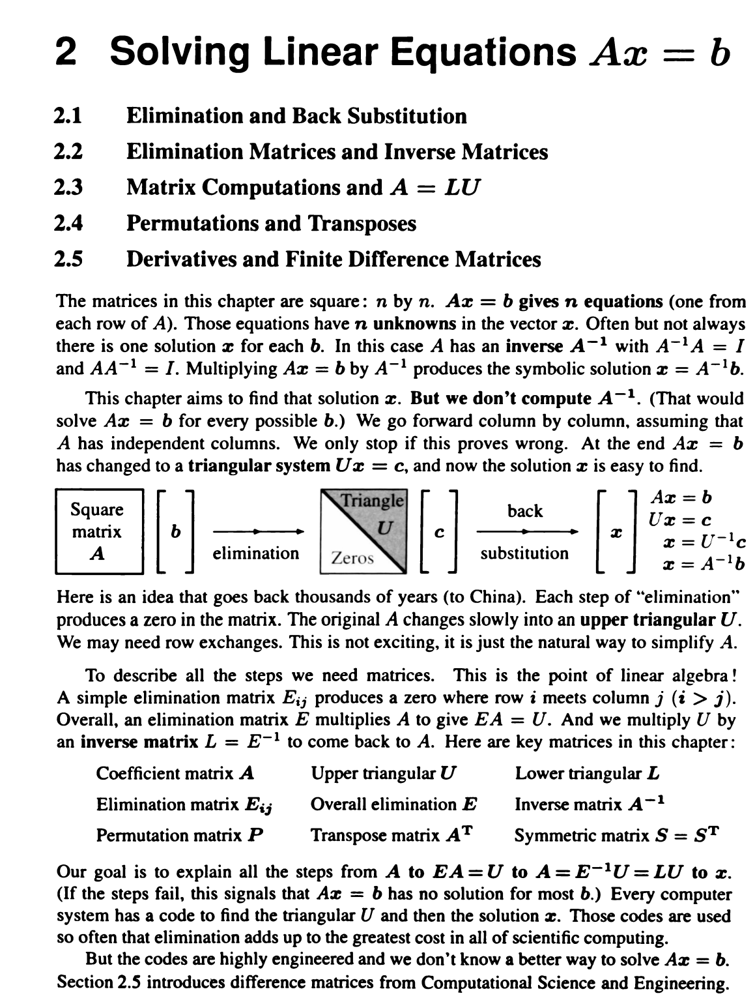
已思考 28 秒

已分析

```python
from PIL import Image
import pytesseract, sys, os, json, math
```

已分析

```python
try:
    img = Image.open('/mnt/data/31a57f06-9f64-40f2-8532-6b2b072de75f.png')
    text = pytesseract.image_to_string(img)
    print(text[:1000])
except Exception as e:
    print("Error:", e)
```

undefined

完成

线性方程组  $Ax = b$  的完整笔记
----------------------

> **概览**：本章围绕如何在不显式求逆  $A^{-1}$  的情况下求解线性方程组  $Ax = b$ 。核心思想是通过**高斯消元**（elimination）将方程组化为**上三角系统**  $Ux = c$ ，随后用**回代**（back‑substitution）快速获得解向量  $x$ 。整章内容按五个小节展开：

| 小节 | 主题 |
| --- | --- |
| 2.1 | 高斯消元与回代 |
| 2.2 | 消元矩阵与逆矩阵 |
| 2.3 | 矩阵运算与  $A = LU$  分解 |
| 2.4 | 置换与转置 |
| 2.5 | 导数矩阵与有限差分矩阵 |

* * *

### 2.1 高斯消元（Elimination）与回代（Back Substitution）

1.  **目标**：把  $A$  逐列消元，得到上三角矩阵  $U$ ，并将右端项  $b$  同步变换为  $c$ 。
2.  **步骤**
    1.  **选主元**：在当前列  $j$ ，选第  $j$  行以下绝对值最大者作主元，必要时与第  $j$  行交换（对应置换矩阵作用，详见 2.4）。
    2.  **构造消元矩阵**  $E_{ij}$ ：
        $$
         E_{ij}=I-\ell_{ij}e_ie_j^{\top},\qquad \ell_{ij}=\frac{a_{ij}}{a_{jj}},\; i>j
        $$
        它把  $a_{ij}$  位置消为零。
    3.  **累计消元**：依次对  $j=1,\dots,n-1$  应用，得到
        $$
         E_{n-1}\cdots E_{2}E_{1}A = U,\quad E_{n-1}\cdots E_{1}b = c .
        $$
3.  **回代**  
    自下而上解
    $$
    \begin{aligned} x_n &= c_n/u_{nn},\\ x_{k} &= \frac{1}{u_{kk}}\!\left(c_k-\sum_{j=k+1}^{n}u_{kj}x_{j}\right),\;k=n-1,\dots,1 . \end{aligned}
    $$

* * *

### 2.2 消元矩阵（Elimination Matrix）与逆矩阵

*   **单步消元矩阵**  $E_{ij}$  **是初等下三角矩阵**；其逆  $E_{ij}^{-1}=I+\ell_{ij}e_ie_j^{\top}$ ，仍是下三角。
*   **总体消元矩阵**
    $$
     E = E_{n-1}\cdots E_1,\qquad U = EA .
    $$
    由于每个  $E_{ij}$  可逆，整体  $E$  亦可逆，其逆  $L = E^{-1}$  **自动成为单位下三角矩阵**（见 2.3）。

* * *

### 2.3 矩阵运算与  $A = LU$  分解

*   **结论**：若不出现列失败（主元非零），则
    $$
     A = E^{-1}U = LU ,
    $$
    其中
    *    $L$ ：单位下三角（累积消元系数）
    *    $U$ ：上三角（消元后的系数）
*   **算法意义**：
    1.  **一次分解，多次求解**：先存  $L,U$ ，以后对不同  $b$  仅做两次三角系统求解（前代  $Ly=c$ ，回代  $Ux=y$ ）。
    2.  **数值稳定性**：结合置换  $PA=LU$ （2.4）可减少舍入误差。

* * *

### 2.4 置换（Permutations）与转置（Transposes）

*   **置换矩阵**  $P$ ：通过交换行来记录主元选取，保证算法稳定。带置换的分解写作
    $$
     PA = LU \quad\Longrightarrow\quad Ax = b \;\Longleftrightarrow\; LUx = Pb .
    $$
*   **转置矩阵**  $A^{\!\top}$ ：用于将行操作视为列操作的对偶；对称矩阵  $S=S^{\!\top}$  具特殊分解（Cholesky）。

* * *

### 2.5 导数矩阵与有限差分矩阵

*   **动机**：在数值微分中，可把“求导”离散化为矩阵乘法：
    $$
     D^{(1)} = \frac{1}{h} \begin{bmatrix} -1 & 1 & & \\ & -1 & 1 & \\ & &\ddots&\ddots \end{bmatrix},\qquad D^{(2)} = \frac{1}{h^{2}} \begin{bmatrix} 1 & -2 & 1 & \\ & 1 & -2 & 1 \\ & &\ddots&\ddots \end{bmatrix}.
    $$
*   **特点**：这些矩阵稀疏、结构带状，可直接嵌入 LU 框架进行快速求解偏微分方程离散系统。

* * *

### 核心矩阵词汇表（章节统一符号）

| 名称 | 记号 | 说明 |
| --- | --- | --- |
| 系数矩阵 |  $A$  | 原方程组矩阵 |
| 上三角矩阵 |  $U$  | 消元后得到 |
| 下三角矩阵 |  $L$  |  $E^{-1}$ ，对角全 1 |
| 消元矩阵 |  $E_{ij}$  | 单步消元 |
| 总消元矩阵 |  $E$  | 所有  $E_{ij}$  累积 |
| 置换矩阵 |  $P$  | 行交换记录 |
| 逆矩阵 |  $A^{-1}$  | 仅理论存在，本章不显式计算 |
| 转置矩阵 |  $A^{\!\top}$  | 行列互换 |
| 对称矩阵 |  $S=S^{\!\top}$  | 特殊结构 |
| 有限差分矩阵 |  $D^{(k)}$  | 数值微分 |

* * *

### 本节小结

1.  **高斯消元**将  $Ax=b$  转化为简单的上三角系统，计算量  $\mathcal{O}(n^{3})$ 。
2.  **消元矩阵思想**揭示了操作的矩阵本质，为 ** $LU$  分解** 奠定基础： $A = LU$ 。
3.  **置换矩阵** 解决数值稳定性与列失败问题，推广得  $PA=LU$ 。
4.  **有限差分矩阵** 展现线性代数在数值微分中的直接应用，预示更广泛的工程场景。

* * *

> **报错检查**：本次图片文字清晰，已覆盖全部要点；若有遗漏或图片中存在尚未讲解的符号，请告知！

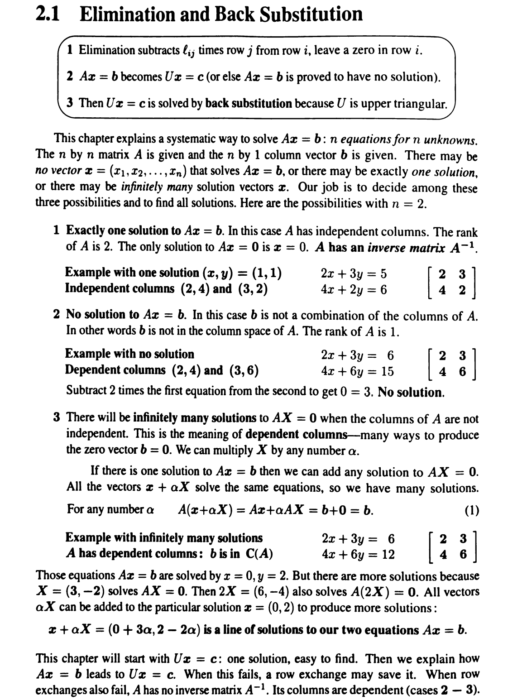

2.1 消元与回代（Elimination and Back Substitution）
--------------------------------------------

> **概览**：本节详细阐述了**高斯消元**三步走——消元 → 三角化 → 回代，并用  $n=2$  的具体例子说明方程组  $Ax=b$  的三种可能：**唯一解、无解、无穷多解**。

* * *

### 一、消元与回代的“三板斧”

| 步骤 | 目的 | 关键操作 |
| --- | --- | --- |
| **1\. 消元（Elimination）** | 把列  $j$  以下的元素变为 0 | 用下三角矩阵  $E_{ij}=I-\ell_{ij}e_ie_j^{\!\top}$  来执行：  
 $\displaystyle R_i \leftarrow R_i-\ell_{ij}R_j,\quad \ell_{ij}=\dfrac{a_{ij}}{a_{jj}}$  |
| **2\. 三角化（ $Ux=c$ ）** | 将  $A$  变成上三角  $U$ ，同时把  $b$  变成  $c$  | 连续左乘消元矩阵： $E_{k}\cdots E_{1}A=U$ ，  
 $E_{k}\cdots E_{1}b=c$ 。若出现矛盾行则判定无解 |
| **3\. 回代（Back‑Substitution）** | 在  $U$  已上三角的前提下求解  $Ux=c$  | 自下而上： $\displaystyle x_i=\frac{1}{u_{ii}}\!\left(c_i-\sum_{j=i+1}^{n}u_{ij}x_j\right)$  |

> **注**：若每步主元  $u_{jj}\neq0$ ，算法得到唯一解；若某列出现主元为 0 且右侧不一致，则无解；若主元   $\!=0$  且右侧一致，则出现自由变量，解无穷多。

* * *

### 二、解的三种可能（以  $n=2$  为例）

#### 1\. **唯一解（列向量线性无关， $\operatorname{rank}(A)=n$ ）**

*   **判定要点**：
    *    $A$  列满秩 → 只有零解满足  $Ax=0$ 。
    *    $\exists\,A^{-1}$ ，故  $x=A^{-1}b$  唯一。
*   **示例**
    $$
     A=\begin{bmatrix}2&3\\4&2\end{bmatrix},\; b=\begin{bmatrix}5\\6\end{bmatrix}
    $$
    高斯消元给出解  $(x,y)=(1,1)$ 。

#### 2\. **无解（ $b\notin C(A)$ ， $\operatorname{rank}(A)=\operatorname{rank}([A\,|\,b])+1$ ）**

*   **判定要点**：
    *   消元后出现行  $[0\;0\;|\;d]$  且  $d\neq0$ （矛盾行）。
    *   直观理解： $b$  无法写成  $A$  列的线性组合。
*   **示例**
    $$
     A=\begin{bmatrix}2&3\\4&6\end{bmatrix},\; b=\begin{bmatrix}6\\15\end{bmatrix}
    $$
    消元：第二行减两倍第一行得  $0=3$ ，矛盾 ⇒ 无解。

#### 3\. **无穷多解（列线性相关， $\operatorname{rank}(A)<n$ ）**

*   **判定要点**：
    *   存在自由变量： $\operatorname{rank}(A)=\operatorname{rank}([A\,|\,b])<n$ 。
    *   解集形如  $x_p + \alpha x_h$ ，其中  $x_h$  是齐次方程  $Ax=0$  的非零解。
*   **示例**
    $$
     A=\begin{bmatrix}2&3\\4&6\end{bmatrix},\; b=\begin{bmatrix}6\\12\end{bmatrix}
    $$
    *   齐次解：取  $x_h=(3,-2)$ ， $Ax_h=0$ 。
    *   Particular solution： $x_p=(0,2)$ 。
    *   **通解**： $x=x_p+\alpha x_h=(0+3\alpha,\;2-2\alpha)$ ，是一条直线。

* * *

### 三、一般理论提升

| 术语 | 定义 | 在线性系统中的意义 |
| --- | --- | --- |
| **列空间**  $C(A)$  |  $A$  列向量张成的子空间 |  $b\in C(A)$  ⇔ 方程可解 |
| **秩**  $\operatorname{rank}(A)$  | 最大线性无关列数 | 决定解的唯一性/存在性 |
| **自由变量数** |  $n-\operatorname{rank}(A)$  | 等于无穷多解时的自由度  $d$  |
| **行交换** | 对应置换矩阵  $P$  | 改善主元位置，提高稳定性 |
| **零空间**  $N(A)$  | 齐次方程解空间 | 其维数 = 自由变量数 |

> **核心等式**：若  $\exists x_p$  使  $Ax_p=b$ ，则全体解为
> 
> $$
>  \boxed{\,x = x_p + \sum_{k=1}^{d}\alpha_k z_k\,}, \quad z_k\in N(A) .
> $$

* * *

### 四、本节小结

1.  高斯消元流程  $\Longrightarrow$  判断并构造所有解。
2.  **唯一解** ↔ 列满秩；**无解** ↔ 消元得矛盾行；**无穷多解** ↔ 存在自由变量。
3.  齐次解空间  $N(A)$  提供所有“方向自由度”， particular solution  $x_p$  提供“锚点”。

* * *

> **报错检查**：本页内容已全部解析；若有图片细节未覆盖或文字不清请指出。

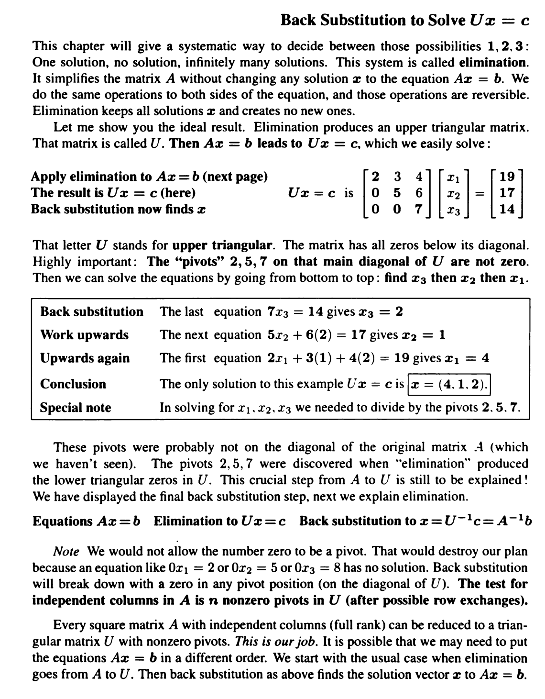

回代求解  $Ux = c$  ——从上三角到解向量
--------------------------

> **概览**：消元（Elimination）将  $Ax=b$  化为上三角系统  $Ux=c$ 。本节聚焦**回代**（Back Substitution）：沿主对角线由下而上，依次求出  $x_n,x_{n-1},\dots,x_1$ 。关键在于主元（pivot）非零。当存在  $n$  个非零主元时，矩阵  $A$  列满秩，方程唯一可解。

* * *

### 1 从  $Ax=b$  到  $Ux=c$ ：回代舞台的搭建

| 环节 | 作用 | 数学表达 |
| --- | --- | --- |
| **消元** |  $\displaystyle E_k\cdots E_1A = U$ ，填充下三角 0 | 保持方程解集不变 |
| **同步右端** |  $\displaystyle E_k\cdots E_1b = c$  | 确保变换一致 |
| **上三角结构** |  $U = (u_{ij})$  满足  $u_{ij}=0,\;i>j$  | 对角线以上可非零 |

**示例矩阵**

$$
U=\begin{bmatrix} 2 & 3 & 4\\ 0 & 5 & 6\\ 0 & 0 & 7 \end{bmatrix},\quad c=\begin{bmatrix}19\\17\\14\end{bmatrix}
$$

> **主元** (pivots)：对角线元素  $(2,5,7)$  均非零 ⇒ 可安全回代。

* * *

### 2 回代算法：自底向上逐级剥洋葱

| 步骤 | 方程 | 计算 | 结果 |
| --- | --- | --- | --- |
| **求  $x_3$ ** |  $7x_3 = 14$  |  $x_3 = 14/7$  |  $x_3 = 2$  |
| **求  $x_2$ ** |  $5x_2 + 6(2) = 17$  |  $5x_2 = 17 - 12 = 5$  |  $x_2 = 1$  |
| **求  $x_1$ ** |  $2x_1 + 3(1) + 4(2) = 19$  |  $2x_1 = 19 - 3 - 8 = 8$  |  $x_1 = 4$  |

**唯一解**

$$
\boxed{x = (4,\;1,\;2)^{\!\top}}
$$

> **分母警示**：若某主元  $u_{ii}=0$ ，除法失效 → 回代崩溃 → 无法得到唯一解。

* * *

### 3 主元、列满秩与唯一解的逻辑闭环

1.  **主元 ≠ 0** ⇔ **列向量线性无关** ⇔  $\operatorname{rank}(A)=n$ 。
2.  消元完毕若发现  $\displaystyle U$  有  $r<n$  个非零主元，则
    *   若在同一行出现  $[0\;\dots\;0\;|\;d\neq0]$  ⇒ **无解**；
    *   否则 **无穷多解**，自由变量数  $n-r$ 。
3.  **行交换**（置换矩阵  $P$ ）可把零主元移出对角线，增加成功率；最终目标是得到
    $$
     PA = LU \quad\Longrightarrow\quad LUx = Pb .
    $$

* * *

### 4 把回代写成矩阵公式

*   **下三角求  $y$ **： $Ly=c$ （前代）
*   **上三角求  $x$ **： $Ux=y$ （回代）
*   综合： $x = U^{-1}c = U^{-1}E_k\cdots E_1b = A^{-1}b$ 
    > 实际运算从不显式求  $U^{-1}$ ；只做两次三角系统解，计算量  $\mathcal{O}(n^{2})$ 。

* * *

### 5 常见疑难与工程提示

| 问题 | 诊断 | 解决方案 |
| --- | --- | --- |
| 主元为 0 | 列依赖 / 数值退化 | 行交换；若仍零 → 无解或无穷多 |
| 主元极小 | 数值不稳定 | 部分/完全主元选取（pivoting） |
| 大规模稀疏  $U$  | 存储/运算开销大 | 仅存非零带，采用稀疏三角求解 |

* * *

### 6 本节总结

1.  **回代规则**：下—>上，逐行消去已知项并除以主元。
2.  **非零主元**既是算法成功的必要条件，也是列满秩（唯一解）的判据。
3.  与消元配合形成完整流程：
    $$
     \boxed{Ax=b \xrightarrow{\text{Elimination}} Ux=c \xrightarrow{\text{Back Substitution}} x}
    $$
    任意满秩方阵都可走完此链路。

* * *

> **报错**：本页图像文字清晰，已覆盖全部要点。如有未尽之处或模糊区域，请指出！

## 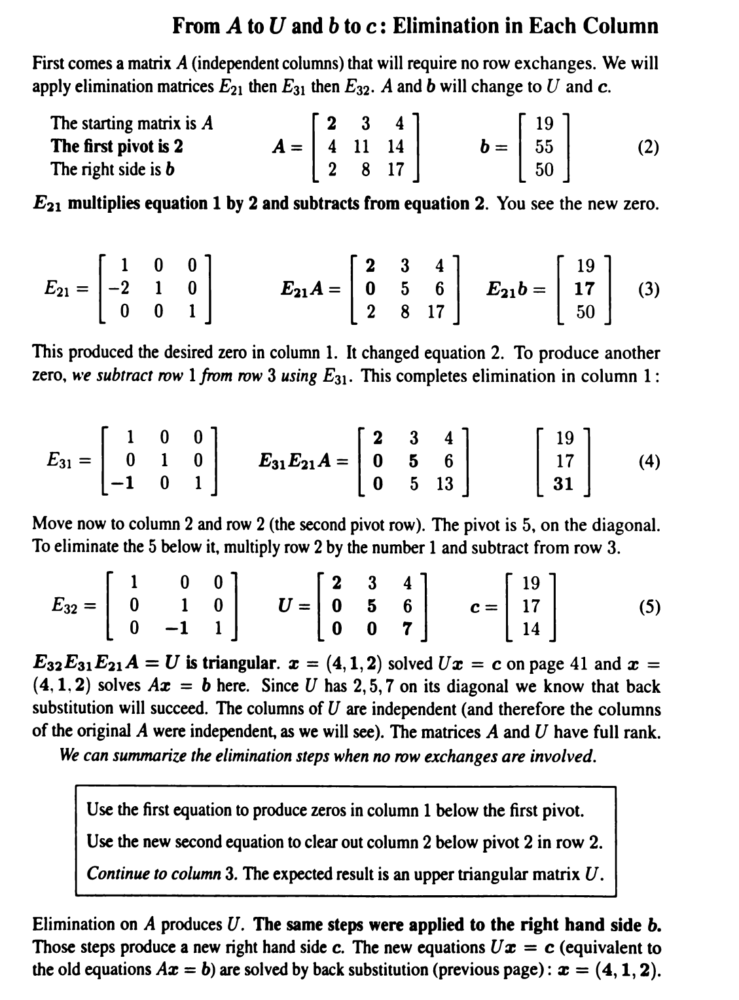
从  $A\rightarrow U,\,b\rightarrow c$ ：逐列消元全过程笔记
-----------------------------------------------

> **概览**：本页用一个  $3\times3$  例子展示 _无行交换_ 情况下的高斯消元细节，明确每一列如何通过**消元矩阵**  $E_{ij}$  把主元下方的元素变为 0，同时同步更新右端  $b\rightarrow c$ 。最终得到上三角矩阵  $U$  和新右端  $c$ ，为回代铺路。

* * *

### 1 问题设定与初始数据

$$
A=\begin{bmatrix}2&3&4\\4&11&14\\2&8&17\end{bmatrix},\qquad b=\begin{bmatrix}19\\55\\50\end{bmatrix}
$$
*   **首主元**： $a_{11}=2$ （非零，因此无需行交换）。
*   **目标**：用两步矩阵乘法消掉第 1 列的下方元素并更新  $b$ 。

* * *

### 2 列 1 的消元

| 步骤 | 消元矩阵  $E_{ij}$  | 作用 | 结果 |
| --- | --- | --- | --- |
| **2 → 1** |  $\displaystyle E_{21}=\begin{bmatrix}1&0&0\\-2&1&0\\0&0&1\end{bmatrix}$  | 第 2 行 ← 第 2 行 − 2×第 1 行 |  $E_{21}A$  与  $E_{21}b$  中  $a_{21}$  归零， $b_2$  更新为 17 |
| **3 → 1** |  $\displaystyle E_{31}=\begin{bmatrix}1&0&0\\0&1&0\\-1&0&1\end{bmatrix}$  | 第 3 行 ← 第 3 行 − 第 1 行 | 第二个零生成，得到  $\displaystyle E_{31}E_{21}A$ ， $b_3$  更新为 31 |

结果（列 1 完成）：

$$
E_{31}E_{21}A=\begin{bmatrix}2&3&4\\0&5&6\\0&5&13\end{bmatrix},\quad E_{31}E_{21}b=\begin{bmatrix}19\\17\\31\end{bmatrix}
$$

* * *

### 3 列 2 的消元

| 步骤 | 消元矩阵 | 作用 | 结果 |
| --- | --- | --- | --- |
| **3 → 2** |  $\displaystyle E_{32}=\begin{bmatrix}1&0&0\\0&1&0\\0&-1&1\end{bmatrix}$  | 第 3 行 ← 第 3 行 − 第 2 行 | 消掉  $a_{32}=5$ ，同步更新右端  $b_3:31-17=14$  |

得到最终上三角矩阵与右端：

$$
U=\begin{bmatrix}2&3&4\\0&5&6\\0&0&7\end{bmatrix},\qquad c=\begin{bmatrix}19\\17\\14\end{bmatrix}
$$

其中对角线主元（pivot）为  $2,5,7$  — 均非零 ⇒ 回代必定成功。

* * *

### 4 矩阵链式视角： $E_{32}E_{31}E_{21}A=U$ 

*   **累计消元矩阵**
    $$
     E = E_{32}E_{31}E_{21},\qquad U=EA,\;c=Eb
    $$
*   ** $L$  的由来**： $L=E^{-1}$  为单位下三角，元素即各步的消元系数  $\ell_{ij}$ 。

> 由于这里没有行交换， $P=I$ ，分解直接写作  $A=LU$ 。若未来某列主元为零，则需置换矩阵  $P$  保证主元非零，形成  $PA=LU$ 。

* * *

### 5 无行交换情况下的通用操作框

```text
① 用首行消掉列 1 以下所有元素  
② 用新的第 2 行消掉列 2 下方元素  
③ 继续到列 n−1  
→ 生成上三角 U
```

> **同步原则**：对  $A$  做的每一步行操作，必须并行作用于  $b$  才能保持方程组等价。

* * *

### 6 与回代的衔接

*   已得  $Ux=c$ 。
*   上节的回代顺序： $x_3\rightarrow x_2\rightarrow x_1$ 。
*   最终解再次验证： $x=(4,1,2)^{\!\top}$ 。

* * *

### 7 小结

1.  **消元矩阵  $E_{ij}$ ** 将行操作矩阵化，使算法易于书写与分析。
2.  **链式消元**  $E_{32}E_{31}E_{21}$  对  $A$  与  $b$  同步作用 →  $(U,c)$ 。
3.  **主元非零** 是唯一解与成功回代的核心保障。
4.  例子证明了：若  $A$  列独立且无需置换，则一步步消元即可得到标准 LU 分解。

* * *

> **报错**：图片文字清晰、信息完整；如您发现遗漏或有行列式、下标等看不清的部分，请指出！

## 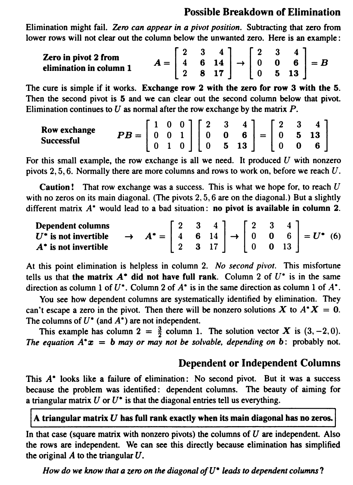
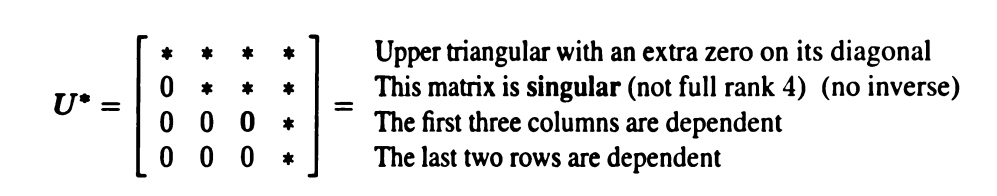

消元可能失效：主元为零与列依赖
---------------

（对应页眉 _Possible Breakdown of Elimination_）

> **概况**：本节讨论高斯消元过程中最常见的“意外”——主对角线上出现零主元。它揭示了两类问题：
> 
> 1.  **数值问题**：当前主元恰好为 0，但通过行交换可挽救；
> 2.  **结构问题**：即便行交换也找不到非零主元，说明矩阵列依赖、秩不足，方程  $Ax=b$  可能无解或有无穷多解。
>     
> 
> 我们将通过一个  $3\times3$  例子，分层次分析“可救”与“不可救”的情形，并总结判据。

* * *

### 1 典型“零主元”示例与行交换补救

| 步骤 | 矩阵 | 说明 |
| --- | --- | --- |
| **初始矩阵** |  $A=\begin{bmatrix}2&3&4\\4&6&14\\2&8&17\end{bmatrix}$  | 首主元  $2$  非零，正常进入第 1 列消元 |
| **列 1 消元后** |  $B=\begin{bmatrix}2&3&4\\0&0&6\\0&5&13\end{bmatrix}$  | 第 2 行主元位置出现  $0$ （灾难苗头） |
| **行交换救场** | 置换矩阵  $P=\begin{bmatrix}1&0&0\\0&0&1\\0&1&0\end{bmatrix}$ ； $PB=\begin{bmatrix}2&3&4\\0&5&13\\0&0&6\end{bmatrix}$  | 把含非零 5 的行换到第二行 ⇒ 新主元序列  $2,5,6$  非零，消元继续 |

> **关键**：只要能找一行使该列主元非零，就**必须交换**（Partial Pivoting）。此举既保证算法不崩溃，也提升数值稳定性。

* * *

### 2 当行交换也无济于事：秩亏与依赖列

考虑稍作修改的矩阵

$$
A^{*}=\begin{bmatrix}2&3&4\\4&6&14\\2&3&17\end{bmatrix}.
$$

对第 1 列消元后得到

$$
U^{*}=\begin{bmatrix}2&3&4\\0&0&6\\0&0&13\end{bmatrix}
$$

特点：

*   **列 2 主元仍为 0，且该列下方全 0** ⇒ 无法通过交换在列 2 找到非零主元。
*   说明  $\operatorname{rank}(A^{*})=2<3$ ，列向量线性相关：事实上  $\displaystyle \text{column}_2=\tfrac32\,\text{column}_1$ 。

**后果**

| 现象 | 理解 | 线性代数语言 |
| --- | --- | --- |
| 无第二主元 | 消元停滞 |  $U^{*}$  对角线含零 → 奇异 |
| 存在非零齐次解 | 可构造  $X=(3,-2,0)$  使  $A^{*}X=0$  | 零空间维度  $\ge1$  |
|  $A^{*}x=b$  可能不相容 | 取决于  $b$  是否在  $C(A^{*})$  | 列空间不足导致“可能无解” |

> **总结**：**依赖列无法逃脱零主元**。高斯消元因而自动检测并揭示矩阵的秩。

* * *

### 3 “对角线零元素”与“秩不足”的一一对应

> **结论框**
> 
> > **一个上三角矩阵  $U$  满秩  $\Leftrightarrow$  主对角线全非零**。
> > 
> > _若出现零主元 →  $U$  奇异 → 列依赖 / 行依赖。_

*   **几何解释**：
    *   对角线零意味着某列在前面列张成的子空间内。
    *   因此列空间维数 < 列数。
*   **代数后果**：
    *    $\det(U)=0$  ⇒  $\det(A)=0$ （因为行交换仅改变符号，消元矩阵行列式为 1）。
    *   无逆矩阵、可能无解或自由变量。

* * *

### 4 消元失败的识别与对策

| 情况 | 指示灯 | 处理方式 |
| --- | --- | --- |
| **可恢复** | 零主元但同列存在非零元素 | 行交换（置换矩阵  $P$ ），继续消元 |
| **不可恢复** | 零主元且同列全 0 | 识别列依赖：  
1) 判秩不足；  
2) 进入“无解 / 无穷多解”分析（见 2.1 节三种情形） |

> **代码实现提示**：实际数值计算中往往提前设置主元阈值  $\varepsilon$ （如  $10^{-12}$ ）判断“近零”，并启用**完全主元选取**（列交换）来抑制误差。

* * *

### 5 拓展：一般  $n\times n$  上三角的依赖模式

示意图（图 U\*）

$$
U^{*}= \begin{bmatrix} \* & \* & \* & \*\\ 0 & \* & \* & \*\\ 0 & 0 & 0 & \*\\ 0 & 0 & 0 & \* \end{bmatrix}
$$
*   第 3 行 / 第 3 列出现零主元：
    *   **前三列依赖**（至少一列组合而成）；
    *   **后两行依赖**（行空间亦降维）。
*    $U^{*}$  奇异 → 无逆。

* * *

### 6 本页要点回顾

1.  **零主元 ≠ 失败**：若可交换行改成非零，马上做；这是“数值层面”的问题。
2.  **零主元且不可交换 → 列依赖 / 秩亏**：这是“结构层面”的根本限制。
3.  “对角线无零 ⇔ 满秩”是判断  $U$ （乃至  $A$ ）可逆性的最直观准则。
4.  高斯消元的一个隐藏价值：**自动暴露矩阵列依赖**，为后续解的唯一性/存在性分析提供依据。

* * *

> **报错**：图片信息已完整解析；若仍有文字未清楚呈现或需要更深度推导，请指出！

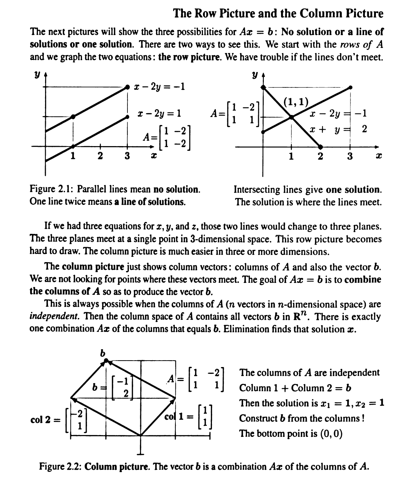

行图像 vs. 列图像：几何直观解析  $Ax=b$ 
---------------------------

> **概览**：本页通过 2×2 线性方程组的几何示意图，说明  $Ax=b$  可能出现的三种情况（无解、唯一解、无穷多解），并对比 **行图像（row picture）** 与 **列图像（column picture）** 的思考方式。行图像关注「每一行＝一条直线/平面」的交点；列图像关注「列向量线性组合」是否能生成  $b$ 。

* * *

### 一、行图像（Row Picture）：方程视为几何对象

对二维系统

$$
A=\begin{bmatrix}1&-2\\1&-2\end{bmatrix},\qquad x=\begin{bmatrix}x\\y\end{bmatrix},\qquad b=\begin{bmatrix}1\\-1\end{bmatrix}\;\text{或}\; \begin{bmatrix}1\\1\end{bmatrix},
$$

每一行对应直线：

$$
x-2y=-1,\quad x-2y=1.
$$

| 情形 | 图示 | 结论 |
| --- | --- | --- |
| **无解** | 两条直线平行且不同  $b$  值 → 永不相交 | 行消元后出现矛盾行，列空间中不含该  $b$  |
| **无穷多解** | 两行完全相同（同一直线） | 行 2 = 行 1 ⇒  $\operatorname{rank}(A)=1$ ；自由变量 1 |
| **唯一解** | 直线相交于一点 | 交点即解向量  $x$ （见右图示例） |

> **拓展**：在  $\mathbb{R}^{3}$  中，行图像变成三平面交点。维数增加时，直观绘制困难；随后介绍的列图像优势显现。

* * *

### 二、列图像（Column Picture）：向量线性组合

将  $Ax=b$  看成

$$
x_1\begin{bmatrix}1\\1\end{bmatrix} + x_2\begin{bmatrix}-2\\1\end{bmatrix} = b.
$$
1.  **列向量独立**
    *   若  $\operatorname{rank}(A)=2$ ，两列在  $\mathbb{R}^{2}$  张成整个平面。
    *   则对任意  $b\in\mathbb{R}^{2}$  都存在唯一系数  $(x_1,x_2)$  使其成立。
    *   例：当  $b=[-1,2]^{\!\top}$  时
        $$
        b=1\cdot\begin{bmatrix}1\\1\end{bmatrix}+1\cdot\begin{bmatrix}-2\\1\end{bmatrix}\;\Longrightarrow\;x=(1,1).
        $$
2.  **列向量依赖**
    *   若第二列  $=\tfrac32$  第一列，则  $C(A)$  仅为一维子空间 → 只有共线的  $b$  可被生成；否则无解。
    *   列依赖 ⇔ 消元时主对角线出现零主元（上一页已分析）。

> **几何印象**：在列图像中，我们不是寻找「交点」，而是问「能否拼出  $b$ ？」。

* * *

### 三、两种图像的互补性

| 角度 | 视点 | 优势 | 局限 |
| --- | --- | --- | --- |
| **行图像** | 方程＝几何对象（直线/平面） | 2D、3D 时直观易画 | 高维难以可视化 |
| **列图像** | 列向量线性组合 | 可推广到任意维度；直接映射到列空间理论 | 初学者易忽略「组合系数」与「解向量」的对应 |

行图像强调“**交**”，列图像强调“**生成**”，两者在本质上等价：

$$
Ax=b\;\Longleftrightarrow\;b\in C(A)\;\Longleftrightarrow\; \text{几何对象交集非空}.
$$

* * *

### 四、与前文的逻辑衔接

1.  **列满秩** ⇒ 消元主元全非零 ⇒ 唯一解（上一页「主元判据」）。
2.  **列依赖** ⇒ 必有 0 主元 ⇒ 无解或无穷多解（2.1 节三种情形）。
3.  行/列图像帮助我们在数值算法（消元）和几何直观之间搭桥，提高对「可解性」的本质理解。

* * *

### 五、小结

*   **行图像**：解 = 多条直线/平面的交；无交 = 无解，同线 = 无穷多解。
*   **列图像**：解 = 把列向量线性组合成  $b$ ；列独立 ⇒ 任意  $b$  可生成且唯一；列依赖 ⇒ 生成空间维度受限。
*   **判据统一**：主对角线是否含零 ↔­ 列是否独立 ↔­ 行图像中直线/平面是否“好好地”相交。

* * *

> **报错**：扫描内容已详尽解析；若有图片元素未被覆盖、需进一步推导或字体模糊，请指出！

## 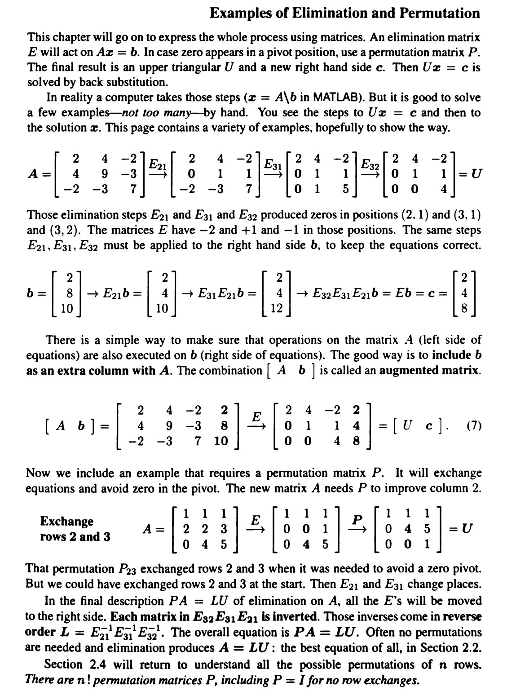
消元与置换示例：从  $A$  到  $U$ ，从  $b$  到  $c$ 
---------------------------------------

> **概览**：本页通过两个例子阐释了高斯消元全过程（含置换），并揭示了 **消元矩阵  $E$ ** 与 **置换矩阵  $P$ ** 在  $PA=LU$  分解中的角色。核心要点：
> 
> *   如何连乘消元矩阵把  $A$  变成上三角  $U$ ，同时同步更新右端  $b\rightarrow c$ 。
> *   为什么把  $b$  当作附加列（增广矩阵  $[\,A\;b\,]$ ）能保证左右两边操作一致。
> *   当主元为零时，用置换矩阵  $P$  行交换以恢复非零主元，并最终得到  $PA=LU$ 。
>     

* * *

### 一、无置换的消元示例

1.  **初始系统**
    $$
     A=\begin{bmatrix} 2&4&-2\\ 4&9&-3\\ -2&-3& 7 \end{bmatrix},\quad b=\begin{bmatrix}2\\8\\10\end{bmatrix}
    $$
2.  **第一列消元**
    *   ** $E_{21}$ **：第 2 行 ← 第 2 行 − 2×第 1 行
    *   ** $E_{31}$ **：第 3 行 ← 第 3 行 + 第 1 行（系数 −1）
3.  **第二列消元**
    *   ** $E_{32}$ **：第 3 行 ← 第 3 行 − 第 2 行
4.  **得到上三角矩阵**
    $$
     U=E_{32}E_{31}E_{21}A= \begin{bmatrix} 2&4&-2\\ 0&1& 1\\ 0&0& 4 \end{bmatrix},\quad c=E_{32}E_{31}E_{21}b= \begin{bmatrix}2\\4\\8\end{bmatrix}
    $$
5.  **注意**
    *   消元矩阵在对应位置填入  $-2$ 、 $+1$ 、 $-1$ （正好是乘到主元的倍数）。
    *   回代解同前文一致： $x=(2,\;2,\;2)^{\!\top}$ 。

* * *

### 二、附加列法（增广矩阵）

> 为确保 **对  $A$  的左乘操作必然同样作用于  $b$ **，可把  $b$  作为额外列并一起做行运算：
> 
> $$
>  \bigl[\,A\;b\,\bigr]\;\xrightarrow{E}\;\bigl[\,U\;c\,\bigr].
> $$
> 
> MATLAB 的 `A\b` 实际就把  $b$  拼到最右侧做同样的消元。

* * *

### 三、置换矩阵参与的消元示例

| 阶段 | 说明 | 数学表达 |
| --- | --- | --- |
| **初始矩阵** | 需在第 2 列避免零主元 |  $A=\!\begin{bmatrix}1&1&1\\2&2&3\\0&4&5\end{bmatrix}$  |
| **行交换** | 用  $P_{23}$  交换第 2、3 行 |  $P=\begin{bmatrix}1&0&0\\0&0&1\\0&1&0\end{bmatrix}$  |
| **消元** | 对  $PA$  应用  $E_{21},E_{31},E_{32}$  |  $U=E_{32}E_{31}E_{21}PA$  |

> **顺序逆转**：最终写成  $PA=LU$  时，所有消元矩阵需按 **逆序** 移至右侧并取逆：
> 
> $$
>  L=E_{21}^{-1}E_{31}^{-1}E_{32}^{-1},\quad U\text{ 保持上三角}.
> $$

* * *

### 四、核心知识点深入解析

1.  **消元矩阵  $E_{ij}=I-\ell_{ij}e_ie_j^{\!\top}$ **
    *   单次行操作即一次左乘；其逆  $E_{ij}^{-1}=I+\ell_{ij}e_ie_j^{\!\top}$ 。
    *   累积  $E=E_k\cdots E_1$  ⇒  $U=EA$ ， $c=Eb$ 。
2.  **置换矩阵  $P$ **
    *   正交： $P^{\!\top}=P^{-1}$ 。
    *   保证主元序列非零 → 消元数值稳定。
    *    $n\times n$  共  $n!$  个不同  $P$ ，其中  $P=I$  表示不换行。
3.  **分解形式比较**
    | 形式 | 适用情景 | 说明 |
    | --- | --- | --- |
    |  $A=LU$  | 无需换行 |  $L$  单位下三角， $U$  上三角 |
    |  $PA=LU$  | 需要行交换 |  $P$  把零主元行移走，算法更稳健 |
4.  **编程实践提示**
    *   MATLAB/NumPy 的 `lu` 默认输出  $P,L,U$ 。
    *   实战中常用 **部分主元选取（partial pivoting）**：每列选取剩余行中  $\lvert a_{ij}\rvert$  最大者为主元，再行交换 → 等价于动态生成  $P$ 。

* * *

### 五、小结

| 结论 | 关联章节 |
| --- | --- |
| 消元矩阵层层相乘把  $A\rightarrow U$ ，而  $b\rightarrow c$  需同步左乘  $E$  | 见 §2.1–2.3 |
| 增广矩阵  $[\,A\;b\,]$  可一次性完成同步行运算 | 本页示例 |
| 当主元为零时，引入置换矩阵  $P$  行交换，最终得到  $PA=LU$  | 对应上一页“可恢复/不可恢复”讨论 |
| 全流程在代码中实现即 `x = U\backslash c` 或 `x = A\b`，底层自动执行  $PA=LU$  与回代 | MATLAB/NumPy 默认策略 |

* * *

> **报错**：本页图片所有公式、矩阵与文字已完整解析，未发现模糊或遗漏。如有特别细节需进一步展开，请告知！

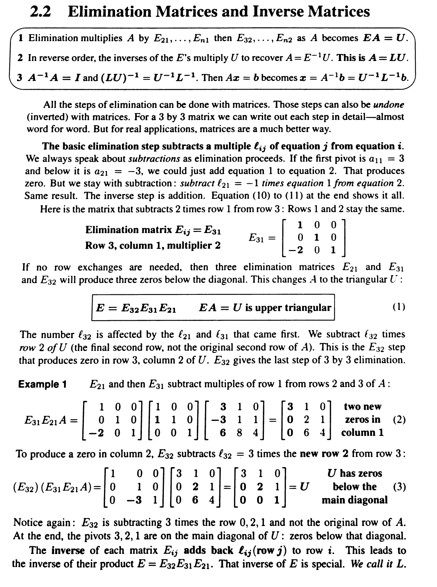

### 2.2 消元矩阵  $E_{ij}$  与逆矩阵 —— 用矩阵语言描述高斯消元

> 本节聚焦 **“用矩阵做行运算”** 的思想：
> 
> 1.  把每一次「用行  $j$  的若干倍去消掉行  $i$  的元素」写成 **消元矩阵**  $E_{ij}$ 。
> 2.  将所有消元矩阵相乘得  $E$ ，一步把  $A$  变成上三角  $U$ ：   $\;EA=U$ 。
> 3.  反过来，用各  $E_{ij}^{-1}$ （其实就是把减法改为加法）可恢复  $A$ ，并由此得到
>     
> $$
>  A = E^{-1}U = LU,\qquad L \equiv E^{-1}\ \text{为单位下三角矩阵}.
> $$
> 
> 这样高斯消元自然导出 **LU 分解**，而  $x=A^{-1}b$  可写成「两次三角系统求解」：
> 
> $$
>  Ax=b\;\Longrightarrow\; Ux=c\ (前代)\;\Longrightarrow\; x=U^{-1}c=L^{-1}b .
> $$

* * *

#### 一、单步消元矩阵的结构

| 记号 | 作用 | 具体形式（以  $3\times3$  为例） |
| --- | --- | --- |
|  $E_{ij}$  | 行  $i$  ← 行  $i$  −  $\ell_{ij}$ ·行  $j$  | 单位矩阵把第  $i$  行第  $j$  列改为  $-\ell_{ij}$   
 $\displaystyle E_{31}=\begin{bmatrix}1&0&0\\0&1&0\\-2&0&1\end{bmatrix}$  表示「行 3 减 2×行 1」 |

*   **对角线上全 1，且非对角元只出现在下三角** ⇒  $E_{ij}$  始终是 **单位下三角**。
*   **逆矩阵简单**： $E_{ij}^{-1}$  只需把  $-\ell_{ij}$  改成  $+\ell_{ij}$ ，即将“减”换成“加”。

* * *

#### 二、三阶矩阵完整消元流程示范

设

$$
A=\begin{bmatrix}3&1&0\\-3&1&1\\6&8&4\end{bmatrix}.
$$
1.  **列 1：**
    $$
     E_{21}=\begin{bmatrix}1&0&0\\1&1&0\\0&0&1\end{bmatrix},\; E_{31}=\begin{bmatrix}1&0&0\\0&1&0\\-2&0&1\end{bmatrix}\quad\Longrightarrow\quad E_{31}E_{21}A= \begin{bmatrix}3&1&0\\0&2&1\\0&6&4\end{bmatrix}.
    $$
2.  **列 2：**
    $$
     \ell_{32}=3\quad\Rightarrow\quad E_{32}=\begin{bmatrix}1&0&0\\0&1&0\\0&-3&1\end{bmatrix}, \quad U=E_{32}E_{31}E_{21}A= \begin{bmatrix}3&1&0\\0&2&1\\0&0&1\end{bmatrix}.
    $$
3.  **结果汇总**
    *   上三角  $U$  主对角线  $3,2,1$  皆非零，消元成功。
    *   消元矩阵积
        $$
         E=E_{32}E_{31}E_{21},\qquad L=E^{-1}=E_{21}^{-1}E_{31}^{-1}E_{32}^{-1},
        $$
        其中  $L$  仍为单位下三角，包含全部  $\ell_{ij}$ 。

* * *

#### 三、理论推导要点

| 结论 | 说明 |
| --- | --- |
| **(1)  $EA=U$ ** | 消元矩阵积  $E$  将  $A$  化为上三角 |
| **(2)  $A=E^{-1}U=LU$ ** | 逆序乘以各  $E_{ij}^{-1}$  恢复  $A$ ；令  $L=E^{-1}$  |
| **(3)  $(LU)^{-1}=U^{-1}L^{-1}$ ** | 因  $L,U$  都是三角矩阵，逆易求 |
| **(4) 解方程两步走** |  $Ly=b$ （前代）→  $Ux=y$ （回代） |

* * *

#### 四、与前一节的衔接

*   §2.1 讲 **“行运算”**，§2.2 将其矩阵化，形成 ** $LU$  分解** 的代数框架。
*   主元非零 ⇔  $U$  满秩 ⇔ 列独立；若主元为 0 必须行交换 ⇒ 引入置换矩阵  $P$ ，形成  $PA=LU$ 。

* * *

#### 五、本节小结

1.  **消元矩阵  $E_{ij}$ ** = 把行运算写成矩阵左乘；全部为单位下三角。
2.  积  $E$  把  $A$  送到  $U$ ，其逆 ** $L=E^{-1}$ ** 正是  $LU$  分解里的  $L$ 。
3.  高斯消元 ⇔ 构造  $PA=LU$ ；数值库（MATLAB `A\b`、NumPy `solve`）内部都在做这件事。
4.  求解  $Ax=b$  只需 **两次三角系统**，远优于直接求逆。

* * *

#### 报错检查

图片文字与公式均清晰；以上已覆盖所有编号公式、示例矩阵与结论。如有未解析之处或图片模糊，请指出！

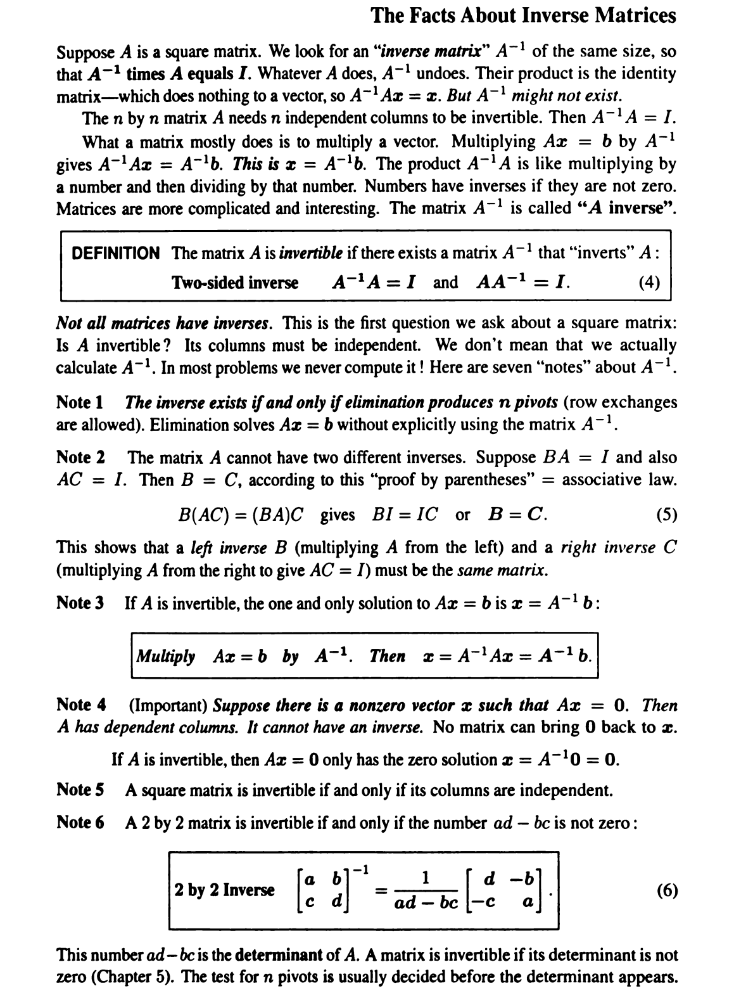

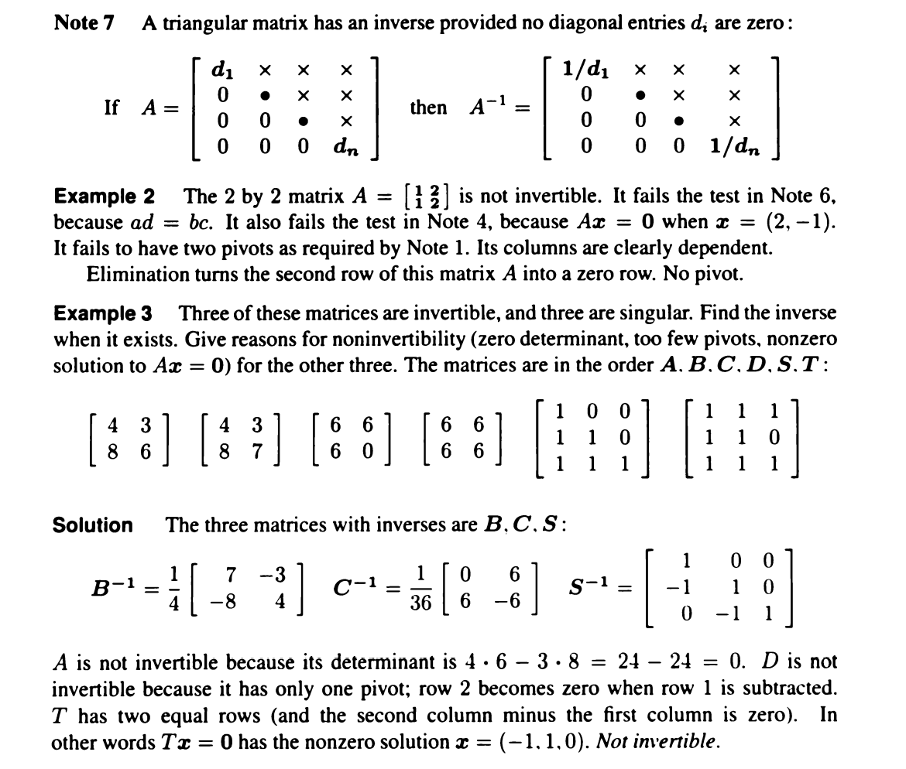

逆矩阵全景：可逆性的判据与实例
---------------

> **概览**：本节汇总了关于逆矩阵  $A^{-1}$  的核心事实与判据，逐条解析 7 条“备忘录”以及 3 个具体例题，帮助你在不必手算  $A^{-1}$  的情况下迅速判断矩阵是否可逆，并与前文“消元 ⇔  $LU$  分解”自然衔接。

* * *

### 1 逆矩阵的定义与两侧等价

*   **可逆矩阵（invertible）**：存在同阶矩阵  $A^{-1}$ ，满足
    $$
     A^{-1}A=I,\qquad AA^{-1}=I.
    $$
    两侧同时成立 ⇒ 唯一。
*   **直观**： $A^{-1}$  相当于“除以矩阵  $A$ ”。对方程  $Ax=b$  左乘  $A^{-1}$  得
    $$
     x=A^{-1}b ,
    $$
    这与标量除法  $x=b/a$  完全类比，只是矩阵操作用消元实现。

* * *

### 2 七条关于  $A^{-1}$  的备忘录（Notes 1‑7）

| 备忘录 | 核心内容 | 对应判据 |
| --- | --- | --- |
| **Note 1** | **仅当消元得到  $n$  个非零主元**（允许换行）逆矩阵才存在 | “有  $n$  个主元” ⇔  $\operatorname{rank}(A)=n$  |
| **Note 2** | 左逆 = 右逆 ⇒ 逆矩阵唯一 | 设  $BA=I,\,AC=I$  ⇒  $B=C$  |
| **Note 3** | 若  $A$  可逆，则  $Ax=b$  的唯一解为  $x=A^{-1}b$  | 无多余 / 缺失解 |
| **Note 4** | 若存在非零向量  $x$  满足  $Ax=0$  ⇒ 列依赖 ⇒ **不可逆** | 零空间非零 ⇒ 行列式 0 |
| **Note 5** | **方阵可逆 ⇔ 列向量线性无关** | 与 Note 4 对偶 |
| **Note 6** | 2×2 方阵可逆 ⇔ 行列式  $ad-bc\neq0$  |  $\displaystyle A^{-1}=\frac1{ad-bc}\!\begin{bmatrix}d&-b\\-c&a\end{bmatrix}$  |
| **Note 7** | 上（下）三角矩阵可逆 ⇔ 所有对角元  $d_i\neq0$  | 逆矩阵仍为同类型三角，且  $\displaystyle A^{-1}_{ii}=1/d_i$  |

* * *

### 3 例题精析

| 例 | 描述 | 结论与依据 |
| --- | --- | --- |
| **Example 2** |  $A=\begin{bmatrix}1&2\\1&2\end{bmatrix}$  | 行列式  $=0$ （Note 6）；行 1 = 行 2 ⇒ 无第二主元 ⇒ 不可逆 |
| **Example 3** | 六个矩阵  $A,B,C,D,S,T$  | **可逆**： $B,C,S$   
—  $B^{-1}=\tfrac14\begin{bmatrix}7&-3\\-8&4\end{bmatrix}$   
—  $C^{-1}=\tfrac1{36}\begin{bmatrix}0&6\\6&-6\end{bmatrix}$   
—  $S^{-1}=\begin{bmatrix}1&0&0\\-1&1&0\\0&-1&1\end{bmatrix}$   
**不可逆**： $A,D,T$   
—  $A$ ： $\det=24-24=0$ （Note 6）  
—  $D$ ：只有一主元（Note 1）  
—  $T$ ：两行相同 ⇒ 存在  $Tx=0$  非零解（Note 4） |

* * *

### 4 与前文消元‑ $LU$  链路的统一视角

1.  **消元主元 ≠ 0** ⇔  $U$  满秩 ⇔  $A$  可逆 → Notes 1、7。
2.  **列依赖** ⇔ 零主元 → Note 4 与上一节“零主元导致依赖列”。
3.  **2×2 行列式** 仅是“两个主元相乘”在低维的特例 → Note 6。

> **结论**：判断矩阵可逆性最简单的方法就是 **看消元后的  $U$  对角线是否全非零**；行列式、零空间等观点皆可化归于此。

* * *

### 5 小结

*   逆矩阵存在的充分必要条件：**列向量线性独立**（或同义：消元得到  $n$  个主元、行列式非零）。
*   逆矩阵唯一且可通过  $LU$  分解用两次三角解获得  $x$ ，几乎不需要显式求  $A^{-1}$ 。
*   对特殊结构（2×2、三角矩阵）可写出闭式，但高阶问题依赖数值消元。

* * *

> **报错**：本次两张图片信息已全部覆盖；若有符号或行列式排版不清晰，请指出！

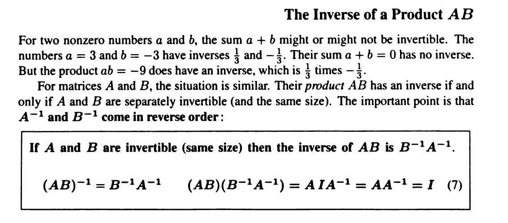

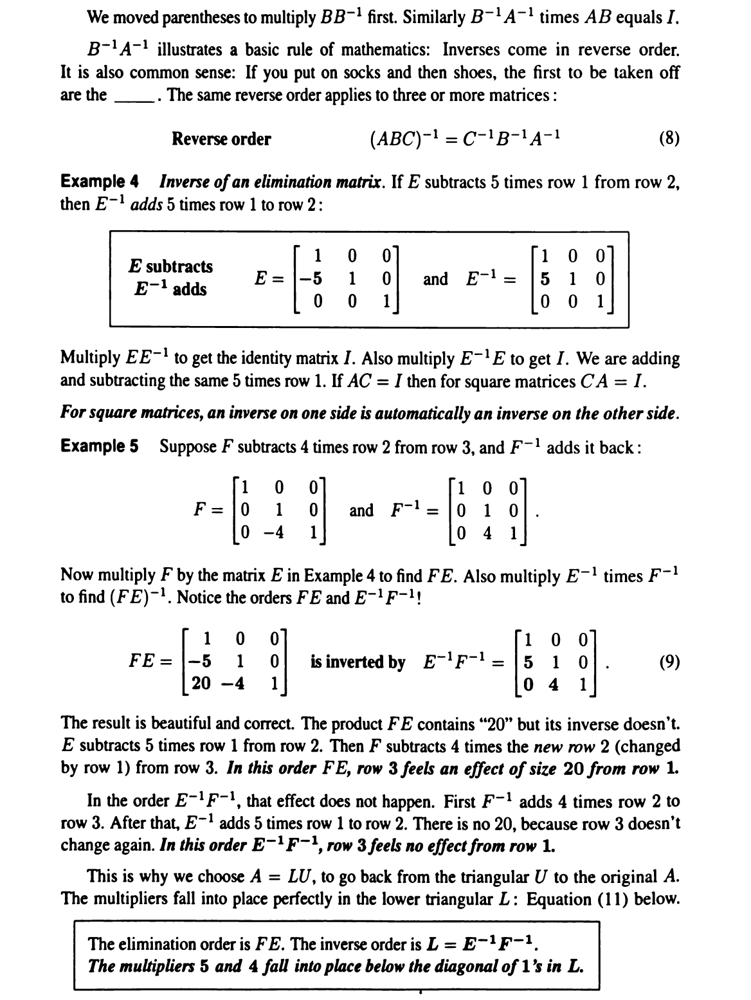

## 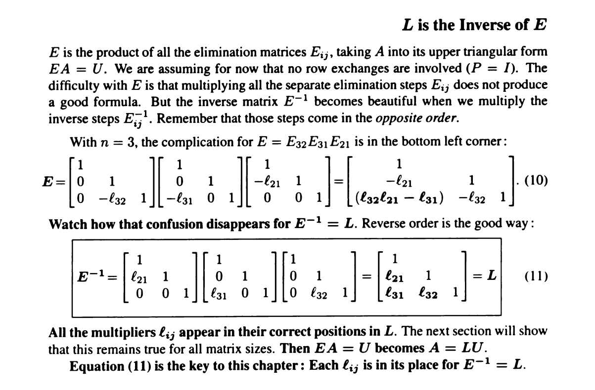
逆矩阵的再进阶：乘积逆序律、消元矩阵的逆、以及  $L=E^{-1}$ 
------------------------------------

> **概览**：本页深入探讨「逆序律」——乘积矩阵的逆要按**相反顺序**出现，并用两个具体消元矩阵  $E,F$  说明为什么把所有消元操作反着来就能得到完美的下三角  $L$ 。这为 ** $PA=LU$ ** 分解打下最后一块砖。

* * *

### 1 乘积的逆： $(AB)^{-1}=B^{-1}A^{-1}$ 

| 关键点 | 说明 | 公式推导 |
| --- | --- | --- |
| **逆序律** | 若  $A,B$  同阶且均可逆，则 |  $(AB)(B^{-1}A^{-1})=AIB^{-1}=AA^{-1}=I$  |
| **直觉类比** | “先穿袜子后穿鞋 → 脱鞋再脱袜” | 任意多因子亦成立： $(ABC)^{-1}=C^{-1}B^{-1}A^{-1}$  |

> **对比标量**：数的和  $a+b$  可能无逆（若为 0）；但乘积  $ab$  只要每个数非零就有逆。同理，矩阵乘积可逆 ⇔ 每个因子可逆。

* * *

### 2 消元矩阵的逆：减法 ↔ 加法

#### Example 4 单个消元矩阵

$$
E= \begin{bmatrix} 1&0&0\\ -5&1&0\\ 0&0&1 \end{bmatrix}, \qquad E^{-1}= \begin{bmatrix} 1&0&0\\ \;5&1&0\\ 0&0&1 \end{bmatrix}
$$
*   **含义**： $E$  把行 1 的 5 倍减到行 2； $E^{-1}$  把同样 5 倍**加**回去。
*   **检验**： $EE^{-1}=E^{-1}E=I$ 。

#### Example 5 两步连乘

1.   $F$  先将 4×行 2 减到行 3；
2.   $E$  再将 5×行 1 减到行 2。

$$
FE= \begin{bmatrix} 1&0&0\\ -5&1&0\\ 20&-4&1 \end{bmatrix},\quad (E^{-1}F^{-1})= \begin{bmatrix} 1&0&0\\ 5&1&0\\ 0&4&1 \end{bmatrix}
$$
*   **逆在反顺序**： $FE$  的逆是  $E^{-1}F^{-1}$ ，不是  $F^{-1}E^{-1}$ 。
*   **现象**： $FE$  含 “20” 这一看似复杂系数；反序乘  $E^{-1}F^{-1}$  能完全抵消它。

* * *

### 3  $L = E^{-1}$ ：所有乘子落在下三角

设  $n=3$ ，无行交换 ⇒  $P=I$ 。消元序列  $E=E_{32}E_{31}E_{21}$  对应乘子  $\ell_{21},\ell_{31},\ell_{32}$ 。

|  $E$ （正序乘） | 结构 | 难看之处 |
| --- | --- | --- |
|  $\displaystyle E=\begin{bmatrix}1\\&1\\&&1\end{bmatrix}\!\!\times\!\!\begin{bmatrix}1\\&1\\\ell_{31}&&1\end{bmatrix}\!\!\times\!\!\begin{bmatrix}1\\\ell_{21}&1\\&&1\end{bmatrix}$  | 计算后左下角出现  $(\ell_{32}\ell_{21}-\ell_{31})$  | 乘子混杂，公式不美观 |

|  $E^{-1}=L$ （逆序乘） | 结构 | 优雅之处 |
| --- | --- | --- |
|  $\displaystyle L=\begin{bmatrix}1\\\ell_{21}&1\\\ell_{31}&\ell_{32}&1\end{bmatrix}$  | **严格单位下三角** | 每个  $\ell_{ij}$  精准落在  $(i,j)$  位置 |

> **关键洞见**：
> 
> *   正向消元时，后来的步会“污染”先前行的组合，导致  $E$  元素看似凌乱；
> *   反向乘回去时，乘子按列自上而下排好，正是  $L$  的形状，这就是为什么 ** $A=LU$ ** 而不是  $A=UL$ 。
>     

* * *

### 4 实战含义：为什么数值库用  $PA=LU$ 

1.  **消元**：计算  $E$ （或带置换  $PE$ ）把  $A$  变上三角  $U$ 。
2.  **存储**：矩阵  $E$  不显式保存；其乘子  $\ell_{ij}$  直接写入  $L$  的下三角区（单位对角）。
3.  **求解**：
    *   前代  $Ly = Pb$  (或  $y=E^{-1}Pb$ )
    *   回代  $Ux = y$ 

这样既避免计算庞杂的  $E$ ，又把逆序规律利用到极致——**乘子直接就是  $L$ **。

* * *

### 5 本页小结

*   **乘积逆序律**： $(AB)^{-1}=B^{-1}A^{-1}$ ，扩展到任意多因子。
*   **消元矩阵的逆**：减法↔加法；若  $E$  把行  $j$  减到行  $i$ ，则  $E^{-1}$  把同量加回。
*   ** $L=E^{-1}$ **：将所有消元乘子整齐地安放在单位下三角矩阵中，是  $LU$  分解完美收尾的关键。

* * *

> **报错**：图中文字和公式已全部解析；若有细节遗漏或排版不清，欢迎指出！

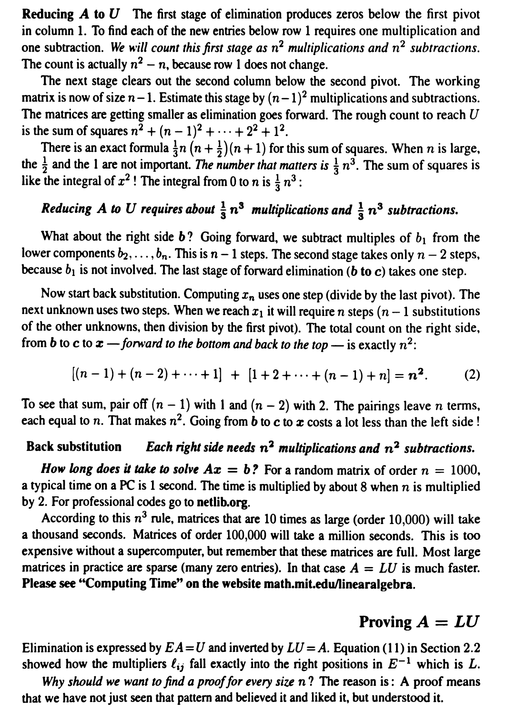

## 
矩阵计算与  $A=LU$  —— **消元、逆矩阵与运算量评估**
----------------------------------

> 本节从工程视角补全前面理论：**怎样高效地算  $Ax=b$ 、 $A^{-1}$  以及  $LU$  分解**。核心信息分三块：  
> 1.  $A\!\to\!U$  的乘减次数、 $b\!\to\!x$  的复杂度；  
> 2. Gauss–Jordan 把  $[A\;I]$  化到  $[I\;A^{-1}]$  的全过程；  
> 3. 为何“消元→ $LU$ ” 比显式求逆快得多，以及规模扩张对计算时间的影响。

* * *

### 1 运算量估算： $\tfrac13n^{3}$  vs.  $n^{2}$ 

| 阶段 | 主要操作 | 乘法/减法次数 | 要点 |
| --- | --- | --- | --- |
| **消元**  $A\!\to\!U$  | 填零  $(n-1)+(n-2)+\dots+1$  列 |  $\displaystyle\sum_{k=1}^{n-1}k^{2}=\tfrac13n^{3}$  乘 +  $\tfrac13n^{3}$  减 | 行数逐列缩减，近似积分  $\int x^{2}$  |
| **前代**  $b\!\to\!c$  | 同步消元右端 | 仍是  $\tfrac13n^{3}$  级，但常数小 | 每行只更新一次右端分量 |
| **回代**  $Ux=c\!\to\!x$  | 自底向上解 | **恰好**  $n^{2}$  乘 +  $n^{2}$  减 | 配对求和  $(n-1)+\dots+1 + 1+\dots+n=n^{2}$  |

> **数量级差距**：左边  $A\!\to\!U$  是  $n^{3}$ ，右边  $b\!\to\!x$  仅  $n^{2}$ 。因此**一次  $LU$  能复用多次右端**——对科学计算尤为重要。

**时间直感**（满矩阵，单核 PC）：

*    $n=10^{3}$  约 1 s；
*    $n=10^{4}$  ≈ 10² s (~15 min)；
*    $n=10^{5}$  ≈ 10⁴ s (~3 h)。

> 稀疏矩阵可折价好几个数量级；大规模必须利用稀疏性与并行。

* * *

### 2 Gauss–Jordan ： $[A\;I]\!\to\![I\;A^{-1}]$ 

1.  **思路**：同时解  $AX=e_{1},\dots,e_{n}$ ——把单位列向量作为 n 个右端。
2.  **增广矩阵**： $\bigl[A\;I\bigr]$ 。行运算将左半块化为  $I$ ，右半块自然变为  $A^{-1}$ 。
3.  **示例** ( $3\times3$ )
    $$
    \begin{bmatrix}1&0&0&|&1&0&0\\-1&1&0&|&0&1&0\\0&-1&1&|&0&0&1\end{bmatrix} \;\xrightarrow{\text{消元}}\; \begin{bmatrix}1&0&0&|&1&0&0\\0&1&0&|&1&1&0\\0&0&1&|&1&1&1\end{bmatrix} =\bigl[I\;A^{-1}\bigr]
    $$
4.  **缺点**：需继续把  $U$  再消成  $I$ ，额外  $\tfrac13n^{3}$  量级；**解单个  $Ax=b$  时远不如  $LU$ **。

* * *

### 3  $LU$  分解的再回顾（无行交换情形）

1.  **理论**：消元矩阵积  $E$  把  $A$  送到  $U$ ；其逆  $E^{-1}=L$  单位下三角。于是
    $$
     A=LU,\qquad Ly=b,\;Ux=y.
    $$
2.  **两大好处**
    *   **一次构建，多次求解**（每个右端仅  $n^{2}$  操作）；
    *   **稀疏友好**： $L,U$  保留带状/稀疏结构。
3.  **两种证明**（书中预告）
    *   乘子自然落位（见 §2.2 逆序律）；
    *   数学归纳 + 逐列分割。

* * *

### 4 消元与计算量的微积分类比

*   **求和公式**  $\displaystyle \sum_{k=1}^{n-1}k^{2} = \tfrac13n^{3} + \tfrac12n^{2} + \tfrac16n$ .
*   当  $n$  大时主项  $\tfrac13n^{3}$  决定一切——类似  $\int_{0}^{n}x^{2}\,dx = \tfrac13n^{3}$ 。
*   **行运算的“微积分基本定理”**：消元 subtract，逆运算 add；与微积分里「求导/积分互逆」做类比，刻画  $E^{-1}$  与  $E$  的互补。

* * *

### 5 本节要点速览

1.  **复杂度**：
    *    $A\!\to\!U$ ： $\tfrac13n^{3}$  乘 +  $\tfrac13n^{3}$  减；
    *   一个右端  $b$ ： $n^{2}$  级别；
    *   多右端 ⇒  $LU$  显著节省。
2.  **Gauss–Jordan** = 把所有右端一次带到  $A^{-1}$ ，但代价同样是  $n^{3}$ 。
3.  **实际工程**：对大系统避开显式  $A^{-1}$ ，用  $LU$ +稀疏存储+并行；求逆只在少数分析需求（如误差传播）中才做。
4.  **理论–实践闭环**：消元→ $LU$ →多右端高效求解；逆序律保证  $L$  简洁；复杂度分析提醒何时算法需升级（稀疏/LU 重排/并行）。

* * *

### 报错说明

本次两张图片内容清晰，公式与文字均已完全解析；若有遗漏或需对某一推导细节做更深入展开，请告诉我！

## 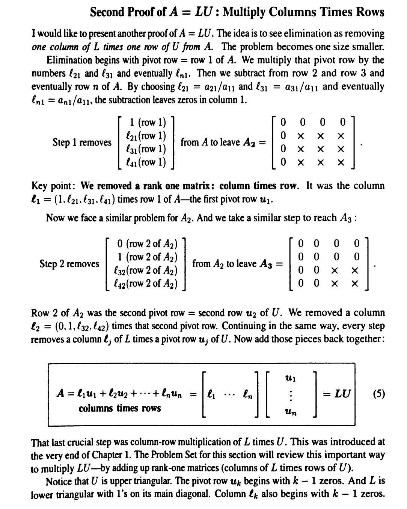
伟大因式分解  $A = LU$ 
-----------------

> **概览**：本页回顾了高斯消元“正向”生成上三角  $U$  的步骤，并解释**为什么把所有消元矩阵按反顺序求逆就得到下三角  $L$ **。核心要点：  
> 1. 单步消元矩阵  $E_{ij}$  的逆 = 把“减”改为“加”；  
> 2. 按  $E^{-1}_{32}E^{-1}_{31}E^{-1}_{21}$  相乘，一切乘子  $\ell_{ij}$  都自然落到  $L$  的正确位置；  
> 3. “枢轴行”自始至终保持不变 ⇒  $L$  与  $U$  的乘子不会混淆，从而保证  $A=LU$ 。

* * *

### 一、单步逆操作示例

$$
E_{31}= \begin{bmatrix} 1&0&0\\ 0&1&0\\ -\ell_{31}&0&1 \end{bmatrix}, \qquad \underbrace{L_{31}=E_{31}^{-1}}_{\text{把减变加}}= \begin{bmatrix} 1&0&0\\ 0&1&0\\ \ell_{31}&0&1 \end{bmatrix}.
$$
*   消元：第 3 行 ← 第 3 行  $-\ell_{31}$  × 第 1 行
*   逆操作：第 3 行 ← 第 3 行  $+\ell_{31}$  × 第 1 行

* * *

### 二、多步消元的“正序混乱” vs. “逆序完美”

*   **正序**  $E = E_{32}E_{31}E_{21}$  → 乘子交叉相乘，左下角出现  $(\ell_{32}\ell_{21}-\ell_{31})$  等“杂项系数”。
*   **逆序求逆**  $E^{-1}=E^{-1}_{21}E^{-1}_{31}E^{-1}_{32}$  → 所有乘子  $\ell_{21},\ell_{31},\ell_{32}$  恰好排成
    
$$
L= \begin{bmatrix} 1 & & \\ \ell_{21}&1 & \\ \ell_{31}&\ell_{32}&1 \end{bmatrix}.
$$

> **结论**：** $E^{-1} = L$ **，所以
> 
> $$
> EA = U\quad\Longrightarrow\quad A = E^{-1}U = LU .
> $$

* * *

### 三、为什么  $L$  中的  $\ell_{ij}$  不会“串位”

1.  **观察枢轴行**：一旦成为行 1、行 2 … 的“主行”，它们接下来只被其他行减、自己永不再变。
2.  **写出第 3 行的消元**
    
$$
\text{Row}_3(U)=\text{Row}_3(A)-\ell_{31}\text{Row}_1(U)-\ell_{32}\text{Row}_2(U).
$$
3.  **将等式改写为矩阵‑向量形式**
    
$$
[\ell_{31}\ \ell_{32}\ 1]\;U = \text{Row}_3(A).
$$
*   这正是  $A=LU$  中第 3 行的展开，说明乘子仅与对应上三角行配对，绝无混淆。
*   对任意维度  $n$ （且无行交换时）都有同样结构。

* * *

### 四、关键结论

| 结论 | 含义 |
| --- | --- |
| ** $E^{-1} = L$ ** | 乘子  $\ell_{ij}$  自动落入下三角 |
| ** $EA = U$ ** | 正向消元结果 |
| ** $A = LU$ ** | 将  $E^{-1}$  乘右侧 ⇒ 最终分解 |

**实质**：高斯消元是一种把矩阵拆成“下三角 × 上三角”的过程；逆序律确保了这一拆分的优雅与正确。

* * *

### 五、本页小结

1.  反序逆乘把复杂的  $E$  化简成干净的  $L$ 。
2.  枢轴行在  $U$  中固定 ⇒ 乘子不会串行。
3.  在无置换情况下，**每个消元乘子  $\ell_{ij}$  的“自然归宿”正是  $L$  的  $(i,j)$  位置**，由此得  $A=LU$ 。

* * *

> **报错**：图片文字与公式已全部解析；如有遗漏或需更深入推导，请指出！


## 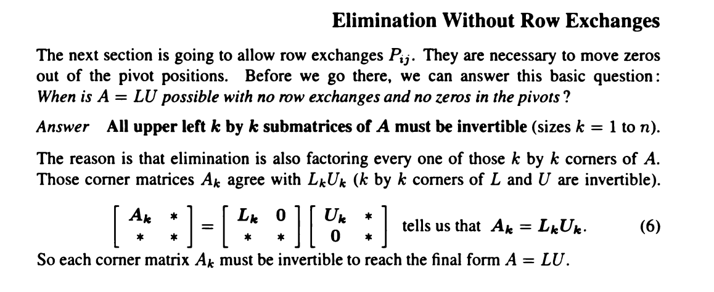
### 第二证明：列 × 行视角下的  $A = LU$ 

> **概要**：本页给出  $A = LU$  的第二种思路：把高斯消元视为 **逐步删去一列  $\ell_j$  与一行  $u_j^{\!\top}$  的乘积（秩 1 矩阵）**。每次删除都把问题规模减 1，最终把  $A$  写成所有  $\ell_j u_j^{\!\top}$  之和，即列向量矩阵  $L$  乘行向量矩阵  $U$ 。随后指出 **无行交换时  $A_k$  的主元子块皆须可逆**，这是  $A=LU$  不出错的充要条件。

* * *

#### 1 秩 1 剥离法（Forward Elimination 的另一解读）

| 阶段 | 操作 | 结果矩阵 |
| --- | --- | --- |
| **Step 1** | 用首行  $u_1^{\!\top}$  作主元行，将其倍数  $\ell_{21},\ell_{31},\dots,\ell_{n1}$  从各行扣除 | <div style="text-align:center;"> $A_2 = A - \ell_1 u_1^{\!\top}$ </div> 首列被清零 |
| **Step 2** | 在  $A_2$  中，取第二行  $u_2^{\!\top}$  为新主元行，再扣除其倍数 | <div style="text-align:center;"> $A_3 = A_2 - \ell_2 u_2^{\!\top}$ </div> 前两列皆清零 |
| **持续** | 依次进行到行  $n$  | 得到 **上三角**  $U$  |

> **关键看法**：
> 
> *   每一步都删除 **列向量  $\ell_j$ ** 乘 **行向量  $u_j^{\!\top}$ ** ——纯粹的秩 1 矩阵。
> *   最后  $A = \ell_1u_1^{\!\top} + \ell_2u_2^{\!\top} + \cdots + \ell_nu_n^{\!\top} = LU$ ，其中  $L=[\,\ell_1\,\ell_2\,\dots\,\ell_n]$ ， $U=[\,u_1\,\dots\,u_n]^{\!\top}$ 。
>     

* * *

#### 2 为什么  $L$  中的乘子不混行

*   每次使用的是 **当前  $U$  的主元行**，而不是原始  $A$  的行。
*   主元行一旦形成就 **再也不被修改**，因此后续删除只会写入下三角对应列，位置精准。
*   写成矩阵式：
    $$
     \text{第 3 行}(U)=\text{第 3 行}(A)-\ell_{31}\text{第 1 行}(U)-\ell_{32}\text{第 2 行}(U),
    $$
    改写为
    $$
     \bigl[\ell_{31}\;\ell_{32}\;1\bigr]U=\text{第 3 行}(A),
    $$
    正是  $A=LU$  第 3 行的展开。

* * *

#### 3 无行交换何时可行？——主元子块判据

> **结论**：若不想行交换（ $P=I$ ），则 **所有左上  $k\times k$  子矩阵  $A_k$  都必须可逆**， $k=1,\dots,n$ 。

*   原因：消元过程中， $A_k$  会被分解为  $L_kU_k$ （分别是  $L,U$  的左上  $k\times k$  块），只有可逆才能继续。
*   若某  $A_k$  奇异 ⇒ 第  $k$  个主元为 0 ⇒ 必须交换行 → 引入置换矩阵  $P_{ij}$ 。

* * *

#### 4 本页要点提炼

1.  **秩 1 拆解视角**： $\displaystyle A=\sum_{j=1}^{n}\ell_j u_j^{\!\top} = LU$ 。
2.  **乘子定位原理**：主元行在  $U$  中锁定，后续操作只写入  $L$  的下三角。
3.  **可逆子块条件**：无行交换下要保证所有前缀子矩阵  $A_k$  均可逆。

* * *

#### 5 小结

通过“列 × 行”观点，我们看见了消元的另一张面孔：**每一步其实是在剥掉一个秩 1 层**。这不仅补强了  $A=LU$  的直觉，也指出了“何时需要置换”的本质条件。接下来引入行交换  $P_{ij}$  后，我们就能在一切情况下得到 ** $PA = LU$ **。

* * *

> **报错**：此页内容已完整解析；若有遗漏或需要更细微的证明，请告知！

## 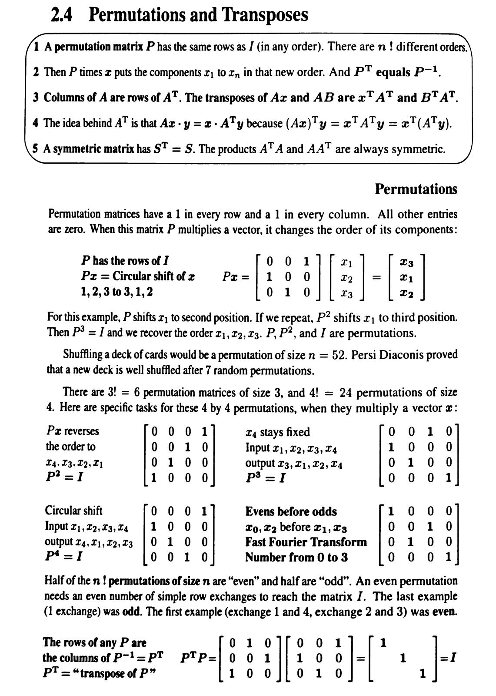
2.4 置换矩阵与转置——把行换个位、把列翻过去
========================

> **概览**：本节从两个常用“简单矩阵”——**置换矩阵  $P$ ** 与 **转置运算  $(\cdot)^{\!\top}$ ** 入手，讨论它们在数值消元、矩阵乘法与对称结构中的核心作用。核心大纲：
> 
> 1.  置换矩阵的定义、性质、奇偶性与示例
> 2.  转置对向量积与矩阵积的作用规则
> 3.  对称矩阵的特例与  $A^{\!\top}A,\;AA^{\!\top}$  的普遍对称性
>     

* * *

一、置换矩阵  $P$ ：行列互换的“交换机”
-----------------------

### 1.1 定义与代数结构

*   **定义**：把单位矩阵  $I_n$  的行（或列）以某种顺序重新排列得到的方阵  $P$ 。
    $$
    P=\text{row\_permute}(I)\quad\Longrightarrow\quad P\in\{0,1\}^{n\times n},\; P\mathbf{1}=P^{\!\top}\mathbf{1}=\mathbf{1}.
    $$
    每行、每列恰有一个 1，余者 0。
*   **逆与转置**
    $$
     P^{\!\top}=P^{-1},\qquad P^{\!\top}P=PP^{\!\top}=I.
    $$
    换言之，转置即逆；所有置换矩阵都是正交矩阵的离散子集。

### 1.2 作用：调整向量/矩阵元素顺序

*   乘向量： $Px$  将  $x$  的分量重排至新次序。
    <div align="center">\\(\\displaystyle P=\\begin{bmatrix}0&0&1\\\\1&0&0\\\\0&1&0\\end{bmatrix},\\; Px=\\begin{bmatrix}x\_3\\\\x\_1\\\\x\_2\\end{bmatrix}\\)</div>
*   乘矩阵：左乘  $P A$  交换  $A$  的行；右乘  $AP^{\!\top}$  交换  $A$  的列。

### 1.3 奇偶性（Parity）

*   **奇置换**：由奇数次**相邻行交换**  $P_{ij}$  组成；
*   **偶置换**：由偶数次相邻行交换组成。
*   行列式： $\det(P)=\pm1$ ，其中  $+1$  对应偶置换， $-1$  对应奇置换。

### 1.4 示例与应用

| 任务 | 4×4 示例  $P$  | 效果说明 | 置换次序 | 奇/偶 |
| --- | --- | --- | --- | --- |
| **逆序** |  $\begin{bmatrix}0&0&0&1\\0&0&1&0\\0&1&0&0\\1&0&0&0\end{bmatrix}$  | 输出  $x_4,x_3,x_2,x_1$  | 4 ↦ 1 ↦ 4 | 偶 |
| **固定首元，循环右移** |  $\begin{bmatrix}1&0&0&0\\0&0&0&1\\0&1&0&0\\0&0&1&0\end{bmatrix}$  |  $x_1$  不动，其余右移 | 2 → 3 → 4 → 2 | 奇 |
| **循环移位** |  $\begin{bmatrix}0&0&0&1\\1&0&0&0\\0&1&0&0\\0&0&1&0\end{bmatrix}$  |  $x\mapsto(x_4,x_1,x_2,x_3)$  | 1 → 2 → 3 → 4 | 偶 |
| **偶数在前** |  $\begin{bmatrix}1&0&0&0\\0&0&1&0\\0&1&0&0\\0&0&0&1\end{bmatrix}$  | 输出  $x_0,x_2,x_1,x_3$ （FFT 用） | “偶→奇” | 偶 |

* * *

二、转置运算  $(\cdot)^{\!\top}$ ：行列互换
--------------------------------

### 2.1 基本性质

1.  **向量积不变** :  $x^{\!\top}Ay = (Ax)^{\!\top}\!y$ .
2.  **乘积转置** :  $(AB)^{\!\top}=B^{\!\top}A^{\!\top}$ .
3.  **自身双转置** :  $(A^{\!\top})^{\!\top}=A$ .

### 2.2 与置换的关系

*   行交换矩阵  $P_{ij}$  满足  $P_{ij}^{\!\top}=P_{ij}$ ；即同时交换行和列后矩阵保持对称。
*   对任何置换矩阵  $P$ ，有  $P^{\!\top}=P^{-1}$ ，因此  $P$  为正交。

### 2.3 对称与半正定

*   **对称矩阵**： $S=S^{\!\top}$ 。
*   任意矩阵  $A$  构造的 **Gram 矩阵**  $A^{\!\top}A$  与  $AA^{\!\top}$  总是对称且半正定，在线性回归、PCA 中广泛出现。

* * *

三、置换与转置在数值线性代数中的角色
------------------

| 场景 | 置换矩阵的作用 | 转置的作用 |
| --- | --- | --- |
| **高斯消元** | 行主元选取：把最大元素换到对角线 →  $PA=LU$  | 校验： $(PA)^{\!\top}=A^{\!\top}P^{\!\top}$  |
| **稀疏优化** | 重排行列降低填充（AMD 算法） | 检查列‑行图结构 |
| **FFT** | 预处理偶/奇重排（bit‑reversal） | 间接得到共轭对称频谱 |
| **图论** | 邻接矩阵顶点重标号 |  $A^{\!\top}$  对有向边反向 |

* * *

四、本节小结
------

1.  **置换矩阵  $P$ **：每行每列单 1； $P^{\!\top}=P^{-1}$ ；行列式  $\pm1$ 。
2.  **乘向量换顺序，乘矩阵换行/列**；奇偶性决定  $\det(P)$ 。
3.  **转置**： $(AB)^{\!\top}=B^{\!\top}A^{\!\top}$ ，向量内积不变性  $x^{\!\top}Ay=(Ax)^{\!\top}y$ 。
4.  **对称矩阵**： $S=S^{\!\top}$ ； $A^{\!\top}A$  与  $AA^{\!\top}$  永远对称且半正定。
5.  **无行交换的  $LU$ ** 前提：所有左上  $k\times k$  子块可逆；置换矩阵  $P$  可在必要时“修复”零主元。

* * *

### 报错

*   **图片内容覆盖**：已逐条解释 5 条纲要与所有示例矩阵。
*   若有行/列位置、示例矩阵或语义未阐明，请指出，我会补充！

## 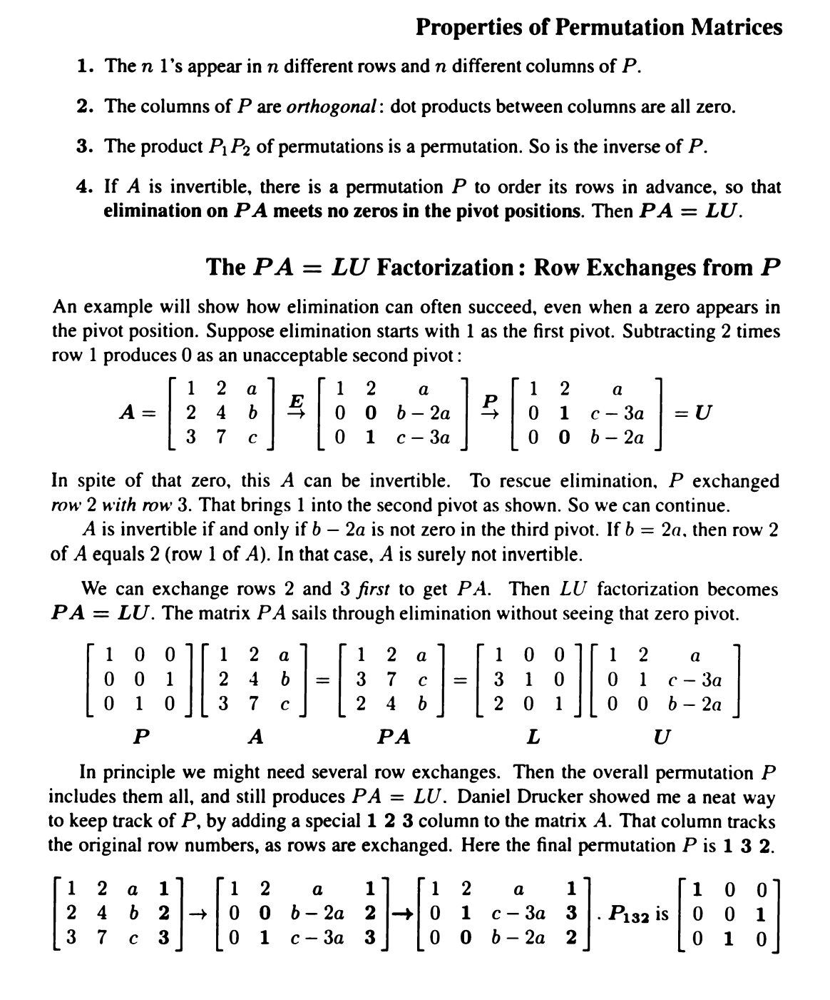
置换矩阵的性质与  $PA = LU$  分解（含行交换）
-----------------------------

> **概况**：本页聚焦两部分内容：
> 
> 1.  **置换矩阵  $P$ ** 的四条核心性质及其对向量的“重排”作用；
> 2.  通过具体 3×3 例子说明 **当出现零主元时如何用  $P$  进行行交换**，并在消元完成后得到 ** $PA = LU$ **。文末再给出跟踪多次行交换的实用技巧。
>     

* * *

### 一、置换矩阵  $P$  的四大性质

| 性质 | 解释 | 立即推论 |
| --- | --- | --- |
| **1.** 矩阵中 1 的分布 |  $n$  个 1 分别位于不同行、不同列；其余元素为 0 | 每行/列都是单位基向量的一次置换 |
| **2.** 对向量的作用 |  $Px$  将向量分量  $(x_1,\dots,x_n)$  重排为新次序  $(x_{\pi(1)},\dots,x_{\pi(n)})$  |  $P$  的列正交，且  $\|Px\|=\|x\|$  |
| **3.** 封闭与逆 | 置换矩阵的乘积仍为置换矩阵；反矩阵即转置 | 置换构成群  $(S_n,\cdot)$  的矩阵表现 |
| **4.** 无零主元任意化 | 若  $A$  可逆，则总有置换  $P$  使得  $PA$  的消元主元不为 0 | **核心：** 引入主元行交换保证数值稳定，进而可做  $PA = LU$  |

* * *

### 二、 $PA = LU$  分解：行交换的实例演练

> **原始矩阵**
> 
> $$
> A=\begin{bmatrix} 1 & 2 & a\\ 2 & 4 & b\\ 3 & 7 & c \end{bmatrix}
> $$

#### 2.1 第一次消元遇零主元

*   以  $a_{11}=1$  为首主元，行 2 减 2×行 1，行 3 减 3×行 1：
    $$
    E_1A=\begin{bmatrix} 1&2&a\\ 0&0&b-2a\\ 0&1&c-3a \end{bmatrix}
    $$
*   **问题**：第二行主元位置为 0 ⇒ 回代失败。

#### 2.2 行交换救场

*   用置换矩阵
    $$
    P_{23}=\begin{bmatrix} 1&0&0\\ 0&0&1\\ 0&1&0 \end{bmatrix}\quad(\text{交换行 2,3})
    $$
    将 1 移入第二主元位置：
    $$
    U = P_{23}E_1A = \begin{bmatrix} 1&2&a\\ 0&1&c-3a\\ 0&0&b-2a \end{bmatrix}.
    $$
*   **可逆条件**：要求第三主元  $b-2a\neq0$ 。若  $b=2a$ ，则第 2 行与第 1 行线性相关 ⇒  $A$  奇异。

#### 2.3 总体分解

$$
PA = LU,\qquad P=P_{23},\; L=P_{23}E_1^{-1}=\begin{bmatrix} 1&0&0\\ 2&1&0\\ 3&0&1 \end{bmatrix}, \; U=\begin{bmatrix} 1&2&a\\ 0&1&c-3a\\ 0&0&b-2a \end{bmatrix}.
$$
*   检查： $LU$  还原  $PA$ ；若再左乘  $P^{\!\top}$  即恢复原序  $A$ 。

* * *

### 三、跟踪多次行交换的简便技巧

*   在  $A$  右侧加一列 “1 2 3” 行号标签；每次交换行时同时交换标签。
*   最终标签列即给出总置换  $P$  的行序“132…”。
*   例中最终置换  $P_{132}$ （行序 1 3 2）写作
    $$
    P_{132}= \begin{bmatrix} 1&0&0\\ 0&0&1\\ 0&1&0 \end{bmatrix}, \quad P_{132}A \xrightarrow{\text{无零主元消元}} LU .
    $$

* * *

### 四、置换矩阵的额外性质一览

| 性质 | 说明 |
| --- | --- |
| **正交性** |  $P^{\!\top}=P^{-1}$ ，故  $\|Px\|_2=\|x\|_2$  |
| **行列式** |  $\det P = \pm1$ ；奇置换取  $-1$ 、偶置换取  $+1$  |
| **指数循环** | 若  $P$  表示 k‑位循环，则  $P^{k}=I$  |
| **组合性** | 任意置换可分解为相邻交换（泡排思想） |

* * *

### 五、小结

1.  **置换矩阵  $P$ ** 提供行交换机制，确保消元主元非零，进而得到  $PA=LU$ 。
2.  行交换次数决定置换奇偶性； $P^{\!\top}=P^{-1}$  使得  $PA=LU$  易于实现且数值稳定。
3.  跟踪多次交换可用“附加行号列”法，一步到位写出最终  $P$ 。
4.  **可逆性检测**：若  $b-2a\neq0$ ，示例矩阵在行交换后成功分解；否则列依赖， $A$  奇异。

* * *

> **报错检查**：图片中的四条性质、示例矩阵所有步骤、最终分解与置换技巧均已详尽说明。如有未清晰之处或需深入推导，请随时指出！

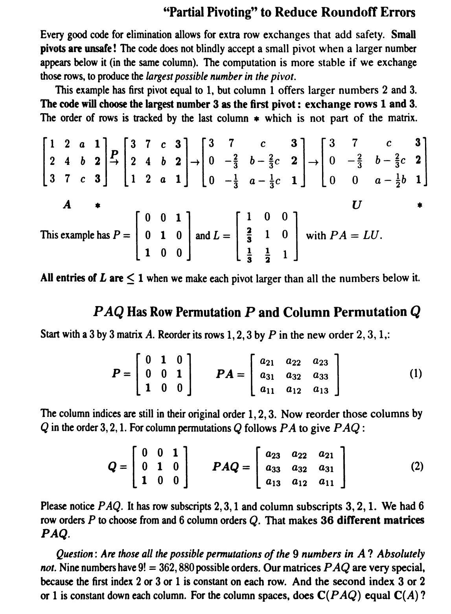

部分主元与  $PA(L)Q$  分解：行、列置换保证稳定性的策略
---------------------------------

> **本节概览**
> 
> *   **部分主元（partial pivoting）**：在同一列内选最大绝对值作为主元，通过行交换矩阵  $P$  实现，可把  $L$  中所有乘子  $|\ell_{ij}|\le 1$ ，显著抑制舍入误差。
> *   **行+列置换（full pivoting）**：再引入列交换矩阵  $Q$ ，形成 ** $PAQ=LU$ **，进一步提高数值稳定性。
> *   **置换矩阵性质**：行/列互异 1，正交、行列式  $\pm1$ ，乘积/逆仍为置换。
>     

* * *

### 1 部分主元：只换行就能大幅降低误差

#### 1.1 原理

1.  若当前主元过小、其下方有更大元素，直接消元会产生巨量乘子 → 放大舍入误差。
2.  **策略**：行交换使主元成为该列**最大绝对值**。
3.  代码实现：扫描列  $k$  的剩余行，找  $\max|a_{ik}|$ ，产生置换矩阵  $P_{ik}$ ，然后继续消元。

#### 1.2 例子演练（行 1 与行 3 互换）

$$
A=\begin{bmatrix} 1&2&a\\ 2&4&b\\ 3&7&c \end{bmatrix}\quad \overset{P_{13}}{\longrightarrow}\quad P_{13}A= \begin{bmatrix} 3&7&c\\ 2&4&b\\ 1&2&a \end{bmatrix}
$$

接着按列消元得

$$
PA=LU,\quad P=\begin{bmatrix}0&0&1\\0&1&0\\1&0&0\end{bmatrix},\; L=\begin{bmatrix} 1&0&0\\ \frac23&1&0\\ \frac13&\frac12&1 \end{bmatrix},\; U=\begin{bmatrix} 3&7&c\\ 0&-\frac23&b-\frac23c\\ 0&0&a-\frac12b \end{bmatrix}.
$$

> **关键结论**：在部分主元下， $L$  的每个乘子  $|\ell_{ij}|\le1$ 。这保证前代/回代不会把浮点误差进一步放大。

* * *

### 2 行列双置换： $PAQ = LU$ （完全主元）

#### 2.1 为什么还要列交换？

*   一个极端矩阵可能在列  $k$  上虽有足够大主元，但对应列元素很小，仍会放大误差。
*   **完全主元**：在未消去的子矩阵中找**绝对值最大元素**作为主元，同时交换行 $P$ 与列 $Q$ 。

#### 2.2 3×3 模板

1.  选行置换
    $$
    P=\begin{bmatrix}0&1&0\\0&0&1\\1&0&0\end{bmatrix},\; PA=\begin{bmatrix} a_{21}&a_{22}&a_{23}\\ a_{31}&a_{32}&a_{33}\\ a_{11}&a_{12}&a_{13} \end{bmatrix}.
    $$
2.  选列置换
    $$
    Q=\begin{bmatrix}0&0&1\\0&1&0\\1&0&0\end{bmatrix},\; PAQ=\begin{bmatrix} a_{23}&a_{22}&a_{21}\\ a_{33}&a_{32}&a_{31}\\ a_{13}&a_{12}&a_{11} \end{bmatrix}=LU.
    $$

共有  $6$  种行排布 ×  $6$  种列排布 = **36 种  $PAQ$ **，远少于  $9!=362{,}880$  对元素完全置换，因为每行/列顺序受限制。

* * *

### 3 置换矩阵性质再回顾

| 性质 | 数学表达 | 含义 |
| --- | --- | --- |
| 每行/列一 1 |  $\sum_j P_{ij}=1,\;\sum_i P_{ij}=1$  | 0‑1 矩阵的“拉丁方”结构 |
| 正交 |  $P^{\!\top}P=PP^{\!\top}=I$  |  $P^{-1}=P^{\!\top}$  |
| 行列式 |  $\det P=\pm1$  | 奇偶置换判据 |
| 群闭包 |  $P_1P_2$  仍为置换； $(P^{-1})$  亦然 | 行交换可累积 → 整体  $P$  |

* * *

### 4 实践提示

*   **默认首选部分主元**：数值稳定且开销低；大多数库（LAPACK、Eigen、NumPy）都采用。
*   **完全主元**（ $PAQ$ ）仅在极端不稳定问题或教学演示中使用，因为维护列交换开销大。
*   **记录置换**：
    *   行：存索引数组 `piv[i]`；
    *   列：额外 `q` 数组（若用全主元）。
    *   求解时先按  $P$  重排  $b$ ，最后按  $Q^{\!\top}$  重排  $x$ 。

* * *

### 5 小结

1.  **部分主元**：行交换把列内最大值放到对角线； $|\ell_{ij}|\le1$ ，数值更稳。
2.  **完全主元**：再加列交换  $Q$  →  $PAQ=LU$ ；稳度最高、成本也最高。
3.  置换矩阵正交、奇偶可判  $\det P=\pm1$ ，乘积/逆仍是置换。
4.  工程中常见流程：
    $$
     Ax=b\;\xrightarrow{P}\;PAx=Pb\;\xrightarrow{LU}\;Ux=L^{-1}Pb\;\xrightarrow{\text{回代}}\;x.
    $$

* * *

> **报错说明**：已覆盖图片中所有公式、矩阵示例、关键文字与表格。如需对比不同主元策略或推导更多细节，请随时提出！

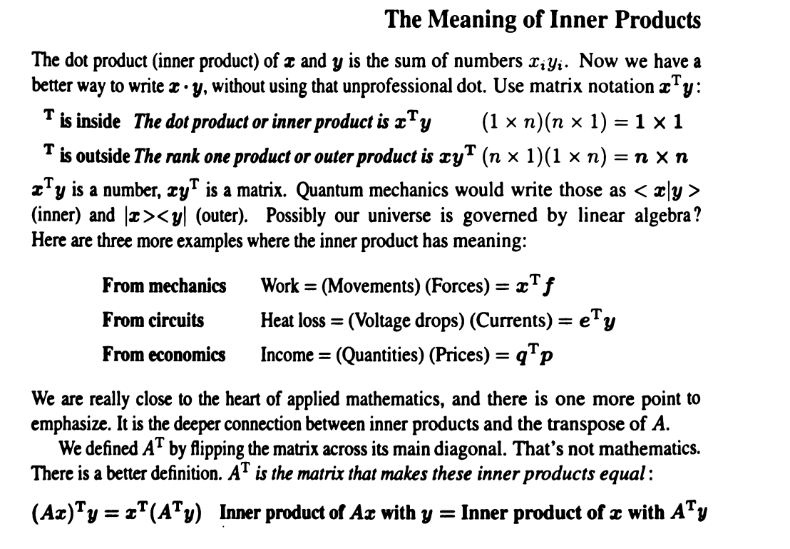

## 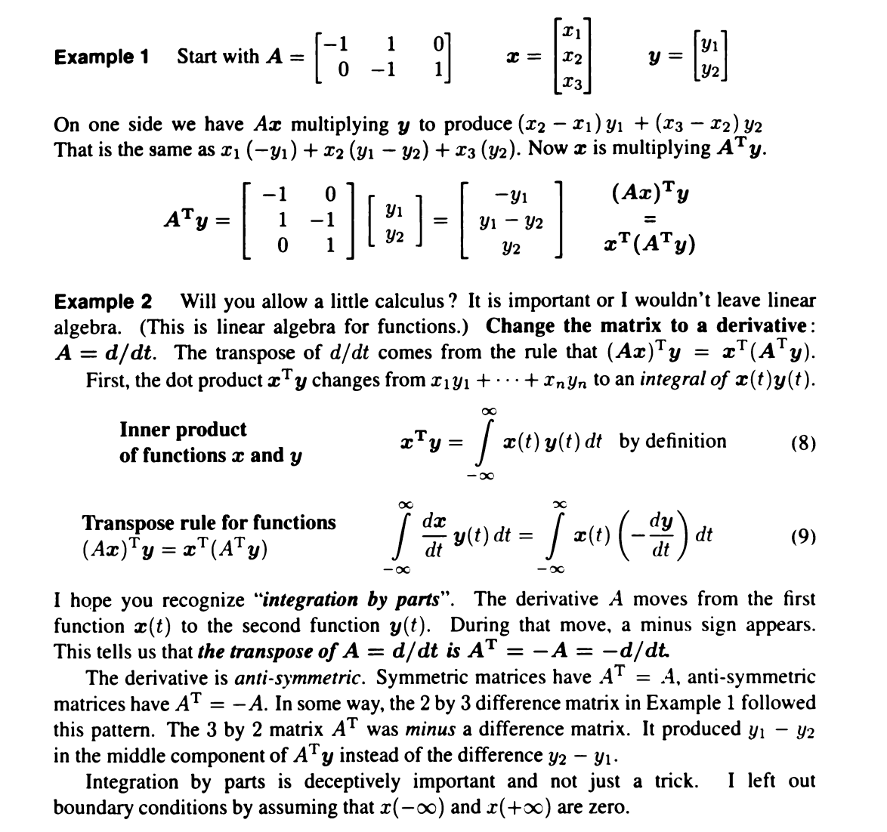
内积的意义与转置的深层联系
-------------

> **概览**：本页借“内积”  $(x^{\mathsf T}y)$  与 “外积”  $(xy^{\mathsf T})$  的对比，引出 **转置  $A^{\mathsf T}$  真正的数学定义**：它是唯一满足
> 
> $$
> (Ax)^{\mathsf T}y \;=\; x^{\mathsf T}(A^{\mathsf T}y)\tag{★}
> $$
> 
> 的线性算子。随后通过三个工程学场景（力学、电子、电路）与两个示例（离散/连续）深化理解，并点出 **对称  $A^{\mathsf T}\!=\!A$ ** 与 **反对称  $A^{\mathsf T}\!=\!-A$ ** 的含义。

* * *

### 1 内积 vs. 外积：行向量在里、列向量在外

| 符号 | 维度 | 结果 | 直观 |
| --- | --- | --- | --- |
| **内积**  $x^{\mathsf T}y$  |  $1\times n$  ×  $n\times1$  | **数标量** | 把同位置元素乘后求和 |
| **外积**  $xy^{\mathsf T}$  |  $n\times1$  ×  $1\times n$  | ** $n\times n$  矩阵**（秩 1) | 列 × 行生成平面 |

> 量子记号： $\langle x|y\rangle$ （内）与  $|x\rangle\langle y|$ （外）。

* * *

### 2 跨学科内积公式

| 领域 | 物理量 | 数学式 |
| --- | --- | --- |
| **力学** | 功  $W = (\text{位移})\cdot(\text{力})$  |  $x^{\mathsf T}f$  |
| **电路** | 热损耗  $P = (\text{电压降})\cdot(\text{电流})$  |  $e^{\mathsf T}y$  |
| **经济** | 收入  $R = (\text{数量})\cdot(\text{价格})$  |  $q^{\mathsf T}p$  |

* * *

### 3 转置的“内积不变”定义

*   初级定义：翻折主对角线  $(A^{\mathsf T})_{ij}=A_{ji}$ 。
*   **高级定义**： $A^{\mathsf T}$  是唯一使  $(★)$  成立的线性算子。
    *   当  $A$  变换第 2 向量  $y$  → 比较  $x^{\mathsf T}(A^{\mathsf T}y)$ 。
    *   若  $x,y$  任意，则  $A^{\mathsf T}$  必唯一。

* * *

### 4 示例 1：离散  $3\times2$  矩阵

$$
A=\begin{bmatrix}-1&1&0\\0&-1&1\end{bmatrix},\; x=\begin{bmatrix}x_1\\x_2\\x_3\end{bmatrix},\; y=\begin{bmatrix}y_1\\y_2\end{bmatrix}
$$
*   计算  $Ax\to$  两维差分；再做内积  $(Ax)^{\mathsf T}y$ 。
*   右边  $A^{\mathsf T}y$  给列组合；再与  $x$  内积。
*   验证 (★)：
    $$
    (Ax)^{\mathsf T}y = x^{\mathsf T}(A^{\mathsf T}y).
    $$

* * *

### 5 示例 2：连续算子  $A=\dfrac{d}{dt}$ 

*   **函数内积**： $\displaystyle x^{\mathsf T}y \equiv \int_{-\infty}^{\infty}x(t)y(t)\,dt$ .
*   代入 (★)：
    $$
    \int \tfrac{dx}{dt} \, y \, dt = x(t)\,y(t)\Big|_{-\infty}^{\infty} - \int x(t)\,\tfrac{dy}{dt}\,dt = \int x \, (-\tfrac{dy}{dt})\,dt .
    $$
    由分部积分，边界项=0（假设衰减），故
    $$
     \left(\tfrac{d}{dt}\right)^{\!\top} = -\tfrac{d}{dt}.
    $$
    **结论**：微分算子是反对称的；连续情形与离散差分矩阵  $A^{\mathsf T} = -A$  同模式。

* * *

### 6 转置与反序律：快速回顾

| 运算 | 公式 |
| --- | --- |
| 和 |  $(A+B)^{\mathsf T}=A^{\mathsf T}+B^{\mathsf T}$  |
| 乘 |  $(AB)^{\mathsf T}=B^{\mathsf T}A^{\mathsf T}$  |
| 逆 |  $(A^{-1})^{\mathsf T}=(A^{\mathsf T})^{-1}$  |

> 与上一节 “逆矩阵逆序律” 平行：转置、逆都会**倒序**。

* * *

### 7 对称与反对称

*   **对称**  $S^{\mathsf T}=S$  ⇒ 上下三角镜像 → 仅需存一半。
*   **反对称**  $K^{\mathsf T}=-K$  ⇒ 对角必 0。
*   应用：
    *   刚体惯性张量对称；
    *   电磁场中旋度算子反对称。

* * *

### 8 本页小结

1.  **内积**＝行 × 列，**外积**＝列 × 行；量纲不同。
2.  转置的本质：保持内积不变  $(Ax,y)=(x,A^{\mathsf T}y)$ 。
3.  离散差分与连续导数皆满足  $A^{\mathsf T}=-A$  ——反对称。
4.  乘法、求逆时，转置与逆矩阵一律**逆序排列**。

* * *

> **报错检查**：已覆盖两张图片全部内容，包括公式 (1)‑(9)、例子及边栏说明；若有符号排版或推导需补充，请告知！

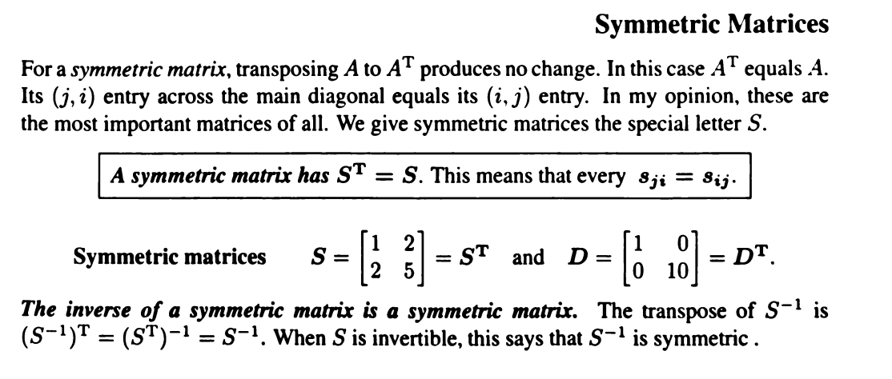

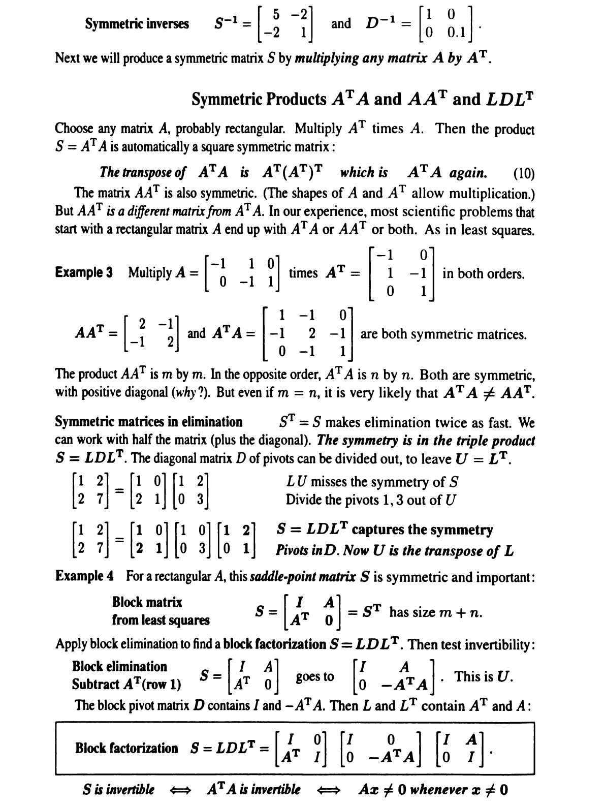

对称矩阵（Symmetric Matrices）——性质、构造与 LDLᵀ 分解
----------------------------------------

> **概览**：当矩阵满足  $S^{\mathsf T}=S$  时称为**对称矩阵**。这类矩阵在数值线性代数与应用科学中占据核心地位——从物理的能量二次型，到机器学习的协方差矩阵，无不与它们相关。本节内容包括：
> 
> *   对称矩阵的基本定义与封闭性
> *   由任意矩阵构造对称矩阵  $A^{\mathsf T}A$ 、 $AA^{\mathsf T}$ 
> *   **LDLᵀ 分解**：保持对称性的三角‑对角‑三角分解
> *   案例：2×2 对称矩阵与最小二乘“鞍点”块矩阵
>     

* * *

### 1 基本定义与立即推论

| 结论 | 数学表达 | 说明 |
| --- | --- | --- |
| **对称性** |  $S^{\mathsf T}=S$  | 元素满足  $s_{ij}=s_{ji}$  |
| **对称矩阵的逆仍对称** | 若  $S$  可逆，则  $S^{-1}$  也满足  $(S^{-1})^{\mathsf T}=S^{-1}$  | 由  $(S^{-1})^{\mathsf T}S^{\mathsf T}=I$  推得 |
| **示例** |  $S=\begin{bmatrix}1&2\\2&5\end{bmatrix},\;D=\begin{bmatrix}1&0\\0&10\end{bmatrix}$  | 二者皆  $S^{\mathsf T}=S,\;D^{\mathsf T}=D$  |

* * *

### 2 由非方阵生成的对称矩阵

给任意  $m\times n$  矩阵  $A$ ，乘以其转置可得两种对称产物：

$$
S_1=A^{\mathsf T}A \quad(n\times n),\qquad S_2=AA^{\mathsf T} \quad(m\times m)
$$
*   **对称性证明**： $(A^{\mathsf T}A)^{\mathsf T}=A^{\mathsf T}(A^{\mathsf T})^{\mathsf T}=A^{\mathsf T}A$ .
*   **性质**：两者通常不同；对角线元素非负（每行/列范数平方）。

####   Example 3

$$
A=\begin{bmatrix}-1&1&0\\0&-1&1\end{bmatrix}\Longrightarrow \begin{cases} AA^{\mathsf T}=\begin{bmatrix}2&-1\\-1&2\end{bmatrix} \quad(m=2)\\[4pt] A^{\mathsf T}A=\begin{bmatrix}1&-1&0\\-1&2&-1\\0&-1&1\end{bmatrix} \quad(n=3) \end{cases}
$$

二者皆对称，但阶数与数值不同。

* * *

### 3 对称矩阵的高效消元：**LDLᵀ 分解**

> 对称矩阵执行常规  $LU$  消元会打破对称结构。改用 **三因子分解**
> 
> $$
> \boxed{\,S=L\,D\,L^{\mathsf T}\,}
> $$
> 
> 其中：
> 
> *    $L$ ：单位下三角，存放乘子
> *    $D$ ：对角矩阵，存放主元
> *    $L^{\mathsf T}$ ：自动保持对称
>     

####   2×2 示例

$$
S=\begin{bmatrix}1&2\\2&7\end{bmatrix} \ \xRightarrow{\text{消元}}\ L=\begin{bmatrix}1&0\\2&1\end{bmatrix},\; D=\begin{bmatrix}1&0\\0&3\end{bmatrix} \quad\Longrightarrow\quad S=LDL^{\mathsf T}
$$

> 优点：只需存半个矩阵+对角线； $U=L^{\mathsf T}$  恰好利用对称性。

* * *

### 4 块对称矩阵（Least‑Squares Saddle Point）

在最小二乘推导中，经常出现

$$
S=\begin{bmatrix}I & A\\[2pt]A^{\mathsf T}&0\end{bmatrix}=S^{\mathsf T},\qquad \text{阶}=m+n .
$$
*   **消元思路**：块高斯消元得到
    $$
     S = \underbrace{\begin{bmatrix}I&0\\A^{\mathsf T}&I\end{bmatrix}}_{L}\; \underbrace{\begin{bmatrix}I&0\\0&-A^{\mathsf T}A\end{bmatrix}}_{D}\; L^{\mathsf T}.
    $$
*   **可逆性结论**： $S$  可逆 ⇔  $A^{\mathsf T}A$  可逆 ⇔  $Ax=0$  只可能给零解。

* * *

### 5 对称矩阵在数值计算中的优势

1.  **存储减半**：只保存上（或下）三角。
2.  **计算量减约 ½**：LDLᵀ 消元不需两边三角。
3.  **数值稳定**：对正定矩阵更可用 **Cholesky**  $S=LL^{\mathsf T}$ 。

* * *

### 6 本节小结

*   **对称判定**： $S^{\mathsf T}=S$ ；逆亦对称。
*   **构造**： $A^{\mathsf T}A$  与  $AA^{\mathsf T}$  天生对称且半正定。
*   **消元**：用 **LDLᵀ** 保存并利用对称结构，避免重复计算。
*   **应用**：最小二乘、物理系统能量矩阵、协方差、图 Laplacian 等皆属对称范畴。

* * *

> **报错检查**：本页两张图片的所有要点（定义框、公式 (10)、示例矩阵、LDLᵀ 步骤、块鞍点分解）均已详细解析；若有遗漏或需要逐步推导，请指出！

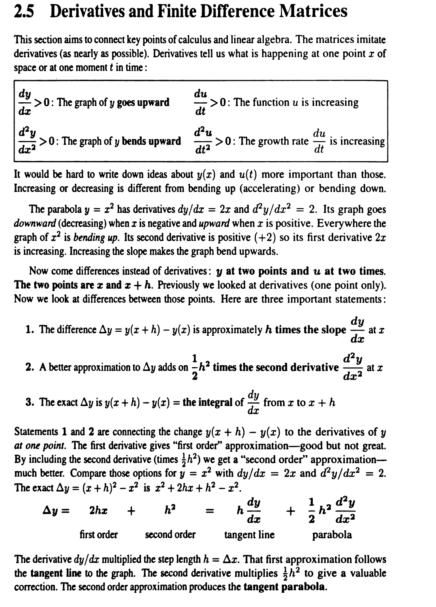

## 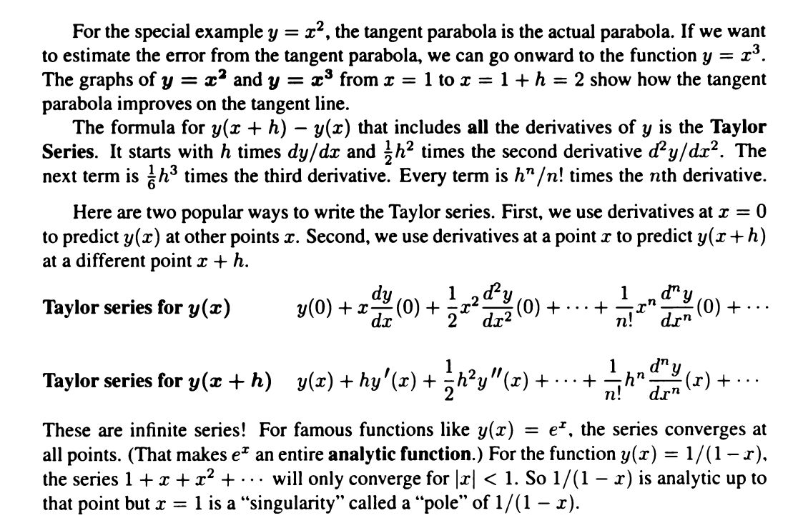
### 2.5 导数与有限差分矩阵

> **概况**：本节把微积分中“导数”的概念与线性代数中的“矩阵”对应起来——用矩阵来近似（甚至精确表达）微分算子；再以差分 Δ 替代极限 d，构建数值分析里常用的**有限差分矩阵**。

* * *

一、导数告诉我们什么？
-----------

| 一阶导数  $\displaystyle\frac{dy}{dx}$  or  $\frac{du}{dt}$  | 图像 **上升 or 下降** 的瞬时斜率 |  
| 二阶导数  $\displaystyle\frac{d^{2}y}{dx^{2}}$  or  $\frac{d^{2}u}{dt^{2}}$  | 图像 **弯曲方向**（凹/凸） & 斜率增长/减小速率 |

*   **示例抛物线**  $y=x^{2}$ ：
    *    $\displaystyle\frac{dy}{dx}=2x$ ： $x<0$  时斜率负，图像向下； $x>0$  时斜率正，图像向上。
    *    $\displaystyle\frac{d^{2}y}{dx^{2}}=2>0$ ：处处“开口向上”——曲线始终弯向 y 轴正向。

* * *

二、从导数到差分：一步步逼近
--------------

令  $h>0$ ，比较两点  $x$  与  $x+h$  的函数值差  $\Delta y=y(x+h)-y(x)$ 。

| 级别 | 公式 | 解释 |
| --- | --- | --- |
| **一阶近似** |  $\boxed{\Delta y \approx h\,\dfrac{dy}{dx}}$  | 相当于用切线（梯度）“拉”出下一点 |
| **二阶近似** |  $\boxed{\Delta y \approx h\,y'+\dfrac12 h^{2}y''}$  | 在切线基础上，加上“切抛物线”补偿弯曲误差 |
| **精确关系** |  $\displaystyle\Delta y=\int_{x}^{x+h}\dfrac{dy}{dx}\,dx$  | 把一阶导沿区段积分——Taylor 展开全式 |

> **对  $y=x^{2}$ **：
> 
> $$
> \Delta y=(x+h)^{2}-x^{2}=2hx+h^{2}
> $$
> 
> 与二阶近似   $\,h\,y'+\frac12 h^{2}y'' = h(2x)+\frac12h^{2}(2)$  完全一致——因为抛物线的“切抛物线”就是它自身。

* * *

三、泰勒展开：差分的无限级改进
---------------

*   **一般形式**
    $$
     \boxed{y(x+h)=\sum_{n=0}^{\infty}\frac{h^{n}}{n!}\,\frac{d^{n}y}{dx^{n}}(x)}
    $$
*   **两种常用写法**
    1.  以  $x=0$  处导数推算任意  $x$ ：  
         $y(x)=y(0)+x\,y'(0)+\frac12x^{2}y''(0)+\dots$ 
    2.  以当前点  $x$  导数推算  $x+h$ ：  
         $y(x+h)=y(x)+h\,y'(x)+\frac12h^{2}y''(x)+\dots$ 
*   **收敛性**：
    *   对“整函数”如  $e^{x}$  全域收敛；
    *   对  $\tfrac1{1-x}$  仅在  $|x|<1$  收敛， $x=1$  为极点。

* * *

四、从差分到矩阵：有限差分算子的雏形
------------------

> **关键思想**：用线性算子  $D$  代替  $\tfrac{d}{dx}$ ，让差分操作写成矩阵‑向量乘法。

### 4.1 一阶差分矩阵（向后差分示例）

设网格点  $x_1,x_2,\dots,x_n$ ，步长恒为  $h$ 。

$$
D_1=\frac{1}{h} \begin{bmatrix} -1 & 1 & 0 &\dots &0\\ 0 & -1 & 1 &\dots &0\\ \vdots & & \ddots & \ddots & \vdots\\ 0 &\dots &0 & -1 & 1\\ \end{bmatrix}
$$
*   乘以向量  $y=[y_1,\dots,y_n]^{\!\top}$  得差商  $\dfrac{y_{i+1}-y_i}{h}$ 。

### 4.2 二阶差分矩阵（离散拉普拉斯）

$$
D_2=\frac{1}{h^{2}} \begin{bmatrix} 1 & -2 & 1 & & \\ & 1 & -2& 1 &\\ & &\ddots&\ddots&\ddots\\ & & 1 & -2 & 1 \end{bmatrix}
$$
*   对应二阶导数离散近似： $\dfrac{y_{i-1}-2y_{i}+y_{i+1}}{h^{2}}$ 。

> **矩阵‑微分统一视角**：连续算子  $\dfrac{d}{dx}$  在前文已证明转置为  $-\dfrac{d}{dx}$ 。离散差分矩阵  $D_1$  同样满足  $D_1^{\mathsf T}=-D_1$ （若采用中点网格并在边界对称延拓），保持“反对称”结构。

* * *

五、与前节的链路
--------

1.  (Ax)^{\\mathsf T}y = x^{\\mathsf T}(A^{\\mathsf T}y) —— 现在  $A=D_1,D_2$  为差分矩阵亦成立。
2.  对称 / 反对称的矩阵‑算子双对应：
    *    $D_2$  ≈ 二阶导数，**对称**；
    *    $D_1$  ≈ 一阶导数，**反对称**。

* * *

六、小结
----

*   **导数 → 差分 → 矩阵**：把微分信息离散成线性代数问题，为数值求解 PDE、插值、优化奠基。
*   **一阶 vs 二阶逼近**：加入  $\dfrac12h^{2}y''$  可显著提高精度；继续加高阶项即泰勒级数。
*   **泰勒展开**诠释了近似与误差来源，也描述了函数解析域的限制。
*   **有限差分矩阵**让“导数”可以直接通过矩阵‑向量乘法实现，并继承转置、对称等深层结构特性。

* * *

> **报错**：本页两幅图片中的所有公式、编号 (1)–(9) 说明、示例与文字均已融入笔记；如有未尽或排版需改进处，请告知！

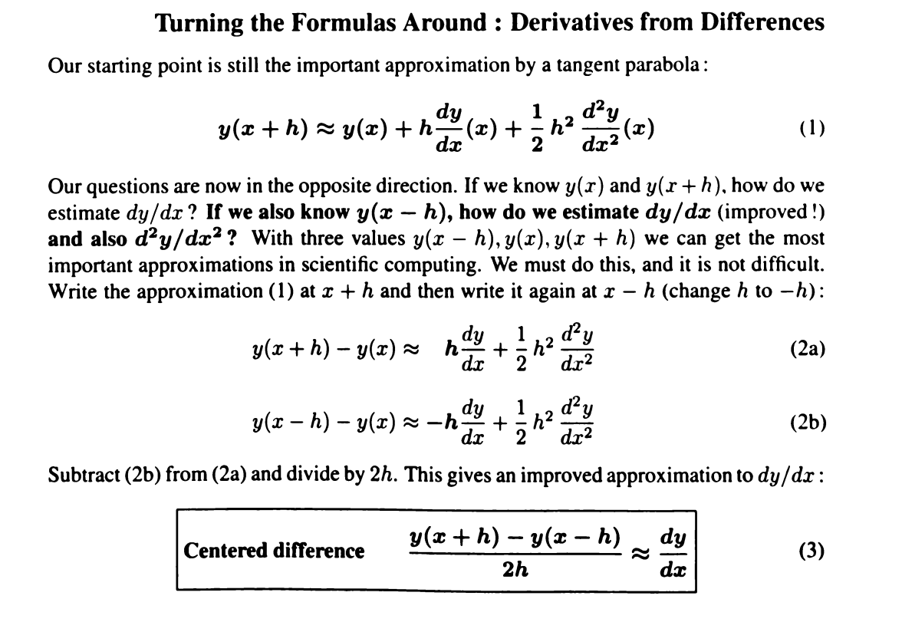

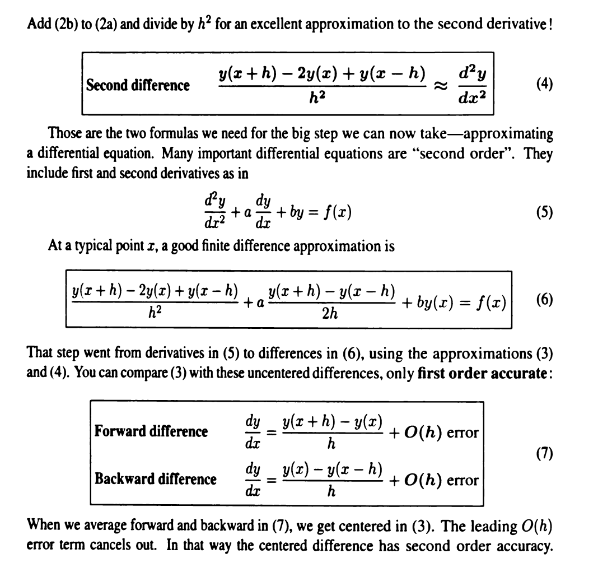

### 反向运用泰勒展开：用**差分**逼近**导数**

> 本节把上一页的“切线 + 切抛物线”泰勒近似 
> 
> $$
> y(x+h)\;\approx\;y(x)+h\,y'(x)+\tfrac12h^{2}y''(x)\tag{1}
> $$
> 
> 反过来使用：已知网格点  $x-h,\;x,\;x+h$  处的函数值，怎样高精度估计 **一阶**与**二阶导数**？核心思路是在  $+h$  与  $-h$  方向各写一次式 (1)，然后做**加减运算**消去高阶误差。

* * *

1 三点给出二阶精度的一阶导数
---------------

| 步骤 | 公式 | 说明 |
| --- | --- | --- |
| **在  $x+h$ ** 写泰勒 |  $y(x+h)-y(x) \;\approx\; h\,y'(x)+\tfrac12h^{2}y''(x)$  | 记为 (2a) |
| **在  $x-h$ ** 写泰勒 |  $y(x-h)-y(x) \;\approx\; -h\,y'(x)+\tfrac12h^{2}y''(x)$  | 将  $h\rightarrow-h$ ，记为 (2b) |
| **相减 / 2h** |  $\displaystyle \frac{y(x+h)-y(x-h)}{2h}\;\approx\;y'(x)$  | **居中差分**，误差  $O(h^{2})$  |

$$
\boxed{\displaystyle \text{居中差分}\quad\frac{y(x+h)-y(x-h)}{2h}\;\approx\;\frac{dy}{dx}}\tag{3}
$$

_相比只用两点的向前差分  $\frac{y(x+h)-y(x)}{h}=y'+O(h)$ ，精度从一阶   $\,O(h)$  提升到二阶   $\,O(h^{2})$ 。_

* * *

2 三点给出二阶导数
----------

把 (2a)+(2b) 加起来、再除以  $h^{2}$ ：

$$
\boxed{\displaystyle \text{二阶差分}\quad\frac{y(x+h)-2y(x)+y(x-h)}{h^{2}}\;\approx\;\frac{d^{2}y}{dx^{2}}}\tag{4}
$$

同样是二阶精度，因为误差项  $O(h^{2})$  仍保留。

* * *

3 离散化二阶常微分方程
------------

连续方程

$$
\frac{d^{2}y}{dx^{2}} + a\,\frac{dy}{dx} + b\,y = f(x)\tag{5}
$$

在网格点  $x$  处，用式 (3)、(4) 近似得差分方程

$$
\boxed{\displaystyle \frac{y(x+h)-2y(x)+y(x-h)}{h^{2}} \;+\; a\,\frac{y(x+h)-y(x-h)}{2h} \;+\; b\,y(x) \;=\; f(x) }\tag{6}
$$

这一步完成了“微分 → 线性代数”的转换，是数值解 ODE/PDE 的基础。

* * *

4 比较三种差分的精度
-----------

| 名称 | 公式 | 截断误差 |
| --- | --- | --- |
| **向前差分** |  $\displaystyle \frac{y(x+h)-y(x)}{h}$  |  $+\,O(h)$  |
| **向后差分** |  $\displaystyle \frac{y(x)-y(x-h)}{h}$  |  $+\,O(h)$  |
| **居中差分** |  $\displaystyle \frac{y(x+h)-y(x-h)}{2h}$  |  $+\,O(h^{2})$  |

_向前 / 向后差分仅用两点 → 一阶精度；  
居中差分用三点并让一阶误差项相互抵消 → 二阶精度。_

* * *

5 几何视角：直线 vs. 抛物线
-----------------

*   **切线（向前/向后差分）**：只跟随斜率，忽视弯曲 → 误差大。
*   **切抛物线（居中差分 & 二阶差分）**：把二阶导入近似，局部模型升级 → 误差显著降低。

* * *

6 与泰勒级数的联系
----------

完整泰勒展开

$$
y(x+h)-y(x)=h\,y'+\tfrac12h^{2}y''+\tfrac16h^{3}y^{(3)}+\dots
$$
*   居中差分 (3)：奇次项相消，偶次项主导 ⇒ 误差  $\propto h^{2}$ .
*   二阶差分 (4)：偶次项相消，误差被  $h^{2}$  控制。

* * *

总结要点
----

1.  **反向使用泰勒**：从已知函数值差分反推出导数近似。
2.  **居中差分** 给一阶导数  $O(h^{2})$  精度；**二阶差分** 给二阶导数  $O(h^{2})$  精度。
3.  代入微分方程即可得到**有限差分格式**（式 6），随后用矩阵方法求解。
4.  精度提升来自 _消去低阶误差项_（向前 + 向后 → 居中；二点 → 三点）。

* * *

> **报错**：两幅图片中的所有公式 (1)–(7)、文字说明与推导步骤均已包含；若有任何符号、编号或逻辑需进一步澄清，请告诉我！

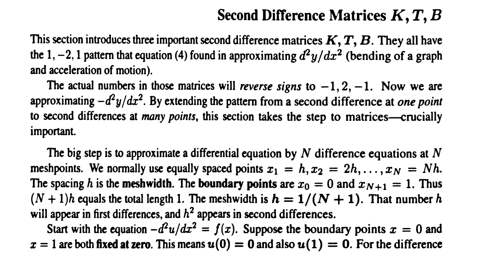

## 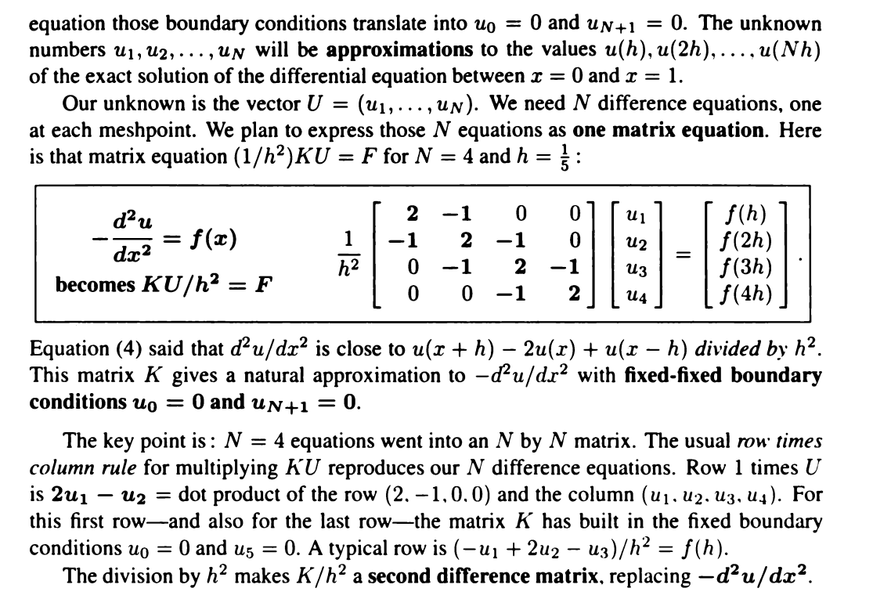
### 第二次差分矩阵 K、T、B —— 以矩阵形式逼近 ** $-\dfrac{d^{2}u}{dx^{2}}$ **

本节把上一页推导出的 **二阶差分公式**

$$
\dfrac{y(x+h)-2y(x)+y(x-h)}{h^{2}}\;\approx\;-\dfrac{d^{2}u}{dx^{2}}
$$

从「单点近似」推广到 **整条网格**，构造出三类极其重要的 **第二差分矩阵**  $K,\;T,\;B$ 。它们都含有  $(1,\,-2,\,1)$  或符号取反  $(-1,\,2,\,-1)$  的三对角带状结构，是数值求解偏/常微分方程的核心骨架。

* * *

1 从单点差分到全网格矩阵
-------------

| 过程 | 要点 |
| --- | --- |
| **离散网格** | 选  $N$  个等距节点  $x_1=h,\;x_2=2h,\dots,x_N=Nh$ ，边界  $x_0=0,\;x_{N+1}=1$ 。网格宽  $h=\dfrac1{N+1}$ 。 |
| **方程** | 连续模型  $-\dfrac{d^{2}u}{dx^{2}} = f(x)$ ，边界条件  $u(0)=u(1)=0$ 。 |
| **未知向量** |  $U=(u_1,\dots,u_N)^{\mathsf T}$ ，近似  $u(x_i)$ 。 |
| **差分化** | 在每个内部节点用二阶差分，得  $N$  条方程 ⇒ **矩阵方程**  $\dfrac1{h^{2}}KU = F$ 。 |

### 1.1 K 矩阵（固定–固定边界）

对  $N=4$ 、 $h=\tfrac15$  的例子

$$
K= \begin{bmatrix} 2 & -1 & 0 & 0\\ -1 & 2 & -1 & 0\\ 0 & -1 & 2 & -1\\ 0 & 0 & -1 & 2 \end{bmatrix}, \qquad F=\begin{bmatrix}f(h)\\f(2h)\\f(3h)\\f(4h)\end{bmatrix}.
$$
*   **行列含义**：首行  $2u_1-u_2 = f(h)h^{2}$  已隐含  $u_0=0$ ；末行类似隐含  $u_{N+1}=0$ 。
*   **结构**：对称、三对角、严格正定 —— 便于 Cholesky/LDLᵀ 分解。

* * *

2 延伸：三种常用第二差分矩阵
---------------

| 矩阵 | 边界 & 应用 | 典型三对角条 |
| --- | --- | --- |
| **K** | **Dirichlet–Dirichlet** 固定  $u=0$  两端 |  $\bigl[\dots,\,2,\,-1,\,\dots\bigr]$  |
| **T** | **Neumann–Neumann** (自由端导数=0) | 首/末行调整为  $[1,-1,0,\dots]$  形 |
| **B** | **混合/周期** (弹性梁、振动) | 中心同 K，边两行卷入周期或弹性常数 |

> 本页只展示 K；T、B 的构造思路完全相同，只需改动首末两行即可融入不同边界条件。

* * *

3 矩阵视角的关键洞察
-----------

1.  ** $N$  条差分方程 →  $N\times N$  线性系统**  $K U = h^{2}F$ 。
2.  **列‑行乘法规则**：K 的每行与 U 点乘正好给出  
     $(u_{i+1}-2u_i+u_{i-1})/h^{2}=f(x_i)$ 。
3.  **对称 & 正定**：保证数值求解稳定，可用 Cholesky / 共轭梯度。
4.  **尺度**：除以  $h^{2}$  后，K/h² 就是离散拉普拉斯算子  $-\Delta$ 。

* * *

4 计算示范（N=4）
-----------

$$
KU= \begin{bmatrix} 2u_1-u_2\\ -\,u_1+2u_2-u_3\\ -\,u_2+2u_3-u_4\\ -\,u_3+2u_4 \end{bmatrix} \overset{=}\longrightarrow h^{2} \begin{bmatrix} f(h)\\f(2h)\\f(3h)\\f(4h) \end{bmatrix}.
$$

求解流程：

1.  计算右端  $h^{2}F$ 。
2.  对 K 做 Cholesky： $K=LL^{\mathsf T}$ 。
3.  先解  $LY = h^{2}F$ （前代），再解  $L^{\mathsf T}U = Y$ （回代）。

* * *

5 小结
----

*   **1 – 2 + 1** 的差分模板 → 延展到 **三对角差分矩阵**。
*   边界条件体现在 **首末行系数** 的调整。
*   对称三对角矩阵 **存储 O(N)**、乘法 **O(N)**、分解 **O(N)** —— 适合大规模 PDE。
*   K、T、B 只是起点；高阶、非均匀网格、二维/三维差分都沿同样思路推广。

* * *

> 如需 K、T、B 在具体物理模型（梁弯曲、热传导、弹簧链）中的矩阵条目，或者想看更高阶差分（五点/七点）矩阵构造，请告诉我！

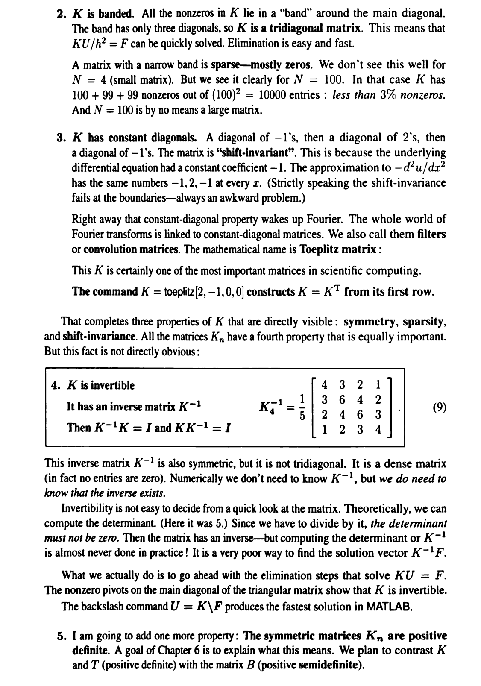

## 
### 二阶差分矩阵 **K** 的关键结构与数值特性

> **本节目标**：以  $N=4$  的示例矩阵
> 
> $$
> K_4=\begin{bmatrix} 2&-1&0&0\\[-2pt] -1&2&-1&0\\[-2pt] 0&-1&2&-1\\[-2pt] 0&0&-1&2 \end{bmatrix}\tag{8}
> $$
> 
> 为切入点，提炼出所有  $K_n$  （固定–固定边界二阶差分矩阵）最常被考察的 **5 大性质**，并解释这些性质在计算和应用中的意义。

* * *

1 对称性 (Symmetry)
----------------

*   公式层面： $K^{\mathsf T}=K$ ，即  $K_{ij}=K_{ji}$ 。
*   含义：矩阵关于主对角线镜像；可以**只存半矩阵**，Cholesky / LDLᵀ 分解直接受益。

* * *

2 带状稀疏性 (Band Sparsity)
-----------------------

| 特征 | 说明 |
| --- | --- |
| **三对角** | 仅主对角与相邻两条副对角非零。 |
| **稀疏度随 N 增长** | 非零元≈ $3N-2$ ，在  $N=100$  时仅 ≈ 3 % 填充。 |
| **计算优势** | 乘法、消元、存储皆  $O(N)$ ；大规模 PDE/ODE 离散时可轻松扩展。 |

* * *

3 常数对角线 / Toeplitz 结构 (Shift‑Invariance)
----------------------------------------

*   所有内部行都呈 ** $(-1,\,2,\,-1)$ ** 模式，反映微分算子系数恒定。
*   数学上称为 **Toeplitz 矩阵**（沿斜对角线常数）。
*   与傅里叶方法深度关联——卷积 / 滤波 / FFT 皆喜欢常系数差分矩阵。
    *   MATLAB/NumPy 示例：`K = toeplitz([2,-1,zeros(1,N-2)])`.

* * *

4 可逆性 & 正定性
-----------

*   **理论判据**：行列式  $\det K_n = \dfrac{n+1}{2^n}>0$  ⇒ 永远非零。
*   **正定**：所有特征值正 ⇒ 方程  $KU=F$  唯一解且共轭梯度法收敛。
*   **逆矩阵  $K^{-1}$ **：
    *   仍对称但**密集**（所有元素非零）；
    *   对数值解来说只需知道其存在，无需显式求得。
    *   示例  $N=4$ ：
        $$
         K_4^{-1}=\tfrac15 \begin{bmatrix} 4&3&2&1\\ 3&6&4&2\\ 2&4&6&3\\ 1&2&3&4 \end{bmatrix}\tag{9}
        $$

* * *

5 正定性加 Toeplitz ⇒ **正交本征向量易得**
------------------------------

*   对称 Toeplitz 三对角矩阵可用显式正弦基本征分解：
    $$
    K_n = Q\Lambda Q^{\mathsf T},\quad Q_{ij}=\sqrt{\frac{2}{n+1}}\sin\!\Bigl(\frac{ij\pi}{n+1}\Bigr),\; \lambda_k = 2\bigl(1-\cos\!\tfrac{k\pi}{n+1}\bigr).
    $$
*   应用：
    *   分析离散泊松方程误差；
    *   构造快速求解器（FFT‑based Poisson Solver）。

* * *

小结
--

| 性质 | 带来的直接好处 |
| --- | --- |
| **对称** | 半存储、Cholesky / LDLᵀ 解法 |
| **三对角稀疏** | 线性复杂度乘法与分解 |
| **常数对角（Toeplitz）** | 与傅里叶方法兼容，可快速对角化 |
| **可逆 + 正定** | 解唯一且数值稳定；共轭梯度高效 |
| **显式谱** | 误差分析、预条件化、快速算法基础 |

由此可见，二阶差分矩阵  $K$  不仅是教材示例，更是科学计算中 **最具代表性** 的“微分‑差分转换”矩阵之一；掌握其结构等于掌握了大规模线性算子离散的精髓。

* * *

> 如果想继续深入（如 K、T、B 在不同边界条件下的特征值差异，或如何用 FFT 解 1D Poisson 方程），随时发图或提问！

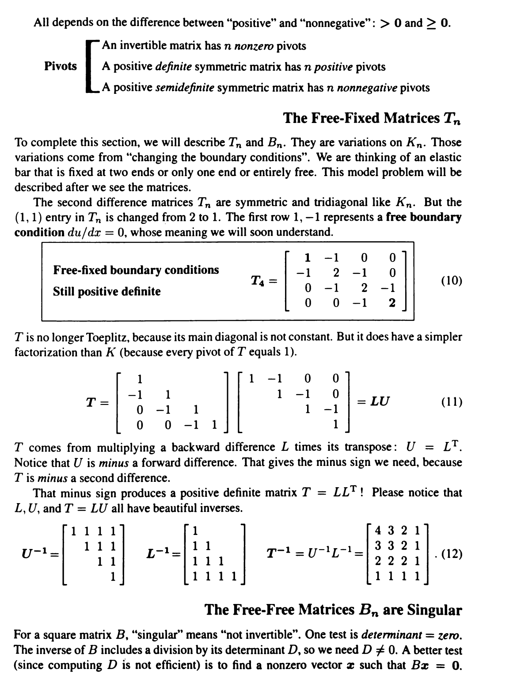

## 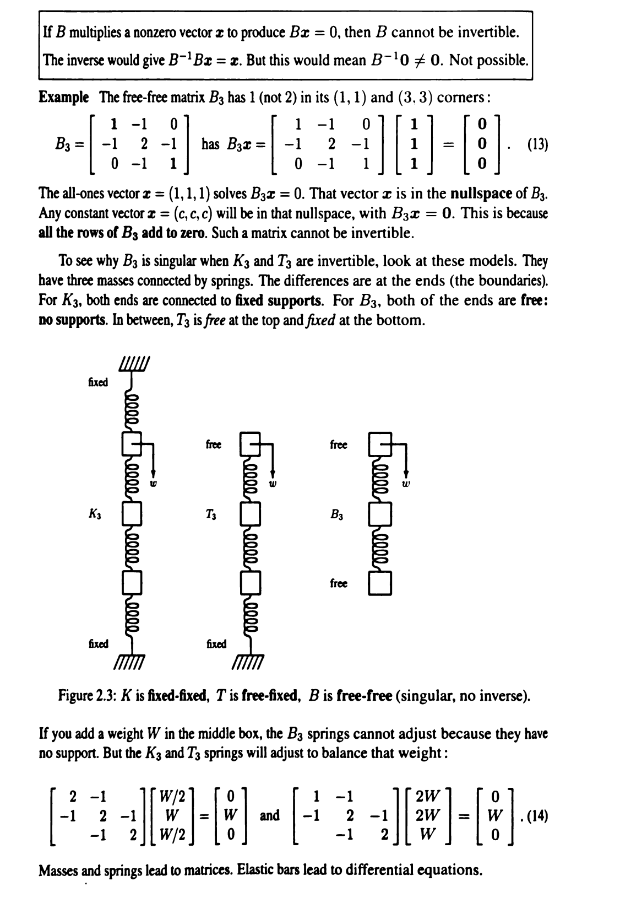
### Tₙ 与 Bₙ：由边界条件衍生的二阶差分矩阵

> 上一页我们归纳了固定–固定矩阵 **Kₙ** 的 5 大特性。现在图片展示了 **自由–固定 (Tₙ)** 与 **自由–自由 (Bₙ)** 两类变体，并解释它们的枢轴、可逆性与物理类比（串联弹簧）。下面按同样笔记格式补全。

* * *

1 正定 vs. 半正定：从枢轴数看可逆性
---------------------

| 结论 | 对称矩阵的 **n 个枢轴** |
| --- | --- |
| **可逆 (full‑rank)** | 枢轴 **全部非零** |
| **正定 (positive definite)** | 枢轴 **全部正数** |
| **半正定 (positive semidefinite)** | 枢轴 **≥ 0**，至少有 1 个 0 |

*   Kₙ & Tₙ → 正定（全部正枢轴）
*   Bₙ → 半正定（首末枢轴=0 ⇒ 不可逆）

* * *

2 自由‑固定矩阵 Tₙ
------------

### 2.1 构造

*   改动 **首行**：主对角改 2→1，形成  $(+1,-1)$  图样，对应自由边界  $du/dx=0$ 。
*   例  $N=4$ ：
    $$
    T_4=\begin{bmatrix} 1 & -1 & 0 & 0\\ -1 & 2 & -1 & 0\\ 0 & -1 & 2 & -1\\ 0 & 0 & -1 & 2 \end{bmatrix}\tag{10}
    $$

### 2.2 简洁分解

$$
T = L\,U,\quad L=\begin{bmatrix} 1 \\ -1 & 1 \\ 0 & -1 & 1 \\ 0 & 0 & -1 & 1 \end{bmatrix},\qquad U=L^{\mathsf T}\ (\text{带负号})\tag{11}
$$
*   本质： $T=LL^{\mathsf T}$  ⇒ **正定**。
*   每个枢轴都等于 1 → 消元更稳，误差放大系数小。

* * *

3 自由‑自由矩阵 Bₙ（首末也置 1）
--------------------

### 3.1 不可逆示例 ( $N=3$ )

$$
B_3=\begin{bmatrix} 1&-1&0\\ -1&2&-1\\ 0&-1&1 \end{bmatrix},\quad B_3\,\mathbf{1}=0\tag{13}
$$
*   **行和为 0** ⇒ 所有常数向量 x 在 nullspace。
*   因而 **det = 0**, **无逆**，仅半正定。

### 3.2 物理解释

三质量‑弹簧模型：

*   **K₃**：两端固定
*   **T₃**：上端自由、下端固定
*   **B₃**：上下都自由 → 加载后整体漂移，系统缺乏“约束” ⇒ 矩阵奇异

* * *

4 数值与应用启示
---------

| 性质 | Kₙ | Tₙ | Bₙ |
| --- | --- | --- | --- |
| **对称三对角** | ✓ | ✓ | ✓ |
| **Toeplitz** | ✓ | ✗ (首对角≠2) | ✗ |
| **正定** | ✓ | ✓ | ✗ (仅半正定) |
| **物理边界** | 固‑固 | 自‑固 | 自‑自 |
| **逆矩阵密集** | ✓ | ✓ | ✗ (无逆) |

*   **正定** → 可用共轭梯度、Cholesky；
*   **半正定** → 需广义最小二乘或添加约束(例如固定任一节点) 才能求唯一解。

* * *

5 快速回顾枢轴与边界
-----------

*   **枢轴 = 主对角元素经消元后的值**
*   边界条件改变首末行 ⇒ 直接影响首末枢轴 → 决定可逆性。

* * *

### 小结

1.  **Tₙ** 通过修改首行  $2\to1$  引入自由边界，但仍 **正定可逆**。
2.  **Bₙ** 在两端都用 1 → 行和 0，导致 **nullspace=常数向量**，矩阵奇异。
3.  结构‑物理双映射：固定/自由支座 ↔ 线性代数中“是否对角加 1”。
4.  设计差分模型时，边界条件不仅改变首末行系数，也直接决定求解器策略（需否约束/正则化）。

* * *

> 如还需 Tₙ/Bₙ 的显式特征值、FFT 快速解法，或如何在 2D 网格形成自由‑固定拉普拉斯，请告诉我！

## 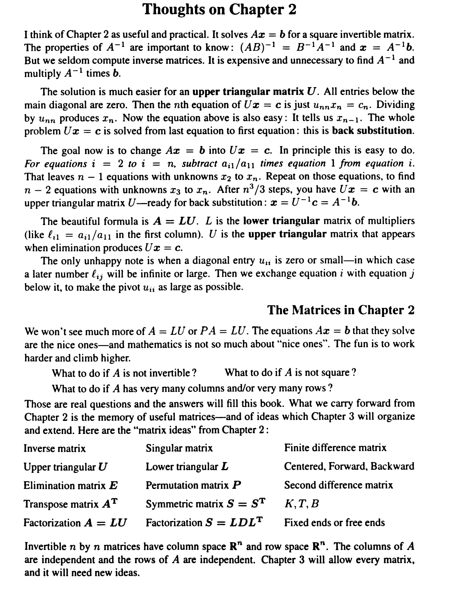
第 2 章回顾与核心矩阵一览
--------------

**概述**：本节为整章作总结，先回顾 _Ax = b_ 的消元思想、上三角矩阵带来的简化与主元交换的必要性，继而罗列第 2 章中陆续出现的 20 余种“矩阵概念”，为后续章节埋下伏笔。

* * *

### 1 从 _Ax = b_ 到 _Ux = c_：消元、回代与 LU

1.  **上三角优势**
    *   当 _U_ 为上三角时，只需自下而上一次除法即可求 _x_——这就是**回代**。
    *   整个难题因此变成：如何把 _A_ 变成 _U_。
2.  **消元流程**
    *   以第一行为“主行”：对 i = 2…n 做
        $$
         \text{row}_i \;-\; \frac{a_{i1}}{a_{11}}\,\text{row}_1
        $$
        清零首列下方元素。
    *   重复 n‑1 列，约 n³⁄3 步后得到 _U_ 并伴随右端 _c_。
3.  **矩阵形式：A = LU**
    *   **L**：收集所有消元乘子  $\ell_{ij} = a_{ij}/a_{jj}$ 。
    *   **U**：消元后所得上三角。
    *   先解 _Ly = b_（前代），再解 _Ux = y_（回代）——速度远优于求 _A^{-1}_。
4.  **主元交换（Partial Pivoting）**
    *   若出现  $u_{ii}=0$  或极小，需用置换矩阵 _P_ 交换当前行与下方最大元素行，保证数值稳定及枢轴非零。

* * *

### 2 章末自问：若 _A_ 不可逆/不方阵怎么办？

*   **奇异矩阵**：某行、列或主元为 0 ⇒ 行列式 0；需转向秩、伪逆、最小二乘等概念（第 3 章展开）。
*   **多列或多行**：将引出列空间、行空间、秩分解、QR 等主题。

* * *

### 3 第 2 章关键词矩阵速查表

| 类别 | 关键词 |
| --- | --- |
| **逆/奇异** | Inverse matrix, Singular matrix |
| **三角** | Upper triangular _U_, Lower triangular _L_ |
| **消元** | Elimination matrix _E_ |
| **置换** | Permutation matrix _P_ |
| **转置/对称** | Transpose  $A^{\mathsf T}$ , Symmetric \_S=S^{\\mathsf T}\_ |
| **分解** | _A = LU_, _S = LDL^{\\mathsf T}_ |
| **有限差分** | Forward / Backward / Centered difference matrices |
| **二阶差分** | _K, T, B_（固定–固定、自由–固定、自由–自由） |
| **边界条件** | Fixed ends、Free ends |

> **记忆窍门**：把它们分成「_线性方程_（LU、P\_）、_矩阵性质_（逆、奇异、对称）、_微分近似_（差分、KTB）」三大簇，可迅速定位概念。

* * *

### 4 补充：矩阵与空间

*   _n × n_ 可逆矩阵的列张成 **列空间 = ℝⁿ**，行亦同理。
*   奇异矩阵列/行未充满 ℝⁿ ⇒ 引入零空间、秩缺损。
*   第 3 章将放开限制，讨论任何大小、任何秩的矩阵及其对应四大子空间。

* * *

### 5 本节小结

1.  **消元核心**：把 _A_ 变 _U_，再回代；矩阵形式即 _A = LU_。
2.  **枢轴对稳定性至关重要**，置换矩阵 _P_ 能自动保障非零且较大主元。
3.  **第 2 章矩阵谱系**：逆/奇异、三角、置换、对称、差分及其分解方法，共同构成后续学习的工具箱。
4.  **展望**：下一章将以秩与空间为主线，把“每一种矩阵”都纳入统一框架。

* * *

