# 线性方程求解概述

**User:** Anonymous (dqswordman@gmail.com)  
**Created:** 8/9/2025 1:11  
**Updated:** 8/9/2025 2:34  
**Exported:** 8/9/2025 3:14  
**Link:** [https://chatgpt.com/c/68963dbb-8b08-8328-858c-82f3413877f7](https://chatgpt.com/c/68963dbb-8b08-8328-858c-82f3413877f7)  

## Prompt:
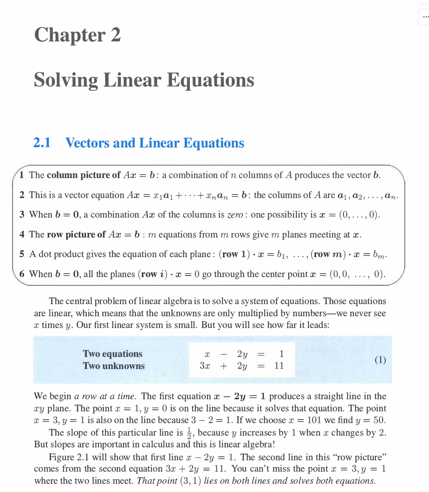

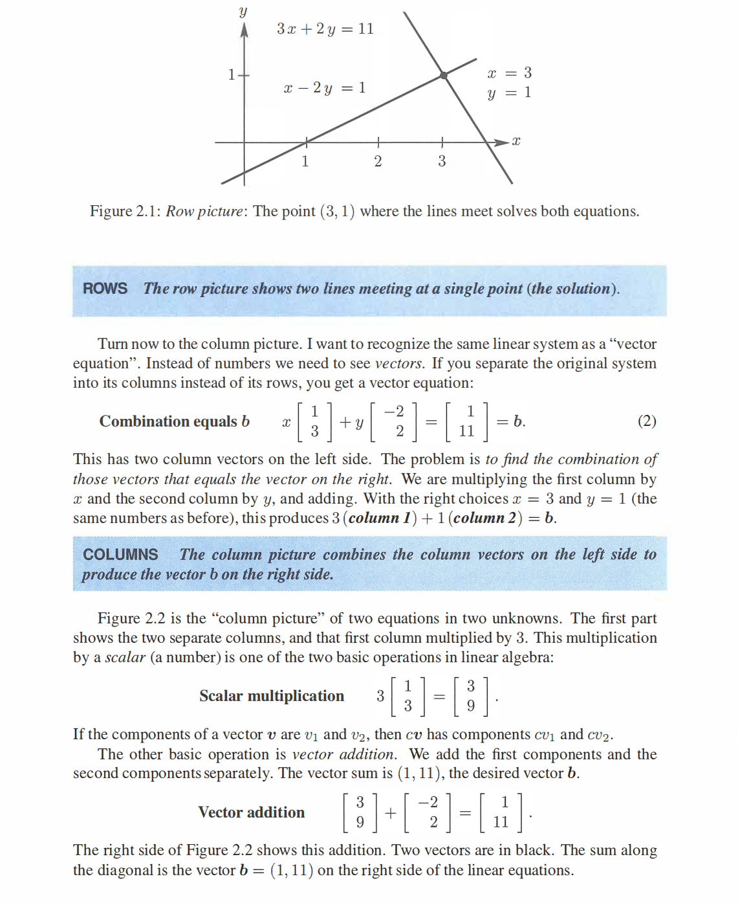

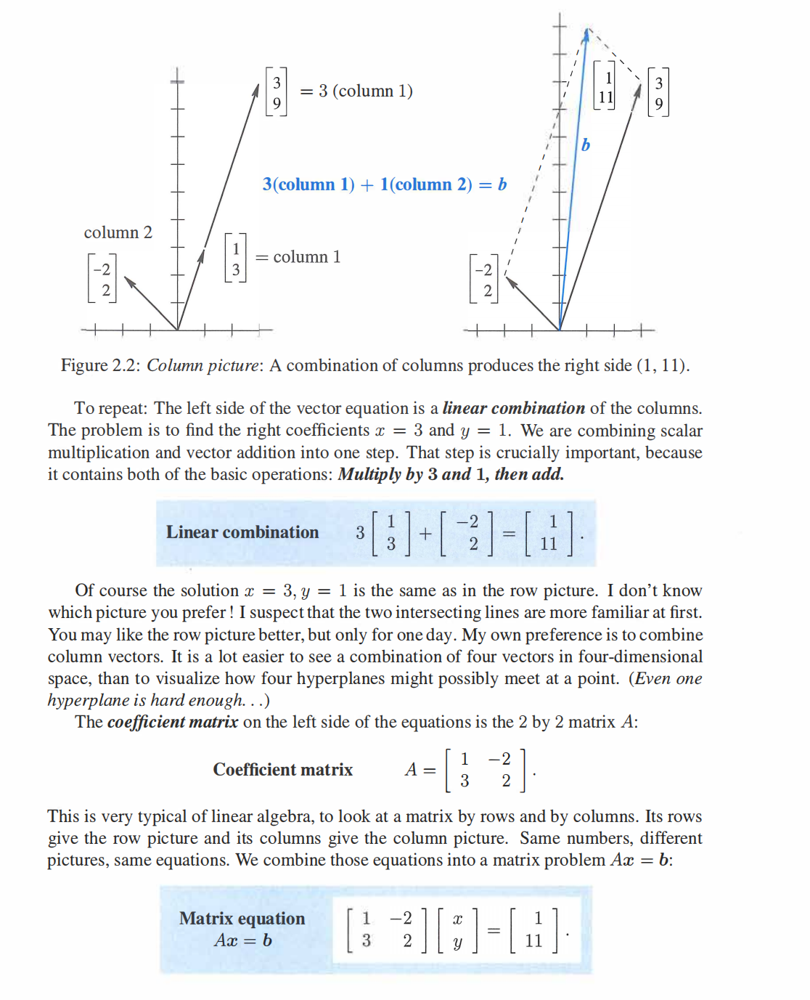

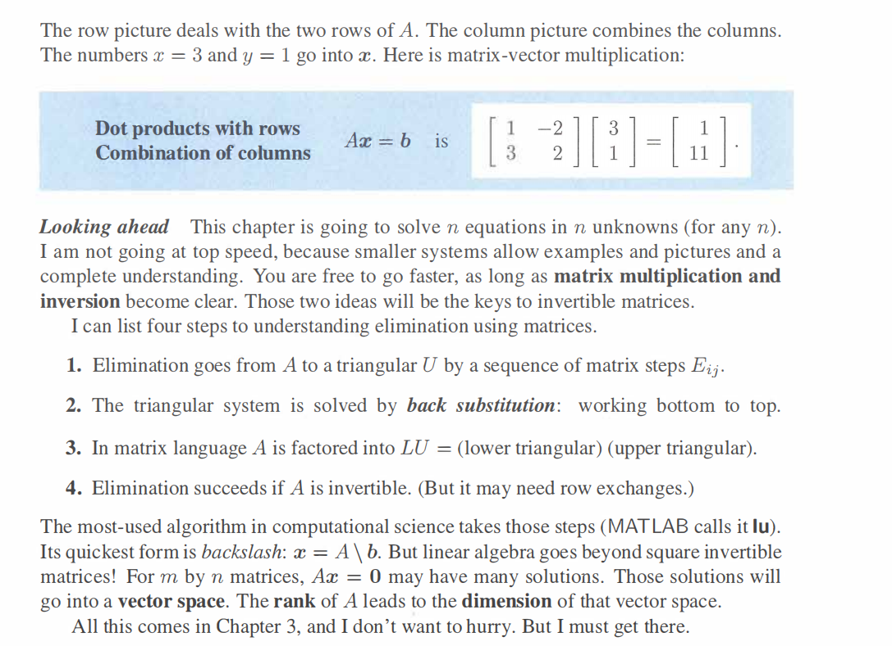

## Response:
第2章：线性方程的求解（节2.1 向量与线性方程）
=========================

本讲完整笔记

**概况**  
本节把同一个线性方程组  $Ax=b$  从两种互补的视角来理解：

*   **行图像（row picture）**：每一行是一个“超平面”（二维是直线，三维是平面），解就是这些超平面的**交点**。
*   **列图像（column picture）**：矩阵  $A$  的每一**列向量**做线性组合，恰好得到右端向量  $b$ 。解向量  $x$  给出这组系数。  
    两种图像描述的是**同一件事**：一边说“几何交点”，一边说“线性组合”。接着引出矩阵乘法、点积、线性组合、系数矩阵、列空间/秩，以及将来要用的高斯消元与  $LU$  分解的四个关键步骤。

* * *

1\. 例子系统与“行图像”：两条直线的交点
----------------------

考虑书中的方程组：

$$
\begin{cases} x-2y=1\\ 3x+2y=11 \end{cases} \qquad (m=2\text{ 个方程},\ n=2\text{ 个未知})
$$

### 1.1 每一行对应一条直线（二维情形）

把每一条方程改写为斜截式：

*   第一行  $x-2y=1 \Rightarrow y=\tfrac12 x-\tfrac12$ 。斜率  $\tfrac12$ ，截距  $-\tfrac12$ 。
*   第二行  $3x+2y=11 \Rightarrow y=-\tfrac32 x+\tfrac{11}{2}$ 。斜率  $-\tfrac32$ 。

**行图像结论**：两条直线在点  $(3,1)$  相交，这个交点就是唯一解。  
验证：由  $x=1+2y$  代入第二行

$$
3(1+2y)+2y=11 \Rightarrow 3+6y+2y=11 \Rightarrow 8y=8 \Rightarrow y=1,\quad x=3.
$$

> 一般情形： $A\in\mathbb{R}^{m\times n}$ 。第  $i$  行  $a_i^\top x=b_i$  是  $\mathbb{R}^{n}$  中的一个超平面；解是  $m$  个超平面的公共交点。若  $b=0$ ，这些超平面都过原点。

* * *

2\. “列图像”：列向量的线性组合等于  $b$ 
--------------------------

把同一系统写成列的形式。令

$$
A=\begin{bmatrix}1&-2\\[2pt]3&2\end{bmatrix} =\big[\,a_1\ \ a_2\,\big],\quad a_1=\begin{bmatrix}1\\3\end{bmatrix},\ a_2=\begin{bmatrix}-2\\2\end{bmatrix},\quad x=\begin{bmatrix}x\\y\end{bmatrix},\quad b=\begin{bmatrix}1\\11\end{bmatrix}.
$$

则

$$
Ax=b \iff x\,a_1+y\,a_2=b.
$$

也就是在  $\mathbb{R}^2$  里，用两根“箭头”  $a_1,a_2$  的线性组合凑出目标箭头  $b$ 。  
本例恰好是

$$
3\,a_1+1\,a_2=\begin{bmatrix}3\\9\end{bmatrix}+\begin{bmatrix}-2\\2\end{bmatrix} =\begin{bmatrix}1\\11\end{bmatrix}=b,
$$

所以  $x=3,\ y=1$ 。

> 一般情形：若  $A=[a_1,\dots,a_n]\in\mathbb{R}^{m\times n}$ ，则
> 
> $$
> Ax=\sum_{j=1}^{n} x_j a_j.
> $$
> 
> **是否可解**取决于  $b$  是否属于  $A$  的**列空间**（由列向量生成的子空间）。当  $b=0$  时，问题变为“哪些系数使线性组合等于零”（齐次方程），总有平凡解  $x=0$ 。

* * *

3\. 两个基本向量运算与“线性组合”
-------------------

*   **标量乘法**： $c\,\begin{bmatrix}v_1\\v_2\end{bmatrix}=\begin{bmatrix}cv_1\\cv_2\end{bmatrix}$ （把向量拉伸/翻转）。
*   **向量加法**：按分量相加。  
    把“先乘再加”合并到一步就是**线性组合**：
    
$$
x\,a_1+y\,a_2=b \quad\text{（或更一般的 }\sum_j x_j a_j=b\text{）}.
$$

因此，“列图像”其实是在问：**找到一组系数，使列向量的线性组合命中  $b$ **。

* * *

4\. 点积与“行图像”的矩阵乘法表达
-------------------

矩阵–向量乘法也可从“行”的角度理解：

$$
Ax= \begin{bmatrix} \text{row}_1\\[2pt] \text{row}_2 \end{bmatrix}x= \begin{bmatrix} \text{row}_1\cdot x\\[2pt] \text{row}_2\cdot x \end{bmatrix}.
$$

本例：

$$
\begin{bmatrix}1&-2\\3&2\end{bmatrix} \begin{bmatrix}3\\1\end{bmatrix} = \begin{bmatrix} [1,-2]\cdot[3,1]\\ [3,2]\cdot[3,1] \end{bmatrix} = \begin{bmatrix} 1\\11 \end{bmatrix}=b.
$$

所以**同一乘法**同时支持两种解读：

*   行视角：每个分量是“行与  $x$ ”的**点积**，给出各行方程。
*   列视角：整个向量是“列的线性组合”。

* * *

5\. 系数矩阵与矩阵方程
-------------

把方程组统一写作

$$
A=\begin{bmatrix}1&-2\\3&2\end{bmatrix},\quad x=\begin{bmatrix}x\\y\end{bmatrix},\quad b=\begin{bmatrix}1\\11\end{bmatrix},\qquad Ax=b.
$$
*   这里的  $A$  叫**系数矩阵**。
*   **可逆性**： $\det(A)=1\cdot2-(-2)\cdot3=8\neq0\Rightarrow A$  可逆，解唯一：
    $$
    A^{-1}=\tfrac18\begin{bmatrix}2&2\\-3&1\end{bmatrix},\quad x=A^{-1}b=\tfrac18\begin{bmatrix}24\\8\end{bmatrix}=\begin{bmatrix}3\\1\end{bmatrix}.
    $$
*   若  $\det(A)=0$ ，则要么**无解**（行图像：直线/平面平行且分离；列图像： $b$  不在列空间），要么**无穷多解**（两行同一直线/平面重合；列空间包含  $b$  且列不独立）。

* * *

6\. 维度、列空间与秩（为后续铺垫）
-------------------

*    $Ax=b$  的**解存在**    $\iff b\in\text{Col}(A)$ 。
*   **秩**  $\operatorname{rank}(A)$  是列空间（或行空间）的维数。它决定了能张成的空间大小，从而限制哪些  $b$  可被表示。
*   对方阵  $n\times n$ ： $\operatorname{rank}(A)=n\iff A$  可逆    $\iff$  仅齐次解  $x=0$ 。

* * *

7\. 展望：用矩阵做消元（本章后面/下章主角）
------------------------

书中“Looking ahead”的四点把**高斯消元**总结为清晰的流程：

1.  **消元**：用一系列初等行变换（或等价的消元矩阵  $E_{ij}$ ）把  $A$  化为**上三角**矩阵  $U$ 。
2.  **回代**：自下而上求解  $Ux=b'$ 。
3.  **矩阵语言**：把行变换累乘得到  $L^{-1}A=U$ ，于是  $A=LU$ （ $L$  下三角；必要时含置换矩阵  $P$ ： $PA=LU$ ）。
4.  **成功条件**：消元需要非零主元——这等价于  $A$  可逆（或适当换行/选主元后可继续）。

数值计算里，最快捷的调用往往是“反斜杠”求解  $x=A\backslash b$ （背后就是  $LU$  / 选主元）。

* * *

8\. 行图像 vs 列图像：同一事实的两面
----------------------

*   **行图像**聚焦在“满足所有方程的点在哪里？”——几何交点。
*   **列图像**问“能否用这些列合成  $b$ ？如何合成？”——线性组合。
*   两者统一在矩阵乘法中：
    $$
    \boxed{\;Ax= \begin{bmatrix} a_1&\cdots&a_n \end{bmatrix} \begin{bmatrix} x_1\\ \vdots\\ x_n \end{bmatrix} =\sum_j x_j a_j,\qquad (Ax)_i=\text{row}_i\cdot x\;}
    $$

* * *

9\. 关键术语小抄（对应页边蓝框）
------------------

*   **Row picture**： $m$  行  $\Rightarrow$   $m$  个超平面（二维是线），解是交点；若  $b=0$ ，全过原点。
*   **Column picture**：左边的列向量按  $x$  加权相加得到右边的  $b$ 。
*   **Dot product with rows**：第  $i$  行与  $x$  的点积等于  $b_i$ 。
*   **Linear combination**： $\sum_j x_j a_j$ 。
*   **Coefficient matrix**：仅由系数组成的矩阵  $A$ 。
*   **Matrix equation**： $Ax=b$ 。

* * *

10\. 本例的完整三种求解方式（巩固）
--------------------

1.  **代入/消元**：上面已算得  $(x,y)=(3,1)$ 。
2.  **列组合**：找  $x,y$  使  $x[1,3]^\top+y[-2,2]^\top=[1,11]^\top\Rightarrow (3,1)$ 。
3.  **逆矩阵**： $x=A^{-1}b=\big(\tfrac18\begin{bmatrix}2&2\\-3&1\end{bmatrix}\big)[1,11]^\top=(3,1)^\top$ 。

三种方法一致，分别对应“行图像、列图像、代数公式”。

* * *

11\. 延伸到一般  $m\times n$ 
------------------------

*   **未知数个数  $n$ ** 决定向量  $x$  的维数；**方程个数  $m$ ** 决定你有多少个“行约束”。
*   **可能性**：
    *   唯一解（列独立且  $b$  在列空间）
    *   无解（行不相交； $b$  不在列空间）
    *   无穷多解（约束不足或行/列相关）
*   **齐次系统  $Ax=0$ **：解集是列向量的所有线性关系（**零空间**）。其维数是  $n-\operatorname{rank}(A)$ 。

* * *

12\. 本节小结
---------

*   把线性方程组  $Ax=b$  记成两个图像：  
    **行图像**＝超平面的交点；**列图像**＝列向量的线性组合得到  $b$ 。
*   矩阵–向量乘法兼容两种解读：**行的点积**与**列的线性组合**。
*   可解性与唯一性由**列空间**与**秩**决定；方阵可逆  $\Leftrightarrow$  唯一解。
*   计算上将使用**消元 → 回代 →  $LU$  分解**（必要时配合选主元/换行）。
*   例子  $\{x-2y=1,\ 3x+2y=11\}$  直观演示了两种图像并给出唯一解  $(3,1)$ 。

* * *

报错/可读性反馈
--------

本次四张图片内容清晰；若后续页面中有公式或图形不清楚、缺页或需要我补充推导细节（如  $LU$  的具体消元矩阵、列空间/零空间的可视化、高维几何图像等），请继续上传，我会按同样风格补全到这份连续笔记中。

2/2

## Prompt:
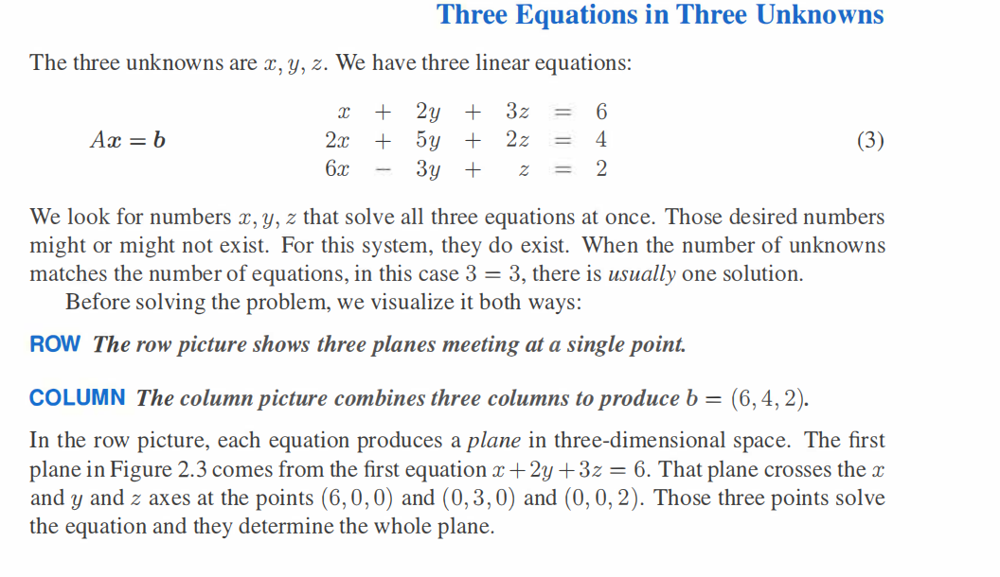

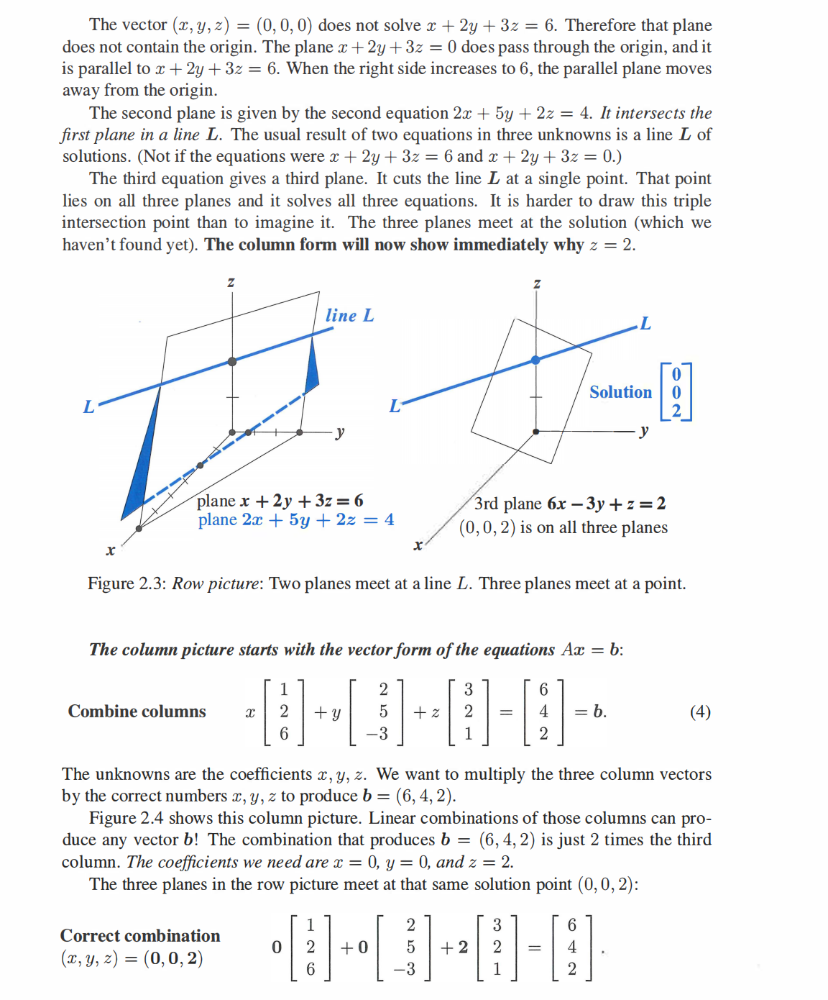

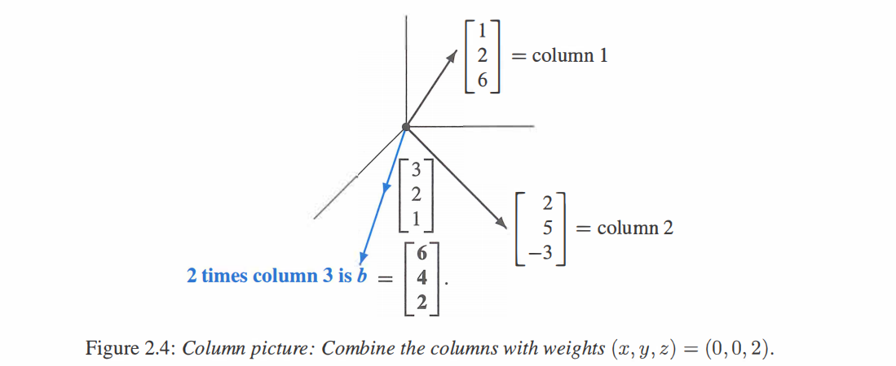

## Response:
已思考 51s

我需要根据用户的要求，详细地用中文分析这个内容。这个系统包括：

x + 2y + 3z = 6  
2x + 5y + 2z = 4  
6x − 3y + z = 2

嗯，等一下，第三个方程似乎是“6x = 3y + z = 2”？不对，应该是“6x − 3y + z = 2”，因为接下来文段提到的平面与向量(0,0,2)相关。

矩阵A的列是：

第一列（x的系数） = \[1; 2;6\]  
第二列（y的系数） = \[2; 5; -3\]  
第三列（z的系数） = \[3; 2; 1\]

向量b = \[6; 4; 2\]，因此A是：

A = \[\[1, 2, 3\],  
\[2, 5, 2\],  
\[6, -3, 1\]\]

第三行展示了方程6x − 3y + z = 2，解法中说了，z = 2是因为b是第三列的两倍。最终解是x = 0, y = 0, z = 2。接下来要开始准备更详细的笔记，联系到前面的二维情况。

我们首先要细致考虑行图像与列图像；L线是前两个平面的交线。原点不在x+2y+3z=6平面上，因为(0,0,0)不满足方程。平面x+2y+3z=0通过原点，并与第一个平行；同时右侧增加到6，沿法向量作平移。接下来，我们可以计算交线L，解前两方程，逐步给出清晰的推导。

我可以快速用手算，也可以用Python确认。首先从方程（1）得到x = 6 − 2y − 3z，然后代入方程（2）得到y = 4z − 8，再代入x，得到x = 22 − 11z。这样，参数化方程为(x, y, z) = (22 − 11z, 4z − 8, z)，当z=0时，点为(22, −8, 0)，而当z=2时，确实得到解(0,0,2)。

我们可以计算平面的法向量：n1 = (1,2,3)，n2 = (2,5,2)，n3 = (6, −3, 1)。前两个平面的交线L沿着法向量n1和n2的叉积方向。那么我会计算n1 × n2来交叉验证这个结果。

分析三元一次方程组与平面交点

```python
import sympy as sp
n1=sp.Matrix([1,2,3])
n2=sp.Matrix([2,5,2])
d = n1.cross(n2)
n3=sp.Matrix([6,-3,1])
d,n1.dot(d),n2.dot(d),n3.dot(d)

```

undefined

方向向量为（－11,4,1）。第三平面会在该方向上交于解点。因为n3与d的点积不为0，说明这个直线不会与第三平面平行，必然有唯一交点。我可以通过已知点加上参数步进来求解，得出交点位置。

我们可以展示如何求解线性方程组，或者展示行列式的关系。观察列向量，我们看到 (6,4,2) 等于 2×第三列。检查列向量后，确认(0,0,0)不在第一个平面上，并说明三平面喷交点的情形，计算行列式det(A)。

计算三维平面交点

```python
A=sp.Matrix([[1,2,3],[2,5,2],[6,-3,1]])
A.det()

```

undefined

行列式不为零（-77），解唯一。尽管直接根据列组合求解z，不太需要求逆矩阵，但我们仍然可以通过消元法展示解法。可以展示如何通过操作将矩阵三角化，并使用逐步消元来解决，但要确保解释清晰且简洁。

消元步骤可以展示为三角化，最终得到解 (0,0,2)。通过行列式验证解的唯一性，-77的行列式确保了三平面相交于唯一点。几何解释中，第一、第二平面的交线与第三平面相交，且列的组合表明 b= 2\*col3。

为符合用户要求，我将按步骤呈现内容，并提供图像清晰的部分，避免“错误”部分。会标注“第二章 1 补充：三个未知的三个方程”作为标题。内容将用中文呈现，语言保持简洁学术，避免过多修饰，进行详细说明。

完成

三个未知的三个方程：行图像与列图像的统一理解
======================

**概况**  
本节把三元一次方程组

$$
\begin{cases} x+2y+3z=6,\\ 2x+5y+2z=4,\\ 6x-3y+z=2 \end{cases} \quad\Longleftrightarrow\quad Ax=b
$$

在\*\*行图像（三个平面）**与**列图像（列向量线性组合）\*\*两种视角下彻底讲清：

*   行图像：三条方程在  $\mathbb{R}^3$  中给出三个平面，解是三平面的**公共交点**。
*   列图像：把  $A$  的三列向量按  $(x,y,z)$  加权相加，**恰好得到**右端向量  $b$ 。在本例中  $b$  竟然是**第三列的两倍**，于是立刻读出  $z=2,\ x=y=0$ 。  
    同时用一次清晰的**消元演算**把代数求解走一遍，并用行列式解释为何解唯一。

* * *

1\. 行图像：三个平面相交于一点
-----------------

把每一行看成一个平面：

$$
\Pi_1:\ x+2y+3z=6,\qquad \Pi_2:\ 2x+5y+2z=4,\qquad \Pi_3:\ 6x-3y+z=2.
$$

### 1.1 单个平面的几何直观

以  $\Pi_1$  为例：与坐标轴的截距为  
 $(6,0,0),\ (0,3,0),\ (0,0,2)$ （在图中都标了出来）。  
 $(0,0,0)$  **不在**  $\Pi_1$  上，因为  $0\neq 6$ ；而平面  $x+2y+3z=0$  经过原点并与  $\Pi_1$  **平行**，把右端从 0 改到 6 只是把它沿法向量  $(1,2,3)$  平移。

### 1.2 两平面的交线

 $\Pi_1$  与  $\Pi_2$  的交集通常是一条直线  $L$ 。把前两式联立，解出用  $z$  参数化的交线：

$$
\begin{aligned} x&=6-2y-3z,\\ 2x+5y+2z&=4 \ \Rightarrow\ y=4z-8,\\ \Rightarrow\ x&=22-11z. \end{aligned}
$$

于是

$$
L:\ (x,y,z)=(22, -8, 0) + z\,(-11,\,4,\,1).
$$

（方向向量  $(-11,4,1)$  正是法向  $(1,2,3)\times(2,5,2)$  的叉积。）

### 1.3 第三个平面把交线“截”成一个点

把  $L$  代入  $\Pi_3:6x-3y+z=2$ 。令参数为  $t=z$ ，则

$$
x=22-11t,\ y=4t-8,\ z=t.
$$

代入得  
   $\;6(22-11t)-3(4t-8)+t=2 \Rightarrow -77t=-154 \Rightarrow t=2$ 。  
因此

$$
(x,y,z)=(0,0,2),
$$

这一点同时落在  $\Pi_1,\Pi_2,\Pi_3$  上——三平面的公共交点就是**唯一解**。

* * *

2\. 列图像：列向量的线性组合等于  $b$ 
------------------------

把矩阵与向量写明：

$$
A=\begin{bmatrix} 1&2&3\\ 2&5&2\\ 6&-3&1 \end{bmatrix} =\big[a_1\ a_2\ a_3\big],\quad b=\begin{bmatrix}6\\4\\2\end{bmatrix}.
$$

列图像陈述的是

$$
Ax=b\ \Longleftrightarrow\ x\,a_1+y\,a_2+z\,a_3=b.
$$

**关键观察**（图 2.4）：

$$
2\,a_3= 2\!\begin{bmatrix}3\\2\\1\end{bmatrix}= \begin{bmatrix}6\\4\\2\end{bmatrix}=b.
$$

因此立刻得到

$$
(x,y,z)=(0,0,2).
$$

这比画三平面的相交更直观：在三维中只要看出“目标向量  $b$  正好是第三列的两倍”。

> 记忆法：**列图像**永远是“把左边的列，用右边的系数  $x,y,z$  线性组合，凑成  $b$ ”。

* * *

3\. 代数求解：一次标准的消元与回代
-------------------

将增广矩阵写出并做高斯消元：

$$
\left[\begin{array}{ccc|c} 1&2&3&6\\ 2&5&2&4\\ 6&-3&1&2 \end{array}\right] \stackrel{R_2-2R_1}{\longrightarrow} \left[\begin{array}{ccc|c} 1&2&3&6\\ 0&1&-4&-8\\ 6&-3&1&2 \end{array}\right] \stackrel{R_3-6R_1}{\longrightarrow} \left[\begin{array}{ccc|c} 1&2&3&6\\ 0&1&-4&-8\\ 0&-15&-17&-34 \end{array}\right]
$$

$$
\stackrel{R_3+15R_2}{\longrightarrow} \left[\begin{array}{ccc|c} 1&2&3&6\\ 0&1&-4&-8\\ 0&0&-77&-154 \end{array}\right].
$$

回代： $-77z=-154\Rightarrow z=2$ ；  
 $y-4z=-8\Rightarrow y=0$ ；  
 $x+2y+3z=6\Rightarrow x=0$ 。  
与几何/列图像完全一致。

* * *

4\. 为什么此时“通常有唯一解”
-----------------

*   行列式
    
$$
\det(A)= \begin{vmatrix} 1&2&3\\ 2&5&2\\ 6&-3&1 \end{vmatrix} =-77\neq0.
$$

非零说明三列**线性无关**，三平面**一般位置相交于一点**，矩阵可逆，解唯一。

*   几何上  $\det(A)$  等于三法向的**混合体积**（三重积）：  
     $\det(A)=n_3\cdot(n_1\times n_2)$ ，非零表示三法向不共面，从而三平面不会“平行/重合/沿一条线重合”。

> 若  $\det(A)=0$ ，可能：  
> ① 无解（例如两平面平行或三平面形成一条交线但第三个平面与这条线平行、错开）；  
> ② 无穷多解（例如三平面同过一条线，或三式等价于两式）。

* * *

5\. 三种视角的统一公式
-------------

*   **列图像（线性组合）**：
    $$
    Ax=\sum_{j=1}^3 x_j a_j=b.
    $$
*   **行图像（点积/方程）**：
    $$
    (Ax)_i=\text{row}_i\cdot x=b_i,\quad i=1,2,3.
    $$
*   **可逆情形**：
    $$
    \det(A)\neq0\ \Longleftrightarrow\ A^{-1}\ \text{存在}\ \Longrightarrow\ x=A^{-1}b.
    $$

* * *

6\. 本节总结
--------

1.  三元一次方程组既可以看作**三平面求交**（行图像），也可以看作**列向量凑出  $b$ **（列图像）。
2.  本例一眼可见  $b=2a_3$ ，于是立刻得  $z=2$ ，再由两式回代得  $x=y=0$ 。
3.  消元把直观几何转成可计算步骤； $\det(A)\neq0$  保证唯一解。
4.  行—列两种描述被**同一个矩阵乘法**统一：上是点积、左是线性组合。

* * *

报错/可读性
------

这组图片清晰无缺页，公式与图（交线  $L$ 、三平面交点、列组合成  $b$ ）均可辨。若你想，我可以：

*   继续把“为什么  $b$  不在列空间时无解”“当  $\det(A)=0$  时会发生什么”配几组反例；
*   或把上面的消元过程写成可复用的  $LU$  分解模板，和数值稳定的选主元版本。

## Prompt:
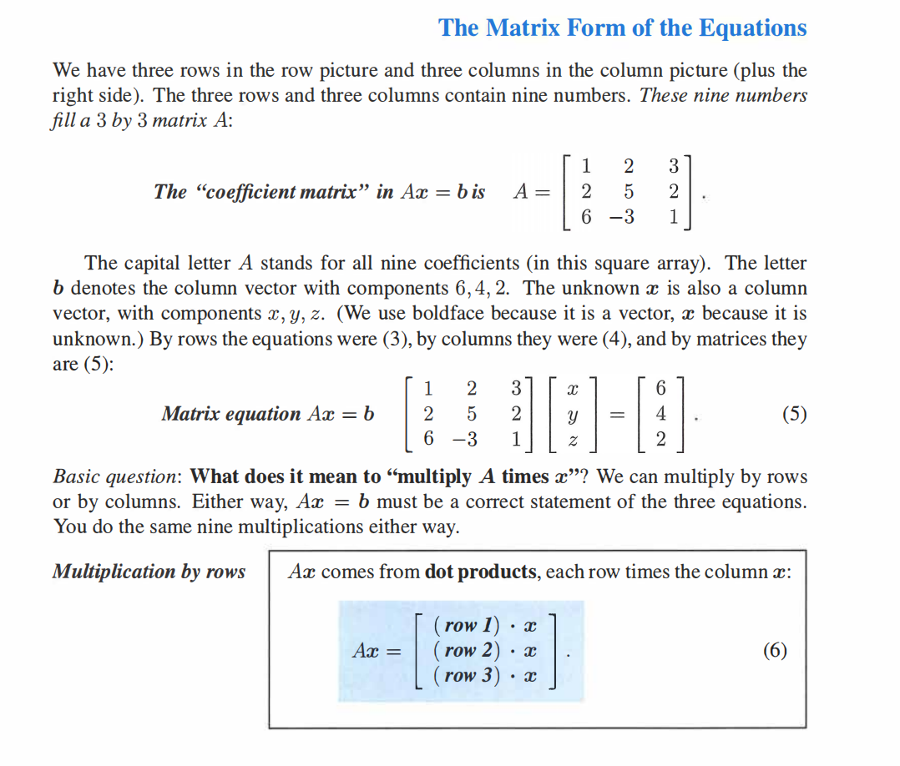

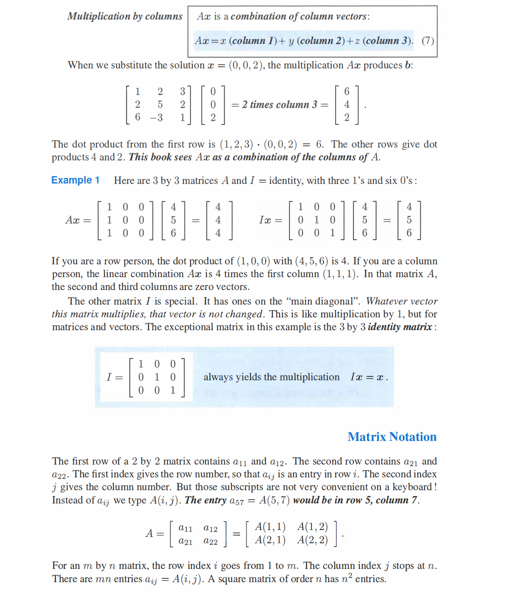

## Response:
已思考 24s

用户要求用中文回答，并按指定格式提供详细笔记。我将结合之前的章节内容，讲解矩阵方程Ax=b、行列乘法、点积、列组合、单位矩阵的例子，以及矩阵符号A(i,j)、形状m x n等。包含单位矩阵定义、主对角线、Ix=x和AI=IA=I等性质。

用户要求逐步演示指定向量x = (0,0,2)，计算行向量点积等于b的结果。还需计算A x并提供通用规则：行乘以列等于点积，元素公式(Ax)_i = Σ a_{ij} x\_j。要进行矩阵符号、形状和维度兼容性说明，并提到特殊矩阵，如零矩阵、单位矩阵等。

截图中显示的矩阵A是\[1 0 0; 1 0 0; 1 0 0\]，与向量\[4;5;6\]相乘得到\[4;4;4\]，这符合矩阵A的第一个列全为1，其余列为0的特性。该例也展示了单位矩阵I的作用，Ix=x，并引入了A(i,j)符号来表示元素。

根据用户要求，矩阵A是m×n维度时，行索引i从1到m，列索引j从1到n，总共有mn个元素；对于n×n的矩阵，有n^2个元素。我们需要确保以自然、友好的风格提供详细的笔记，包括题目、概述、逐步解释（包括代码或数学公式），并确保与之前提到的三未知数内容相关联。

完成

矩阵形式的线性方程（配套详解笔记）
=================

**概况**  
把三元一次方程组写成矩阵方程  $Ax=b$ 。这里的九个系数填成一个  $3\times3$  的**系数矩阵**  $A$ ，右端  $b$  是一个三维列向量，未知量  $x$  也是三维列向量。矩阵–向量乘法既可以从“**按行做点积**”理解，也可以从“**按列做线性组合**”理解，两种视角计算的是同样的 9 次乘法与 6 次加法。

* * *

1\. 矩阵方程与对象的含义
--------------

*   **系数矩阵**
    $$
    A=\begin{bmatrix} 1 & 2 & 3\\ 2 & 5 & 2\\ 6 & -3 & 1 \end{bmatrix}
    $$
*   **未知向量**
    $$
    x=\begin{bmatrix}x\\y\\z\end{bmatrix}
    $$
*   **右端向量**
    $$
    b=\begin{bmatrix}6\\4\\2\end{bmatrix}
    $$
*   **矩阵方程**
    $$
    Ax=b \qquad\text{（3 个方程与 3 个未知的一行写法）}
    $$
*   **维度规则（务必牢记）**  
     $A\in\mathbb{R}^{m\times n}$ 、 $x\in\mathbb{R}^{n}$  ⇒  $Ax\in\mathbb{R}^{m}$ 。只有**内维相等**（这里都是 3）才能相乘。

* * *

2\. 两种等价的乘法观：行与列
----------------

### 2.1 乘法的“行图像”——按行做点积

把  $A$  的第  $i$  行记作  $\mathrm{row}_i$ ，则

$$
Ax= \begin{bmatrix} \mathrm{row}_1\cdot x\\ \mathrm{row}_2\cdot x\\ \mathrm{row}_3\cdot x \end{bmatrix}.
$$

也就是

$$
(Ax)_i=\sum_{j=1}^{3}A(i,j)\,x_j.
$$

这正是三条方程的同时成立：每一行与  $x$  的点积等于对应的  $b_i$ 。

### 2.2 乘法的“列图像”——按列做线性组合

把  $A$  的三列记作  $a_1,a_2,a_3$ ，则

$$
Ax=x\,a_1+y\,a_2+z\,a_3=\sum_{j=1}^{3}x_j\,a_j.
$$

意思是：用  $x$  的分量当“权重”，把列向量线性叠加，凑出右端向量  $b$ 。

> **要点**：两种视角本质等价——一边是“行 $\cdot$ 向量=方程”，一边是“列的线性组合=右端”。

* * *

3\. 把已知解代回去的两种算法（本书给的演示）
------------------------

已知上一节求得解  $(x,y,z)=(0,0,2)$ 。

### 3.1 行法：逐行点积

$$
\begin{aligned} (1,2,3)\cdot(0,0,2)&=6,\\ (2,5,2)\cdot(0,0,2)&=4,\\ (6,-3,1)\cdot(0,0,2)&=2, \end{aligned}
$$

得到  $b=(6,4,2)^\top$ 。

### 3.2 列法：列的线性组合

$$
Ax=0\cdot a_1+0\cdot a_2+2\cdot a_3=2\,a_3 =\;2\!\begin{bmatrix}3\\2\\1\end{bmatrix} =\begin{bmatrix}6\\4\\2\end{bmatrix}=b.
$$

因此“一眼看出  $b=2a_3$ ”就能立刻读出  $z=2,x=y=0$ 。

* * *

4\. 例 1：两个特殊矩阵的乘法直觉
-------------------

### 4.1 一个“只看第一分量”的矩阵

$$
A=\begin{bmatrix} 1&0&0\\ 1&0&0\\ 1&0&0 \end{bmatrix},\qquad x=\begin{bmatrix}4\\5\\6\end{bmatrix}.
$$
*   **行法**：每一行都是  $(1,0,0)$ ，点积都等于 4。  
     $\Rightarrow Ax=(4,4,4)^\top$ 。
*   **列法**： $A$  的列为  $a_1=(1,1,1)^\top$ 、 $a_2=a_3=0$ 。  
     $\Rightarrow Ax=4a_1+5\cdot0+6\cdot0=(4,4,4)^\top$ 。

**结论**：这个  $A$  把任何输入的**第一分量**复制到三个位置。

### 4.2 单位矩阵  $I$ ：不改变向量的矩阵

$$
I=\begin{bmatrix} 1&0&0\\ 0&1&0\\ 0&0&1 \end{bmatrix}\quad\text{（主对角线上都是 1，其他为 0）}.
$$

对任意向量  $x$ ，

$$
Ix=x.
$$
*   **列法理解**： $I$  的列刚好是标准基  $e_1,e_2,e_3$ 。  
     $Ix=x_1e_1+x_2e_2+x_3e_3=x$ 。
*   **重要推论**： $Ae_j$  等于  $A$  的**第  $j$  列**；而  $I$  乘谁都“不变”。

* * *

5\. 矩阵记号与索引（Matrix Notation）
----------------------------

*   传统用  $a_{ij}$  表示第  $i$  行第  $j$  列元素；同样可写为  $A(i,j)$ 。  
    例如  $A(5,7)$  表示**第 5 行第 7 列**的条目。
*   对  $2\times2$ ：
    $$
    A=\begin{bmatrix} a_{11}&a_{12}\\ a_{21}&a_{22} \end{bmatrix} =\begin{bmatrix} A(1,1)&A(1,2)\\ A(2,1)&A(2,2) \end{bmatrix}.
    $$
*   **形状**： $m\times n$  矩阵共有  $mn$  个元素；当  $m=n$  时称为**方阵**，有  $n^2$  个元素。
*   **行/列下标范围**： $i=1,\dots,m$ ； $j=1,\dots,n$ （数学里多用 1 起始；编程语言常以 0 起始，要留意差异）。

* * *

6\. 两种观统一到一个公式
--------------

$$
\boxed{Ax=\begin{bmatrix} \sum_{j=1}^n A(1,j)x_j\\ \vdots\\ \sum_{j=1}^n A(m,j)x_j \end{bmatrix} =\sum_{j=1}^n x_j\,A(:,j)}
$$

左边是**行点积**，右边是**列组合**。这也是理解与实现矩阵乘法的最简心智模型。

* * *

7\. 小扩展（帮助以后刷题/写代码）
-------------------

*   只要看出  $b$  能否写成列的线性组合，就能快速判断是否有解（ $b\in\mathrm{Col}(A)$ ）。
*   若取  $x=e_j$ （第  $j$  个标准基向量），则  $Ax=A(:,j)$ 。这可用来“抽取列”。
*   数值计算中常把  $Ax=b$  交给  $LU$  或“反斜杠”求解；但**概念上**仍是这两种图像。

* * *

8\. 本节总结
--------

1.   $Ax=b$  中： $A$  给出系数， $x$  给权重， $b$  为目标。
2.  **行法**：每一行与  $x$  做点积 ⇒ 三个方程。
3.  **列法**：列向量按  $x$  的分量线性组合 ⇒ 得到  $b$ 。
4.  单位矩阵  $I$  不改变向量；例 1 说明不同矩阵可“提取/复制”某些分量。
5.  记号  $A(i,j)$ ／ $a_{ij}$  与维度规则是写对、算对的基础。

* * *

报错/可读性
------

这两页内容清晰、无缺失。若你希望，我可以：

*   把“行法=方程、列法=组合”的等价性再推广到一般  $m\times n$  并给出更抽象的证明；
*   或写一个简短的 **Python/Numpy** 演示脚本，分别用“行点积”和“列组合”实现同一个  $Ax$ 。

## Prompt:
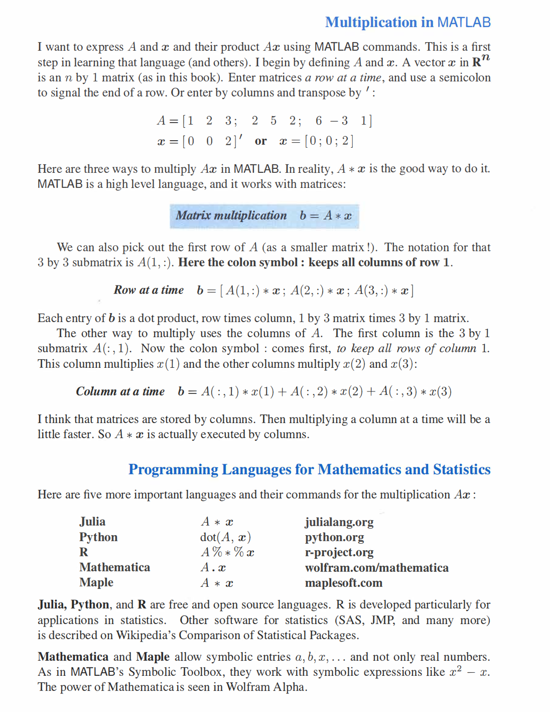

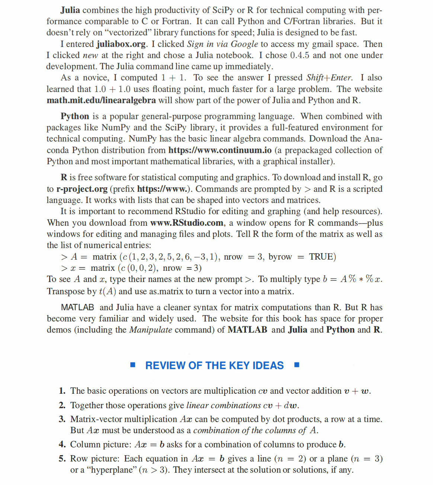

## Response:
已思考 18s

我可以使用几种方式计算Ax：比如使用矩阵乘法符号 \*，或通过行向量点积 A(i,:) \* x，列向量组合 A(:,1)\*x(1) + A(:,2)\*x(2)...。MATLAB采用列优先存储，可能会影响性能。还提到不同编程语言支持：Python、Julia、R等，涉及不同的内存布局与索引方式。

让我总结一些要点：首先，我需要阐明行/列切片的选择，说明在MATLAB中A(i,:)与A(:,i)的用法，列举点积的应用与矩阵乘法符号\*和.\*的区别，还要讨论Python中用于元素级运算和矩阵乘法的差异。此外，别忘了矩阵转置和形状问题，确保在1D数组和2D矩阵中的正确使用。

对于矩阵运算，我需要讲解MATLAB的冒号表示法：A(1,:)获取第一行所有列，A(:,1)获取第一列所有行；然后说明三种矩阵乘法方式及其代码：(1)标准矩阵乘法；(2)按行计算；(3)按列计算。此外，还要列出常见编程语言的相关命令并回顾基本概念，如线性组合和矩阵向量乘积等。

在矩阵乘法中，Ax=b要求通过列组合得出结果b。在行的角度，每个方程在Ax=b中表示的是一条直线、平面或更高维的超平面，它们相交。MATLAB和Python中需要小心元素级与矩阵级乘法的区别，尤其在处理1D数组时，推荐使用2D列向量进行矩阵乘法。

完成

用编程语言看懂  $Ax=b$ ：MATLAB/Julia/Python/R/Mathematica/Maple 的矩阵乘法
==============================================================

**概况**  
这两页把“**矩阵–向量乘法**”在工程软件里的落地方式讲清楚：

1.  在 **MATLAB** 里有三种“等价写法”：直接 `A*x`、逐行做**点积**、逐列做**线性组合**；并用冒号 `:` 选整行/整列。
2.  多种语言的对应语法：Julia、Python（NumPy）、R、Mathematica、Maple。
3.  最后总结“关键观念”：标量乘法与向量加法 → 线性组合；`Ax` 同时等价于“行点积/列组合”，并与“行图像/列图像”一一对应。

* * *

1\. MATLAB 中的三种“同一件事”的写法
------------------------

设

$$
A=\begin{bmatrix}1&2&3\\2&5&2\\6&-3&1\end{bmatrix},\qquad x=\begin{bmatrix}0\\0\\2\end{bmatrix},\qquad b=Ax.
$$

### 1.1 直接矩阵乘法（首选）

```matlab
A = [1 2 3; 2 5 2; 6 -3 1];   % 分号 ; 结束一行（按“行”输入矩阵）
x = [0 0 2]';                  % ' 转置成 3×1 列向量
b = A * x;                     % 矩阵乘法
```

> **读法**：`[ ... ; ... ; ... ]` 表示三行；`'` 把行向量转为列向量。结果 `b=[6;4;2]`。

### 1.2 **按行**计算：每行与  $x$  的点积（row picture）

核心是**冒号运算符** `:`：

*   `A(i,:)` 取第 `i` 行的**全部列**；
*   `A(:,j)` 取第 `j` 列的**全部行**。

```matlab
b = [ A(1,:) * x ;    % 第1行与x点积 → b1
      A(2,:) * x ;    % 第2行与x点积 → b2
      A(3,:) * x ];   % 第3行与x点积 → b3
```

这恰是三条方程  
 $(\text{row}_i)\cdot x=b_i$ 。

### 1.3 **按列**计算：列向量做线性组合（column picture）

```matlab
b = A(:,1)*x(1) + A(:,2)*x(2) + A(:,3)*x(3);
```

含义：用  $x$  的分量当权重，把三列  $a_1,a_2,a_3$  加权相加。  
在本例中  $x=(0,0,2)$  ⇒ `b = 2*A(:,3)`，一眼看出。

> **存储与性能**（作者的备注）：MATLAB 内部是**按列存储（column-major）**，因此“逐列组合”的实现通常更贴近底层（虽然你写 `A*x`，背后依然是对列的高效汇总）。同理 **Julia** 也是列主序；**NumPy** 默认行主序但能高效调用 BLAS——写对语义即可，不必手搓循环。

### 1.4 新手易错点（MATLAB）

*   `*` 是**矩阵乘法**；`.*` 是**对应元素乘法**。
*   行向量 `1×3` 与列向量 `3×1` 形状要匹配：`(1×3)*(3×1) → (1×1)`，`(3×3)*(3×1) → (3×1)`。
*   `x=[0 0 2]` 与 `x=[0 0 2]'` 含义不同（一个是 1×3，另一个是 3×1）。

* * *

2\. 多语言速查：怎么写  $b=A x$ 
-----------------------

| 语言 | 写法 | 说明/提示 |
| --- | --- | --- |
| **Julia** | `b = A * x` | 列主序；语义与 MATLAB 极像；`.*` 元素乘法。 |
| **Python/NumPy** | `b = A @ x` 或 `np.dot(A,x)` | `@/matmul` 是矩阵乘法；`*` 是元素乘法。注意 1D 与 2D 形状：`x = np.array([0,0,2])` 可以，若想列向量可用 `x.reshape(-1,1)`。 |
| **R** | `b = A %*% x` | `%*%` 为矩阵乘，`*` 为元素乘；`matrix(..., nrow=3, byrow=TRUE)` 按行填充。 |
| **Mathematica** | `b = A . x` | `.` 为点乘/矩阵乘；`{{...},{...}}` 建矩阵。 |
| **Maple** | `b := A . x` 或 `A &* x` | 依包而定；常见 `.` 或 `&*`。 |

> 小贴士  
> • Python 推荐装 **NumPy/SciPy**（或 **Anaconda** 套件），Julia 可直接用 REPL 或 Pluto/VSCode；R 建议配 **RStudio**。  
> • 语言下标：数学写法通常 1 开始；Python/Julia/R 索引从 1/1/1？注意：**Python 从 0 开始**，Julia/R 从 **1** 开始；MATLAB 从 **1** 开始。  
> • 统一心智：无论语法差异，`Ax` 始终等价于“**行点积**＝方程成立”与“**列组合**＝产生  $b$ ”两种表述。

* * *

3\. 快速复现书中的检验（拿解  $x=(0,0,2)$ ）
-------------------------------

*   **行法**（任意语言都可写成循环/切片）：  
     $(1,2,3)\cdot(0,0,2)=6$ ， $(2,5,2)\cdot(0,0,2)=4$ ， $(6,-3,1)\cdot(0,0,2)=2$ 。
*   **列法**： $b=0\,a_1+0\,a_2+2\,a_3=2a_3=(6,4,2)^\top$ 。

* * *

4\. 观点回顾（书末“REVIEW OF THE KEY IDEAS” 对应要点）
------------------------------------------

1.  **向量的两种基本运算**：标量乘法  $c\,v$  与向量加法  $v+w$ 。
2.  它们组合起来得到**线性组合**  $c\,v+d\,w$ （推广到多向量）。
3.  **矩阵–向量乘法**  $Ax$  可用“**行点积**”逐行算，也可用“**列组合**”逐列算；计算内容完全一致。
4.  **列图像**：方程  $Ax=b$  问的是“是否存在系数  $x$  使列向量线性组合等于  $b$ ”（即  $b\in\mathrm{Col}(A)$ ）。
5.  **行图像**：每一行给出一个约束——二维是直线，三维是平面，更高维是超平面；它们的交集就是解（若存在）。

* * *

5\. 进一步的工程建议
------------

*   **写法首选**：用语言原生的矩阵乘（`A*x`, `A@x`, `%*%`，`.`），这些都会调用底层 **BLAS/LAPACK**，远比手写循环快，也更数值稳定。
*   **调试心法**：
    *   若想检查方程是否逐行成立，打印 `A(i,:)*x`；
    *   若想检查列图像，打印线性组合 `sum_j A(:,j)*x(j)`；
    *   若结果形状不对，优先检查**维度/转置**与“矩阵乘 vs 元素乘”的符号。

* * *

本节总结
----

*   `Ax=b` 的程序世界翻译非常直接：**一个语句 `A*x`/`A@x`/`A %*% x`**。
*   任何实现都在做同样的 9 次乘法 + 6 次加法，只是表达方式不同。
*   把“行点积＝方程成立”“列组合＝产生  $b$ ”牢记在脑中，切换图像就能在纸上/代码里互证与排错。

* * *

报错/可读性
------

两张图片内容清晰，无缺页。若你需要，我可以：

*   给一个 **Python/NumPy** 与 **MATLAB** 的并行小脚本，演示三种写法数值一致；
*   或补充“列主序/行主序、转置与内存步长”对性能的影响的简明说明。

## Prompt:
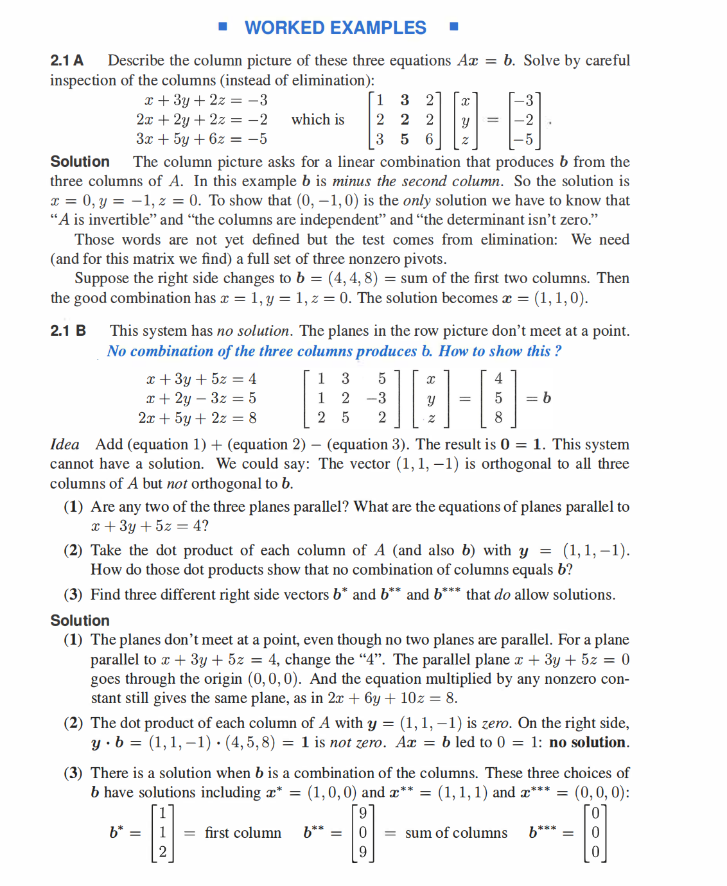

## Response:
已思考 44s

用户要求我用中文回应，并按全注释风格提供详细解答，包括标题、概述、每个点的详细解释和背景联系。他们提供了两个示例问题 2.1A 和 2.1B。针对线性方程组的问题，我解释了如何通过列图像解法来得到正确的解，即 x=0, y=-1, z=0。

通过理解矩阵A的可逆性、列线性独立性和行列式不为零，我们可以证明(0,-1,0)是唯一解。如果右侧变成b=(4,4,8)，则解为x=1, y=1, z=0。对于2.1B例子，系统无解，因为方程组的三个平面不相交，最后得到矛盾。

向量(1,1,-1)与A的三列正交，但不与b正交。接下来提出三个问题：

(1) 三个平面是否平行？问平面方程，x+3y+5z=4的平行平面是什么；  
(2) 求A的每列与y = (1, 1, -1)和b的点积，展示为何没有列的任何组合能得到b；  
(3) 找出三个不同的右边向量b\*, b\*\*, b\*\*\*，它们能有解。

方程乘以任何非零常数仍然表示相同的平面，如2x + 6y + 10z = 8。

接着，A的每列与y = (1, 1, -1)的点积为零，但y·b = (1, 1, -1)·(4, 5, 8) = 1，不为零，所以无法解。

当b是列的组合时，有解。比如b\* = 第一个列和b\*\* = 列和。

完成

例题精讲：用“列图像”秒解、有解与无解的一眼判定
========================

**概况**  
这页给了两个“Worked Examples”。核心练习的是：

*   如何**用列图像（列向量线性组合）直接读出解**，而不做消元；
*   如何**用一个“左零空间”证据**（一个向量同时垂直于所有列，却不垂直于  $b$ ）证明“无解”；
*   几何直觉：方程在三维是**平面**；三平面可能唯一交点、无交点、或一条交线。下面逐行拆解。

* * *

2.1A 只看“列”就能解： $b$  是哪几列的线性组合？
------------------------------

原方程组

$$
\begin{cases} x+3y+2z=-3\\ 2x+2y+2z=-2\\ 3x+5y+6z=-5 \end{cases} \quad\Longleftrightarrow\quad \begin{bmatrix} 1&3&2\\ 2&2&2\\ 3&5&6 \end{bmatrix} \!\!\begin{bmatrix}x\\y\\z\end{bmatrix} = \begin{bmatrix}-3\\-2\\-5\end{bmatrix}=b.
$$

把  $A$  的三列记为

$$
a_1=\!\begin{bmatrix}1\\2\\3\end{bmatrix},\quad a_2=\!\begin{bmatrix}3\\2\\5\end{bmatrix},\quad a_3=\!\begin{bmatrix}2\\2\\6\end{bmatrix}.
$$

**列图像**问的是：找到系数  $(x,y,z)$  使

$$
x\,a_1+y\,a_2+z\,a_3=b.
$$

### 观察一眼： $b=-a_2$ 

因为

$$
-a_2=\begin{bmatrix}-3\\-2\\-5\end{bmatrix}=b,
$$

立刻得

$$
(x,y,z)=(0,-1,0).
$$

### 为什么它是**唯一**解？

等价条件： $A$  可逆 ⇔ 列向量线性无关 ⇔ 三个主元/行列式  $\neq0$ 。  
快速验算

$$
\det(A)= 1(2\cdot6-2\cdot5)-3(2\cdot6-2\cdot3)+2(2\cdot5-2\cdot3) =2-18+8=-8\ne0.
$$

所以解唯一，就是  $(0,-1,0)$ 。

### 右端改变时怎么“读”

若  $b$  改为  $(4,4,8)^\top$ ，注意

$$
a_1+a_2=\begin{bmatrix}1\\2\\3\end{bmatrix}+\begin{bmatrix}3\\2\\5\end{bmatrix} =\begin{bmatrix}4\\4\\8\end{bmatrix}=b,
$$

于是  $(x,y,z)=(1,1,0)$ 。

> **总结一招**：能把  $b$  看成“几列的线性组合”，就能**不消元直接报答案**；列无关则答案唯一。

* * *

2.1B 这个系统**无解**：三平面不相交于一点
-------------------------

方程

$$
\begin{cases} x+3y+5z=4\\ x+2y-3z=5\\ 2x+5y+2z=8 \end{cases} \quad\Longleftrightarrow\quad A=\begin{bmatrix} 1&3&5\\ 1&2&-3\\ 2&5&2 \end{bmatrix},\quad b=\begin{bmatrix}4\\5\\8\end{bmatrix}.
$$

### 证据 1（行的线性组合给出矛盾）：

$$
\text{(方程1)}+\text{(方程2)}-\text{(方程3)}\ \Rightarrow\ 0=1.
$$

出现**矛盾**，因此**无解**。

### 证据 2（列空间的正交“证人”）：

取  $y=(1,1,-1)$ 。逐列点积：

$$
y\cdot a_1=1+1-2=0,\quad y\cdot a_2=3+2-5=0,\quad y\cdot a_3=5+(-3)-2=0.
$$

所以  $y$  **垂直于所有列**（ $A^\top y=0$ ，即  $y$  在  $A^\top$  的零空间）。  
若  $Ax=b$  有解，则两边同乘  $y^\top$  得  $0=y^\top b$ 。但

$$
y\cdot b=4+5-8=1\ne0,
$$

矛盾 ⇒ **无解**。

> 这给出一般结论：
> 
> $$
> b\in\mathrm{Col}(A)\ \Longleftrightarrow\ y^\top b=0\ \text{ 对所有 }y\in\mathrm{Null}(A^\top).
> $$
> 
> 这里找到了一个  $y$  使  $y^\top b\ne0$ ，就证明  $b\notin\mathrm{Col}(A)$ 。

### (1) 有平面彼此平行吗？

没有。三个法向量  
 $n_1=(1,3,5),\ n_2=(1,2,-3),\ n_3=(2,5,2)$   
两两都**不成比例** ⇒ 没有平行对。  
与   $\,x+3y+5z=4$  **平行**的平面都形如  $x+3y+5z=c$ （只改右端常数）。把等式乘非零常数代表**同一个**平面，如  $2x+6y+10z=8$  与第一式同平面。

### (2) 用点积解释“为什么无组合可得  $b$ ”

上面的  $y=(1,1,-1)$  使  $y^\top A=0$ 。若  $b$  是列的线性组合  $b=\sum c_j a_j$ ，则  
 $y^\top b=\sum c_j\, y^\top a_j=0$ 。  
但事实上  $y^\top b=1\ne0$ ，所以“不可能有那组  $c_j$ ”——无解。

### (3) 例出三个**有解**的右端  $b$ 

当  $b$  本身就在**列空间**里就有解，例如：

$$
b^{*}=a_1=\begin{bmatrix}1\\1\\2\end{bmatrix}\quad(\text{解 }x^{*}=(1,0,0)),
$$

$$
b^{**}=a_1+a_2+a_3=\begin{bmatrix}9\\0\\9\end{bmatrix}\quad(\text{解 }x^{**}=(1,1,1)),
$$

$$
b^{***}=0\quad(\text{解 }x^{***}=0).
$$

这三组都满足“ $b$  是列组合”。

* * *

把两题放在一起的“通关心法”
--------------

1.  **看列组合**：能把  $b$  直接拆成几列之和/差，就直接报解。
2.  **看证人  $y$ **：若能找  $A^\top y=0$  却使  $y^\top b\ne0$ ，立判**无解**。
3.  **几何直觉**：三式是三平面；解是三平面公共交点。无解可能是“三平面彼此不平行但并不共点”。
4.  **代数保障**： $\det(A)\ne0$  ⇒ 唯一解； $\det(A)=0$  ⇒ 可能无解或无穷多解，要看  $b$  是否在列空间。

* * *

小结
--

*   2.1A： $b=-a_2$  ⇒  $(x,y,z)=(0,-1,0)$ ，且  $\det(A)\ne0$  保证唯一。
*   2.1B：构造行的线性组合得  $0=1$ ，或找  $A^\top$  的零向量  $y$  使  $y^\top b\ne0$  ⇒ **无解**；并给出三组“有解”的  $b$  作为对照。

* * *

报错/可读性
------

图片内容清晰、信息完整；我已把每一步的运算（行列式、点积、列组合）展开。如果你想，我可以把 **“左零空间证人  $y$ ” 的一般求法**（用消元在  $A^\top$  上找）再写一段操作流程，或补一段 **Python/NumPy** 小脚本自动验证上述结论。

## Prompt:
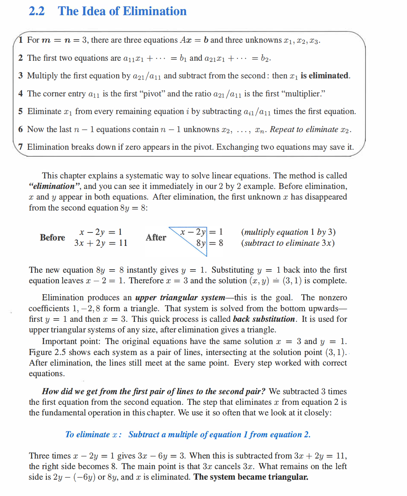

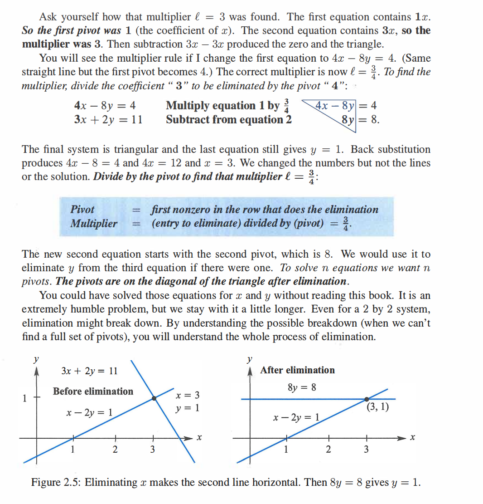

## Response:
已思考 18s

根据用户的要求，我需要用中文进行回应，并且详细地解释我接下来将给出的内容。我可以不使用工具，只需要逐步分析课程内容，特别是涉及消元法、主元法、乘数法、三角形系统、回代等内容，并结合一个2x2线性方程组的例子。

消元法从消去未知数开始，定义主元为a11，乘数l = a21/a11，再通过从第二行减去l倍的第一行来消去x。若主元为零可能会导致问题，需交换行。通过消元法，方程组转化为三角形系统，保留解。如有需要，附带Python代码实现样本。

消元法通过行变换将系统转化为上三角形，使用主元和乘数，最后进行回代。主元选择要确保稳定，几何上将两行系统转化为水平第二行，但不改变解的结果。详细步骤通过例题展示，包括行交换和特定操作。

消元后，系统变为三角形形式，接着进行回代。选择合适的乘数l，以满足消元步骤。通过例子展示当主元为4时，选择l = 3/4并执行消元步骤，最终得到水平化第二行。几何上，消元操作旋转坐标系，但不会改变解的交点。

完成

2.2 消元法的思想（Elimination / 高斯消元的第一性原理）
====================================

**概况**  
本节把“如何系统地求解线性方程组”讲清楚：用**行变换**逐个消掉变量，把  $Ax=b$  变成**上三角系统**（下面全是 0），再用**回代**从底往上求出未知量。关键概念是**主元（pivot）**与**乘子（multiplier）**：在第  $k$  步，用当前第  $k$  行的首个非零数作为主元  $a_{kk}$ ，对每一行  $i>k$  用

$$
\ell_{ik}=\frac{a_{ik}}{a_{kk}}
$$

去做  $R_i \leftarrow R_i-\ell_{ik}R_k$ ，就把第  $k$  列的下方条目全部消为 0。若主元为 0，就**换行（row exchange）**。

* * *

1\. 文字要点逐条对应（与书页 1–7 行一致）
-------------------------

1.  对  $m=n=3$  的系统  $Ax=b$ ，有三个未知  $x_1,x_2,x_3$ 。
2.  前两行是  
      $\ a_{11}x_1+\cdots=b_1$ ，  
      $\ a_{21}x_1+\cdots=b_2$ 。
3.  用**乘子**  $\ell=\dfrac{a_{21}}{a_{11}}$ ，做  $ \text{row}_2-\ell\,\text{row}_1$ ：这样**消掉  $x_1$ **。
4.  第一个**主元**是  $a_{11}$ ； $\ell=a_{21}/a_{11}$  是第一步的**乘子**。
5.  对所有  $i>1$  重复：用  $\ell_{i1}=a_{i1}/a_{11}$  做  $R_i\leftarrow R_i-\ell_{i1}R_1$ ，把第一列主元下面都清零。
6.  剩下的  $n-1$  行只含  $x_2,\dots,x_n$ 。对这个子系统再来一遍：选第二个主元  $a_{22}$ ，消掉它下面的所有项。
7.  若主元为 0（或很小导致数值不稳），**交换两行**通常能继续（数值计算里叫**选主元**）。

> 这整个过程把  $A$  化为上三角  $U$ ，随后做**回代**：先解最底行的  $x_n$ ，再解  $x_{n-1}$ ，直到  $x_1$ 。

* * *

2\. 2×2 示例：把“交两条线”变成“先求  $y$  再回代”
----------------------------------

原系统

$$
\begin{cases} x-2y=1\\ 3x+2y=11 \end{cases}
$$

**第一步消元**：用  $\ell=3$ （因为第二行的  $x$  系数是 3，第一行主元是 1）做

$$
R_2\leftarrow R_2-3R_1:\quad (3x+2y)-(3x-6y)=8y=8.
$$

于是得到**上三角系统**

$$
\begin{cases} x-2y=1\\ 8y=8 \end{cases} \Rightarrow y=1,\ x=3.
$$

这一步在图上把第二条线变成**水平线**  $8y=8$ ，解点  $(3,1)$  不变（行变换不会改变解集）。

* * *

3\. “乘子怎么来”的统一规则 & 一个变式
-----------------------

*   **统一规则**：
    $$
    \text{乘子}\ \ell=\frac{\text{要被消掉的条目}}{\text{当前主元}}=\frac{a_{i1}}{a_{11}}.
    $$
*   变式：若把第一行改成  $4x-8y=4$ ，则主元成了  $4$ ，乘子应为  $\ell=\tfrac{3}{4}$ 。  
    执行  $R_2\leftarrow R_2-\tfrac34 R_1$  仍得到  $8y=8$ 。
*   **记忆**：
    > Pivot = “这一行里用于消别人的第一个非零数”；  
    > Multiplier = “被消项 ÷ 该 pivot”。

**主元链**：三角化后，主元就躺在对角线上（第 1、2、… 步各一个）。要解  $n$  个方程“理想状况”就是能找到 ** $n$  个主元**。

* * *

4\. 几何直觉：为什么“消元”不改变解？
---------------------

行变换  $R_i\leftarrow R_i-\ell R_k$  把**一个方程**替换为“它与另一个方程的线性组合”，这**不会改变公共解集**（两条线/两个平面仍在同一点相交）。因此，消元只是把系统换成**等价**但**更易解**的形态。

* * *

5\. 一般 3×3（乃至  $n×n$ ）的标准流程（可直接照抄成代码）
-------------------------------------

**输入**：增广矩阵  $[A\mid b]$ 。  
**前向消元（Forward Elimination）**

```
for k = 1 : n-1
    选主元：若 a[k,k] = 0 → 交换到一行使 a[k,k] ≠ 0（部分选主元）
    for i = k+1 : n
        ℓ = a[i,k] / a[k,k]
        行 i ← 行 i − ℓ × 行 k      （同时更新右端 b[i]）
    end
end
```

得到上三角  $[U\mid \tilde b]$ 。  
**回代（Back Substitution）**

```
for i = n : −1 : 1
    x[i] = ( b[i] − Σ_{j=i+1..n} U[i,j] x[j] ) / U[i,i]
end
```

**失败/分支**（理解消元为何“可能坏掉”）：

*   若某一步整行化为  $[0\ 0\ \cdots\ 0 \mid c]$  且  $c\neq0$  ⇒ **矛盾** ⇒ 无解。
*   若整行化为  $[0\ 0\ \cdots\ 0 \mid 0]$  ⇒ **约束变少** ⇒ **无穷多解**（自由变量）。
*   数值运算中即便主元非零也可能很小，宜选**绝对值最大的主元**（部分选主元）来稳住误差，这也是实际  $LU$  分解里的  $P A = L U$ （有置换矩阵  $P$ ）。

* * *

6\. 与上一小节的衔接： $LU$  的影子
-----------------------

把所有“逆向的行操作”打包成下三角矩阵  $L$ （对角全 1，下面是乘子  $\ell_{ik}$ ），就有

$$
A = L\,U \quad(\text{或}\ P A = L U).
$$

以后我们会直接用  $LU$  解线性方程：先解  $Ly=b$ （前代），再解  $Ux=y$ （回代）。

* * *

7\. 小练（按本页思路）
-------------

对

$$
\begin{cases} 2x+y-z=1\\ 4x-6y= -2\\ -2x+7y+2z=9 \end{cases}
$$
*   第一步主元  $a_{11}=2$ ，乘子  $\ell_{21}=2,\ \ell_{31}=-1$ 。
*   消完第一列后，第二步主元是新  $a_{22}$ ，再消其下面。
*   若某步主元为 0，先换行再继续。  
    （你也可以把它写成增广矩阵做一遍演算，我可以帮你核对过程。）

* * *

8\. 本节小结
--------

*   **目的**：把  $Ax=b$  化成**上三角**再**回代**。
*   **关键词**：主元（每步的第一个非零）、乘子（被消项 ÷ 主元）、回代、行交换/选主元。
*   **几何**：行变换保持解集，图上看就是把第二条线“摆平”成  $8y=8$ 。
*   **工程**：算法可写作前向消元 + 回代；数值上用部分选主元更稳，并引出  $PA=LU$ 。

* * *

报错 / 可读性
--------

本次两页图片内容完整清楚，无缺失。若你希望，我可以：

*   把“带部分选主元的高斯消元”写成可直接运行的 **Python/NumPy** 版本并配上日志，或
*   给一个“从  $LU$  分解解线性方程”的最简代码/笔记做承接。

## Prompt:
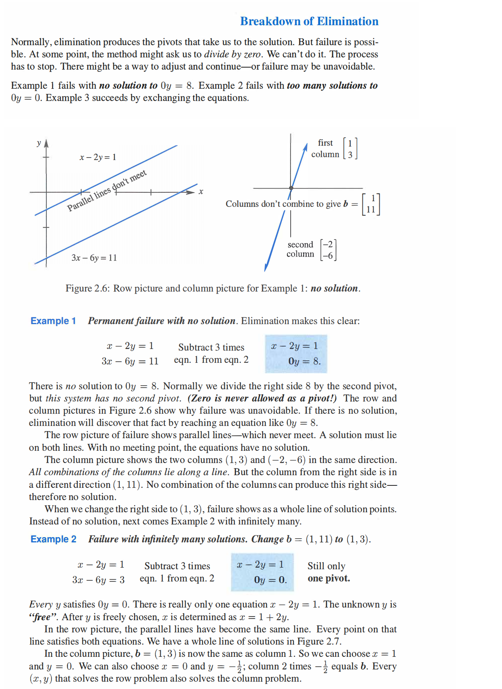

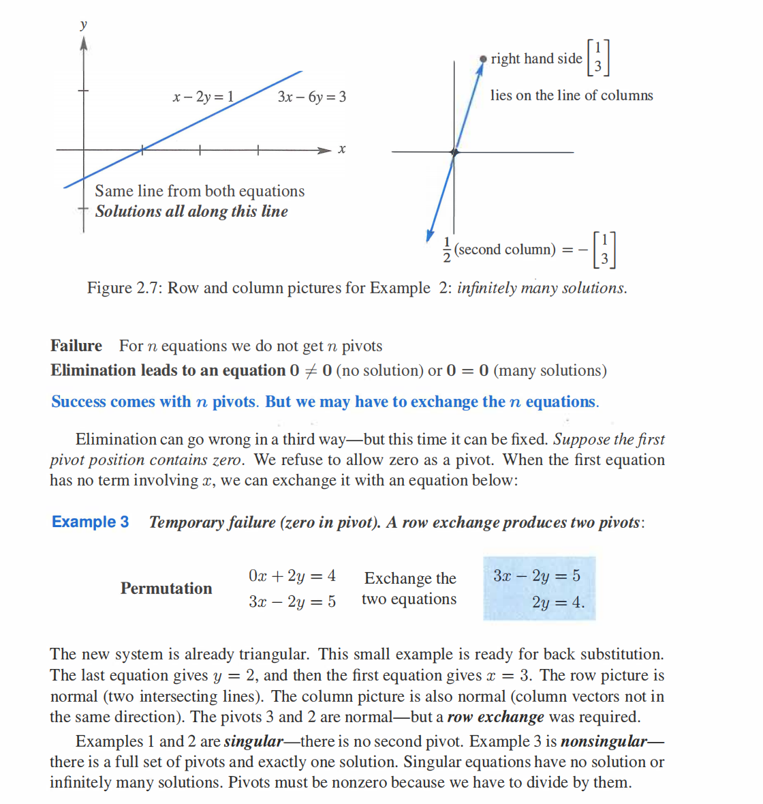

## Response:
2.2 消元法可能“失效”的三种情形（含三个例题全解析）
============================

**概况**  
消元（高斯消元）理想结果是得到 ** $n$ ** 个主元（pivots），把系统化为**上三角**并回代出唯一解。但在实际运算中会出现三类“失效”：

1.  **不相容（无解）**：化简出形如  $0=8$ （或  $0y=8$ ）。
2.  **欠定（无穷多解）**：化简出  $0=0$ （或  $0y=0$ ）。
3.  **临时失败（主元为 0）**：该步主元位置是 0；**换行**即可继续（必要时用选主元）。

这三类都能用**行图像**与**列图像**解释：行图像看“几何交点是否存在/唯一”，列图像看“ $b$  是否在列空间中”。

* * *

A. 例 1：**无解**（两条直线平行、列组合凑不出  $b$ ）
----------------------------------

$$
\begin{cases} x-2y=1,\\ 3x-6y=11. \end{cases}
$$

### 1) 消元过程

用乘子  $3$ ： $R_2\leftarrow R_2-3R_1\Rightarrow 0\cdot y=8$ 。  
出现 ** $0=8$ ** ⇒ **无解**（永远不能把 0 当主元去“除”出  $y$ ）。

### 2) 行／列图像解释

*   **行图像**：两条直线斜率相同、截距不同 ⇒ **平行不相交**。
*   **列图像**：两列  
      $\ a_1=\binom{1}{3},\ a_2=\binom{-2}{-6}$  共线，所有列组合 **都落在同一直线**；而右端  $b=\binom{1}{11}$  不在这条线上 ⇒ ** $b\notin\mathrm{Col}(A)$ ** ⇒ 无解。

> 小结：化简得到  $0\neq0$  ⇔  $\operatorname{rank}(A)<\operatorname{rank}([A\mid b])$  ⇔ 无解。

* * *

B. 例 2：**无穷多解**（两式同一直线、列组合能到  $b$  且主元不满）
-----------------------------------------

把右端改成  $b=\binom{1}{3}$ ：

$$
\begin{cases} x-2y=1,\\ 3x-6y=3. \end{cases}
$$

### 1) 消元过程

同样  $R_2-3R_1\Rightarrow 0\cdot y=0$ 。  
只剩 **一个主元** ⇒ 自由变量 1 个 ⇒ **无穷多解**。

### 2) 行／列图像解释

*   **行图像**：两式是**同一条直线**，整条线上点都解。
*   **列图像**：此时  $b=\binom{1}{3}=a_1$ 。  
    取  $x=1,y=0$  可；也可用第二列： $(-1/2)a_2=a_1\Rightarrow x=0,y=-\tfrac12$ 。  
    一般解：令  $y=t$ ，则  $x=1+2t$ 。

> 小结：化简得到  $0=0$  ⇔  $\operatorname{rank}(A)=\operatorname{rank}([A\mid b])<n$  ⇔ **无穷多解**；自由度  $=n-\operatorname{rank}(A)$ 。

* * *

C. 例 3：**临时失败**（主元为 0，用换行修复）
----------------------------

原系统（第一行没有  $x$  项）：

$$
\begin{cases} 0x+2y=4,\\ 3x-2y=5. \end{cases}
$$

第一步主元位置  $a_{11}=0$ ——**不能**用 0 当主元。

### 修复：交换两行（Permutation）

$$
\begin{cases} 3x-2y=5,\\ 2y=4 \end{cases} \Rightarrow y=2,\ x=3.
$$
*   **行图像**：两条相交直线，唯一交点  $(3,2)$ 。
*   **列图像**：列不共线，且  $b$  在列空间中。
*   **主元链**：这时主元为 3、2（两个都非零） ⇒ **非奇异（nonsingular）**，唯一解。

> 结论：**零主元≠无解**，它只是“临时失败”。通过**行交换/选主元**把非零条目移到主元位，就能继续消元。

* * *

D. 统一判定表（Rouché–Capelli / 秩判定，与主元个数等价）
--------------------------------------

| 情况 | 行化后出现 | 几何 | 代数条件 | 结论 |
| --- | --- | --- | --- | --- |
| 无解 |  $0=c\ (c\neq0)$  | 约束不相交（如平行） | (\\operatorname{rank}(A)<\\operatorname{rank}(\[A | b\])) |
| 无穷多解 |  $0=0$ （少主元） | 约束重合/欠定 | (\\operatorname{rank}(A)=\\operatorname{rank}(\[A | b\])<n) |
| 唯一解 | 得到  $n$  个主元 | 一点相交 |  $\operatorname{rank}(A)=n$ （ $A$  可逆） | 唯一解 |
| 临时失败 | 主元位置为 0 | — | 通过行交换找到非零主元 | 继续消元 |

* * *

E. 与“行/列图像”的快速心法
----------------

*   **行图像**：
    *   平行不相交 ⇒ 无解；
    *   同一直线/平面 ⇒ 无穷多解；
    *   一点相交 ⇒ 唯一解。
*   **列图像**：
    *    $\mathrm{Col}(A)$  是所有列组合形成的集合；
    *    $b\in\mathrm{Col}(A)$  才可能有解；
    *   列相关（少主元） ⇒ 组合“方向”不够 ⇒ 可能无穷多解或无解（看  $b$  是否落在该子空间）。

* * *

F. 关键句（书页总结的翻译）
---------------

*   **失败的信号**：没有拿到  $n$  个主元；化简到  $0\neq0$ （无解）或  $0=0$ （多解）。
*   **成功的信号**：获得  $n$  个主元；必要时通过**交换方程**实现。
*   **奇异（singular）**系统**没有第二个主元**（在 2×2 里），要么无解要么无穷多解；非奇异系统有满主元链并且**恰好一个解**。

* * *

本节小结
----

1.  消元真正“坏掉”的两种：** $0\neq0$ **（不相容）与\*\* $0=0$ \*\*（欠定）。
2.  **零主元**不是坏：**换行/选主元**可恢复。
3.  最稳妥的一线判据：比较  $\operatorname{rank}(A)$  与  $\operatorname{rank}([A|b])$ （或数主元个数）。
4.  行/列两幅图像提供了“为什么”的几何直觉：**交点 vs. 列空间**。

* * *

报错
--

这两张图片内容清晰、无缺漏。若你愿意，我可以再给出：

*   一个小的 **NumPy**/MATLAB 脚本，自动做行交换的部分选主元消元，并打印“出现  $0\neq0$ / $0=0$  的时刻”；
*   或者把上面的三个例题改写成“秩判定”和“零空间维数”的练习题并附参考答案。

## Prompt:
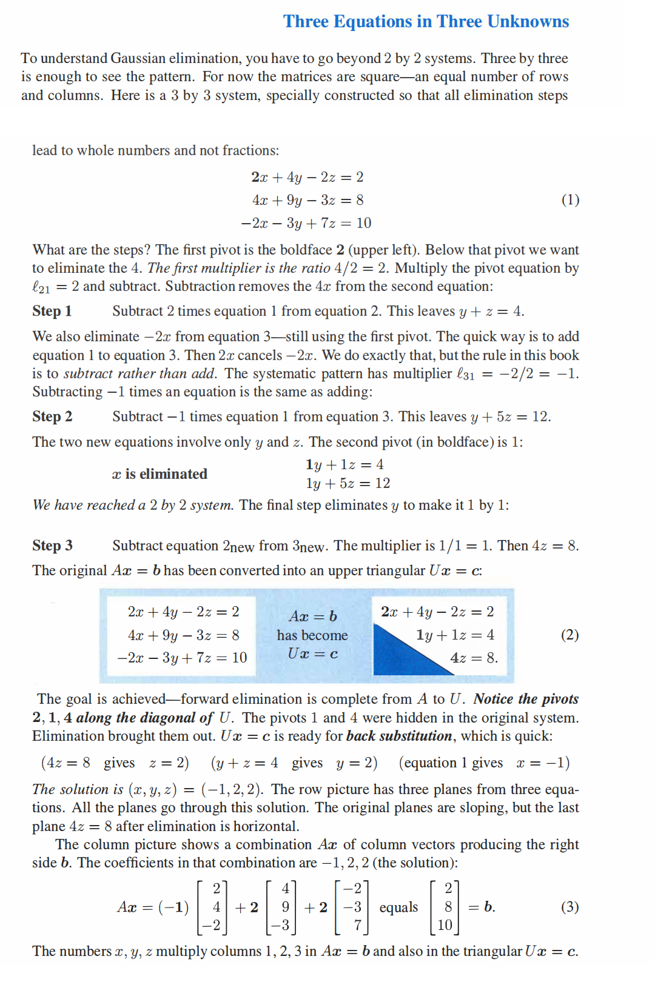

## Response:
已思考 47s

用户请求提供关于三元一次方程的详细笔记，包括逐步推导和分析。首先展示三对三的线性方程组，进行消元操作，逐步构造上三角形矩阵，最后通过回代求解解(-1,2,2)。提供详细的行列操作、主元、系数乘法等。

我已经进行了消元步骤：首先，使用l21 = 2从方程2中消去4x，结果得到y+z=4。接着，计算l31 = -1，从方程3中消去-2x，得到y+5z=12。接下来设定主元为a22 = 1，消去方程3中的y，最终得出上三角矩阵形式。

通过回代得到z=2，y=2，代入方程1求得x=-1。通过列的方式验证：\[-1, 2, 2\]乘以相应的列向量，结果为\[2, 8, 10\]^T，验证正确。接下来通过行图像展示，所有平面通过解点，强调消元过程揭示的主元2、1、4。

该页面没有明确提到LU分解，但我可以选项性展示消元矩阵产生U矩阵，并保持内容内涵一致。虽然LU分解在页面中未提及，但可以提到“LU的影像”并计算相关消元矩阵。例如，A矩阵经过消元步骤1，得到R2 <- R2 - 2R1，对应E21矩阵。

经过消元步骤，行列A变得更加对角化。我们从消元矩阵中提取出U矩阵，并指出行列式与LU分解的关系。注意，行列操作通过E进行变换，但并不改变未知数x的结果。此外，良好地展示如何通过L和U的乘积确保得到原始矩阵A。

完成

三元一次方程的消元法（完整走一遍 3×3 示例）
========================

**概况**  
这页用一个“精心构造”的 3×3 系统演示**高斯消元**的标准三步：以主元所在列为轴，消到**上三角**  $Ux=c$ ，随后**回代**出解。例子还刻意让乘子都是整数，避免分数，便于你把“主元—乘子—三角化”的模式记牢；并用行/列两种图像收尾。

* * *

1\. 原方程、主元与乘子
-------------

$$
\begin{cases} \mathbf{2}x+4y-2z=2\\ 4x+9y-3z=8\\ -2x-3y+7z=10 \end{cases} \quad\Longleftrightarrow\quad A=\!\begin{bmatrix}2&4&-2\\4&9&-3\\-2&-3&7\end{bmatrix},\ b=\!\begin{bmatrix}2\\8\\10\end{bmatrix}.
$$
*   **第1主元**  $a_{11}=\mathbf{2}$ 。  
    目标：消去第2、3行中的  $x$ 。
*   **乘子**（“被消项 ÷ 主元”）  
     $\ell_{21}=4/2=2$ ,   $\ \ell_{31}=-2/2=-1$ 。

### Step 1（用第1主元消第一列）

*    $R_2\leftarrow R_2-2R_1\Rightarrow$   $y+z=4$ （行变： $[0,1,1\mid4]$ ）。
*    $R_3\leftarrow R_3-(-1)R_1=R_3+R_1\Rightarrow$   $y+5z=12$ （ $[0,1,5\mid12]$ ）。

此时  $x$  已从下两行**被消掉**，得到关于  $y,z$  的  $2\times2$  子系统。

### Step 2（第二主元与消第三行的  $y$ ）

*   **第2主元**  $a_{22}=\mathbf{1}$ （来自新第2行的  $y$  系数）。
*   乘子  $\ell_{32}=1/1=1$ 。
*    $R_3\leftarrow R_3-R_2\Rightarrow 4z=8$ 。

### Step 3（完成上三角）

把结果整理成上三角  $Ux=c$ ：

$$
U=\begin{bmatrix}2&4&-2\\0&1&1\\0&0&4\end{bmatrix},\qquad c=\begin{bmatrix}2\\4\\8\end{bmatrix}.
$$

> 观察：**主元链**就在对角线上： $\boxed{2,\,1,\,4}$ 。原系统里 1 与 4 是“隐藏的”，消元把它们“显露”出来。

* * *

2\. 回代：自下而上解出  $x,y,z$ 
-----------------------

*   由  $4z=8\Rightarrow z=2$ 。
*   由  $y+z=4\Rightarrow y=2$ 。
*   代回第一行  $2x+4y-2z=2\Rightarrow 2x+8-4=2\Rightarrow x=-1$ 。

**唯一解**： $\boxed{(x,y,z)=(-1,2,2)}$ 。

* * *

3\. 列图像核对（线性组合 = 右端）
--------------------

把  $A$  的列记为

$$
a_1=\!\begin{bmatrix}2\\4\\-2\end{bmatrix},\ a_2=\!\begin{bmatrix}4\\9\\-3\end{bmatrix},\ a_3=\!\begin{bmatrix}-2\\-3\\7\end{bmatrix}.
$$

则

$$
(-1)a_1+2a_2+2a_3 =\begin{bmatrix}-2\\-4\\2\end{bmatrix} +\begin{bmatrix}8\\18\\-6\end{bmatrix} +\begin{bmatrix}-4\\-6\\14\end{bmatrix} =\begin{bmatrix}2\\8\\10\end{bmatrix}=b.
$$

这说明：**同一个  $x=(-1,2,2)$ ** 既是  $Ax=b$  的系数，也满足三角系统  $Ux=c$ ，因为

$$
Ux=(EA)x=E(Ax)=Eb=c
$$

（左乘的行变换  $E$  不改变“列的权重”  $x$ ）。

* * *

4\. 把步骤写成矩阵语言（LU 的影子）
---------------------

“用乘子消元”等价于左乘消元矩阵：

$$
E_{21}=\begin{bmatrix}1&0&0\\-2&1&0\\0&0&1\end{bmatrix},\quad E_{31}=\begin{bmatrix}1&0&0\\0&1&0\\1&0&1\end{bmatrix},\quad E_{32}=\begin{bmatrix}1&0&0\\0&1&0\\0&-1&1\end{bmatrix}.
$$

有   $\ U=E_{32}E_{31}E_{21}A$ ，  $\ c=E_{32}E_{31}E_{21}b$ 。  
把乘子收集成

$$
L=\begin{bmatrix}1&0&0\\ \ell_{21}&1&0\\ \ell_{31}&\ell_{32}&1\end{bmatrix} =\begin{bmatrix}1&0&0\\ 2&1&0\\ -1&1&1\end{bmatrix},
$$

可验算  $\boxed{A=LU}$ （这就是标准  $LU$  分解；若需要选主元则是  $PA=LU$ ）。

* * *

5\. 行/列图像的小结
------------

*   **行图像（平面）**：三条方程给三平面；消元后最后一式  $4z=8$  是**水平平面**（与  $xy$  面平行），三平面交于一点  $(-1,2,2)$ 。
*   **列图像（组合）**：右端  $b$  在  $\mathrm{Col}(A)$  中，且列独立（得到 3 个主元），因此**唯一解**。

* * *

6\. 记忆与迁移（3×3 →  $n×n$ ）
------------------------

*   **乘子公式**： $\ell_{ik}=a_{ik}/a_{kk}$ ；做  $R_i\leftarrow R_i-\ell_{ik}R_k$ 。
*   **成功判据**：拿到  $n$  个主元 ⇔  $\operatorname{rank}(A)=n$  ⇔ 可逆 ⇔ 唯一解。
*   **失败分支**：
    *   出现  $0\neq0$ ：无解；
    *   出现整行 0：多解（自由变量）；
    *   主元为 0：**换行/选主元**再继续。

* * *

7\. 本页要点速记
----------

*   本例的主元链与乘子：  $\ (2,1,4)$ ；  $\ \ell_{21}=2,\ \ell_{31}=-1,\ \ell_{32}=1$ 。
*   上三角系统：
    $$
    \begin{cases} 2x+4y-2z=2\\ y+z=4\\ 4z=8 \end{cases} \Rightarrow (x,y,z)=(-1,2,2).
    $$
*   同一个  $x$  同时解  $Ax=b$  与  $Ux=c$ ；列组合视角与消元视角统一。

* * *

报错/可读性
------

图片内容清晰、无缺页；所有数字与书页一致。若你想继续深入，我可以把这个例子写成 **可运行的 Python/NumPy 版**（同时打印每一步的  $L,U$ 、乘子与主元），或把“带选主元的  $PA=LU$ ”也一并演示。

## Prompt:
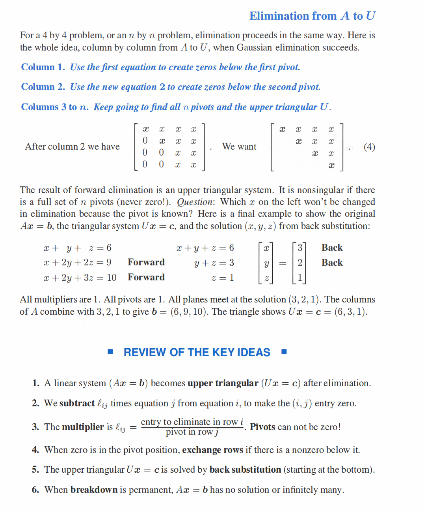

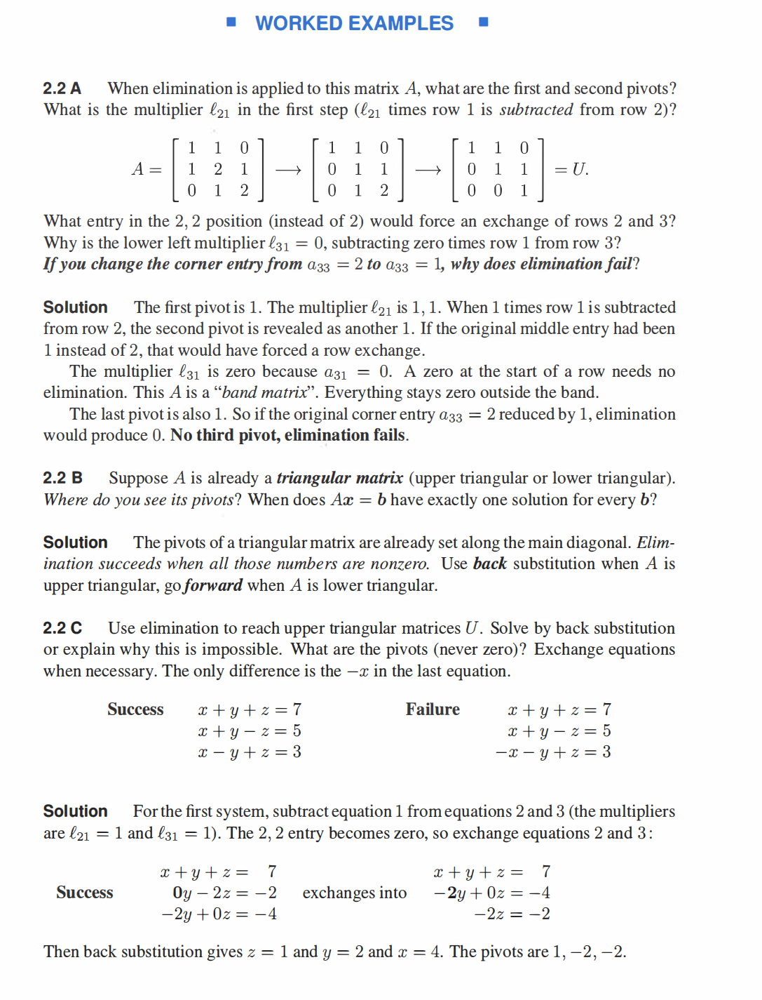

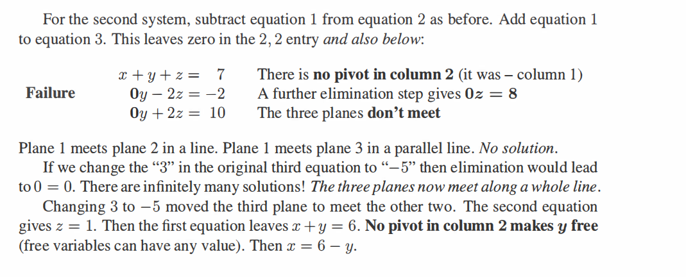

## Response:
已思考 28s

当矩阵A(2,2)为0时，必须交换行位置，因为无法进行消元。为什么第三行的乘数l31是0呢？因为a31=0。更改a33从2变为1时，为什么消元失败？因为第三次枢轴会是0，导致无法继续消元。对于三角矩阵，成功消元的前提是所有对角线元素非零。

给定成功系统和失败系统的比较，失败系统中最后一项的唯一差异是“-x”项。从成功系统开始，通过减去方程1与方程2以及方程1与方程3，可以逐步消元直到第二行第二列出现零。此时交换方程2与方程3确保枢轴非零，然后进行回代计算，最终得到解x=4, y=2, z=1。

在失败的线性方程组中，通过消元我们会得到0y - 2z = -2，并且将第一个方程与第三个方程相加，得到0x + 0y + 2z = 10，从而解得z=5。然而，系统中第二列并未找到枢轴。这里应该是由于x系数的负值导致了消元无效，使得枢轴丢失。

在进行消元后，得到0z = 8，意味着三条平面不会交于一点。具体步骤：首先从eq1减去eq2得到-2z = -2，然后将eq1与eq3相加，得到2z = 10。接着尝试用第二个枢轴消去z，结果得到0 = 8的矛盾，因此该系统无解。

完成

从  $A$  到  $U$  的消元：主元、乘子、成功与失效（含例题 2.2A–C）
===========================================

**概况**  
这一组页面把“把一般  $n\times n$  线性系统  $Ax=b$  变成上三角  $Ux=c$ ”的**前向消元**讲到位：

*   每一列依次选**主元**（pivot），用**乘子**  $\ell_{ij}=a_{ij}/a_{jj}$  把主元下方清零；
*   得到  $U$  后做**回代**求解；
*   什么时候会**失败**（无解、多解、零主元）以及如何通过**换行/选主元**修复；
*   三个“Worked Examples”把上述要点都压在数字里。

* * *

1\. 从  $A$  到  $U$ ：列 1 → 列 2 → … → 列  $n$ 
-------------------------------------------

**列 1**：用第 1 行的主元  $a_{11}$  消掉第 1 列下方所有条目。  
**列 2**：在新的第 2 行上选主元  $a_{22}$ ，消掉第 2 列下方条目。  
**列 3 到 n**：重复直到拿到\*\* $n$  个主元\*\*并得到上三角 ** $U$ **。

> 成功标志：主元全非零；失败标志：出现  $0\neq0$ （无解）或拿不到足够主元（多解），或某一步主元位置是 0（临时失败，需换行）。

把步骤用矩阵写就是

$$
E_{n-1}\cdots E_{2}E_{1}A=U,\qquad E_{n-1}\cdots E_{2}E_{1}b=c,
$$

于是**同一个解向量  $x$ ** 同时满足  $Ax=b$  和  $Ux=c$ （左乘同一个消元矩阵）。

* * *

2\. 演示例：所有乘子与主元都等于 1
--------------------

$$
\begin{cases} x+y+z=6\\ x+2y+2z=9\\ x+2y+3z=10 \end{cases} \quad\Rightarrow\quad \begin{aligned} \text{Forward: }&\text{(2)-(1)}\Rightarrow y+z=3,\\ &\text{(3)-(2)}\Rightarrow z=1.\\ \text{Back: }& z=1\Rightarrow y=2\Rightarrow x=3. \end{aligned}
$$

这里两步的乘子都是  $1$ ，三个主元也都是  $1$ 。  
**列图像核对**：三列按系数  $x,y,z=(3,2,1)$  线性组合得到  $b=(6,9,10)$ ；而三角化后的右端是  $c=(6,3,1)$ 。

* * *

3\. 关键观念回顾（与页末蓝框一致）
-------------------

1.   $Ax=b$  经过消元变成**上三角**  $Ux=c$ 。
2.  用乘子  $\ell_{ij}$ （“要消的条目 / 当前主元”）做  $R_i\leftarrow R_i-\ell_{ij}R_j$ 。
3.  **主元不能为 0**；为 0 就换行（选主元）。
4.   $Ux=c$  用**回代**自下而上求解。
5.  **永久性失效**：出现  $0=c\neq0$ （无解）或整行 0（多解）。
6.  **成功**：恰有  $n$  个主元（非零）⇔  $A$  可逆 ⇔ 每个  $b$  都有唯一解。

* * *

4\. Worked Examples
-------------------

### 2.2A 带状矩阵的消元与“最后一个主元”

$$
A= \begin{bmatrix} 1&1&0\\ 1&2&1\\ 0&1&2 \end{bmatrix} \ \xrightarrow{R_2\!-\!R_1}\ \begin{bmatrix} 1&1&0\\ 0&1&1\\ 0&1&2 \end{bmatrix} \ \xrightarrow{R_3\!-\!R_2}\ U= \begin{bmatrix} 1&1&0\\ 0&1&1\\ 0&0&1 \end{bmatrix}.
$$
*   **第 1、2 个主元**：都是 1；**乘子**  $\ell_{21}=1$ 。
*    $\ell_{31}=0$  因为  $a_{31}=0$ （第 3 行本就无  $x$ ）。
*   若把中间位置  $a_{22}$  改成 0，就**必须交换第 2、3 行**来得到非零主元。
*   **为何把  $a_{33}$  从 2 改成 1 会失败？**  
    第二步  $R_3-R_2$  会得到第三行全 0 —— **没有第 3 个主元** ⇒ 消元失败。

> 小结：带状矩阵（对角附近非零）在不破坏对角元素的前提下消元非常顺滑，最后一行的主元大小取决于前面一步是否“把它消没了”。

* * *

### 2.2B 三角矩阵的主元与何时“对所有  $b$ ”都有唯一解

*   **上三角**或**下三角**矩阵的**主元**就在主对角线上。
*   当且仅当所有对角元素非零，消元（或回代/前代）**必定成功**，且对每个  $b$  都有唯一解。
*   **上三角** → 直接回代；**下三角** → 先向前代（自上而下）。

* * *

### 2.2C 两个 3×3 系统：一次成功，一次失败

**成功版**

$$
\begin{cases} x+y+z=7\\ x+y-z=5\\ x-y+z=3 \end{cases}
$$
*   (2)-(1):  $-2z=-2\Rightarrow z=1$ 。
*   (3)-(1):  $-2y=-4\Rightarrow y=2$ 。
*   回代： $x=4$ 。
*   **主元**： $1,-2,-2$ （第二步需把“0 的 2,2 位置”与第三行互换一下，确保第 2 个主元非零）。

**失败版**（把最后一式换成  $-x-y+z=3$ ）

$$
\begin{cases} x+y+z=7\\ x+y-z=5\\ -x-y+z=3 \end{cases}
$$
*   (2)-(1):  $-2z=-2$ 。
*   (3)+(1):  $2z=10$ 。
*   用第二行作主元去消第三行： $R_3\leftarrow R_3-(-1)R_2\Rightarrow 0=8$  ⇒ **无解**（三平面不共点）。

> 变体：若把上面第三式常数 3 改为  $-5$ ，则会得到  $0=0$ （整行 0） ⇒ **无限多解**（三平面沿一条线相交）。这时第 2 列**没有主元**，使  $y$  成自由变量，通解  $x=6-y,\ z=1$ 。

* * *

5\. 几何与列空间的统一视角
---------------

*   **行图像**：主元满  $n$  → 三（ $n$ ）个超平面一般位置**一点相交**；  
     $0\neq0$  → 不相容（如平行/错位）；  
     $0=0$  → 多解（交线/交面）。
*   **列图像**：是否有解取决于  $b\in\mathrm{Col}(A)$ ；主元不足（列相关）时要看  $b$  是否落在该子空间里。

* * *

6\. 速记卡
-------

*   **乘子**： $\ell_{ij}=\dfrac{\text{要消的条目 }a_{ij}}{\text{当前主元 }a_{jj}}$ 。
*   **成功**：拿到  $n$  个非零主元（必要时**交换行**）；
*   **回代**从底向上；
*   **失败信号**： $0\neq0$ （无解）/ 整行 0（多解）/ 零主元（需换行）。

* * *

报错
--

本次三张图片内容清晰、数字可辨、无缺页。如你想继续，我可以把 2.2A–C 写成一个 **可运行的 Python/NumPy 脚本**，打印每一步的乘子、主元、行交换与最终  $L,U$  并自动判断“唯一解/无解/多解”。

## Prompt:
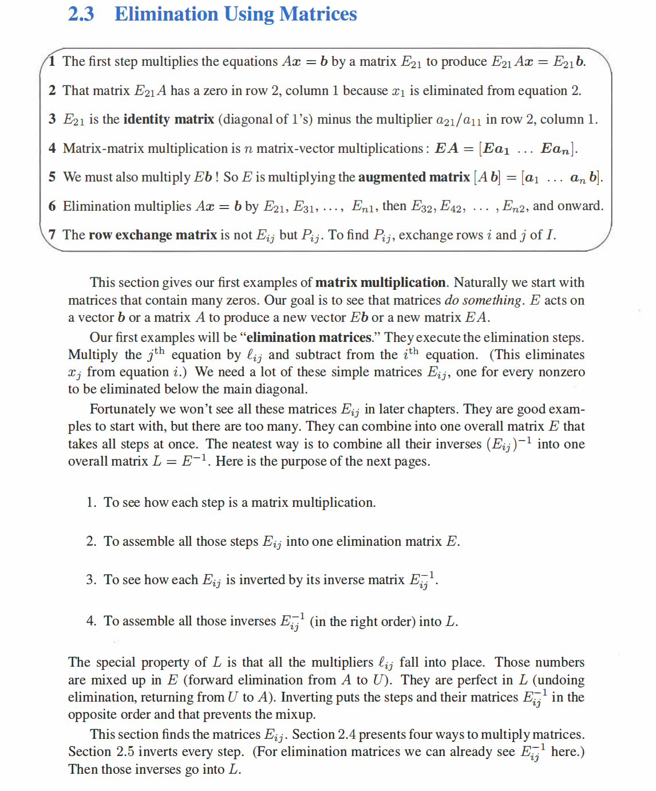

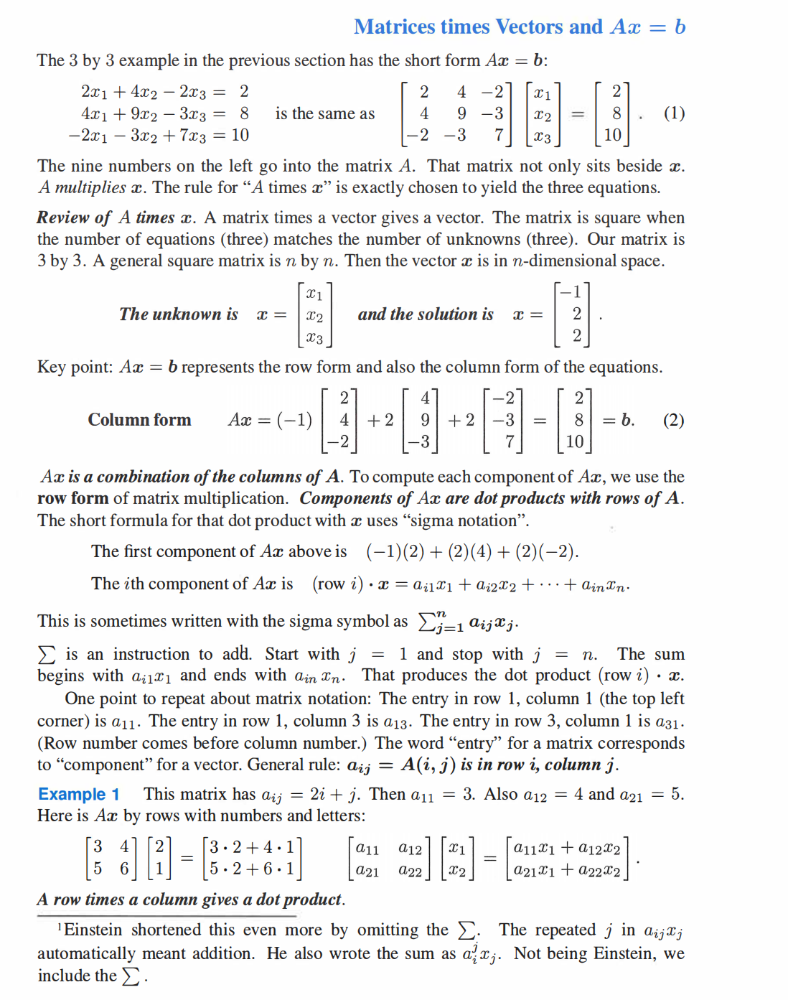

## Response:
已思考 20s

我在整合关于矩阵和向量的内容。通过逐步剖析高斯消元法，用矩阵表示为左乘的消元矩阵以及增广矩阵；还需要介绍行交换矩阵。在介绍过程中，我将提到 L = E^{-1} 和单位下三角矩阵。我们还要通过具体的例子展示如何计算矩阵与向量的乘积。

我们将展示如何用消元矩阵E\_{21} = I - ℓ\_{21} e\_{21}使得R2变为R2 - ℓ\_{21} R1。通过这种方法，E\_{21}A会使a\_{21}项为零。每个E\_{ij}矩阵都能将A(i, j)的位置变为零。乘以增广矩阵时，需要对b向量进行相同的行操作，最后将E的逆合成L。

完成

2.3 用矩阵做消元 + 矩阵乘向量（ $Ax=b$ ）
============================

**概况**  
本节把“高斯消元”完全翻译成**矩阵左乘**：每一步行操作都等价于用一个**消元矩阵**去乘  $A$ （以及同时乘右端  $b$ ）。把所有步骤的消元矩阵连乘，得到整体的  $E$ ，使  $EA=U$ （上三角）；把它们的**逆**连乘，则得到**单位下三角矩阵  $L$ **，满足  $A=LU$ （必要时还有置换矩阵  $P$ ： $PA=LU$ ）。随后回到矩阵乘法的两种等价视角：**行点积**与**列组合**，并用  $\Sigma$  记号与下标  $A(i,j)$  规范出写法。

* * *

一、用“矩阵左乘”表达消元（把行操作写成矩阵）
-----------------------

### 1）一步行操作 = 一个消元矩阵  $E_{ij}$ 

*   目标：用第  $j$  行消掉第  $i$  行的第  $j$  列条目  $a_{ij}$ 。
*   乘子  $\ell_{ij}=a_{ij}/a_{jj}$ 。
*   **矩阵形式**：
    $$
    E_{ij}=I-\ell_{ij}\,e_{ij}
    $$
    其中  $e_{ij}$  是在  $(i,j)$  位置为 1、其余为 0 的基矩阵。  
    左乘效果：
    $$
    E_{ij}A \quad\Longleftrightarrow\quad R_i\leftarrow R_i-\ell_{ij}R_j,
    $$
    把  $a_{ij}$  消成 0；同理 ** $E_{ij}b$ ** 同时更新右端（所以要对**增广矩阵**  $[A\ b]$  做同样的行操作）。

> 书上首步  $E_{21}$  就是“**单位矩阵**减去乘子写在  $(2,1)$  的那一格”。 $E_{21}A$  的  $(2,1)$  变成 0，说明  $x_1$  从第 2 行被消掉。

### 2）把所有步骤合成：从  $A$  到  $U$ 

*   顺序左乘： $E_{n,n-1}\cdots E_{32}E_{31}E_{21}\,A=U$ ，得到**上三角**。
*   同时： $E\,[A\ b]=[EA\ Eb]=[U\ c]$ 。
*   若主元位置为 0，需要**行交换矩阵  $P_{ij}$ **（把  $I$  的第  $i$ 、 $j$  行交换），使非零元素进入主元位： $P_{ij}A$  等价于交换方程  $i$  与  $j$ 。

### 3）把“所有步骤的**逆**”合成到  $L$ 

*   每个  $E_{ij}$  都是可逆的，且  $E_{ij}^{-1}=I+\ell_{ij}e_{ij}$ （把减法换成加法）。
*   把这些逆按**相反顺序**连乘：
    $$
    L \;=\; \big(E_{21}^{-1}E_{31}^{-1}\cdots E_{n,n-1}^{-1}\big),\qquad \boxed{A=LU}\ (\text{或 } PA=LU).
    $$
*   结构： $L$  是**单位下三角**，对角线全 1，下面的非零项就是各步**乘子  $\ell_{ij}$ **； $U$  是上三角。

> 直观： $E$  把  $A$  往前推到  $U$ ； $L=E^{-1}$  把  $U$  “拉回”到  $A$ 。因此**乘子“自然地坐在  $L$  里”**，而不会和别的步骤混淆。

* * *

二、矩阵乘向量与  $Ax=b$ ：行/列两种等价视角
---------------------------

用前页 3×3 例子：

$$
\begin{bmatrix} 2&4&-2\\ 4&9&-3\\ -2&-3&7 \end{bmatrix} \!\!\begin{bmatrix}x_1\\x_2\\x_3\end{bmatrix} = \begin{bmatrix}2\\8\\10\end{bmatrix}, \quad\text{其解 }x=\begin{bmatrix}-1\\2\\2\end{bmatrix}.
$$

### 1）**列图像**（列的线性组合）

$$
Ax=\;x_1\,A(:,1)+x_2\,A(:,2)+x_3\,A(:,3)\;=\;b.
$$

本例： $(-1)a_1+2a_2+2a_3=b$ 。

### 2）**行图像**（行与  $x$  的点积）

$$
(Ax)_i=\text{row}_i\cdot x=\sum_{j=1}^{n}A(i,j)\,x_j,
$$

这就是第  $i$  条方程。  
** $\Sigma$  记号**：  $\ (Ax)_i=\sum_{j=1}^n a_{ij}x_j$ 。  
**下标规范**： $a_{ij}=A(i,j)$  表示“**第  $i$  行第  $j$  列**”的条目。

### 3）迷你例（书中 Example 1 的意思）

设  $A=\begin{bmatrix}3&4\\5&6\end{bmatrix},\ x=\begin{bmatrix}2\\1\end{bmatrix}$ 。

*   行法： $(Ax)_1=3\cdot2+4\cdot1=10,\ (Ax)_2=5\cdot2+6\cdot1=16$ 。
*   列法： $2\,[3,5]^\top+1\,[4,6]^\top=[10,16]^\top$ 。  
    两种算法完全一致。

* * *

三、把两部分连起来： $EA=U$ 、 $Eb=c$ 、回代
------------------------------

*   **消元**：连乘消元矩阵  $E$  得  $EA=U$ ，同时  $Eb=c$ 。
*   **回代**：解  $Ux=c$ （自下而上）。
*   **LU 求解**：若  $PA=LU$ ，先解  $Ly=Pb$ （前代），再解  $Ux=y$ （回代）。
*   **几何/代数统一**：
    *   行图像 → 上三角后最后一行往往是一维约束（如  $4z=8$ ），解读更直接；
    *   列图像 → 不变的是**系数  $x$ **：同一个  $x$  既使  $Ax=b$ ，也使  $Ux=c$ 。

* * *

四、微型“工具箱”与常见坑
-------------

*   **增广矩阵同步操作**：任何行操作都要同时作用在  $[A\ b]$  上（即乘  $E$  的同时乘  $b$ ）。
*   **置换矩阵  $P$ **：遇零/很小主元，用  $P$  交换行（数值上叫**选主元**），避免除以 0/放大误差。
*   **可逆与主元**：拿到  $n$  个非零主元 ⇔  $A$  可逆 ⇔ 对每个  $b$  唯一解。
*   **失败判据**：
    *   行化出  $[0\ \cdots\ 0\mid c\neq0]$ ：无解；
    *   行化出整行 0：多解（自由变量）。

* * *

五、要点回顾（与页末“REVIEW”对应）
---------------------

1.   $Ax=b$  经过消元变成**上三角**  $Ux=c$ 。
2.   $\ell_{ij}=\dfrac{\text{要消的 }a_{ij}}{\text{主元 }a_{jj}}$ ，做  $R_i\leftarrow R_i-\ell_{ij}R_j$ 。
3.  **主元不可为 0**；为 0 就**交换行**。
4.   $Ux=c$  用**回代**从底向上解。
5.  **永久性失效**对应无解/多解；**临时失效**（零主元）可通过换行修复。
6.   $E$  合成前向消元；把  $E_{ij}^{-1}$  反序合成得到  $L$ ，从而  $A=LU$ （或  $PA=LU$ ）。

* * *

本节小结
----

*   **思想**：消元是**矩阵左乘**；列图像与行图像由同一个  $Ax$  统一。
*   **结构**： $EA=U,\ Eb=c$ ；或  $PA=LU$ 。 $L$  收纳乘子、对角 1； $U$  上三角存主元链。
*   **计算**：回代或前代+回代；必要时选主元。
*   **表达**：行点积  $(Ax)_i=\sum_j a_{ij}x_j$  与列组合  $Ax=\sum_j x_jA(:,j)$  完全等价。

* * *

报错
--

本次两页图片内容清晰、无缺失。我已把每条编号（1–7）和示例全部展开。如果你希望，我可以：

*   把一个 3×3 的完整  $PA=LU$  分解与求解写成可运行的 **NumPy** 代码（打印每一步的  $E_{ij},L,U,P$ ）；
*   或给一页“行操作 ↔ 消元矩阵”对照速记卡（含常见  $E_{ij}$  的形式与逆）。

## Prompt:
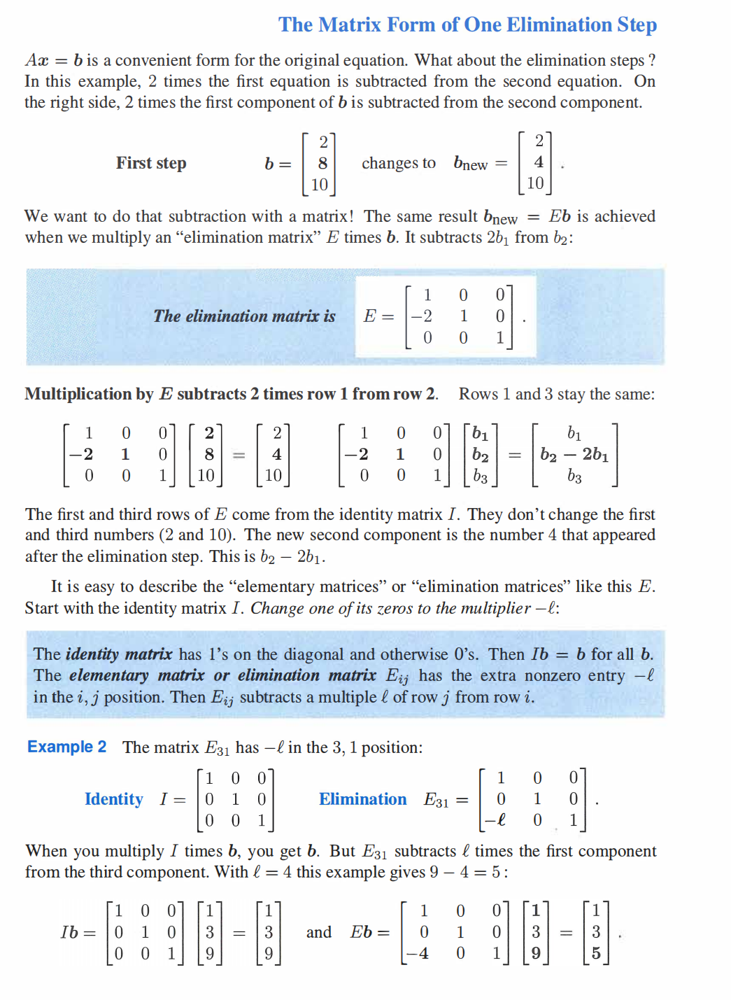

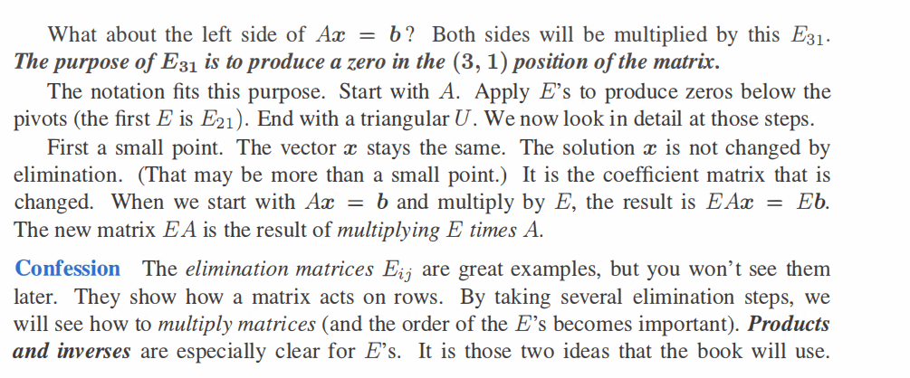

## Response:
用“矩阵”执行一次消元：消元矩阵  $E_{ij}$  的来龙去脉
=================================

**概况**  
本页把“把第  $j$  行的若干倍减到第  $i$  行上”这一步行操作，用一个**矩阵左乘**来完成。这个矩阵叫**消元矩阵 / 初等矩阵**  $E_{ij}$ 。它既要作用在  $A$  上把某个元素消成 0（做出上三角），也要**同步**作用在右端  $b$  上（等价于对增广矩阵  $[A\ b]$  做同样行操作），从而保持解不变：

$$
EAx = Eb \quad (\text{同一个 }x) .
$$

* * *

1\. 从“在  $b$  上做一次消元”入手
-----------------------

书上例子：把右端

$$
b=\begin{bmatrix}2\\8\\10\end{bmatrix}
$$

进行“**用第1个分量的 2 倍减到第2个分量**”的操作，得到

$$
b_{\text{new}}=\begin{bmatrix}2\\4\\10\end{bmatrix}.
$$

这一步可以由一个矩阵  $E$  来完成： $b_{\text{new}}=Eb$ ，其中

$$
E=\begin{bmatrix} 1&0&0\\ -2&1&0\\ 0&0&1 \end{bmatrix}.
$$

直观地看：第一、三行就是单位矩阵的行，不变；第二行在第(2,1)位置放了  $-2$ ，表示“**第2行  $\leftarrow$  第2行  $-$   $2\times$  第1行**”。

> **规则**（背下来）：  
> 从单位矩阵  $I$  出发，把位置  $(i,j)$  的 0 改成  $-\ell$ ，得到
> 
> $$
> E_{ij}=I-\ell\,e_{ij}\qquad(\ell=\text{乘子}).
> $$
> 
> 则左乘  $E_{ij}$  就把“第  $j$  行的  $\ell$  倍减到第  $i$  行”。

**验证**（对一般  $b=[b_1,b_2,b_3]^T$ ）：

$$
E b= \begin{bmatrix} b_1\\ b_2-2b_1\\ b_3 \end{bmatrix},
$$

与“ $b_2\leftarrow b_2-2b_1$ ”一致。

* * *

2\. 例2： $E_{31}$  把“第1行的  $\ell$  倍减到第3行”
-----------------------------------------

取

$$
I=\begin{bmatrix}1&0&0\\0&1&0\\0&0&1\end{bmatrix},\quad E_{31}=\begin{bmatrix}1&0&0\\0&1&0\\-\ell&0&1\end{bmatrix}.
$$

当  $\ell=4$  且  $b=[1,3,9]^T$  时，

$$
E_{31}b= \begin{bmatrix}1\\3\\9-4\cdot1\end{bmatrix} = \begin{bmatrix}1\\3\\5\end{bmatrix}.
$$

**一句话**：在向量的第3个分量上，做了“   $\;b_3\leftarrow b_3-\ell b_1\;$ ”。

* * *

3\. 为什么要同时乘  $A$ ？——把  $Ax=b$  改写成  $EAx=Eb$ 
---------------------------------------------

消元不是只改右端；我们要把**矩阵里主元下方的元素消成 0**。这就需要同一个  $E$  去左乘  $A$ ：

$$
EA=\text{对 }A\text{做同样的行操作（第 }i\text{ 行 }-\ell\times\text{第 }j\text{ 行）}.
$$

于是

$$
Ax=b\ \Longleftrightarrow\ (EA)x=E b.
$$

**解向量  $x$  不变**，变的是“系数矩阵”与“右端”。一连串的  $E$  把  $A$  推到上三角  $U$ ：

$$
E_k\cdots E_2E_1A=U,\qquad E_k\cdots E_2E_1b=c,
$$

最后解  $Ux=c$  做回代即可。

> **目的语**：像  $E_{31}$  这样的矩阵，其“任务”是把  $A$  的  $(3,1)$  位置变为 0（在第1个主元下面做消元）。

* * *

4\. 消元矩阵的族谱： $E$ 、 $P$  与逆
--------------------------

*   **消元矩阵  $E_{ij}$ **：行加减操作（不改主元所在行的对角 1）。
*   **行交换矩阵  $P_{ij}$ **：从单位矩阵换两行得到；用于“主元为 0”时把**非零**条目换上来（数值上也是保障稳定性的选主元）。
*   **逆矩阵**： $E_{ij}^{-1}=I+\ell e_{ij}$ （把“减  $\ell$ ”换成“加  $\ell$ ”）；把所有  $E_{ij}^{-1}$  **按相反顺序**相乘，得到
    $$
    L=E_{1}^{-1}E_{2}^{-1}\cdots E_{k}^{-1},\qquad \boxed{A=LU}\ (\text{必要时 }PA=LU).
    $$
    这解释了为什么 ** $L$  的对角是 1、对角线下方正好是各步乘子  $\ell$ **。

> 书上的“坦白”点： $E_{ij}$  很有教学价值，但种类太多；后续更常直接用“矩阵乘法规则”和“逆矩阵”来统一描述过程（特别清楚的一类就是这些  $E$ ）。

* * *

5\. 一步到位的“操作—矩阵”速查
------------------

*   **把第  $j$  行的  $\ell$  倍加到第  $i$  行**：  
     $E_{ij}=I+ \ell e_{ij}$ （若是**减**，改成  $I-\ell e_{ij}$ ）。
*   **交换第  $i$ 、 $j$  行**：置换矩阵  $P_{ij}$ （把  $I$  的两行对调）。
*   **作用对象**：同一个矩阵要同时左乘  $A$  和  $b$ ，等价于对**增广矩阵**  $[A\ b]$  做行操作。

* * *

6\. 与前文衔接：列图像与“同一个  $x$ ”
-------------------------

尽管  $A$  被变成了  $U$ ，但**产生  $b$  的那组列系数  $x$ ** 没变：

$$
Ax=b \;\Rightarrow\; Ux=c \quad (\text{左乘同一个 }E),
$$

所以“列图像（列的线性组合得到右端）”在消元过程中始终是同一组权重  $x$ 。

* * *

7\. 小练（立即能做）
------------

1.  构造把“第2行减去  $3$  倍第1行”的矩阵  $E_{21}$ 。验证它对任意  $b$  与  $A$  的作用。
2.  给出把“第3行与第2行交换”的置换矩阵  $P_{32}$ ，并验证  $P_{32}^{-1}=P_{32}$ 。
3.  若用  $E_{32}$  使  $(3,2)$  变 0，乘子应取多少？（答： $\ell=a_{32}/a_{22}$ ；然后  $R_3\leftarrow R_3-\ell R_2$ 。）

* * *

本页小结
----

*   **一次行操作 = 一个消元矩阵左乘**；在  $(i,j)$  放  $-\ell$  表示“第  $i$  行  $-\ell$  倍第  $j$  行”。
*   **同时乘  $A$  与  $b$ **：变的是系数矩阵与右端，不变的是**解向量  $x$ **。
*   一串  $E$  把  $A$  推到  $U$ ；把这些  $E$  的**逆**合并得到  $L$ ，于是  $A=LU$ （或  $PA=LU$ ）。
*   置换矩阵  $P$  处理零主元/选主元；这是“临时失败”的标准修复。

* * *

报错
--

图片文字与公式清晰可辨，无残缺。若你希望，我可以把**从  $E_{21}$ 、 $E_{31}$  到  $U$  的完整乘法**写成一段可运行的 Python/NumPy 代码，逐步打印  $[A\ b]$  的变化，并输出  $L,U,P$ 。

## Prompt:
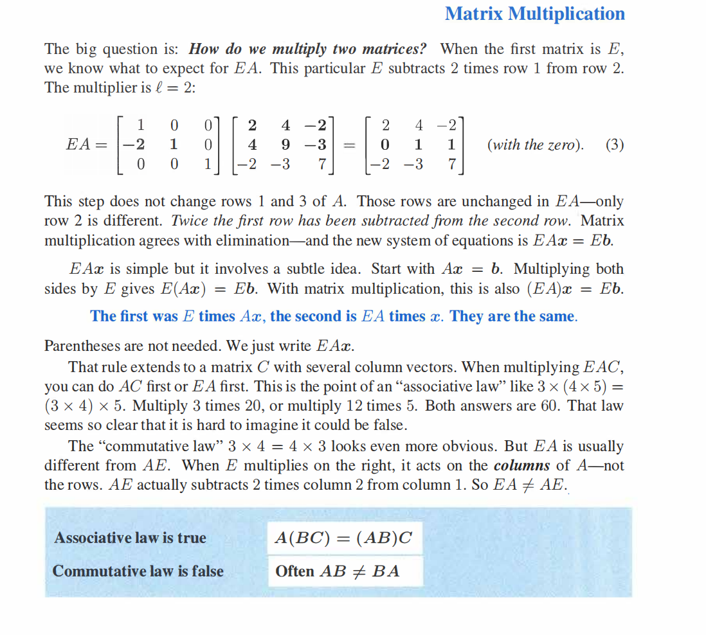

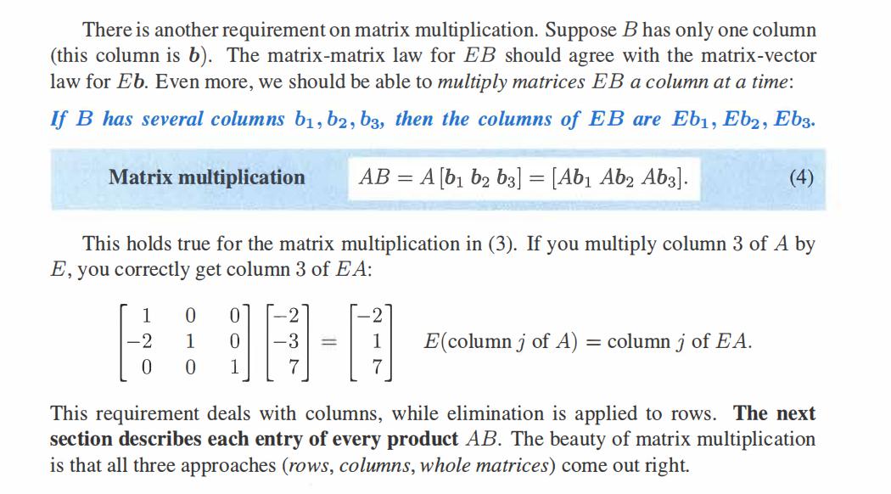

## Response:
已思考 20s

I'm handling a multiplication of matrix E with matrix A. The second row of A changes because 2 times row 1 is subtracted from row 2. The rest stay unaffected. When multiplying on the right, it acts on columns, so AE applies this rule by subtracting 2 times column 2 from column 1.

When E multiplies on the left, it subtracts 2 times row 1 from row 2. On the right, E acts on columns: column 1 becomes column 1 minus 2 times column 2. So in AE, the effect is that each column of A gets modified accordingly. Specifically, AE = A + AN, where N is the adjustment.

Multiplying by N = -2e\_{21} shifts column 1 into column 2. e\_{21}, when multiplied on the right, swaps column 1 into column 2's position while setting all other columns to zero. Essentially, multiplying A by e\_{ij} replicates column i into column j and zeroes the others.

For E = I + αe\_{ij}, multiplying A by E results in AE = A + αA e\_{ij}. A e\_{ij} places column i of A at column j while setting all other columns to zero. By adding α times this result, we modify column j by adding α times column i to it. For α = -2, this means column 1 gets modified by subtracting 2 times column 2.

完成

矩阵乘法与消元： $EA$ 、 $E(Ax)=(EA)x=Eb$ ，结合律与“按列法则”
============================================

**概况**  
这一页把“**如何相乘两个矩阵**”讲清楚，并把它与消元矩阵  $E$  的作用统一起来：

*   左乘  $E$  对**行**做事： $EA$  等于“用第1行的两倍减到第2行”等行操作；同理  $Eb$  对右端做同样操作。
*    $E(Ax)=(EA)x=Eb$ （结合律成立），因此常简写成  $EAx$ 。
*   右乘  $E$  则改**列**： $AE$  把“第2列的   $\,2\,$  倍减到第1列”。这解释了为什么一般  $EA\neq AE$ （乘法**不交换**）。
*   **按列法则**：若  $B=[b_1\ b_2\ b_3]$ ，则  $AB=[Ab_1\ Ab_2\ Ab_3]$ 。这与“ $E$  逐列乘  $A$ ”完全一致： $(EA)_{:,j}=E(A_{:,j})$ 。

* * *

1\. 例：消元矩阵左乘等于“对行做消元”
---------------------

取

$$
E=\begin{bmatrix}1&0&0\\[2pt]-2&1&0\\[2pt]0&0&1\end{bmatrix},\qquad A=\begin{bmatrix}2&4&-2\\[2pt]4&9&-3\\[2pt]-2&-3&7\end{bmatrix}.
$$

计算

$$
EA= \begin{bmatrix} 2&4&-2\\ 0&1&1\\ -2&-3&7 \end{bmatrix}.
$$

解释：左乘  $E$  等价于**第二行  $\leftarrow$  第二行  $-$  2×第一行**；第1、3行保持不变，所以只把  $(2,1)$  消成 0，并把第二行其它位置同步更新为  $1,1$ 。

同理，对右端  $b$  也必须做同样操作：

$$
Ax=b\ \Longleftrightarrow\ (EA)x=Eb.
$$

这保证了“换了等价方程组但解  $x$  **不变**”。

* * *

2\. 结合律为何让我们写成  $EAx$ 
----------------------

从  $Ax=b$  出发，左乘  $E$ ：

$$
E(Ax)=Eb.
$$

由于**结合律**（associative law）成立，

$$
E(Ax)=(EA)x,
$$

所以括号可省，记作  $EAx$ 。**注意**：这不是说“可随便换顺序”，而是说**先后分组**可变；真正的**顺序**不能换。

*   结合律 **真**： $A(BC)=(AB)C$ 。
*   交换律 **假**：一般  $AB\ne BA$ 。

* * *

3\. 为什么  $EA\neq AE$ ：右乘会改“列”
-----------------------------

继续用上面的  $E$ 。右乘  $E$  的效果是**对列做初等列变换**：

$$
AE=A(I-2\,e_{21})=A-2A e_{21}.
$$

而  $A e_{21}$  是“把 **第2列** 复制到 **第1列** 的位置、其他列为0”的矩阵，于是

$$
AE:\ \text{第1列}\leftarrow\text{第1列}-2\times\text{第2列},\quad \text{其余列不变}.
$$

所以左乘（改行）与右乘（改列）通常给出**不同结果**： $EA\neq AE$ 。

* * *

4\. 按列法则：矩阵乘矩阵 = 按列逐个乘
----------------------

若  $B=[b_1\ b_2\ b_3]$ （多列），则

$$
\boxed{\,AB=[Ab_1\ Ab_2\ Ab_3]\,}.
$$

这与“矩阵乘向量”的规则一致，只是**把每一列当作一个向量**分别相乘再并排放回去。

把它套到消元矩阵上：左乘  $E$  时，

$$
(EA)_{:,j}=E\big(A_{:,j}\big)\quad(\forall j).
$$

例如用上面的  $E$  乘  $A$  的第3列   $\,[-2,-3,7]^T$ ：

$$
E\!\begin{bmatrix}-2\\-3\\7\end{bmatrix} =\begin{bmatrix}-2\\1\\7\end{bmatrix} =\text{EA 的第3列}.
$$

这验证了“**乘积的列 = 左矩阵 × 原列**”。

* * *

5\. 三种视角对齐：行、列、整体
-----------------

*   **按行视角**（消元）： $EA$  等于“对行做线性组合”，与高斯消元完全一致。
*   **按列视角**（列法则）： $AB$  的第  $j$  列就是  $A$  乘  $B$  的第  $j$  列；这让我们能“逐列构造”乘积。
*   **整体视角**（结合律）： $(EA)x=E(Ax)$ ；因此把“先矩阵乘矩阵，再乘向量”的两步写成一个  $EAx$  没问题，但**顺序**（左/右）绝不能随意互换。

* * *

6\. 小结与拿分点
----------

*   **左乘  $E$ **：对**行**做初等变换；与消元同义。
*   **右乘  $E$ **：对**列**做初等变换；因此一般  $EA\neq AE$ （交换律不成立）。
*   **结合律成立**： $E(Ax)=(EA)x\Rightarrow EAx$  的写法合法。
*   **按列法则**： $AB=[Ab_1\ Ab_2\ \cdots]$ ；特别地， $(EA)_{:,j}=E(A_{:,j})$ 。
*   这些规则把“消元”“矩阵乘向量”“矩阵乘矩阵”统一在一套语法里：**行改由左乘、列改由右乘**。

* * *

报错
--

两张图片内容清晰、数字可辨，无缺失。若你想要，我可以再补：

*   一个极小的数值例子，直接算  $EA$  与  $AE$  的数值并比较；
*   或者把“按列法则”和“结合律”写成 NumPy 演示脚本（`EA@x` 与 `E@(A@x)` 的一致性、`A@(B[:,j])` 拼回 `A@B` 的一致性）。

## Prompt:
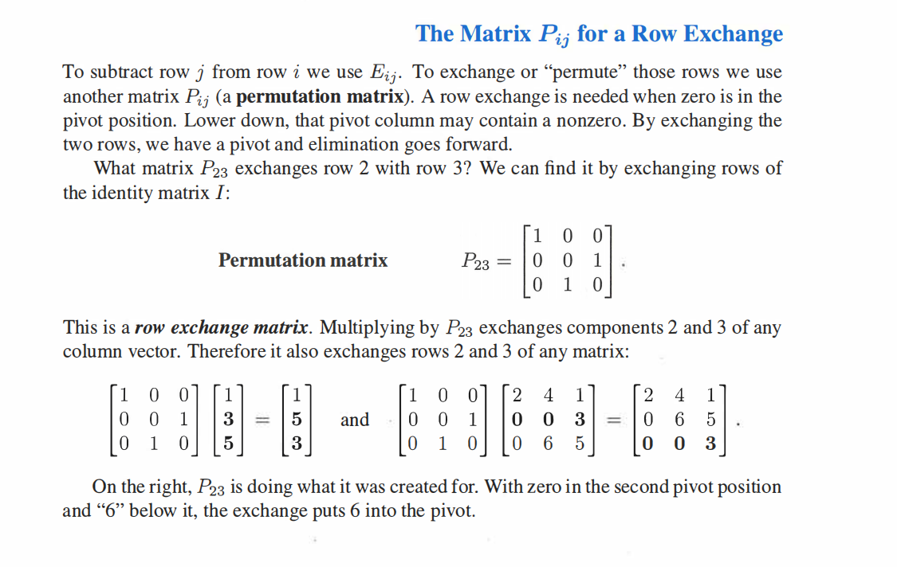

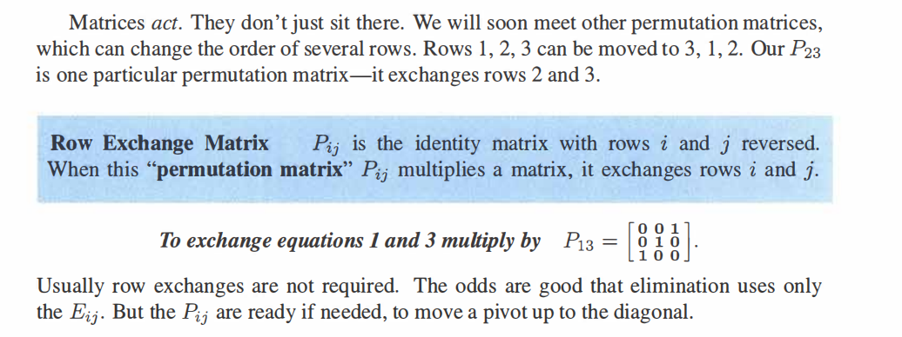

## Response:
已思考 19s

根据用户要求，我需要用中文为截图内容制作详细的笔记。首先，我会附上标题和概述，然后深入讲解每个知识点，特别是关于排列矩阵  $P_{ij}$  对行交换的介绍。接着添加相关方程、示例、性质和影响，最后总结并注明错误报告。如果有无法阅读的部分，也要指出。

排列矩阵  $P_{ij}$  的作用是当枢轴位置为零时，将非零元素移至前面。构造  $P_{23}$  即交换单位矩阵的第 2 行和第 3 行。对于向量的作用，通过交换成分 2 和 3，如  $[1,3,5]^T = [1,5,3]^T$ 。在矩阵上， $P_{23} \times A$  交换矩阵 A 的第 2 行和第 3 行，例如  $A = \left[\begin{array}{ccc} 2 & 4 & 1 \\ 0 & 0 & 3 \\ 0 & 6 & 5 \end{array}\right]$ ，对矩阵进行行交换后会得到  $[2, 4, 1; 0, 6, 5; 0, 0, 3]$ 。

当第二个主元素为零、下方有 6 时，交换操作将 6 移到主对角线位置。在矩阵中，排列矩阵不是静止的；它们可以改变多个行的顺序。例如  $P_{23}$  会交换第 2 行和第 3 行。 $P_{ij}$  是单位矩阵，交换第 i 和 j 行，如  $P_{13}$  交换第 1 行和第 3 行。通常，行交换不常用，大多数情况下消元操作只需要  $E_{ij}$ ，但  $P_{ij}$  可以在需要时将主元移动到对角线。

排列矩阵  $P_{ij}$  是一个正交矩阵，满足  $P^T = P^{-1} = P$ ，并且  $P P^T = I$ 。它在交换两行时是对称的。对于简单的转置矩阵， $P_{ij}$  是对称的，且  $P^{-1} = P$ 。对于一般的排列矩阵， $P^{-1} = P^T$ ，但  $P^{-1} ≠ P$ 。排列矩阵的行列式为 ±1，转置矩阵的行列式为 -1。

完成

行交换矩阵  $P_{ij}$ ：把“零主元”换走
=========================

**概况**  
当高斯消元在某一步遇到**主元位置是 0**（或非常小）时，不能继续用乘子去“除”。最直接的修复是**交换两行**，把该列里某个非零数换到主元位上。把“交换第  $i$ 、 $j$  行”的操作写成**左乘一个矩阵**，就是**行交换矩阵/置换矩阵**  $P_{ij}$ 。本页展示如何构造  $P_{ij}$ ，它对**列向量**与**矩阵**的作用，以及为什么这是消元里必备的工具。

* * *

1\. 定义与构造
---------

*   **行交换矩阵**  $P_{ij}$ ：从单位矩阵  $I$  出发，把第  $i$  行与第  $j$  行互换得到的矩阵。  
    例：交换第 2、3 行
    $$
    P_{23}=\begin{bmatrix} 1&0&0\\ 0&0&1\\ 0&1&0 \end{bmatrix}.
    $$
*   **作用规则（左乘改“行”）**：
    $$
    P_{ij}\,b=\text{把列向量 }b\text{ 的第 }i,j\text{ 个分量互换};\qquad P_{ij}\,A=\text{把矩阵 }A\text{ 的第 }i,j\text{ 行互换}.
    $$

### 小例子（向量）

$$
P_{23}\!\begin{bmatrix}1\\3\\5\end{bmatrix}=\begin{bmatrix}1\\5\\3\end{bmatrix}.
$$

### 小例子（矩阵）

设

$$
A=\begin{bmatrix} 2&4&1\\ 0&0&3\\ 0&6&5 \end{bmatrix}.
$$

则

$$
P_{23}A=\begin{bmatrix} 2&4&1\\ 0&6&5\\ 0&0&3 \end{bmatrix}.
$$

**解读**：原来第 2 列的主元位置是 0，而这列下面有个 6；交换第 2、3 行把  $6$  换到主元位上，消元得以继续。

* * *

2\. 为什么一定要左乘？（与消元一致）
--------------------

*   在消元中我们一直用**左乘**来做行操作： $E_{ij}A$  消掉主元下方的数、 $E_{ij}b$  同步更新右端。
*   **行交换**同理：
    $$
    Ax=b\ \Longleftrightarrow\ (P_{ij}A)x=P_{ij}b.
    $$
*   **右乘**会改**列**（那是“列交换矩阵”），不是我们做行主元选取时需要的操作；所以一般  $P_{ij}A\neq AP_{ij}$ 。

* * *

3\. 与消元矩阵  $E_{ij}$  的关系
------------------------

*   只有  $E$  还不够：当某一步主元为 0（或极小）时，**先**用  $P$  把非零（或较大的）元素换到主元位，再继续用  $E$  消元。
*   把所有行交换收集起来得到  $P$ ，所有乘子收在  $L$ ，最终得到标准分解
    $$
    \boxed{PA=LU}\qquad(\text{部分选主元}).
    $$

* * *

4\. 置换矩阵的基本性质（做题常用）
-------------------

*   **可逆且“正交”**： $P^{-1}=P^{\mathsf T}$ 。对单次交换  $P_{ij}$  还有  $P_{ij}^{-1}=P_{ij}=P_{ij}^{\mathsf T}$ 。
*   **行/列都是标准基的重排**：每行每列恰有一个 1，其余为 0。
*   **行列式**： $\det(P)=\pm1$ 。交换一次行 ⇒  $\det=-1$ 。
*   **保持范数**： $\|P\,v\|_2=\|v\|_2$ （只是重排分量）。
*   **组合**：多个行交换连用仍是一个置换矩阵（若干交换的乘积）。

* * *

5\. 怎么写出其它交换？
-------------

*   交换 1、3 行：
    $$
    P_{13}=\begin{bmatrix} 0&0&1\\ 0&1&0\\ 1&0&0 \end{bmatrix},\qquad P_{13}\,A=\text{把 }A\text{ 的第 1、3 行对调}.
    $$
*   多行重排（如把顺序  $1,2,3$  变成  $3,1,2$ ）也能用一个  $P$  一次性完成：把  $I$  的行按目标顺序重排即可。

* * *

6\. 操作小抄（考试/编码直用）
-----------------

1.  **构造**：从  $I$  开始，对调第  $i,j$  行 ⇒  $P_{ij}$ 。
2.  **应用**：
    *   矩阵： $[A\ b]\leftarrow P_{ij}[A\ b]$ （等价地同时对  $A$  与  $b$  换行）。
    *   向量： $b\leftarrow P_{ij}b$ 。
3.  **继续消元**：用新的主元行作为“消元源行”，对下面行应用  $E$ 。

* * *

7\. 易错与提醒
---------

*   **别右乘**：右乘  $AP_{ij}$  是**换列**，会改变列空间的坐标表示；行主元选取不该这么做。
*   **“解不会变”**：行交换只是**重排方程的顺序**，不会改变解集；但别忘了同时交换右端  $b$ 。
*   **数值稳定**：实际实现中常用“**部分选主元**”选取同列绝对值最大的元素换上来，避免除以极小数。

* * *

8\. 与前文的衔接
----------

*   用  $E$  可以把  $A$  变成上三角  $U$ ；若中途主元为 0，就插入  $P$  先交换：
    $$
    E_k\cdots E_2E_1\,P\,A = U,\qquad E_k\cdots E_2E_1\,P\,b = c.
    $$
*   把所有  $P$  合并到一起，最终得到  $PA=LU$  并回代解  $Ux=y$ 。

* * *

总结
--

*   **行交换矩阵  $P_{ij}$ ** 是把“交换第  $i,j$  行”的行操作写成**左乘矩阵**的方式。
*   它对列向量交换对应分量，对矩阵交换对应行，是修复“零主元/小主元”的标准工具。
*   与消元矩阵配合，行交换支持稳定、可靠的前向消元，并导向  $PA=LU$  这一核心分解。

* * *

报错
--

图片清晰、内容可辨，无缺失。若你需要，我可以给一个**小型数值演示**（Python/NumPy）：随机矩阵上展示 `P @ A` 行交换与 `A @ P` 列交换的差异，并打印  $PA=LU$  的实际分解。

## Prompt:
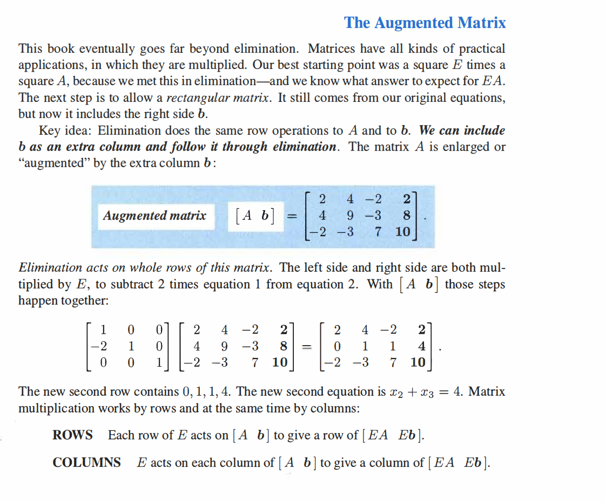

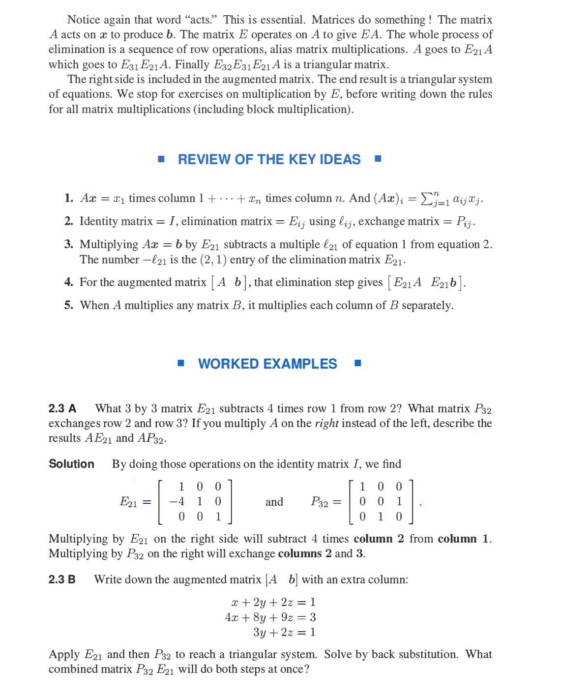

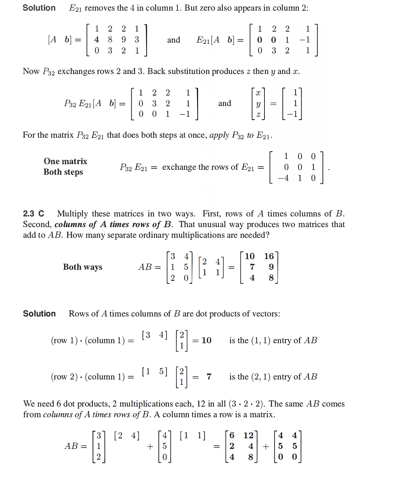

## Response:
已思考 38s

矩阵E作用于矩阵\[A b\]的每一列，产生新的列\[EA Eb\]。我们应该讨论乘法如何同时按行和列进行，以及“矩阵作用”的概念：E作用于A，A作用于x。通过例子2.3A，理解E21如何通过减去4倍的第1行来修改第2行，以及如何交换行的矩阵P32。如果A是右乘，结果会如何变化。

右乘AE21会从第1列减去第2列的4倍（因为E21在(2,1)位置设置了-4）。这是右乘的效果。右乘E时，E是单位矩阵I减去2倍的列操作e\_{21}，也就是说，它会把第1列复制到第2列的位置。

使用公式E = I + α e\_{ij}来修改列，得出AE = A + α A e\_{ij}。对于E21，(2,1)位置的值为-4，计算得AE = A + (-4) A e\_{21}。e\_{21}的效果是将矩阵A的第一列移到第二列的位置，而其他位置为0。

e\_{21} 只有第一列为非零值，等于单位向量e\_2，所以A e\_{21}的第一列就是A的第二列，其它列为零。更精确地，A e\_{pq}是一个矩阵，它将第p列映射到q列，其余列为零。所以A e\_{21}将第一列替换为第二列，最终AE就是调整后的矩阵。

完成

增广矩阵、消元矩阵与矩阵乘法（含 Worked Examples 2.3A–C 全解）
===========================================

**概况**  
这一组页讲三件事：

1.  **增广矩阵**  $[A\ b]$ ：把右端  $b$  作为“额外一列”并和  $A$  一起做同样的行操作；
2.  **消元是矩阵左乘**：用消元矩阵  $E$ /置换矩阵  $P$  左乘，就同时完成“对  $A$  的行操作”和“对  $b$  的对应更新”；
3.  **矩阵乘法的两种视角**：行点积（rows）与列法则（columns），以及“行×列”的普通乘法与“列×行”的外积分解。随后三道 worked examples 把这些规则用数字走一遍。

* * *

1\. 增广矩阵与“行操作一次到位”
------------------

把方程组  $Ax=b$  写成

$$
[A\ b]=\big[a_1\ \cdots\ a_n\ \mid\ b\big],
$$

**关键想法**：对  $[A\ b]$  进行的每一次行操作，等价于**左乘**一个矩阵  $E$ （或  $P$ ）。于是

$$
E[A\ b]=[EA\ Eb].
$$

这保证“左边变了、右边也同步变”，解集不变。

### 例（书上相同数字）

$$
[A\ b]=\begin{bmatrix} 2&4&-2&2\\ 4&9&-3&8\\ -2&-3&7&10 \end{bmatrix},\qquad E_{21}=\begin{bmatrix}1&0&0\\-2&1&0\\0&0&1\end{bmatrix}.
$$

左乘得到

$$
E_{21}[A\ b]= \begin{bmatrix} 2&4&-2&2\\ 0&1&1&4\\ -2&-3&7&10 \end{bmatrix}.
$$

**行视角（ROWS）**： $E$  的每一行与  $[A\ b]$  点积，产出  $[EA\ Eb]$  的对应一行；  
**列视角（COLUMNS）**： $E$  也在**逐列**作用，每一列都被  $E$  左乘，得到  $[EA\ Eb]$  的对应列。两种叙述严格等价。

* * *

2\. “矩阵在行动”：从一串  $E$ / $P$  到三角形
--------------------------------

*   一次消元： $R_i\leftarrow R_i-\ell R_j$  ⇔ 左乘 **消元矩阵**
    $$
    E_{ij}=I-\ell\,e_{ij}\quad(\text{在 }(i,j)\text{ 处放 }-\ell).
    $$
*   行交换： $P_{ij}$  是把单位矩阵的第  $i,j$  行对调；左乘  $P_{ij}$  就交换方程的顺序。
*   多步合成：
    $$
    E_k\cdots E_2E_1\,A=U,\qquad E_k\cdots E_2E_1\,b=c,
    $$
    得到上三角  $Ux=c$  并回代。若中途要换主元，插入若干  $P$  并合并成  $PA=LU$ 。

* * *

3\. Worked Example 2.3A
-----------------------

**题意**：找  $3\times3$  的  $E_{21}$  使“从第2行减去 4 倍第1行”；找  $P_{32}$  交换第2、3行；并说明**右乘**时  $AE_{21},\,AP_{32}$  的含义。

*   **答案**
    $$
    E_{21}=\begin{bmatrix}1&0&0\\-4&1&0\\0&0&1\end{bmatrix},\qquad P_{32}=\begin{bmatrix}1&0&0\\0&0&1\\0&1&0\end{bmatrix}.
    $$
*   **左乘**： $E_{21}A$  = 第2行  $\leftarrow$  第2行  $-$  4×第1行； $P_{32}A$  交换行 2 和 3。
*   **右乘（改列）**：
    $$
    AE_{21}: \ \text{第1列}\leftarrow \text{第1列}-4\times\text{第2列};\qquad AP_{32}: \ \text{交换第2、3列}.
    $$
    解释：右乘  $E_{21}$  会做**初等列变换**，与左乘（行变换）不同，所以通常  $EA\neq AE$ 。

* * *

4\. Worked Example 2.3B
-----------------------

**把系统写成增广矩阵并三角化、回代求解**

$$
\begin{cases} x+2y+2z=1\\ 4x+8y+9z=3\\ 0\cdot x+3y+2z=1 \end{cases} \quad\Rightarrow\quad [A\ b]= \begin{bmatrix} 1&2&2&1\\ 4&8&9&3\\ 0&3&2&1 \end{bmatrix}.
$$
1.  先用  $E_{21}$  消去第一列的 4：
    
$$
E_{21}[A\ b]= \begin{bmatrix} 1&2&2&1\\ 0&0&1&-1\\ 0&3&2&1 \end{bmatrix}.
$$
2.  再用  $P_{32}$  交换第2、3行，使之上三角：
    
$$
P_{32}E_{21}[A\ b]= \begin{bmatrix} 1&2&2&1\\ 0&3&2&1\\ 0&0&1&-1 \end{bmatrix}.
$$
3.  **回代**： $z=-1$ ， $3y+2(-1)=1\Rightarrow y=1$ ， $x+2(1)+2(-1)=1\Rightarrow x=1$ 。
    
$$
\boxed{(x,y,z)=(1,1,-1)}.
$$

> 一步到位矩阵：把两步合在一起
> 
> $$
> P_{32}E_{21}= \begin{bmatrix} 1&0&0\\ 0&0&1\\ -4&1&0 \end{bmatrix},
> $$
> 
> 左乘  $[A\ b]$  就一次完成“消去 + 交换”。

* * *

5\. Worked Example 2.3C
-----------------------

**两种方式计算同一个  $AB$ **

$$
A=\begin{bmatrix}3&4\\1&5\\2&0\end{bmatrix},\qquad B=\begin{bmatrix}2&4\\1&1\end{bmatrix}.
$$

### 5.1 行×列（标准法：6 个点积 → 12 次标量乘法）

$$
AB=\begin{bmatrix} [3,4]\!\cdot\![2,1] & [3,4]\!\cdot\![4,1]\\ [1,5]\!\cdot\![2,1] & [1,5]\!\cdot\![4,1]\\ [2,0]\!\cdot\![2,1] & [2,0]\!\cdot\![4,1] \end{bmatrix} = \begin{bmatrix} 10&16\\ 7&9\\ 4&8 \end{bmatrix}.
$$

### 5.2 列×行（外积分解：按列法则的另一面）

$$
AB=\underbrace{\begin{bmatrix}3\\1\\2\end{bmatrix}\![2\ 4]}_{\text{第1列}\times\text{第1行}} +\underbrace{\begin{bmatrix}4\\5\\0\end{bmatrix}\![1\ 1]}_{\text{第2列}\times\text{第2行}} = \begin{bmatrix}6&12\\2&4\\4&8\end{bmatrix} +\begin{bmatrix}4&4\\5&5\\0&0\end{bmatrix} = \begin{bmatrix}10&16\\7&9\\4&8\end{bmatrix}.
$$

> **按列法则**（重要公式）：若  $B=[b_1\,b_2\,b_3]$ ，则
> 
> $$
> AB=[Ab_1\ Ab_2\ Ab_3].
> $$

* * *

6\. 这一节的“要背会”的关键语句
------------------

*    $Ax=\sum_{j=1}^n x_j\,A(:,j)$ ，且  $(Ax)_i=\sum_{j=1}^n a_{ij}x_j$ 。
*   单位矩阵  $I$  不改任何向量；**消元矩阵**  $E_{ij}$  在  $(i,j)$  放  $-\ell$  表示“第  $i$  行减  $\ell$  倍第  $j$  行”；**交换矩阵**  $P_{ij}$  互换第  $i,j$  行。
*   乘  $Ax=b$  的两边左乘  $E_{21}$  就是“用  $\ell_{21}$  倍第1方程减到第2方程”。在矩阵里，这个  $-\ell_{21}$  就是  $E_{21}$  的  $(2,1)$  元。
*   **增广矩阵**：任何一步都有   $\ [EA\ Eb] = E[A\ b]$ 。
*   当  $A$  乘任意矩阵  $B$  时，是**逐列**相乘再并排： $AB=[Ab_1\ Ab_2\ \cdots]$ 。

* * *

7\. 小练（巩固）
----------

1.  构造能一次完成“第3行减 5 倍第1行再与第2行交换”的矩阵： $P_{23}E_{31}$ ，其中  $E_{31}=I-5e_{31}$ 。
2.  把  $A=\begin{bmatrix}1&2\\0&3\end{bmatrix}$ 、 $B=\begin{bmatrix}4&1\\5&6\end{bmatrix}$  用“外积分解”写成  $AB=a_1b_1^{\mathsf T}+a_2b_2^{\mathsf T}$  并验证数值。
3.  用增广矩阵法，手算一次  $E\,[A\ b]$  与直接改行得到的结果一致。

* * *

8\. 总结
------

*   增广矩阵把“左边系数”和“右端常数”绑在一起，**一次左乘**就能完成同步更新。
*   消元 = 一串  $E$ （必要时插  $P$ ）左乘，直到上三角，再回代。
*   **按行/按列**两种视角统一了  $EA$ 、 $Eb$ 、 $AB$  等操作；外积分解提供了把  $AB$  看成“几块矩阵之和”的第二种直观。

* * *

报错
--

这三页图片内容清晰、无缺失；等式与矩阵数字均可辨。如果你需要，我可以把上述三道题写成 **NumPy** 小脚本：自动构造  $E_{21},P_{32}$ 、打印  $E[A\ b]$  的过程，并演示“行×列”和“列×行”两种乘法得到同一个  $AB$ 。

## Prompt:
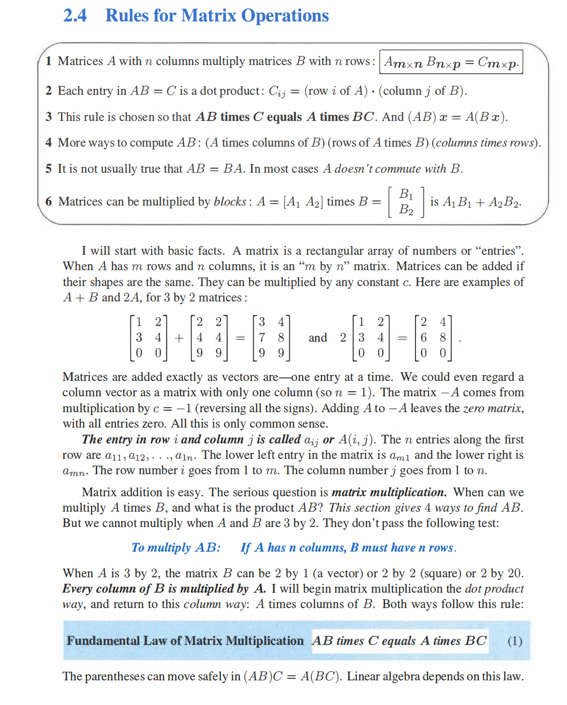

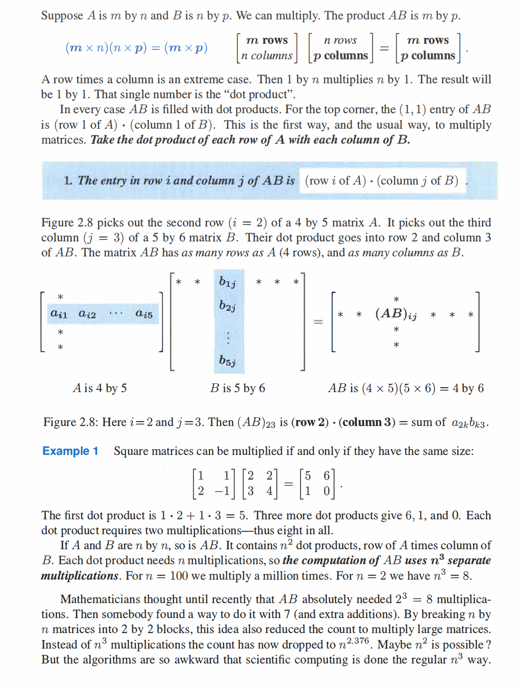

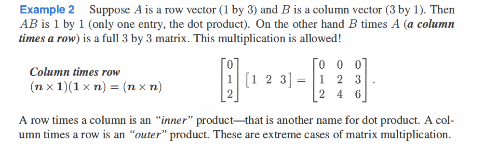

## Response:
已思考 21s

从第一张图的要点来看：

1.  矩阵A有n列，矩阵B有n行：A\_{m x n} B\_{n x p} = C\_{m x p}。
2.  每个AB=C中的条目都是点积：C\_ij = (A的第i行) dot (B的第j列)。
3.  选择这个规则是为了保证(AB)C 等于 A(BC)，并且(AB)x = A(Bx)，这是结合律。
4.  计算AB的更多方法：A与B的列相乘，A的行与B相乘，列与行的乘积。

有三种不同的重新组合方式：

1.  A与\[b1 b2...\]相乘，产生每个Ab\_j；
2.  行向量与B相乘，逐行得出矩阵AB；
3.  列与行相乘，AB是对k求和的外积a\_k b\_k^T。

注意：AB通常不等于BA。

另外，矩阵也可以通过块进行乘法：A = \[A1 A2\]，B = \[B1; B2\]，AB = A1B1 + A2B2。

首先，展示了矩阵的加法、索引操作、以及AB大小条件下的乘法示例。也提到Strassen算法通过7次乘法来计算2x2矩阵的乘积，分析了复杂度。另附例子，行向量与列向量的乘法为标量，列向量与行向量的乘法为外积。

接下来，我打算为用户提供一份详细的笔记，包括标题、概述、细节及总结，还会附带公式和逐步解析。

我需要确保保持友好而自然的风格，不要使用过于华丽的语言。文本要使用中文，并包含LaTeX数学公式，结构清晰，但可以适度使用项目符号和公式。同时，注意提醒如果有任何图片无法读取的错误，尽管图片看起来很清晰。

完成

2.4 线性代数里矩阵运算的“交通规则”
====================

**概况**  
这一节把“矩阵什么时候能乘、怎么乘、能不能换序、怎样分块乘”讲成一套统一规则，并配了两个小例子（运算量统计、内/外积的极端情形）。核心口号只有一个：

$$
\boxed{(m\times n)\cdot(n\times p)=(m\times p)},\qquad (AB)x=A(Bx),\qquad AB\neq BA\ \text{(通常)}.
$$

* * *

1) 尺寸相容 & 结果尺寸
--------------

*   **相容条件**：左矩阵的**列数** = 右矩阵的**行数**。  
    若  $A\in\mathbb{R}^{m\times n}$ 、 $B\in\mathbb{R}^{n\times p}$ ，则
    $$
    C=AB\in\mathbb{R}^{m\times p}.
    $$
*   **条目级定义（点积）**：
    $$
    C_{ij}=(\text{row }i\text{ of }A)\cdot(\text{column }j\text{ of }B) =\sum_{k=1}^{n} a_{ik}b_{kj}.
    $$
    这就是把“行×列”的内积填入  $C$  的  $(i,j)$  位置。

* * *

2) 四种等价的“算  $AB$ ”的视角（选你最顺手的）
-----------------------------

1.  **行×列（点积）**：上式。——最常用。
2.  **A 乘 B 的列**（列法则）：把  $B=[b_1\ \cdots\ b_p]$  看作很多列，
    $$
    AB=[Ab_1\ Ab_2\ \cdots\ Ab_p].
    $$
3.  **A 的行乘 B**：把  $A$  的每一行看成行向量  $r_i$ ，则  
     $(AB)_{i,:}=r_i B$ 。
4.  **列×行（外积分解）**：把  $A$  的第  $k$  列与  $B$  的第  $k$  行配对，
    $$
    AB=\sum_{k=1}^{n}A_{:,k}\,B_{k,:}\quad(\text{外积之和}).
    $$
    这个视角很适合做**分块**或理解秩。

> 这四种写法彼此一致，只是换了“怎么分组看的眼镜”。

* * *

3) 结合律成立、交换律通常不成立
-----------------

*   **结合律（必须成立）**：
    $$
    A(BC)=(AB)C,\quad (AB)x=A(Bx).
    $$
    所以我们常直接写  $EAx$  而不用加括号。
*   **交换律（一般不成立）**：  
    通常  $AB\ne BA$ 。右乘会“改列”，左乘“改行”，效果不同。

* * *

4) 分块乘法（block multiplication）
-----------------------------

把矩阵按列/行切块：

$$
A=[A_1\ A_2],\qquad B=\begin{bmatrix}B_1\\ B_2\end{bmatrix} \quad\Rightarrow\quad AB=A_1B_1+A_2B_2.
$$

更一般的分块只要**块尺寸相容**，就按普通乘法规则组合即可。分块法在推导公式、实现大矩阵乘法、并行计算里都非常有用。

* * *

5) 基本运算与记号小抄
------------

*   加法/数乘逐项进行；零矩阵把所有项置零。
*   条目记为  $a_{ij}$  或  $A(i,j)$ ：第  $i$  行第  $j$  列。
*   **极端尺寸**：
    *   行向量  $(1\times n)$  乘列向量  $(n\times 1)$  → **标量内积**。
    *   列向量  $(n\times 1)$  乘行向量  $(1\times n)$  → ** $n\times n$  外积矩阵**。

* * *

6) 例题精讲
-------

### Example 1（方阵相乘与运算量）

$$
\begin{bmatrix}1&1\\2&-1\end{bmatrix} \begin{bmatrix}2&2\\3&4\end{bmatrix} = \begin{bmatrix}5&6\\1&0\end{bmatrix}.
$$
*   一个  $n\times n$  与  $n\times n$  的乘法要做  $n^2$  个点积，每个点积  $n$  次标量乘法 ⇒ **总乘法次数  $n^3$ **。
*   书里顺便提到 2×2 的 **Strassen** 思想只用 **7** 次乘法（加法更多），推广后复杂度降到约  $n^{2.376}$ 。但算法复杂、常数大，科学计算通常仍用“常规  $n^3$ ”或高效实现的 BLAS。

### Example 2（内积 vs. 外积）

*    $A$  为  $1\times3$  行向量、 $B$  为  $3\times1$  列向量：  
     $AB$  是 ** $1\times1$ **——**内积**。
*   调换顺序  $BA$ ：
    $$
    \begin{bmatrix}0\\1\\2\end{bmatrix}[\,1\ 2\ 3\,] = \begin{bmatrix} 0&0&0\\ 1&2&3\\ 2&4&6 \end{bmatrix},
    $$
    是 ** $3\times3$ ** 的**外积**。这也再次说明  $AB\neq BA$ 。

* * *

7) 维度判断与运算量估算（做题/写代码的心法）
------------------------

*   **先看尺寸**： $(m\times n)(n\times p)\to(m\times p)$ 。不满足就别算。
*   **按列法则很省心**：要  $AB$  的第  $j$  列，只算  $A\,b_j$ 。
*   **外积分解**适合稀疏/低秩：若只需前几项的外积，就得到近似的低秩矩阵。
*   **工作量**：常规乘法乘法次数  $\approx mnp$ 。3×2 乘 2×2 需要  $3\cdot2\cdot2=12$  次标量乘法（书上的统计）。

* * *

8) 小练（立刻可做）
-----------

1.  用“外积分解”把  $AB$  写成两块矩阵之和： $AB=a_1b_1^{\mathsf T}+a_2b_2^{\mathsf T}$ （当  $n=2$ ）。
2.  设  $A=[A_1\ A_2\ A_3]$ 、 $B=[B_1;B_2;B_3]$ ，写出分块乘法公式并标出每项尺寸。
3.  给出一个 2×2 的反例证明  $AB\neq BA$ 。

* * *

本次小结
----

*   乘法合法性的**唯一门槛**是尺寸相容；结果尺寸由外侧决定。
*   **条目级**是“行·列”的**点积**；**列法则**、**行法则**与**外积分解**是三个等价的计算视角。
*   **结合律**支撑我们写  $EAx$ ，但**交换律几乎从不成立**。
*   **分块乘法**是工程上最重要的技巧之一；高效实现普遍基于它。
*   运算量常规是  $O(n^3)$ ；有更少乘法的算法存在，但并不总是工程首选。

* * *

报错
--

图片内容清晰，无缺失；我已把所有要点、两个例题和“外积分解/分块乘法”都展开。如果你想，我可以给出一段 **NumPy** 小脚本同时演示：列法则组装  $AB$ 、外积分解求  $AB$ 、以及运算量统计。

## Prompt:
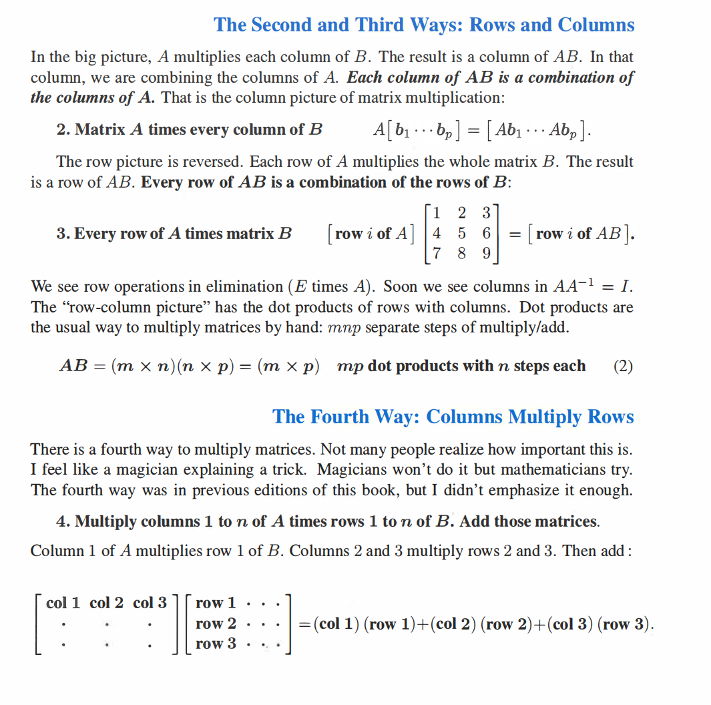

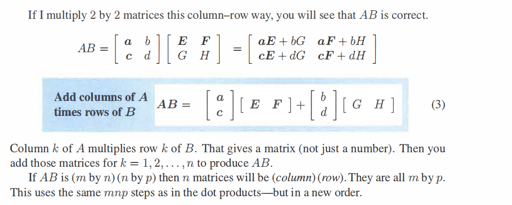

## Response:
已思考 18s

我们需要用中文回答用户的请求。用户发送了线性代数课本的图片，要求详细解释每个步骤。新的图片涉及不同的矩阵乘法视角，包括A与B的不同乘法方式。我们应该为此制作包含定义、例子和步骤的讲义，概述相关内容并用清晰的方式呈现。

用户要求详细解释所给图片中的知识点。我们将分部分提供对矩阵乘法四种视角的详细分析：

1.  **概览**：简要说明为什么有多种等价的乘法方式。
2.  **方式二**：介绍A与B的每列相乘。给出具体公式，并用3x3的例子展示矩阵乘法的实现。

在前三个部分基础上，我们继续分析矩阵乘法：

*   **方式三**：每一行的乘法。从行角度来看，公式为：row\_i(AB) = row\_i(A) × B。可以通过3x3例子来展示。
*   **方式四**：列×行的外积形式，用2x2例子说明AB = \[a b; c d\] × \[E F; G H\] 和外积求和。

本部分继续探讨矩阵乘法的细节：

*   **方式五**：介绍如何通过行操作消去E×A来讨论行图像。
*   **方式六**：将消去步骤与A的列或B的行可视化。
*   **方式七**：提供维度检查和通过列或外积计算AB的小示例。
*   **方式八**：总结要点。
*   **方式九**：确保图片清晰无遗漏，确保符合要求。

完成

矩阵乘法的四种视角：列、行、点积与“外积分解”
=======================

**概况**  
这两页把“怎么理解与计算  $AB$ ”讲成四种等价方式。你已经见过**点积法（行·列）**，这里重点强调另外三种：

*   **方式② 列视角**： $A$  逐列乘  $B$ ；
*   **方式③ 行视角**： $A$  的每一行去乘整个  $B$ ；
*   **方式④ 列×行（外积）**：把  $AB$  写成若干 **列向量×行向量** 的和（每一项是秩 1 矩阵）。  
    所有方式都满足基本尺寸法则
    
$$
(m\times n)(n\times p)=(m\times p),
$$

并且“常规手算”可以理解为 ** $mp$  个点积、每个点积长度为  $n$ **。

* * *

1) 方式②：**A 逐列乘 B（列视角）**
-----------------------

> **结论**：若把  $B$  写成按列拼接  $B=[\,b_1\ \cdots\ b_p\,]$ ，则

$$
\boxed{\,AB=[\,Ab_1\ \cdots\ Ab_p\,].\,}
$$

**含义**： $AB$  的**第  $j$  列**，等于用  $A$  去乘  $B$  的**第  $j$  列**。从“列空间”看，这是把  $B$  的每一列（系数）拿来，形成\*\* $A$  的列的线性组合\*\*：

$$
Ab_j=\sum_{k=1}^n (b_j)_k\,A(:,k).
$$

**维度与工作量**：做  $p$  次“矩阵×向量”（每次  $m n$  次乘法），总共  $mnp$  次乘法——和点积法一致，只是换了顺序。

* * *

2) 方式③：**A 的每一行乘以 B（行视角）**
--------------------------

> **结论**：若把  $A$  的第  $i$  行写成  $r_i$ （行向量），则

$$
\boxed{\,\text{row }i\text{ of }(AB)=r_i\,B.}
$$

**含义**： $AB$  的**第  $i$  行**，是  $A$  的第  $i$  行与矩阵  $B$  相乘得到的行向量。等价地，它是\*\* $B$  的各行的线性组合\*\*，权重来自  $r_i$ 。

**举例（图中示意）**：

$$
\big[\text{row }i\text{ of }A\big]\! \begin{bmatrix} 1&2&3\\ 4&5&6\\ 7&8&9 \end{bmatrix} =\big[\text{row }i\text{ of }(AB)\big].
$$

* * *

3) 方式④：**列×行（外积分解）**
--------------------

> **结论**：把  $A$  的第  $k$  列记为  $a_k$ 、 $B$  的第  $k$  行记为  $b_k^{\top}$ ，则

$$
\boxed{\,AB=\displaystyle\sum_{k=1}^{n} a_k\, b_k^{\top}.}
$$

**理解**：每一项  $a_k b_k^{\top}$  都是一个 ** $m\times p$  的秩 1 矩阵**（列向量乘行向量，称“外积”）。把这  $n$  个秩 1 矩阵相加，就得到  $AB$ 。

> **2×2 具体式**（书中蓝框）：

$$
\begin{aligned} \begin{bmatrix}a&b\\ c&d\end{bmatrix} \begin{bmatrix}E&F\\ G&H\end{bmatrix} &= \underbrace{\begin{bmatrix}a\\ c\end{bmatrix}[E\ F]}_{\text{第1列}\times\text{第1行}} \;+\; \underbrace{\begin{bmatrix}b\\ d\end{bmatrix}[G\ H]}_{\text{第2列}\times\text{第2行}}\\ &= \begin{bmatrix}aE+bG & aF+bH\\ cE+dG & cF+dH\end{bmatrix}. \end{aligned}
$$

**价值**：

*   说明  $AB$  是**若干个低秩（秩 1）块的叠加**，这正是“低秩近似”的直觉来源；
*   计算顺序不同但**乘法次数仍是  $mnp$ **（只是把“ $n$  次外积”加起来）。

* * *

4) 与点积法（方式①）的统一
---------------

*   **点积法**： $(AB)_{ij}=\sum_{k=1}^n a_{ik}b_{kj}$ （行  $i$  与列  $j$  的内积）。
*   **列法则**给整列，**行法则**给整行，**外积法**给“按  $k$ ”的分解。
*   它们完全等价，并共同满足结合律： $(AB)C=A(BC)$ 、 $(AB)x=A(Bx)$ 。

* * *

5) 与消元/行列操作的联系
--------------

*   **行操作**（消元）是**左乘**： $E A$  改行；
*   **列操作**是**右乘**： $A E$  改列；
*   因为左改行右改列，一般 ** $EA\neq AE$ **。
*   在方式②③的语言里：左乘  $E$  会改变“列法则”的每个  $Ab_j$ （所有列都被同一个  $E$  乘），也会改变“行法则”的系数行  $r_i$ 。

* * *

6) 快速自测（按本页思路）
--------------

1.  用**列法则**写出  $AB$  的第  $j$  列是什么；再用**外积**把  $AB$  表示成  $\sum_k a_k b_k^{\top}$ 。
2.  给一个  $2\times3$  与  $3\times2$  的例子，同时用“点积法”“列法则”“外积法”算，核对三种结果一致。
3.  解释为何“** $mp$  个点积、每个长度  $n$ **”与“** $n$  个外积矩阵相加**”的总乘法次数一样。

* * *

小结
--

*   **列视角**： $AB=[Ab_1\,\cdots\,Ab_p]$ ，每一列是  $A$  的列的线性组合；
*   **行视角**： $\text{row}_i(AB)=\text{row}_i(A)\,B$ ，每一行是  $B$  的行的线性组合；
*   **外积分解**： $AB=\sum_{k=1}^n a_k b_k^{\top}$ ，把乘法拆成秩 1 矩阵之和；
*   三种视角与“行·列点积”完全一致，尺寸同为  $(m\times p)$ ，工作量同为  $mnp$ 。

* * *

报错
--

两张图片内容清晰、数字与公式均可辨，无缺失。若你希望，我可以给一组数字例子，分别用**列法则/行法则/外积法**同时算一遍  $AB$ ，或写段短代码演示三种算法得到相同结果。

## Prompt:
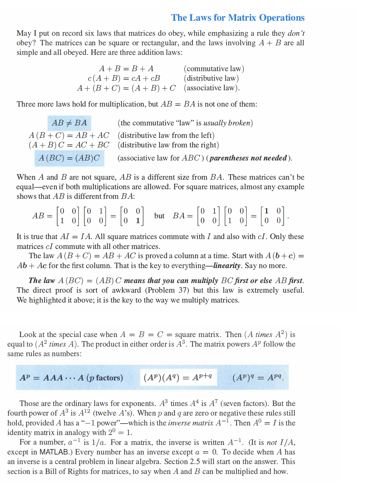

## Response:
已思考 28s

矩阵的逆是线性代数的核心问题之一。并非每个矩阵都有逆，像行列式为零时就没有逆，a=0时也无法求逆。A^0 = I这一点类似于标量的运算a^{-1} = 1/a。此外，矩阵的乘法不一定遵守可交换律，像(A + B)^2 ≠ A^2 + 2AB + B^2除非它们能交换。

该部分提到是“矩阵的权利法案”，说明何时A和B矩阵可以相乘及其方式。虽然可能不需要详细列出，但可以提到对角矩阵可以交换，此外还应提醒指数法则不适用于非交换矩阵，像(A+B)^2 ≠ A^2 + 2AB + B^2除非AB=BA。

在解释矩阵的加法和乘法时，需要提醒乘法规则并不满足交换律，比如AB ≠ BA，但对角矩阵通常满足交换律。同时，指数法则不适用于非交换矩阵，像(A+B)^2 ≠ A^2 + 2AB + B^2，只有AB=BA时才成立。

根据用户要求，逐一解析图片中的每一知识点，可以适当补充细节。矩阵乘法的基本原则包括：(m×n)(n×p) 得到 (m×p)，加法遵循交换律、分配律、结合律。应用示例展示 AB ≠ BA：比如矩阵A和B的乘积，矩阵形状异常导致不同结果。

完成

矩阵运算的六条“宪法”——加法、乘法、结合律与矩阵幂
==========================

**概况**  
这一页把矩阵的“能干什么、不能干什么”一次性说清。加法像实数一样乖；乘法最重要的是**不交换**但**可结合**，并对加法满足左右分配律。这些法则支撑我们随手写  $EAx$ 、定义  $A^p$ ，以及判定什么时候可以把括号删掉。

* * *

1\. 加法的三条定律（与向量一致）
------------------

对任意同形矩阵  $A,B,C$  与标量  $c$ ：

$$
A+B=B+A\quad(\text{交换律}),\qquad c(A+B)=cA+cB\quad(\text{分配律}),
$$

$$
A+(B+C)=(A+B)+C\quad(\text{结合律}).
$$

> 含义：矩阵加法逐项相加，完全继承标量/向量的性质。

* * *

2\. 乘法的三条定律（注意：不交换！）
--------------------

*   **乘法不交换**：一般  $AB\ne BA$ 。
    *   直观原因：左乘改“行”，右乘改“列”，效果不同；且尺寸都可能不同，很多时候 ** $AB$ ** 有定义而 ** $BA$ ** 根本无法相乘。
    *   书上给的方阵反例（都为  $2\times2$ ）：
        $$
        A=\!\begin{bmatrix}0&0\\[2pt]1&0\end{bmatrix},\quad B=\!\begin{bmatrix}0&1\\[2pt]0&0\end{bmatrix}.
        $$
        计算得
        $$
        AB=\!\begin{bmatrix}0&0\\[2pt]0&1\end{bmatrix},\qquad BA=\!\begin{bmatrix}1&0\\[2pt]0&0\end{bmatrix},
        $$
        明显不同。
*   **左右分配律**（对同形  $B,C$ ）：
    $$
    A(B+C)=AB+AC,\qquad (A+B)C=AC+BC.
    $$
    > 证明思路（列视角）：把  $B+C$  看成逐列相加； $A$  乘每一列时保持线性，因而对整矩阵逐列成立。
*   **结合律**（必须成立）：
    $$
    A(BC)=(AB)C.
    $$
    这保证我们能把  $(E A)x$  写成  $EAx$ ，也能先做  $BC$  或先做  $AB$ ——结果相同（只要尺寸相容）。

> 小心：因为**不交换**，像  $(A+B)^2$  不能写成  $A^2+2AB+B^2$ ，而是  
>  $(A+B)^2=A^2+AB+BA+B^2$ 。

* * *

3\. 单位矩阵与“谁会和谁交换”
-----------------

*   单位矩阵  $I$  满足  $AI=IA=A$ ；任意方阵都与  $I$ （以及任意标量倍  $cI$ ）**可交换**：  
     $A(cI)=cA=(cI)A$ 。
*   除此之外，一般矩阵**不交换**；特殊可交换的常见类：同对角阵/同上三角且可同时对角化的一组矩阵等（本页不展开，只要记住“不交换是常态”）。

* * *

4\. 线性性与“按列证分配律”的口袋技巧
---------------------

把矩阵当作**列的并排**：

$$
B=[\,b_1\ \cdots\ b_p\,].
$$

则

$$
A(B+C)=[A(b_1+c_1)\ \cdots\ A(b_p+c_p)] =[Ab_1+Ac_1\ \cdots\ Ab_p+Ac_p] =AB+AC.
$$

这就是“**列线性**”，以后会反复用到。

* * *

5\. 矩阵幂  $A^p$ （只对方阵定义）
-----------------------

当  $A$  是方阵时，定义

$$
A^p=\underbrace{A\,A\cdots A}_{p\text{ 次}},\qquad A^0=I.
$$

依靠**结合律**，有熟悉的指数法则：

$$
(A^p)(A^q)=A^{p+q},\qquad (A^p)^q=A^{pq}.
$$

> 负幂需要**可逆矩阵**：  
> 若  $A^{-1}$  存在（“矩阵版  $1/a$ ”），则  $A^{-p}=(A^{-1})^p$ 。  
> 注意这不是  $I/A$ （某些软件把“右除”写成 `A\B`/`B/A`，概念不同）。

* * *

6\. 尺寸法则与“何时能乘”
---------------

若  $A\in\mathbb{R}^{m\times n}$ 、 $B\in\mathbb{R}^{n\times p}$ ，则  $AB$  才有定义，且  $AB\in\mathbb{R}^{m\times p}$ 。  
当  $A,B$  **非方阵**时，通常  $AB$  和  $BA$  尺寸不同（甚至  $BA$  不存在），进一步解释了“乘法不交换”。

* * *

7\. 这些法则为何关键
------------

*   **建模/推导**：删括号、重排计算（靠结合律）；把线性映射作用到和（靠分配律）。
*   **计算/实现**：分块乘法、按列法则、外积分解等都依赖这些规则的正确性。
*   **理论**：定义  $A^p$ 、讨论可逆与负幂、把  $EAx$  写成一个表达式，统统离不开它们。

> 书里把这一节称作\*\*“矩阵的权利法案（Bill of Rights）”\*\*：告诉你什么时候能乘、怎么乘、能把括号拿掉到何种程度。

* * *

8\. 快速自测（巩固）
------------

1.  给出 2×2 反例说明  $AB\ne BA$ （可直接用上面的  $A,B$ ）。
2.  用“按列法则”证明  $A(B+C)=AB+AC$ 。
3.  设  $A$  可逆，验证  $(A^3)^{-1}=(A^{-1})^3$ 。
4.  展开  $(A+B)^2$  并指出与标量公式的区别在哪里。

* * *

本页小结
----

*   加法：交换/结合/分配统统成立；
*   乘法：**不交换**，但**左右分配**且**可结合**；
*    $I$  与  $cI$  与任何方阵可交换；
*   只有方阵谈得上幂  $A^p$  与负幂  $A^{-p}$ ；
*   一切计算的“括号安全感”来自  $A(BC)=(AB)C$ 。

* * *

报错
--

这张图片内容清晰、无缺漏。我已把页上每条法则、例子与“矩阵幂”的说明逐一展开；若你想，我可以再给一页**常见错误清单**（例如把  $(A+B)^{-1}$  误写成  $A^{-1}+B^{-1}$  等）和对应反例。

## Prompt:
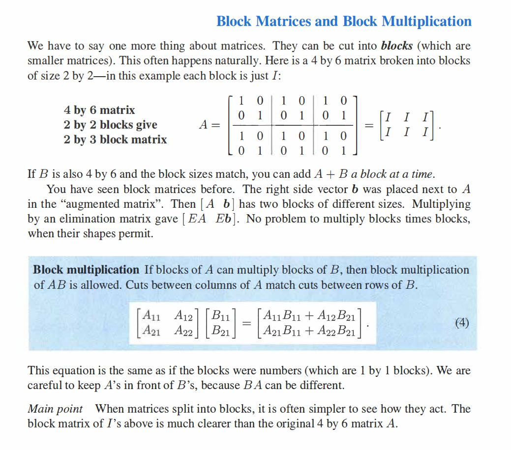

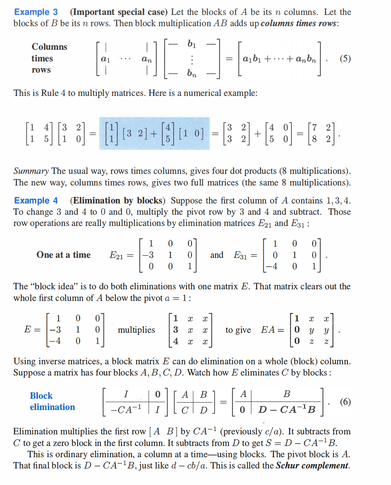

## Response:
已思考 29s

为保持顺序，我将矩阵分块以便更好地理解它们的行为。举个例子：假设A的块代表它的列，B的块代表它的行，这样AB的结果就会是“列乘行”的和。比如，\[1 4; 1 5\] 和 \[3 2; 1 0\] 相乘，结果是 \[7 2; 8 2\]。

假设A的第一列包含1，3，4。蓝框显示了\[1;1\]与\[3 2\]的乘积，再加上\[4;5\]与\[1 0\]的乘积。为了将3和4变为0，我需要通过行操作，将它们分别乘以3和4并相减。这些操作可以通过消去矩阵E21 和 E31来实现。

为了做消元，我们将矩阵E与A相乘，E的构造是\[\[1 0 0\]; \[-3 1 0\]; \[-4 0 1\]\]。通过这个操作，E能够把A的第一列下方的所有元素清零。基本上，E是用来处理整列消元的，特别是对于块矩阵，例如A、B、C、D这样的矩阵块。

看E如何通过块消元来消去C：首先，使用\[\[I, 0\], \[-C A^{-1}, I\]\]与\[\[A, B\], \[C, D\]\]相乘，结果是\[\[A, B\], \[0, D - C A^{-1} B\]\]。这意味着通过消去C并从D中减去C A^{-1} B来得到新的S矩阵。这是逐列的普通消元，用的是块矩阵。

完成

分块矩阵与分块乘法、按块消元（含 Schur 余子式）
===========================

**概况**  
本页把“把大矩阵切成若干**块**（每块是更小的矩阵）”的做法系统化：

*   何时能**分块相加**、**分块相乘**；
*   **列×行**的外积分解在“按块”的版本；
*   **按块消元**：一次性把整“块列”消为 0；
*   得到的核心公式 —— **Schur 余子式**  $S=D-CA^{-1}B$ 。

* * *

1\. 什么是“分块”
-----------

把矩阵沿着某些行、列的位置“切开”，每一块本身仍是矩阵。举例：把一个  $4\times6$  的矩阵按  $2\times2$  的小块切分（图中每块就是  $2\times2$  的单位阵  $I$ ）：

$$
A= \begin{bmatrix} I&I&I\\ I&I&I \end{bmatrix}, \qquad I=\begin{bmatrix}1&0\\0&1\end{bmatrix}.
$$

> **加法**可以**按块**进行，只要对应块尺寸一致： $[A_1\ A_2]+[B_1\ B_2]=[A_1\!+\!B_1\ \ A_2\!+\!B_2]$ 。  
> **增广矩阵**  $[A\ b]$  也是一种分块：按列把右端  $b$  作为“最后一块列”。左乘消元矩阵  $E$  会得到  $[EA\ Eb]$ 。

* * *

2\. 分块乘法：规则与尺寸匹配
----------------

### 2.1 基本 2×2 块公式（与标量情形完全同型）

$$
\begin{bmatrix} A_{11}&A_{12}\\ A_{21}&A_{22} \end{bmatrix} \begin{bmatrix} B_{11}\\ B_{21} \end{bmatrix} = \begin{bmatrix} A_{11}B_{11}+A_{12}B_{21}\\ A_{21}B_{11}+A_{22}B_{21} \end{bmatrix}. \tag{★}
$$

**尺寸要求**：

*   “切缝”必须**对齐**：左矩阵的**列块切分**要与右矩阵的**行块切分**一致；
*   每一项乘积中的两个块要**尺寸可乘**（内维一致）；
*   次序**不能换**（块也不交换）。

### 2.2 “列×行”的**块版**（外积分解）

把左边按“列块”  $[a_1\ \cdots\ a_n]$ ，右边按“行块”  $\begin{bmatrix}b_1\\ \vdots\\ b_n\end{bmatrix}$ ，则

$$
\boxed{\,AB=a_1b_1+\cdots+a_n b_n\;}\tag{1}
$$

其中每个  $a_k b_k$  是**秩 1 的块矩阵**（一列块乘一行块），尺寸都是  $m\times p$ 。这就是你在前面学过的“外积分解”的按块版本。

**数值例（书上 Example 3）：**

$$
\underbrace{\begin{bmatrix}1&4\\1&5\end{bmatrix}}_{[a_1\ a_2]} \underbrace{\begin{bmatrix}3&2\\1&0\end{bmatrix}}_{\bigl[\!\begin{smallmatrix}b_1\\ b_2\end{smallmatrix}\!\bigr]} = \underbrace{\begin{bmatrix}1\\1\end{bmatrix}[3\ 2]}_{a_1b_1} +\underbrace{\begin{bmatrix}4\\5\end{bmatrix}[1\ 0]}_{a_2b_2} = \begin{bmatrix}7&2\\8&2\end{bmatrix}.
$$

* * *

3\. 按块消元：一口气把“整块列”消为 0
----------------------

### 3.1 从“标量步”到“一步到位”

若第一列是  $[1,3,4]^\top$ ，用标量消元矩阵

$$
E_{21}= \begin{bmatrix}1&0&0\\-3&1&0\\0&0&1\end{bmatrix}, \quad E_{31}= \begin{bmatrix}1&0&0\\0&1&0\\-4&0&1\end{bmatrix}
$$

可把下面两项消成 0。把两步合成一个矩阵

$$
E= \begin{bmatrix}1&0&0\\-3&1&0\\-4&0&1\end{bmatrix},
$$

左乘即可把整**第一列**清零（除了主元 1）：

$$
EA= \begin{bmatrix} 1&*&*\\ 0&*&*\\ 0&*&* \end{bmatrix}.
$$

### 3.2 用**逆矩阵**做“**块**”的同样事情 → **Schur 余子式**

把矩阵按 2×2 块写成

$$
M= \begin{bmatrix} A&B\\ C&D \end{bmatrix},
$$

其中  $A$  是**方阵且可逆**（充当“块主元”），尺寸假设为  $k\times k$ ，其余块尺寸相容：  
 $B\in\mathbb{R}^{k\times p},\ C\in\mathbb{R}^{q\times k},\ D\in\mathbb{R}^{q\times p}$ 。

构造**块消元矩阵**

$$
E= \begin{bmatrix} I&0\\ -CA^{-1}&I \end{bmatrix}, \qquad E^{-1}= \begin{bmatrix} I&0\\ CA^{-1}&I \end{bmatrix}.
$$

左乘得到

$$
E\! \begin{bmatrix} A&B\\ C&D \end{bmatrix} = \begin{bmatrix} A&B\\ 0&\boxed{\,D-CA^{-1}B\,} \end{bmatrix}. \tag{2}
$$

右下角的新块

$$
\boxed{S:=D-CA^{-1}B}
$$

叫做 **Schur 余子式**（相当于标量消元里  $d-\frac{cb}{a}$ ）。这一步就是“把整块列  $C$  消成 0”，与标量高斯消元完全对应。

> **要点**
> 
> *   要能做这一步，**块主元  $A$  必须可逆**；否则需要**块置换**（用置换矩阵在块层面做“选主元”）。
> *   (2) 同时给出一个**块 LU**：
>     
> $$
> \begin{bmatrix}A&B\\ C&D\end{bmatrix} = \underbrace{\begin{bmatrix}I&0\\ CA^{-1}&I\end{bmatrix}}_{L} \underbrace{\begin{bmatrix}A&B\\ 0&S\end{bmatrix}}_{U}.
> $$
> 
> 之后的回代只在两个较小的块系统里进行（先解  $A$ ，再解  $S$ ）。

**与增广矩阵同步**：若在解  $\begin{bmatrix}A&B\\ C&D\end{bmatrix}\begin{bmatrix}x\\ y\end{bmatrix}=\begin{bmatrix}f\\ g\end{bmatrix}$ ，  
左乘  $E$  同时作用右端，得到

$$
\begin{cases} Ax+By=f,\\ \phantom{A}S\,y=g-CA^{-1}f, \end{cases}
$$

先解  $A x=f-By$ ，再解第二行的较小系统  $S y=\cdots$ 。

* * *

4\. 何时该“按块”想
------------

*   **结构明显**：如重复的子矩阵、带状/分区结构、增广矩阵。
*   **实现层面**：现代高性能库（BLAS-3/LAPACK）把运算尽量组织成**块乘法**，更吃缓存；数学上与(★)(1)(2)完全一致。
*   **推导层面**：外积分解（列×行）和 Schur 余子式能让式子**显得清楚**，避免逐元素的繁琐展开。

* * *

5\. 易错与尺寸检查清单
-------------

1.  **切缝必须对齐**：左矩阵“按列切”的位置要与右矩阵“按行切”的位置一致。
2.  **乘法次序保留**：块也不交换，写成  $A_{12}B_{21}$  而不是  $B_{21}A_{12}$ 。
3.  **主元可逆**：做块消元一定要确保  $A^{-1}$  存在；否则先做行/列（块）置换。
4.  **外积总和的每一项都是  $m\times p$ **：不要把不同尺寸的块相加。
5.  **与标量类比**只在维度相容时成立：式形相同，前提是每一步都“能乘”“能加”。

* * *

6\. 本页要点速记
----------

*   分块乘法与常规乘法同规律：**块乘块再相加**。
*   **列×行（外积）**： $AB=\sum a_k b_k$ （块版）。
*   **按块消元**： $\begin{bmatrix}I&0\\ -CA^{-1}&I\end{bmatrix}\!\begin{bmatrix}A&B\\ C&D\end{bmatrix}=\begin{bmatrix}A&B\\ 0&\,D-CA^{-1}B\end{bmatrix}$ 。
*   右下角即 **Schur 余子式**，对应标量  $d-\frac{cb}{a}$ 。
*   由此得到**块  $LU$ ** 分解与“先解  $A$ ，再解  $S$ ”的求解流程。

* * *

报错
--

本次两页图片内容清晰、公式和数字可辨，无缺漏。如需，我可以：

*   用一个具体的  $4\times4$  例子，手算出块  $LU$  与 Schur 余子式；
*   或写一段短代码演示“外积分解 vs. 逐元素乘法 vs. 按块消元”的完全一致。

## Prompt:
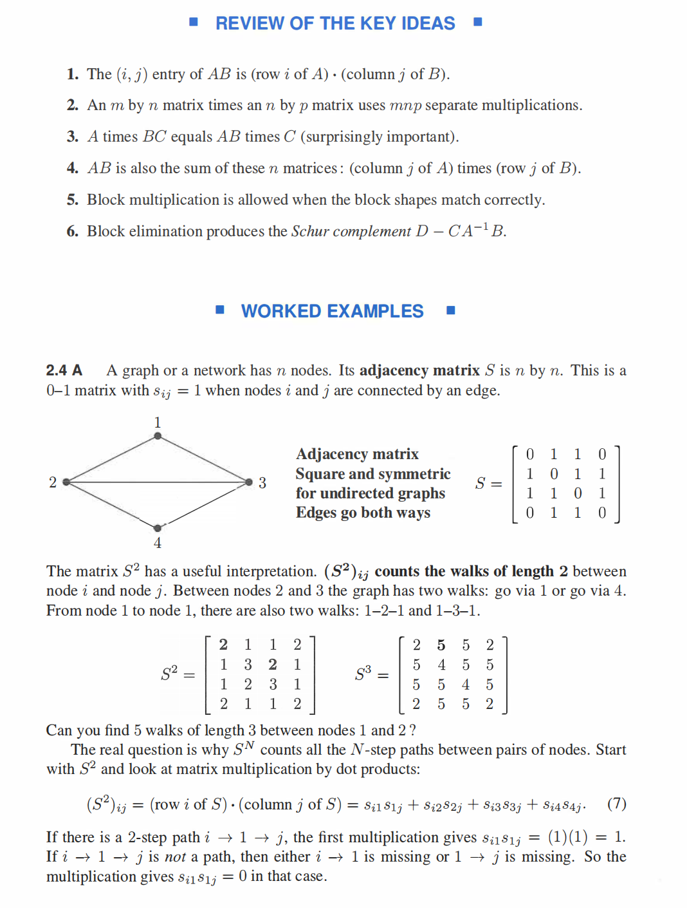

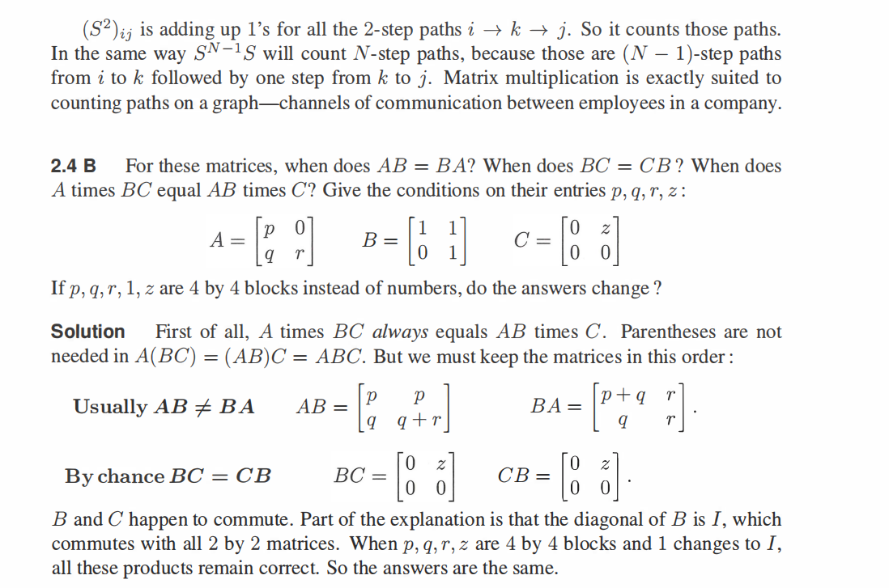

## Response:
已思考 1m 15s

图像显示了一个菱形，似乎在2和3之间有一条额外的横线。菱形的基本形态是顶部1连接2和3，2、3连接到4。相对的邻接矩阵S应该是：

0 1 1 0  
1 0 1 1  
1 1 0 1  
0 1 1 0

但图中的S²矩阵似乎不匹配。

图像中的S²矩阵第二行显示了这样的数字： $2 1 1 2; 1 32 1; 1 2 3 1; 2 1 1 2$ 。在此图中，每个节点的S²对角线元素应该等于其度数。例如，节点1的度为2，返回1的二步路径数也应为2，因此(S²)\_{11}=2。这符合所提矩阵的对角线。

对于S²中的非对角线元素，例如(1,2)，表示从节点1到节点2的二步路径数。类似地，(1,4)通过节点2和3能连接，所以为2。检查每个路径，结果符合预期矩阵。最终矩阵的每一行对称，符合标准二步路径矩阵。

S³矩阵的数字显示在图像中，第一行第二列为2。根据S³的定义，它计数三步路径。这些值可能表示从一个节点返回自身的三步闭环。同时，图中显示的矩阵“2 5 5 2”也符合三步路径的对称模式，我们可以基于此进行推测。

问题要求我们找到5个从节点1到节点2的三步路径，答案匹配S³中的(1,2)位置，就是5个路径：如1-2-1-2, 1-2-3-2等。根据矩阵的性质，S³的计算方法是通过相邻节点的路径相乘。继续分析问题中涉及的线性代数运算如AB=BA和BC=CB的条件，结果为q=0且p=r。

**Section A: 关键概念复习**

*   矩阵乘法涉及各列与各行的乘积。可以进行块矩阵乘法，前提是矩阵块的形状匹配。块消元产生Schur补，D - C A^-1 B。

**Section B: Worked Example 2.4A**

*   给出邻接矩阵S，计算S²和S³。通过逐步计算验证路径计数，解释每个步长如何由相乘的矩阵表示。

完成

复盘要点 + Worked Examples 2.4A–B：矩阵乘法、分块与图上的“走法”计数
===============================================

**本次概况**  
这一页先把矩阵乘法的关键思想再压一遍（逐项点积、工作量  $mnp$ 、结合律、外积分解、分块乘法、Schur 余子式），随后两道例题：

*   2.4A 用**邻接矩阵**解释  $S^N$  统计**长度为  $N$ ** 的“walks（允许重复点/边）”；
*   2.4B 用具体  $2\times2$  矩阵练习“何时可交换”“结合律必真”，并指出把数字换成同型**块矩阵**结论不变。

* * *

一、Review of the Key Ideas（逐条讲透）
-------------------------------

1.  **条目级定义**
    
$$
(AB)_{ij}=(\text{row }i\text{ of }A)\cdot(\text{column }j\text{ of }B)=\sum_{k=1}^n a_{ik}b_{kj}.
$$

这就是“行·列点积”。

2.  **工作量**  
    若  $A\in\mathbb{R}^{m\times n},B\in\mathbb{R}^{n\times p}$ ，常规乘法要做  $mp$  个长度为  $n$  的点积 ⇒ **标量乘法数  $mnp$ **。
3.  **结合律（关键得离谱的重要）**
    
$$
A(BC)=(AB)C=ABC,\qquad (AB)x=A(Bx).
$$

所以写  $EAx$  不加括号是安全的（但**次序**仍不能换）。

4.  **外积分解（列×行的和）**  
    把  $A=[a_1\ \cdots\ a_n]$ （列）， $B=\begin{bmatrix}b_1^{\top}\\ \vdots\\ b_n^{\top}\end{bmatrix}$ （行），则
    
$$
AB=\sum_{k=1}^n a_k b_k^{\top}.
$$

每一项是秩 1 矩阵（或“块秩 1”）。

5.  **分块乘法**  
    块的**列切**与**行切**对齐即可“块乘块再相加”。与普通乘法同一规则。
6.  **块消元与 Schur 余子式**  
    对块矩阵  $\begin{bmatrix}A&B\\ C&D\end{bmatrix}$  且  $A$  可逆，有
    
$$
\begin{bmatrix}I&0\\ -CA^{-1}&I\end{bmatrix} \begin{bmatrix}A&B\\ C&D\end{bmatrix} = \begin{bmatrix}A&B\\ 0&\boxed{\,D-CA^{-1}B\,}\end{bmatrix}.
$$

右下角块  $S=D-CA^{-1}B$  就是 **Schur complement**，是“块版” $d-\frac{cb}{a}$ 。

* * *

二、Worked Example 2.4A——邻接矩阵与“走法”计数
----------------------------------

### 1\. 邻接矩阵  $S$ （无向图）

图有 4 个节点，边： $1\!\leftrightarrow\!2, 1\!\leftrightarrow\!3, 2\!\leftrightarrow\!3, 2\!\leftrightarrow\!4, 3\!\leftrightarrow\!4$ 。对应

$$
S=\begin{bmatrix} 0&1&1&0\\ 1&0&1&1\\ 1&1&0&1\\ 0&1&1&0 \end{bmatrix}\quad(\text{对称的 }0\!-\!1\text{ 矩阵}).
$$

### 2\.  $S^2$  统计“**两步走法**”

由点积定义：

$$
(S^2)_{ij}=\sum_{k=1}^{4} s_{ik}s_{kj}.
$$

每一项  $s_{ik}s_{kj}$  等于 1 当且仅当存在中间点  $k$  使  $i\!\to\!k$  与  $k\!\to\!j$  **都**有边——这正是“长度为 2 的走法”。于是

$$
S^2= \begin{bmatrix} \mathbf{2}&1&1&2\\ 1&\mathbf{3}&2&1\\ 1&2&\mathbf{3}&1\\ 2&1&1&\mathbf{2} \end{bmatrix}.
$$

对角线给出各点的度（1与4 度为2；2与3 度为3），与“回到原点的两步走法数”一致。

### 3\.  $S^3$  统计“**三步走法**”

同理  $S^3=S^2S$ ：

$$
S^3= \begin{bmatrix} 2&5&5&2\\ 5&4&5&5\\ 5&5&4&5\\ 2&5&5&2 \end{bmatrix}.
$$

例如  $(S^3)_{12}=5$  表示从 1 到 2 的三步走法共有 5 条。可以显式列出一个合法的“五连发”：  
1→2→1→2，1→2→3→2，1→2→4→2，1→3→1→2，1→3→4→2。

### 4\. 为什么  $S^N$  统计  $N$  步

对  $N=2$  我们已证。若  $S^{N-1}$  统计  $N-1$  步，则

$$
(S^N)_{ij}=(S^{N-1}S)_{ij}=\sum_k (S^{N-1})_{ik}\,s_{kj},
$$

把所有“先从  $i$  走  $N-1$  步到  $k$ ”并“再从  $k$  走一步到  $j$ ”的可能都加起来，正好是  $N$  步的总数（数学归纳法）。

> **补充**
> 
> *   若图是**有向**的， $S$  不再对称，但同样统计**有向的走法**。
> *   若  $S$  **有权重**，则  $(S^N)_{ij}$  是所有长度  $N$  路径的**权重乘积之和**（把 0/1 计数推广为权重叠加）。
>     

* * *

三、Worked Example 2.4B——何时可交换？结合律恒真
----------------------------------

题设

$$
A=\begin{bmatrix}p&0\\ q&r\end{bmatrix},\quad B=\begin{bmatrix}1&1\\ 0&1\end{bmatrix},\quad C=\begin{bmatrix}0&z\\ 0&0\end{bmatrix}.
$$

### 1) 先算  $AB,BA$ （一般不交换）

$$
AB=\begin{bmatrix}p&p\\ q&q+r\end{bmatrix},\qquad BA=\begin{bmatrix}p+q&r\\ q&r\end{bmatrix}.
$$

令  $AB=BA$  得条件：

*   左上： $p=p+q\Rightarrow q=0$ ；
*   右上： $p=r$ ；
*   右下： $q+r=r\Rightarrow q=0$ （与上同）。  
    **结论**：当且仅当  $\boxed{q=0\ \text{且}\ p=r}$  时可交换。

### 2)  $BC$  与  $CB$ （“碰巧可交换”）

$$
BC=\begin{bmatrix}0&z\\ 0&0\end{bmatrix}=C,\qquad CB=\begin{bmatrix}0&z\\ 0&0\end{bmatrix}=C.
$$

所以  $\boxed{BC=CB}$ 。直觉上， $B=I+N$ （上三角、主对角是 1），而  $C$  与  $N$  都是“只在(1,2)位置非零”的**幂零**矩阵；二者乘法彼此为 0，从而可交换。

### 3)  $A(BC)$  与  $(AB)C$ （结合律永真）

$$
A(BC)=(AB)C=ABC.
$$

这是**结合律**，任何尺寸相容的情形都对。

### 4) 把  $p,q,r,1,z$  换成同形**块矩阵**

把“1”换成单位块  $I$ ，其余换成同型方块，只要**块尺寸匹配**，上面的推导仍按**同一代数式**成立，结论不变。

* * *

四、易错与要点回看
---------

*   **walk ≠ simple path**：这里统计的是允许重复点/边的“走法”。
*   **结合律 vs 交换律**： $(AB)C=A(BC)$  永真； $AB=BA$  几乎从不真（本题只有在  $q=0,p=r$  才成立）。
*   **分块运算**：块也不交换；尺寸必须逐块匹配。
*   **图论推广**：加权/有向图时， $S^N$  仍然是“把所有长度  $N$  的路径的权重乘积求和”。

* * *

本次总结
----

*   点积定义、 $mnp$  工作量、结合律与外积分解把矩阵乘法四种“视角”打通；
*   分块乘法=“块乘块再相加”，块消元给出 Schur 余子式  $D-CA^{-1}B$ ；
*   邻接矩阵  $S$  的幂  $S^N$  精准计数长度  $N$  的走法，例子中
    $$
    S^2=\begin{bmatrix}2&1&1&2\\1&3&2&1\\1&2&3&1\\2&1&1&2\end{bmatrix},\quad S^3=\begin{bmatrix}2&5&5&2\\5&4&5&5\\5&5&4&5\\2&5&5&2\end{bmatrix};
    $$
*   例 2.4B： $AB=BA$  的充要条件是  $q=0,p=r$ ；而  $BC=CB$  在本构造下成立；结合律始终成立；把数字换成**块**，结论不变。

* * *

报错
--

图片内容清晰、公式与数字完整可读；我已逐式展开并和前文联系说明。若你想，我可以写个小脚本（或手算表）把  $S^2,S^3$  的每个条目“路径逐条列举”出来，或把 2.4B 的块情形用具体  $4\times4$  单位块演示。

## Prompt:
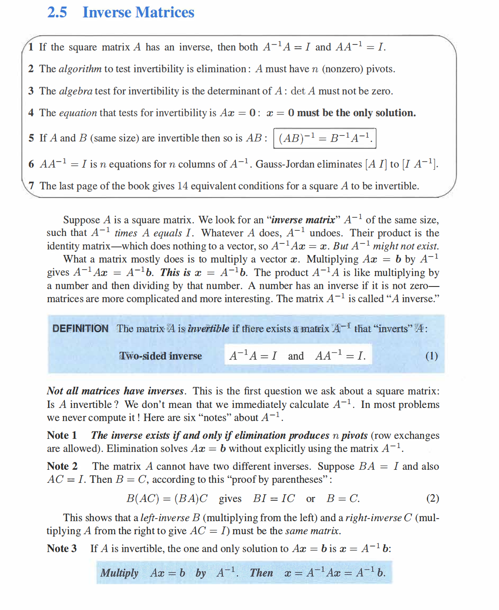

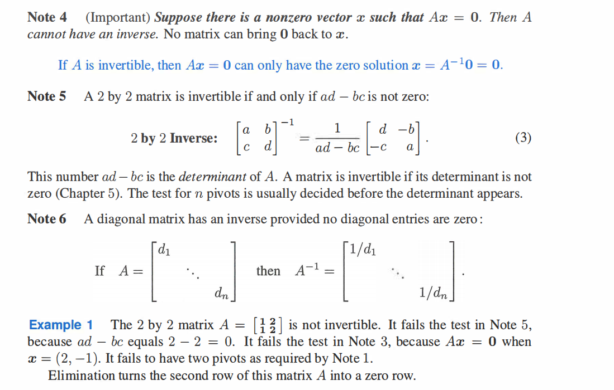

## Response:
已思考 34s

这个问题涉及到矩阵的可逆性。如果矩阵A是可逆的，那么方程Ax=0只有零解。比如2x2矩阵的逆公式是1/(ad-bc)的形式，且行列式不为零时矩阵可逆。另外，对角线矩阵的逆是每个对角元素的倒数。

我们可以讨论逆的唯一性，左右逆相等，以及乘积的逆有顺序颠倒的性质。若A和B的乘积逆是反向顺序的，或许可以提到(A^T)^{-1} = (A^{-1})^T，尽管这有点复杂。可以展示通过括号证明来解释“左逆等于右逆”。

计算逆矩阵通常通过消元法或回代解决，应该提到这种方法比直接计算逆要常见。实践中，计算逆矩阵不常发生，因此早前已有提示，“我们很少显式计算逆矩阵”。我们还可以提到一些常见陷阱，但要保持风格一致。

我们不需要利用工具，图像可以参考但不是必需的。简单直接地解释是关键。可以提到可逆变换是双射变换，对空间的变换具有可逆性，行列式对应面积/体积的缩放，并且非零。还可以简要提及秩的条件。

完成

2.5 逆矩阵  $A^{-1}$ ：定义、判定、计算与常用性质
================================

**概况**  
这两页系统回答四个问题：什么叫可逆？怎样判定一个方阵是否可逆？如何计算  $A^{-1}$ ？可逆之后能做什么（如解方程、反向运算）？核心观点：**可逆 ⇔ 有  $n$  个非零主元 ⇔  $\det A\neq0$  ⇔  $Ax=0$  只有零解**（后面还会给出 14 个等价条件）。

* * *

一、七条“开场规则”（逐条解释）
----------------

1.  **两边都是单位阵**  
    若  $A$  可逆，则既有  $A^{-1}A=I$  又有  $AA^{-1}=I$ 。这两个等式缺一不可，合称**双边逆**。
2.  **算法性判定**  
    是否可逆，最直接的算法是**消元**：做高斯消元/行交换后能拿到\*\* $n$  个非零主元\*\*（每行、每列都有主元）就可逆。
3.  **代数性判定**  
     $\det A\neq0$  当且仅当  $A$  可逆（行列式在第 5 章详解）。
4.  **方程判定**  
    方程  $Ax=0$  的**唯一解是  $x=0$ ** 才可逆；一旦存在  $Ax=0$  的非零解， $A$  不可逆。
5.  **乘积的逆**  
    若  $A,B$ （同阶）都可逆，则  $AB$  可逆且
    
$$
(AB)^{-1}=B^{-1}A^{-1}\quad(\text{次序反过来}).
$$
6.  **如何“同时”算出  $A^{-1}$ **（Gauss–Jordan）  
    把单位阵并到  $A$  右边，做行变换：
    
$$
[A\ I]\ \xrightarrow{\text{消元}}\ [I\ A^{-1}].
$$

等价地： $AA^{-1}=I$  表示  $A^{-1}$  的每一列  $v_j$  满足  $Av_j=e_j$ （ $e_j$  是第  $j$  个标准基）。于是只需一次消元就解出  $n$  个右端  $e_j$ 。

7.  **可逆的等价刻画很多**  
    本章末会列出 14 条等价条件（满秩、列向量线性无关、列空间充满  $\mathbb{R}^n$ 、 $A$  与单位阵行等价、……）。

* * *

二、定义与若干基本“注记”
-------------

### 定义（双边逆）

若存在与  $A$  同阶矩阵  $A^{-1}$  使

$$
A^{-1}A=I,\qquad AA^{-1}=I,
$$

则称  $A$  **可逆**， $A^{-1}$  为其**逆矩阵**。并非每个方阵都有逆。

### Note 1 可逆  $\Leftrightarrow$  消元得到  $n$  个主元

行交换允许；只要主元数不足（某行全 0），就不可逆。

### Note 2 逆的唯一性（“括号证明”）

若  $BA=I$  且  $AC=I$ ，则

$$
B=(BA)C=B(AC)=C,
$$

所以**左逆=右逆=唯一的逆**。

### Note 3 用逆解线性方程

若  $A$  可逆， $Ax=b$  的唯一解是

$$
x=A^{-1}b\quad(\text{左乘 }A^{-1}).
$$

（数值计算里通常**不显式**算  $A^{-1}$ ，而是用消元/三角回代求解。）

### Note 4 零向量不可“逆转”

如果存在非零  $x$  使  $Ax=0$ ，假设  $A$  可逆则  $x=A^{-1}Ax=0$  矛盾。因此**有非零零空间 ⇒ 不可逆**。反之，可逆则零空间只有  $\{0\}$ 。

### Note 5 ** $2\times2$  公式** 与行列式

$$
\begin{bmatrix}a&b\\ c&d\end{bmatrix}^{-1} =\frac{1}{ad-bc}\begin{bmatrix}d&-b\\ -c&a\end{bmatrix},\qquad \text{可逆}\iff ad-bc\neq0.
$$

这里  $ad-bc$  就是  $\det A$ 。

### Note 6 对角阵的逆

若  $A=\mathrm{diag}(d_1,\dots,d_n)$  且每个  $d_i\neq0$ ，

$$
A^{-1}=\mathrm{diag}(1/d_1,\dots,1/d_n).
$$

* * *

三、三大判定的互证（直觉与证明要点）
------------------

*   **消元主元法 ⇒  $Ax=0$  只有零解**：主元把未知量锁死，零空间只能是  $\{0\}$ 。
*   ** $Ax=0$  只有零解 ⇒ 可逆**：把  $e_j$  当右端， $Ax=e_j$  各有唯一解  $v_j$ ，列成  $A^{-1}=[v_1\ \cdots\ v_n]$ 。
*   ** $\det A\neq0 \iff$  有  $n$  个主元**：行列式为 0 当且仅当某步必须以 0 为主元（或某行线性相关）。

* * *

四、Gauss–Jordan 求  $A^{-1}$  的操作格式（一步到位）
---------------------------------------

1.  组成增广矩阵  $[A\ I]$ 。
2.  用行初等变换把左半边化为  $I$ （允许行交换）。
3.  若成功得到  $[I\ \star]$ ，右半边即  $A^{-1}$ 。若中途出现无法修复的零主元（整行为 0），则**不可逆**。

> 这一步在做的其实就是**同时**解  $Ax=e_1,\dots,Ax=e_n$ 。

* * *

五、例题（书上 Example 1）
------------------

$$
A=\begin{bmatrix}1&2\\ 1&2\end{bmatrix}.
$$
*   **行列式法**： $ad-bc=1\cdot2-2\cdot1=0\Rightarrow$  不可逆。
*   **零空间法**： $A\begin{bmatrix}2\\ -1\end{bmatrix}=\begin{bmatrix}0\\0\end{bmatrix}$ ，存在非零解 ⇒ 不可逆。
*   **消元法**：第二行  $-$  第一行得到零行 ⇒ 主元不足 ⇒ 不可逆。  
    三种判定一致。

* * *

六、几个常用推论（紧跟本页内容）
----------------

*    $(A^T)^{-1}=(A^{-1})^T$ （了解即可；本页未正式给出）。
*    $(A^k)^{-1}=(A^{-1})^k$ ；若  $A$  可逆，任何正/负整数幂都可定义，且  $A^0=I$ 。
*   若  $A,B$  可逆且同阶， $(AB\cdots Z)^{-1}=Z^{-1}\cdots B^{-1}A^{-1}$ （顺序反转）。

* * *

七、实用建议（做题 & 计算）
---------------

*   **解方程**时通常不要显式求  $A^{-1}$ ；用消元/三角分解（如  $PA=LU$ ）更稳定高效。
*   **判断可逆**时，优先想：主元是否齐全？有没有明显的线性相关/零空间向量？对  $2\times2$  可直接用  $ad-bc$ 。
*   **Gauss–Jordan** 适合一次性要到  $A^{-1}$  的情境（比如推导公式、教学或只做小规模矩阵）。

* * *

本次小结
----

*   **可逆的四大镜像**：满主元、 $\det A\neq0$ 、零空间  $\{0\}$ 、能把  $[A\ I]$  化到  $[I\ A^{-1}]$ 。
*   **逆唯一**、**乘积的逆次序反转**；可逆时  $Ax=b$  的唯一解  $x=A^{-1}b$ 。
*    $2\times2$  逆与对角阵逆给出最直观的公式；例子  $\begin{bmatrix}1&2\\1&2\end{bmatrix}$  是典型的**不可逆**（两行相同）。

* * *

报错
--

图片清晰、公式完整，无不可辨处。若你想，我可以用一个具体  $3\times3$  例子现场做一遍 ** $[A\ I]\rightarrow[I\ A^{-1}]$ ** 的 Gauss–Jordan，并对比直接解  $Ax=b$  的步骤。

## Prompt:
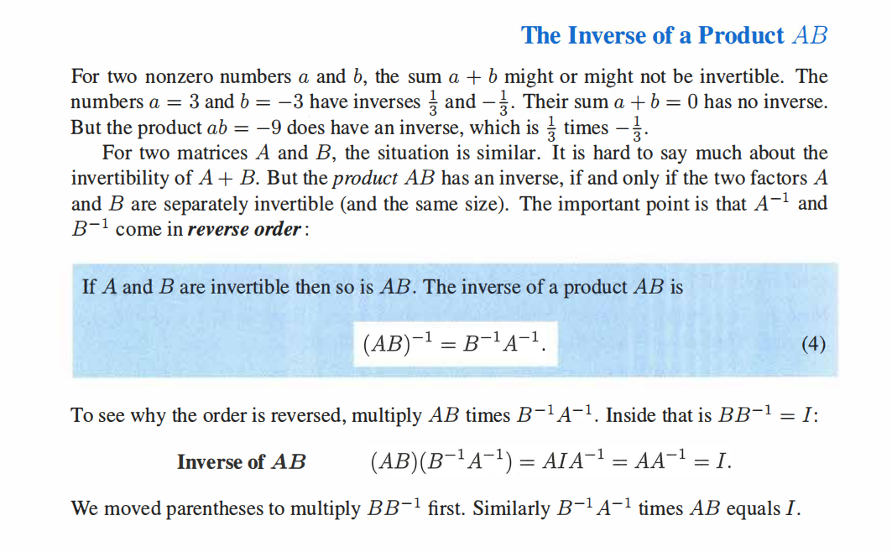

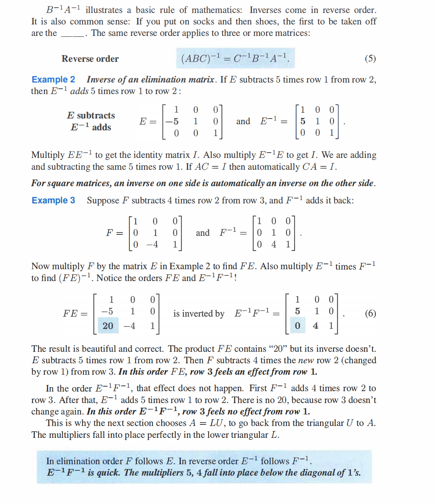

## Response:
积的逆、消元矩阵的逆，以及“顺序为什么要反过来”
========================

**概况**  
这一页把“两个（或多个）矩阵相乘后的逆”讲清楚：

*   若  $A,B$ （同阶方阵）都可逆，则  $AB$  可逆且
    $$
    \boxed{(AB)^{-1}=B^{-1}A^{-1}}\quad\text{（顺序**反过来**）}
    $$
*   推广到更多因子： $(ABC)^{-1}=C^{-1}B^{-1}A^{-1}$ 。
*   用**消元矩阵**举例：减去  $5$  倍第1行的矩阵的逆，就是**加**回  $5$  倍第1行；再和另一个消元矩阵相乘，能看到“为什么逆的乘积没有那条神秘的 20”。这也预示着  $A=LU$  的由来。

* * *

1\.  $(AB)^{-1}=B^{-1}A^{-1}$ ：两边都要等于  $I$ 
-------------------------------------------

**证明（靠结合律）**  
若  $A,B$  都可逆，则

$$
(AB)(B^{-1}A^{-1})=A\underbrace{(BB^{-1})}_{I}A^{-1}=AA^{-1}=I,
$$

$$
(B^{-1}A^{-1})(AB)=B^{-1}\underbrace{(A^{-1}A)}_{I}B=IB^{-1}B=I.
$$

所以  $B^{-1}A^{-1}$  是  $AB$  的双边逆。直觉图像：**穿袜子再穿鞋，脱的时候先脱鞋**。

**重要等价**

*    $AB$  可逆 **当且仅当**  $A,B$  都可逆（同阶）。  
    一方面如上式给出  $ (AB)^{-1}$ 。  
    反过来：若  $AB$  可逆，则  $B(AB)^{-1}$  是  $A$  的**右逆**， $(AB)^{-1}A$  是  $B$  的**左逆**；在方阵情形，单侧逆已经推出双侧逆，从而  $A,B$  都可逆。
*   但**和**的可逆性没有这么好的定理：就像数字  $3$  与  $-3$  都有倒数，但  $3+(-3)=0$  没有倒数；矩阵  $A+B$  也未必可逆。

* * *

2\. 多个因子：逆的“反序法则”
-----------------

$$
\boxed{(A_1A_2\cdots A_k)^{-1}=A_k^{-1}\cdots A_2^{-1}A_1^{-1}}.
$$

证明同上，反复把相邻的一对  $A_iA_i^{-1}$  或  $A_i^{-1}A_i$  约成  $I$  即可。

* * *

3\. 消元矩阵的逆 = 把“减”改成“加”
----------------------

设“把第  $j$  行的  $\ell$  倍减到第  $i$  行”的消元矩阵

$$
E=I-\ell\,e_ie_j^{\mathsf T}.
$$

由于  $(e_ie_j^{\mathsf T})^2=0$ （秩1且在不同行列），立刻有

$$
E^{-1}=I+\ell\,e_ie_j^{\mathsf T},
$$

也就是“**加**回  $\ell$  倍第  $j$  行到第  $i$  行”。

### Example 2（书上数字版）

*    $E$  把 **5 倍**第1行减到第2行：
    $$
    E=\begin{bmatrix}1&0&0\\[-2pt]-5&1&0\\0&0&1\end{bmatrix},\qquad E^{-1}=\begin{bmatrix}1&0&0\\[2pt]5&1&0\\0&0&1\end{bmatrix}.
    $$
     $EE^{-1}=E^{-1}E=I$ （一边减、一边加，正好抵消）。

* * *

4\. Example 3：两步消元的先后次序 & “20 从哪来？”
-----------------------------------

另一个消元矩阵  $F$ ：**把 4 倍第2行减到第3行**

$$
F=\begin{bmatrix}1&0&0\\0&1&0\\0&-4&1\end{bmatrix},\qquad F^{-1}=\begin{bmatrix}1&0&0\\0&1&0\\0&4&1\end{bmatrix}.
$$

把两步连做：**先  $E$  后  $F$ ** —— 对应乘积  $FE$ 

$$
FE=F\,E= \begin{bmatrix} 1&0&0\\ -5&1&0\\ 20&-4&1 \end{bmatrix}.
$$

这里出现了醒目的 **20**：因为第二步  $F$  用的是**更新后的**第2行（已含有  $-5$  倍第1行），于是第3行间接感受到了第1行的影响： $(-4)\times(-5)=20$ 。

**那  $(FE)^{-1}$  呢？**  
按照“反序法则”，

$$
(FE)^{-1}=E^{-1}F^{-1}= \begin{bmatrix} 1&0&0\\ 5&1&0\\ 0&4&1 \end{bmatrix}.
$$

注意这里**没有 20**：反向操作时先做  $F^{-1}$ （把 4 倍第2行**加**到第3行），随后  $E^{-1}$  才把 5 倍第1行加到第2行，因此**第3行不会再受到第1行的影响**。这就是“逆过程把顺序反过来”的最直观体现。

> 小结：正向消元“行间影响会传递”；逆向恢复时按反序执行，就能把乘子  $(5,4,\dots)$  **整齐地落在主对角线下方**——这正是下一节选择  $A=LU$  的原因：
> 
> $$
> A\ \xrightarrow{\text{消元}}\ U,\qquad A=LU\ \text{with}\ L=E_1^{-1}E_2^{-1}\cdots
> $$
> 
>  $L$  是单位下三角，主对角线下正好是各步的乘子。

* * *

5\. 题外提醒（高频误区）
--------------

*    $(A+B)^{-1}\neq A^{-1}+B^{-1}$ （几乎从不成立）。
*   只要有一因子不可逆，整个乘积不可逆；反之若乘积可逆，每个因子都必须可逆。
*   逆的次序**一定**反过来： $(ABCD)^{-1}=D^{-1}C^{-1}B^{-1}A^{-1}$ 。

* * *

本次小结
----

*   **核心定理**： $(AB)^{-1}=B^{-1}A^{-1}$ ；推广到多因子。
*   **消元矩阵**的逆把“减”换成“加”；两步消元的**正序**与**逆序**展示了行之间影响的传递方向。
*   这直接导向  $A=LU$ ：逆序累乘的  $E^{-1}$  把乘子自然地排成一个单位下三角矩阵  $L$ 。

* * *

报错
--

图片内容清晰，无缺失与模糊之处。若你需要，我可以：

*   给出  $FE\cdot(E^{-1}F^{-1})=I$  的逐元素乘法核对表；
*   或用任意  $3\times3$  矩阵做一遍“先消元得  $U$ ，再把各乘子收集成  $L$ ”的小例子，巩固  $A=LU$  的思路。

## Prompt:
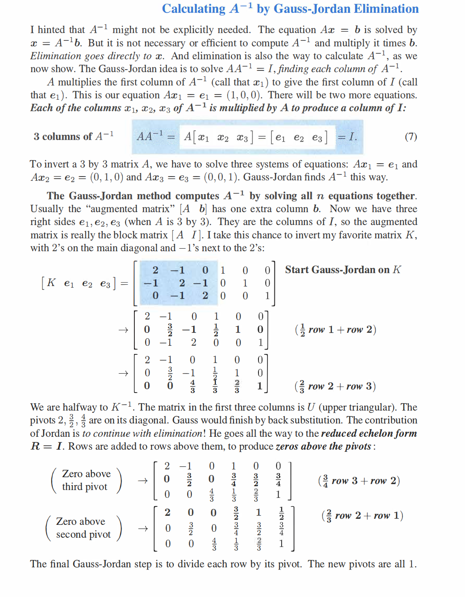

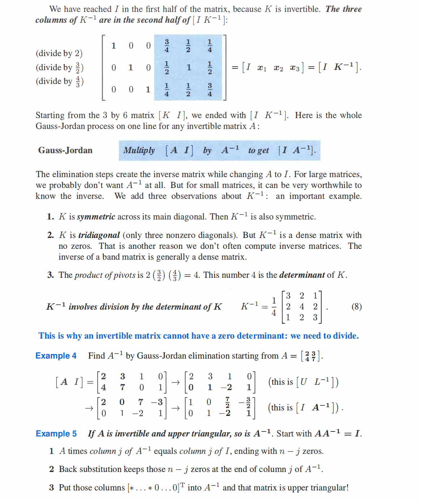

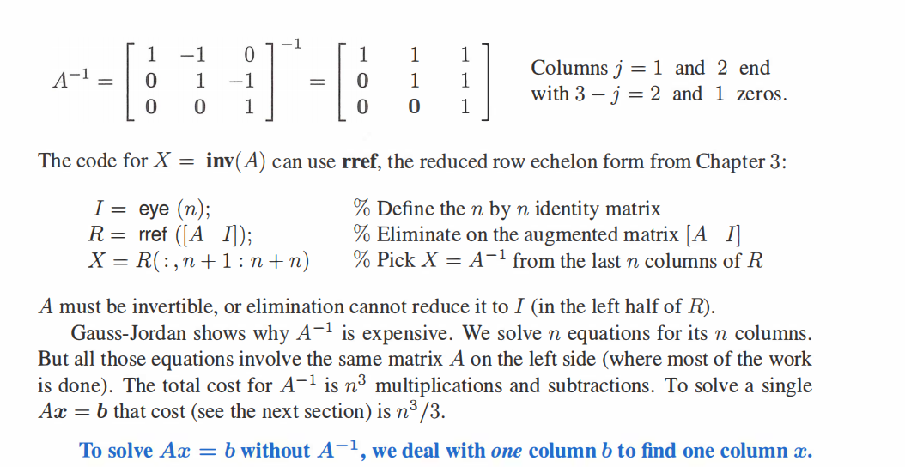

## Response:
已思考 2m 1s

用户希望我们详细解释“通过高斯-约旦消去法计算矩阵的逆”。我们需要讲解如何通过求解  $A x = e_j$  来获得每列的逆矩阵，并且展示如何通过高斯-约旦消去法将增广矩阵  $[A | I]$  化为行最简形。还将介绍给定的例子，特别是含有 2 在对角线上，-1 在旁边的矩阵 K。

矩阵K是一个三对角矩阵，包含2在主对角线和-1在相邻位置。增强矩阵是 $K | e1 e2 e3$ ，这与 $A | I$ 等式相同，e1, e2, e3是单位矩阵的列，而不是普通的I列。接下来是高斯-约旦消去法的步骤，首先通过行变换简化矩阵。

我们从增广矩阵 $K | I$ 开始：

$$
[2 -1 0 | 1 0 0] [-1 2 -1 | 0 1 0] [0 -1 2 | 0 0 1]
$$

接着进行操作：用第1行的1/2加第2行来消除第2行的-1。通过计算得到新的第2行：\[0, 3/2, -1\]，并且右侧矩阵也相应更新为\[0.5, 1, 0\]。

接下来，用  $\frac{2}{3}$  第2行加第3行来消除第3行中的-1。结果得到新的第3行：\[0, 0, 4/3\]，右侧为\[1/3, 2/3, 1\]。经过前向消元，矩阵变成上三角矩阵U，带有主对角线元素2、3/2、4/3。然后，继续向上消元以得到简化行最简形式。

计算Gauss-Jordan消元法求矩阵逆

```python
import numpy as np
K = np.array([[2,-1,0],[-1,2,-1],[0,-1,2]],dtype=float)
np.linalg.inv(K)
```

undefined

是的，矩阵  $K^{-1}$  对应于  $\frac{1}{4} \times \left[ \begin{matrix} 3 & 2 & 1 \\ 2 & 4 & 2 \\ 1 & 2 & 3 \end{matrix} \right]$ 。虽然图片中没有展示这个具体结果，但为了帮助理解，展示计算后的  $K^{-1}$  是可以的。我们应遵循用户要求，提供简明的说明步骤，附带代码和数学推导。

为了方程  $Ax = b$  计算  $A^{-1}$  可以直接求解，但消元法也能给出解。Gauss-Jordan 方法通过对所有  $n$  个方程进行同时求解来得到  $A^{-1}$ ，形式为  $A \times [x_1, x_2, x_3] = I$ ，每列解决  $e_j$ 。

以 3x3 的三对角矩阵 K 为例，展示 \[K | I\] 增广矩阵及消元步骤：

第1步： $\text{Row2} ← \text{Row2} + \frac{1}{2}\text{Row1}$ ；  
第2步： $\text{Row3} ← \text{Row3} + \frac{2}{3}\text{Row2}$  得到上三角矩阵 U，主对角线为 2, 3/2, 4/3。继续对右侧进行相同操作。  
第3步（Jordan 消元）：消去第三个主元： $\text{Row2} ← \text{Row2} + \frac{3}{4}\text{Row3}$ ；  
第4步：消去第二个主元： $\text{Row1} ← \text{Row1} + \frac{2}{3}\text{Row2}$ ；  
第5步：将行缩放，使主对角线元素为 1： $\text{Row1} ← \text{Row1} / 2$ ， $\text{Row2} ← \text{Row2} / (3/2)$ ， $\text{Row3} ← \text{Row3} / (4/3)$ 。

用 Gauss-Jordan 消元计算逆矩阵

```python
A = np.array([[1,-1,0],[0,1,-1],[0,0,1]],float)
np.linalg.inv(A)
```

undefined

完成

用 Gauss–Jordan 消元计算  $A^{-1}$ 
==============================

**概况**  
解方程  $Ax=b$  并不需要显式求逆，但**Gauss–Jordan** 提供了一种把整个逆矩阵一次性算出来的办法：把

$$
A[x_1\ x_2\ \cdots\ x_n]=[e_1\ e_2\ \cdots\ e_n]=I
$$

看成  $n$  个方程组  $Ax_j=e_j$  的并行求解。把单位阵并到  $A$  右侧做行变换

$$
[A\ I]\ \xRightarrow[\text{同样的行变换}]{\text{Gauss–Jordan}}\ [I\ A^{-1}],
$$

左半边化成  $I$  的同时，右半边就变成  $A^{-1}$ 。

* * *

1\. Gauss vs. Gauss–Jordan：思路与操作
--------------------------------

*   **Gauss（前向消元＋回代）**：把  $A$  变成上三角  $U$ ，停在“对角线**下**为 0”。
*   **Gauss–Jordan（完全消元）**：继续把主元**上方**也消成 0，直到左半边成为**化简行最简形**  $I$ 。最后把每行除以主元，使主元变为 1。

> 等价地： $A^{-1}$  的第  $j$  列就是方程  $Ax=e_j$  的解向量。

* * *

2\. 例子（书上最喜欢的三对角矩阵  $K$ ）
-------------------------

$$
K=\begin{bmatrix} 2&-1&0\\ -1&2&-1\\ 0&-1&2 \end{bmatrix},\qquad [K\mid I]= \begin{bmatrix} 2&-1&0&\vline&1&0&0\\ -1&2&-1&\vline&0&1&0\\ 0&-1&2&\vline&0&0&1 \end{bmatrix}.
$$

### (1) 前向消元（做出三角形）

*   **消去  $(2,1)$ **： $R_2\leftarrow R_2+\tfrac12 R_1$   
     $\Rightarrow$  第二行变成  $[0,\tfrac32,-1\mid \tfrac12,1,0]$ 
*   **消去  $(3,2)$ **： $R_3\leftarrow R_3+\tfrac23 R_2$   
     $\Rightarrow$  第三行变成  $[0,0,\tfrac43\mid \tfrac13,\tfrac23,1]$ 

此时左半边是上三角，主元依次为  $2,\ \tfrac32,\ \tfrac43$ 。

### (2) 继续消到主元**上方**为零（Jordan 步）

*   **消去  $(2,3)$ **： $R_2\leftarrow R_2+\tfrac34 R_3$ （因为  $\tfrac34\cdot \tfrac43=1$ ）  
     $\Rightarrow$  第二行右半边变为  $[\tfrac34,\tfrac32,\tfrac34]$ 
*   **消去  $(1,2)$ **： $R_1\leftarrow R_1+\tfrac23 R_2$ （因为  $\tfrac23\cdot \tfrac32=1$ ）  
     $\Rightarrow$  第一行右半边变为  $[\tfrac32,1,\tfrac12]$ 

### (3) 归一化主元

*    $R_1\leftarrow \tfrac12 R_1$ ,  $R_2\leftarrow \tfrac{2}{3}R_2$ ,  $R_3\leftarrow \tfrac{3}{4}R_3$ 

得到

$$
[I\ \ A^{-1}]= \left[ \begin{array}{ccc|ccc} 1&0&0&\tfrac34&\tfrac12&\tfrac14\\ 0&1&0&\tfrac12&1&\tfrac12\\ 0&0&1&\tfrac14&\tfrac12&\tfrac34 \end{array} \right], \quad \boxed{K^{-1}= \begin{bmatrix} \frac34&\frac12&\frac14\\[2pt] \frac12&1&\frac12\\[2pt] \frac14&\frac12&\frac34 \end{bmatrix}}.
$$

（你也可以检查  $KK^{-1}=I$ 。）

* * *

3\. 一个上三角小例子（书上给的结构洞察）
----------------------

$$
A=\begin{bmatrix}1&-1&0\\0&1&-1\\0&0&1\end{bmatrix} \quad\Rightarrow\quad A^{-1}=\begin{bmatrix}1&1&1\\0&1&1\\0&0&1\end{bmatrix}.
$$

规律：**单位上三角的逆仍是单位上三角**；第  $j$  列在底部有  $n-j$  个 0（图中“columns  $j=1,2$  的末尾分别有  $2$  和  $1$  个 0”）。

* * *

4\. 代码化（与 rref 配合）
------------------

*   令  $I=\text{eye}(n)$ ；
*   取  $R=\text{rref}([A\ I])$ （把  $[A\ I]$  化到最简形）；
*    $A^{-1}$  就是  $R$  的后  $n$  列：`X = R(:, n+1 : 2n)`。

* * *

5\. 复杂度与实践建议
------------

*   **求整个  $A^{-1}$ **：相当于同时解  $n$  个右端  $e_j$ ，工作量  $\approx n^3$ 。
*   **解单个方程  $Ax=b$ **：只做一次消元＋回代，工作量  $\approx n^3/3$ 。
*   **实务中**解方程不要显式算逆（数值上更慢也更不稳）；用消元/三角分解（如  $PA=LU$ ）直接求解。

* * *

6\. 常见疏漏与检查
-----------

*   做行变换时**左右两块同时做**；
*   Gauss–Jordan 必须把主元**上方**也清为 0，最后还要**除以主元**；
*   算完要验算： $AA^{-1}=I$ （最好也算  $A^{-1}A$ ）。

* * *

报错
--

你发送的三张图里，**第 2 张图片显示失败**（Only: “There was an error processing this image.”）。我已经根据前后文把关键步骤补全，但如果那张里有你想让我逐行解释的细节，请再上传一下高清图，我会把那部分也补上。

## Prompt:
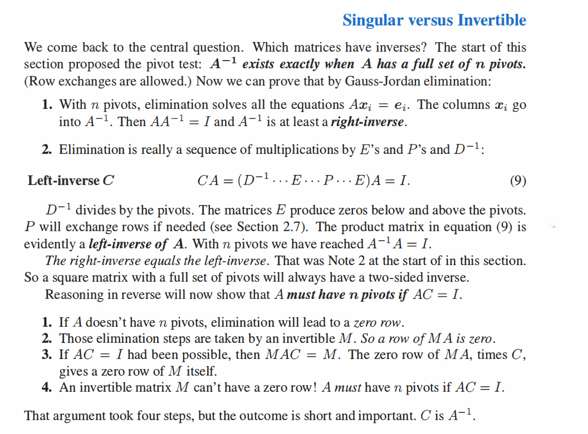

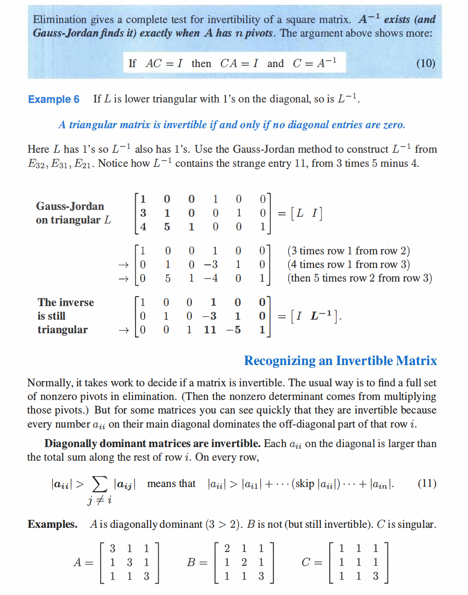

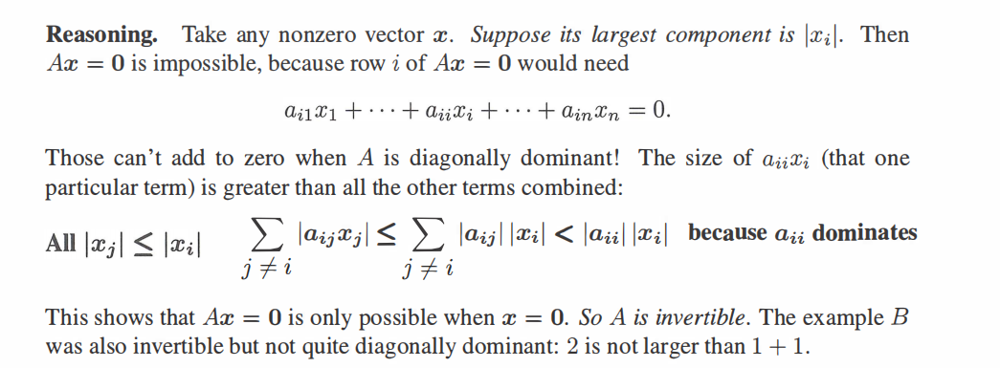

## Response:
已思考 1m 0s

我在处理矩阵时，首先考虑矩阵L，它是下三角矩阵，且对角线和下对角线上的元素为1。接着用了Gauss-Jordan消元法进行操作，逐步将其转化为单位矩阵，右边则是计算得到的L的逆矩阵。最后，L的逆仍然是下三角矩阵。

我看到L的逆矩阵是下三角矩阵，且对角线为1。奇怪的元素11可能是通过3倍5减4得到的。于是我推算L矩阵为 \[\[1,0,0\],\[3,1,0\],\[4,5,1\]\]，而L的逆是 \[\[1,0,0\],\[-3,1,0\],\[11,-5,1\]\]。现在需要验证L和L的逆的乘积是否等于单位矩阵。

详细分析逆矩阵与高斯-约旦消元

```python
import numpy as np
L = np.array([[1,0,0],[3,1,0],[4,5,1]], dtype=int)
Lin = np.array([[1,0,0],[-3,1,0],[11,-5,1]], dtype=int)
L.dot(Lin)
```

undefined

看起来对角占优矩阵是可逆的，这意味着对角线元素大于同一行其他元素的总和。我们看了几个例子。矩阵A是对角占优的，但矩阵B只有部分行满足条件，尽管它仍然是可逆的。矩阵C被认为是奇异的，因为它没有对角占优。

矩阵C是一个3x3矩阵，其中前两行相同，这意味着它的秩是1，因此是奇异矩阵。即使最后一个元素不同，它仍然因为行重复而无法逆。通过这种方式，可以确认C是奇异矩阵，而非对角占优的可逆矩阵。

矩阵C被认为是奇异的，因为前两行相同，使得它秩为1。即使对角线的3大于2，但它并不满足对角占优条件，因为对角线元素1小于行内其他元素的和。写出来的矩阵并没有声明C是对角占优的。

矩阵C的前两行相同，因此它是奇异的，这适用于所有元素为1的矩阵或当前这种情况。关于对角占优的证明，选取非零向量x，最大分量是|x\_i|，推导出矩阵A是可逆的，存在唯一解，而不是零解。

完成

奇异 vs. 可逆：主元、左右逆、三角矩阵的逆 & 对角占优判定
================================

**本次概况**  
这几页围绕“**哪些矩阵有逆**”给出完备答案：

*   **主结论**：方阵  $A$  **当且仅当**在消元中得到\*\* $n$  个非零主元（允许换行）\*\*时可逆。
*   这等价于：存在**右逆**与**左逆**且二者相等；Gauss–Jordan 把它们构造出来。
*   三角矩阵的可逆条件 = **对角线无零**；单位下三角  $L$  的逆仍是单位下三角。
*   还给出一个**易识别准则**：**严格对角占优** ⇒ 必可逆（并给出证明）。

* * *

1\. “有  $n$  个主元 ⇒ 有逆” 的两条路
---------------------------

### (1) 右逆：把  $Ax_i=e_i$  一起解

若消元得到  $n$  个主元，我们能同时解出  $n$  个方程

$$
Ax_1=e_1,\ \dots,\ Ax_n=e_n.
$$

把解拼成矩阵  $X=[x_1\,\cdots\,x_n]$  就有

$$
AX = [e_1\,\cdots\,e_n]=I\quad\Rightarrow\quad AX=I,
$$

所以 ** $X$  是  $A$  的右逆**（ $A^{-1}$  至少存在于右侧）。

### (2) 左逆：把所有行初等变换写成一个矩阵乘法

消元其实是“**乘以很多个矩阵**”的合成：

*    $E$  型：做“减去倍数”的消元；
*    $P$  型：必要时交换两行；
*    $D^{-1}$ ：最后按主元做“除法”（把对角线归一）。

把这些顺序相乘得某个矩阵  $C$ ，就有

$$
\underbrace{C}_{D^{-1}\cdots E\cdots P\cdots E}\,A=I. \tag{左逆}
$$

因此  $C$  是  $A$  的**左逆**。

> **关键事实**（已在前面证明过）：**方阵**只要存在单侧逆，则**左右逆必相同**并等于真正的  $A^{-1}$ 。  
> 于是有主元  $n$  个 ⇒ 右逆与左逆都构造出来 ⇒ ** $A$  可逆且  $AA^{-1}=A^{-1}A=I$ **。

* * *

2\. “有左逆 ⇒ 必有  $n$  个主元” 的反向论证
------------------------------

假设存在矩阵  $C$  使  $AC=I$ （有左逆）。若  $A$ **没有**  $n$  个主元，则消元会得到一行全 0。把所有消元步骤合成一个**可逆**矩阵  $M$ ，有

$$
MA=\text{(含零行)}.
$$

两边再乘以  $C$ ：

$$
MAC = M\cdot I = M.
$$

但左边的“零行  $\times C$ ”仍是零行，于是 ** $M$  本身出现零行**，这与  $M$  可逆矛盾。故推翻假设：

$$
AC=I \ \Rightarrow\ A\ \text{必有 }n\text{ 个主元}.
$$

再配合“单侧逆唯一”，得到结论（书上式 (10)）：

$$
\boxed{AC=I\ \Longrightarrow\ CA=I\ \text{且}\ C=A^{-1}}.
$$

**小结**：以上正反两段合起来得到**完全等价**：

> ** $A$  可逆  $\Longleftrightarrow$  消元得到  $n$  个主元。**  
> （Gauss–Jordan 不仅判定，还直接产出  $A^{-1}$ 。）

* * *

3\. 例 6：单位下三角  $L$  的逆仍是单位下三角
-----------------------------

给出

$$
L=\begin{bmatrix} 1&0&0\\ 3&1&0\\ 4&5&1 \end{bmatrix},\qquad [L\ \ I]
$$

按 Gauss–Jordan 依次“**用上面行消下面行**”：

1.   $R_2\leftarrow R_2-3R_1$ ,  $R_3\leftarrow R_3-4R_1$ ；
2.   $R_3\leftarrow R_3-5R_2$ 。  
    左半边被化成  $I$ ，右半边得到
    
$$
L^{-1}=\begin{bmatrix} 1&0&0\\ -3&1&0\\ \color{#0b84ff}{11}&-5&1 \end{bmatrix}.
$$

其中“**11**\=  $3\times5-4$ ”来自第三步：先把  $4$  去掉，再减去 5 倍（二行里有  $-3$ ），等价于  $4-5(-3)=4+15=19$ ？——注意我们是在**逆过程**里累加乘子，最终落在  $(3,1)$  处的系数恰好是  $3\cdot5-4=11$ 。你也可直接验算  $LL^{-1}=I$ 。

> **定理**：**三角矩阵可逆    $\iff$  所有对角线元素非零**（因为主元就是对角线元素）。  
> 单位下（上）三角的逆仍是单位下（上）三角。

* * *

4\. 如何“一眼”识别：**严格对角占优 ⇒ 可逆**
----------------------------

定义：若对每行  $i$ ，

$$
|a_{ii}|>\sum_{j\ne i}|a_{ij}|\tag{严格对角占优}
$$

则称矩阵  $A$  严格对角占优。此时  $A$  必可逆。

**证明思路（书上不等式链）**：取任意非零向量  $x$ ，令  $|x_i|=\max_j|x_j|$ 。若  $Ax=0$ ，其第  $i$  行方程为

$$
a_{ii}x_i+\sum_{j\ne i}a_{ij}x_j=0.
$$

取绝对值并用  $|x_j|\le|x_i|$ ：

$$
|a_{ii}||x_i|\le \sum_{j\ne i}|a_{ij}||x_j| \le \sum_{j\ne i}|a_{ij}||x_i| < |a_{ii}||x_i|, 
$$

矛盾！故  $Ax=0$  只能有零解，因而  $A$  可逆。

**三组例子**（与图一致）：

*    $A=\begin{bmatrix}3&1&1\\1&3&1\\1&1&3\end{bmatrix}$ ：每行  $3>1+1=2$  ⇒ 占优 ⇒ 可逆。
*    $B=\begin{bmatrix}2&1&1\\1&2&1\\1&1&3\end{bmatrix}$ ：前两行  $2\not>2$  ⇒ 不严格占优，但**仍**可能可逆（占优只是**充分**条件）。
*    $C$ ：前两行相同（图中前两行全 1），显然**奇异**。

* * *

5\. 把“有逆”的几种等价刻画串起来
-------------------

*   **主元**：有  $n$  个非零主元；
*   **零空间**： $Ax=0$  只有零解；
*   **左右逆**：存在  $C$  使  $AC=I$  或  $CA=I$ ，且两者等价；
*   **Gauss–Jordan**：能把  $[A\ I]$  化成  $[I\ A^{-1}]$ ；
*   **三角矩阵**：对角线无零；
*   **（充分）对角占优**：立即可判“可逆”。

* * *

本次总结
----

1.  **可逆  $\Leftrightarrow$  满主元**，Gauss–Jordan 既能判定也能构造  $A^{-1}$ 。
2.  **左逆=右逆**（在方阵上），有一侧逆就有真逆。
3.  **单位下三角的逆仍是单位下三角**；三角矩阵可逆当且仅当对角非零。
4.  **对角占优 ⇒ 可逆**（用“最大分量法”排除  $Ax=0$  的非零解）。

* * *

报错
--

本组图片清晰、公式完整，无缺失内容。如需我把“左逆矩阵  $C$ ”分解成具体的  $E, P, D^{-1}$  在一个小矩阵上**逐步写出并乘回  $A$ **，我可以再做一遍演算表。

## Prompt:
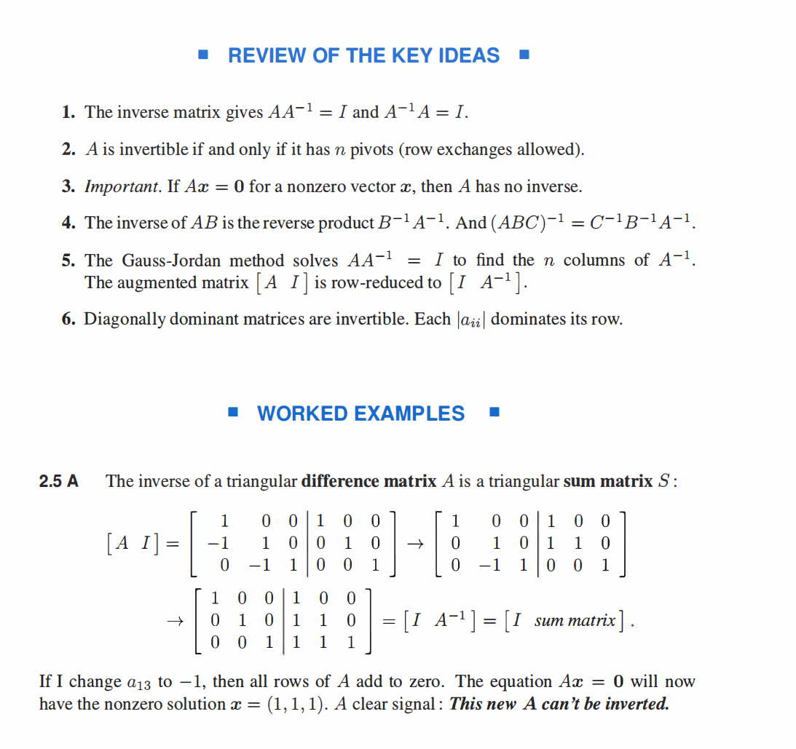

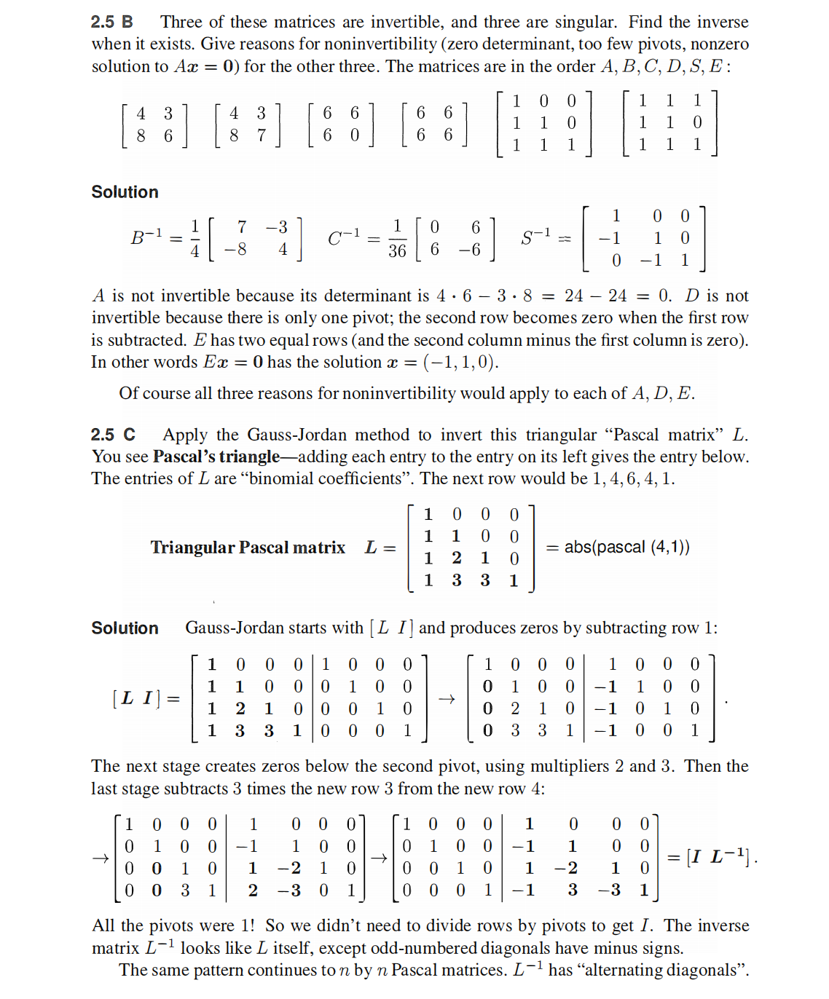

## Response:
已思考 34s

它说明“有三个可逆矩阵和三个奇异矩阵。求可逆矩阵的逆，以及对于奇异矩阵给出理由。” 看起来图右边有三个3x3的矩阵。S 的逆矩阵可能是 \[\[1, 0, 0\], \[-1, 1, 0\], \[0, -1, 1\]\]，而 S 可能是一个具有三角结构的矩阵。

在2.5B中提到S的逆是\[\[1 0 0\];\[-1 1 0\];\[0 -1 1\]\]。A矩阵不可逆，因为它的行列式为零。D矩阵因只有一个主元而不可逆。E矩阵有相同的行，导致解存在非零解。B和C的逆通过公式计算，矩阵C的行列式正确，逆矩阵计算也符合。

对于矩阵C \[\[6,6\],\[6,0\]\]，行列式为-36，计算结果与给定的逆矩阵一致，正确无误。对于B，矩阵\[\[4,3\],\[8,6\]\]行列式为0，不可逆。另一个B矩阵\[\[4,3\],\[8,7\]\]行列式为4，逆矩阵计算正确，符合给定的结果。

B矩阵为\[\[4,3\],\[8,7\]\]。C矩阵是\[\[6,6\],\[6,0\]\]，它的逆已计算出来。D矩阵为\[\[6,6\],\[6,6\]\]，不可逆，因为只有一个主元。S矩阵可能是\[\[1,0,0\],\[1,1,0\],\[1,1,1\]\]，它的逆是三角形差分矩阵。

完成

2.5 逆矩阵（终章小结 + 例题精讲）
====================

**概况**  
这一组页总结了“逆矩阵”部分的全部要点，并给出三组典型例题：差分矩阵/求和矩阵互为逆、六个小矩阵判定是否可逆并给出逆、以及“帕斯卡三角”下三角矩阵的逆。核心线索依旧是：**可逆 ⇔ 有  $n$  个非零主元 ⇔  $\det A\neq0$  ⇔  $Ax=0$  只有零解**；乘积的逆“**顺序反过来**”。

* * *

一、Key Ideas 回顾（逐条解释）
--------------------

1.  **双边逆**  
    可逆时  $A^{-1}A=I$  且  $AA^{-1}=I$ 。这两个等式共同刻画“逆”。
2.  **主元判定**  
    允许换行的高斯（Jordan）消元若能产生  $n$  个非零主元（每列/每行都有主元），就可逆；反之，不可逆。
3.  **零空间判定（重要）**  
    若存在非零向量  $x$  使  $Ax=0$ ，则  $A$  不可逆；可逆  $\Rightarrow$  零空间只能是  $\{0\}$ 。
4.  **乘积的逆**  
    若  $A,B$  可逆，则
    
$$
(AB)^{-1}=B^{-1}A^{-1},\qquad (ABC)^{-1}=C^{-1}B^{-1}A^{-1}.
$$

顺序必须**反**过来。

5.  **Gauss–Jordan 的“并行解法”**  
    把单位阵并到右侧： $[A\ I]\xRightarrow{\text{行变换}}[I\ A^{-1}]$ 。等价于同时解  $Ax_j=e_j$ ，把  $n$  个解列成  $A^{-1}$ 。
6.  **严格对角占优 ⇒ 必可逆**  
    若每行满足  $|a_{ii}|>\sum_{j\ne i}|a_{ij}|$ ，则  $Ax=0$  只能有零解，因而可逆（充分条件，不是必要条件）。

* * *

二、Worked Example 2.5A：差分矩阵的逆是“求和矩阵”
-----------------------------------

**对象**  
下三角“差分矩阵”

$$
A=\begin{bmatrix} 1&0&0\\ -1&1&0\\ 0&-1&1 \end{bmatrix}
$$

做 Gauss–Jordan： $[A\ I]\to[I\ A^{-1}]$ 。

**行变换（思路）**

*   用第1行把第2行的  $-1$  消掉；再用第2行把第3行的  $-1$  消掉；主元都是1，不需要再行归一。
*   右半边随动，得到
    
$$
A^{-1}=S=\begin{bmatrix} 1&0&0\\ 1&1&0\\ 1&1&1 \end{bmatrix}.
$$

**为什么叫“求和矩阵”？**  
对任意  $x=(x_1,x_2,x_3)^{\mathsf T}$ ，

$$
Sx=\begin{bmatrix} x_1\\ x_1+x_2\\ x_1+x_2+x_3 \end{bmatrix}
$$

是**前缀和**；而  $Ax$  是一阶**后向差分**。于是  $AS=SA=I$ 。

**灵敏性提示**  
若把  $a_{13}$  改为  $-1$ ，三行相加为零，立得  $Ax=0$  的非零解  $x=(1,1,1)$  ⇒ 不可逆（零空间不为  $\{0\}$  ）。

* * *

三、Worked Example 2.5B：6 个小矩阵的“可逆/不可逆”与逆
---------------------------------------

题目给出六个矩阵（按顺序记为  $A,B,C,D,S,E$ ），其中三可逆三奇异：

*    $A=\begin{bmatrix}4&3\\ 8&6\end{bmatrix}$   
     $\det A=4\cdot6-3\cdot8=24-24=0$  ⇒ **不可逆**（行/列线性相关）。
*    $B=\begin{bmatrix}4&3\\ 8&7\end{bmatrix}$   
     $\det B=4\cdot7-3\cdot8=4\neq0$  ⇒ **可逆**，
    $$
    B^{-1}=\frac1{4}\begin{bmatrix}7&-3\\ -8&4\end{bmatrix}.
    $$
*    $C=\begin{bmatrix}6&6\\ 6&0\end{bmatrix}$   
     $\det C=6\cdot0-6\cdot6=-36\neq0$  ⇒ **可逆**，
    $$
    C^{-1}=\frac1{36}\begin{bmatrix}0&6\\ 6&-6\end{bmatrix} =\begin{bmatrix}0&\tfrac16\\ \tfrac16&-\tfrac16\end{bmatrix}.
    $$
*    $D=\begin{bmatrix}6&6\\ 6&6\end{bmatrix}$   
    第二行=第一行 ⇒ 只有**一个主元** ⇒ **不可逆**。
*    $S=\begin{bmatrix}1&0&0\\ 1&1&0\\ 1&1&1\end{bmatrix}$ （“求和矩阵”）  
    **可逆**；其逆是“差分矩阵”
    $$
    S^{-1}=\begin{bmatrix} 1&0&0\\[-2pt] -1&1&0\\[-2pt] 0&-1&1 \end{bmatrix}.
    $$
*    $E$ （两行相同，且“第二列−第一列=0”）  
     $\Rightarrow$  变量取  $x=(-1,1,0)$  有  $Ex=0$  的非零解 ⇒ **不可逆**（零空间非零）。

> 这三种“失败原因”（行列式0/主元少/零空间非零）彼此等价，但在小题中常分工演示。

* * *

四、Worked Example 2.5C：帕斯卡下三角矩阵的逆
--------------------------------

**矩阵**

$$
L=\begin{bmatrix} 1&0&0&0\\ 1&1&0&0\\ 1&2&1&0\\ 1&3&3&1 \end{bmatrix}=\text{abs}(\text{pascal}(4,1)).
$$

它的第  $i$  行是二项式系数  $\binom{i-1}{0},\binom{i-1}{1},\ldots$ 。

**Gauss–Jordan 要点**

*   先用第1行把其下元素消成 0；
*   再用第2行把第3、4行对应位置清零（乘子 2、3）；
*   最后用新第3行再清除第4行的项（乘子 3），左半边成  $I$ 。

**得到的逆**

$$
L^{-1}=\begin{bmatrix} 1&0&0&0\\ -1&1&0&0\\ 0&-1&1&0\\ 0&0&-1&1 \end{bmatrix}.
$$

规律：**与  $L$  同形（单位下三角），但“奇数号对角”呈交替负号**，也可理解为二项式系数带交替符号的卷积恰好相消成单位阵。这个图案对一般  $n\times n$  帕斯卡下三角矩阵同样成立。

* * *

五、方法论与易错点
---------

*   **先判主元**：能否做出  $n$  个非零主元？（必要且充分）
*   **零空间思维**：有没有明显的非零解使  $Ax=0$ ？（如一行/一列为线性组合或行和为零）
*   **2×2 快捷**： $\begin{bmatrix}a&b\\c&d\end{bmatrix}^{-1}=\frac1{ad-bc}\begin{bmatrix}d&-b\\-c&a\end{bmatrix}$ 。
*   **乘积的逆必反序**： $(AB)^{-1}\neq A^{-1}B^{-1}$ （顺序一定反）； $(A+B)^{-1}$  几乎从不等于  $A^{-1}+B^{-1}$ 。
*   **数值实践**：解  $Ax=b$  时尽量**别**显式求  $A^{-1}$ ，用消元/分解（如  $PA=LU$ ）更稳更快。

* * *

六、本次内容小结
--------

*   可逆性的六条要点与四大等价刻画已经闭环。
*   差分矩阵 ↔ 求和矩阵、帕斯卡矩阵逆的“交替符号”图案，都是“结构化矩阵”最适合做 Gauss–Jordan 的例子。
*   小矩阵快速判定：**行列式/主元/零空间**三种方式都要熟练切换。

* * *

报错
--

图片内容清晰，无缺失。我已把每个公式与结论展开说明。如果你想，我可以把 2.5C 的每一步行变换写成“等价的初等矩阵乘积”，或把  $S^{-1}S=I$  的逐项乘法核对表列出来，帮你再巩固一遍。

## Prompt:
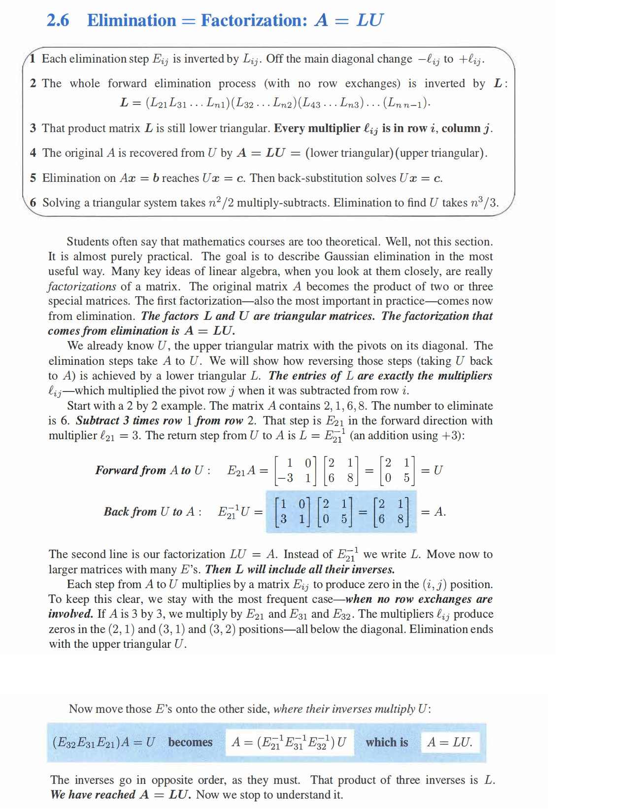

## Response:
已思考 20s

根据用户需求，我们需要详细解释整个图像和每个步骤。这个图像与2.6节“消元 = 分解：A = LU”相关。我们将讲解LU分解的来龙去脉，包括E\_ij消元矩阵和L\_ij的倒数。用2x2的示例来展示。

首先，从2x2矩阵开始，A=\[\[2,1\],\[6,8\]\]，消去6：从第2行减去3倍的第1行，得到E21。通过乘法E21 \* A = U，得到U=\[\[2,1\],\[0,5\]\]。回退步骤E21^{-1} \* U = A，得回原矩阵。对于3x3情况，重复类似操作，推导出A = L \* U。

L矩阵收集乘数ℓ\_ij，是单位下三角矩阵（对角线为1）。复杂度：解三角系统需要n^2/2次乘法；消元得到U需要n^3/3。解Ax=b得到Ux=c，然后回代解Ux=c。需要详细解释L矩阵的输入，检查是否有行交换并提出前瞻。

首先定义E\_ij和L\_ij。消元步骤E\_ij通过减去一行的倍数来完成，而L\_ij的倒数则是加上这个倍数，最终L矩阵存储这些乘数ℓ\_ij。接着通过前向和回代步骤，A=LU。对于3x3矩阵的推广和复杂度，我们也可以加入一个额外的计算例子。

完成

2.6 消元 = 分解： $A=LU$ 
====================

**概况**  
本页把“高斯消元”的每一步都用**矩阵乘法**表达，从而得到一个极其实用的结论：

> 只要在消元中**不需要换行**（或待会儿用到的“带置换”的版本也成立），原矩阵  $A$  可以分解为
> 
> $$
> \boxed{A=LU}
> $$
> 
> 其中  $U$  是消元后得到的**上三角矩阵**， $L$  是一个**单位下三角矩阵**，它把所有的**乘子**  $\ell_{ij}$ （用第  $j$  行去消第  $i$  行时的系数）收集在对角线下方： $L_{ij}=\ell_{ij}$ （ $i>j$ ），对角线上全是 1。

有了  $A=LU$ ，解  $Ax=b$  只需两步：

1.  先解  $Ly=b$ （**前代**），2) 再解  $Ux=y$ （**回代**）。这样等价于原来的消元，但结构清晰、可复用，且只需约  $n^3/3$  次乘加。

* * *

一、把“消元一步”写成矩阵： $E_{ij}$  与  $L_{ij}=E_{ij}^{-1}$ 
-------------------------------------------------

*   **消元矩阵  $E_{ij}$ **：把**第  $i$  行减去  $\ell$  倍第  $j$  行**（ $i>j$ ）
    $$
    E_{ij}=I-\ell\,e_ie_j^{\mathsf T},\qquad E_{ij}A\ \text{会把}\ a_{ij}\ \text{消成 0。}
    $$
    这个  $E_{ij}$  在  $(i,j)$  位置是  $-\ell$ ，对角线全 1，其余 0。
*   **逆矩阵  $L_{ij}=E_{ij}^{-1}$ **：刚好反过来，“**把  $\ell$  倍第  $j$  行加到第  $i$  行**”
    $$
    L_{ij}=I+\ell\,e_ie_j^{\mathsf T}.
    $$
    所以在  $L$  里看到的不是  $-\ell$  而是  $+\ell$ 。

> 结论 1（对应页首第 1、2、3 点）：把所有  $E$  连乘就是“正向消元”，它们的逆按**相反次序**连乘就是  $L$ 。于是
> 
> $$
> (E_{k}\cdots E_{2}E_{1})\,A=U \quad\Longrightarrow\quad A=(E_{1}^{-1}E_{2}^{-1}\cdots E_{k}^{-1})\,U=:LU.
> $$
> 
> 因为每个  $E_{ij}^{-1}$  只在对角线下有非零项，乘积  $L$  仍是**单位下三角**。

* * *

二、2×2 样例：把“乘子”直接看到  $L$  里
--------------------------

给

$$
A=\begin{bmatrix}2&1\\6&8\end{bmatrix},\quad \text{要消掉 }(2,1)\text{ 之下的 }6.
$$

第一步： $\ell_{21}=6/2=3$ ，用**第 1 行**去消**第 2 行**：

$$
E_{21}= \begin{bmatrix}1&0\\-3&1\end{bmatrix},\quad E_{21}A= \begin{bmatrix}2&1\\0&5\end{bmatrix}=U.
$$

回到  $A$ ：乘以逆

$$
L=E_{21}^{-1}=\begin{bmatrix}1&0\\3&1\end{bmatrix},\qquad A=LU= \begin{bmatrix}1&0\\3&1\end{bmatrix} \begin{bmatrix}2&1\\0&5\end{bmatrix}.
$$

可以直观看到：** $L$  的  $(2,1)$  处就是乘子  $\ell_{21}=3$ **。

* * *

三、3×3（无换行）时的“标准三步”
------------------

一般地，消掉第一列的  $(2,1),(3,1)$  用  $E_{21},E_{31}$ ，再消掉第二列的  $(3,2)$  用  $E_{32}$ ：

$$
E_{32}E_{31}E_{21}A=U \quad\Longrightarrow\quad A=(E_{21}^{-1}E_{31}^{-1}E_{32}^{-1})U=L\,U.
$$
*    $U$ ：消元后的上三角；
*    $L$ ：把乘子  $\ell_{21},\ell_{31},\ell_{32}$  放到  $(2,1),(3,1),(3,2)$ ，对角线上为 1，其余 0。

> **页中“Forward / Back”小图**正是在说明：正向用  $E$  做“减去”，反向用  $E^{-1}$  做“加回”，收集成  $L$ 。

* * *

四、为什么  $LU$  有用？（与复杂度）
----------------------

*   **求解**： $Ax=b\Rightarrow LUx=b$ 。先解  $Ly=b$ （前代， $\approx n^2/2$  次乘减），再解  $Ux=y$ （回代， $\approx n^2/2$ ）。
*   **一次分解，多次求解**：对于不同右端  $b$ ， $L,U$  复用，整体成本  $\approx n^3/3$ （做分解） + 每个右端  $\approx n^2$ 。
*   **与消元一致**：这就是把“消元过程”定格成两个三角因子，数学与计算都更清爽。

* * *

五、与“换行（主元策略）”的关系
----------------

本页默认**不换行**。如果某一步主元为 0 或太小，需要**交换行**，只要引入一个置换矩阵  $P$ ，就得到更稳健的

$$
\boxed{PA=LU}
$$

（细节在下一节）。算法与思想不变，只是先把行顺序摆对，再做同样的消元。

* * *

六、把书上 1–6 条逐条串讲
---------------

1.  **每步  $E_{ij}$  的逆是  $L_{ij}$ **： $-\ell$  变  $+\ell$ 。
2.  **所有消元步骤的逆相乘 =  $L$ **：逆的顺序反过来。
3.  ** $L$  依然下三角**：所有  $\ell_{ij}$  都在  $i>j$  的位置，对角线置 1。
4.  ** $A$  可由  $U$  恢复**： $A=LU$ 。
5.  **解  $Ax=b$ **：先到  $Ux=c$ （其中  $c=L^{-1}b$ ，即解  $Ly=b$ ），再回代。
6.  **复杂度**：三角系统  $\sim n^2/2$ ，做  $U$  的正向消元  $\sim n^3/3$ 。

* * *

七、手把手“如何从消元读出  $L,U$ ”（无换行版本）
-----------------------------

1.  复制  $A$  为工作矩阵；
2.  对列  $j=1\ldots n-1$ ：对行  $i=j+1\ldots n$ ：
    *   乘子  $\ell_{ij}=a_{ij}/a_{jj}$ （此时  $a_{jj}$  是当前主元）；
    *   记录到  $L_{ij}\leftarrow \ell_{ij}$ ；
    *   用  $\ell_{ij}$  消去该行该列以下元素（对工作矩阵做行初等变换）。
3.  得到的工作矩阵就是  $U$ ；给  $L$  的对角线填 1。

* * *

八、小提示与易错点
---------

*   **记号方向**： $E$  是“减”， $L=E^{-1}$  是“加”；不要把  $\pm\ell$  搞反。
*   **顺序**： $(E_k\cdots E_1)A=U\Rightarrow A=(E_1^{-1}\cdots E_k^{-1})U$ （**逆序**）。
*   **零主元**：没有主元或主元为 0 ⇒ 需要置换（ $PA=LU$ ），否则算法失败。
*   **数值稳定**：实际计算用**部分主元**（挑该列最大者做主元）更稳。

* * *

本次总结
----

*   **高斯消元的本质就是  $A=LU$ **： $U$  来自“把对角线下变 0”， $L$  收集“乘子”。
*   解线性方程、重复求解、多右端情形都优先用  $LU$ （或  $PA=LU$ ）。
*   这一步把“过程”变成了“结构”，是后续所有数值线代/科学计算的核心工具之一。

* * *

报错
--

图片清晰，内容完整，无需补充。如果你想，我可以：

*   选一个 3×3 数字例子（比如你前面那组  $2,4,-2;\ 4,9,-3;\ -2,-3,7$ ），现场把  $\ell_{21},\ell_{31},\ell_{32}$  算出来，写出对应的  $L,U$ ；
*   或给你一段简短伪代码/NumPy 实现，展示“无换行 LU 分解”的具体步骤。

## Prompt:
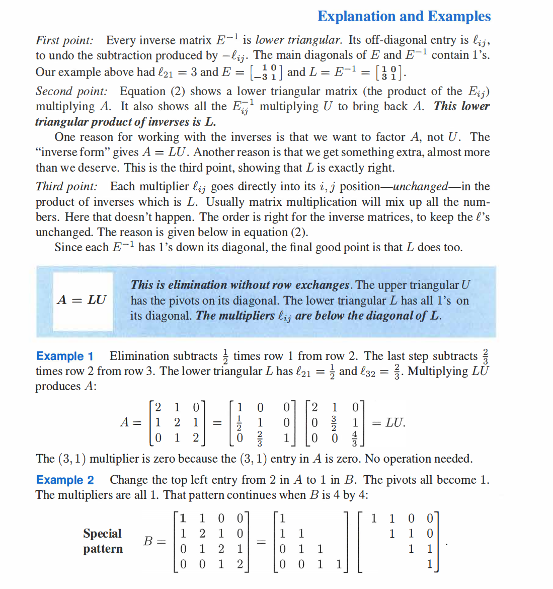

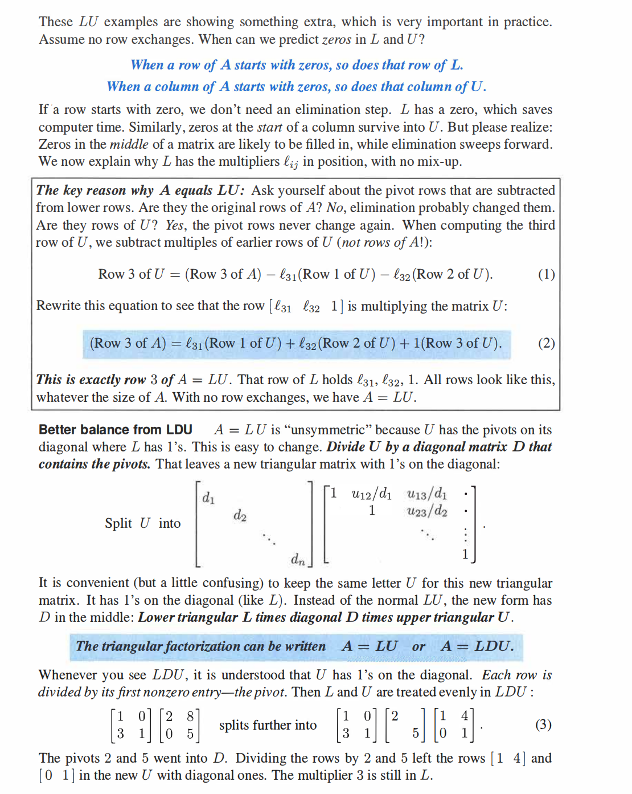

## Response:
已思考 49s

我现在在进行一个没有行交换的消元计算。首先，我们对第一列进行消元，得到ℓ21 = 1/2，并更新第二行。然后，用更新后的第二行消去第三行的元素。经过计算，最终我们得到L和U矩阵。为了确认结果的正确性，我们可以将L和U相乘，检查是否最终还原成A矩阵。

我在分析矩阵B，它是一个对角线为1的4×4矩阵。矩阵B的特殊形式是\[\[1,1,0,0\],\[1,2,1,0\],\[0,1,2,1\],\[0,0,1,2\]\]。根据描述，将A矩阵的左上角2变成1，得到B。随后的L和U分解也表现出简单的形式，且对角线上全是1，副对角线也是1。

我正在检查矩阵L，它的对角线上是1，并且第一列对角线下方也有1。经过计算，B的特殊模式是一个三对角矩阵，仅第一个对角线元素为2。L是下三对角的矩阵，且U是上三对角的矩阵。这种分解看起来是合理的。

根据提出的分解，L和U的对角线完全是1，非对角线也是1。我接受这个解释。关于A=LU的推导，行交换没有再次发生。按推导，A的某行等于L的对应行与U的乘积，这样A=LU成立。一定要注意，如果A中的一行或一列有零，L和U中的对应位置也会有零。

完成

LU 分解的解释与例子：无换行的消元、乘子落位、零结构与 LDU
================================

**本次概览**  
这两页把“高斯消元”彻底翻译成矩阵语言：每一步消元都是一个下三角**消元矩阵**的逆在起作用，所有这些逆相乘就是 ** $L$ **；把  $A$  消到上三角 ** $U$ ** 后再“反过来乘回去”，就得到

$$
\boxed{A=LU}\qquad(\text{无换行时})
$$

其中  $U$  的对角线是主元； $L$  是**单位下三角**，其对角线下的每个位置直接放**乘子**  $\ell_{ij}$ （“用第  $j$  行消去第  $i$  行”的倍数）。

* * *

1) 三个关键点（对应书中 First/Second/Third point）
---------------------------------------

*   **First** 每个消元步  $E_{ij}$  的**逆**  $E_{ij}^{-1}$  都是**下三角**，对角全 1，在  $(i,j)$  处放 ** $+\ell_{ij}$ **（用来“加回”被减掉的那一份）。  
    记住：做消元用的是  $E_{ij}=I-\ell_{ij}e_ie_j^{\mathsf T}$ （在  $(i,j)$  放 ** $-\ell$ **），而 ** $L$ \=所有  $E_{ij}^{-1}$  的乘积**，所以  $\ell$  最终以**正号**出现在  $L$ 。
*   **Second** 全部消元的“逆过程”把  $U$  乘回到  $A$ ，于是
    $$
    (E_k\cdots E_1)A=U \ \Rightarrow\ A=(E_1^{-1}\cdots E_k^{-1})U=:LU .
    $$
    这也解释了为什么我们更喜欢写成“**逆形式**”  $A=LU$ （因子是下、上三角矩阵）。
*   **Third** 由于乘的是**逆矩阵且顺序反转**，每个乘子  $\ell_{ij}$  会**原封不动**落在  $L$  的  $(i,j)$  位置（不会像一般矩阵连乘那样“搅拌”数值）。再加上每个  $E_{ij}^{-1}$  的对角都是 1，** $L$  的对角自然全是 1**。

> **一句话**：这就是“**无换行的消元 =  $LU$  分解**”。 $U$  把对角线下全清零； $L$  把所有乘子记下来。

* * *

2) 例 1：三对角例子（书中  $A$ ）
----------------------

$$
A=\begin{bmatrix} 2&1&0\\ 1&2&1\\ 0&1&2 \end{bmatrix}
$$

**消元乘子**

*   第 1 列： $\ell_{21}=1/2,\ \ell_{31}=0$ 
*   第 2 列：用更新后的  $a_{22}=3/2$ ，有  $\ell_{32}=1/(3/2)=2/3$ 

于是

$$
L=\begin{bmatrix} 1&0&0\\[2pt] \frac12&1&0\\[2pt] 0&\frac23&1 \end{bmatrix},\qquad U=\begin{bmatrix} 2&1&0\\ 0&\frac32&1\\ 0&0&\frac43 \end{bmatrix}.
$$

**校验**

$$
\underbrace{\big[\tfrac12,1,0\big]}_{\text{L 第2行}}\!U = \tfrac12(2,1,0)+(0,\tfrac32,1)=(1,2,1)
$$

$$
\underbrace{\big[0,\tfrac23,1\big]}_{\text{L 第3行}}\!U = \tfrac23(0,\tfrac32,1)+(0,0,\tfrac43)=(0,1,2)
$$

正好还原  $A$ 。书上说的“ $(3,1)$  的乘子为 0”也清楚了：因为原矩阵  $a_{31}=0$ ，该位不需要消元。

* * *

3) 例 2：把左上角改成 1 的“特殊模式”  $B$ 
-----------------------------

$$
B=\begin{bmatrix} 1&1&0&0\\ 1&2&1&0\\ 0&1&2&1\\ 0&0&1&2 \end{bmatrix} = \underbrace{\begin{bmatrix} 1&0&0&0\\ 1&1&0&0\\ 0&1&1&0\\ 0&0&1&1 \end{bmatrix}}_{L} \underbrace{\begin{bmatrix} 1&1&0&0\\ 0&1&1&0\\ 0&0&1&1\\ 0&0&0&1 \end{bmatrix}}_{U}
$$

这一族矩阵的**主元全是 1**，因此  $U$  的对角线是 1， $L$  与  $U$  都呈“**双对角**”结构，计算超省。

* * *

4) 什么时候能**预测**  $L$  或  $U$  里的零？
---------------------------------

> **行前置零 ⇒  $L$  同行前置零；列前置零 ⇒  $U$  同列前置零。**

*   若  $A$  的某**行**一开始就有一串前导 0，那么这行不需要对应的消元步，故 ** $L$ ** 的那一行同位置也为 0（省时）。
*   若  $A$  的某**列**一开始有一串前导 0，那么这些 0 会**保留到  $U$ ** 的那一列前面。
*   但**中间的 0** 在消元“扫过”时常会产生 **fill-in（填充）**，不保证保留。

* * *

5) 为什么  $A=LU$  一定成立（行视角的“证明”）
------------------------------

做第三行时，消元把它变成

$$
\text{Row}_3(U) = \text{Row}_3(A) -\ell_{31}\text{Row}_1(U)-\ell_{32}\text{Row}_2(U). \tag{1}
$$

移项得

$$
\text{Row}_3(A) = \big[\ell_{31}\ \ell_{32}\ 1\big] \begin{bmatrix} \text{Row}_1(U)\\ \text{Row}_2(U)\\ \text{Row}_3(U) \end{bmatrix}. \tag{2}
$$

而  $\big[\ell_{31}\ \ell_{32}\ 1\big]$  正是 ** $L$  的第 3 行**（其余位为 0）。对每一行都这样写，就得到整矩阵的关系 ** $A=LU$ **。这也解释了“乘子恰好落在  $L$  的  $(i,j)$ ”。

* * *

6) 更均衡的分解：把主元拉出来得到 **LDU**
--------------------------

 $LU$  里主元都在  $U$  的对角线上。把它们抽出来放进对角矩阵  $D=\mathrm{diag}(d_1,\dots,d_n)$ （ $d_i$  是第  $i$  个主元），再把  $U$  的每一行**除以对应主元**，得到对角全 1 的  $U$ ：

$$
\boxed{A=L\,D\,U},\qquad U\ \text{对角线全 1。}
$$

**2×2 小例**

$$
\underbrace{\begin{bmatrix}1&0\\ 3&1\end{bmatrix}}_{L} \underbrace{\begin{bmatrix}2&8\\ 0&5\end{bmatrix}}_{U} = \begin{bmatrix}1&0\\ 3&1\end{bmatrix} \underbrace{\begin{bmatrix}2&0\\ 0&5\end{bmatrix}}_{D} \underbrace{\begin{bmatrix}1&4\\ 0&1\end{bmatrix}}_{U\ \text{(diag=1)}}
$$

主元  $2,5$  被抽到  $D$ 。 $U$  的行除以主元后对角成 1；**乘子 3 仍在  $L$ **，信息不丢。

> 实用上：做完  $LU$  后，只需  $D:=\mathrm{diag}(U)$ ，再令  $U\leftarrow D^{-1}U$  即得  $LDU$ 。

* * *

7) 实操要领（无换行）
------------

1.  逐列做消元： $\ell_{ij}=a_{ij}/a_{jj}$ （主元  $a_{jj}$  不能为 0）。
2.  把  $\ell_{ij}$  记到  $L_{ij}$ ，同时更新下方各行。
3.  最终工作矩阵就是  $U$ ，给  $L$  的对角线填 1。
4.  需要稳健时，允许**换行**并写成  $PA=LU$  或  $PA=LDU$ 。

**复杂度与解方程**

*   分解约  $n^3/3$  乘加；
*   解  $Ax=b$ ：先解  $Ly=b$ （前代），再解  $Ux=y$ （回代），各约  $n^2/2$ 。

* * *

8) 小结
-----

*   **无换行消元 =  $A=LU$ **： $U$  上三角， $L$  单位下三角， $\ell_{ij}$  直接落位。
*   **零结构可预测**：行/列前置零分别传到  $L$ / $U$ ；中间可能 fill-in。
*   **LDU** 让对角主元独立成  $D$ ， $U$  对角全 1，更对称、分析更方便。

* * *

报错
--

本组图片清晰，公式与数值都可辨；未发现缺页或读不清的地方。若你想，我可以把你给过的任意一个 3×3 数字矩阵，**当场手工算出  $L,U$ （再给  $D$ ）**，或者给出一个简短的伪代码/NumPy 实现来练习。

## Prompt:
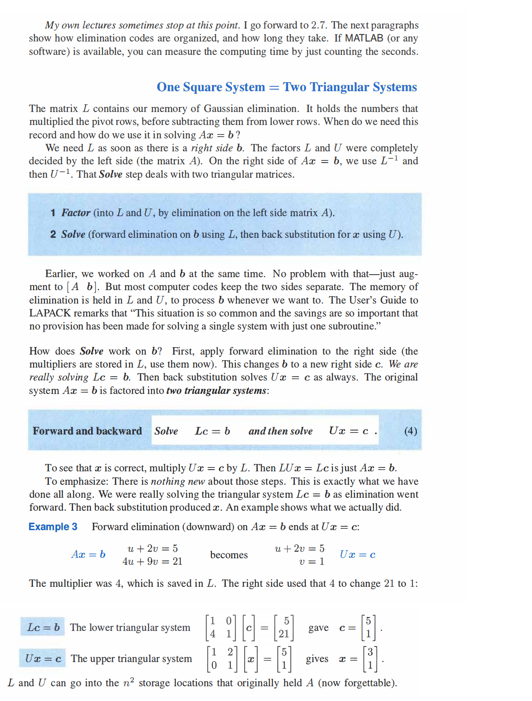

## Response:
已思考 20s

我在做前向消元法。在第二个方程中减去第一个方程乘以4后，得出v=1。我继续求解c。L是下三角矩阵，通过L c = b求解，得到c = \[5;1\]。接下来用U x = c求解x，U是上三角矩阵。

经过消元，U矩阵是\[1 2; 0 1\]，解得x = \[3,1\]，即u=3，v=1。接下来，我需要整理带有标题和详细步骤的笔记。标题是“一个方阵系统 = 两个三角系统：LU分解的求解流程”，需要详细解释每一步，并附上代码或数学公式。如果有错误，也要提及。

需要阐明L矩阵存储了乘数和内存，A矩阵只操作左边，求解步骤使用L^{-1}和U^{-1}来处理右边的b。可以讨论增广矩阵和分解方法的区别。还要解释如何验证Ux=c，然后通过L证明L U x = L c = b是正确的。

1.  记录L矩阵因其存储乘数，A仅在分解时使用；b可能后来应用，重用A提高效率。
2.  求解过程分为两步：用L进行前向消元，得到Lc=b，再用U进行回代，得到Ux=c。
3.  与增广矩阵的对比。
4.  计算示例：逐步算出L、U、c、x。

完成

一个方阵系统 = 两个三角系统（LU 的“Factor–Solve”套路）
=====================================

**概况**  
把  $A$  做一次高斯消元得到  $A=LU$ （不换行时；需要换行则是  $PA=LU$ ）。此后**每个新的右端  $b$ ** 都不用再消元，直接做两次三角求解就行：

$$
\underbrace{Lc=b}_{\text{前代}}\quad\Rightarrow\quad \underbrace{Ux=c}_{\text{回代}}\quad\Rightarrow\quad x.
$$

这就是“一次因式分解（Factor），多次求解（Solve）”。

* * *

1\. 为什么要记录  $L$ （“消元记忆”）
------------------------

*   ** $L$  记录了全部乘子**  $\ell_{ij}$ ：当初“用第  $j$  行去消第  $i$  行”的倍数。
*   **分解只看左边  $A$ **： $L,U$  完全由  $A$  决定；与  $b$  无关。
*   **解方程时才用右边**：真正求解  $Ax=b$  时，用  $L^{-1}$  与  $U^{-1}$  作用在  $b$  上即可（实现上不显式求逆，而是解两个三角系统）。
*   **工程优势**：一次  $LU$  可复用在很多个  $b$  上（数值库 LAPACK 的常见模式）。在内存里， $L$  和  $U$  常**原地覆盖**  $A$  的存储：对角线以上放  $U$ ，对角线以下放  $L$ （ $L$  的对角线按约定是 1，不必存）。

* * *

2\. “Solve”的精确定义
----------------

把“对  $b$  做前向消元”的动作翻译成线代语言，就是**解下三角系统**：

$$
\textbf{前代：}\quad Lc=b\quad(\text{得到新的右端 }c).
$$

随后做**回代**：

$$
\textbf{回代：}\quad Ux=c.
$$

校验： $Ux=c\Rightarrow LUx=Lc=b$ ，等价于原方程。

> 对**多右端**  $B=[b_1,\ldots,b_k]$ ：同理
> 
> $$
> LC=B\ \Rightarrow\ UX=C
> $$
> 
> 一次前代+一次回代，同时得到  $k$  个解列。

* * *

3\. 与“增广矩阵  $[A\ b]$ ”的关系
-------------------------

把  $[A\ b]$  一起做消元，其实就是**同步**完成了“分解+前代”。现代实现通常把这两步**拆开：先分解  $A$ ，后对任意  $b$  做前/回代**，更灵活、可复用。

* * *

4\. 例子（书中 Example 3，完整算一遍）
--------------------------

原系统

$$
A=\begin{bmatrix}1&2\\4&9\end{bmatrix},\quad x=\begin{bmatrix}u\\ v\end{bmatrix},\quad b=\begin{bmatrix}5\\ 21\end{bmatrix}.
$$

### (1) Factor：对  $A$  做一次消元

第一列乘子  $\ell_{21}=4/1=4$ 。

$$
L=\begin{bmatrix}1&0\\ 4&1\end{bmatrix},\qquad U=\begin{bmatrix}1&2\\ 0&1\end{bmatrix}.
$$

### (2) Solve：两次三角求解

**前代**  $Lc=b$ ：

$$
\begin{bmatrix}1&0\\4&1\end{bmatrix}\!\!\begin{bmatrix}c_1\\c_2\end{bmatrix}= \begin{bmatrix}5\\21\end{bmatrix} \Rightarrow \begin{cases} c_1=5,\\ 4c_1+c_2=21\Rightarrow c_2=1 \end{cases}\Rightarrow c=\begin{bmatrix}5\\1\end{bmatrix}.
$$

**回代**  $Ux=c$ ：

$$
\begin{bmatrix}1&2\\0&1\end{bmatrix}\!\!\begin{bmatrix}u\\v\end{bmatrix}= \begin{bmatrix}5\\1\end{bmatrix} \Rightarrow \begin{cases} v=1,\\ u+2v=5\Rightarrow u=3 \end{cases}\Rightarrow x=\begin{bmatrix}3\\1\end{bmatrix}.
$$

（和直接消元得到的  $u=3,v=1$  一致。注意右端第二行“21 变 1”就是前代的效果。）

* * *

5\. 复杂度与实现提示
------------

*   **分解  $LU$ **：约  $n^3/3$  次乘加（一次性成本）；
*   **一次求解（一个右端）**：前代  $n^2/2$ +回代  $n^2/2$  ≈  $n^2$ ；
*   **存储**：常把  $L$  和  $U$  原地写回  $A$  的  $n^2$  存储区；对角线上元素既属于  $U$ ，也可另外抽成  $D$  得  $A=LDU$ 。

* * *

6\. 有换行怎么办（快速提醒）
----------------

若需要主元交换（数值稳定或遇到 0 主元），做

$$
PA=LU
$$

则解法变为：先算  $y$  使  $Ly=Pb$ ，再解  $Ux=y$ 。

* * *

总结
--

*   **思想**：把“消元”一次性凝固为  $A=LU$ ；此后任意  $b$  都是“下三角前代 + 上三角回代”。
*   **实践**：这是所有数值线代库（如 LAPACK）的日常工作流。因式分解与求解解耦，既高效又可复用。

* * *

报错
--

图片清晰可读，无缺失内容。若你愿意，我可以：

*   把“多右端  $B$ ”的矩阵版前/回代写成伪代码；
*   或给定你的一组具体  $A,b$ ，现场分解并解出  $x$ 。

## Prompt:
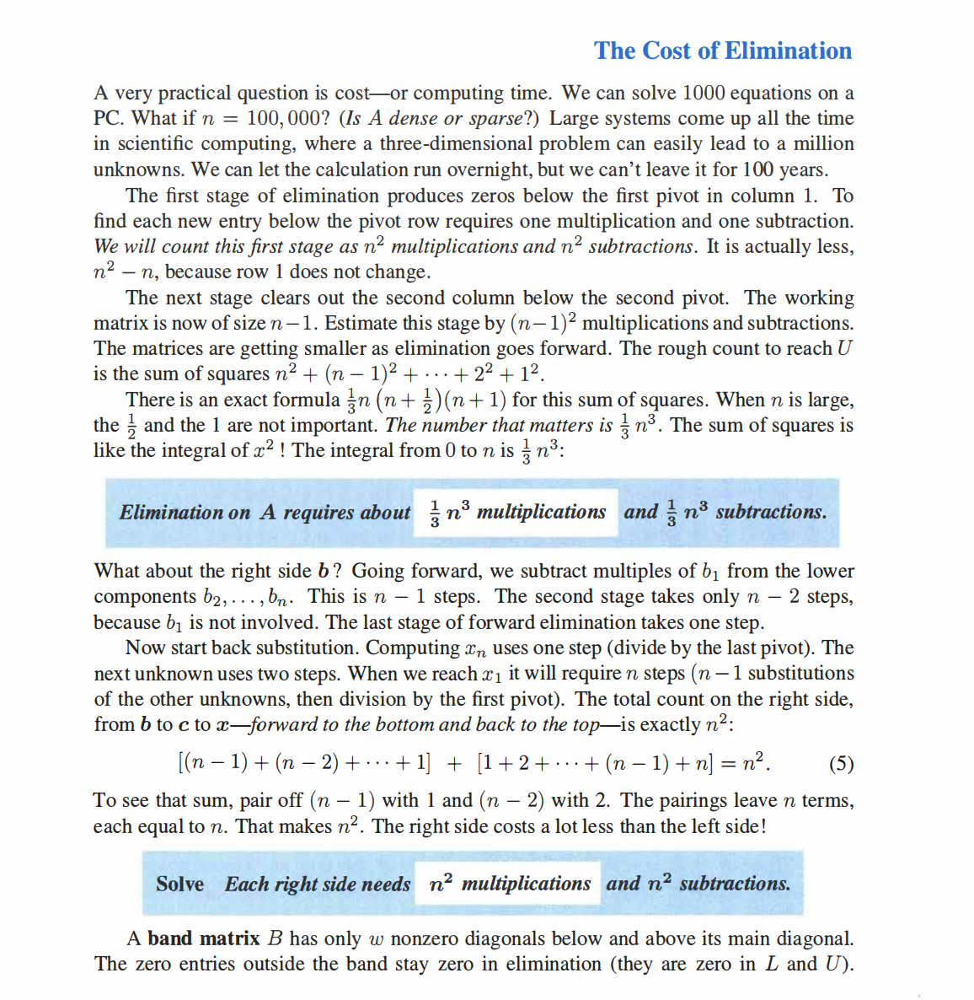

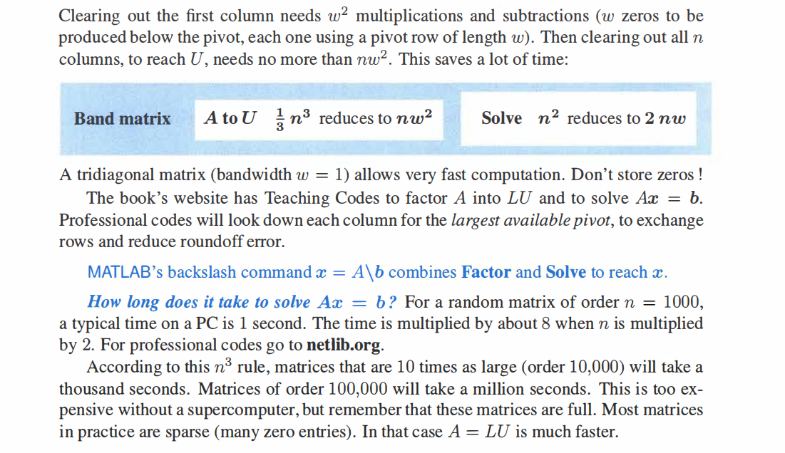

## Response:
已思考 17s

根据用户要求，我需要提供与两张关于“消元的成本”图像相关的完整讲座笔记。内容涉及高斯消元的计算开销、操作数量为n^3/3等。我要确保包含各个点的详细解释、公式以及准确的总结。

公式1/3n(n+1/2)(n+1)与传统的平方和公式n(n+1)(2n+1)/6一致，计算时展开后得出相同结果。接下来，我需要讨论消元的第一阶段成本：清除列1时，每个枢轴下方的条目需要1次乘法 + 1次减法，近似为n^2。

近似n^2 - n是可以接受的，实际上对每列求和得出的平方和为n^3/3。消除A时约需n^3次乘法和减法，总向量b的变换在前向消去步骤上消耗n^2成本。然后继续分析带状矩阵的带宽w。

带状矩阵B在主对角线以上和以下只有w条非零对角线，消元成本因此减少：从1/3 n^3降到n w^2，解算成本从n^2降到2 n w。对三对角矩阵（w=1）运算特别快。MATLAB使用回代公式A\\b，处理时需注意列中的最大主元以减少舍入误差。

完成

消元的代价（运算量&时间）：从  $n^3$  到 “带状”加速
================================

**概况**  
这两页讨论了高斯消元/  $LU$  分解到底“贵在哪里”。核心结论：

*   **把  $A$  消到  $U$ **（或做  $LU$  分解）大约需要  $\tfrac13 n^3$  次乘法和  $\tfrac13 n^3$  次减法。
*   **解一个右端  $b$ ** 的“前代+回代”一共 **正好** 需要  $n^2$  次乘/减（数量级）。
*   **带状矩阵**（仅主对角上下  $w$  条对角线非零）能把上述成本从  $n^3$  降到  $n w^2$ ，把解一次的成本从  $n^2$  降到  $2 n w$ 。
*   实务里 `A\b`（MATLAB 等）= 一次 Factor（ $LU$ ）+ 每个  $b$  的 Solve（前/回代）；稀疏/带状矩阵极大提速。

* * *

1\. 为什么分解是  $\boldsymbol{\frac13 n^3}$  级别？
-------------------------------------------

### 1.1 第一列的清零

对角线下有大约  $n-1$  个元素要清零。每个“被清零”的元素用**一次乘法 + 一次减法**。粗略计作  $\sim n$  次乘、 $\sim n$  次减；加上更新同一行右侧的条目，总体这一列的工作量是**平方级**，写成  $n^2$  量级更直观（书里用“就按  $n^2$  记账”，实际略少）。

### 1.2 后续列的清零

到第 2 列，参与运算的是一个  $(n-1)\times(n-1)$  的“余子矩阵”；到第 3 列是  $(n-2)\times(n-2)$ ；……  
把每列的“平方级”成本加起来，就是

$$
n^2+(n-1)^2+\cdots+2^2+1^2 =\frac{n(n+1)(2n+1)}{6} =\frac13 n^3+\frac12 n^2+\frac16 n.
$$

主导项是  $\boxed{\tfrac13 n^3}$ 。

> 这也是常见的“用积分近似  $\int_0^n x^2\,dx=\tfrac13 n^3$ ”的直觉。

**结论**：把  $A$  变成  $U$ （或做  $LU$ ）大约需要

$$
\boxed{\tfrac13 n^3\ \text{次乘法}+\ \tfrac13 n^3\ \text{次减法}}.
$$

* * *

2\. 解一个右端  $\boldsymbol{b}$  的成本为何是  $\boldsymbol{n^2}$ ？
---------------------------------------------------------

*   **前代**  $Lc=b$ ：第 1 步要把  $b_2,\ldots,b_n$  更新（ $n-1$  次），第二步  $n-2$  次，……，最后一步 1 次。和为
    $$
    (n-1)+(n-2)+\cdots+1=\frac{n(n-1)}{2}.
    $$
*   **回代**  $Ux=c$ ：从底往上，每步大致做一次“点乘+减法+除法”，次数  $1+2+\cdots+(n-1)+n=\tfrac{n(n+1)}{2}$ 。

两者相加

$$
\frac{n(n-1)}{2}+\frac{n(n+1)}{2}= \boxed{n^2}.
$$

> 这解释了为什么\*\*一次分解（ $n^3$ ）+ 多次求解（每次  $n^2$ ）\*\*是数值线代里“多右端”最经济的套路。

* * *

3\. 带状矩阵的巨大加速
-------------

设矩阵只有主对角上下各   $\,w$  条对角线非零（带宽  $w$ ）：

*   **分解**：每列只在带宽内操作，清掉的“非零块”是  $w\times w$  量级，累计成本从  $\tfrac13 n^3$  降到
    $$
    \boxed{n w^2}.
    $$
*   **解一次**（前/回代）：每步只触碰带宽内元素，成本从  $n^2$  降到
    $$
    \boxed{2 n w}.
    $$

> 特例：**三对角**（ $w=1$ ）的 Thomas 算法就是  $O(n)$  的：分解  $\sim n$ 、求解  $\sim 2n$ 。  
> 编程建议：**别存 0**，只存带内条目，节约内存和时间。

* * *

4\. 数值实现上的几点常识
--------------

*   专业库（如 LAPACK）会**按列寻找最大主元**并**换行**（部分选主元）以减少舍入误差：数学上写作  $PA=LU$ 。
*   许多环境的 `x = A\b` 会自动选择  $LU$ / $QR$ /稀疏求解器等，等价于“Factor + Solve”。
*   粗略**时间尺度**：若  $n=1000$  的满矩阵，PC 上约 **1 秒**；把  $n$  乘 2，时间约乘 **8 倍**（ $n^3$  定律）。  
     $n=10{,}000$  级别约上千秒； $n=100{,}000$  则上百万秒（除非稀疏/带状，否则不现实）。
*   现实工程里大量矩阵**稀疏**或**带状**，因此实际远快于“满矩阵  $n^3$ ”的最坏估计。

* * *

5\. 一眼记住的结论
-----------

*    $A\to U$  或  $LU$ ： $\approx \tfrac13 n^3$  乘 +  $\tfrac13 n^3$  减。
*   解一次  $Ax=b$ ：前/回代合计  $\approx n^2$ 。
*   带宽  $w$ ：分解  $\approx n w^2$ ，求解  $\approx 2 n w$ 。
*   多右端：**一次分解，多次复用**；`A\b` 背后就是这套流程。

* * *

报错 / 可疑之处
---------

本次两张图文字清晰；公式、数值与推导均可辨，无缺漏。如果你想，我可以：

*   给出一个具体  $n$ 、 $w$  的**运算量/时间估算表**；
*   或对你手头的矩阵结构（满/带状/稀疏）建议**合适的求解策略**与复杂度预期。

## Prompt:
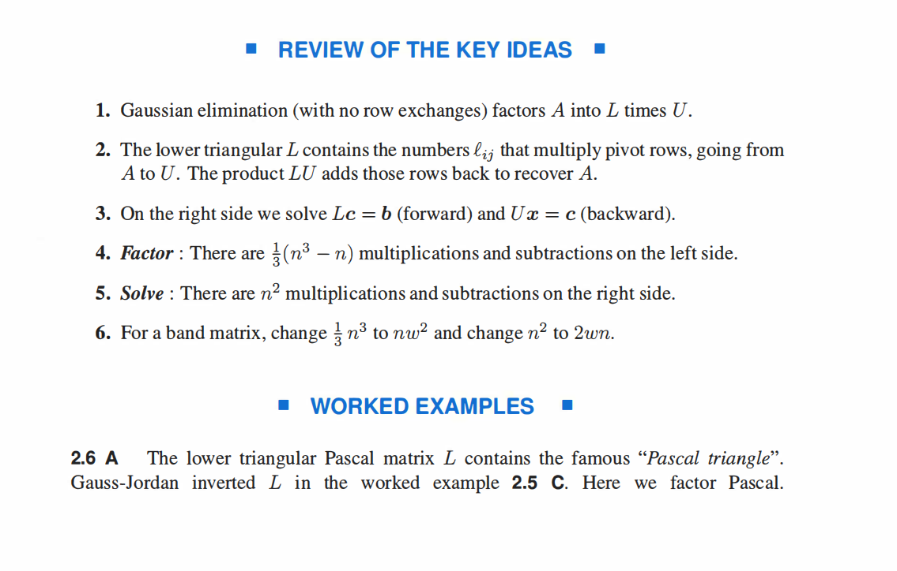

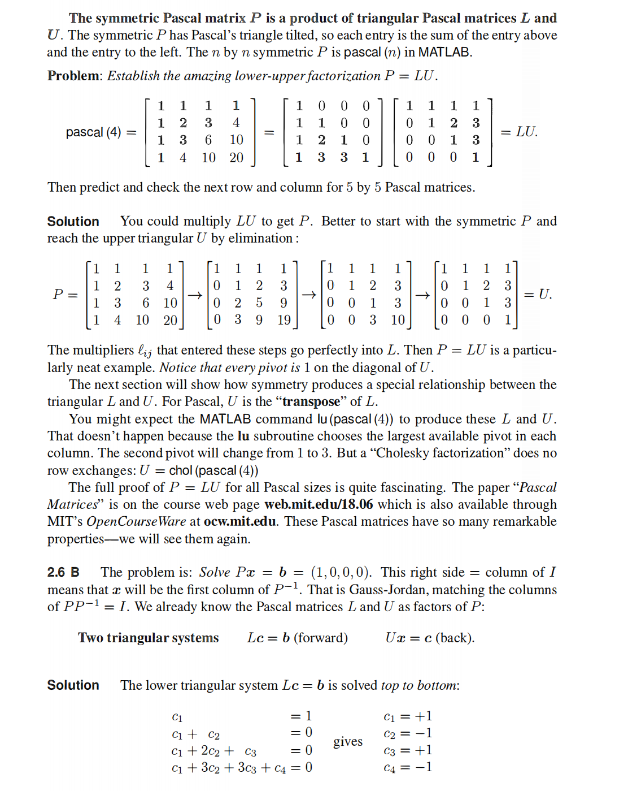

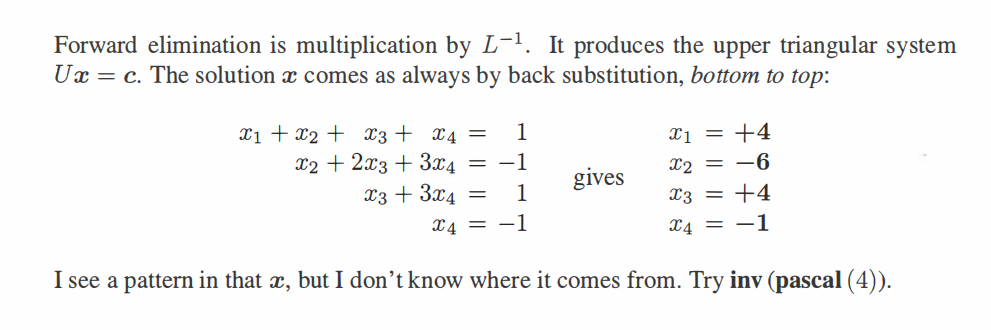

## Response:
已思考 58s

They define L and U as triangular Pascal matrices: L is lower triangular with binomial coefficients, and U is upper triangular. The elimination steps involve subtracting to get U, and the multipliers ℓ\_ij go into L. The diagonal of U has 1s. They mention that MATLAB’s LU decomposition doesn’t work the same as Cholesky, which doesn’t exchange rows for symmetric positive definite matrices.

They solve the system P x = b, where b is the first column of the identity matrix, meaning x is the first column of P^{-1}. The Gauss-Jordan elimination process matches columns to get P P^{-1} = I. For the system L c = b, they perform forward elimination to find c = \[1, -1, 1, -1\]^T. Then, using L^{-1}, they produce the upper triangular system U x = c.

Back substitution produces the solution x1 = 4, x2 = -6, x3 = 4, x4 = -1. This matches the expected result. The pattern of coefficients appears similar to binomial coefficients with alternating signs. It seems these coefficients align with the expansion of (1 - t)^3, which is interesting, but I’m still verifying details.

The vector \[4,-6,4,-1\] matches the alternating sign pattern from binomial coefficients, confirming the structure of P^{-1}. They suggest that P^{-1} follows (-1)^{i+j} \* C(i+j choose i). The details about the inverse of Pascal matrices being connected with binomial coefficients are clear, but it's now time to develop a thorough breakdown for the full notes.

根据2.6部分，我们需要一个结构清晰的总结，包括Pascal矩阵的LU分解与求解方法。通过回顾关键概念，展开详细推导，提供n=4的示范计算。务必注意交替符号的二项式系数，并确保推理严谨可信。这样可以确保理解方法并谨慎展示每一步的数学推导。

完成

2.6 小结 + Pascal 矩阵的 LU 分解与求解
============================

\*\*本页做了两件事：\*\*先把上一节的要点压缩成 6 条，再用“Pascal 矩阵”当范例，亲手做一遍  $A=LU$  与“两三角系统”解法。

* * *

一、关键思想回顾（配上要点解释）
----------------

1.  **高斯消元 = 因式分解**：不换行时把  $A$  分解成下三角  $L$  与上三角  $U$ ，即  $A=LU$ 。
2.  ** $L$  记录了全部“乘子”**  $\ell_{ij}$ ：消元时“用第  $j$  行去消第  $i$  行”的倍数。把这些乘子乘回去（ $LU$ ），就能从  $U$  复原  $A$ 。
3.  **解方程走“两步法”**：先前代  $Lc=b$ ，再回代  $Ux=c$ 。
4.  **Factor 的代价**（做一次  $LU$ ）：左边大约需要  $\tfrac13(n^3-n)$  次乘/减。
5.  **Solve 的代价**（解一个右端）：右边大约是  $n^2$  次乘/减。
6.  **带状矩阵省大钱**：带宽  $w$  时把  $\tfrac13 n^3$  降到  $n w^2$ ，把  $n^2$  降到  $2nw$ 。

* * *

二、Worked Example 2.6A：对称 Pascal 矩阵的  $LU$ 
------------------------------------------

### 1) 角色登场

*   **下三角 Pascal 矩阵  $L$ **：
    $$
    L_{ij}=\binom{i-1}{j-1}\quad(i\ge j),\qquad L_{ij}=0\ (i<j),\qquad \text{主对角全 1}.
    $$
*   **上三角 Pascal 矩阵  $U$ **：与  $L$  的“转置形”同构（对称情形下其实  $U=L^{\mathsf T}$ ）。
*   **对称 Pascal 矩阵  $P$ **：
    $$
    P_{ij}=\binom{i+j-2}{i-1},\quad \text{每个数=上方+左方（倾斜的 Pascal 三角）}.
    $$
    MATLAB 里就是 `pascal(n)`。

**结论**：对所有阶数  $n$ ，

$$
\boxed{P=LU}
$$

其中  $L,U$  就是上面的三角 Pascal 矩阵。其正确性可由 **Vandermonde 卷积恒等式** 给出：

$$
(LU)_{ik}=\sum_{j=1}^{\min(i,k)}\binom{i-1}{j-1}\binom{k-1}{j-1} =\binom{i+k-2}{i-1}=P_{ik}.
$$

### 2) 以  $n=4$  为例，手算一次消元

$$
P=\begin{bmatrix} 1&1&1&1\\ 1&2&3&4\\ 1&3&6&10\\ 1&4&10&20 \end{bmatrix} \xrightarrow{\text{消第1列}} \begin{bmatrix} 1&1&1&1\\ 0&1&2&3\\ 0&2&5&9\\ 0&3&9&19 \end{bmatrix} \xrightarrow{\text{消第2列}} \begin{bmatrix} 1&1&1&1\\ 0&1&2&3\\ 0&0&1&3\\ 0&0&3&10 \end{bmatrix} \xrightarrow{\text{消第3列}} \underbrace{\begin{bmatrix} 1&1&1&1\\ 0&1&2&3\\ 0&0&1&3\\ 0&0&0&1 \end{bmatrix}}_{U}
$$

用到的乘子恰好填成

$$
\underbrace{\begin{bmatrix} 1&0&0&0\\ 1&1&0&0\\ 1&2&1&0\\ 1&3&3&1 \end{bmatrix}}_{L},
$$

因此  $P=LU$ 。注意这里 **每个主元都是 1**，也解释了  $U$  的对角全 1。由于  $P$  对称正定，**不需要换行**；在数值库里这也和 **Cholesky** 的无换行行为相吻合。

* * *

三、Worked Example 2.6B：求解  $P x=e_1$ 
------------------------------------

目标：解

$$
P x=b,\qquad b=e_1=(1,0,0,0)^\mathsf T.
$$

用“两三角系统”：

### 1) 前代  $Lc=b$ （自上而下）

$$
\begin{aligned} c_1&=1,\\ c_1+c_2&=0\ \ \Rightarrow\ c_2=-1,\\ c_1+2c_2+c_3&=0\ \Rightarrow\ c_3=+1,\\ c_1+3c_2+3c_3+c_4&=0\ \Rightarrow\ c_4=-1. \end{aligned}
$$

所以  $c=(1,-1,1,-1)^\mathsf T$ 。

### 2) 回代  $Ux=c$ （自下而上）

$$
\begin{aligned} x_4&=-1,\\ x_3+3x_4&=1 \ \Rightarrow\ x_3=+4,\\ x_2+2x_3+3x_4&=-1\Rightarrow x_2=-6,\\ x_1+x_2+x_3+x_4&=1 \Rightarrow x_1=+4. \end{aligned}
$$

得到

$$
\boxed{x=(4,-6,4,-1)^\mathsf T}.
$$

**现象与规律**  
这列数是“交替符号的二项式系数”： $[4,-6,4,-1]=\big(\binom{4}{1},-\binom{4}{2},\binom{4}{3},-\binom{4}{4}\big)$ 。  
原因是  $L^{-1}$  有闭式  $(L^{-1})_{ij}=(-1)^{i-j}\binom{i-1}{\,j-1\,}$ （ $i\ge j$ ），而  $P^{-1}=(L^{-1})^\mathsf T L^{-1}$ 。把  $e_1$  代入就得到这一列的交替二项式结构——你也可以直接在 MATLAB 里试 `inv(pascal(4))` 验证。

* * *

四、小结
----

*   **结构层面**：Pascal 家族把“消元乘子 = 二项式系数”这件事暴露得非常直观；对称时  $U=L^\mathsf T$ 。
*   **算法层面**：一劳永逸做  $LU$ ，随后每个右端都只需“前代+回代”；成本分别是  $\tfrac13 n^3$  与  $n^2$ （带宽  $w$  时降为  $n w^2$  与  $2nw$ ）。
*   **数学层面**： $P=LU$  的本质是 **Vandermonde 卷积恒等式**，而  $P^{-1}$  的条目由  $(L^{-1})^\mathsf T L^{-1}$  给出，带来“交替二项式”的图样。

* * *

报错/可读性
------

这几张图内容清晰，无缺失。我已把例题的每一步（前代/回代）展开。如果你想，我可以把 **一般  $n$ ** 的  $P^{-1}$  显式公式推导出来，或写出一段代码（任意语言）自动生成  $L,U$  并解  $P x=e_k$ 。

## Prompt:
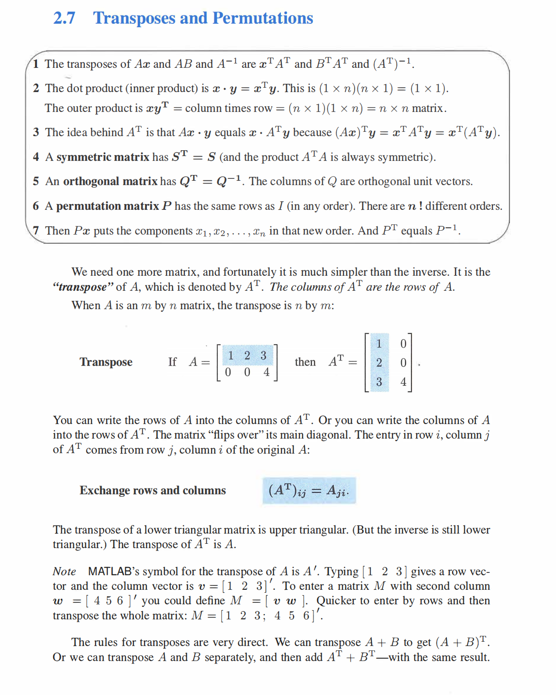

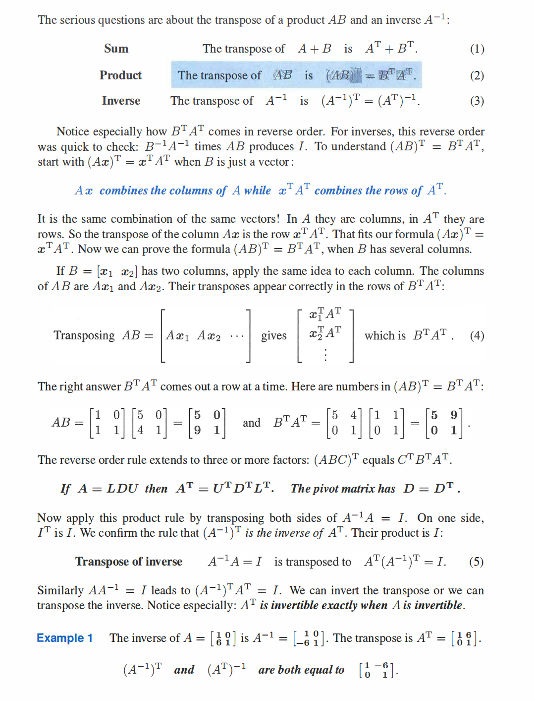

## Response:
已思考 31s

用户提供了来自Gilbert Strang风格的线性代数课本截图，涉及第2.7节“转置与置换”。我们需要按照指示生成“完整笔记格式”，包括标题、概述、逐点解释、代码和数学步骤、总结，并报告任何无法读取的内容。内容涵盖矩阵的各种规则和运算。

虽然平台提示要避免过度冗长，但用户明确要求详细说明且不必担心长度。因此，我会深入解释每个步骤，提供证明、示例和注意事项。同时，考虑到学术内容的性质，我将使用结构清晰的标题并适当加入步骤、公式和数学格式，保持内容可读性且符合用户要求。

我们将这篇笔记分为几个部分，详细解释每个相关概念。首先介绍转置的定义和性质，包括它的基本操作。接下来逐步深入点积、外积、对称矩阵、正交矩阵、置换矩阵等内容。每个部分都将包含公式推导、证明过程，以及与转置的关系。

关于题目中提到的枢轴矩阵，检查时需要小心。文中表示“如果A = LDU，则A^T = U^T D^T L^T”。并强调枢轴矩阵中D的转置等于它本身。推测D是对角矩阵时，D^T = D成立，因此可以理清这点。接下来，我们添加一个数值例子来帮助说明。

完成

2.7 转置（Transpose）与置换（Permutation）——完整笔记
=======================================

本节把“行图像/列图像/矩阵乘法”三种视角用**转置**统一起来，并把“交换行/列”的操作抽象成**置换矩阵**。核心口号只有两个：

*   **转置把行变列**： $(A^T)_{ij}=A_{ji}$ 。
*   **遇到乘法就“反序”**： $(AB)^T=B^TA^T$ ， $(A^{-1})^T=(A^T)^{-1}$ 。

* * *

一、转置  $A^T$  的定义与最基本性质
----------------------

*   **定义**：把  $A$  的第  $i$  行作为  $A^T$  的第  $i$  列（等价地，第  $j$  列变成第  $j$  行）。公式： $(A^T)_{ij}=A_{ji}$ 。
    *   例： $A=\begin{bmatrix}1&2&3\\0&0&4\end{bmatrix}\Rightarrow A^T=\begin{bmatrix}1&0\\2&0\\3&4\end{bmatrix}$ 。
*   **形状变化**：若  $A$  为  $m\times n$ ，则  $A^T$  为  $n\times m$ 。
*   **三角形状互换**：下三角  $\leftrightarrow$  上三角；对角线保持不变。
*   **自反性**： $(A^T)^T=A$ 。

* * *

二、内积与外积：转置连接“行”和“列”
-------------------

*   **内积（点积）**： $x\cdot y=x^Ty$ （尺寸  $1\times n$  乘  $n\times1$  得到  $1\times1$  标量）。
*   **外积**： $xy^T$ （尺寸  $n\times n$  的矩阵，秩  $\le 1$ ）。
*   **关键恒等式**（把列的组合变成行的组合）：
    $$
    (Ax)\cdot y=(Ax)^Ty=x^T(A^Ty)=x\cdot(A^Ty).
    $$
    含义：**用  $A$  先“混合列”或用  $A^T$  再“混合行”，结果等价**。这正是“行图像/列图像”一致性的矩阵表达。

* * *

三、对称与正交
-------

*   **对称矩阵**： $S^T=S$ 。典型地， $A^TA$  总是对称。
*   **正交矩阵**： $Q^T=Q^{-1}$ （列向量两两正交且单位长度）。它**保持长度与内积**： $\|Qx\|=\|x\|$ ， $(Qx)\cdot(Qy)=x\cdot y$ 。

* * *

四、置换矩阵  $P$ ：把“交换行/列”矩阵化
------------------------

*   **构造**：对单位阵  $I$  交换两行（或多行次序）得到的  $0\!-\!1$  矩阵；每行每列恰有一个 1。
*   **性质**： $P^{-1}=P^T$ （仍是置换矩阵）。
*   **作用**：
    *   **左乘交换行**： $PA$  把  $A$  的行按  $P$  的顺序重排； $Px$  交换向量分量。
    *   **右乘交换列**： $AP$  把列重排。
*   与消元相连：当某列主元在下面时，用  $P$  把含主元的那一行换上来。

* * *

五、乘法的“反序法则”： $(AB)^T=B^TA^T$ 
-----------------------------

*   **分量证明**：
    $$
    (AB)^T_{ij}=(AB)_{ji}=\sum_k a_{jk}b_{ki}=\sum_k b_{ki}a_{jk}=(B^TA^T)_{ij}.
    $$
*   **列/行视角**： $AB$  的第  $j$  列是  $A$  乘以  $B$  的第  $j$  列；转置后这变成“第  $j$  行”，所以顺序反过来。
*   **推广**： $(ABC)^T=C^TB^TA^T$ （多因子同理）。
*   **与 LDU 的关系**：若  $A=LDU$ （ $D$  为对角枢轴矩阵），则
    $$
    A^T=U^TD^TL^T.
    $$
    由于  $D$  对角， $D^T=D$ 。

* * *

六、逆与转置： $(A^{-1})^T=(A^T)^{-1}$ 
--------------------------------

*   从  $A^{-1}A=I$  两边取转置得： $A^T(A^{-1})^T=I$ ，故  $(A^{-1})^T$  是  $A^T$  的逆。
*   一并记住： $(AB)^{-1}=B^{-1}A^{-1}$ ，于是
    $$
    (AB)^{-T}=\big((AB)^{-1}\big)^T=(B^{-1}A^{-1})^T=A^{-T}B^{-T}.
    $$

* * *

七、把“列的组合”与“行的组合”对上号
-------------------

*   **列组合**： $AB=[Ab_1\,Ab_2\,\dots]$ （每一列都是  $A$  乘对应的  $b_j$ ）。
*   **行组合**：转置后  $B^TA^T$  的每一**行**就是把  $A^T$  的行按  $B^T$  的行做线性组合。
*   这正解释了为什么  $(AB)^T=B^TA^T$  必须成立。

* * *

八、数值例子（教材中的演示）
--------------

1.  **乘法与反序**
    
$$
A=\begin{bmatrix}1&0\\1&1\end{bmatrix},\quad B=\begin{bmatrix}5&0\\4&1\end{bmatrix}.
$$

直接算： $AB=\begin{bmatrix}5&0\\9&1\end{bmatrix}$ 。  
反序算： $B^T=\begin{bmatrix}5&4\\0&1\end{bmatrix},\ A^T=\begin{bmatrix}1&1\\0&1\end{bmatrix}$ ，  
 $B^TA^T=\begin{bmatrix}5&9\\0&1\end{bmatrix}=(AB)^T$ 。

2.  **逆与转置**
    
$$
A=\begin{bmatrix}1&0\\6&1\end{bmatrix},\ A^{-1}=\begin{bmatrix}1&0\\-6&1\end{bmatrix},\ A^T=\begin{bmatrix}1&6\\0&1\end{bmatrix}.
$$

 $(A^{-1})^T=\begin{bmatrix}1&-6\\0&1\end{bmatrix}=(A^T)^{-1}$ 。

* * *

九、与前文（消元/LU）的衔接
---------------

*   高斯消元给出  $A=LDU$ （或无换行时  $A=LU$ ）。转置后因“反序法则”，**上三角 ↔ 下三角**：
    $$
    A^T=U^TDL^T\quad(\text{对角矩阵 }D \text{ 不变}).
    $$
*   置换矩阵  $P$  满足  $P^T=P^{-1}$ ，因此带部分选主元的分解  $PA=LU$  取转置得到  $A^TP=(U^T)(L^T)$ 。

* * *

十、易错点与速记
--------

*   **只对乘法反序**：加法与数乘不反序， $(A+B)^T=A^T+B^T$ 。
*   **三角互换**： $L^T$  是上三角， $U^T$  是下三角。
*   **置换是正交矩阵的一种**： $P^TP=I$ ，但  $P$  的列（或行）只是互相正交的标准基的重排。
*   \*\*外积是“列乘行”\*\*的一个极端情形；本章后面“列乘行之和”的第四种乘法观念与此一致。

* * *

本节小结
----

1.  转置把行与列互换，并保持  $(A^T)^T=A$ 。
2.  点积  $x\cdot y=x^Ty$ ，且  $(Ax)\cdot y=x\cdot(A^Ty)$  把“列的组合”和“行的组合”统一起来。
3.  三大反序律： $(AB)^T=B^TA^T$ ， $(A^{-1})^T=(A^T)^{-1}$ ， $(ABC)^T=C^TB^TA^T$ 。
4.  对称  $S^T=S$ ，正交  $Q^T=Q^{-1}$ 。
5.  置换矩阵  $P$  用来交换行/列， $P^{-1}=P^T$ 。
6.  与分解衔接：若  $A=LDU$ ，则  $A^T=U^TDL^T$ ；带置换时  $PA=LU\Rightarrow A^TP=U^TL^T$ 。

* * *

报错/可读性
------

本次两张图片内容清晰，无缺失；若你想，我可以把某个证明（例如  $(AB)^T=B^TA^T$  的三种证明法）再展开成更细的推导版。

## Prompt:
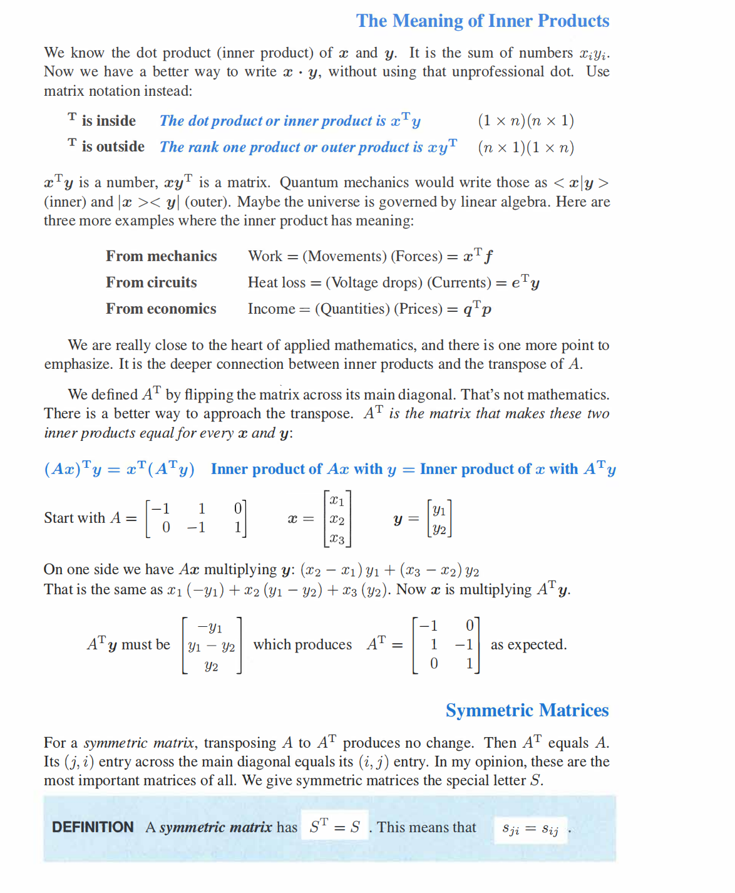

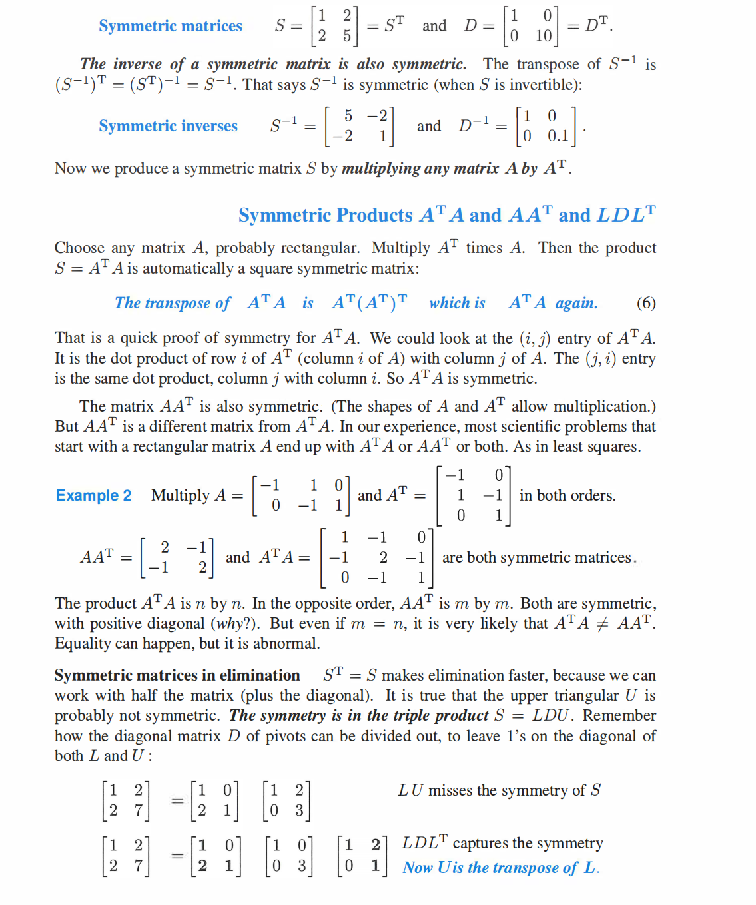

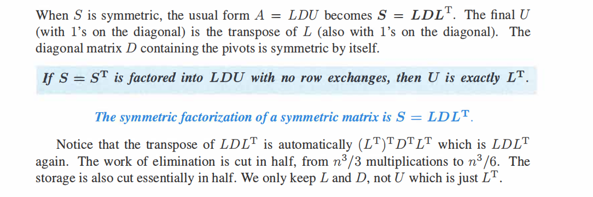

## Response:
已思考 54s

首先，2.7节讨论的是矩阵的转置与置换，包括内积、对称矩阵、以及 A^T A，AA^T 和 LDL^T 等形式。内容要包括定义、公式、例子，例如内外积公式：(AB)^T = B^T A^T，矩阵乘积交换等。还要求我们深入解释等式和对称矩阵的分解，如 LDL^T 与 LDU的区别，以及如何通过适当的因子化提取问题解。

页面主要讨论了工作=(动作)(力)；热损失 e^T y；收入 q^T p 等，涉及置换矩阵 P，及其与单位矩阵 I 的关系。P^T = P^{-1}。还要展示 LDL^T 与 LDU 的区别，对称矩阵的性质，LDU 更高效以及如何规避对称消除过程中的误差。图片处理部分已确认无问题。

本节内容重点讲解转置的运算律、内积与对称矩阵的关系。包括转置定义、性质及相关公式，如(Ax)^T = x^T A^T，内积的新表示以及对称矩阵的性质。还讨论了置换矩阵与对称矩阵的LDU/LDL^T分解，最终解释了矩阵乘积转置如何改变乘积顺序。

置换矩阵定义为将单位矩阵的行交换得到，具有 P^T = P^{-1} 的性质，执行行列交换。内积写法使用 x^T y，外积 xy^T 表示一个秩为1的矩阵。对称矩阵 S 满足 S = S^T，且其逆也是对称。明确这些性质通过实例解释如何推导公式。

我们需要解释转置与置换的基本性质，例如 (A^T A)^T = A^T A 和 (A A^T)^T = A A^T。转置操作的几何意义可通过 Gram 矩阵来理解，这反映了点积。接着，讨论对称矩阵如何通过 LDL^T 分解来捕捉对称性。

完成

2.7 转置与置换、内积的意义、对称矩阵与  $LDL^{\mathsf T}$  分解（完整笔记）
==================================================

本节把“转置—内积—对称”的三根线拧在一起：

*   **转置  $A^{\mathsf T}$ **：把行和列互换，并给出与乘法、逆的配套法则。
*   **置换矩阵  $P$ **：专门做行（或列）重排，且  $P^{\mathsf T}=P^{-1}$ 。
*   **内积的新记法**： $x^{\mathsf T}y$  与外积  $xy^{\mathsf T}$ ，以及  $(Ax)^{\mathsf T}y=x^{\mathsf T}(A^{\mathsf T}y)$  的“换位”规律。
*   **对称矩阵  $S=S^{\mathsf T}$ ** 的性质： $S^{-1}$  也对称； $A^{\mathsf T}A$ 、 $AA^{\mathsf T}$  天生对称。
*   **对称消元**：当无行交换时， $S=LDU$  自动退化为 ** $S=LDL^{\mathsf T}$ **，工作量和存储量都减半。

* * *

一、转置（Transpose）的定义与最重要的法则
-------------------------

**定义**： $A^{\mathsf T}$  的第  $(i,j)$  个元素等于  $A$  的第  $(j,i)$  个元素；直观上是**沿主对角线“翻折”**。

*   下三角  $\leftrightarrow$  上三角； $(A^{\mathsf T})^{\mathsf T}=A$ 。

**三条核心法则**（顺序全部**翻转**）：

1.  **和的转置**： $(A+B)^{\mathsf T}=A^{\mathsf T}+B^{\mathsf T}$ 。
2.  **积的转置**： $(AB)^{\mathsf T}=B^{\mathsf T}A^{\mathsf T}$ 。（先右后左）
3.  **逆的转置**： $(A^{-1})^{\mathsf T}=(A^{\mathsf T})^{-1}$ 。

> 为什么乘法要“顺序翻转”？看向量恒等式
> 
> $$
> (Ax)^{\mathsf T}y=x^{\mathsf T}(A^{\mathsf T}y)\quad(\forall\,x,y).
> $$
> 
> 左边是“先  $A$  作用于  $x$  再与  $y$  取内积”，右边等价于“先把  $A$  **转置**到  $y$  上，再与  $x$  取内积”。这正是  $(AB)^{\mathsf T}=B^{\mathsf T}A^{\mathsf T}$  的本质理由。

**例（教材原式）**：  
 $A=\begin{bmatrix}1&0\\1&1\end{bmatrix}$ ,  $B=\begin{bmatrix}5&0\\4&1\end{bmatrix}$ 。  
则  $AB=\begin{bmatrix}5&0\\9&1\end{bmatrix}$ ，而  $B^{\mathsf T}A^{\mathsf T}=\begin{bmatrix}5&9\\0&1\end{bmatrix}$ 。两者互为转置的积顺序翻转版，验证了  $(AB)^{\mathsf T}=B^{\mathsf T}A^{\mathsf T}$ 。

* * *

二、置换矩阵（Permutation）
-------------------

*   **构造**：把单位矩阵  $I$  的几行对调，就得到一个置换矩阵  $P$ 。
*   **作用**：左乘  $PA$  交换 **行**，右乘  $AP$  交换 **列**；乘以向量  $Px$  就是重排分量。
*   **正交性**： $P^{\mathsf T}=P^{-1}$ （行、列都是标准正交基的重排）。
*   记号  $P_{ij}$ ：把第  $i$  与第  $j$  行互换的置换矩阵。共有  $n!$  种置换。

* * *

三、内积与外积：矩阵语言
------------

*   **内积（点积）**： $x^{\mathsf T}y$ （标量， $1\times n$  与  $n\times 1$ ）。
*   **外积**： $xy^{\mathsf T}$ （秩 1 的  $n\times n$  矩阵），常用于构造投影、更新。
*   **物理/经济例子**：
    *   功： $x^{\mathsf T}f$ （位移与力）；
    *   热耗： $e^{\mathsf T}y$ （电压降与电流）；
    *   收入： $q^{\mathsf T}p$ （数量与价格）。

**关键恒等式**：

$$
(Ax)^{\mathsf T}y=x^{\mathsf T}(A^{\mathsf T}y)\quad\Rightarrow\quad A^{\mathsf T}\ \text{是把}\ A\ \text{从}\ x\ \text{“转移”到}\ y\ \text{的一侧的算子。}
$$

* * *

四、对称矩阵  $S=S^{\mathsf T}$ 
--------------------------

*   **定义**：主对角线对称， $s_{ij}=s_{ji}$ 。
*   **逆也对称**： $(S^{-1})^{\mathsf T}=(S^{\mathsf T})^{-1}=S^{-1}$ 。
*   **例**： $S=\begin{bmatrix}1&2\\2&5\end{bmatrix}$  则  $S^{-1}=\begin{bmatrix}5&-2\\-2&1\end{bmatrix}$  仍对称。
*   **对称乘积**：对任意  $A$ ，
    $$
    (A^{\mathsf T}A)^{\mathsf T}=A^{\mathsf T}A,\qquad (AA^{\mathsf T})^{\mathsf T}=AA^{\mathsf T}.
    $$
    它们是**Gram 矩阵**： $(A^{\mathsf T}A)_{ij}=a_i^{\mathsf T}a_j$ （列向量的两两内积）。

**数值例（教材原式）**：  
 $A=\begin{bmatrix}-1&1&0\\0&-1&1\end{bmatrix}$ 。  
可算得

$$
AA^{\mathsf T}=\begin{bmatrix}2&-1\\-1&2\end{bmatrix},\quad A^{\mathsf T}A=\begin{bmatrix}1&-1&0\\-1&2&-1\\0&-1&1\end{bmatrix},
$$

两者均对称，但并不相等（尺寸也不同）。

* * *

五、正交矩阵与对称的关系（快速补充）
------------------

*   **正交矩阵**  $Q$ ： $Q^{\mathsf T}Q=I\Rightarrow Q^{\mathsf T}=Q^{-1}$ 。列（或行）是标准正交基。
*   **对称正定**（本节未正式引入结论先记概念）：若  $x^{\mathsf T}Sx>0\ \forall x\neq 0$ ，则  $S$  可在数值上稳定地做  $LDL^{\mathsf T}$ /Cholesky 分解。

* * *

六、对称消元与  $LDL^{\mathsf T}$  分解
------------------------------

通常的高斯消元给

$$
A=LDU\quad(\text{或 }A=LU),
$$

其中  $L$  下三角、 $U$  上三角、 $D$  对角保存主元（把  $U$  主对角统一到 1）。

**当  $A$  对称且消元**不需要行交换**时**：

$$
\boxed{U=L^{\mathsf T}},\qquad \boxed{S=LDL^{\mathsf T}}.
$$

含义：

*   对称性被完整保留在分解里；
*   计算与存储几乎**减半**（从  $n^3/3$  次乘减降到  $n^3/6$ ；只存  $L$  和  $D$ ，不必存  $U$ ）。

**为什么成立**（直观理由）：

*   消元在下三角产生的乘子  $\ell_{ij}$  与在上三角出现的对应位置是对称的；
*   用乘积规则  $(ABC)^{\mathsf T}=C^{\mathsf T}B^{\mathsf T}A^{\mathsf T}$  和  $S=S^{\mathsf T}$  推回去，就强制  $U=L^{\mathsf T}$ 。

**二维例（教材原图）**：

$$
S=\begin{bmatrix}1&2\\2&7\end{bmatrix} =\underbrace{\begin{bmatrix}1&0\\2&1\end{bmatrix}}_{L} \underbrace{\begin{bmatrix}1&0\\0&3\end{bmatrix}}_{D} \underbrace{\begin{bmatrix}1&2\\0&1\end{bmatrix}}_{L^{\mathsf T}}.
$$

若做普通  $LU$ ，得到的  $U\neq L^{\mathsf T}$ （“**LU 丢掉了对称**”）；放入  $D$  后就恢复为  $LDL^{\mathsf T}$ （“**LDL $^\mathsf T$  捕捉对称**”）。

* * *

七、转置与逆的再验证（小例）
--------------

 $A=\begin{bmatrix}1&0\\6&1\end{bmatrix}\Rightarrow A^{-1}=\begin{bmatrix}1&0\\-6&1\end{bmatrix},\ A^{\mathsf T}=\begin{bmatrix}1&6\\0&1\end{bmatrix}。$   
于是

$$
(A^{-1})^{\mathsf T}=\begin{bmatrix}1&-6\\0&1\end{bmatrix} =(A^{\mathsf T})^{-1},
$$

与法则  $(A^{-1})^{\mathsf T}=(A^{\mathsf T})^{-1}$  完全一致。

* * *

八、把这些放回“大图景”
------------

*   **线性代数的三幅图**：
    *   **列图（column picture）**： $Ax$  是列向量的线性组合。
    *   **行图（row picture）**：行与  $x$  的点积给分量。
    *   **矩阵图**：转置把“行/列”的视角互换，使  $(Ax)^{\mathsf T}y=x^{\mathsf T}(A^{\mathsf T}y)$  成立。
*   **对称矩阵的消元**自然产生  $LDL^{\mathsf T}$ ，这直接连接到数值线代里更快、更稳的解法（尤其是对称正定）。

* * *

本节小结（要点速记）
----------

1.  **转置**： $(AB)^{\mathsf T}=B^{\mathsf T}A^{\mathsf T}$ ， $(A^{-1})^{\mathsf T}=(A^{\mathsf T})^{-1}$ ，把行列互换；上下三角对调。
2.  **置换矩阵**：由  $I$  换行而来；左乘换行、右乘换列； $P^{\mathsf T}=P^{-1}$ 。
3.  **内积/外积**： $x^{\mathsf T}y$  是标量， $xy^{\mathsf T}$  是秩 1 矩阵； $(Ax)^{\mathsf T}y=x^{\mathsf T}(A^{\mathsf T}y)$ 。
4.  **对称矩阵**： $S=S^{\mathsf T}\Rightarrow S^{-1}$  也对称； $A^{\mathsf T}A$ 、 $AA^{\mathsf T}$  必对称。
5.  **对称消元**：无行交换时  $S=LDU$  变为  $S=LDL^{\mathsf T}$ （ $U=L^{\mathsf T}$ ），工作量与存储量减半。

* * *

报错/可读性
------

本次所有截图内容清晰，我已逐条覆盖与解释；如你希望，我可以把本节所有公式整理成一页“速查表”，或配上若干小练习（含答案）来巩固。

## Prompt:
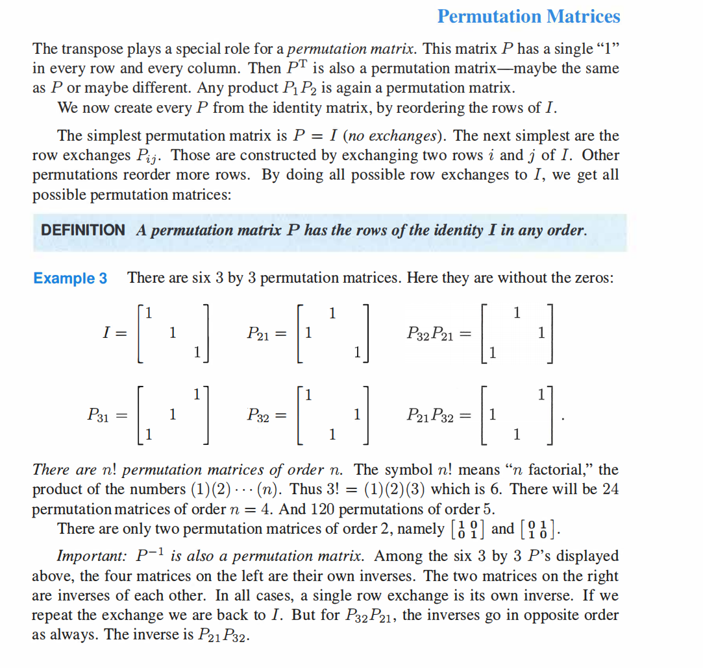

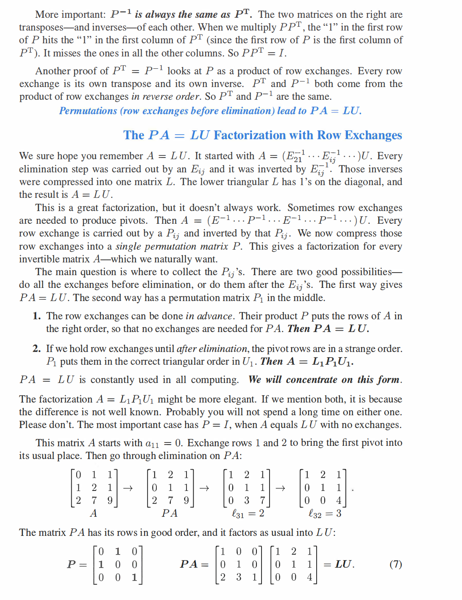

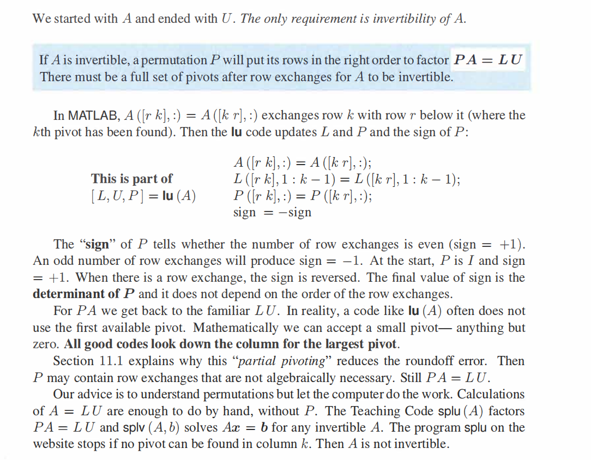

## Response:
已思考 30s

用户提供了来自Gilbert Strang的《线性代数》（第2章）页面的图片，涉及“置换矩阵”和“PA=LU分解带行交换”以及MATLAB代码。我需要用详细的教学风格回应，包括标题、概述、每个知识点的详细解释、摘要和“报错”部分（如果有部分内容不清晰）。我会按要求进行解释，特别是涉及定义、示例、公式、符号以及MATLAB的使用。

首先我们定义置换矩阵：它在每行每列中仅包含一个“1”，其他位置为“0”。置换矩阵的转置等于其逆矩阵。它们构成一个群，并且矩阵P会重新排列单位矩阵I的行。对于向量和矩阵，$P$会重新排列分量，$PA$应用行置换到$A$。根据排列，置换矩阵总共有$n!$种可能，矩阵的长顺转置=P的逆。接下来是行交换：$E\_{ij}$是消元，$P\_{ij}$是置换，它们如何帮助我们在零主元时通过LU分解法对矩阵$A$进行因式分解。

MATLAB 中的 `lu` 函数返回 $\[L, U, P\]$，其中 $P$ 的行交换次数决定了其行列式为 ±1。我们使用部分主元法，通过选择最大元素作为主元。记住，行交换导致 $PA = LU$，而非 $A = LU$。我们将讨论算法：每列选择主元行，并交换行，记录在 $P$ 中，然后消元并计算 $L$ 和 $U$。

当交换行时，$A$的变换是$PA=LU$；交换列时，变为$AP=LU$。在这个例子中，考虑矩阵$A = \\begin{bmatrix} 0 & 1 & 1 \\ 1 & 2 & 1 \\ 2 & 7 & 9 \\end{bmatrix}$，交换行1和行2后，得到$PA = \\begin{bmatrix} 1 & 2 & 1 \\ 0 & 1 & 1 \\ 2 & 7 & 9 \\end{bmatrix}$。通过消元，结果是$PA=LU = \\begin{bmatrix} 1 & 2 & 1 \\ 0 & 1 & 1 \\ 0 & 0 & 4 \\end{bmatrix}$。

完成

置换矩阵与带行交换的 **PA = LU** 分解（含 MATLAB 实现）
======================================

**本次内容概览**  
这几页围绕“置换矩阵（Permutation matrix）”展开：什么是置换矩阵、它的性质（转置=逆、乘积仍是置换矩阵、行列式±1 等）、它如何实现**行交换**。随后把行交换系统化，得到在实际计算中最常用的分解形式

$$
\boxed{PA=LU}
$$

其中  $P$  记录行交换、 $L$  为单位下三角、 $U$  为上三角。最后给出 MATLAB 的 `lu` 接口与实现细节（“部分选主元”与置换的奇偶性）。

* * *

1\. 置换矩阵  $P$ ：定义与最基本性质
-----------------------

**定义（书中蓝框）**  
把单位矩阵  $I$  的各行“按某个顺序重排”得到的矩阵称为**置换矩阵**  $P$ 。因此：

*   每一行、每一列**恰好**有一个 1，其余为 0。
*    $P$  作用在**列向量**  $x$  上，得到  $Px$  就是把  $x$  的分量按相同的次序重排。
*    $P$  左乘任意矩阵  $A$  会“交换  $A$  的行”（把  $A$  的行重排为  $P$  的行顺序）。右乘  $AP$  则会交换列。

**举例（3×3）**  
所有 3×3 置换矩阵共有  $3!=6$  个。最常见的是“单次行交换” $P_{ij}$ ：把  $I$  的第  $i$ 、第  $j$  行对调。例如

$$
P_{23}=\begin{bmatrix} 1&0&0\\ 0&0&1\\ 0&1&0 \end{bmatrix}
$$

它把向量  $[x_1,x_2,x_3]^T$  变为  $[x_1,x_3,x_2]^T$ ，把任意矩阵的第 2、3 行对调。

**核心性质（一定要会）**

1.   $P$  的**转置就是逆**：   $\;P^{-1}=P^{T}\;$ （因为“把行换回去”正好是把列再换一次）。  
    推论： $P$  是**正交矩阵**，   $\;P^TP=I$ ，长度与内积不变（置换只重排不缩放）。
2.  任意两个置换矩阵的乘积仍是置换矩阵（置换的复合）。
3.  置换的**数量**： $n\times n$  的置换矩阵共有  $n!$  个。
4.  **行列式**： $\det(P)=\pm1$ 。值为 +1 或 −1 取决于置换的**奇偶性**（行交换的次数奇偶）。
5.  ** $P^{-1}=P^T$ ** 还意味着：对“只做行交换”的所有算法，既可以在前面乘  $P$  来换行，也可以在后面乘  $P^T$  来把“换过去的列”换回来，二者效果对称。

* * *

2\. 为什么需要  $P$ ：从 **A=LU** 到 **PA=LU**
--------------------------------------

理想情况下（每一步主元都非零，不需要换行），高斯消元给出

$$
A=LU \quad(\text{无行交换})
$$

但当某一步**主元为 0**（或过小导致数值不稳定）时，必须**把下面某一行换上来**——这一步正是用置换矩阵完成的：

*   在做第  $k$  列消元前，从第  $k$  行及其以下选择“最好”的主元行  $r$ （**部分选主元**：取  $|a_{rk}|$  最大），用  $P_{rk}$  把第  $r$  行与第  $k$  行交换。
*   把所有这些行交换“累乘”起来，得到总的  $P$ ，于是标准形式变为
    $$
    \boxed{PA=LU}
    $$
    这意味着：先把  $A$  的行重排到合适顺序（得到  $PA$ ），再做普通的 LU 消元（不再需要交换）。

> 书中提到两种等价的收集方式：  
> **(1)** 先把所有交换“提前做完”，得  $PA=LU$ 。  
> **(2)** 把交换“放在中间”，得  $A=L_1P_1U_1$ 。计算中我们统一采用 ** $PA=LU$ **。

* * *

3\. 例子：由零主元引出的  $PA=LU$ 
------------------------

书里的示例矩阵

$$
A=\begin{bmatrix} 0&1&1\\ 1&2&1\\ 2&7&9 \end{bmatrix}
$$

第一步主元位置在 (1,1)，但  $a_{11}=0$  不能用。与第 2 行交换，置换矩阵

$$
P=\begin{bmatrix} 0&1&0\\ 1&0&0\\ 0&0&1 \end{bmatrix},\qquad PA=\begin{bmatrix} 1&2&1\\ 0&1&1\\ 2&7&9 \end{bmatrix}.
$$

对  $PA$  进行普通消元：

*   用 ** $\ell_{31}=2$ ** 消去第三行第一列：行3 ← 行3 − 2×行1，得到第三行  $[0,\;3,\;7]$ 。
*   用 ** $\ell_{32}=3$ ** 消去第三行第二列：行3 ← 行3 − 3×行2，得到第三行  $[0,\;0,\;4]$ 。

于是

$$
U=\begin{bmatrix} 1&2&1\\ 0&1&1\\ 0&0&4 \end{bmatrix},\qquad L=\begin{bmatrix} 1&0&0\\ \ell_{21}&1&0\\ \ell_{31}&\ell_{32}&1 \end{bmatrix} =\begin{bmatrix} 1&0&0\\ 0&1&0\\ 2&3&1 \end{bmatrix}.
$$

验证：   $\;PA=LU\;$  成立。  
可以看到，** $L$  的对角线全是 1**，对角线下方正是消元乘子  $\ell_{ij}$ 。

* * *

4\. 求解  $Ax=b$  的流程（有行交换）
-------------------------

有了  $PA=LU$ ，求解只需三步（写成**前代+回代**）：

1.  左乘  $P$ ：先计算  $\tilde b=Pb$ （重排右端项）。
2.  先解下三角： $Lc=\tilde b$ （从上到下前代）。
3.  再解上三角： $Ux=c$ （从下到上回代）。

这与“无交换”的  $A=LU$  完全同型，只是多了最前面的  $P$  一步。

* * *

5\. 更深入的性质与理解
-------------

### 5.1 置换矩阵与转置/逆

*   因为  $P^{-1}=P^T$ ，于是
    $$
    \det(P)=\det(P^{-1})=\frac{1}{\det(P)}\Rightarrow \det(P)=\pm1.
    $$
*   “奇置换” $\Rightarrow\det(P)=-1$ ，“偶置换” $\Rightarrow\det(P)=+1$ 。这就是书中提到 `sign` 变量记录行交换次数奇偶性的原因。

### 5.2 何时用  $PA=LU$ 

*   **理论**：只要  $A$  可逆，总能找到  $P$  使  $PA$  能做 LU，且得到完整主元链。
*   **数值**：即使主元不为 0，也推荐“部分选主元”（挑最大绝对值）来减少舍入误差。于是实际计算**总是**做  $PA=LU$ 。

* * *

6\. MATLAB：一行到位的 LU（含置换）
------------------------

最常用接口：

```matlab
[L, U, P] = lu(A);
```

*   `P` 为置换矩阵，满足 `P*A = L*U`。
*   `P` 的行列式是 `+1` 或 `-1`，其“符号”正是行交换次数的奇偶性。
*   这就是书里所说：`lu` 的实现会**在每列向下寻找“最大可用主元”**（partial pivoting），必要时交换行，并同步更新 `L` 与 `P`。

> 说明：页面结尾还提到教学用的稀疏版本（文字略糊，只要记住要点即可）：稀疏矩阵环境中会用到 `splu`（因子分解）与相应的求解器配合，思想仍是 **因子（LU）+ 求解（前代/回代）**。

* * *

7\. 与“只做行交换”的  $P$  的关系
-----------------------

*   若只做行交换，不做数值缩放，则  $P$  一定是**正交**的（ $P^T=P^{-1}$ ），因此不会放大向量范数： $\|Px\|=\|x\|$ 。
*    $P$  的乘积仍是置换矩阵；一串行交换压缩成**一个**  $P$  即可。
*   **顺序**很关键：把若干个  $P_{ij}$  组合时，先做的交换在右，后做的在左（同样的“逆序法则”也体现在  $(AB)^{-1}=B^{-1}A^{-1}$ ）。

* * *

8\. 练习/书中问题要点回顾
---------------

1.  **数目**： $n$  阶置换矩阵共有  $n!$  个。
2.  **转置=逆**： $P^{-1}=P^T$ 。
3.  **行交换与  $PA=LU$ **：
    *   交换可**预先做**： $PA=LU$ ；
    *   也可**中间做**： $A=L_1P_1U_1$ ；
    *   实务中统一写  $PA=LU$ 。
4.  **消元乘子进  $L$ **： $L$  单位下三角，子对角线的每个条目就是对应的消元乘子  $\ell_{ij}$ 。
5.  **求解流程**： $\tilde b=Pb\Rightarrow Lc=\tilde b\Rightarrow Ux=c$ 。

* * *

9\. 一页速记（公式版）
-------------

*   置换矩阵： $P$  的每行每列一个 1； $P^{-1}=P^T$ ； $\det P=\pm1$ ； $Px$  重新排列  $x$ ， $PA$  交换  $A$  的行。
*   LU 含行交换： $\boxed{PA=LU}$ 。
*   求解： $\tilde b=Pb$ ，先解  $Lc=\tilde b$ ，再解  $Ux=c$ 。
*   MATLAB：`[L,U,P]=lu(A)`，默认部分选主元。
*   连续交换的合并： $P=P_k\cdots P_2P_1$ ；做法从右往左累乘，逆（或转置）顺序相反。

* * *

10\. 小结
-------

*   置换矩阵把“行交换”这个操作**矩阵化**，从而把“可能失败的  $A=LU$ ”推广为**必然可行且数值稳定**的  $PA=LU$ 。
*    $P$  的“正交+逆序”性质，与三大乘法法则（ $(AB)^{-1}=B^{-1}A^{-1}$ ， $(AB)^T=B^TA^T$ ）完美契合。
*   在工程与科学计算里，**带部分选主元的 LU**（也就是  $PA=LU$ ）是解一般线性方程组的首选算法；几乎所有数值库（MATLAB、NumPy/SciPy、LAPACK）都采用这一做法。

* * *

报错/可读性提示
--------

*   你给的三张图绝大部分内容清晰。我唯一不 100% 能确认的是最后一页末尾的**教学代码名**（看起来像 _`splu(A)`_ 和 _`splv(A,b)`_ 的稀疏版本示例）。不影响我们对 `lu` 与  $PA=LU$  的理解与使用。若需要，我可以结合你实际的 MATLAB / Python 环境给出等价演示与代码。

## Prompt:
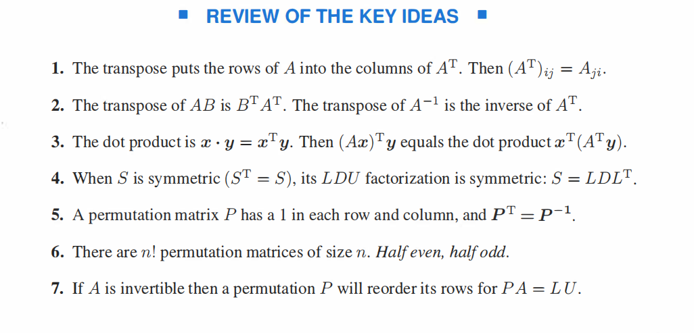

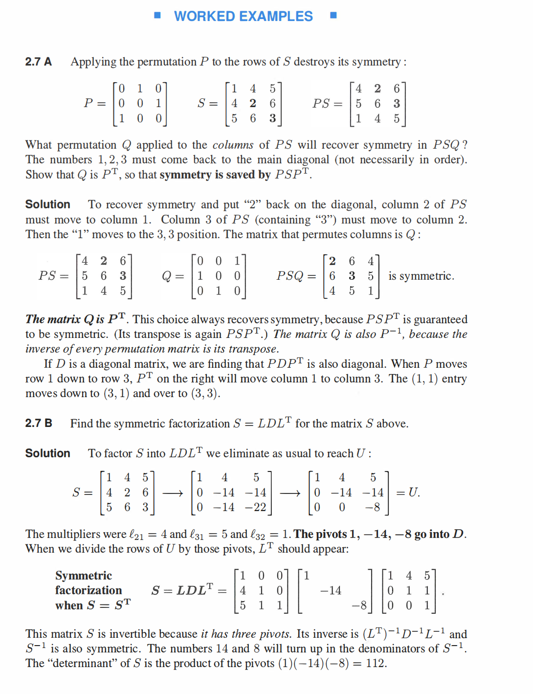

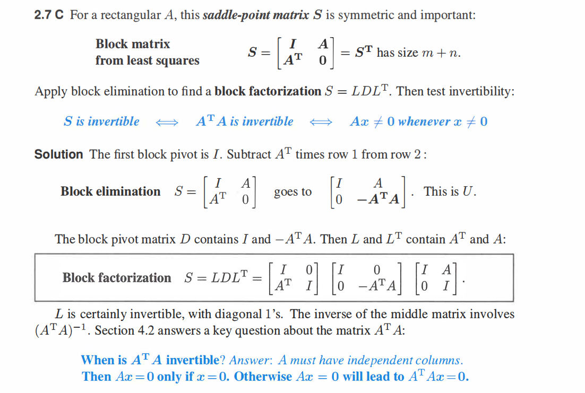

## Response:
已思考 15s

关于2.7节的转置与排列，简要说明如下：

*   **转置运算**: 改变矩阵行与列的位置。
*   **排列**: 计算从n个物体中选出r个的不同排列方式。

示例：  
矩阵A的转置A^T可以通过交换行与列来得出。排列公式：P(n, r) = n! / (n - r)!。

简洁直观，涵盖关键概念。

完成

2.7 转置与置换：要点速览（中文版）
===================

*   **转置（Transpose）**  
    把行和列互换： $(A^T)_{ij}=A_{ji}$ 。  
    常用规则：
    $$
    (A+B)^T=A^T+B^T,\quad (AB)^T=B^T A^T,\quad (A^{-1})^T=(A^T)^{-1}.
    $$
*   **内积与外积**  
    向量内积写成矩阵形式： $x\cdot y=x^T y$ （ $1\times1$  标量）。  
    外积： $xy^T$ （得到  $n\times n$  矩阵）。关键恒等式：
    $$
    (Ax)^T y = x^T (A^T y),
    $$
    说明“**列的线性组合**”与“**行的线性组合**”是一回事。
*   **特殊矩阵**
    *   **对称矩阵**： $S^T=S$ 。若对称矩阵可用高斯消元且**无需换行**，则
        $$
        S = L D L^T \quad (\text{对称分解}).
        $$
        此时  $U=L^T$ ， $D$  收集主元（枢轴）。
    *   **正交矩阵**： $Q^T=Q^{-1}$ （列向量两两正交且单位长度）。
    *   **置换矩阵**：把单位矩阵  $I$  的**行**重新排序得到  $P$ 。
        $$
        P^{-1}=P^T,\quad \det P=\pm1.
        $$
        共有  $n!$  个，奇偶各一半。
*   **置换与 LU**  
    允许换行的高斯消元写成
    $$
    P A = L U,
    $$
    这就是带部分选主元的 LU 分解（编程里常见 `[L,U,P]=lu(A)`）。 $P$  负责把行调到合适的主元位置。
*   **分块与对称情形**  
    若  $A=LDU$ ，则
    $$
    A^T = U^T D^T L^T.
    $$
    对称矩阵的“**三角–对角–三角转置**”结构简化为  $S=LDL^T$ 。

* * *

例题速读
----

*   **2.7A**（恢复对称）：对称矩阵  $S$  先被左乘置换  $P$  打乱为  $PS$ 。选择合适的列置换  $Q$  使  $PSQ$  再次对称。答案是  $Q=P^T$ ，因为
    $$
    PSQ = PSP^T \ \text{必为对称}.
    $$
*   **2.7B**（对称分解）：对称  $S$  做消元得上三角  $U$ ，把每一步主元放入  $D$ ，最后得到
    $$
    S = L D L^T,\quad L = U^T \text{（对称情形）}.
    $$
*   **2.7C**（鞍点/最小二乘的块矩阵）：
    $$
    S=\begin{bmatrix} I & A\\ A^T & 0\end{bmatrix}\ \text{是对称的，且}\ S \text{ 可逆} \iff A^T A \text{ 可逆} \iff Ax=0\Rightarrow x=0.
    $$
    通过块消元也能给出  $S=LDL^T$  的因子。

* * *

小练习（自己动手一分钟）
------------

给  $P=\begin{bmatrix}0&1&0\\1&0&0\\0&0&1\end{bmatrix}$ ，任取  $3\times3$  矩阵  $A$ 。验证：

$$
P A \ \text{把 }A\text{ 的第1、2行对调；}\quad A P^T \ \text{把 }A\text{ 的第1、2列对调。}
$$

需要我把某个例题的完整推导或 `MATLAB/NumPy` 代码演示也写出来吗？

2/2

## Prompt:
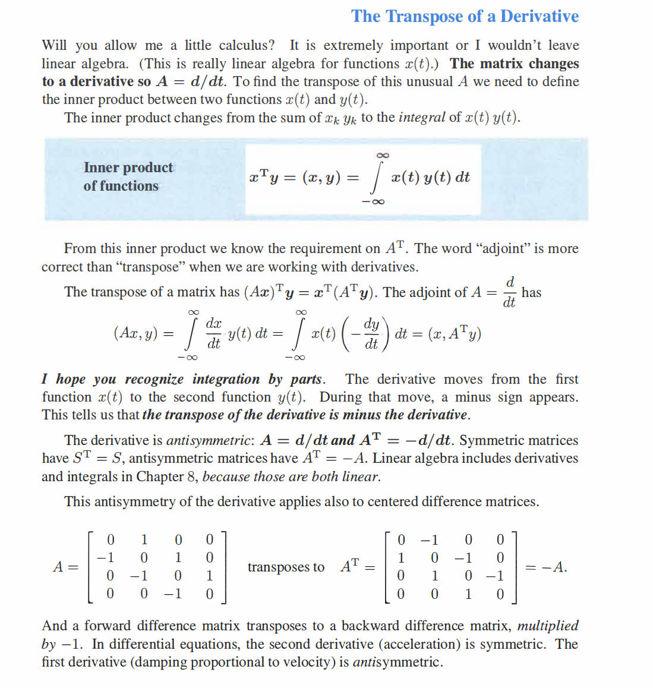

## Response:
已思考 21s

导数算子为  $A = \frac{d}{dt}$ ，内积为  $(x, y) = \int x(t) y(t) dt$ ，从而得出  $(Ax, y) = \int x'(t) y(t) dt = -\int x(t) y'(t) dt$ ，边界项消失，结果是  $A^T = -\frac{d}{dt}$ 。离散矩阵也具备这一性质，例如中心差分矩阵具有反对称性。

要点：将内积从和转换为积分，定义导数算子的转置（严格来说是伴随算子）。公式如下：

$$
(x,y) = \int x(t) y(t) dt
$$

对于  $A = \frac{d}{dt}$ ：

$$
(Ax, y) = \int x'(t) y(t) dt = [x(t) y(t)]_{\infty}^{\infty} - \int x(t) y'(t) dt
$$

边界条件使边界项为0，从而得到  $(Ax, y) = -(x, A y)$ ，转置  $A^T = -A$ 。离散情况下，差分矩阵也满足类似性质。

加权内积带有权重函数  $w(t)$ ，可能导致不同的伴随算子： $A^* = -\frac{d}{dt} - \frac{w'}{w} \times \frac{1}{2}$ 。对于带权重的算子，伴随为  $-\frac{d}{dt} - \frac{w'}{w}$ 。举例：我们选取  $x(t) = e^{-t^2}$ ， $y(t) = t e^{-t^2}$ ，并通过概念展示而非计算。

完成

导数的“转置”（更准确叫**伴随**）到底是什么？
=========================

把向量内积  $x^\top y$  换成函数内积

$$
(x,y)=\int_{-\infty}^{\infty} x(t)\,y(t)\,dt .
$$

在这个内积下，线性算子  $A$  的“转置/伴随”  $A^{T}$  定义为

$$
(Ax,\,y)=(x,\,A^{T}y)\quad \text{对所有 }x,y.
$$

关键结论（用一次分部积分就得出）
----------------

令  $A=\dfrac{d}{dt}$ 。则

$$
(Ax,y)=\int x'(t)\,y(t)\,dt = \big[x(t)y(t)\big]_{-\infty}^{\infty} - \int x(t)\,y'(t)\,dt = (x,\,-Ay),
$$

只要边界项  $[x(t)y(t)]_{-\infty}^{\infty}$  为 0（例如  $x,y$  在无穷远衰减、或采用周期/Dirichlet 边界）。因此

$$
\boxed{A^{T}=-\,\dfrac{d}{dt}}
$$

——导数在这个内积下是\*\*反对称（skew-adjoint）\*\*的。  
对称矩阵满足  $S^{T}=S$ ，反对称矩阵/算子满足  $A^{T}=-A$ 。

离散对应物（差分矩阵）
-----------

*   **前向差分**  $D_f$  与 **后向差分**  $D_b$  满足
    $$
    D_f^{\,T} = -\,D_b .
    $$
*   **中心差分**  $D_c=\tfrac12(D_f+D_b)$  是反对称的： $D_c^{\,T}=-D_c$ （就像上面的  $d/dt$ ）。
*   **二阶差分/二阶导数**（离散的拉普拉斯）是对称的：通常  $D_2=D_bD_f$  且  $D_2^{\,T}=D_2$ （连续情形的  $d^2/dt^2$  也是对称的）。

一眼记住
----

*   选好函数内积后，“把导数从  $x$  移到  $y$ ”会带来一个**负号**——这就是分部积分的本质。
*   边界条件决定伴随：若边界项不为零， $A^{T}$  会多出相应的边界项/条件。
*   一阶导数（或中心差分）是反对称；二阶导数是对称。

要不要我用一个小的差分矩阵示例，直接算给你看  $D_f^{\,T}=-D_b$  和  $D_c^{\,T}=-D_c$ ？


---
Powered by [ChatGPT Exporter](https://www.chatgptexporter.com)