# CHAPTER 3

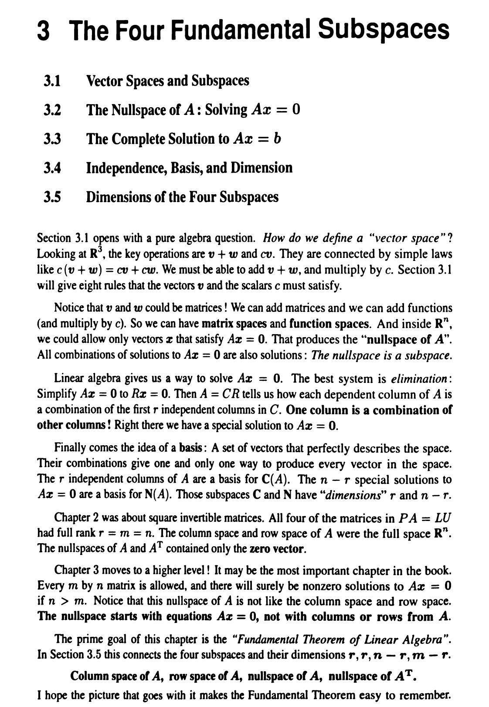

第 3 章 四大基本子空间
=============

\*\*概览：\*\*本章是整本线性代数课程中地位最高的一章，核心目标是阐述并证明“**线性代数基本定理（Fundamental Theorem of Linear Algebra）**”。定理把任意  $m\times n$  矩阵  $A$  的四个关键子空间及其维数——

$$
\mathcal{C}(A),\quad \mathcal{C}(A^{\mathsf T}),\quad \mathcal{N}(A),\quad \mathcal{N}(A^{\mathsf T})
$$

串联起来，并给出它们之间的维数关系

$$
\dim\mathcal{C}(A)=\dim\mathcal{C}(A^{\mathsf T})=r,\qquad \dim\mathcal{N}(A)=n-r,\qquad \dim\mathcal{N}(A^{\mathsf T})=m-r .
$$

* * *

3.1 向量空间与子空间
------------

1.  **八条公理**：为了将“加法”  $v+w$  与“标量乘法”  $cv$  这两种基本运算抽象出来，需要满足封闭性、交换律、结合律、单位元、逆元、分配律等 8 条公理（教材随后小节会逐条给出）。
2.  **广义例子**
    *   不仅  $\mathbb{R}^3$  是向量空间，矩阵集合、函数集合在同样的运算下也可构成向量空间。
    *   **子空间**：若把原空间中满足某线性条件的元素单独挑出来，它们往往再次封闭，形成子空间。经典例子便是
        $$
        \mathcal{N}(A)=\{x\in\mathbb R^n\mid Ax=0\},
        $$
        即矩阵  $A$  的**零空间**（或称核），它天然是  $\mathbb{R}^n$  的一个子空间，因为任意线性组合仍被  $A$  映到零向量。

* * *

3.2 矩阵零空间：求解  $Ax = 0$ 
-----------------------

*   **消元法**：借助高斯消元，将  $Ax=0$  化简为  $Rx=0$ （其中  $R$  为阶梯形矩阵）。
*   **列空间分解  $A = CR$ **：
    *    $C$  取自  $A$  的 **r** 列线性无关的“主元列”；
    *   每一列依赖关系  $A\_j = \sum_k c_{kj}\,C_k$  马上给出了一个 **特殊解**，说明一列“依赖列”是其它列的线性组合，从而在未知量上写出自由变量→特殊解。
*   **零空间的基**：化简后对应的 ** $n-r$ ** 个自由变量各产生一个特殊解，全部收集即可构成  $\mathcal{N}(A)$  的一组基向量。

* * *

3.3 方程  $Ax = b$  的完全解
----------------------

> 虽未在截图文字中展开，本节实际会说明：
> 
> $$
> Ax=b \quad\Longrightarrow\quad x = x_p + x_n,\quad x_n\in\mathcal{N}(A),
> $$
> 
> 即任何非齐次解可写成**一个**特解  $x_p$  加上零空间的所有向量。这样“列空间  $\mathcal{C}(A)$  + 零空间  $\mathcal{N}(A)$ ”共同刻画了解集的几何结构。

* * *

3.4 线性无关、基与维数
-------------

*   **基（Basis）**：一组既能生成空间、又彼此线性无关的向量。
    *    $A$  的 **r** 个主元列既生成又唯一表示了  $\mathcal{C}(A)$ ，因此它们构成列空间的基。
    *   上节所得的 ** $n-r$ ** 个特殊解构成  $\mathcal{N}(A)$  的基。
*   **维数（Dimension）**：基向量个数。于是
    $$
    \dim\mathcal{C}(A)=r,\qquad \dim\mathcal{N}(A)=n-r .
    $$

* * *

3.5 四子空间的维数关系（基本定理）
-------------------

*   复习第 2 章**可逆矩阵**情形：当  $A$  为  $n\times n$  且满秩  $r=n$  时，列、行空间就是整个  $\mathbb{R}^n$ ，零空间仅含零向量。
*   **推广至任意  $m\times n$  矩阵**：
    *   若  $n>m$ ，必有非零解  $x\neq 0$  使  $Ax=0$ ，从而  $\dim\mathcal{N}(A)=n-r>0$ 。
    *   **行空间**  $\mathcal{C}(A^{\mathsf T})$  的维数同样是  $r$ 。
    *   **左零空间**  $\mathcal{N}(A^{\mathsf T})$ （又称余核）的维数为  $m-r$ 。
*   **维数恒等式**
    $$
    r + (n-r) = n,\qquad r + (m-r) = m,
    $$
    与行、列数本身精确配合，体现了四子空间在几何上互补、在维数上恰好填满所在的“行空间”和“列空间”维度。

> 课本后面会用一幅著名的示意图（两个互相垂直的平面分别代表列/行空间，另两个垂直补空间代表零/左零空间）帮助记忆此定理。

* * *

与前一章内容的对比与提升
------------

| 章次 | 允许的矩阵 | 零空间 | 行/列空间 | 维数关系 |
| --- | --- | --- | --- | --- |
| **第 2 章** | 只考虑可逆方阵  $n\times n$  | 仅有零向量 | 均为整个  $\mathbb{R}^n$  |  $r=n$  |
| **第 3 章** | 任意  $m\times n$  | 可能非零 | 没必然填满全空间 | 四维数满足上式 |

由此可见，第 3 章把研究范围从“理想的满秩方阵”拓宽到了“一切矩阵”，并揭示了即使矩阵退化，仍有可借由四子空间完整描述其线性性质的统一框架。

* * *

本页关键信息小结
--------

1.  **向量空间**：满足 8 条公理的“加法-标乘”封闭集合。
2.  **子空间**：向量空间的线性闭合集合；零空间是经典子空间。
3.  **消元法 & 主元列**：提供寻找列空间基、特殊解及零空间基的算法性方法。
4.  **基与维数**：列空间维数 = 秩  $r$ ，零空间维数 = 自由变量个数  $n-r$ 。
5.  **四大基本子空间与基本定理**：
    $$
    \mathcal{C}(A),\; \mathcal{N}(A),\; \mathcal{C}(A^{\mathsf T}),\; \mathcal{N}(A^{\mathsf T})
    $$
    的维数分别为  $r,\, n-r,\, r,\, m-r$ ，共同概括了任一矩阵的线性特征。

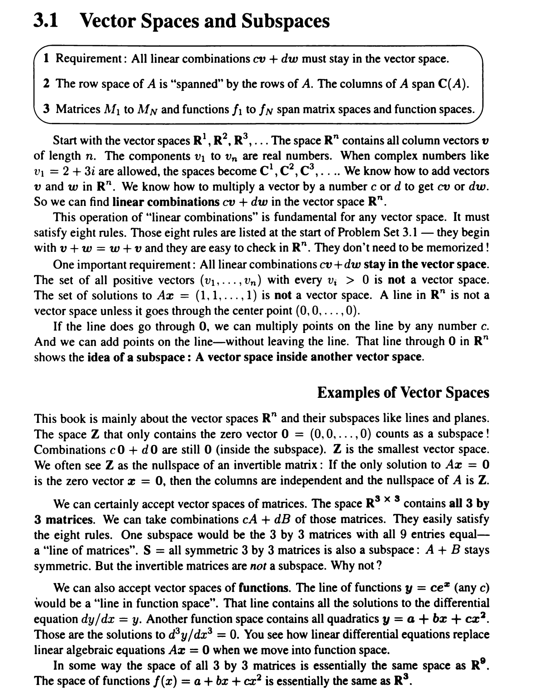

向量空间与子空间
========

（对应第 3 章 3.1 节课件内容）

本节聚焦“向量空间”这一抽象概念及其内部的“子空间”结构，核心要点是：**线性组合闭包、行／列空间的“张成”思想，以及多种超越  $\mathbb R^n$  的向量空间示例（矩阵空间、函数空间）**。

* * *

1  线性组合与八条公理
------------

| 关键词 | 讲解 |
| --- | --- |
| **向量空间  $\mathbb R^n$ ** | 包含所有长度为  $n$  的列向量  $v=(v_1,\dots,v_n)^{\mathsf T}$ 。基本运算：向量加法  $v+w$  与标量乘法  $cv$ 。 |
| **线性组合** | 任意标量  $c,d$  与向量  $v,w$  构成  $cv+dw$ 。  
👉 **首要要求**：所有线性组合必须仍留在该空间内。 |
| **八条公理** | 交换律  $v+w=w+v$ 、结合律、零向量存在、加法逆元存在、标量乘法分配律等；在  $\mathbb R^n$  中易验证，不必死记。 |

> **闭包反例**
> 
> *   所有坐标严格为正的向量集合  $\{v\mid v_i>0\}$ ；
> *   方程  $Ax=(1,1,\dots,1)^{\mathsf T}$  的解集；
> *   不过原点的直线。  
>     这些集合都 **不是** 向量空间，因为线性组合会逃出集合。
>     

* * *

2  子空间（Subspace）的概念
-------------------

*   **定义**：位于更大向量空间内部、同时满足八条公理的集合。
*   **几何直观**：过原点的一条直线是  $\mathbb R^n$  的子空间；若直线不经过原点，则不包含  $0$  → 破坏封闭性。
*   **最小子空间 Z**：仅含零向量  $\{0\}$ 。例如可逆矩阵  $A$  的零空间  $\mathcal N(A)=\{x\mid Ax=0\}$  就是 Z，因为唯一解即  $x=0$ 。

* * *

3  “张成（span）”与行／列空间
-------------------

1.  **行空间**：矩阵  $A$  的行向量张成的子空间，记为  $\mathcal{C}(A^{\mathsf T})$ 。
2.  **列空间**：由列向量张成，记为  $\mathcal{C}(A)$ 。
3.  **张成思想**：若集合  $\{v_1,\dots,v_k\}$  的所有线性组合覆盖了整个子空间  $S$ ，则称这些向量**张成**  $S$ 。

* * *

4  多样化的向量空间示例
-------------

| 范畴 | 说明 | 子空间示例 | 非子空间示例 |
| --- | --- | --- | --- |
| **矩阵空间  $\mathbb R^{3\times3}$ ** | 所有  $3\times3$  实矩阵，本质上等同  $\mathbb R^9$ 。 | _9 个元素全相等_ 的矩阵 —— 构成一条“矩阵直线”；  
_对称矩阵空间_  $S=\{A\mid A^{\mathsf T}=A\}$ 。 | **可逆矩阵集**：不包含零矩阵；亦不封闭于线性组合。 |
| **函数空间** | 元素为函数  $f(x)$ 。 | 指数族  $\{ce^x\}$ ：满足微分方程  $y'=y$ ；  
二次多项式  $\{a+bx+cx^2\}$ ：满足  $y'''=0$ 。 | 仅包含  $y=e^x$  一个函数的集合（不封闭于线性组合）。 |

> **等价维数观点**
> 
> *   所有  $3\times3$  矩阵经过把 9 个条目排成列向量，可与  $\mathbb R^9$  一一对应。
> *   二次多项式由  $(a,b,c)$  三个系数唯一决定，与  $\mathbb R^3$  等价。
>     

* * *

5  核心洞见与联系
----------

1.  **封闭性** 是判断空间/子空间的首要检验。
2.  **行空间、列空间** 为矩阵研究提供“生成集”视角，后续会与秩  $r$  紧密关联。
3.  **矩阵、函数** 只要满足线性组合运算规则，同样可被纳入线性代数框架，展示了抽象概念的普适性。

* * *

6  小结
-----

*   向量空间需满足八大公理；最重要的是**线性组合保闭**。
*   子空间是包含原点的封闭子集，最小子空间为  $\{0\}$ 。
*   行／列向量“张成”对应子空间，为理解秩与解空间做铺垫。
*   向量空间不限于  $\mathbb R^n$ ：矩阵与函数同样适用，只要线性结构成立。


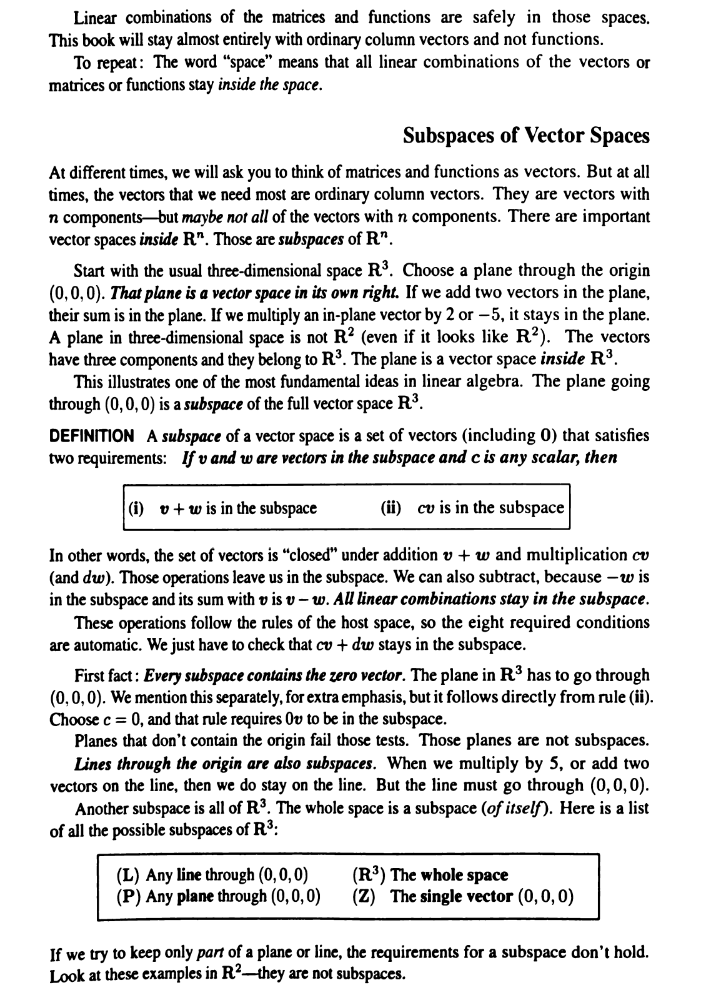

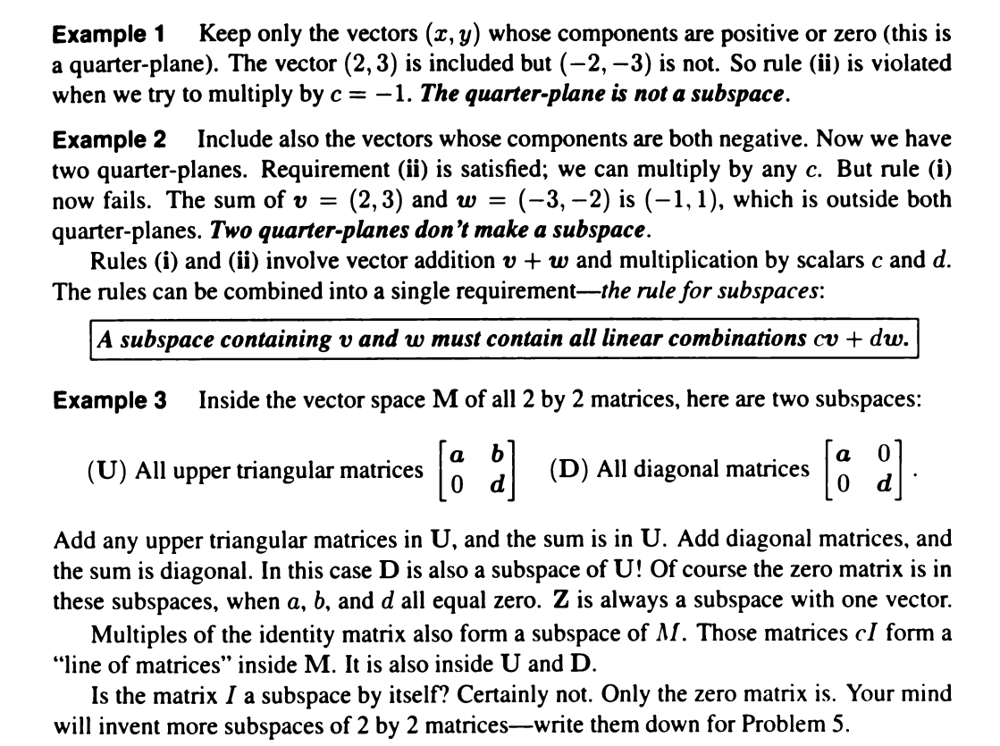

向量空间与子空间（续）
===========

**本节主题：** 进一步 formalize “子空间”概念，给出判定准则，并用  $\mathbb R^n$  与矩阵空间中的正反典型例子加深理解。

* * *

一、子空间的形式化定义
-----------

| 条件 | 准则说明 | 等价说法 |
| --- | --- | --- |
| (i) **加法闭包** | 若  $v,w\in S$  则  $v+w\in S$  | 向量和不离开集合 |
| (ii) **数乘闭包** | 若  $v\in S,\;c\in\mathbb R$  则  $cv\in S$  | 放大/翻转仍在集合 |
| **零向量必在  $S$ ** | 取  $c=0\Rightarrow 0v=0\in S$  | 不含原点必非子空间 |
| **线性组合闭包** | (i)+(ii) 合并成：若  $v,w\in S$ ，则任意  $cv+dw\in S$  | 全体线性组合均在  $S$  |

> **实用判定流程**
> 
> 1.  检查  $0\in S$ ；
> 2.  随机取两个向量，看和是否仍在  $S$ ；
> 3.  取标量  $-1$  看是否仍在  $S$ （兼顾减法与数乘闭包）。  
>     通过即可断定子空间，反例只需发现一次违规。
>     

* * *

二、 $\mathbb R^3$  中的全部子空间
-------------------------

| 代号 | 几何对象 | 必过原点 | 维数 |
| --- | --- | --- | --- |
| **Z** | 零向量  $(0,0,0)$  | ✔ | 0 |
| **L** | 任何过原点的直线 | ✔ | 1 |
| **P** | 任何过原点的平面 | ✔ | 2 |
| ** $\mathbb R^3$ ** | 整个空间自身 | ✔ | 3 |

_若平面或直线不含原点 → 失去零向量 → 立即失格。_  
此外，虽然平面在视觉上像  $\mathbb R^2$ ，但其向量仍有三维坐标，因此它是 ** $\mathbb R^3$  内部** 的子空间，而非独立的  $\mathbb R^2$ 。

* * *

三、反例： $\mathbb R^2$  中常见“陷阱”
----------------------------

| 示例 | 描述 | 为什么不是子空间 |
| --- | --- | --- |
| **例 1** 四分平面 |  $\{(x,y)\mid x,y\ge 0\}$  | 乘以  $-1$  得到  $(-x,-y)\notin S$ ，违反数乘闭包 |
| **例 2** 两个对称四分平面 |  $(x,y)$  坐标同号（正正或负负） |  $ (2,3)+(-3,-2)=(-1,1)\notin S$ ，违反加法闭包 |

**启示：** 直观“半空间/象限”大多因符号翻转或相加跨界而失格。

* * *

四、矩阵空间  $M_{2\times2}$  中的子空间层次
-------------------------------

令

$$
M=\Bigl\{\begin{bmatrix} a & b\\ c & d\end{bmatrix}\Bigr\},\qquad U=\Bigl\{\begin{bmatrix} a & b\\ 0 & d\end{bmatrix}\Bigr\},\qquad D=\Bigl\{\begin{bmatrix} a & 0\\ 0 & d\end{bmatrix}\Bigr\},\qquad Z=\{\mathbf 0\},\qquad L_I=\{cI\mid c\in\mathbb R\}
$$

| 集合 | 子空间? | 维数 | 关系 |
| --- | --- | --- | --- |
| ** $M$ ** | ✔ | 4 | 最大空间 |
| ** $U$ ** 上三角 | ✔ | 3 |  $D\subset U\subset M$  |
| ** $D$ ** 对角 | ✔ | 2 | 与  $L_I$  交叉层级 |
| ** $L_I$ ** 标量倍数  $cI$  | ✔ | 1 | 同时包含于  $U$ 、 $D$  |
| ** $\{I\}$ ** 单一非零矩阵 | ✖ | – | 缺少 0，且不闭包 |

> **观察**
> 
> *   子空间可嵌套形成“层级森林”。
> *   零矩阵始终存在于任何合法子空间。
> *   寻找子空间的常见手法：**固定若干坐标/元素为零** 或 **施加线性方程约束**，保证线性组合仍满足约束。
>     

* * *

五、统一视角：子空间与线性方程组
----------------

1.  **线性方程组  $Ax=0$ ** 的解集天然是  $\mathbb R^n$  的子空间（零空间）。
2.  对矩阵空间、函数空间，同样可用线性条件（如对称性、微分方程）刻画子空间。
3.  **最小子空间  $Z$ ** 仅含零向量，**最大子空间** 是宿主空间本身，中间则由各种线性约束产生。

* * *

六、与先前内容的衔接
----------

*   在上一轮笔记中，我们强调了“线性组合留在集合内”是向量空间定义的核心。本节则把这一思想浓缩为检验 **子空间** 的两条闭包准则，并通过丰富实例展示其力量。
*   这些判定工具将在后续讨论 **列空间/零空间** 时频繁使用：验证列向量 span、构造零空间基向量，都离不开对子空间概念的熟练掌握。

* * *

七、本节要点总结
--------

1.  **子空间判定三步曲**：含零向量、加法闭包、数乘闭包——可合并为“线性组合闭包”。
2.  ** $\mathbb R^3$ ** 里的合法子空间仅四类： $Z$ 、直线、平面、整个空间。
3.  诸多诱人集合（象限、单一矩阵等）因缺乏闭包性而断头；谨记反例。
4.  **矩阵空间** 提供高维子空间的层次结构示范，理解“嵌套”“交集”与“维数”概念。
5.  验证子空间本质上就是验证**线性方程组是否对线性组合保持一致**——这与零空间、行列空间等后续主题天然连通。


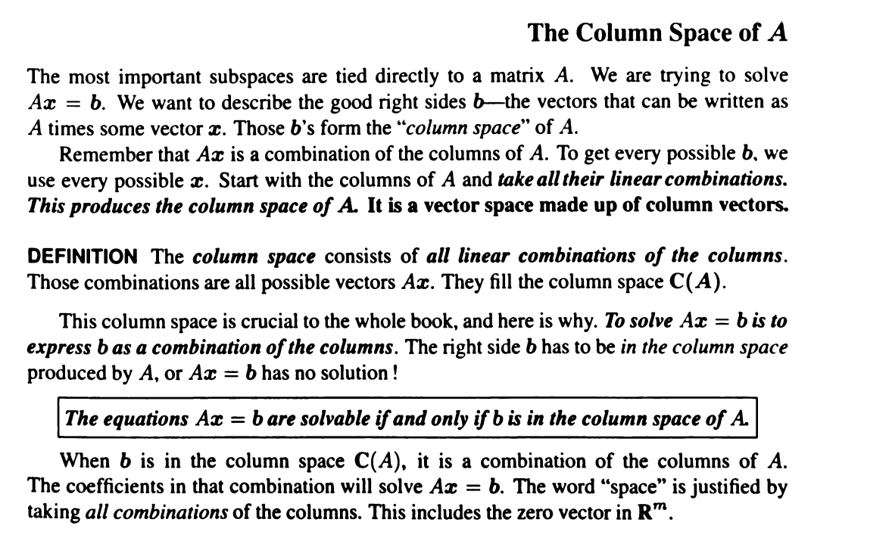

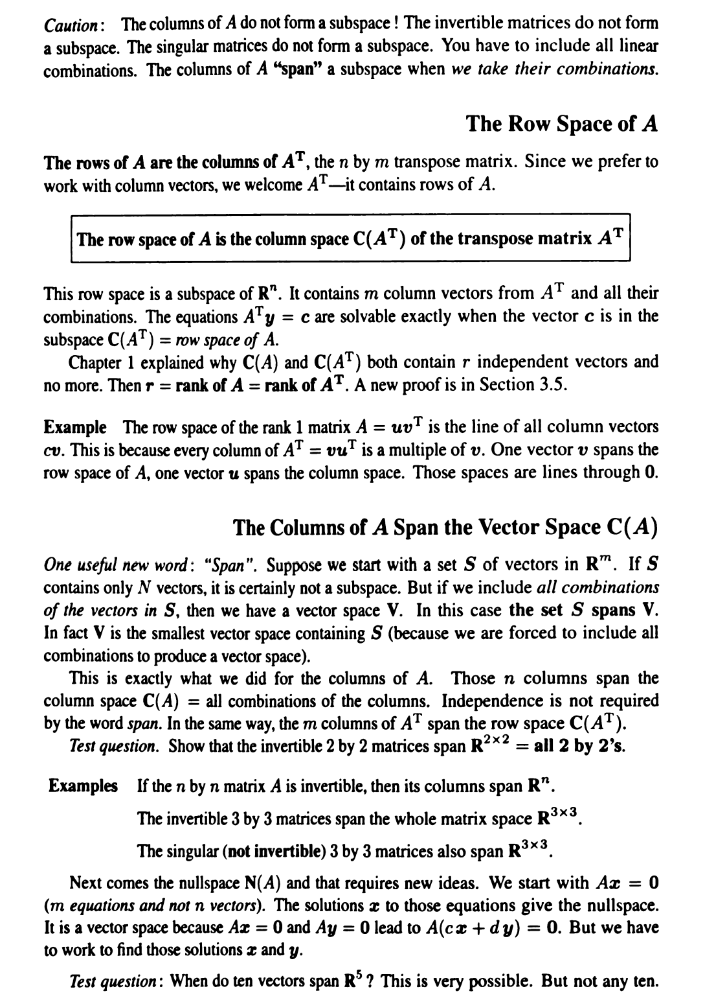

矩阵列空间与行空间——**通向“秩”与“可解性”的桥梁**
=============================

本节围绕矩阵  $A$  的两大核心子空间——列空间  $\mathcal{C}(A)$  与行空间  $\mathcal{C}(A^{\mathsf T})$ 。它们直接决定线性方程组

$$
Ax=b,\qquad A^{\mathsf T}y=c
$$

是否有解，并与矩阵的 **秩  $r$ ** 紧密挂钩。下面依次展开。

* * *

一、列空间  $\mathcal{C}(A)$ 
------------------------

### 1.1 定义与“生成”（Span）思想

*   **列空间定义**
    $$
    \boxed{\;\mathcal{C}(A)=\bigl\{\,Ax\mid x\in\mathbb R^{n}\bigr\}\;}
    $$
    即 **所有列向量的线性组合** 形成的子空间。
*   **Span**
    *   给定有限集合  $S=\{v_1,\dots,v_k\}$ ，取其 **全部** 线性组合，所得最小子空间即为  $\mathrm{span}(S)$ 。
    *    $A$  的列向量集合  $S$  经 span 便得到  $\mathcal{C}(A)$ 。
    *   _独立性不是必要条件_；无论列间是否相关，span 过程都必须纳入所有组合，确保闭包。

### 1.2 与方程  $Ax=b$  的可解性

> **结论**
> 
> $$
> Ax=b \text{ 有解} \;\Longleftrightarrow\; b\in\mathcal{C}(A).
> $$
> 
> **理由：** 解  $x$  恰提供了把  $b$  写成列组合的系数；若  $b$  无法表达，则方程组 **无解**。

### 1.3 零向量与子空间性

*    $\mathcal{C}(A)$  必含  $0$  向量（取  $x=0$  即可）——因此它确为子空间。
*   仅**列集合本身**（没有加上所有组合）并不是子空间。必须进行 span。

* * *

二、行空间  $\mathcal{C}(A^{\mathsf T})$ 
------------------------------------

### 2.1 定义

$$
\mathcal{C}(A^{\mathsf T})=\text{由 }A^{\mathsf T}\text{ 的列（即 }A\text{ 的行）线性组合生成的子空间}
$$

\=> 位于  $\mathbb R^n$  且含  $m$  列向量的全部组合。

### 2.2 与方程  $A^{\mathsf T}y=c$  的可解性

$$
A^{\mathsf T}y=c \text{ 有解} \;\Longleftrightarrow\; c\in\mathcal{C}(A^{\mathsf T})=\text{行空间}.
$$

### 2.3 行、列空间与秩

*   **秩  $r$ **：两者均含 ** $r$ ** 个线性无关向量，不多不少
    $$
    r=\dim\mathcal{C}(A)=\dim\mathcal{C}(A^{\mathsf T}).
    $$
*   **例**：若  $A$  为秩 1 的外积  $uv^{\mathsf T}$ ，则
    *   列空间 = 过原点的  $\mathrm{span}\{u\}$ （一条直线）
    *   行空间 =  $\mathrm{span}\{v\}$ 

* * *

三、列空间与行空间的层次、示例与注意点
-------------------

### 3.1 注意：列或行 **自身集合** ≠ 子空间

*   **可逆矩阵集合**、**奇异矩阵集合** 等并非子空间——缺少对所有线性组合的闭包。
*   只有把这些矩阵“加入所有组合”后才可能形成真正的子空间。

### 3.2 典型举例

| 矩阵 | 列空间 | 行空间 |
| --- | --- | --- |
| 单位矩阵  $I_n$  |  $\mathbb R^n$  |  $\mathbb R^n$  |
| 秩 1 外积  $uv^{\mathsf T}$  |  $\mathrm{span}\{u\}$  |  $\mathrm{span}\{v\}$  |
|  $3\times3$  可逆矩阵族 | “占满”  $\mathbb R^{3\times3}$  的全部 9 维列空间、行空间 | 若换成 **所有奇异矩阵** 同样 span 整个  $\mathbb R^{3\times3}$ （因为组合会产生可逆矩阵） |

* * *

四、与“零空间”后续内容的衔接
---------------

*   接下来将介绍 ** $\mathcal{N}(A)$ **（零空间）与 ** $\mathcal{N}(A^{\mathsf T})$ **，并在 §3.5 用 **秩—零度定理** 统一四子空间维数：
    $$
    r+\dim\mathcal{N}(A)=n,\qquad r+\dim\mathcal{N}(A^{\mathsf T})=m .
    $$
*   此处列/行空间为整体框架奠基：它们管控“能否解出  $b$ 、 $c$ ”的问题，而零空间描述“解的自由度”。

* * *

五、本节小结
------

1.  **列空间**：所有列线性组合，决定  $Ax=b$  可解性。
2.  **行空间**： $A^{\mathsf T}$  的列空间，决定  $A^{\mathsf T}y=c$  可解性。
3.  **秩  $r$ ** = 两空间共同拥有的无关向量数。
4.  **Span=“闭包”**：只有加入全部线性组合才能生成真正子空间。


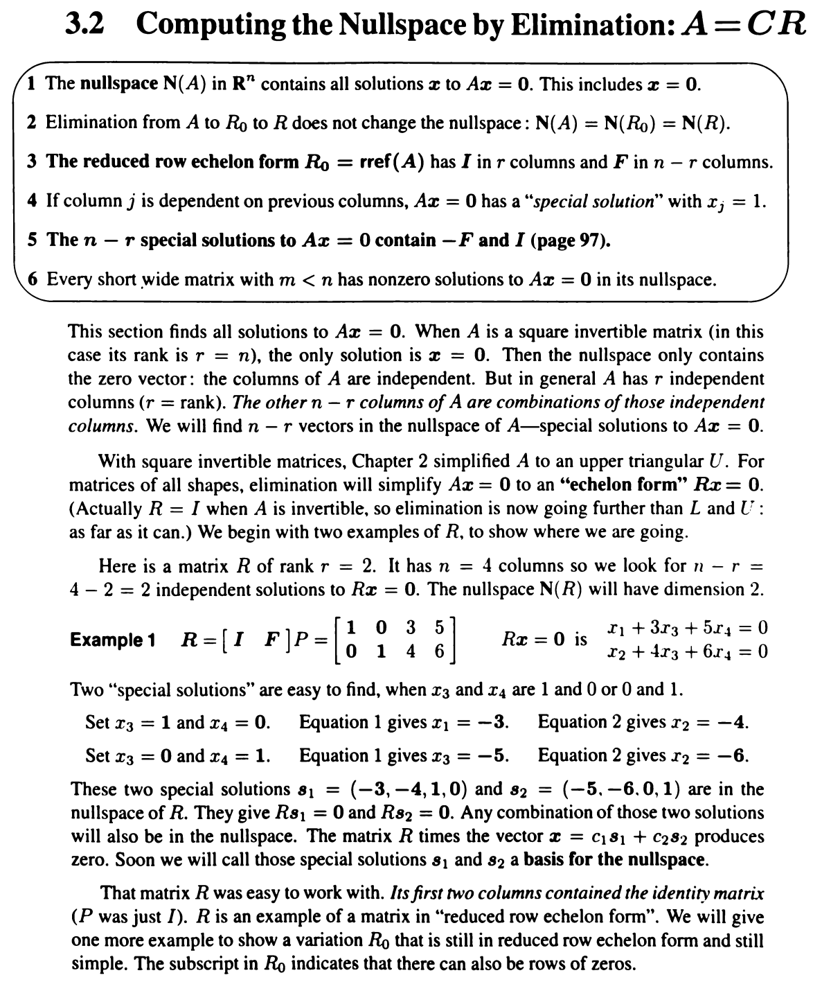

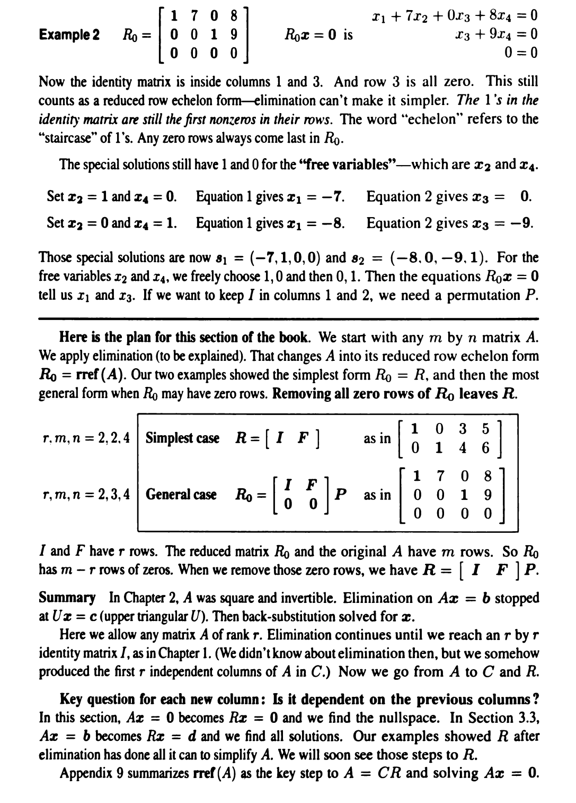

3.2  利用消元法求零空间 **N(A)**
=======================

> \*\*概览：**本节说明如何把“求解  $Ax=0$ ”系统化地转化为消元运算，并由矩阵的**阶梯形（R）/化简行阶梯形（R₀）\*\*直接读出零空间的一组基向量（所谓 **special solutions**）。结论奠定了“秩–零度定理”中 “ $\dim N(A)=n-r$ ” 的算法来源。

* * *

一、核心规则与六条要点
-----------

| # | 规则 | 说明 |
| --- | --- | --- |
| 1 | **零空间定义**  $N(A)=\{x\mid Ax=0\}$  必含零向量。 |  |
| 2 | **行初等变换不改零空间**  $N(A)=N(R₀)=N(R)$ 。 |  |
| 3 | **R₀ 结构** 在  $r$  个主元列形成单位阵  $I_r$ ，其余  $n-r$  列组成矩阵  $F$ 。 |  |
| 4 | **依赖列 ⇒ 特殊解** 若第  $j$  列非主元，则令  $x_j=1$  其余自由变量 0，可得一组特殊解。 |  |
| 5 | ** $n-r$  个特殊解** 集合 (\\bigl\[!-!F; | ;I\\bigr\]) 正好给出零空间一组基向量。 |
| 6 | **宽矩阵 ( $m<n$ ) 必有非零零向量**，因为  $r\le m<n$ 。 |  |

* * *

二、算法：从  $A$  →  $R₀$  →  $R=[\,I\;F\,]P$ 
-----------------------------------------

1.  **高斯消元**：
    $$
    A \;\xrightarrow{\text{行变换}}\; R₀=\mathrm{rref}(A)
    $$
    *   若某行全零则移至底部；
    *   主元列中的“1”按阶梯前移。
2.  **去零行 → R**：移除所有零行后可写成
    $$
    R = \bigl[\,I_r \; F\,\bigr]P ,
    $$
    其中  $P$  为列置换矩阵（若为了让主元位于首  $r$  列）。
3.  **读出特殊解**：对每个自由变量（非主元列）依次置  $1$ ，其他自由变量置  $0$ ；用行方程反推主元。共得  $n-r$  个向量组成基。

* * *

三、示范 1：简化情形  $R=[\,I\;F\,]$ 
----------------------------

$$
R=\begin{bmatrix}1&0&3&5\\[2pt]0&1&4&6\end{bmatrix},\qquad x_1+3x_3+5x_4=0,\;x_2+4x_3+6x_4=0
$$

| 设定自由变量 | 解得主元 | 特殊解  $s$  |
| --- | --- | --- |
|  $x_3=1,\,x_4=0$  |  $x_1=-3,\;x_2=-4$  |  $s_1=(-3,-4,1,0)$  |
|  $x_3=0,\,x_4=1$  |  $x_1=-5,\;x_2=-6$  |  $s_2=(-5,-6,0,1)$  |

$$
N(A)=N(R)=\mathrm{span}\{s_1,s_2\},\qquad \dim N(A)=n-r=2
$$

* * *

四、示范 2：一般 R₀（含零行、列置换）
---------------------

$$
R_0=\begin{bmatrix}1&7&0&8\\0&0&1&9\\0&0&0&0\end{bmatrix}
$$
*   主元列：1 与 3；自由变量： $x_2,x_4$ 
*   方程：   $\;x_1+7x_2+8x_4=0,\; \;x_3+9x_4=0$ 

|  $x_2,x_4$  | 主元解出 | 特殊解 |
| --- | --- | --- |
|  $1,0$  |  $x_1=-7,\;x_3=0$  |  $s_1=(-7,1,0,0)$  |
|  $0,1$  |  $x_1=-8,\;x_3=-9$  |  $s_2=(-8,0,-9,1)$  |

> ※ 如需把主元列移至最前，还可右乘置换  $P$ ，得到  $R=[\,I\;F\,]P$ 。本质不变。

* * *

五、消元法全景流程
---------

1.  **消元直到 R₀**：比“LU 分解”更进一步，直至最简阶梯形。
2.  **确定主/自由列**：主元 = 独立列数  $r$ ；自由列 =  $n-r$ 。
3.  **构造基向量**：自由列构成的  $I_{n-r}$  再加上  $-F$  中系数，即  $[-\!F\;|\;I]$ 。
4.  **验证**： $R$  乘以任一基向量得零 → 线性独立 → 张成全体零空间。

* * *

六、与后续 3.3 节的衔接
--------------

*   **此节**解决了  $\color{#0b7}\text{齐次方程组}$  的解结构。
*   **下一节**将把非齐次  $Ax=b$  写成
    $$
    x = x_p + x_n,\quad x_n\in N(A),
    $$
    并用同样的  $R$  找出一个特解  $x_p$ 。

* * *

七、要点回顾
------

1.  **行初等变换不改变零空间**。
2.  **rref** 使主元列显式化，零空间基向量可“逐自由列”写下。
3.  **零空间维数 = 自由变量个数 =  $n-r$ **，这即是后续“秩–零度”公式的实用算法依据。


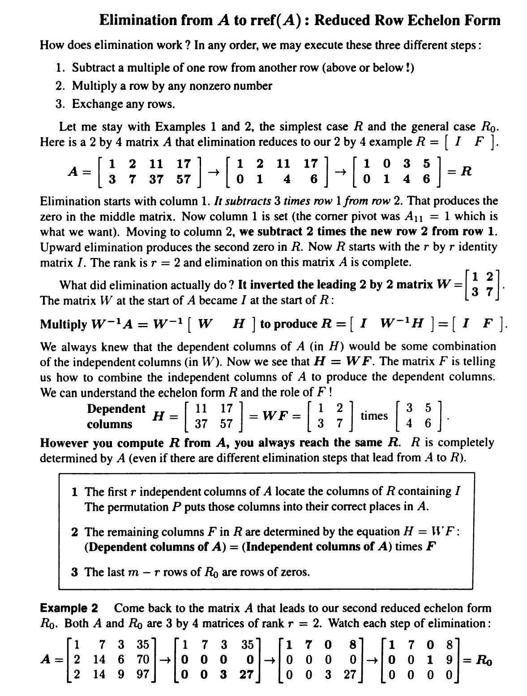

行初等变换到 rref 的完整剖析
=================

（接续 §3.2 “利用消元求零空间”——本页重点说明 **化简行阶梯形 rref(A)** 的形成机理、  
\[I F\] 结构、独立列/依赖列的系数矩阵关系，以及消元过程中“隐藏的矩阵求逆”本质）

* * *

一、消元的三种基本操作
-----------

> 在任意顺序下反复执行，最终可将矩阵  $A\in\mathbb R^{m\times n}$  化简为 **rref(A)**
> 
> 1.  **行加法**：用一行加（减）另一行的倍数
> 2.  **行倍乘**：将整行乘以非零标量
> 3.  **行交换**：调换两行位置
>     

只要运算合法，这三步 **不会改变零空间 N(A)**，亦保持行空间张成不变。

* * *

二、示例 1：2×4 矩阵消元至  $[\,I\;F\,]$ 
-------------------------------

原矩阵

$$
A=\begin{bmatrix} 1&2&11&17\\ 3&7&37&57 \end{bmatrix} \quad\stackrel{\text{行变换}}\longrightarrow\quad \begin{bmatrix} 1&2&11&17\\ 0&1&4&6 \end{bmatrix} \quad\stackrel{R}\equiv\quad \underbrace{\bigl[I\_2\bigr]}\_{W^{-1}}\;\Bigl|\,\underbrace{\begin{bmatrix}3&5\\4&6\end{bmatrix}}\_{F}
$$

### 2.1 具体消元步骤

1.  **列 1**： $R_2\leftarrow R_2-3R_1\Rightarrow$    $\;(3-3)=0$ 
2.  **列 2**： $R_1\leftarrow R_1-2R_2$ （上消元）→ 获得列阶梯  $(1,1)$ 
3.  主元列 1、2 形成 **单位阵  $I\_2$ **，至此 **rank  $r=2$ **，消元完成

### 2.2 矩阵分块解释

$$
A=\bigl[\;W\;\;H\bigr],\qquad W=\begin{bmatrix}1&2\\3&7\end{bmatrix},\; H=\begin{bmatrix}11&17\\37&57\end{bmatrix}
$$

行消元相当于**左乘**某可逆矩阵  $E$ （由行变换累乘得到）

$$
E\,A=\bigl[I\;\;F\bigr],\qquad F = W^{-1}H
$$
*    $W$  含 **r 个线性无关列**（“主元列”）；
*    $F$  给出 **依赖列系数**： $H = W\,F$ 。即
    > 依赖列 = 独立列  $\times$  系数矩阵  $F$ 。

* * *

三、消元结果的结构定律
-----------

1.  **独立列定位**  $A$  的前  $r$  个独立列经过消元变为  $I_r$ 。若次序打乱，需右乘置换矩阵  $P$  调整：
    $$
    R=[\,I\;F\,]P .
    $$
2.  **依赖列方程**  $H=W\,F$ ，直接揭示 **列相关系数**。
3.  **零行出现位置** rref(A) 的零行始终在矩阵底部；移除它们得到上例的  $R$ 。

* * *

四、示例 2：3×4 矩阵的 rref（含零行与列置换）
----------------------------

$$
A=\begin{bmatrix} 1&7&3&35\\ 2&14&6&70\\ 2&14&9&97 \end{bmatrix} \;\;\Longrightarrow\;\; R_0=\begin{bmatrix} 1&7&0&8\\ 0&0&1&9\\ 0&0&0&0 \end{bmatrix},\qquad r=2
$$
*   **主元列** : 1, 3 → 自由列 2, 4
*   **阶梯 1 的位置**：列 1 & 列 3
*   消元顺序（概要）：
    1.  消去列 1 下方元素得到 0
    2.  上消元、缩放得到列 1 主元 1
    3.  继续在列 3 构造主元 1
    4.  行 3 完全为 0 → 零行

> 若需把主元列移至最左侧可写
> 
> $$
> R=[\,I\;F\,]P,\quad P=(1\;2\;3\;4)\text{ 的某置换}.
> $$

* * *

五、消元的“求逆本质”
-----------

消元过程中，**前  $r$  列的操作等价于对它们做行逆运算**：

$$
E\,W=I_r\quad\Longrightarrow\quad E=W^{-1}.
$$

因此

$$
R=\bigl[\,I_r\;\;W^{-1}H\bigr],
$$

这正是把 **独立列 W** “变成单位阵” 的代价，同时把 **依赖列** 映射为 **系数矩阵 F**。  
在编程实现中，记录行操作矩阵  $E$  即可同时得到

*   ** $W^{-1}$ **（解线性方程）
*   ** $F$ **（列依赖关系）
*   **rref(A)**（后续提取零空间/秩/特解等）

* * *

六、关键事实小结（黑框三条）
--------------

| # | 命题 | 含义 |
| --- | --- | --- |
| 1 | **第一批独立列**确定  $I_r$  的位置 | 通过置换  $P$  可把它们对应回  $A$  |
| 2 | **其余列 F** 完全由等式  $H=W\,F$  决定 | F 给出依赖列=独立列×系数 |
| 3 | **rref(A)** 的最后  $m-r$  行全零 | 这些行在去零行后被丢弃，得  $R=[I\,F]P$  |

* * *

七、与零空间求解的衔接
-----------

*   一旦获得  $\displaystyle R=[\,I\;F\,]$ ，便能立即写出零空间基
    $$
    N(A)=\mathrm{span}\Bigl\{ \bigl[-F_{:\,1}\;|\;e_1\bigr],\dots,\bigl[-F_{:\,n-r}\;|\;e_{n-r}\bigr] \Bigr\},
    $$
    其中  $F_{:\,k}$  为  $F$  第  $k$  列， $e_k$  是标准基向量。
*   这正是前一页“**特殊解 special solutions**”的系统来源。

* * *

八、本页内容总结
--------

1.  **rref(A)** 通过行初等变换实现，把独立列化成单位阵、显式给出依赖关系。
2.  消元暗含“求逆”  $W^{-1}$ ；得到 **\[I F\]** 结构后，一切列空间、零空间信息尽在  $F$ 。
3.  任何不同的消元路径都会得到同一  $R$ （因为 rref 唯一）。
4.  **独立列位置 + F 系数矩阵 + 零行数** = 描述矩阵所有线性特征的最简数据。


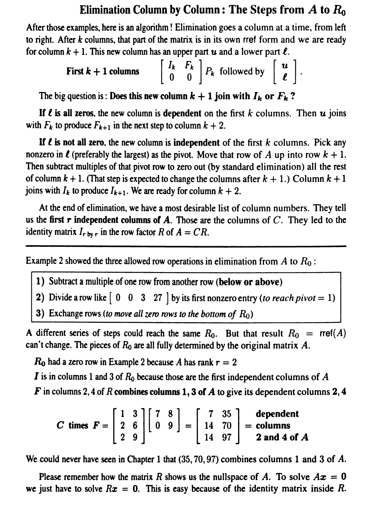

列‑列消元算法：从  $A$  到  $R_0=\operatorname{rref}(A)$  的逐列步骤
======================================================

**概括**  
本页给出了一个“**逐列（column‑by‑column）”的高层算法**，解释如何按列依次执行行初等变换，将任意  $m\times n$  矩阵  $A$  化为化简行阶梯形  $R_0$ 。算法的核心任务是在扫描到第  $k+1$  列时判断：**该列是否线性依赖于已处理的前  $k$  列？** 最终它会列出 ** $r$  个独立列的位置**——这正是矩阵分解

$$
A = C\,R,\qquad R=[\,I_r\;F\,]P
$$

中  $C$  的列索引，也对应  $R$  内部的单位阵  $I_r$ 。

* * *

1  逐列消元框架
---------

> \*\*当前状态：\*\*前  $k$  列已是 rref 形式，可写作
> 
> $$
> \Bigl[\;I_k\;\;F_k\;\Bigr]P_k
> $$
> 
> 新输入的第  $k+1$  列记为
> 
> $$
> \begin{bmatrix}\,u\\ \ell\end{bmatrix},\quad u\in\mathbb R^{k},\;\ell\in\mathbb R^{m-k}.
> $$

| 判断 | 处理策略 | 结果对结构的影响 |
| --- | --- | --- |
| ** $\ell=\mathbf 0$ ** （下半部全零） | 列 **依赖** 前  $k$  列；把  $u$  拼接进  $F_k$  生成  $F_{k+1}$  | 不增加主元数； $k$  保持不变 |
| ** $\ell\neq\mathbf 0$ ** | 选  $\ell$  中一非零元（最好绝对值最大）作 **枢轴**，把对应行上移至第  $k+1$  行；  
用标准行消元使所在列除主元外全归零 | 新列 **独立**，加入  $I_k$  形成  $I_{k+1}$ ；主元数  $k\!\to\! k+1$  |

> 循环执行至扫描完全部  $n$  列，即得最终 rref  $R_0$ 。再删去末尾  $m-r$  个零行即为
> 
> $$
> R=\bigl[I_r\;\;F\bigr]P.
> $$

* * *

2  行初等变换三条基本操作
--------------

1.  **列下/上消元**：   $\;R_i\leftarrow R_i-\lambda R_j\;$ （ $i\neq j$ )
2.  **行缩放**：   $\;R_i\leftarrow \alpha R_i,\;\alpha\neq 0$ （将枢轴调成 1）
3.  **行交换**：移动零行到底部、或为选枢轴调位

不同顺序的操作可达 **同一 rref**——因为 rref 唯一。

* * *

3  独立列、依赖列与系数矩阵  $F$ 
---------------------

*   **第一批独立列**：消元过程中首次出现主元的列索引  $\{j_1,\dots,j_r\}$ 。它们在  $R$  里对应单位阵  $I_r$ ，在  $A$  中则形成矩阵
    $$
    C=A_{(:,\,j_1,\dots,j_r)} .
    $$
*   **依赖列**：其系数由
    $$
    H = W\,F,\qquad W=C,\quad F=W^{-1}H
    $$
    给出。其中  $H$  由  $A$  的依赖列按相同顺序拼成。于是
    $$
    \boxed{\text{依赖列} = \text{独立列}\times F } .
    $$

### 示例回顾

对页中 rank 2 的  $3\times4$  矩阵

$$
C=\begin{bmatrix}1&3\\2&6\\2&9\end{bmatrix},\; F=\begin{bmatrix}7&8\\0&9\end{bmatrix} \Longrightarrow CF= \begin{bmatrix}7&35\\14&70\\14&97\end{bmatrix} =\; \text{原矩阵第 2,4 列},
$$

完美验证了公式。

* * *

4  列依赖判定的“上/下”分块视角
------------------

> 将待检测列拆成 **已化简区域** (上块  $u$ ) + **未化简区域** (下块  $\ell$ )：

*   若  $\ell$  全零 ⇒ 列坐落在现有子空间中（依赖）。
*   若  $\ell$  含非零 ⇒ 必现一新主元，列独立。

这一“上下块”视角等同于检测列向量是否落在已知独立列张成的子空间内，且预告了如何在编程实现中 **一次遍历** 全矩阵即可定位所有主元列。

* * *

5  列‑列算法与零空间的衔接
---------------

完成  $R$  后：

*   **零空间基** ：取每个自由列设为 1，其余自由列 0，反推主元分量 → 即“特殊解”。
*   **可解性** ： $Ax=b$  →  $R x = d$ ，结构简单，方便读出特解与通解。

* * *

6  本页要点总结
---------

1.  **逐列消元**：扫描新列只需看其“下半部”是否全零来判定独立/依赖。
2.  **rref 唯一性**：任意行操作顺序都会得到同一  $R_0$ ，因此  $R=[I\,F]P$  完全由  $A$  决定。
3.  **独立列位置 →  $C$ ，依赖系数 →  $F$ **：体现了  $A=CR$  中列空间与列关系的全部信息。
4.  **行操作列表** 提醒：消元合法操作仅三条；它们保持零空间不变。
5.  **从  $R$  读解**： $I_r$  让求  $N(A)$  和  $Ax=b$  简化为代入回代。


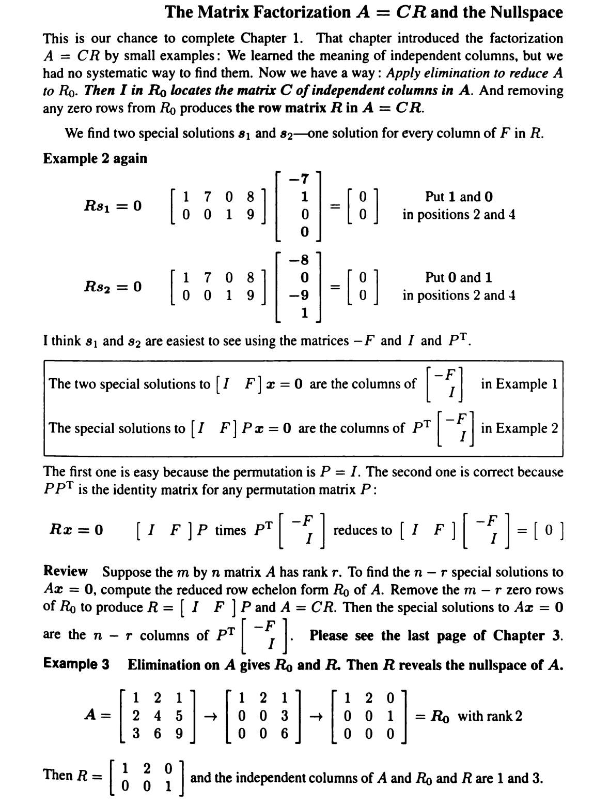

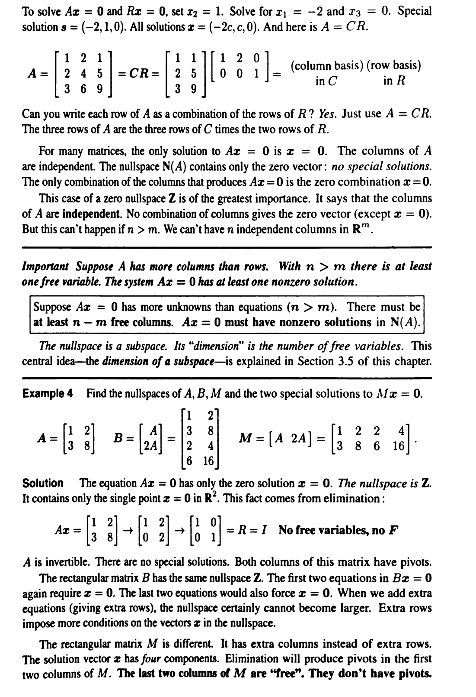

## 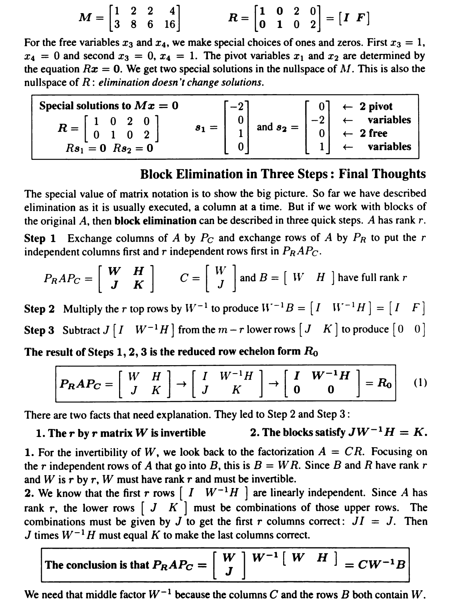
A = C R 分解与零空间的系统构造
===================

（承接 §3.2 消元求 N(A)；对应“**The Matrix Factorization A = CR and the Nullspace**”及后续三页内容）

* * *

1  何谓 A = C R？
--------------

| 符号 | 含义 |
| --- | --- |
| **C** | 由  $A$  **r 列线性无关向量**组成（列空间的“基列”） |
| **R** | 删除 r 个零行后的 rref(A)，具有结构    $\;\bigl[I_r\;F\bigr]P$  |
| **P** | 把主元列移回原位置的置换矩阵 |

> **直观解释**：
> 
> 1.  对  $A$  做行消元至 rref，找到单位块  $I_r$  → 锁定独立列索引 → 取回原列即得 **C**。
> 2.  rref 去掉零行即得 **R**；它保留了“独立列 + 依赖关系”两类信息。
> 3.  于是
>     
> $$
> A = C\,R ,\qquad R = [\,I_r\;F\,]P .
> $$

* * *

2  特殊解矩阵  $\displaystyle\begin{bmatrix}-F\\ I\end{bmatrix}$  的由来
----------------------------------------------------------------

对齐  $R=[I\;F]P$ ，齐次方程  $Rx=0$  ⇒  $[I\;F]P\,x=0$ 。  
取  $y=P\,x$  把自由列移到末尾，则  $[I\;F]y=0$  分块写成

$$
\begin{bmatrix}I_r & F\end{bmatrix} \begin{bmatrix}y_p\\ y_f\end{bmatrix}=0 \;\Longrightarrow\; y_p=-F\,y_f .
$$

设 **每个自由变量单独为 1** 其他为 0，即得到

$$
\boxed{\;s_k =\begin{bmatrix}-F_{:\,k}\\ e_k\end{bmatrix},\;k=1,\dots,n-r\;}
$$

这些列正是图中的

$$
\Bigl[\!-\!F\;\\ \,I\Bigr],\quad\text{或 }P^{\mathsf T}\!\Bigl[\!-\!F\\ I\Bigr]\text{（若列置换存在）},
$$

它们构成  $N(A)$  的一组基。

**示例（再看 Example 2）**

$$
R_0= \begin{bmatrix} 1&7&0&8\\ 0&0&1&9\\ 0&0&0&0 \end{bmatrix}, \quad F=\begin{bmatrix}7&8\\0&9\end{bmatrix} \Longrightarrow \Bigl[\!-\!F\\ I\Bigr] =\begin{bmatrix} -7&-8\\0&0\\1&0\\0&1 \end{bmatrix}
$$

列向量  $s_1,s_2$  与书中  $s_1=(-7,1,0,0)^{\mathsf T}$ ,  $s_2=(-8,0,-9,1)^{\mathsf T}$  完全一致。

* * *

3  举例巩固：Example 3 与 Example 4
-----------------------------

### 3.1 Example 3（3×3，rank 2）

| 步骤 | 结果 |
| --- | --- |
| 消元 → rref |  $R_0=\begin{bmatrix}1&2&0\\0&0&1\\0&0&0\end{bmatrix}$  |
| 去零行 |  $R=[\,I_2\;F\,],\;F=\begin{bmatrix}2\\0\end{bmatrix}$  |
| 特殊解 | 1 个自由变量 →  $s=(-2,1,0)^{\mathsf T}$  |
| 分解 |  $A=C\,R,\;C=\begin{bmatrix}1&1\\2&5\\3&9\end{bmatrix}$  |

> **验证**： $C$  的 3 行是  $A$  的行， $R$  的 2 行是行空间基； $A=C\,R$  给出了**行向量能否写成 R 线性组合**的具体系数。

### 3.2 Example 4（A 可逆；B = \[ A ; 2A \]；M = \[ A 2A \]）

| 矩阵 | 形状 | rank | 零空间 |
| --- | --- | --- | --- |
| **A** | 2×2 | 2 | 仅 0（Z） |
| **B** | 4×2（多行） | 2 | 仍 Z；加行不会产生自由变量 |
| **M** | 2×4（多列） | 2 | 自由变量 2 个 ⇒ dim N(M)=2 |

> **技巧**：多 _列_ ⇒ 必生自由变量；多 _行_ 只会施加额外约束，不会增加零空间维数。

* * *

4  尺寸与维数的“极端”观察
---------------

*   若  $n>m$  ⇒ 至少  $n-m$  个自由变量 ⇒  $N(A)$  非零。
*   若  $A$  方阵且可逆 ⇒ 无自由变量， $N(A)=Z$ 。
*   **维数公式** 将在 §3.5 总结： $\dim N(A)=n-r$ 。

* * *

5  块消元三步曲（矩阵视野下的“宏观版高斯消元”）
--------------------------

设列、行置换后

$$
P_R A P_C = \begin{bmatrix} W & H \\ J & K \end{bmatrix},\quad \text{其中 }W\in\mathbb R^{r\times r}\text{ 可逆.}
$$

| 步 | 操作 | 结果 |
| --- | --- | --- |
| ① | 调列/行，独立列行置前 |  $[\,W\;H;\,J\;K]$  |
| ② | 上乘  $W^{-1}$  |  $[\,I\;\;W^{-1}H;\;J\;\;K]$  |
| ③ | 下块减  $J[I\;W^{-1}H]$  |  $[\,I\;W^{-1}H;\;0\;0]\;=\;R_0 $  |

最终 rref 结构再次呈现：

$$
R_0 = \begin{bmatrix} I_r & W^{-1}H \\ 0 & 0 \end{bmatrix}
$$

显式说明了 **F = W^{-1}H** 与上文列消元所得结果完全一致。

* * *

6  一页总结
-------

1.  **A=CR**：行消元唯一确定独立列 C 与行因子 R。
2.  **零空间基** 快速读取公式
    $$
    N(A)=\mathrm{span}\Bigl\{\begin{bmatrix}-F_{:\,k}\\ e_k\end{bmatrix}\Bigr\}_{k=1}^{n-r}.
    $$
3.  **多列 ⇒ 必有非零 nullspace；多行 ⇒ 只收紧约束**。
4.  **块消元** 让消元三步到位：置换→求逆→块消元，一行推导出 rref。
5.  **维数理念**：自由变量个数 = nullspace 维数，核心将贯穿 §3.5 的“四子空间维数定理”。


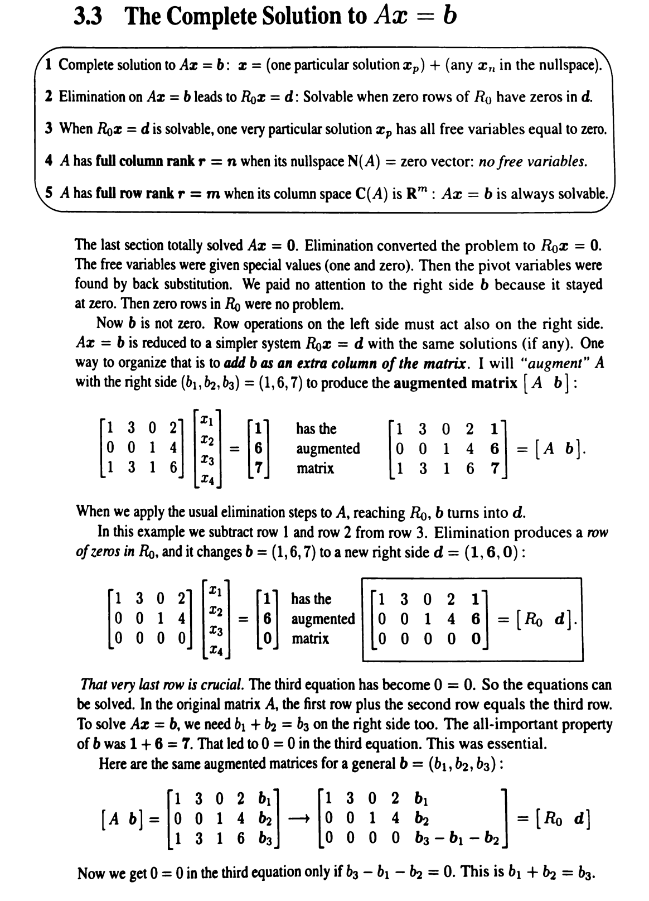

**Ax = b 的完全解（3.3 节首页）**
========================

**概览：** 本节把“齐次解  $Ax=0$ ” 的成果延伸到非齐次方程组  $Ax=b$ 。核心结论是

$$
\boxed{\;x = x_p + x_n,\;\;x_n\in N(A)\;}
$$

——任何一个“特解”  $x_p$  与零空间  $N(A)$  的所有向量相加，给出方程的全部解。求解流程依然借助高斯消元，但这次**必须对增广矩阵  $[A\;b]$ ** 同步做行运算，进而判断方程是否可解，以及如何选取  $x_p$ 。

* * *

1  完全解结构与五条要点
-------------

| 编号 | 课件条目 | 细节解析 |
| --- | --- | --- |
| 1 | **完全解 = 特解  $x_p$  + 任意零空间向量** | 只要找到一组系数使  $Ax_p=b$ ，再加任何  $x_n\in N(A)$  仍满足方程，因为  $A(x_p+x_n)=b+0=b$ 。 |
| 2 | **对增广矩阵做消元 →  $R_0x=d$ ** | 将  $b$  作为附加列随行运算一起更新；最终形成化简行阶梯形  $[R_0\;d]$ 。 |
| 3 | **若可解，则取所有自由变量 0 得到  $x_p$ ** | 设自由变量全为 0，用回代求主元变量即可得最简“特解”。 |
| 4 | **满列秩  $r=n$  ⇔  $N(A)=\{0\}$ ** | 若  $A$  列向量独立，则无自由变量 → 零空间只有零向量，特解唯一。 |
| 5 | **满行秩  $r=m$  ⇔  $\mathcal{C}(A)=\mathbb R^m$ ** |  $A$  行向量独立 ⇒ 列空间充满  $\mathbb R^m$ ，对任意  $b$  方程必可解。 |

* * *

2  增广矩阵消元示例（教材 Figure）
----------------------

1.  **原矩阵与右端项**
    $$
    A=\begin{bmatrix}1&3&0&2\\0&0&1&4\\1&3&1&6\end{bmatrix},\quad b=\begin{bmatrix}1\\6\\7\end{bmatrix}
    $$
    增广为  $[A\;b]$ 。
2.  **行运算**
    *   用第 1、2 行消去第 3 行 → 第 3 行变为全 0。
    *   同时  $b$  变成  $d=(1,6,0)^{\mathsf T}$ 。
3.  **可解判定**
    *   若出现形如  $[0\;0\;0\;0\;|\;d_k]$  且  $d_k\neq0$ ，则无解。
    *   此例 d\_3=0 ⇒ 可解。
4.  **特解**（自由变量设 0）：
    *   自由列：第 2、4 列 →  $x_2=x_4=0$ 。
    *   主元回代得  $x_1=1,\;x_3=6$  →  $x_p=(1,0,6,0)^{\mathsf T}$ 。
5.  **一般解**
    $$
    x = x_p + c_1\,s_1 + c_2\,s_2,\quad s_1,s_2\in N(A)
    $$

* * *

3  一般右端向量的可解条件
--------------

设  $b=(b_1,b_2,b_3)^{\mathsf T}$ 。消元得到

$$
[A\;b] \;\longrightarrow\; [R_0\;d],\quad d_3 = b_3 - b_1 - b_2 .
$$

> **结论：** 方程组可解  $\Longleftrightarrow\;b_1+b_2=b_3$ 。  
> 这正是要求  $b$  位于  $A$  的列空间（列 1 + 列 2 = 列 3）。

* * *

4  自由变量、零空间与秩的再度联系
------------------

*   **自由变量数 =  $n-r = \dim N(A)$ ** ——决定解的“方向维度”。
*   若 ** $n>m$ **（列多于行）：必有自由变量 ⇒ 方程  $Ax=0$  一定存在非零解， $Ax=b$  至少可能有多重解。
*   若 ** $m>n$ **（行多于列）：可能出现相互矛盾的行，导致无解；消元中易显现为“0 = 非零”。

* * *

5  小结
-----

1.  **增广矩阵同步行运算** 是处理非齐次方程的关键。
2.  **判定可解性**：关注 rref 中零行对应的右端元素是否为 0。
3.  **特解最易选法**：把自由变量全设 0。
4.  **一般解公式**： $x=x_p+N(A)$ ——理论与计算结合的核心表达。
5.  **秩观点**：满列秩保证解唯一或无解；满行秩保证总可解。


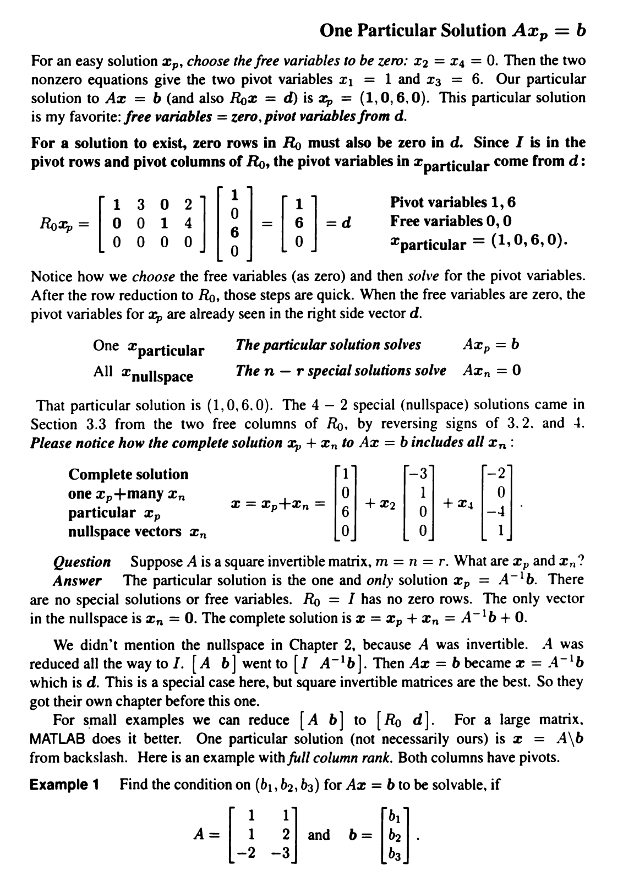

## 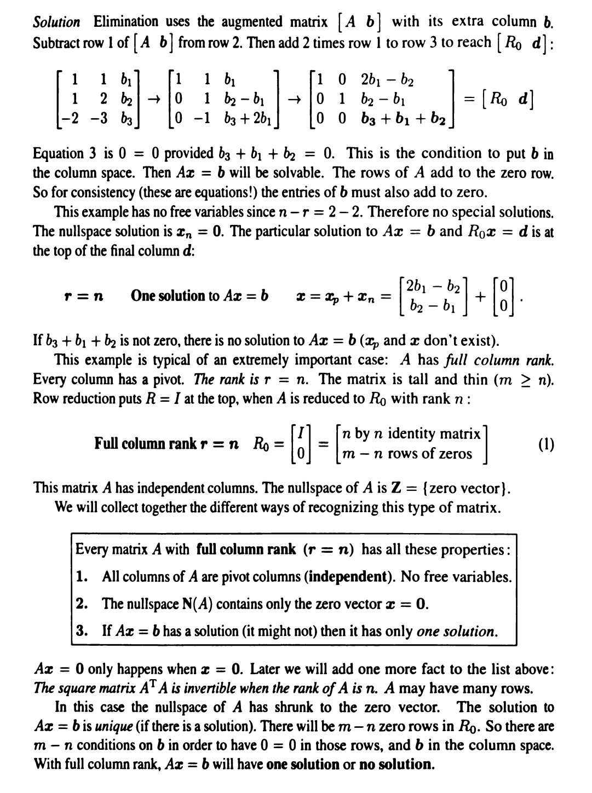
**特解与完全解：从  $Ax=b$  的特解到解空间结构**
===============================

本次内容继续聚焦 3.3 节，用两页课件阐释如何**构造一个简洁的特解**  $x_p$ ，并将其与零空间  $N(A)$  组合得到  $Ax=b$  的**全部解**。同时通过例子进一步说明“满列秩”矩阵的特殊性——当  $r=n$  时零空间退化、解唯一或无解。

* * *

一、特解  $x_p$  的快速选择原则
--------------------

1.  **策略：自由变量设零**
    *   在 rref 增广形  $[R_0\;d]$  中，将所有非枢轴列（自由变量）置为 0。
    *   枢轴列所在的未知量可直接读自右端向量  $d$ 。
    *   这样无需回代就得到一个“最小范数”风格的简单特解。
2.  **可解性检查**
    *   若  $R_0$  含零行，则其对应的  $d$  分量必须同时为 0；否则无解。
    *   判断公式：在  $[0\;0\;\dots\;0\;|\;d_k]$  这样的行里必须有  $d_k=0$ 。
3.  **示例重温**
    $$
    R_0x_p=d,\quad R_0=\begin{bmatrix}1&3&0&2\\ 0&0&1&4\\ 0&0&0&0\end{bmatrix},\; d=(1,6,0)^{\mathsf T}
    $$
    设  $x_2=x_4=0$  ⇒ 直接得
    $$
    x_1=1,\;x_3=6 \Longrightarrow x_p=(1,0,6,0)^{\mathsf T}.
    $$

* * *

二、完全解公式回顾与示例
------------

*   **一般公式**
    $$
    \boxed{\;x = x_p + x_n,\;\;x_n\in N(A)\;}
    $$
    其中  $x_n$  可写成自由变量线性组合：
    $$
    x_n = x_2\,s_1 + x_4\,s_2 + \dots
    $$
*   **示例展开**（课件给出的向量）
    $$
    x = \begin{bmatrix}1\\0\\6\\0\end{bmatrix} + x_2 \begin{bmatrix}-3\\ 1\\ 0\\ 0\end{bmatrix} + x_4 \begin{bmatrix}-2\\ 0\\ -4\\ 1\end{bmatrix}.
    $$
    其中  $\{s_1,s_2\}$  正是上一节零空间基向量。

* * *

三、满秩方阵的特殊情况
-----------

| 条件 | 后果 |
| --- | --- |
| ** $m=n$ ,  $A$  可逆** | rref = $I$  ⇒ 无自由变量 ⇒  $N(A)=\{0\}$ 。特解唯一： $x_p=A^{-1}b$ 。 |
| **满列秩  $r=n$ ** (但  $m\ge n$ ) | 仍无自由变量；若可解则唯一，否则无解。 |

> 课件举的 2×2 可逆矩阵： $[A\;b]$  ➜  $[I\;A^{-1}b]$ 。零空间为空，完全解即特解。

* * *

四、满列秩情形的重要结论框
-------------

> **若矩阵  $A$  满列秩  $r=n$ **
> 
> 1.  所有列都是枢轴列 → **列向量独立**
> 2.  **零空间仅含零向量**
> 3.  若  $Ax=b$  可解，则 **解唯一**；若行中出现矛盾（0 = 非零），则无解
>     

* * *

五、进一步例题要点
---------

### Example 1（再次检验  $b$  是否位于列空间）

*   A 为满列秩 2，增广消元得条件
    $$
    b_3 + b_1 + b_2 = 0.
    $$
*   条件满足 ⇒ 唯一特解
    $$
    x=\begin{bmatrix}2b_1-b_2\\ b_2-b_1\end{bmatrix}.
    $$

> 该例体现**列空间一致条件**：方程兼容性的线性约束直接表现为增广矩阵最后出现的 0 行。

* * *

六、块视角下的“特解+零空间”
---------------

*   在本章后页（截图底部）列出的块消元三步中，**特解信息藏在右端向量  $d$ **；
*   **零空间结构** 已由上一节的  $[-\!F;I]$  给出；
*   整体思维：
    1.  行消元至  $R_0$  判矛盾 → 判断可解性；
    2.  用  $d$  填入枢轴变量拿到  $x_p$ ；
    3.  加上零空间基（取自  $F$ ）即得全解。

* * *

七、本次内容关键总结
----------

1.  **选零自由变量 → 读枢轴**：获取  $x_p$  最快捷。
2.  **零行 × 右端非零 ⇒ 无解**；反之可解。
3.  **完全解 = 特解 + 零空间**，维数 = 自由变量数。
4.  **满列秩矩阵**：零空间为零，解若存在则唯一。
5.  增广矩阵行运算保存方程组等价性，是可解性与特解构造的核心工具。


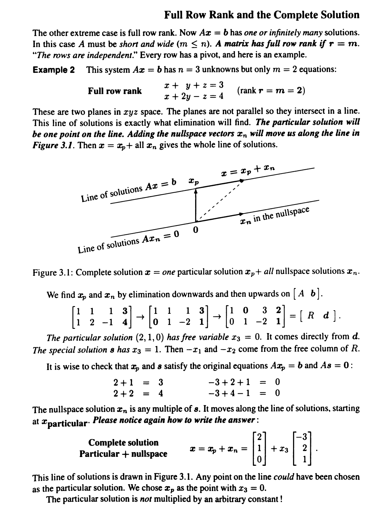

## 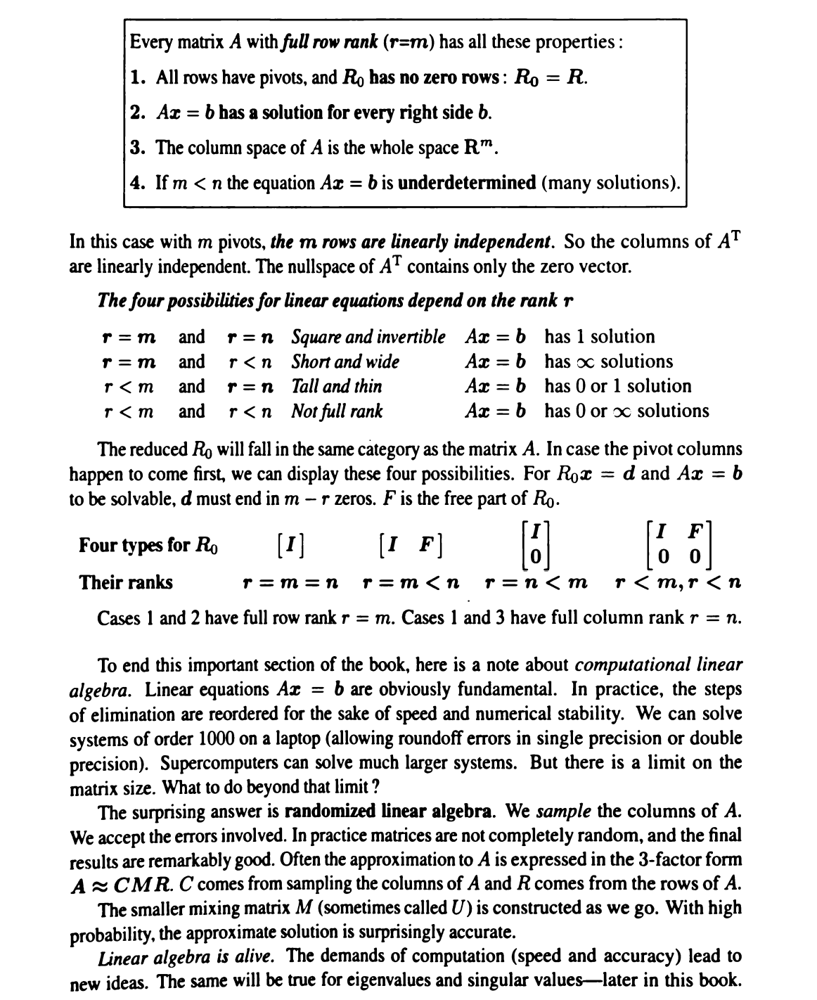
满行秩与 Ax = b 的完全解
================

（对应课件 “**Full Row Rank and the Complete Solution**” 及 “每种秩情况的四种可能\*\*” 两页）

* * *

1  满行秩（r = m）的一般结论
------------------

| 结论 | 解释 |
| --- | --- |
| **所有行是枢轴行** | rref(A)=R\_0 无零行；行向量线性独立。 |
| **列空间 C(A)= $\mathbb R^m$ ** | 每一个右端向量  $b\in\mathbb R^m$  都可表示为行的线性组合 ⇒ 方程  $Ax=b$  **一定有解**。 |
| **自由变量数 = n−m ≥ 0** | 若  $n>m$ （列多于行） → 存在自由变量，因此解 **无限多**；若  $n=m$  并且 r=m →  $A$  可逆，解 **唯一**。 |
| **左零空间 N(Aᵀ)={0}** | 行独立意味着无非零向量与所有行同时正交。 |

> **极端对称**：
> 
> *   “满列秩” $(r=n)$  强调列独立（方程至多一解或无解），
> *   “满行秩” $(r=m)$  强调行独立（方程至少一解，可能多解）。
>     

* * *

2  示例 2：两平面相交成一直线
-----------------

### 2.1 方程组

$$
\begin{cases} x + y + z = 3\\[4pt] x + 2y - z = 4 \end{cases} \quad\Longrightarrow\quad A = \begin{bmatrix}1&1&1\\1&2&-1\end{bmatrix},\; b=\begin{bmatrix}3\\4\end{bmatrix}, \; m=2,\;n=3,\;r=2.
$$

### 2.2 消元过程

$$
\bigl[A\;\;b\bigr] \;\xrightarrow{\text{消元}}\; \begin{bmatrix} 1&1&1&3\\0&1&-2&1 \end{bmatrix} \;\xrightarrow{\text{上消元}}\; \begin{bmatrix} 1&0&3&2\\0&1&-2&1 \end{bmatrix} =[\,R\;d\,].
$$
*   **自由变量**： $x_3$ （列 3）
*   **枢轴变量**： $x_1=d_1-3x_3,\; x_2=d_2+2x_3$ 

### 2.3 特解与零空间向量

| 选择 | 结果 |
| --- | --- |
| **特解**  $x_3=0$  |  $x_p=(2,1,0)^{\mathsf T}$  |
| **零空间向量**  $x_3=1$  | 伴随  $x_1=-3,\;x_2=2$  →  $s=(-3,2,1)^{\mathsf T}$  |

### 2.4 完全解

$$
x = x_p + x_3\,s = \begin{bmatrix}2\\1\\0\end{bmatrix} + x_3\,\begin{bmatrix}-3\\2\\1\end{bmatrix}, \quad x_3\in\mathbb R .
$$

> **几何图像（Figure 3.1）**
> 
> *   二条平面 → 交线；
> *    $x_p$  是线上某固定点；
> *    $s$  给出沿线方向；
> *   任意线性组合  $x_p + x_n$ （ $x_n\in N(A)$ ）遍历整条直线。
>     

* * *

3  四种  $m,n,r$  组合对比
--------------------

| 行数 vs 列数 | 秩情况 | rref 形态 |   $Ax=b$  解情况 | 零空间  $\dim N(A)$  |
| --- | --- | --- | --- | --- |
| ** $m=n,\;r=m=n$ ** | 方阵可逆 |  $[I]$  | **唯一解** | 0 |
| ** $m<n,\;r=m$ ** | 行满秩（短宽） |  $[I\;F]$  | **无穷解** |  $n-m$  |
| ** $m>n,\;r=n$ ** | 列满秩（高瘦） |  $\begin{bmatrix}I\\0\end{bmatrix}$  | **0 或 1 解** | 0 |
| ** $r<m,n$ ** | 不满秩 |  $\begin{bmatrix}I\;F\\0\;0\end{bmatrix}$  | **0 或 ∞** |  $n-r$  |

> rref 原型源于主元是否填满行/列：
> 
> *   满行秩时 **无零行**；
> *   满列秩时 **无自由列**；
> *   二者皆满即  $I$ ；皆欠缺则既有零行又有自由列。
>     

* * *

4  满行秩属性汇总（课件黑框）
----------------

1.  **所有行都是枢轴行**， $R_0=R$ 。
2.  **对任何  $b$ **，方程 **必有解**。
3.  **列空间 =  $\mathbb R^m$ **。
4.  **若  $m<n$ **，系统 **欠定**：解无限多。

* * *

5  计算实践与“随机化线性代数”一瞥
-------------------

*   消元顺序在数值计算中常重排以兼顾**稳定性与速度**；软件如 MATLAB 使用回代 `\` 直接给出某个  $x_p$ 。
*   **随机化线性代数**：在大规模问题中，用抽样列（构  $C$ ）和抽样行（构  $R$ ）得到近似分解  $A≈C M R$ ，降低存储与运算量；本书在后续奇异值分解章节将进一步探讨。

* * *

6  要点回顾
-------

1.  **满行秩 r=m** ⇒ 行独立， $Ax=b$  可解；若  $n>m$  解为一族（自由变量），若  $n=m$  解唯一。
2.  完全解依旧是 ** $x=x_p+N(A)$ **，区别仅在零空间维数。
3.  四种  $r$  与  $m,n$  组合同一张表里一次性揭示 **解存在性** 与 **解个数** 的判别法。
4.  现代计算中，随机化与块消元极大提升了大型矩阵问题的可行性。


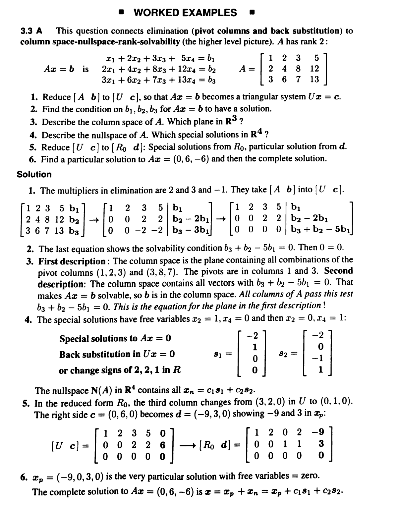

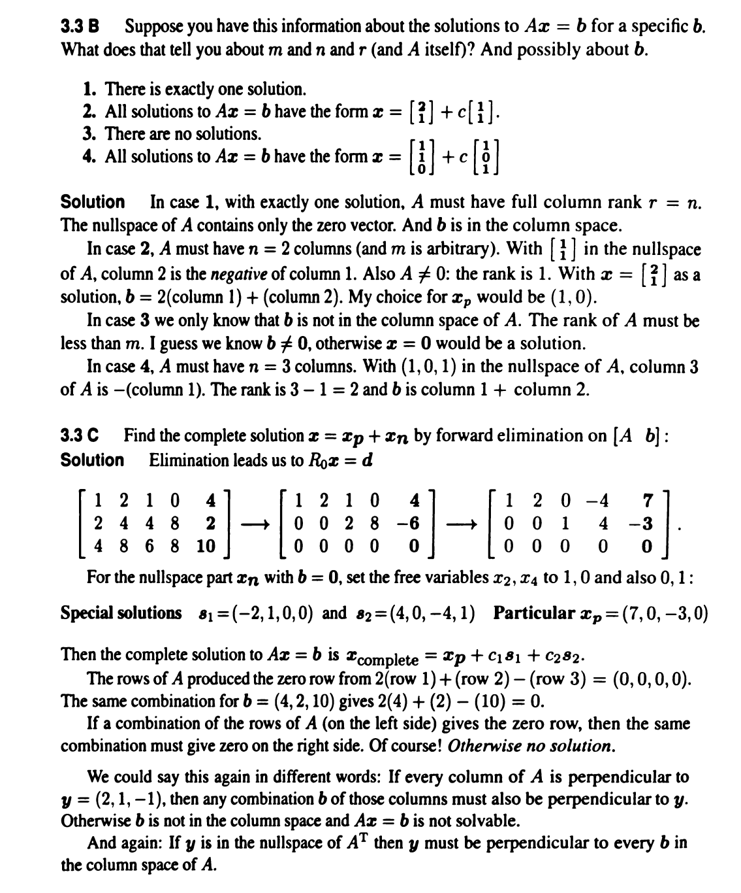

3.3 节 **完整解 Ax = b _进阶例题解析_**
=============================

（对应“WORKED EXAMPLES”页：3.3 A、3.3 B、3.3 C）

* * *

例题 3.3 A 列空间‑零空间‑可解性的一体化检验
--------------------------

$$
A=\begin{bmatrix} 1&2&3&5\\ 2&4&8&12\\ 3&6&7&13 \end{bmatrix},\qquad r=2
$$

> **任务概览**
> 
> 1.  将增广矩阵  $[A\;b]$  消元为上三角  $[U\;c]$ 
> 2.  从最后一行读出 _可解条件_
> 3.  描述列空间 C(A) 与零空间 N(A)
> 4.  构造特殊解（零空间基）与特解  $x_p$ 
> 5.  给定  $b=(0,6,-6)$  求完全解
>     

### 1  消元： $[A\;b]\to[U\;c]$ 

*   乘子：第 2 行 − 2×R1， 第 3 行 − 3×R1，之后 R3 + R2
    
$$
[U\;c]= \begin{bmatrix} 1&2&3&5&|&b_1\\ 0&0&2&2&|&b_2-2b_1\\ 0&0&-2&-2&|&b_3-3b_1 \end{bmatrix}
$$

### 2  可解条件

第三行： $0= b_3+b_2-5b_1$  ⇒ **可解当且仅当**

$$
\boxed{b_3+b_2-5b_1=0}.
$$

### 3  列空间 C(A)

*   平面方程  $b_3+b_2-5b_1=0$ 
*   等价表述：列空间由枢轴列 1、3 （或 (1,2,3) 与 (3,8,7)）张成的一平面。

### 4  零空间 N(A) ⟹ “特殊解”

*   自由变量： $x_2,x_4$ 
*   取  $(x_2,x_4)=(1,0)$ ,  $(0,1)$  得
    $$
    s_1=(-2,1,0,0)^{\mathsf T},\qquad s_2=(-2,0,-1,1)^{\mathsf T}.
    $$
     $N(A)=\text{span}\{s_1,s_2\}\subset\mathbb R^4$ 。

### 5  从  $[U\;c]$  →  $[R_0\;d]$  并取特解

*   再消元得
    $$
    R_0= \begin{bmatrix} 1&2&3&5\\ 0&0&2&2\\ 0&0&0&0 \end{bmatrix},\; d=(-9,3,0)^{\mathsf T}.
    $$
*   令自由变量 0 ⇒
    $$
    x_p=(-9,0,3,0)^{\mathsf T}.
    $$

### 6  给定  $b=(0,6,-6)$  的完全解

$$
x=x_p+c_1s_1+c_2s_2 =(-9,0,3,0)+c_1(-2,1,0,0)+c_2(-2,0,-1,1).
$$

* * *

例题 3.3 B **由解的形式反推 m,n,r 与矩阵结构**
--------------------------------

> 四种给定“解结构”的情形，结论汇总：

| 编号 | 题设 | 推断 |
| --- | --- | --- |
| 1 | **唯一解** | 满列秩  $r=n$ ，零空间仅  $\{0\}$ 。 |
| 2 |  $x=\begin{bmatrix}2\\1\end{bmatrix}+c\!\begin{bmatrix}1\\1\end{bmatrix}$  |  $n=2$  列且列 2 = −列 1； rank = 1； $b$  为这两列线性组合。 |
| 3 | **无解** |  $b\notin C(A)$ ，必有零行导致矛盾 ⇒  $r<m$ 。 |
| 4 |  $x=\begin{bmatrix}1\\0\end{bmatrix}+c\!\begin{bmatrix}0\\1\end{bmatrix}$  |  $n=3$ ，其中列 3 = −列 1；rank=2； $b$ \=列 1+列 2。 |

* * *

例题 3.3 C 完整解实操再练
----------------

$$
A= \begin{bmatrix} 1&2&1&0\\ 2&4&4&8\\ 4&8&6&10 \end{bmatrix},\qquad b=(4,2,10)^{\mathsf T}
$$

### 消元 →  $[R_0\;d]$ 

$$
R_0= \begin{bmatrix} 1&2&0&-4\\ 0&0&1&4\\ 0&0&0&0 \end{bmatrix},\quad d=(7, -3, 0)^{\mathsf T}.
$$
*   **自由变量**  $x_2,x_4$ 
*   **特殊解**
    $$
    s_1=(-2,1,0,0)^{\mathsf T},\; s_2=(4,0,-4,1)^{\mathsf T}.
    $$
*   **特解**  $x_p=(7,0,-3,0)^{\mathsf T}$ .

> **完全解**
> 
> $$
> x=x_p+c_1s_1+c_2s_2.
> $$

* * *

综合总结
----

1.  **消元同步右端列** → 从最后零行读可解条件；
2.  **列空间方程** = 该可解条件；
3.  **零空间** 来自自由列，对每列写  $[-F;I]$ ；
4.  **完全解** = 特解 + 零空间；
5.  **解的唯一 / 无限 / 不存在** 取决于 _(r, m, n)_ 组合：
    *   r = n：解至多 1；
    *   r = m < n：解 ∞；
    *   r < m 且 r < n：0 或 ∞。

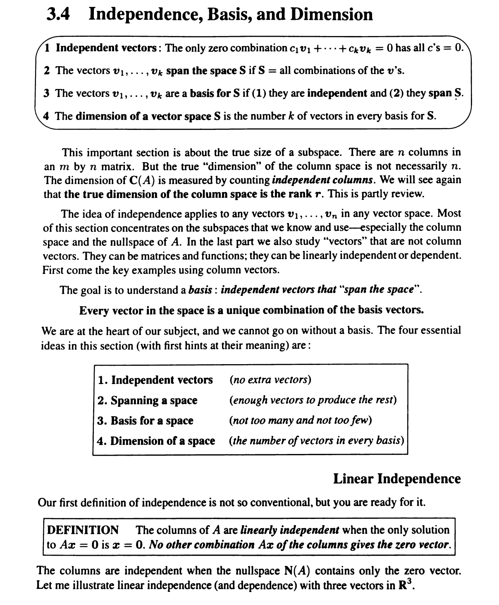

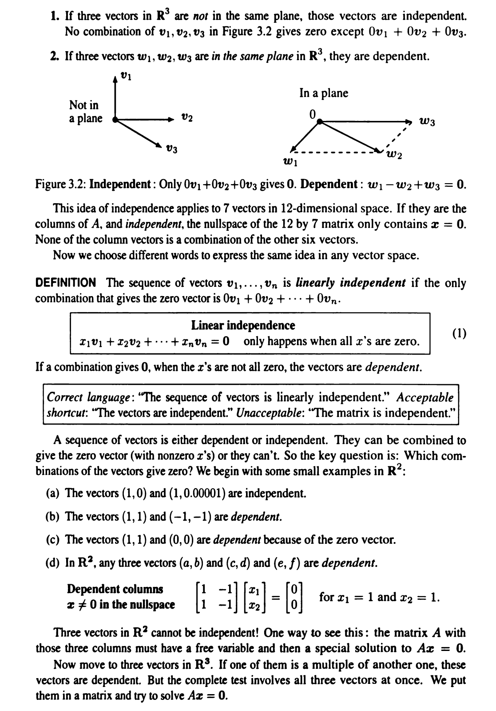

## 
第 3.4 节 独立、基与维数
===============

\*\*概览：\*\*本节进入“子空间真大小”——维数（dimension）的精确定义，并阐释三大核心概念：**线性无关（independence）**、**张成（span）**、**基（basis）**。要点与逻辑顺序如下。

* * *

1  四条核心公理（课件框图复述）
-----------------

| # | 关键语句 | 含义解读 |
| --- | --- | --- |
| 1 | **独立向量**：若唯一给出零向量的线性组合是所有系数 0 | 无冗余向量；列空间无“重复信息”。 |
| 2 | **张成空间**：若集合  $v_1,\dots,v_k$  的全部线性组合恰好覆盖子空间  $S$  | “可生成”→ 足够多。 |
| 3 | **基**：既独立又张成 | 刚好“恰恰好”——不多不少。 |
| 4 | **维数**：任何基向量数  $k$  | 子空间真实大小，用独立列数量衡量。 |

> 对列空间  $\mathcal C(A)$  而言，维数就是 **秩  $r$ **。

* * *

2  线性无关的“矩阵检验”
--------------

> **定义（课件黑框）**
> 
> $$
> \text{列向量独立} \;\Longleftrightarrow\; Ax=0 \text{ 仅有零解}.
> $$

*   即零空间  $N(A)$  只有零向量。
*   因此 **检验独立性** ↔ **解齐次方程**。
*   对任意向量族  $v_1,\dots,v_n$ ，将其并列为矩阵列 → 解  $Ax=0$  即可。

* * *

3  几何直观： $\mathbb R^3$  中的三向量
-----------------------------

| 场景 | 示意（图 3.2） | 结论 |
| --- | --- | --- |
| 三向量 **不共面** | 三箭头不在同一平面 | **独立** |
| 三向量 **共面** | 端点连成平面、存在依赖如  $w_1-w_2+w_3=0$  | **依赖** |

> 在更高维度也类似：若向量族维度 > 所在空间上限，必依赖。

* * *

4   $\mathbb R^2$  中小例子（课件列表 (a)–(d)）
-------------------------------------

| 子例 | 向量对 | 结果 | 原因 |
| --- | --- | --- | --- |
| (a) |  $(1,0),(1,0.00001)$  | **独立** | 行列式 ≠ 0；比例系数不同。 |
| (b) |  $(1,1),(−1,−1)$  | **依赖** | 第二个为第一个的 (−1) 倍。 |
| (c) |  $(1,1),(0,0)$  | **依赖** | 零向量自动造成依赖。 |
| (d) | 任意三向量 | **依赖** |  $\mathbb R^2$  维度仅 2 → 第三必由前两组合。 |

> 表格右下的  $2\times2$  小矩阵演示了：两列相同 ⇒ 零空间有特殊解 ⇒ 列依赖。

* * *

5  基的意义与唯一表示
------------

*   一旦选定一组 **基向量**，子空间内 **每个** 向量都能且仅能 **唯一** 写成它们的线性组合。
*   这让坐标系与线性变换分析成为可能（后续正交基、坐标变换等章节基于此）。

* * *

6  与前几节联系
---------

| 前置概念 | 本节角色 | 互动 |
| --- | --- | --- |
| **列空间**  $\mathcal C(A)$  | **基列** = r 个主元列 | 秩  $r$  = 维数 |
| **零空间**  $N(A)$  | **特殊解矩阵**  $[-F;I]$  列向量 | 其列亦是一组基；维数  $n-r$  |
| **行空间** | 同理由主元行构成基 | 维数  $r$  |

* * *

7  本节要点总结
---------

1.  **独立 ↔ 零空间仅零向量**；检验靠解  $Ax=0$ 。
2.  **基** = 独立且张成；维数 = 基向量个数。
3.  **列秩**与**列空间维数**一致；同理行秩。
4.  几何图示帮助记忆：平面外三向量独立，共面的依赖。
5.  零向量或比例向量立即造成线性相关。


## 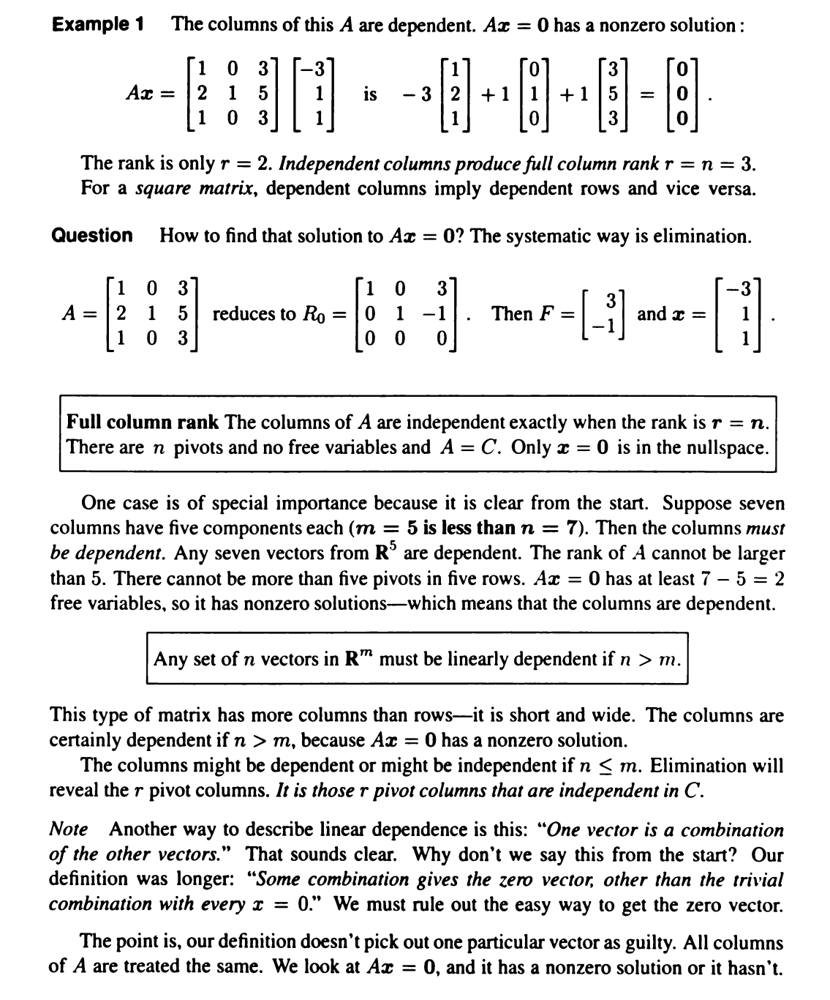
3.4  独立、基与维数（续）
---------------

**本页要点聚焦：** 通过具体矩阵示例说明“线性相关 ⇔ 秩降低”、“满列秩的判别”与“一定相关”的极值情形，并补充对“线性相关”正确措辞的提醒。

* * *

### 一、示例 1：用齐次方程检测列相关

$$
A= \begin{bmatrix} 1&0&3\\ 2&1&5\\ 1&0&3 \end{bmatrix},\quad Ax=0\ \text{有非零解：}\; x=\begin{bmatrix}-3\\1\\1\end{bmatrix}
$$
*   **观察**：第 3 列正好 = 第 1 列 × 1 + 第 2 列 × 0 → 列相关。
*   **消元过程**
    $$
    A\ \xrightarrow{\text{rref}}\ R_0= \begin{bmatrix} 1&0&3\\ 0&1&-1\\ 0&0&0 \end{bmatrix},\; F=\begin{bmatrix}3\\-1\end{bmatrix}, \quad x=\begin{bmatrix}-3\\1\\1\end{bmatrix}=-F.
    $$
    ⇒ **秩  $r=2<n=3$ **。

> **结论：** 只要有非零特殊解，就说明列不独立 → 秩下降。  
> 反之，若  $Ax=0$  唯有零解，则列独立，秩达到列数。

* * *

### 二、满列秩（r = n）的再强调

> **黑框总结（课件）**  
> 当  $r=n$  时：
> 
> 1.  **每列都是主元列** → 无自由变量。
> 2.  **零空间仅含 0**。
> 3.  若  $Ax=b$  可解，则 **唯一解**（因为没有自由变量）。
>     

* * *

### 三、“列多于行必相关”定理

*   若  $n>m$ （短宽矩阵），则 Ax = 0 必有 ≥  $n-m$  自由变量 ⇒ 存在非零解 ⇒ **列一定相关**。
*   课件醒目标语：
    > _Any set of n vectors in  $\mathbb R^m$  must be linearly dependent if  $n>m$ ._

**直观**：最多只能有  $m$  条独立方向， 多一条必落入已有张成空间。

* * *

### 四、关于“线性相关”措辞的注意

*   ✅ 推荐：
    > “这些向量 **线性相关** / **线性无关**。”
*   ❌ 不推荐：
    > “这个**矩阵**是独立的。”（应指其列或行）

* * *

本页知识小结
------

1.  **依赖检测 = 解  $Ax=0$ **，出现自由变量即相关；
2.  **满列秩  $r=n$ ** ⇒ 列独立、零空间 0、解唯一/无解；
3.  **列数 > 行数** ⇒ 一定相关，因为自由变量不少于  $n-m$ ；
4.  理解“相关”最好用“某非零组合得零向量”而非“某向量是另一向量的倍数”这种片面说法；
5.  消元得到的  $F$  矩阵直接给出依赖关系系数向量。

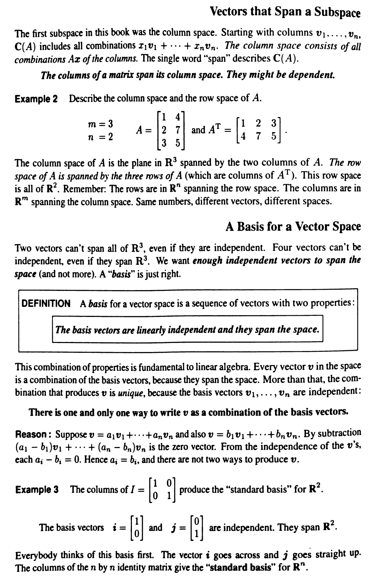

## 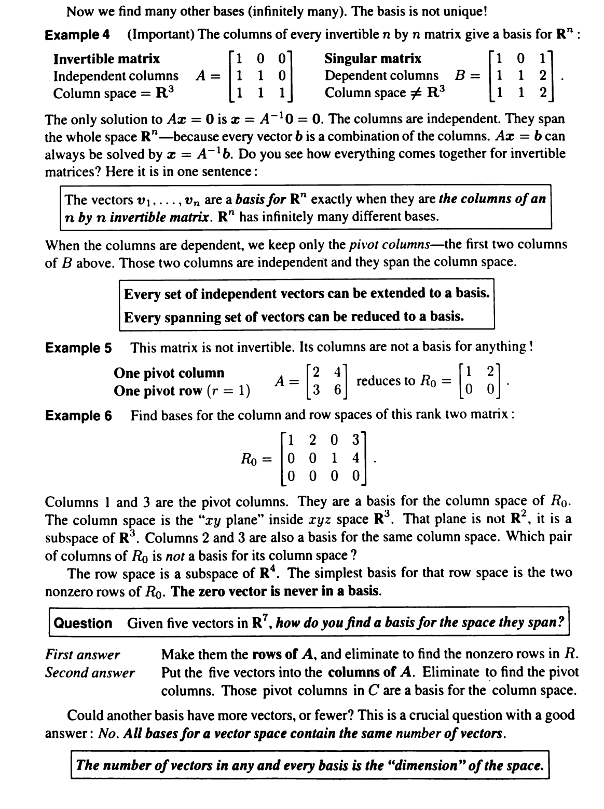
3.4  向量的张成、基与维数（续）
==================

本页围绕三大主题：

*   **张成（span）**：由向量组合生成子空间
*   **基（basis）**：既独立又能张成的最小集合
*   **维数（dimension）**：任一基中的向量数

* * *

1  张成子空间的向量
-----------

> **列空间 C(A)** 就是“列向量的全部线性组合”。  
> **行空间** 同理，由行向量（即  $A^{\mathsf T}$  的列）张成。

### Example 2

$$
A=\begin{bmatrix}1&4\\2&7\\3&5\end{bmatrix},\quad A^{\mathsf T}=\begin{bmatrix}1&2&3\\4&7&5\end{bmatrix}
$$

| 空间 | 维度 | 张成向量 |
| --- | --- | --- |
| **列空间** C(A) | 2 | 两列向量  $(1,2,3)^{\mathsf T},(4,7,5)^{\mathsf T}$  在  $\mathbb R^3$  内张成一平面 |
| **行空间** C(Aᵀ) | 2 | 三行  $(1,4),(2,7),(3,5)$  位于  $\mathbb R^2$ ，共张成整个  $\mathbb R^2$  |

> _同一组数字，不同向量方向，生成不同的子空间。_

* * *

2  基的正式定义与唯一表示
--------------

> **基**：一组向量 **线性独立** 且 **张成** 整个空间。

*   只要满足这两点，称为基，且：
    *   **写唯一性**：空间中每个向量在此基下的坐标唯一。
    *   **维数恒定**：任何基都含相同数量的向量，这个数即维数  $k$ 。

**示例**

*    $\mathbb R^2$  的 **标准基**：
    $$
    i=\begin{bmatrix}1\\0\end{bmatrix},\;j=\begin{bmatrix}0\\1\end{bmatrix}.
    $$
*   单位矩阵  $I_2$  的两列正是这组基向量。

* * *

3  基与可逆矩阵的联系（Example 4）
-----------------------

| 矩阵类型 | 基列 | 列空间 |
| --- | --- | --- |
| **可逆  $3\times3$ **  $\begin{bmatrix}1&0&0\\1&1&0\\1&1&1\end{bmatrix}$  | 3 列全部 |  $\mathbb R^3$  |
| **奇异**  $\begin{bmatrix}1&0&1\\1&1&2\\1&1&2\end{bmatrix}$  | 列 1、2 独立 → 基；列 3 依赖 | 仍为  $\mathbb R^3$ ? ✗（缺维度） |

> 结论：
> 
> *   **可逆方阵的全部列** 构成  $\mathbb R^n$  的一组基。
> *   若列相关，则仅保留首  $r$  个 **主元列** 作为基。
>     

* * *

4  两条常用原则（课件黑框）
---------------

1.  **任何独立向量组** 都可 **扩展** 成一个基。
2.  **任何张成向量组** 可 **精简** 去冗余得到一组基。

* * *

5  非满秩示例与基的选取
-------------

### Example 5

$$
A=\begin{bmatrix}2&4\\3&6\end{bmatrix}\xrightarrow{\text{rref}}R_0=\begin{bmatrix}1&2\\0&0\end{bmatrix},\quad r=1.
$$
*   仅一列枢轴 ⇒ 列 1 是 **列空间基**（一条线）。

### Example 6

$$
R_0=\begin{bmatrix} 1&2&0&3\\ 0&0&1&4\\ 0&0&0&0 \end{bmatrix},\; r=2
$$
*   **列空间基**：列 1 & 3（或 2 & 3，同维同空间）。
*   列空间是  $\text{“}xy\text{ 平面”}\subset\mathbb R^3$ 。
*   **行空间基**：R₀ 中非零行 (1,2,0,3) 与 (0,0,1,4)。
*   0 行永不进基。

* * *

6  通用找基方法（回答课件提问）
-----------------

> 题：已知  $\mathbb R^7$  中 5 个向量，求其张成空间的基？

1.  **方法 A**：作成矩阵行 → 行消元，取非零行作 **行空间基**。
2.  **方法 B**：作成矩阵列 → 列消元，取 **主元列** 作 **列空间基**。

无论行或列处理，得到的基都含 **相同数量向量**，即子空间 **维数**。

* * *

7  维数不变量
--------

> **“任何基的向量数相同”**  
> 这条定理保证“维数”定义良好。
> 
> *   例如  $\mathbb R^3$  的基永远是 3 向量；
> *   上例列空间基不可能再缩减为 1 个，也不可能需 3 个。
>     

* * *

本页总结
----

1.  **张成 vs 基**：张成只保“够用”；基再加“独立”确保“刚刚好”。
2.  **枢轴列/行** 在计算实践中提供了快速基选取方法。
3.  **满列秩可逆矩阵** 每列即一组基；列数 > 行数则必相关。
4.  **扩展与精简原则**：独立组可扩展成基，冗余张成组可减至基。
5.  **维数恒定**：任一基都含 k 个向量，k 即子空间维数。


## 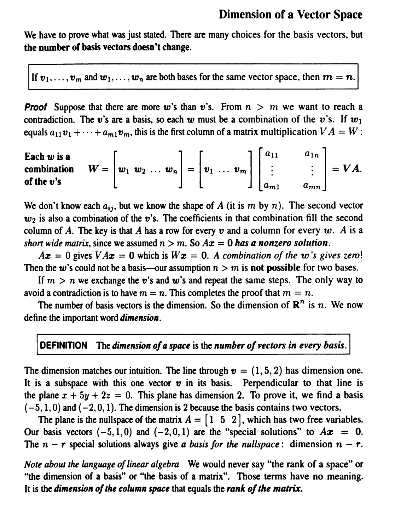
维数的唯一性定理
========

**标题概述：** 本页完成对“维数”概念的严格证明：**任何两个基向量组都含相同数量的向量**。随后以直观例子说明维数的计算与应用，并再次澄清专业表述。

* * *

1  维数唯一性定理
----------

> **命题**  
> 若  $\{v_1,\dots,v_m\}$  和  $\{w_1,\dots,w_n\}$  都是同一向量空间  $S$  的基，则 ** $m=n$ **。

### 1.1  证明思路（课件推导）

1.  **假设反证**：若  $n>m$ ，则每个  $w_j$  必可由  $v$  组线性组合表示：
    $$
    W=\bigl[w_1\;\dots\;w_n\bigr]=\underbrace{\bigl[v_1\;\dots\;v_m\bigr]}\_{V}\cdot A,
    $$
    其中  $A$  为  $m\times n$  系数矩阵。
2.  由于  $n>m$ ，矩阵  $A$  **列多于行** ⇒ 解  $Ax=0$  必有非零向量 ⇒ 存在非零系数组合  $\sum c_jw_j=0$ 。
3.  这与  $w$  组“线性无关”相矛盾 ⇒ 假设不成立 ⇒ ** $m=n$ **。

### 1.2  定义落实

*   **维数** = “任何”基向量数。
*   对  $\mathbb R^n$  整体空间 ⇒ 维数 =  $n$ 。

* * *

2  维数直观示例
---------

| 子空间 | 典型基 | 维数 | 说明 |
| --- | --- | --- | --- |
| 直线： $\operatorname{span}(1,5,2)$  |  $\{(1,5,2)\}$  | 1 | 任何非零向量单独张成一条线 |
| 平面  $x+5y+2z=0$  | 取两独立向量如  $(-5,1,0)$ 、 $(-2,0,1)$  | 2 | 由两个特殊解张成 |
| 零空间  $N(A)$ （ $A=[1\;5\;2]$ ） | 上述同两向量 |  $n-r = 3-1 = 2$  | 与自由变量数一致 |

* * *

3  语言规范提示
---------

*   **正确**：
    *   “ $\dim S = k$ ”
    *   “ $\{v_i\}$  是 **空间** 的基”
*   **避免**：
    *   “空间的秩(rank)”——秩是**矩阵**概念。
    *   “基的维数”——维数定义自空间，不加“基”一词。

* * *

4  要点回顾
-------

1.  **基数量不变** → 维数定义稳固。
2.  **证明核心**：列多于行 ⇒ 存在非零解 ⇒ 打破独立性。
3.  维数可用多种基求得，但结果相同。
4.  实际应用：
    *   列空间维数 = 秩  $r$ 。
    *   零空间维数 =  $n - r$ 。
5.  专业表述需区分“秩(矩阵)”与“维数(空间)”。


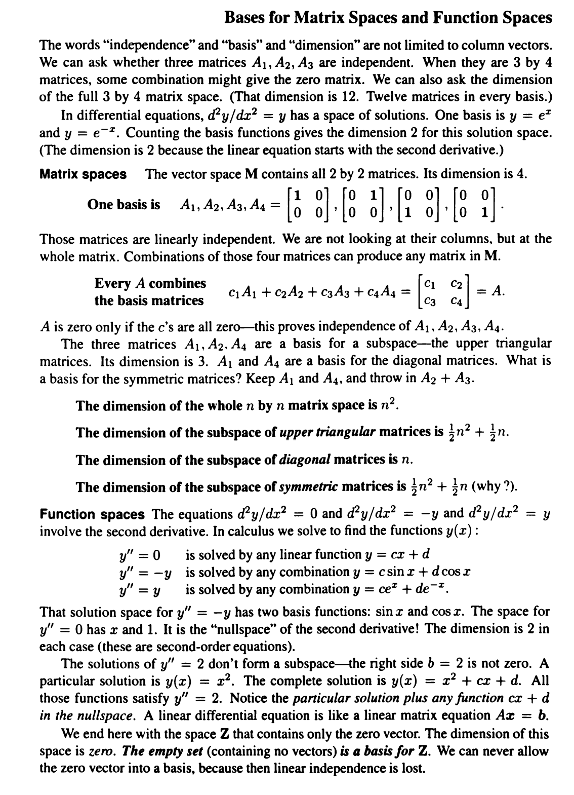

## 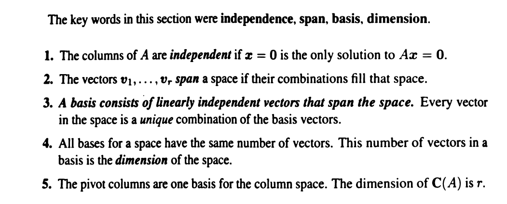
基与维数的进一步扩展：矩阵空间与函数空间
====================

（对应 §3.4 后半部分课件内容）

* * *

一、矩阵空间 M 与其子空间的基
----------------

| 空间 | 标准基示例 | 维数 | 说明 |
| --- | --- | --- | --- |
| **全体  $2\times2$  矩阵**  $M$  |  $A_1=\!\begin{bmatrix}1&0\\0&0\end{bmatrix},\;A_2=\!\begin{bmatrix}0&1\\0&0\end{bmatrix},\;A_3=\!\begin{bmatrix}0&0\\1&0\end{bmatrix},\;A_4=\!\begin{bmatrix}0&0\\0&1\end{bmatrix}$  | 4 | 组合  $c_1A_1+\dots+c_4A_4$  可产生 _任意_  $2\times2$  矩阵；且  $A_i$  独立 |
| **上三角矩阵** |  $A_1,A_2,A_4$  | 3 | 去掉  $A_3$ ，仍覆盖所有  $\begin{bmatrix}a&b\\0&d\end{bmatrix}$  |
| **对角矩阵** |  $A_1,A_4$  | 2 | 仅保留主对角元 |
| **对称矩阵** |  $A_1,\;A_4,\;A_2+A_3$  | 3 | 第三基向量  $\begin{bmatrix}0&1\\1&0\end{bmatrix}$  与前两独立且张成所有  $\begin{bmatrix}a&b\\b&d\end{bmatrix}$  |

> **一般  $n\times n$  结论**
> 
> *   全空间维数： $n^2$ 
> *   上三角子空间： $\tfrac12n^2+\tfrac12n$ 
> *   对角子空间： $n$ 
> *   对称子空间： $\tfrac12n^2+\tfrac12n$ 
>     

* * *

二、函数空间中的基与维数
------------

| 微分方程 | 通解（基函数） | 维数 | 备注 |
| --- | --- | --- | --- |
|  $y''=0$  |  $x,\;1$  | 2 | 任意线性函数 |
|  $y''=-y$  |  $\sin x,\;\cos x$  | 2 | 简谐振动空间 |
|  $y''=y$  |  $e^{x},\;e^{-x}$  | 2 | 指数增长/衰减空间 |

*   非齐次方程  $y''=2$ ：先取特解  $x^2$ ，再加齐次解  $cx+d$ 。
*   仅零函数的空间  $Z=\{0\}$  维数为 0；其**基为空集**（不能把零向量放进基！）。

* * *

三、基的可变性与原则
----------

1.  **基非唯一**：对  $\mathbb R^n$  而言，单位列向量组是 _最常用_，但可逆方阵的任意列集也能作为基。
2.  **扩展 / 精简法则**
    *   任一独立向量组可 **扩充** 成基。
    *   任一张成集合可 **删减** 至基（去掉依赖元素）。
3.  **枢轴列** = 列空间的一组自然基；**非零行** = 行空间的自然基。

* * *

四、维数不变性的证明要点（回顾）
----------------

> 若两组基  $\{v_1,\dots,v_m\}$ 、 $\{w_1,\dots,w_n\}$  在同一空间，必有  $m=n$ 。

*   假设  $n>m$ ：每个  $w_j$  可写成  $v$ \-组组合 → 得到  $V A = W$ （ $m\times n$  矩阵  $A$  列多于行）。
*   因  $n>m$ ，齐次方程  $A x = 0$  有非零解 → 存在非零系数令  $\sum c_j w_j = 0$  → 与  $w$ \-组独立矛盾。
*   交换角色得  $m>n$  同样不行 ⇒ 唯有  $m=n$ 。

* * *

五、本章关键词速记（课件总结）
---------------

1.  **独立**： $Ax=0$  仅零解。
2.  **张成**：线性组合填满空间。
3.  **基**：独立 + 张成 → 唯一坐标展开。
4.  **维数**：任何基的向量数（不随选择改变）。
5.  **枢轴列** 给出列空间基；其数目  $r$  = 秩 =  $\dim \mathcal{C}(A)$ 。


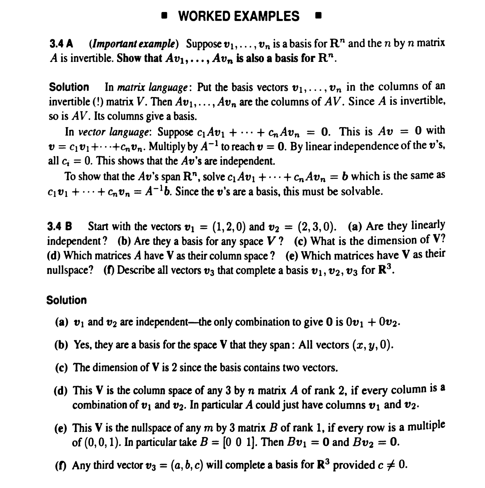

## 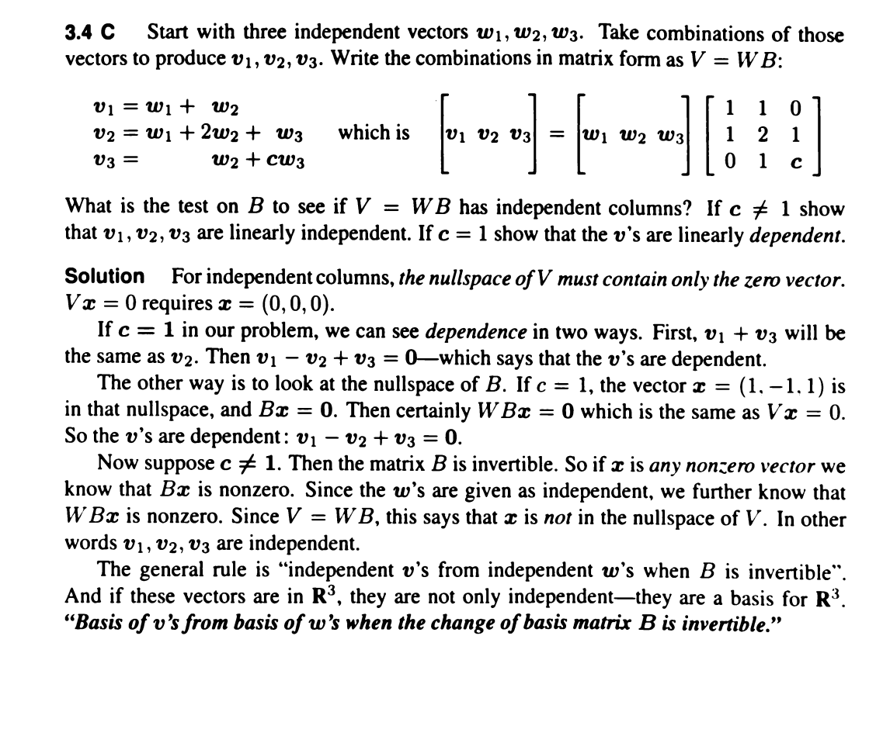
3.4  练习题精讲（Worked Examples A‑C）
===============================

* * *

3.4 A **可逆矩阵乘以基 ⇒ 得到新基**
------------------------

> **题目要点**  
> 已知  $\{v_1,\dots,v_n\}$  是  $\mathbb R^n$  的一组基，证明对任意可逆矩阵  $A$ ，向量组  $\{Av_1,\dots,Av_n\}$  也是  $\mathbb R^n$  的基。

| 证明视角 | 关键逻辑 |
| --- | --- |
| **矩阵语言** | 把基列排成  $V=[v_1\ \dots\ v_n]$ 。则新组是  $AV$  的列。可逆矩阵左乘不改变列数且保持列独立，故列仍独立并张成  $\mathbb R^n$ 。 |
| **向量语言** | 若有组合  $c_1Av_1+\dots+c_nAv_n=0$  ⇒  $A(c_1v_1+\dots+c_nv_n)=0$  ⇒ 乘以  $A^{-1}$  得  $c_1v_1+\dots+c_nv_n=0$  ⇒ 基独立 ⇒ 全部  $c_i=0$ 。故新组独立；张成性同理由  $Ax=b$  可解推出。 |

* * *

3.4 B **二向量子空间综合考察**
--------------------

设  $v_1=(1,2,0),\;v_2=(2,3,0)$ 。

| 问题 | 解答 |
| --- | --- |
| (a) 是否独立？ | 是。平面  $z=0$  内不共线；或解  $\alpha v_1+\beta v_2=0$  仅零解。 |
| (b) 是否是一组基？ | 是，它们张成的空间  $V=\{(x,y,0)\}$ 。 |
| (c) 维数 | 2。 |
| (d) 哪些矩阵  $A$  以  $V$  为列空间？ | 任意  $3\times n$  且 rank = 2，所有列都是  $v_1,v_2$  线性组合即可。 |
| (e) 哪些矩阵以  $V$  为零空间？ | 任意  $m\times3$ 、rank 1，且行向量均与  $(0,0,1)$  成比例；例如  $B=[0\ 0\ 1]$ 。 |
| (f) 补出第三向量构成  $\mathbb R^3$  的基 | 取  $v_3=(a,b,c)$  但要求  $c\neq0$ （使其离开  $z=0$  平面）。 |

* * *

3.4 C **基的变化矩阵与独立性**
--------------------

给定三独立向量  $w_1,w_2,w_3$ ，构造

$$
V=[v_1\ v_2\ v_3]=W B,\qquad B=\begin{bmatrix}1&1&0\\1&2&1\\0&1&c\end{bmatrix}.
$$

| 结论 | 解释 |
| --- | --- |
| 当  $c=1$  |  $B$  列 1 与列 3 相同 ⇒  $B$  不可逆 ⇒  $V$  列相关（例如  $v_1-v_2+v_3=0$ ）。 |
| 当  $c\neq1$  |  $B$  可逆 ⇒ 任意非零  $x$  使  $Bx\neq0$  ⇒  $Wx\neq0$  (因  $w$  组独立) ⇒  $Vx\neq0$ 。故  $V$  列独立；若在  $\mathbb R^3$  还构成一组基。 |

> **一般法则**：基经过 **可逆“变换矩阵”  $B$ ** 映射后仍是基；若  $B$  奇异则独立性可能丢失。

* * *

知识点小结
-----

1.  **基与可逆矩阵**：可逆矩阵左乘相当于“换基”，不会破坏独立与张成。
2.  **子空间构造**：
    *   列空间由 **列组合** 描述；
    *   零空间由 **行组合** 描述。
3.  **补全基**：在  $\mathbb R^3$  中，只需找一向量跳出已张成的平面即可。
4.  **独立判据**：检测可逆性/枢轴列，或直接求齐次方程非零解。
5.  **变化矩阵  $B$ **：若  $\det B\neq0$ ，独立性保持；若  $\det B=0$ ，列依赖。


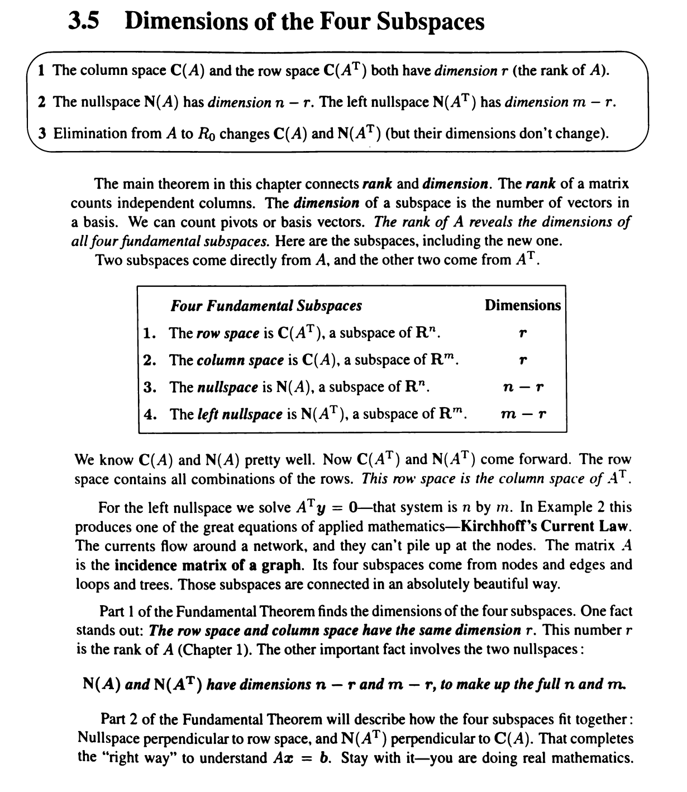


四大基本子空间的维数定理（§ 3.5）
===================

| 子空间 | 记号 | 所在向量空间 | **维数** | 如何快速得到基 |
| --- | --- | --- | --- | --- |
| **行空间** |  $\mathcal C(A^{\mathsf T})$  |  $\mathbb R^{\,n}$  |  $r$  | rref 或  $R$  中的 **非零行** |
| **列空间** |  $\mathcal C(A)$  |  $\mathbb R^{\,m}$  |  $r$  | rref 对应 **枢轴列**（原矩阵同列） |
| **零空间** |  $\mathcal N(A)$  |  $\mathbb R^{\,n}$  |  $n-r$  |  $[-\!F;I]$  的列（special solutions） |
| **左零空间** |  $\mathcal N(A^{\mathsf T})$  |  $\mathbb R^{\,m}$  |  $m-r$  | 解  $A^{\mathsf T}y=0$ （或取  $R$  零行作方程） |

> **核心陈述**  
> _矩阵的秩  $r$  决定了四个基本子空间的维数：行/列空间同秩，零空间维数  $n-r$ ，左零空间维数  $m-r$ 。_

* * *

一、定理要点
------

1.  **行空间 & 列空间**
    *   消元不改变行组合/列相关性 ⇒ 两者维数均为 **秩  $r$ **。
2.  **零空间**
    *   自由变量个数 =  $n-r$  ⇒ 维数即 ** $n-r$ **。
3.  **左零空间**
    *   对  $A^{\mathsf T}$  重复同样论证 ⇒ 维数 ** $m-r$ **。
4.  **行消元影响**
    *   从  $A$  到  $R_0$  过程中，会改变行/列向量本身，但 **维数保持不变**。

* * *

二、四子空间概览表 （源自课件黑框）
------------------

| # | 子空间 | 向量类型 | 维数 |
| --- | --- | --- | --- |
| 1 | Row space =  $\mathcal C(A^{\mathsf T})$  | 行向量的所有线性组合 |  $r$  |
| 2 | Column space =  $\mathcal C(A)$  | 列向量组合 |  $r$  |
| 3 | Nullspace =  $\mathcal N(A)$  | 解  $Ax=0$  |  $n-r$  |
| 4 | Left nullspace =  $\mathcal N(A^{\mathsf T})$  | 解  $A^{\mathsf T}y=0$  |  $m-r$  |

* * *

三、物理/工程直觉
---------

*   **左零空间** 常在网络流 & Kirchhoff 电流定律中出现：
    *   节点‑边关联矩阵  $A$  的左零空间对应「流守恒方程」；
    *   行空间给出边流的独立约束，列空间给出允许的节点电位差方向。

* * *

四、公式回顾与联动
---------

| 维数关系 | 解释 |
| --- | --- |
|  $\dim\mathcal C(A) = \dim\mathcal C(A^{\mathsf T}) = r$  | 行/列秩相同 |
|  $\dim\mathcal N(A) = n-r$  | **秩‑零度定理**（列方向） |
|  $\dim\mathcal N(A^{\mathsf T}) = m-r$  | 行方向对应公式 |
|  $\underbrace{r+(n-r)}_{n} = n,\quad r+(m-r)=m$  | 四子空间维数恰好填满行、列总数 |

* * *

五、学习指北 & 后续
-----------

1.  **先做消元** → 得  $R_0$ 。
2.  **从  $R_0$  直接读取基**：
    *   非零行 → 行空间；
    *   枢轴列 (映回  $A$ ) → 列空间；
    *    $[-\!F;I]$  → 零空间；
    *    $R_0$  零行 → 建立  $A^{\mathsf T}y=0$  找左零空间基。
3.  **牢记对偶性**：行/列、零/左零互成正交补。后续章节会以正交投影深化此结构。

* * *

### 关键记忆词（课件总结）

1.  **Independent**： $Ax=0$  唯零解。
2.  **Span**：组合填满空间。
3.  **Basis**：独立且张成，坐标唯一。
4.  **Dimension**：任何基向量数。
5.  **Pivot columns**：列空间一组基，维数  $r$ 。


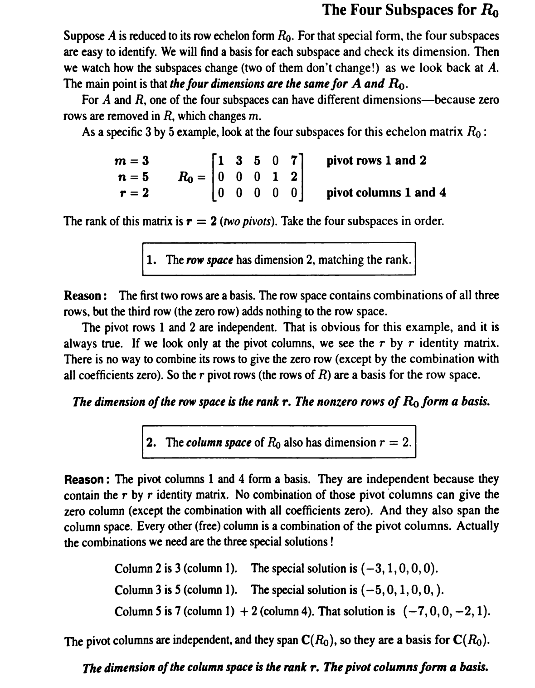

## 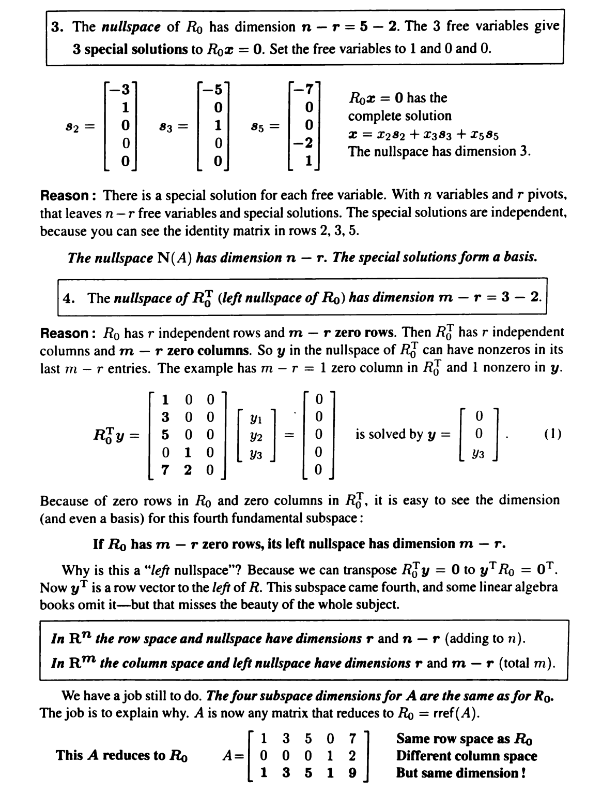
3.5  四大子空间在阶梯形矩阵  $R_0$  上的完整示例笔记
=================================

> **示例矩阵（行最简阶梯形）**
> 
> $$
> R_0=\begin{bmatrix} 1&3&5&0&7\\ 0&0&0&1&2\\ 0&0&0&0&0 \end{bmatrix}, \quad m=3,\;n=5,\;r=2
> $$
> 
>   • 枢轴行：1、2  • 枢轴列：1、4

* * *

1  行空间  $C(R_0^{\mathsf T})$ （ $\mathbb R^{\,5}$  中）
----------------------------------------------------

| 基向量 | 来自 | 说明 |
| --- | --- | --- |
|  $(1,3,5,0,7)$  | 第 1 行 | 非零行即基 |
|  $(0,0,0,1,2)$  | 第 2 行 |   |

_维数_ = 非零行数 = 枢轴行数 = ** $r=2$ **。

* * *

2  列空间  $C(R_0)$ （ $\mathbb R^{\,3}$  中）
----------------------------------------

| 基向量 | 来自 | 说明 |
| --- | --- | --- |
|  $(1,0,0)^{\mathsf T}$  | 枢轴列 1 | 在枢轴行形成单位阵 |
|  $(0,1,0)^{\mathsf T}$  | 枢轴列 4 |   |

_维数_ = 枢轴列数 = ** $r=2$ **。  
其余 3 列均可用这两个基列线性表示：

| 非枢轴列 | 表达式 | 对应“特殊解” |
| --- | --- | --- |
| 列 2 |  $3\cdot\text{列1}$  |  $(-3,\,1,\,0,\,0,\,0)$  |
| 列 3 |  $5\cdot\text{列1}$  |  $(-5,\,0,\,1,\,0,\,0)$  |
| 列 5 |  $7\cdot\text{列1}+2\cdot\text{列4}$  |  $(-7,\,0,\,0,\,-2,\,1)$  |

* * *

3  零空间  $N(R_0)$ （ $\mathbb R^{\,5}$  中）
----------------------------------------

*   自由变量：列 2、3、5 → 共  $n-r=3$  个
*   取“单位‑1”法生成 **3 个特殊解**（即上表所列三向量）
*   **基**： $\{\,s_2,s_3,s_5\,\}$ ，维数 ** $n-r=3$ **
*   通解： $x = x_2s_2+x_3s_3+x_5s_5$ 

* * *

4  左零空间  $N(R_0^{\mathsf T})$ （ $\mathbb R^{\,3}$  中）
-----------------------------------------------------

解  $R_0^{\mathsf T}y=0$ ：

$$
R_0^{\mathsf T}=\begin{bmatrix} 1&0&0\\ 3&0&0\\ 5&0&0\\ 0&1&0\\ 7&2&0 \end{bmatrix}, \qquad y=(0,0,1)^{\mathsf T}
$$
*   自由变量数  $m-r=1$ 
*   **基**： $\{(0,0,1)^{\mathsf T}\}$ ，维数 ** $m-r=1$ **

* * *

5  维数关系验证
---------

$$
\begin{aligned} \dim C(R_0^{\mathsf T}) + \dim N(R_0) &= r + (n-r) = n = 5,\\ \dim C(R_0) + \dim N(R_0^{\mathsf T}) &= r + (m-r) = m = 3. \end{aligned}
$$

四大子空间在行、列方向上完全“填满”各自的宿主空间。

* * *

6  从  $R_0$  回到原矩阵  $A$ 
------------------------

$$
A=\begin{bmatrix} 1&3&5&0&7\\ 0&0&0&1&2\\ 1&3&5&1&9 \end{bmatrix}\;\xrightarrow{\text{行变换}}\;R_0
$$
*    **行空间** 保持不变（行变换只做行线性组合）。
*    **列空间** 改变了向量本身，但 **维数仍为 2**。
*    **零空间 / 左零空间** 维数亦与  $R_0$  同步：各自 3 与 1。

> **结论：** 行消元不会改变四子空间的“大小”（维数），这正是秩与零空间维数公式对所有行等价矩阵共同成立的原因。

* * *

### 画龙点睛

| 空间 | 维数公式 | 基获取规则 |
| --- | --- | --- |
| 行空间 |  $r$  | 非零行 |
| 列空间 |  $r$  | 枢轴列（映回原矩阵） |
| 零空间 |  $n-r$  | 每个自由变量 → 一列  $[-\!F;I]$  |
| 左零空间 |  $m-r$  | 解  $A^{\mathsf T}y=0$ ，自由变量数 = 零行数 |

掌握 **枢轴 + 自由变量** 思路，就能在任何矩阵上迅速写出四子空间的基并验证维数。

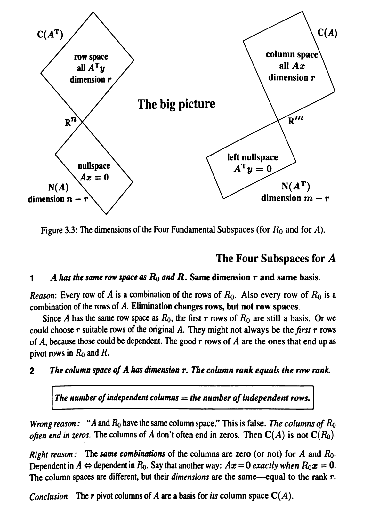

## 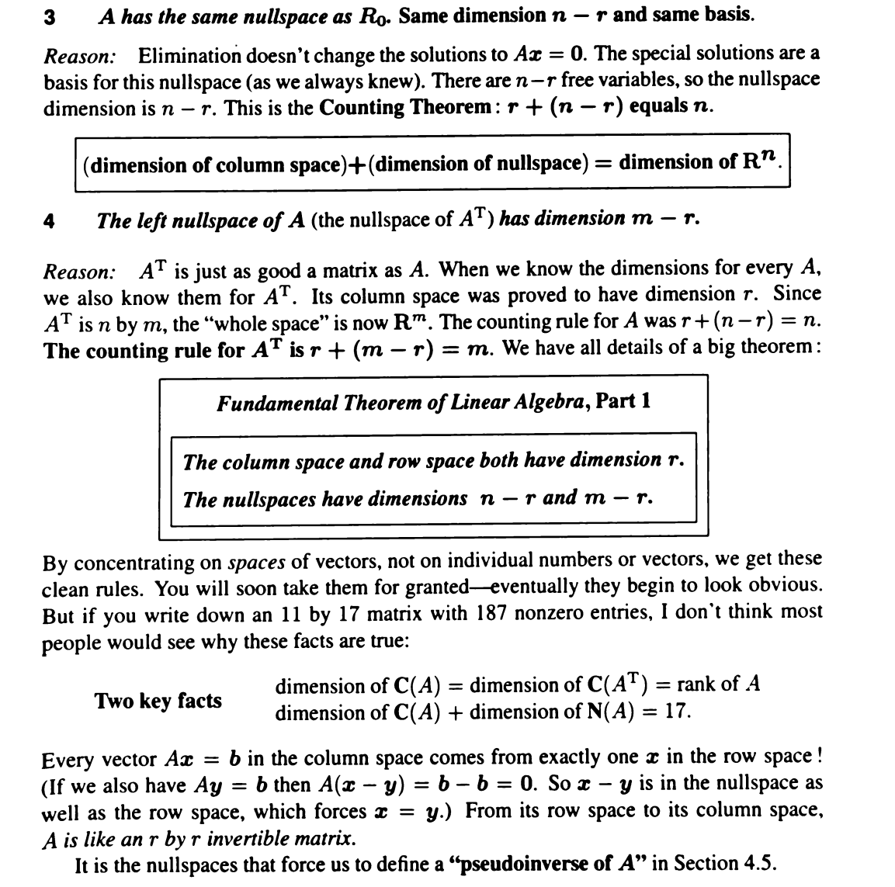
四大子空间的“大图景” & 基础定理（§ 3.5 收尾）
============================

* * *

1  Figure 3.3：四子空间在两个宿主空间中的排布
-----------------------------

```
        C(Aᵀ)  （行空间）   dim = r
          │
          │（正交）
          ▼
         Rⁿ
          ▲
          │（正交）
          │
        N(A)   （零空间）   dim = n−r
```

```
        C(A)   （列空间）   dim = r
          │
          │（正交）
          ▼
         Rᵐ
          ▲
          │（正交）
          │
        N(Aᵀ) （左零） dim = m−r
```

*   左图：行空间与零空间垂直地“填满”  $\mathbb R^{\,n}$ 。
*   右图：列空间与左零空间垂直地“填满”  $\mathbb R^{\,m}$ 。
*   **所有维数只由秩  $r$ ** 决定。

* * *

2  对原矩阵 A 的四条结论
---------------

| # | 结论 | 原因 & 提示 |
| --- | --- | --- |
| **1** | **行空间**  $\mathcal C(A^{\mathsf T})$  与  $R_0$  完全相同，维数  $r$ 。 | 行变换=行线性组合 → 不改变行空间；可从原 A 挑 r 条“好”行作基，即  $R_0$  的枢轴行。 |
| **2** | **列空间**  $\mathcal C(A)$  维数也为  $r$ （列秩=行秩）。 | 列之间的依赖/独立关系在 A 与  $R_0$  中保持一致；枢轴列（回到 A）给出一组基。 |
| **3** | **零空间**  $\mathcal N(A)$  维数  $n-r$ （和  $R_0$  相同）。 | 行消元不改方程  $Ax=0$  的解集；“计数定理”  $r+(n-r)=n$ 。 |
| **4** | **左零空间**  $\mathcal N(A^{\mathsf T})$  维数  $m-r$ 。 | 同理于  $A^{\mathsf T}$ 。计数定理  $r+(m-r)=m$ 。 |

> **基快速提取法**
> 
> *   行空间 →  $R_0$  非零行
> *   列空间 → 原 A 中的枢轴列
> *   零空间 → 自由变量生成的特殊解
> *   左零空间 →  $R_0^{\mathsf T}$  中零列对应的特殊解
>     

* * *

3  “线性代数基本定理（Part 1）” 精炼表达
--------------------------

1.  **行空间 = 列空间的维数 = 秩  $r$ **
2.  **两零空间维数**：
    *    $\dim N(A)=n-r$ 
    *    $\dim N(A^{\mathsf T})=m-r$ 
3.  **计数恒等式**
    $$
     \dim C(A) + \dim N(A) = n,\qquad \dim C(A^{\mathsf T}) + \dim N(A^{\mathsf T}) = m.
    $$

> 大型矩阵也遵循这些关系，哪怕元素多达数百——核心只在秩  $r$ 。

* * *

4  两条实用格言
---------

1.  **列空间维数 = 行空间维数 = 秩**
2.  **列空间维数 + 零空间维数 = 列数**  
    （行方向同理）


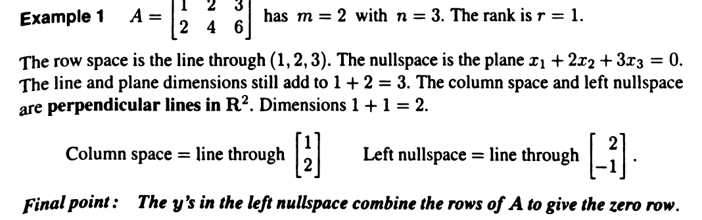

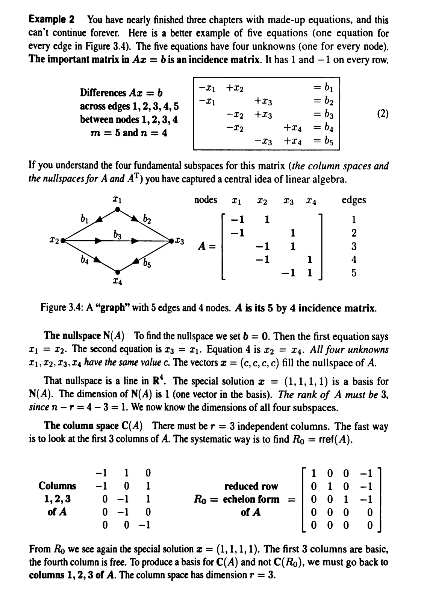

## 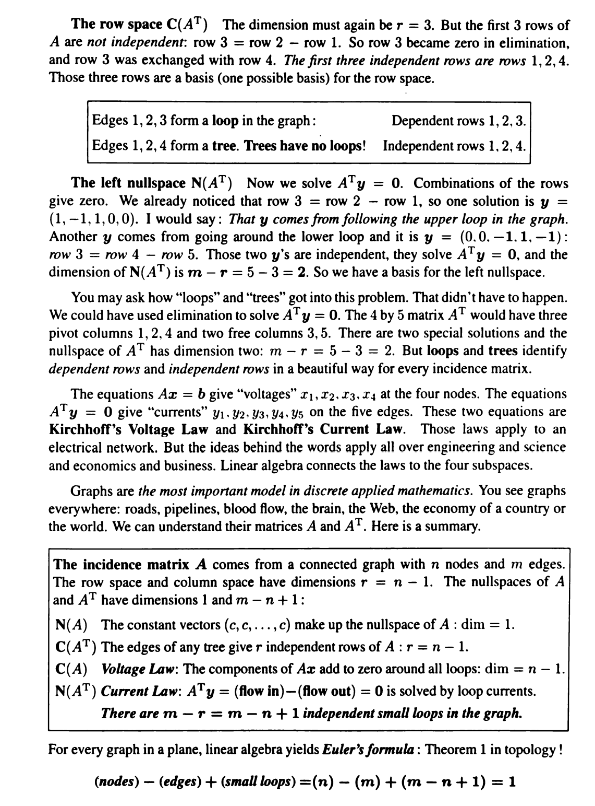
四大子空间的维数与图论示例
=============

（承接 §3.5，“Example 1 & Example 2 Incidence Matrix”）

* * *

例 1  $2\times3$  秩 1 矩阵的四子空间
----------------------------

$$
A=\begin{bmatrix}1&2&3\\2&4&6\end{bmatrix},\quad m=2,\;n=3,\;r=1
$$

| 子空间 | 几何描述 | 维数 | 基示例 |
| --- | --- | --- | --- |
| **行空间**  $\mathcal C(A^{\mathsf T})$  | 直线  $\operatorname{span}(1,2,3)$  于  $\mathbb R^3$  | 1 |  $(1,2,3)$  |
| **零空间**  $\mathcal N(A)$  | 平面  $x_1+2x_2+3x_3=0$  |  $n-r=2$  |  $\{(-2,1,0),(-3,0,1)\}$  |
| **列空间**  $\mathcal C(A)$  | 直线  $\operatorname{span}(1,2)^{\mathsf T}\subset\mathbb R^2$  | 1 |  $(1,2)^{\mathsf T}$  |
| **左零空间**  $\mathcal N(A^{\mathsf T})$  | 直线  $\operatorname{span}(2,-1)^{\mathsf T}\subset\mathbb R^2$  |  $m-r=1$  |  $(2,-1)^{\mathsf T}$  |

> **对偶关系**：  
> 行空间 ⊥ 零空间；列空间 ⊥ 左零空间，且各维数相加填满对应宿主空间（1+2=3，1+1=2）。  
> “左零向量  $y$ ” 的本质：它们是 **行的线性系数**，能把两行组合成 0（如  $2\cdot\text{row}_1-\text{row}_2=0$ ）。

* * *

例 2 图的“关联矩阵”  $A$ （5 条边，4 个节点）
------------------------------

### 2.1 矩阵与图

| 参数 | 数值 |
| --- | --- |
| 节点数  $n$  | 4 |
| 边数  $m$  | 5 |
| 秩  $r$  |  $n-1=3$ （图连通） |

$$
A=\begin{bmatrix} -1& 1& 0& 0\\ -1& 0& 1& 0\\ 0&-1& 1& 0\\ -1& 0& 0& 1\\ 0&-1& 0& 1 \end{bmatrix}\quad \text{（每行仅出现 \(\pm1\)，体现边‑节点关系）}
$$

### 2.2 零空间  $\mathcal N(A)$  — **电压定律 (KVL)**

*   方程  $Ax=0$  ⇒ 所有节点电势相等
*   特殊解  $(1,1,1,1)$  建立基 → 维数  $n-r=1$ 
*   几何：图中 **电势常数向量**（整图一片等电位）

### 2.3 列空间  $\mathcal C(A)$  — **电势差空间**

*   列空间维数  $r=3$ 。
*   可取前三列为基（经消元确认独立）。
*   物理图像：所有 **符合回路电压定律** 的边电压集合。

### 2.4 行空间  $\mathcal C(A^{\mathsf T})$  — **树边流**

*   依赖关系：行 3 = 行 2 − 行 1 → r=3。
*   任选独立行 1, 2, 4 为基（对应图中一棵树的 3 条边）。
*   “树”无环 ⇒ 行独立；“环” ⇒ 行依赖。

### 2.5 左零空间  $\mathcal N(A^{\mathsf T})$  — **环流 (KCL)**

*   求解  $A^{\mathsf T}y=0$  ⇒ 得到 **回路流**：
    $$
    y^{(1)}=(1,-1,1,0,0),\quad y^{(2)}=(0,0,-1,1,-1)
    $$
*   维数  $m-r=2$ ：独立环路数 = 边 – 节点 + 1。
*   对应 **基尔霍夫电流定律**：进入节点流量 = 离开节点流量。

### 2.6 汇总与拓扑联系

| 子空间 | 维数 | 图论含义 |
| --- | --- | --- |
|  $\mathcal N(A)$  | 1 | **常量电压**（节点同电势） |
|  $\mathcal C(A)$  | 3 | **电压方程** 满足回路和节点限制 |
|  $\mathcal C(A^{\mathsf T})$  | 3 | **树流**（无环独立边） |
|  $\mathcal N(A^{\mathsf T})$  | 2 | **环流**（独立回路数） |

> 最后方框总结（课件）与欧拉公式
> 
> $$
> \text{(节点)} - \text{(边)} + \text{(独立小环)} = 1
> $$
> 
> 完美对应维数恒等式
> 
> $$
> n - m + (m - n + 1) = 1 .
> $$

* * *

终点提示
----

*   行‑列对偶 & 零‑左零对偶统一于 **秩  $r$ **。
*   在图论里，四子空间交织着 **电压/电流、树/环** 的绝妙几何。
*   后续章节将利用这些子空间正交关系推导 **正交投影、最小二乘、伪逆** 等核心工具——敬请期待！

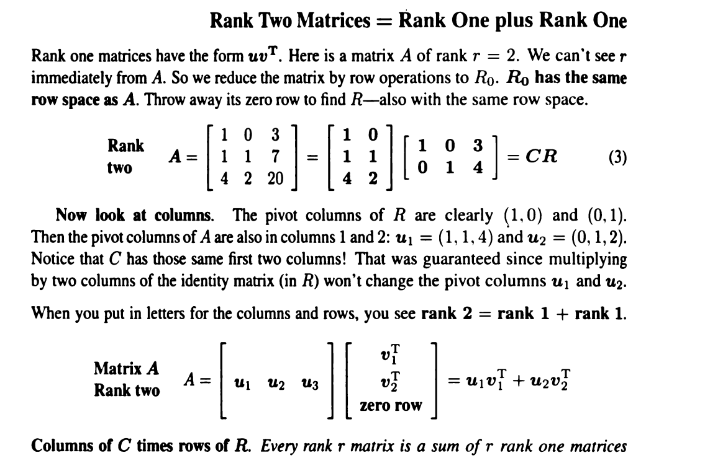

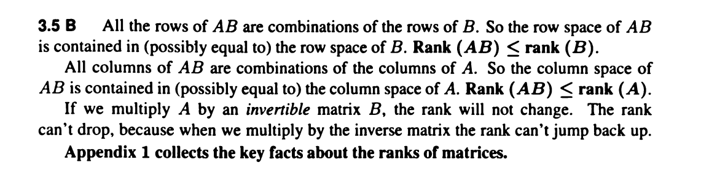


Rank 2 矩阵的结构与 3.5 节例题详解
-----------------------

* * *

### 一、Rank 2 矩阵 = Rank 1 矩阵 + Rank 1 矩阵

> **课件公式**
> 
> $$
> A = C R = \bigl[u_1\;u_2\bigr] \begin{bmatrix} v_1^{\mathsf T}\\ v_2^{\mathsf T}\\ 0 \end{bmatrix} = u_1v_1^{\mathsf T}\;+\;u_2v_2^{\mathsf T}.
> $$

*   **思路**
    1.  把  $A$  行消元到行最简  $R_0$ 。
    2.  去掉零行得  $R$ （仅 r 行）。
    3.  **枢轴列**  $u_1,u_2$  组成  $C$ ，**枢轴行**  $v_1^{\mathsf T},v_2^{\mathsf T}$  组成  $R$ 。
    4.  于是  $A=C R$  ⇒ Rank 2 矩阵拆成两块 Rank 1 之和。
*   **示例矩阵**
    $$
    A=\begin{bmatrix}1&0&3\\1&1&7\\4&2&20\end{bmatrix} \xrightarrow{\text{行消元}} R=\begin{bmatrix}1&0&3\\0&1&4\end{bmatrix}.
    $$
*   **基列**  $u_1=(1,1,4)^{\mathsf T}$ 、 $u_2=(0,1,2)^{\mathsf T}$   
    **基行**  $v_1^{\mathsf T}=(1,0,3)$ 、 $v_2^{\mathsf T}=(0,1,4)$ 

* * *

### 二、Worked Example **3.5 A**

> “在  $5 \times 6$  零矩阵里放 4 个 1，使行空间维数最小；再让列空间、零空间维数最小；最后讨论四子空间维数之和最小。”

| 目标 | 做法 | 最小维数 |
| --- | --- | --- |
| **行空间最小** | 四个 1 都放在同一行 **或** 同一列 |  $r=1$  ⇒ 行空间 1 |
| **列空间最小** | 同理 ⇒ 仍需  $r=1$  | 列空间 1 |
| **零空间最小** | 需使  $r$  尽量大（ $n-r$  越小）→ 把四个 1 放到 **4 行 + 4 列** 不同位置 ⇒  $r=4$  | 零空间  $6-4=2$  |
| **维数之和最小？** | 无论如何    $\;r+(n-r)+r+(m-r)=n+m=11$ 。总和不可降。 |  |

> **拓展：** 若把其余元素改为 2，秩不变（行/列仍重复）→ 结论相同。

* * *

### 三、Worked Example **3.5 B**

> **要点：矩阵乘积  $AB$  的秩不超过因子秩**

1.  **行空间**： $AB$  的行是  $B$  的行线性组合 ⇒
    $$
    \operatorname{rank}(AB)\le\operatorname{rank}(B).
    $$
2.  **列空间**： $AB$  的列是  $A$  的列线性组合 ⇒
    $$
    \operatorname{rank}(AB)\le\operatorname{rank}(A).
    $$
3.  **若右乘/左乘可逆矩阵**：秩不变（可逆矩阵不改变独立性）。

* * *

### 四、要点总结

1.  **Rank r = Rank 1 之和**
    *   通过  $A=C R$  分解，每列基 × 每行基 得到 r 个 rank 1 矩阵线性叠加。
    *   解释了低秩矩阵近似与奇异值分解思想的雏形。
2.  **放置稀疏 1 的秩控制**
    *   同行/同列 → 最低秩 1。
    *   不同行不同列 → 秩提升。
    *   四子空间维数和固定为  $n+m$ ，无法再降。
3.  **乘积秩界限**
    *    $\operatorname{rank}(AB)\le\min\{\operatorname{rank}(A),\operatorname{rank}(B)\}$ 。
    *   可逆矩阵左/右乘仅做基变换，不降低秩。

## 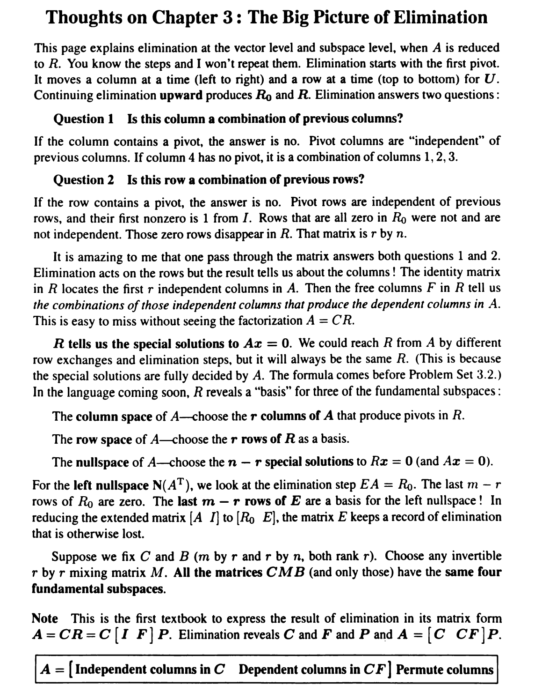
第 3 章总结笔记：消元的大图景 (The Big Picture of Elimination)
-------------------------------------------------

* * *

### 1  消元动作与“两个问题”

| 步骤 | 提出的问题 | 答案判定规则 |
| --- | --- | --- |
| 逐列向右 | **此列** 是否能由前面列组合？ | 若**出现枢轴** → 不能组合（独立列）；若无枢轴 → 是组合 |
| 逐行向下 | **此行** 是否能由前面行组合？ | 若**出现枢轴** → 不能组合（独立行）；若全零 → 可被组合，最终在  $R$  消失 |

> 一次高斯消元即可同时回答列与行的独立性；零行被删后得到  $R$ （r × n），行列秩全部显露。

* * *

### 2   $A\to R_0\to R$  背后的  $C R$  分解

1.  **行操作** →  $R_0$ ：同行空间，不改变列组合关系。
2.  **删除零行** →  $R$ ：r × n，上三角的  $I | F$  结构。
3.  **读出基与依赖**
    *   ** $I$ ** 所在 r 列 = **枢轴列** → 独立列 → 组装成  $C$ 。
    *   ** $F$ ** 给出 **依赖列表达式**。
4.  **矩阵分解**
    $$
    A = C R ,\qquad R=\bigl[I\;F\bigr]P
    $$
    ⇒ 任意 Rank r 矩阵 = r 个 Rank 1 矩阵之和（上一页 rank 2 = rank 1+rank 1 的来源）。

* * *

### 3   $R$  直接给出 3 个子空间的基

| 子空间 | 基的来源于  $R$  |
| --- | --- |
| **列空间**  $\mathcal C(A)$  | 原矩阵中对应枢轴的 r 列 |
| **行空间**  $\mathcal C(A^{\mathsf T})$  |  $R$  的 r 条非零行 |
| **零空间**  $\mathcal N(A)$  |  $[-\!F;I]$  的  $n-r$  列（special solutions） |

> **左零空间  $\mathcal N(A^{\mathsf T})$ **  
> 观察消元记录矩阵  $E$ ：若  $E A = R_0$ ，则  $E$  的最后  $m-r$  行正是左零空间的一组基。

* * *

### 4  四子空间维数与消元的内在联系

*   **行消元仅操作行**，却：
    *   揭示列独立性（枢轴列）。
    *   构造零空间基（自由列 → 特解）。
*   **维数公式**
    $$
     r+(n-r)=n,\qquad r+(m-r)=m.
    $$
    行列空间维数均  $r$ ，两个零空间维数补足各自维度。

* * *

### 5  同一四子空间，矩阵族  $C M B$ 

固定列基  $C$ （r × m）与行基  $B$ （n × r），任取可逆 r × r 矩阵  $M$ ：

$$
A = C M B
$$

全部 **拥有相同四个子空间**。

> 说明：在基列与基行之间做任何可逆线性组合都不改变行、列、零、左零空间。

* * *

### 6  实践口诀

1.  **列独立看枢轴**，行独立亦然。
2.  **列空间基**：枢轴列；**行空间基**：非零行。
3.  **零空间基**： $[-F;I]$ ，自由变量对应列。
4.  **左零空间基**：消元时记录矩阵  $E$  的末  $m-r$  行。

* * *

### 7  总结

> 通过一次消元，高斯算法把“向量级问题”与“子空间级问题”串成一条线：  
> **独立 ↔ 枢轴**  |  **组合关系 ↔ F**  |  **子空间基 ↔ R 的显式结构。**

这正是第 3 章的精髓。  
进入第 4 章，正交与投影将进一步利用这些基与维数，为最小二乘和伪逆奠基。
