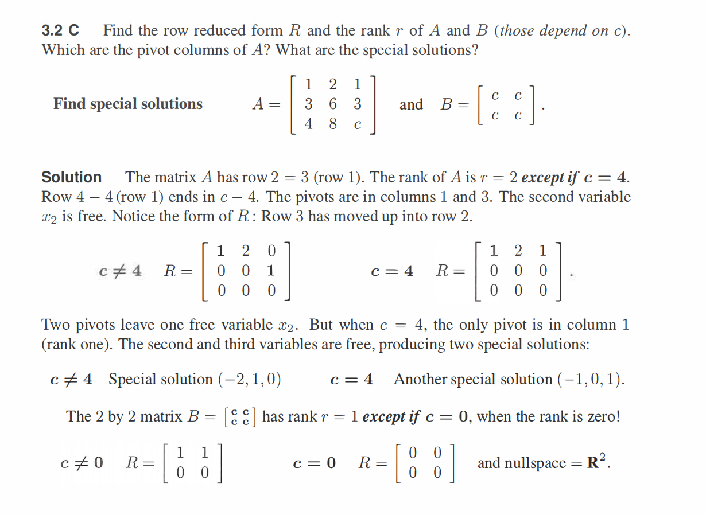

##  CHAPTER 3

3.1 向量的空间（Vector Spaces and Subspaces）
======================================

本节把“向量”从具体的数字列推广为更抽象的对象：它们可以是数列、矩阵、函数，甚至只包含一个零向量的空间。核心是**向量空间**与**子空间**两大概念，以及矩阵**列空间**与方程  $Ax=b$  的可解条件之间的联系。

* * *

一、从  $\mathbb{R}^n$  出发：什么是“空间”
-------------------------------

**定义（标准空间）**  
 $\mathbb{R}^n$  是所有 ** $n$  个实数** 组成的**列向量**的集合：

$$
\mathbf{v}=\begin{bmatrix}v_1\\ \vdots\\ v_n\end{bmatrix},\qquad v_i\in\mathbb{R}.
$$

若分量是复数，则记为  $\mathbb{C}^n$ 。

**几何直观**

*    $\mathbb{R}^1$ ：一条直线（如  $x$  轴）。
*    $\mathbb{R}^2$ ：平面中点  $(x,y)$ ；向量写作  $\mathbf{v}=(x,y)$  或列式  $\big[\!\begin{smallmatrix}x\\y\end{smallmatrix}\!\big]$ 。
*    $\mathbb{R}^3$ ：三维空间点  $(x,y,z)$ 。
*    $\mathbb{R}^5$  等高维无法画图，但计算规则完全相同；例如把每个分量都乘以 7 就得到  $7\mathbf{v}$ （“7”叫**标量**）。

**例子**

$$
\begin{bmatrix}4\\ \pi\end{bmatrix}\in\mathbb{R}^2,\quad (1,1,0,1,1)\in\mathbb{R}^5,\quad \begin{bmatrix}1+i\\1-i\end{bmatrix}\in\mathbb{C}^2.
$$

* * *

二、向量空间与“线性组合”
-------------

**线性组合（linear combination）**  
给定一个集合  $S$  内的向量  $\mathbf{v},\mathbf{w}$ ，以及任意标量  $c,d$ ，组合

$$
c\mathbf{v}+d\mathbf{w}
$$

称为线性组合。**关键词：“在空间内部”**——做完加法与数乘，结果仍在同一个空间里。

**向量空间（Vector Space）**  
一个**向量空间  $V$ ** 是一个集合（元素称“向量”）连同两种运算：

*   向量加法  $+$ ；
*   标量乘法（用实数或复数）；  
    并满足一组合理的代数规则（常合称为“八条公理”）。在本章的语境下默认标量域是  $\mathbb{R}$ 。

**常见的“八条”公理（两条闭包 + 六条代数律）**  
对任意  $\mathbf{u},\mathbf{v},\mathbf{w}\in V$ ，任意标量  $c,d\in\mathbb{R}$ ：

1.  **加法闭包**： $\mathbf{u}+\mathbf{v}\in V$ 。
2.  **数乘闭包**： $c\mathbf{v}\in V$ 。
3.  **交换律**： $\mathbf{u}+\mathbf{v}=\mathbf{v}+\mathbf{u}$ 。
4.  **结合律**： $(\mathbf{u}+\mathbf{v})+\mathbf{w}=\mathbf{u}+(\mathbf{v}+\mathbf{w})$ 。
5.  **零向量存在**： $\exists\,\mathbf{0}\in V$  使得  $\mathbf{v}+\mathbf{0}=\mathbf{v}$ （且唯一）。
6.  **加法逆元**： $\forall \mathbf{v}\,\exists (-\mathbf{v})$  使  $\mathbf{v}+(-\mathbf{v})=\mathbf{0}$ 。
7.  **分配律 1**： $c(\mathbf{u}+\mathbf{v})=c\mathbf{u}+c\mathbf{v}$ 。
8.  **分配/相容（合并表述）**： $(c+d)\mathbf{v}=c\mathbf{v}+d\mathbf{v}$  且  $c(d\mathbf{v})=(cd)\mathbf{v}$ ，并由此推出  $1\cdot\mathbf{v}=\mathbf{v}$ 。

> 图中提到的“交换律  $\mathbf{u}+\mathbf{v}=\mathbf{v}+\mathbf{u}$ ”“分配律  $c(\mathbf{v}+\mathbf{w})=c\mathbf{v}+c\mathbf{w}$ ”以及“唯一的零向量”就是这八条中的代表。

* * *

三、子空间（Subspace）
---------------

**定义**  
若  $W\subseteq \mathbb{R}^n$ （更一般地  $W\subseteq V$ ）且在继承的加法、数乘下本身是一个向量空间，则称  $W$  是  $\mathbb{R}^n$ （或  $V$ ）的**子空间**。

**快速判据（针对  $\mathbb{R}^n$  的最常用版本）**  
非空集合  $W$  为子空间当且仅当对任意  $\mathbf{u},\mathbf{v}\in W$  与标量  $c,d$  都有  $c\mathbf{u}+d\mathbf{v}\in W$ 。

> 这等价于“闭包于线性组合”。

**示例**

*   直线  $y=3x$  是  $\mathbb{R}^2$  的子空间（过原点、对线性组合同闭）。
*   直线  $y=3x+1$  **不是**子空间（不含原点，闭包失败）。

* * *

四、矩阵的列空间与  $Ax=b$ 
------------------

考虑  $m\times n$  矩阵  $A=[\mathbf{a}_1\,\mathbf{a}_2\,\cdots\,\mathbf{a}_n]$ （列向量在  $\mathbb{R}^m$ ）。

*   **列空间  $C(A)$ **：矩阵  $A$  的所有列向量的**一切线性组合**组成的集合：
    $$
    C(A)=\left\{\sum_{j=1}^n x_j\,\mathbf{a}_j \;:\; x_j\in\mathbb{R}\right\}\subseteq \mathbb{R}^m.
    $$
    它显然对加法与数乘封闭，因此是  $\mathbb{R}^m$  的子空间。
*   **把  $Ax$  看成列的组合**：若  $x=(x_1,\dots,x_n)^T$ ，则
    $$
    A x = x_1\mathbf{a}_1+\cdots+x_n\mathbf{a}_n \in C(A).
    $$
*   **可解条件**：线性方程  $Ax=b$  **有解  $\Leftrightarrow b\in C(A)$ **。  
    这句出现在图中的要点 ⑤–⑥：**列空间包含所有的  $Ax$ **，所以当且仅当  $b$  落在这个子空间里时，方程才可能解出。

> 进一步（后续章节会系统展开）：列空间的维数就是矩阵的**秩**；秩决定了方程组的可解性与解的结构。

* * *

五、 $\mathbb{R}^n$  之外：矩阵空间、函数空间与最小空间
------------------------------------

图中强调“**向量**可以不是列数列”。只要满足向量空间公理，它就可以被当作**向量**。常见例子：

### 1) 矩阵空间  $\mathbf{M}=\mathbb{R}^{2\times 2}$ 

元素是  $2\times 2$  实矩阵：

$$
\begin{bmatrix}a&b\\ c&d\end{bmatrix}.
$$
*   **加法/数乘**：按分量进行（与普通矩阵加法、标量乘一致）。
*   **零向量**：零矩阵  $\begin{bmatrix}0&0\\0&0\end{bmatrix}$ 。
*   **维数与基**：这是一个**四维**空间。常用标准基
    $$
    E_{11}=\!\begin{bmatrix}1&0\\0&0\end{bmatrix},\; E_{12}=\!\begin{bmatrix}0&1\\0&0\end{bmatrix},\; E_{21}=\!\begin{bmatrix}0&0\\1&0\end{bmatrix},\; E_{22}=\!\begin{bmatrix}0&0\\0&1\end{bmatrix}.
    $$
    任意矩阵可写为  $aE_{11}+bE_{12}+cE_{21}+dE_{22}$ 。
*   **图 3.1 的含义**：尽管我们画不出四维空间，但可以把  $\big[\!\begin{smallmatrix}a&b\\ c&d\end{smallmatrix}\!\big]$  看成四元坐标  $(a,b,c,d)$  沿着四个“基方向”伸展的结果。

### 2) 函数空间  $\mathbf{F}$ 

 $\mathbf{F}$  是所有实函数  $f(x)$  的集合。

*   **向量**：函数本身。
*   **加法/数乘**：点态定义  $(f+g)(x)=f(x)+g(x),\ (cf)(x)=c\,f(x)$ 。
*   **零函数**： $0(x)\equiv 0$ 。
*   **维数**：**无限维**。
*   **常见子空间**：多项式空间  $\mathbf{P}$  或次数  $\le n$  的  $\mathbf{P}_n=\{a_0+a_1x+\cdots+a_nx^n\}$ （其维数为  $n+1$ ）。

### 3) 只含零向量的空间  $\mathbf{Z}=\{ \mathbf{0} \}$ 

*   **性质**：任何空间里都有一个“零向量”，而  $\mathbf{Z}$  只包含这一个元素。
*   **维数**：定义为 **0 维**（最小可能的向量空间）。
*   **“每个空间有自己的零向量”**：零矩阵、零函数、 $(0,0,0)$  等分别是各自空间的“ $\mathbf{0}$ ”；符号相同，但对象不同。

* * *

六、把“计算列”升级为“计算空间”
-----------------

书页中提醒：对初学者，矩阵计算看起来是数字搬运；但更高一层的理解是：

*    $Ax$  的列是  $A$  的列向量的线性组合；
*    $AB$  的列同样是  $A$  的列向量的线性组合（系数来自  $B$  的列）；
*   **不理解“向量空间/子空间”，就不算真正理解  $Ax=b$ **。  
    因此，本章将视角从“列向量本身”上升到“由这些列张成的空间”。

* * *

七、要点逐条对照（对应图片开头 1–6）
--------------------

1.  ** $\mathbb{R}^n$ **：包含所有  $n$  维实列向量。
2.  **线性组合的封闭性**：若  $\mathbf{v},\mathbf{w}\in S$ ，则  $c\mathbf{v}+d\mathbf{w}\in S$ 。
3.  **向量的广义概念**：在不同空间里，“向量”可以是矩阵、函数等； $\mathbf{Z}$  只含  $0$ 。
4.  **子空间**：如  $\mathbb{R}^2$  中直线  $y=3x$ （过原点）。
5.  **列空间  $C(A)$ **：矩阵  $A$  的列的所有线性组合，乃  $\mathbb{R}^m$  的子空间。
6.  **可解性**： $Ax=b$  可解  $\Leftrightarrow b\in C(A)$ 。

* * *

八、易错点与快速检验
----------

*   **子空间一定过原点**：任何常数平移（如  $y=3x+1$ ）都不是子空间。
*   **“零向量唯一”但“因空间而异”**：不要把零矩阵与零函数混为同一对象。
*   **线性组合 vs. 线性无关/生成**：本节只讲“线性组合”“列空间”，不要提前混淆“线性无关、基、维数”的判定（这些在后续小节系统化）。
*   ** $\mathbb{C}^n$ **：若标量允许是复数，公理一样成立，但要明确标量域。

* * *

九、练一练（跟图中思想同步的小题）
-----------------

1.  证明  $C(A)$  是  $\mathbb{R}^m$  的子空间（用闭包于线性组合）。
2.  判断集合  $W=\{(x,y)\in\mathbb{R}^2: y=3x\}$  是否为子空间； $W'=\{(x,y): y=3x+1\}$  是否为子空间，并说明原因。
3.  在  $\mathbb{R}^{2\times2}$  中，把  $\big[\!\begin{smallmatrix}a&b\\ c&d\end{smallmatrix}\!\big]$  用基  $\{E_{11},E_{12},E_{21},E_{22}\}$  表示其“坐标向量”。
4.  设  $V=\mathbf{P}_3$ ，验证它的维数（提示：基  $\{1,x,x^2,x^3\}$ ）。

* * *

十、本节小结
------

*   “空间”是装向量的容器，**运算在空间内部闭合**。
*   **向量空间**由加法与数乘的八条规则刻画； $\mathbb{R}^n$  是标准例子，但矩阵、函数等也能构成向量空间。
*   **子空间**是空间里的空间；最小的向量空间是  $\mathbf{Z}=\{0\}$ （0 维）。
*   **列空间  $C(A)$ ** 把“矩阵乘向量”统一看成“列的线性组合”；这直接给出  $Ax=b$  的可解充要条件  $b\in C(A)$ 。
*   图 3.1 告诉我们： $\mathbb{R}^{2\times2}$  本质是一个**四维**空间，有自然的四个基方向。

## 

3.1-B 子空间（Subspaces）
====================

**概览**  
这一段把“空间里的子空间”讲清楚：在一个向量空间（如  $\mathbb{R}^n$ ）内部，只要一个集合对**向量加法**和**标量乘法**封闭，它本身就构成向量空间，称为**子空间**。典型如穿过原点的直线/平面、矩阵空间中的上三角矩阵集合、对角矩阵集合，以及只含零向量的最小空间等。并通过反例说明：**只取“部分”直线/平面**或**把两个象限并在一起**，都不是子空间。

* * *

1\. 直观图景：在大空间里嵌套的小空间
--------------------

以  $\mathbb{R}^3$  为“大”空间举例：

*   取一个**过原点**  $(0,0,0)$  的平面。这个平面内部加两向量仍在平面里；把平面内向量乘以任意标量仍在平面里。因此**这个平面本身就是一个向量空间**，只是它“坐落在”  $\mathbb{R}^3$  里。
*   注意：它**不是**  $\mathbb{R}^2$ （元素有三维分量，属于  $\mathbb{R}^3$ ）；准确说法是“与  $\mathbb{R}^2$  同构，但不是同一个集合”。

这个例子揭示了线代的核心思想：**在一个向量空间内部，还可以有很多“向量空间”——它们就是子空间**。

* * *

2\. 定义与一条“总规则”
--------------

**定义（子空间）**  
向量空间  $V$  的一个非空子集  $W\subseteq V$ ，若对  $V$  中继承的加法与数乘封闭，则称  $W$  为  $V$  的**子空间**。等价地，只需检查：

> **子空间判据**：若  $\mathbf{v},\mathbf{w}\in W$  且  $c,d$  为任意标量，则
> 
> $$
> c\,\mathbf{v}+d\,\mathbf{w}\in W .
> $$
> 
> （把加法与数乘合到一条“线性组合闭包”里。）

由此立即得到：

*   有了  $c\mathbf{v}+d\mathbf{w}$  的闭包，就有  $\mathbf{v}+\mathbf{w}$ （取  $c=d=1$ ）和  $-\mathbf{w}$ （取  $c=0,d=-1$ ），所以**减法**也在内。
*   **零向量必在其中**：取  $c=0$  得  $0\cdot\mathbf{v}=\mathbf{0}\in W$ 。于是**子空间必须穿过原点**。

* * *

3\.  $\mathbb{R}^3$  中子空间的“全家福”
-------------------------------

*   **(L)** 所有**过原点的直线**；
*   **(P)** 所有**过原点的平面**；
*   ** $\mathbb{R}^3$ ** 本身；
*   **(Z)** 只含零向量的空间  $\{(0,0,0)\}$ 。  
    这些都是子空间（无穷多条直线/无穷多个平面），共同满足线性组合闭包。

> 若“只取部分直线/平面”（例如去掉原点的一条直线，或只留在某个角区域的片段），就**破坏闭包**，不再是子空间。

* * *

4\. 反例：为什么“象限”不是子空间
-------------------

**例 1｜单象限**  
令  $W=\{(x,y)\in\mathbb{R}^2:\ x\ge0,\ y\ge0\}$ （第一象限及坐标轴）。

*   加法： $(2,3)+(1,1)=(3,4)\in W$  没问题；
*   但数乘：取标量  $c=-1$ ，有  $-1\cdot(2,3)=(-2,-3)\notin W$ 。  
    ⇒ 违反数乘闭包，**不是子空间**。

**例 2｜并上对角象限**  
再把“第三象限（两个分量都非正）”也纳入：

$$
W'=\{(x,y):x\ge0,y\ge0\}\ \cup\ \{(x,y):x\le0,y\le0\}.
$$
*   这次对任意实数  $c$ ， $c(x,y)\in W'$ （数乘闭包成立）；
*   但加法失败：取  $\mathbf{v}=(2,3)\in$  第一象限、 $\mathbf{w}=(-3,-2)\in$  第三象限，
    $$
    \mathbf{v}+\mathbf{w}=( -1, 1 ),
    $$
    既不在第一象限也不在第三象限。  
    ⇒ 违反加法闭包，**仍不是子空间**。  
    **结论**：“两个（或多个）象限的并”也不是子空间。一般地，**子空间对并运算并不封闭**。

> 小延伸：**交**倒是好的——任意子空间族的**交**仍是子空间（线性组合闭包在交上仍成立）。

* * *

5\. 线性运算“自动继承”的含义
-----------------

对子空间  $W\subseteq V$ ，一旦你验证了“线性组合闭包”，其余八条公理中的交换律、结合律、分配律等都由“母空间”  $V$  自动继承；你无需再逐条重证。  
因此，检验子空间的核心就是：**闭包于一切  $c\mathbf{v}+d\mathbf{w}$ **。

* * *

6\. 矩阵空间里的子空间（ $\mathbf{M}=\mathbb{R}^{2\times2}$ ）
---------------------------------------------------

把  $2\times2$  实矩阵当作“向量”， $\mathbf{M}$  是一个四维向量空间。课件给出三个典型子空间：

### (U) 上三角矩阵空间

$$
U=\left\{\begin{bmatrix}a&b\\0&d\end{bmatrix}:a,b,d\in\mathbb{R}\right\}.
$$
*   加法：两上三角相加仍上三角；
*   数乘：标量倍仍上三角；
*   含零矩阵。  
    ⇒  $U$  是子空间（维数为 3：自由参数  $a,b,d$ ）。

### (D) 对角矩阵空间（同时是  $U$  的子空间）

$$
D=\left\{\begin{bmatrix}a&0\\0&d\end{bmatrix}:a,d\in\mathbb{R}\right\}.
$$

同理可证是子空间（维数 2）。显然  $D\subset U\subset \mathbf{M}$ 。

###（一维）单位矩阵的数倍

$$
L=\{cI:c\in\mathbb{R}\},\qquad I=\begin{bmatrix}1&0\\0&1\end{bmatrix}.
$$
*    $2I+3I=5I\in L$ ；任意标量  $k\cdot (4I)=4k\,I\in L$ 。
*    $L$  是一条穿过零矩阵的“直线型”子空间（维数 1），并且  $L\subset D\subset U \subset \mathbf{M}$ 。

> 零矩阵  $\mathbf{0}$  同时属于这些所有空间；任何子空间都必须包含它。

* * *

7\. 规范清单与常见陷阱
-------------

**必须满足**

*   含 **零向量**；
*   对任意  $\mathbf{v},\mathbf{w}$  与标量  $c,d$ ： $c\mathbf{v}+d\mathbf{w}$  仍在内。

**常见错误**

*   “看起来像直线/平面”但**不含原点**（比如  $y=3x+1$ ）⇒ 不是子空间；
*   只取**一部分**直线/平面（删去原点、截出半边）⇒ 破坏闭包；
*   把两个区域**并**起来（如两个象限的并）⇒ 一般不封闭于加法。

* * *

8\. 本段小结
--------

*   子空间是“大空间”内部对**线性组合**封闭的集合；验证子空间的关键是一条判据：**若含  $\mathbf{v},\mathbf{w}$  则必含  $c\mathbf{v}+d\mathbf{w}$ **。
*    $\mathbb{R}^3$  里的子空间包括：过原点的直线、过原点的平面、整个  $\mathbb{R}^3$ 、以及零空间  $\mathbf{Z}$ 。
*   典型反例：象限、两个象限之并、任何不经过原点的“平移子集”。
*   在矩阵空间  $\mathbb{R}^{2\times2}$  里，上三角、对角、以及  $\{cI\}$  都是子空间，且  $ \{cI\}\subset D\subset U\subset\mathbf{M}$ 。

3.1-C 列空间  $C(A)$ ：由列向量张成的子空间与  $Ax=b$  的可解条件
=============================================

**概况**  
这一部分把“**列空间**”讲清楚：矩阵  $A$  的**列向量的所有线性组合**构成一个子空间，记作  $C(A)$ 。它位于  $\mathbb{R}^m$ （若  $A$  是  $m\times n$ ），而不是  $\mathbb{R}^n$ 。最重要的结论是：

$$
\boxed{\;Ax=b \text{ 可解 }\Longleftrightarrow b\in C(A)\;}
$$

也就是说，右端向量  $b$  必须落在由列向量“铺成”的那块子空间里。接着用二维/三维里的图像直观、以及  $2\times2$ 、 $2\times3$  的例子，演示  $C(A)$  可能是一条线、一张平面，或者就是整个  $\mathbb{R}^2$ 。

* * *

1\. 定义与基本性质
-----------

**定义（列空间）**  
设  $A=[\mathbf{a}_1\ \mathbf{a}_2\ \cdots\ \mathbf{a}_n]\in\mathbb{R}^{m\times n}$ 。

$$
C(A)\;=\;\big\{\,x_1\mathbf{a}_1+\cdots+x_n\mathbf{a}_n: x_1,\dots,x_n\in\mathbb{R}\,\big\} \;=\;\{\,A\mathbf{x}:\mathbf{x}\in\mathbb{R}^n\,\}.
$$

**它是一个向量空间**（子空间判据）：若  $\mathbf{u}=A\mathbf{x},\ \mathbf{v}=A\mathbf{y}\in C(A)$ ，任意标量  $c,d$ ，

$$
c\mathbf{u}+d\mathbf{v}=cA\mathbf{x}+dA\mathbf{y}=A(c\mathbf{x}+d\mathbf{y})\in C(A).
$$

所以对加法和数乘封闭，自然包含零向量（取  $\mathbf{x}=\mathbf{0}$ ）。

**“它住在  $\mathbb{R}^m$ ”**  
每一列  $\mathbf{a}_j$  都有  $m$  个分量，是  $\mathbb{R}^m$  的向量；因此  $C(A)\subseteq \mathbb{R}^m$ （而**不是**  $\mathbb{R}^n$ ）。

* * *

2\. 与  $Ax=b$  的可解条件（充要）
------------------------

**为什么“落在列空间里”就等价于可解？**

*   **若**  $Ax=b$  可解，则存在  $\mathbf{x}$  使  $b=A\mathbf{x}=x_1\mathbf{a}_1+\cdots+x_n\mathbf{a}_n$ ，显然  $b\in C(A)$ 。
*   **反之**，若  $b\in C(A)$ ，就存在  $x_1,\dots,x_n$  使  $b=\sum x_j\mathbf{a}_j=A\mathbf{x}$ ，于是  $Ax=b$  有解。  
     $\Rightarrow$  **可解当且仅当  $b\in C(A)$ **。图片中蓝框里的话正是这条结论的强调。

几何直观：在  $\mathbb{R}^3$  中，若  $A$  只有两列且线性无关，则  $C(A)$  是一张**过原点的平面**；只有当  $b$  落在这张平面上时，三元方程组  $Ax=b$  才有解。否则“右端超出了平面”，就无解。

* * *

3\. 例 4：两列张成一张平面
----------------

给定

$$
A=\begin{bmatrix}1&0\\[3pt]4&3\\[3pt]2&3\end{bmatrix},\qquad \mathbf{x}=\begin{bmatrix}x_1\\ x_2\end{bmatrix},\qquad A\mathbf{x}=x_1\!\begin{bmatrix}1\\4\\2\end{bmatrix}+x_2\!\begin{bmatrix}0\\3\\3\end{bmatrix}.
$$
*   这两列在  $\mathbb{R}^3$  线性无关，因此它们张成  $C(A)$ ——一张**过原点的平面**。
*   绝大多数  $b\in\mathbb{R}^3$  不在这张平面上，因而方程 **无解**。
*   图 3.2 中的“Plane =  $C(A)$ ”正是这张平面；标注的两个柱状向量就是两列。
*   文中空格“ $Ax=0$  的一个总能取到的解是  $x=\underline{\ \ }$ ”应填 ** $x=\mathbf{0}$ **（平凡解）。

> 小提示：两列  $\Rightarrow$  最多张成二维对象（直线或平面）。若两列又恰好相关（如一列是另一列的倍数），那  $C(A)$  就只是**一条直线**。

* * *

4\. 记号与“张成（span）”
-----------------

*   记号：列空间写作  $C(A)$ 。
*   更一般的**张成**：对  $V$  中任意向量集合  $S=\{\mathbf{v}_1,\dots,\mathbf{v}_N\}$ ，定义
    $$
    \operatorname{span}(S)=\Big\{\sum_{i=1}^N c_i\mathbf{v}_i:\ c_i\in\mathbb{R}\Big\}.
    $$
    这是  $V$  的一个子空间，也叫“由  $S$  张成的子空间”。它是**包含  $S$  的最小子空间**。  
    当  $S$  是  $A$  的列集合时， $\operatorname{span}(S)=C(A)$ 。只有一个非零向量  $v$  时， $\operatorname{span}\{v\}$  就是过原点的**直线**。

* * *

5\. 例 5：描述三个矩阵的列空间（都在  $\mathbb{R}^2$ ）
---------------------------------------

$$
I=\begin{bmatrix}1&0\\[2pt]0&1\end{bmatrix},\qquad A=\begin{bmatrix}1&2\\[2pt]2&4\end{bmatrix},\qquad B=\begin{bmatrix}1&2&3\\[2pt]0&0&4\end{bmatrix}.
$$

### (1)  $C(I)=\mathbb{R}^2$ 

两列  $(1,0)^T,(0,1)^T$  线性无关，能组合得到任意  $(b_1,b_2)^T$ 。因此  $Ax=b$  对任意  $b$  都可解（实际上解唯一）。

### (2)  $C(A)$  是一条直线

第二列是第一列的 2 倍：  $\,(2,4)^T=2(1,2)^T$ 。  
所以  $C(A)=\{(c,2c)^T:c\in\mathbb{R}\}$ ，只是  $\mathbb{R}^2$  中**过原点的一条直线**。  
结论： $A\mathbf{x}=b$  只有当  $b$  落在这条直线上才可解；否则无解。

> 这反映了“秩”的影子：这里秩为 1，因而列空间是一维的直线。

### (3)  $C(B)=\mathbb{R}^2$ 

三列分别是  $\mathbf{b}_1=(1,0)^T$ 、 $\mathbf{b}_2=(2,0)^T=2\mathbf{b}_1$ 、 $\mathbf{b}_3=(3,4)^T$ 。  
虽然  $\mathbf{b}_2$  冗余，但  $\{\mathbf{b}_1,\mathbf{b}_3\}$  线性无关，已能张成整个  $\mathbb{R}^2$ ：

*   给任意  $b=(b_1,b_2)^T$ ，先取  $x_3=b_2/4$  使第二分量匹配；
*   再令  $x_1$  和/或  $x_2$  满足  $x_1+2x_2+3x_3=b_1$  即可（有多种选法）。  
    例如文中给的  $b=(5,4)^T$ ：
    
$$
(5,4)=1\cdot\mathbf{b}_2+1\cdot\mathbf{b}_3\quad\Rightarrow\quad x=(0,1,1),
$$

也可以

$$
(5,4)=2\cdot\mathbf{b}_1+1\cdot\mathbf{b}_3\quad\Rightarrow\quad x=(2,0,1).
$$

因此  $C(B)=\mathbb{R}^2$ 。相较  $I$ ，这里“列更多”带来的是“**同一个  $b$ ** 可能有**更多组合/更多解**”。

* * *

6\. 维度直觉（提前小结）
--------------

*    $C(A)$  的维数 = **秩**  $\operatorname{rank}(A)$ （将在后续章节严格给出）。
*    $\operatorname{rank}(A)\le \min\{m,n\}$ 。
*   “两列最多张成平面；若相关，只是一条线。”——这就是例 4 与例 5(2) 的几何本质。

* * *

7\. 常见误区与检查清单
-------------

*   **把  $C(A)$  错放到  $\mathbb{R}^n$ **：记住它属于  $\mathbb{R}^m$ 。
*   **忽略“过原点”**：列空间一定包含  $\mathbf{0}$ ，所以是穿过原点的子空间。
*   **以为“列越多一定就更大”**：列相关就不会更大（例 5 中  $B$  的第二列冗余）。
*   **把“可解”理解为“总有解”**：只有当  $b$  在  $C(A)$  里才有解，否则无解。
*   **把“张成（span）”与“并集”混淆**： $\operatorname{span}(S)$  是**线性组合**的集合，不是把向量摆在一起的“并”。

**快速检查  $b\in C(A)$  的思路**（稍超前，利于实践）：对增广矩阵  $[A\mid b]$  做消元，若与  $A$  同样的行空间秩，则  $b\in C(A)$ （等价“增广不产生矛盾行”）。

* * *

8\. 小练习（与本页完全对齐）
----------------

1.  设  $A=\begin{bmatrix}1&2\\2&4\\3&6\end{bmatrix}$ 。描述  $C(A)$ ，并判断  $b=(3,6,9)^T$  与  $b'=(1,0,0)^T$  是否在  $C(A)$ 。
2.  在例 4 的矩阵  $A$  中，求出一组  $x_1,x_2$ ，使得  $b=(1,4,2)^T$  与  $b'=(0,3,3)^T$  分别写成列的线性组合（提示：其实就是取标准基组合： $(1,0)$ 、 $(0,1)$ ）。
3.  对  $B=\big[\,(1,0)^T\ (2,0)^T\ (3,4)^T\,\big]$ ，给出任意  $b=(b_1,b_2)^T$  的一个显式解  $\mathbf{x}$  公式。

* * *

9\. 本段总结
--------

*   **列空间  $C(A)=\operatorname{span}\{\text{列}\}\subseteq\mathbb{R}^m$ **；
*   ** $Ax=b$  可解  $\Leftrightarrow b\in C(A)$ **；
*   两列在  $\mathbb{R}^3$  最多给出一张平面；列相关会把维数降为直线；也可能张成整个空间；
*   “**span**/张成”是创建子空间的基本方式，它给出**包含给定集合的最小子空间**。

## 

3.1-D 关键思想回顾 + 例题精讲（列空间与“由谁张成”）
===============================

本段对应课件“REVIEW OF THE KEY IDEAS”和“WORKED EXAMPLES”，把 3.1 小节的结论压缩成要点，并用两个例题让你会做会用：如何“造”一个矩阵，让某些右端  $b$  可解而另一些不可解；以及如何把一个向量空间既写成“**若干向量的所有线性组合**”，也写成“**某些线性方程（或条件）的全部解集**”。

* * *

一、关键思想回顾（逐条解释）
--------------

1.  ** $\mathbb{R}^n$ ** 装的是所有  $n$  维**实**列向量。  
    这是一切线性代数对象的“母体”示例。
2.  **矩阵空间  $M$ **（例如所有  $2\times2$  实矩阵）、**函数空间  $F$ **（所有实函数）、以及只含零向量的空间 ** $Z=\{0\}$ ** 都是向量空间。  
    这强调“向量”的抽象性：可以是矩阵、函数等，只要满足向量空间公理。
3.  **子空间判据**：若一个集合包含  $\mathbf{v},\mathbf{w}$ ，就必须包含所有线性组合  $c\mathbf{v}+d\mathbf{w}$ （任意标量  $c,d$ ）。  
    这条“一句话判据”把“加法闭包 + 数乘闭包”合在一起。它立即推出：子空间一定包含零向量，且必须过原点。
4.  **列空间  $C(A)$ **：由矩阵  $A$  的列向量**所有线性组合**构成，是  $\mathbb{R}^m$  的子空间（ $A\in\mathbb{R}^{m\times n}$ ）。  
    也可写成  $C(A)=\{A\mathbf{x}:\mathbf{x}\in\mathbb{R}^n\}$ 。列“张成（span）”列空间。
5.  **可解充要条件**：
    $$
    Ax=b\ \text{可解}\quad\Longleftrightarrow\quad b\in C(A).
    $$
    几何上， $b$  必须落在“由列铺成”的那块子空间里（直线/平面/整个空间）。

* * *

二、例题 3.1A：给定  $b_1,b_2,b_3$ ，构造  $A$ ，使  $Ax=b_1$  与  $Ax=b_2$  可解而  $Ax=b_3$  **不可解**
--------------------------------------------------------------------------------------

### 思路

*   想要  $Ax=b_1$  与  $Ax=b_2$  可解 ⇒ **把  $b_1,b_2$  放进列空间**，最直接：令
    $$
    A=[\,b_1\ \ b_2\,].
    $$
    这时  $Ax=b_1$  的一个解是  $x=(1,0)$ ， $Ax=b_2$  的一个解是  $x=(0,1)$ 。
*   还想让  $Ax=b_3$  **不可解** ⇒ 要求  $b_3\notin C(A)=\operatorname{span}\{b_1,b_2\}$ 。

> **可行性的判据**：若  $b_3$  **恰好**是  $b_1,b_2$  的线性组合，那无论你如何取  $A$ （只要列空间包含  $b_1,b_2$ ）， $b_3$  都会自动落入列空间，导致  $Ax=b_3$  也可解——**此时题目要求不可能实现**。

### 操作步骤（通用做法）

1.  先检验是否存在  $\alpha,\beta$  使  $b_3=\alpha b_1+\beta b_2$ 。
    *   若**存在** ⇒ 不可能按题意构造。
    *   若**不存在** ⇒ 取  $A=[\,b_1\ \ b_2\,]$  即可满足要求（也可在此基础上加“冗余列”，但要确保新列不会把  $b_3$  拉入列空间，最安全是**只用**这两列）。
2.  实际检验方法：把  $[\,b_1\ b_2\mid b_3\,]$  做行消元；若  $b_3$  是前两列的线性组合，则增广列不增秩；否则就不在列空间里。

> 小结：**“造  $A$ ”=“造列空间”**。想让谁可解，就把它放进列空间；想让谁不可解，就把它排除在列空间之外。

* * *

三、例题 3.1B：把给定的向量空间  $V$  各自用“两种方式”描述，并各取一个子空间  $S$  与其子空间  $SS$ 
----------------------------------------------------------------

> 题意：对每个  $V$ ，既要给出“**所有线性组合**”式的描述（span），也要给出“**所有满足某些方程**的解集”式的描述（solution set）。再从中挑一个子空间  $S$ ，并在  $S$  里再挑一个更小的子空间  $SS$ 。

###  $V_1$ ：由三向量在  $\mathbb{R}^4$  中生成

给定三向量

$$
(1,1,0,0),\quad (1,1,1,0),\quad (1,1,1,1).
$$
*   **线性组合式**：
    $$
    V_1=\operatorname{span}\{(1,1,0,0),(1,1,1,0),(1,1,1,1)\}.
    $$
    任取系数  $\alpha,\beta,\gamma$ ，组合为
    $$
    (\alpha+\beta+\gamma,\ \alpha+\beta+\gamma,\ \beta+\gamma,\ \gamma).
    $$
    可见所有向量都满足**前两分量相等**。
*   **方程解集式**：
    $$
    V_1=\{(x_1,x_2,x_3,x_4)\in\mathbb{R}^4:\ x_1-x_2=0\}.
    $$
*   **一个子空间  $S$ **：例如去掉第三个向量，
    $$
    S=\operatorname{span}\{(1,1,0,0),(1,1,1,0)\}=\{(a,a,b,0):a,b\in\mathbb{R}\}.
    $$
*   ** $S$  的子空间  $SS$ **：例如只取第一向量的倍数
    $$
    SS=\operatorname{span}\{(1,1,0,0)\}=\{(c,c,0,0)\}.
    $$
    （当然，最小的选择也可以是  $SS=Z=\{0\}$ 。）

###  $V_2$ ：与  $u=(1,2,1,1)$  正交的所有向量（ $\mathbb{R}^4$ ）

*   **方程解集式**（定义本身）：
    $$
    V_2=\{v\in\mathbb{R}^4:\ u\cdot v=1\cdot v_1+2v_2+v_3+v_4=0\}.
    $$
*   **线性组合式**（给出一组基）  
    令自由变量  $s,t,r$ ，取
    $$
    v=(-2s-t-r,\ s,\ t,\ r)= s\,(-2,1,0,0)+t\,(-1,0,1,0)+r\,(-1,0,0,1).
    $$
    故
    $$
    V_2=\operatorname{span}\{(-2,1,0,0),\ (-1,0,1,0),\ (-1,0,0,1)\}.
    $$
*   **一个子空间  $S$ **：任选其中一条线，
    $$
    S=\operatorname{span}\{(-2,1,0,0)\}.
    $$
*   ** $S$  的子空间  $SS$ **：取零子空间  $SS=Z$  或同一条线的更小子空间（仍是这条线或  $\{0\}$ ）。

###  $V_3$ ：所有对称  $2\times2$  矩阵（ $M$  的子空间）

*   写矩阵为  $\begin{bmatrix}a&b\\ c&d\end{bmatrix}$ 。对称条件是 ** $b=c$ **。
*   **方程解集式**：
    $$
    V_3=\left\{\begin{bmatrix}a&b\\ c&d\end{bmatrix}: c-b=0\right\}.
    $$
*   **线性组合式**（自然基）：
    $$
    V_3=\operatorname{span}\Big\{ \underbrace{\begin{bmatrix}1&0\\0&0\end{bmatrix}}_{E_{11}}, \underbrace{\begin{bmatrix}0&1\\1&0\end{bmatrix}}_{E_{12}+E_{21}}, \underbrace{\begin{bmatrix}0&0\\0&1\end{bmatrix}}_{E_{22}} \Big\}.
    $$
    （维数 3）
*   **一个子空间  $S$ **：对角矩阵空间
    $$
    S=\left\{\begin{bmatrix}a&0\\0&d\end{bmatrix}\right\}=\operatorname{span}\{E_{11},E_{22}\}.
    $$
*   ** $S$  的子空间  $SS$ **：单位矩阵的数倍
    $$
    SS=\{cI\}=\operatorname{span}\{E_{11}+E_{22}\}.
    $$

###  $V_4$ ：所有满足四阶常微分方程  $y^{(4)}(x)=0$  的函数（ $F$  的子空间）

*   **方程解集式**： $V_4=\{y:\ y^{(4)}=0\}$ 。  
    一次积分得到一般解是**三次多项式**
    $$
    y(x)=a+bx+cx^2+dx^3.
    $$
*   **线性组合式**：
    $$
    V_4=\operatorname{span}\{1,\ x,\ x^2,\ x^3\}.
    $$
*   **一个子空间  $S$ **：例如二次多项式
    $$
    S=\operatorname{span}\{1, x, x^2\}.
    $$
*   ** $S$  的子空间  $SS$ **：例如一次多项式
    $$
    SS=\operatorname{span}\{1, x\}.
    $$

> 观察：每个  $V$  都可以在“span 角度”和“解集角度”之间互相翻译。这正是“**由谁张成**”与“**满足什么线性条件**”的等价性。

* * *

四、与前文衔接的小结
----------

*   **列空间 = 由列张成的子空间**，位于  $\mathbb{R}^m$ 。
*   **可解性**就是“右端  $b$  属不属于列空间”。
*   **构造矩阵 = 构造列空间**：题 3.1A 的方法就是把需要可解的  $b$  放进列空间，把需要不可解的  $b$  排除在外。
*   **两种描述方式**（span vs. 解集）能相互转写：
    *   span 给出“生成元/基/维数”的视角；
    *   解集体现为“满足若干线性方程/约束”的视角（典型如正交条件、对称条件、微分算子为零）。

## 

3.2 零空间  $N(A)$ ：求解  $Ax=0$  与  $Rx=0$ 
=======================================

**概况**  
本节研究“所有满足  $Ax=0$  的向量”构成的**零空间（nullspace）**。它是  $\mathbb{R}^n$  的一个子空间（注意列空间在  $\mathbb{R}^m$  里，而零空间在  $\mathbb{R}^n$  里）。用消元把  $A$  化到行最简阶梯形  $R$  后，**零空间不变**，且能直接读出**主元列（pivot）**与**自由列（free）**。每一个自由列对应一个**特殊解（special solution）**，所有特殊解的线性组合正好给出  $N(A)$ 。

* * *

一、六条核心结论（逐条解释）
--------------

1.  **定义**：
    $$
    N(A)=\{x\in\mathbb{R}^n:Ax=0\} .
    $$
    它包含  $x=0$ ，并且对加法与数乘封闭 ⇒ 是  $\mathbb{R}^n$  的子空间。
2.  **消元不改变零空间**：  
    设  $U$  是  $A$  的行阶梯形、 $R=\operatorname{rref}(A)$  是行最简阶梯形，则
    $$
    N(A)=N(U)=N(R).
    $$
    直观理由：初等行变换等价于左乘一个可逆矩阵  $E$ 。若  $EAx=0$ ，因  $E$  可逆，等价于  $Ax=0$ 。
3.  **行最简阶梯形  $R$  的结构**：  
    每个主元为 1，且主元上下全为 0。把含主元的列叫**主元列**，没有主元的叫**自由列**。
4.  **自由列对应“特殊解”**：  
    若第  $j$  列无主元，就能构造一个解  $x^{(j)}$  使得  $x_j=1$ 、所有其他自由变量  $=0$ ，再用  $Rx=0$  回代求出主元变量。这得到一个**特殊解向量**。
5.  **主元个数即秩**：  
     $\#\mathrm{pivots}=\operatorname{rank}(A)=r$ 。自由列个数是  $n-r$ 。
6.  **当  $m<n$  时必有非常解**：  
    因为  $r\le m<n\Rightarrow n-r>0$ ，至少有一个自由变量 ⇒  $Ax=0$  有非零解。

> 由 5) 可立刻看出：**零空间的维数**（称为**零度**，nullity）就是自由变量个数  $n-r$ 。（书里稍后会以“秩–零度定理”正式给出，我们在此先用作工作结论。）

* * *

二、从  $A$  到  $R$ ：求零空间的算法
-------------------------

把  $A\in\mathbb{R}^{m\times n}$  化为  $R=\operatorname{rref}(A)$ 。记主元列指标为  $p_1,\ldots,p_r$ ，自由列集合为  $F$ 。

1.  **列出未知量的划分**：
    $$
    x=\begin{bmatrix}x_P\\ x_F\end{bmatrix},\qquad R=\big[\,I_r\ \ \;F^\ast\,\big],
    $$
    其中  $I_r$  在主元列上， $F^\ast$  是最简形右边自由列对应的系数。
2.  **写出方程  $Rx=0$ **：
    $$
    I_r\,x_P + F^\ast x_F=0\quad\Rightarrow\quad x_P=-F^\ast x_F.
    $$
3.  **逐个自由变量构造特殊解**：  
    对每个  $j\in F$ ，令  $x_j=1$ ，其余自由变量为 0，按上式求  $x_P$ ，得到  $x^{(j)}$ 。
4.  **零空间的“生成”**：
    $$
    N(A)=\operatorname{span}\{\,x^{(j)}: j\in F\,\}.
    $$
    特殊解的个数  $=|F|=n-r$ ，它们构成  $N(A)$  的一组基（可能需再做一次线性无关性检查，但在 rref 的构造下它们天然线性无关）。

* * *

三、几何直观
------

*    $C(A)\subseteq\mathbb{R}^m$ （“左边世界”），而  $N(A)\subseteq\mathbb{R}^n$ （“右边世界”）。
*    $N(A)$  是过原点的一条线/一张平面/更高维子空间；维数  $=n-r$ 。
*   一行矩阵  $A=[a_1\ \cdots\ a_n]$  时， $Ax=0$  就是  $a\cdot x=0$ ，因此  $N(A)$  是**与行向量正交**的超平面。

* * *

四、例 1： $A=\begin{bmatrix}1&2\\3&6\end{bmatrix}$  的零空间
-----------------------------------------------------

**消元**：

$$
\begin{cases} x_1+2x_2=0,\\ 3x_1+6x_2=0 \quad(\text{上式的 }3\times). \end{cases}
$$

等价于一条方程  $x_1+2x_2=0$ 。

*   **自由变量**： $x_2$  自由；令  $x_2=1$ 。
*   **回代**： $x_1=-2$ 。
*   **特殊解**：   $\;s=\begin{bmatrix}-2\\ 1\end{bmatrix}$ 。
*   **零空间**：
    $$
    N(A)=\operatorname{span}\!\left\{\!\begin{bmatrix}-2\\1\end{bmatrix}\!\right\} =\left\{\,t\!\begin{bmatrix}-2\\1\end{bmatrix}:t\in\mathbb{R}\right\}.
    $$
*   **维数检查**： $r=1$ （一个主元）， $n=2\Rightarrow n-r=1$ （一维直线）。

> 课件框中“Special solution”小盒子正是这条：**取自由变量  $x_2=1$ ** 得到特殊解  $s=(-2,1)$ 。

* * *

五、例 2：一行三列  $A=[\,1\ 2\ 3\,]$ 
------------------------------

方程  $Ax=0$  即  $x+2y+3z=0$ 。

*   **自由变量**：两项自由，可取  $y,z$  自由。
*   **两个特殊解**：
    *   取  $y=1,z=0\Rightarrow x=-2$ ，得  $s_1=(-2,1,0)^T$ ；
    *   取  $y=0,z=1\Rightarrow x=-3$ ，得  $s_2=(-3,0,1)^T$ 。
*   **零空间**：
    $$
    N(A)=\operatorname{span}\{s_1,s_2\} =\left\{\,\alpha\!\begin{bmatrix}-2\\1\\0\end{bmatrix} +\beta\!\begin{bmatrix}-3\\0\\1\end{bmatrix}:\alpha,\beta\in\mathbb{R}\right\}.
    $$
    这是一张通过原点的**平面**，且与行向量  $(1,2,3)$  正交。
*   **维数**：主元数  $r=1$ ， $n=3\Rightarrow n-r=2$ （二维平面）。

> 课件说明：“解  $x+2y+3z=6$  也在一张平面上，但那不是子空间（不含原点）。”这与后面将要讲的结论一致：  
> ** $Ax=b$  的全体解 = 某个特解  $x_p$  + 零空间  $N(A)$ **（一个**仿射平移**）。

* * *

六、与秩、自由度、最小形的关系（实操要点）
---------------------

*   在  $R=\operatorname{rref}(A)$  中，行数为  $m$ 、列数为  $n$ 、主元数为  $r$ 。
*   **主元列**决定“受约束”的变量；**非主元列**就是“自由变量”。
*   **特殊解的个数 = 自由变量个数  $n-r$ **；每个自由变量给出一个特殊解。
*   若  $m<n$ ，必有自由变量 ⇒ 必有非常解（除零解外）。
*   若  $r=n$ （满列秩），则**只有零解**。

* * *

七、常见错点与快检
---------

*   把  $N(A)$  写到  $\mathbb{R}^m$  里（错）：零空间在  $\mathbb{R}^n$ 。
*   忘记“特殊解一一对应自由列”：自由列多给多条，缺一不可。
*   用  $U$ （非最简）读系数出错： $U$  也行，但往往要回代；用  $R$  最安全，主元上下 0 最清爽。
*   误把  $Ax=b$  的解集当子空间：仅  $b=0$  时（即零空间）才是子空间； $b\neq0$  时是仿射集合。
*   忽略“秩–零度”关系：计算主元数时马上能得出自由变量个数与维数。

* * *

八、小练习（与本页知识点对齐）
---------------

1.   $A=\begin{bmatrix}1&1&0\\0&1&1\end{bmatrix}$ 。求  $\operatorname{rref}(A)$ ，标出主元/自由列，写出所有特殊解并给出  $N(A)$  的一组基与维数。
2.  给定一行矩阵  $A=[a_1\ a_2\ a_3\ a_4]$  且不全为 0。证明  $N(A)$  是  $\mathbb{R}^4$  中与  $A$  正交的三维超平面。
3.  设  $A$  为  $4\times5$  且  $\operatorname{rank}(A)=3$ 。无需计算，说明：
    *   自由变量个数；
    *   特殊解条数；
    *    $N(A)$  的维数。

* * *

本节小结
----

*   **零空间  $N(A)$ ** = 全部解  $Ax=0$  的集合，位于  $\mathbb{R}^n$ ，是子空间。
*   **消元与最简形不改变零空间**： $N(A)=N(U)=N(R)$ 。
*   **算法**：在  $R$  中识别主元/自由列，给每个自由列造一个**特殊解**；这些特殊解**张成**零空间。
*   **数量关系**：主元数  $r=\operatorname{rank}(A)$ ，自由变量数  $n-r$ \=零空间维数（零度）。当  $m<n$  必有非常解。
*   **几何**：零空间是过原点的线/面/超平面；而  $Ax=b$ （ $b\ne0$ ）的解是“某个特解 + 零空间”的平移。

##  

3.2-A 主元列与自由列、行最简形与“特殊解”：零空间的完整求法
=================================

**概况**  
本组页面把 3.2 的核心落到实处：怎样通过**主元列（pivot columns）与自由列（free columns）**定位未知量的依赖/自由；怎样把矩阵化到**行最简阶梯形  $R=\mathrm{rref}(A)$ **；以及如何为每个自由变量构造一条**特殊解（special solution）**，使这些特殊解的**线性组合**恰好张成零空间  $N(A)=\{x:Ax=0\}$ 。另外配合例题展示“**加行**不改变零空间、**加列**会引入自由变量从而扩张零空间”的现象，并给出一个  $4\times7$  的  $R$  来练习“列空间属于  $\mathbb{R}^4$ 、零空间属于  $\mathbb{R}^7$ ”的左右两界。

* * *

一、主元列 vs 自由列（概念与位置）
-------------------

*   把  $A$  经消元变为上三角  $U$ ，再继续变到**行最简形**  $R$ 。
*   **主元（pivot）**：每行第一个非零元（在  $R$  中标准化为 1，且其列上下全零）。含主元的列称**主元列**；没有主元的列称**自由列**。
*   **变量划分**：把未知量  $x$  按列分成
    $$
    x=\begin{bmatrix}x_{\mathrm{pivot}}\\ x_{\mathrm{free}}\end{bmatrix}.
    $$
    在  $R$  中方程  $Rx=0$  会给出
    $$
    x_{\mathrm{pivot}}=-F\,x_{\mathrm{free}}
    $$

（ $R$  在主元列上像  $I$ ，自由列的系数收集到  $F$ ），于是**自由变量决定主元变量**。

* * *

二、从  $U$  到  $R$  的两步与“特殊解”的构造
------------------------------

*   **化到  $R$ ** 的两步（页面标题“The Reduced Row Echelon Form  $R$ ”）：
    1.  把**主元之上**也消成 0（向上消元）；
    2.  把每个主元**标准化为 1**（整行除以主元）。
*   这不改变零空间： $N(A)=N(U)=N(R)$ 。
*   **为每个自由列构造一条特殊解**：
    *   令该自由变量  $=1$ ，其余自由变量  $=0$ ；
    *   由  $Rx=0$  回代解出主元变量；
    *   得到一条向量  $s_j$ 。
*   **结论**：   $\;N(A)=\operatorname{span}\{s_j:\ j\in\text{自由列}\}$ 。  
    特殊解条数  $=$  自由变量个数  $=n-\mathrm{rank}(A)$ （零空间维数）。

* * *

三、例 3：求  $A,B,C$  的零空间，并给出  $Cx=0$  的两条特殊解
------------------------------------------

$$
A=\begin{bmatrix}1&2\\3&8\end{bmatrix},\qquad B=\begin{bmatrix}A\\2A\end{bmatrix}= \begin{bmatrix} 1&2\\3&8\\2&4\\6&16 \end{bmatrix},\qquad C=\big[A\;\;2A\big]= \begin{bmatrix} 1&2&2&4\\ 3&8&6&16 \end{bmatrix}.
$$

### 1)  $N(A)$ 

消元：

$$
\begin{cases} x_1+2x_2=0,\\ 3x_1+8x_2=0 \end{cases}\Rightarrow \begin{bmatrix}1&2\\0&2\end{bmatrix}x=0 \Rightarrow x_2=0,\;x_1=0.
$$

 $\det A=8-2\cdot3=2\ne0\Rightarrow$  可逆，**零空间仅  $\{0\}$ **。无特殊解。

> **要点**：列全是主元列 ⇒ 无自由列 ⇒ 只有零解。

### 2)  $N(B)$ 

相比  $A$  只是**多了两行**（附加方程），不会产生新自由变量；而且这两行与前两行线性相关（分别是 2 倍与 2 倍叠加）。所以

$$
N(B)=N(A)=\{0\}.
$$

> **规律**：**加行**只可能**收紧**解集，不可能引入自由变量；零空间不会变大。

### 3)  $N(C)$ 

这里是**加了两列**，未知量有 4 个，易出现自由列。先消元到  $U$ ：

$$
C= \begin{bmatrix} 1&2&2&4\\ 3&8&6&16 \end{bmatrix} \ \xrightarrow{\ \text{row2}-3\text{row1}\ }\ U= \begin{bmatrix} 1&2&2&4\\ 0&2&0&4 \end{bmatrix}.
$$

再到行最简形  $R$ ：先把第二行除以 2，再把第一行的 2 消掉：

$$
R= \begin{bmatrix} 1&0&2&0\\ 0&1&0&2 \end{bmatrix}.
$$
*   **主元列**：1、2；**自由列**：3、4。
*   **构造两条特殊解**：
    *   令  $x_3=1, x_4=0$ ：
        $$
        \begin{cases} x_1+2x_3=0\Rightarrow x_1=-2,\\ x_2+2x_4=0\Rightarrow x_2=0, \end{cases} \Rightarrow s_1=(-2,\,0,\,1,\,0)^T.
        $$
    *   令  $x_3=0, x_4=1$ ：
        $$
        \begin{cases} x_1=0,\\ x_2+2=0\Rightarrow x_2=-2, \end{cases} \Rightarrow s_2=(0,\,-2,\,0,\,1)^T.
        $$
*   **零空间**：
    $$
    N(C)=\operatorname{span}\Big\{\,(-2,0,1,0)^T,\ (0,-2,0,1)^T\,\Big\}.
    $$

> **规律**：**加列**增加未知量 ⇒ 可能出现自由列 ⇒ 零空间**变大**。

* * *

四、用  $R$  直接读特殊解（模板记忆法）
-----------------------

页面给了一个通用形态（主元列 p、自由列 f）：

$$
R=\begin{bmatrix} 1&0& a&0& c\\ 0&1& b&0& d\\ 0&0& 0&1& e\\ 0&0& 0&0& 0 \end{bmatrix} \qquad(\text{主元列 }1,2,4;\ \text{自由列 }3,5).
$$
*   **把每个自由列看作“参数列”**：令该列对应的自由变量为 1，其余自由变量为 0；
*   **主元变量取“负号的系数”**：例如
    $$
    s_1=\begin{bmatrix}-a\\-b\\1\\0\\0\end{bmatrix},\qquad s_2=\begin{bmatrix}-c\\-d\\0\\-e\\1\end{bmatrix}.
    $$

这就是“在  $R$  的每个自由列里，把对应系数取相反数填到主元分量，再在自由分量处放 1（其余自由分量 0）”。

* * *

五、一个  $4\times7$  的行最简形  $R$ ：列空间与零空间的读法
----------------------------------------

页面给出的示意  $R$ （四行、七列、有三个主元）可以总结为：

*   **列空间  $C(R)\subset\mathbb{R}^4$ **：每一列是 4-维向量，而且**第 4 个分量恒为 0**（因为第四行全 0）。  
    因此
    $$
    C(R)=\big\{(b_1,b_2,b_3,0)^T:\ b_1,b_2,b_3\in\mathbb{R}\big\}.
    $$
*   **零空间  $N(R)\subset\mathbb{R}^7$ **：有 **4 个自由变量**（例如列 3、4、5、7 无主元），于是有 **4 条特殊解**，零空间是它们的线性组合。步骤：
    1.  识别自由变量索引；
    2.  逐个取其为 1，其余自由变量为 0；
    3.  解  $Rx=0$  求主元变量（如  $x_1,x_2,x_6$ ），得到  $s_3,s_4,s_5,s_7$ 。
*   **重要推论**：若  $n>m$ （列多于行），则至少有一列自由 ⇒ ** $Ax=0$  必有非零解**。  
    零空间维数  $=$  自由变量个数  $=n-\mathrm{rank}(A)$ 。

* * *

六、与“列空间—零空间”的数量关系（预告 ＝ 秩-零度）
----------------------------

*   **主元数  $r$ ** = 秩  $\mathrm{rank}(A)$  = 列空间维数；
*   **零空间维数** = 自由变量个数  $n-r$ ；
*   这两者相加得  $n$ （后续会以“秩-零度定理”正式表述）。

* * *

七、易错点与速查表
---------

*   记住“**左右世界**”： $C(A)\subset\mathbb{R}^m$ ， $N(A)\subset\mathbb{R}^n$ 。
*   **加行**不扩张零空间（可能缩小），**加列**可能扩张零空间（引入自由列）。
*   找特殊解要在 ** $R$ **（而不是仅  $U$ ）上做，因  $R$  的主元上下为 0，读数最安全。
*   **特殊解一一对应自由列**；缺一条就不够张成。
*    $b\neq0$  的方程  $Ax=b$  的解不是子空间（是平移  $x_p+N(A)$ ）。

* * *

八、本组页对应的结论与计算小练习
----------------

1.  用模板法验证本例  $C$  的两条特殊解  
       $\;s_1=(-2,0,1,0)^T,\ s_2=(0,-2,0,1)^T$  的确满足  $Cs=0$ 。
2.  对矩阵
    
$$
R= \begin{bmatrix} 1&0&2&0\\ 0&1&0&2\\ 0&0&0&0\\ 0&0&0&0 \end{bmatrix},
$$

写出全部特殊解与  $N(R)$  的维数（答案：自由列 3、4 ⇒ 两条特殊解，与上例等价；维数 2）。  
3) 设  $A$  为  $m\times n$  且  $n>m$ 。解释为何至少存在一条非零特殊解（提示：主元数最多  $m$ ）。

* * *

小结
--

*   **主元列**决定受约束的变量；**自由列**决定解的自由度。
*   化到 ** $R$ ** 后，每个自由列给一条**特殊解**，所有特殊解张成  $N(A)$ 。
*   **加行**不扩大零空间，**加列**易增加自由度；
*    $C(A)$  与  $N(A)$  分别位于  $\mathbb{R}^m$  与  $\mathbb{R}^n$ ，其维数由主元数/自由数给出；当  $n>m$  时， $Ax=0$  必有非零解。

3.3 矩阵的秩（Rank）：系统的“真实大小”、主元/自由列与 rank-1 的几何
===========================================

本节把“秩”与前一节的零空间、主元/自由列、特殊解紧密联结起来：  
**秩  $r$ ** = **主元个数** = **行最简形  $R$ ** 的非零行数 = **列空间维数** = **行空间维数**。  
秩决定了可解性与自由度：**零空间维数（nullity）=  $n-r$ **。

* * *

一、为什么说“秩 = 系统的真实大小”
-------------------

*    $m,n$  只给出矩阵的**外形**。消元时，成倍的行/由其他行线性组合得到的行会化为 0 行；这些“0 = 0”不应计入方程的“有效条数”。
*   **定义（计算视角）**：
    $$
    \boxed{\text{rank}(A)=r=\text{主元（pivot）个数}}
    $$
    把  $A$  化到行最简阶梯形  $R$ （rref），**非零行数**就是  $r$ 。

* * *

二、例：3×4 矩阵的秩与自由列关系
------------------

$$
A=\begin{bmatrix} 1&1&2&4\\ 1&2&2&5\\ 1&3&2&6 \end{bmatrix} \quad\Longrightarrow\quad R=\begin{bmatrix} 1&0&2&3\\ 0&1&0&1\\ 0&0&0&0 \end{bmatrix}.
$$
*   **两列主元**（第 1、2 列） $\Rightarrow r=2$ 。
*   **两列自由列**（第 3、4 列） $\Rightarrow$  零空间维数  $n-r=4-2=2$ 。

> 关键事实：**每一列自由列都是先前主元列的线性组合**。这些组合可由**特殊解**读出：解  $Rx=0$ ，令自由变量取“单位向量”，得到

$$
\begin{aligned} x_3=1,x_4=0 &\ \Rightarrow\ s_1=(-2,\,0,\,1,\,0),\\ x_3=0,x_4=1 &\ \Rightarrow\ s_2=(-3,\,-1,\,0,\,1). \end{aligned}
$$

把  $As=0$  写成列的关系：

$$
\begin{aligned} -2\,\mathrm{col}_1+\mathrm{col}_3&=0 \ \Rightarrow\ \mathrm{col}_3=2\,\mathrm{col}_1,\\ -3\,\mathrm{col}_1-1\,\mathrm{col}_2+\mathrm{col}_4&=0 \ \Rightarrow\ \mathrm{col}_4=3\,\mathrm{col}_1+1\,\mathrm{col}_2. \end{aligned}
$$

这正是图中“**自由列 = 早先主元列的组合**”。

* * *

三、Rank-1（秩为 1）的结构与几何
--------------------

示例：

$$
A=\begin{bmatrix}1&3&10\\2&6&20\\3&9&30\end{bmatrix} \ \Longrightarrow\ R=\begin{bmatrix}1&3&10\\0&0&0\\0&0&0\end{bmatrix},\quad r=1.
$$
*   **行全为同一主元行的倍数、列全为同一主元列的倍数**。
*   存在**外积分解**  $A=\mathbf{u}\mathbf{v}^{\mathsf T}$ ，例如  
     $\mathbf{u}=(1,2,3)^{\mathsf T}$ ， $\mathbf{v}^{\mathsf T}=[1\ 3\ 10]$ 。  
    于是每一列都在  $\operatorname{span}\{\mathbf{u}\}$  上（列空间是一条直线）。
*   **几何**：
    $$
    A x=\mathbf{u}\big(\mathbf{v}^{\mathsf T}x\big)=0 \ \Rightarrow\ \mathbf{v}^{\mathsf T}x=0
    $$
    所以**行空间**是由  $\mathbf{v}$  张成的一条直线；**零空间**是与  $\mathbf{v}$  正交的平面（在  $\mathbb{R}^3$  中维数 2）。

**更多 rank-1 判眼例**（书页 Example 4）：  
 $\begin{bmatrix}1&3&4\\2&6&8\end{bmatrix}$ ,  
 $\begin{bmatrix}0&3\\0&5\end{bmatrix}$ ,  
 $\begin{bmatrix}5\\2\end{bmatrix}$ ,  
 $\begin{bmatrix}6\end{bmatrix}$   
都只有一个主元，rref 一眼可见仅一行非零 ⇒ 秩为 1。

* * *

四、秩的三种等价刻画（把“计算”提升到“空间”）
------------------------

1.  **计算定义**： $r$  = 主元个数 = rref 的非零行数。
2.  **线性独立定义**：
    *    $r$  = **独立列**的个数（主元列）；
    *   亦等于**独立行**的个数（主元行）。
3.  **空间维数定义**：
    $$
    \boxed{r=\dim C(A)=\dim(\text{row space of }A)}.
    $$
    与前节合并得到：
    $$
    \boxed{\dim N(A)=n-r}\qquad(\text{零空间维数 = 自由变量数}).
    $$

* * *

五、与 3.2 的衔接：主元/自由列—特殊解—零空间—秩
----------------------------

*   **主元列**决定了列空间的“维度” ⇒ **秩  $r$ **。
*   **自由列**的个数  $n-r$  正是**特殊解**条数，它们张成零空间  $N(A)$ 。
*   若  $n>m$ （列多于行），主元数至多  $m$  ⇒ 至少 1 个自由变量 ⇒ ** $Ax=0$  必有非零解**（书页蓝框结论）。

* * *

六、常见误区与快检
---------

*   **把秩当作“非零元素个数”**（误）：秩只数**主元**。
*   **忽略“自由列 = 主元列组合”**：用  $R$  直接读出组合系数（在特殊解里以**相反号**出现）。
*   **把列空间/零空间的“所在维度”搞错**：  
     $C(A)\subset\mathbb{R}^m$ ， $N(A)\subset\mathbb{R}^n$ 。
*   **rank-1 的几何**：行空间是一条线，零空间是与该线正交的超平面。

* * *

七、练习（与本页完全对齐）
-------------

1.  对
    
$$
A=\begin{bmatrix} 1&0&3&1\\ 0&1&1&1\\ 0&0&0&0 \end{bmatrix}
$$

写出  $r$ 、主元/自由列、全部特殊解，并给出列空间与零空间的维数。  
2) 设  $A$  为  $m\times n$ ，rref 的主元列索引为  $p_1,\dots,p_r$ 。证明：对任一自由列  $j$ ，存在唯一系数  $\alpha_k$  使  
 $\mathrm{col}_j=\sum_{k=1}^{r}\alpha_k\,\mathrm{col}_{p_k}$ ，且特殊解  $s^{(j)}$  在主元分量上为  $-\alpha_k$ 、在第  $j$  个分量为 1、其它自由分量为 0。  
3) 给出一个非零向量  $\mathbf{u}\in\mathbb{R}^m$ 、 $\mathbf{v}\in\mathbb{R}^n$ ，构造  $A=\mathbf{u}\mathbf{v}^{\mathsf T}$ 。证明  $\operatorname{rank}(A)=1$ ，并求  $C(A),N(A)$  的维数。

* * *

本节小结
----

*   **秩  $r$ ** 是线性系统的“真实大小”：非冗余方程/方向的个数。
*   计算上， $r$  就是 rref 的主元数；结构上， $r=\dim C(A)=\dim\text{row space}$ 。
*   自由变量个数  $n-r$  = 零空间维数，特殊解条数 = 自由列数。
*   rank-1 可写成外积  $A=\mathbf{u}\mathbf{v}^{\mathsf T}$ ，行空间为一条线，零空间是与之正交的平面/超平面。

## 

3.2 关键回顾 + 例题 A–C 精讲（零空间不变性、由特殊解反推 R、含参矩阵的秩）
============================================

**概况**  
这两页把 3.2 的要点收束起来：

*    $N(A)=\{x:Ax=0\}\subset\mathbb{R}^n$  是子空间；
*   消元（左乘可逆矩阵）不改变零空间与秩；
*   每个**自由列**对应一条**特殊解**， $n-r$  条特殊解张成  $N(A)$ ；
*   当  $n>m$  时必有自由列 ⇒  $Ax=0$  必有**非零**解。  
    随后三道题演示：为什么  $A$  与其行最简形  $R$  零空间相同；如何**由给定的特殊解反推出  $R$ **；以及含参矩阵的秩、主元列与特殊解如何随参数取值变化。

* * *

一、关键思想回顾（逐条对应图中 1–6）
--------------------

1.  ** $N(A)$  是  $\mathbb{R}^n$  的子空间**：闭包于加法与数乘，含  $0$ 。
2.  **消元得到的  $R$ （rref）与  $A$  零空间相同**：若  $R=EA$  且  $E$  可逆，则
    $$
    Ax=0\ \Rightarrow\ Rx=EAx=E0=0;\qquad Rx=0\ \Rightarrow\ Ax=E^{-1}Rx=0.
    $$
    因此  $N(A)=N(R)$ ，行空间与秩也相同。
3.  **每个自由列  $\Rightarrow$  一条特殊解**：该自由变量取 1，其余自由变量取 0，回代求出主元变量。
4.  **秩  $r$ ** = 主元个数（rref 中非零行数）。
5.  **完全解  $Ax=0$ ** 是 ** $n-r$ ** 条特殊解的**所有线性组合**。
6.  **当  $n>m$ **（列多于行），至少有一列自由 ⇒ 至少一条非零特殊解。

* * *

二、Worked Example 3.2A
---------------------

**题意**：若  $EA=R$  且  $E$  可逆，为什么  $A$  与  $R$  有相同的零空间？  
**解**：如上式推导， $Ax=0\Rightarrow Rx=0$ ，反之亦然，所以  $N(A)=N(R)$ 。  
**顺带**： $E$  只是“行操作打包”，不会改变行空间与秩； $A$  与  $R$  秩相同、行空间相同。

* * *

三、Worked Example 3.2B
---------------------

**已知**两条特殊解

$$
s_1=\begin{bmatrix}-3\\ 1\\ 0\\ 0\end{bmatrix},\qquad s_2=\begin{bmatrix}-2\\ 0\\ -6\\ 1\end{bmatrix}.
$$

要求：构造一个  $3\times4$  的  $R$  使得  $Rx=0$  的特殊解正是  $s_1,s_2$ ，并描述**所有**具有该零空间的矩阵  $A$ 。

### 1) 从特殊解反推主元/自由列

观察  $s_1,s_2$  中“1 出现的位置”就是**自由变量**：

*    $s_1$  的 1 在第 2 个分量 ⇒ **自由列 2**；
*    $s_2$  的 1 在第 4 个分量 ⇒ **自由列 4**。  
    其余列（1 与 3）为**主元列**。

### 2) 用“相反号规则”重建  $R$ 

在 rref 中，主元列构成  $I$ ；而**自由列**等于**主元列的线性组合**，组合系数就是**特殊解中主元分量的相反数**：

*   由  $s_1=(-3,1,0,0)^T$  得：自由列 2 =  $3\cdot$ 列1  $+0\cdot$ 列3；
*   由  $s_2=(-2,0,-6,1)^T$  得：自由列 4 =  $2\cdot$ 列1  $+6\cdot$ 列3。  
    因此可取
    
$$
R=\begin{bmatrix} 1&3&0&2\\ 0&0&1&6\\ 0&0&0&0 \end{bmatrix},
$$

立刻验证  $Rs_1=0,\,Rs_2=0$ 。

### 3) 所有具有该零空间的矩阵  $A$ 

只要左乘任意可逆矩阵  $E$ ，零空间不变：所有满足  $A=ER$ （ $E$  可逆）的  $A$  都有同一个  $N(A)$ 。

> 直观：左乘只是做“行变换”，不改变  $Rx=0$  的解集。

* * *

四、Worked Example 3.2C（含参矩阵的秩、主元列与特殊解）
-------------------------------------

**给定**

$$
A=\begin{bmatrix}1&2&1\\[2pt]3&6&3\\[2pt]4&8&c\end{bmatrix},\qquad B=\begin{bmatrix}c&c\\[2pt]c&c\end{bmatrix}.
$$

### 1) 对  $A$  做消元

*    $r_2\leftarrow r_2-3r_1\Rightarrow(0,0,0)$ ；
*    $r_3\leftarrow r_3-4r_1\Rightarrow(0,0,c-4)$ 。  
    于是：
*   **若  $c\neq4$ **，第三行出现主元（在第 3 列），与第 1 行的主元（第 1 列）一起给出
    $$
    R=\begin{bmatrix}1&2&0\\0&0&1\\0&0&0\end{bmatrix},\quad r=2,\ \ \text{主元列 }1,3,\ \text{自由列 }2.
    $$
    **特殊解**（令  $x_2=1$ ）：   $\;s=(-2,1,0)$ 。
*   **若  $c=4$ **，第三行也变为零行，仅第 1 列有主元：
    $$
    R=\begin{bmatrix}1&2&1\\0&0&0\\0&0&0\end{bmatrix},\quad r=1,\ \text{自由列 }2,3.
    $$
    **两条特殊解**：   $\;s_1=(-2,1,0),\ s_2=(-1,0,1)$ 。

### 2) 矩阵  $B$  的秩与 rref

把  $c\neq0$  时提取公因子  $c$  并做行变换：

*   **若  $c\neq0$ **：两行相同 ⇒
    $$
    R=\begin{bmatrix}1&1\\0&0\end{bmatrix},\quad r=1,\ \text{自由列 2，特殊解 }(-1,1).
    $$
*   **若  $c=0$ **：零矩阵 ⇒  $R=\mathbf{0}$ ， $r=0$ ，**零空间是  $\mathbb{R}^2$ **。

* * *

五、以“结构图”总结本页方法
--------------

*   **从特殊解读结构**：
    *   1 出现处 ⇒ 自由列；
    *   特解在主元分量上的数值取**相反号**，就是自由列相对主元列的组合系数；
    *   用“主元列放单位阵、自由列放组合”即可还原  $R$ 。
*   **从含参矩阵读秩**：
    *   先做消元，把“可为 0 的参数表达式”挑出来；
    *   不同参数值给出不同的主元位置  $\Rightarrow$  不同秩与不同数目的特殊解。

* * *

六、再练两题（完全贴合本页）
--------------

1.  已知特殊解  $s_1=(-1,0,1,0)^T,\ s_2=(0,-2,0,1)^T$ 。构造  $R$ ，并写出“一切  $A$ ”。  
    _提示_：主元列为 1、3；自由列为 2、4；据“相反号规则”组装  $R$ 。
2.  设
    
$$
A=\begin{bmatrix}1&1&1\\2&2&k\\1&1&1\end{bmatrix}.
$$

求不同  $k$  时的秩、主元列与  $N(A)$  的维数；写出全部特殊解。

* * *

小结
--

*   **零空间不变性**：左乘可逆矩阵不改  $N(\cdot)$ 、不改秩。
*   **反推  $R$ **：给出特殊解即可恢复 rref；所有拥有相同零空间的矩阵都是  $A=ER$ （ $E$  可逆）。
*   **含参情形**：关键在于哪一行/列能产生主元；参数根使某些潜在主元“失效”，从而降低秩、增加自由列（增加特殊解条数）。
*   **数量关系**：秩  $r$ ，自由变量  $n-r$ ，特殊解  $n-r$ ， $\dim N(A)=n-r$ 。

* * *

## 

3.3 消元法的大图景：主元如何“显影”三大子空间
=========================

**概况**  
这一页把“把  $A$  化到  $R=\mathrm{rref}(A)$ ”这件事，上升到**向量/子空间层面的理解**：消元在“列方向”判断**独立/依赖**，在“行方向”判断**独立/冗余**；到达  $U$ （阶梯形）时你已经知道**哪些列/行是前面的线性组合**，再从  $U\to R$ （向上消元+规范主元）就能读出**具体的组合系数**——也就是**特殊解**。最终， $R$  给出了三大基本子空间的“自然基”与最关键的数字——**秩  $r$ **。

* * *

1\. 两个核心问题（消元在回答什么？）
--------------------

**Q1 列：这一列是不是前几列的线性组合？**

*   若**这一列含主元**（在本列第一次出现“领头非零”）：**不是**前几列的组合 ⇒ 与前几列**线性无关** ⇒ 这列是**主元列**。
*   若**没有主元**：它就是前几列的线性组合 ⇒ 是**自由列**（依赖列）。

**Q2 行：这一行是不是前几行的线性组合？**

*   若**这一行含主元**：不是组合 ⇒ **独立行**（主元行）。
*   若**没有主元**：可化为零行 ⇒ 是**冗余行**，要被“沉”到矩阵的底部。

> 实操顺序：消元“**从左到右**”（列）、“**从上到下**”（行）推进。到达**上三角  $U$ ** 的那一趟，已经判清**哪些列缺主元（= 依赖列）**、**哪些行变成零行（= 冗余行）**。  
> 再由  $U\to R$  的“**自下而上**”阶段，把主元**上方**也消成 0，并把主元**归一**为 1，这一步让我们能**直接读出组合系数**。

* * *

2\.  $U$  告诉“缺了哪些主元”， $R$  告诉“缺主元的列怎么由前面配出来”
--------------------------------------------

*   在  $U$  中：**哪几列没主元** → 你知道“它们是前面列的组合”，但**还不知道系数**。
*   在  $R$  中：解  $Rx=0$  得到的**特殊解**把系数**显式**写出来。
    *   规则回忆：每个自由变量给一条特殊解；该自由变量取 1，其它自由变量取 0；主元变量等于\*\*（右边自由列在  $R$  中对主元列的系数）取相反号\*\*。
    *   把  $As=0$  改写成“列的关系”，就得到“**自由列 = 主元列的线性组合**”。

**小例**（随手演示）：

$$
R=\begin{bmatrix}1&0&1\\0&1&1\\0&0&0\end{bmatrix}\Rightarrow \text{主元列 }1,2;\ \text{自由列 }3.
$$

解  $Rx=0$ ：令  $x_3=1$  得  $x_1=-1,x_2=-1$ ，

$$
s=(-1,-1,1)^T,\quad As=0\ \Longrightarrow\ \text{col}_3=\text{col}_1+\text{col}_2.
$$

* * *

3\.  $R$  一步“揭底”：三大基本子空间与它们的基
-----------------------------

*   **列空间  $C(A)\subset\mathbb{R}^m$ **：**取  $A$  的主元列**做一组基。（注意：是 ** $A$ ** 的主元列，不是  $R$  的列； $R$  的主元列含有单位阵，但它们住在  $\mathbb{R}^m$  的坐标系已被“行操作”改变。）
*   **行空间  $\mathrm{row}(A)\subset\mathbb{R}^n$ **：**取  $R$  的非零行**为一组基（最简，互相正交于主元位置之外）。
*   **零空间  $N(A)\subset\mathbb{R}^n$ **：**取  $Rx=0$  的全部特殊解**为基（每个自由变量一条）。

> 这三组基来自同一次消元：主元列 ↔ 列空间；主元行（非零行） ↔ 行空间；自由列 ↔ 零空间。

* * *

4\. 最重要的数字：秩  $r$ ，以及自由度  $n-r$ 
--------------------------------

*   **秩  $r$ ** = 主元列数 = 主元行数 =  $\dim C(A)=\dim \mathrm{row}(A)$ 。
*   **自由列数  $n-r$ ** = **特殊解条数** = **零空间维数**  $\dim N(A)$ 。
*   若  $n>m$ （“矮胖”矩阵），至少有一列自由 ⇒  $Ax=0$  **必有非零解**。

* * *

5\. 进阶视角：\[A I\] → \[R E\] 揭示“行操作的记录本”  $E$ 
--------------------------------------------

把  $A$  与单位阵并在一起做行变换：

$$
\big[A\ \ I\big]\ \xrightarrow{\ \text{消元}\ }\ \big[R\ \ E\big].
$$
*    $E$  记录了从  $A\to R$  的**所有行操作**（它是若干初等矩阵的乘积）。
*   于是  $EA=R$ 。当  $A$  **方阵可逆**时， $R=I$  且  $E=A^{-1}$ 。
*   这个做法“几乎告诉我们一切”：秩、三大子空间的基、以及可逆时的  $A^{-1}$ 。

* * *

6\. 从“算法”到“空间”的一页清单（拿到  $A$  应该怎么做）
-----------------------------------

1.  行化简到  $R$ ：标出**主元列/行**与**自由列**。
2.  **列空间基**：取  $A$  的主元列。
3.  **行空间基**：取  $R$  的非零行。
4.  **零空间基**：按自由变量构造全部**特殊解**。
5.  读出数字：秩  $r$ 、自由度  $n-r$ 。
6.  需要可逆或保留操作细节？做  $[A\ I]\to[R\ E]$ 。

* * *

7\. 直觉与常见误区
-----------

*   **“主元列独立”** 的真正含义：在“往左看的历史”里，主元列**不能**被前几列组合得到；自由列则恰好能被“历史”组合得到。
*   **别把  $R$  的列当作列空间的基**：列空间属于  $\mathbb{R}^m$  且与**原列**相关；正确做法是取 ** $A$  的主元列**。
*   ** $U$  vs  $R$ **： $U$  只告诉“谁依赖”； $R$  还能告诉“怎么依赖”（系数=特殊解里主元分量取反）。
*   **零空间不随行操作改变**： $N(A)=N(R)$ ；但**列空间会变**（所以要回到  $A$  取主元列）。

* * *

8\. 极简练习（与本页一致）
---------------

给  $A=\begin{bmatrix}1&1&2\\0&1&1\\1&2&3\end{bmatrix}$ 。

*   (1) 做 rref，指明主元/自由列；
*   (2) 写出列空间基（用  $A$  的列）、行空间基（用  $R$  的非零行）、零空间的全部特殊解；
*   (3) 验证自由列对应的“列等式”（把  $As=0$  改写成“自由列=主元列组合”）。

* * *

小结
--

*   **一次消元 = 三个答案**：谁独立（主元列/行）、谁依赖（自由列/零行）、如何依赖（在  $R$  中读组合/由特殊解给出）。
*    $R$  为三大子空间供出**最自然的基**： $A$  的主元列（列空间）、 $R$  的非零行（行空间）、 $Rx=0$  的特殊解（零空间）。
*   **秩  $r$ ** 同时计数主元列与主元行；** $n-r$ ** 同时计数自由列与特殊解（零空间维数）。
*    $[A\ I]\to[R\ E]$  让你“带走”行操作： $EA=R$ ，可逆时  $E=A^{-1}$ 、 $R=I$ 。

* * *

## 

3.3  $Ax=b$  的**完全解**：增广矩阵、可解条件、特解 + 零空间
========================================

本页把“从  $Ax=b$  到  $Rx=d$ ”的流程系统化：把  $b$  当做“多一列”，与  $A$  一起做行变换；判定何时可解；怎样快速拿到**一个特解**  $x_p$ ；以及如何和**零空间**拼起来给出**全部解**。

* * *

一、关键结论逐条梳理（与页首 1–7 对应）
----------------------

1.  **完全解的结构**
    
$$
\boxed{x=x_p+x_n},\qquad x_p\ \text{是某个特解（particular）},\quad x_n\in N(A)=\{x:Ax=0\}.
$$
2.  **用增广矩阵做消元**  
    对  $[A\ b]$  做行变换，得到  $[R\ d]$ 。于是    $\;Ax=b\iff Rx=d$ 。
3.  **可解判据（“零行对零右端”）**  
    当且仅当  $R$  的**零行**在  $d$  中对应的分量也为 **0**，系统可解。
4.  **一个“最省力”的特解**  
    若可解，令**所有自由变量=0**，从  $Rx=d$  直接读出**主元变量**，得到一个特解  $x_p$ 。
5.  **满列秩  $r=n$ **  
     $\Rightarrow N(A)=\{0\}$ （**无自由变量**），一旦可解，解**唯一**。
6.  **满行秩  $r=m$ **  
     $\Rightarrow C(A)=\mathbb{R}^m$ ， $\forall b$ \\ **总可解**（但未必唯一，取决于  $n$  与  $m$  的关系）。
7.  **四种秩-形状情形**
    *    $r=m=n$ ：方阵可逆，唯一解。
*    $r=m<n$ （高而瘦）：对一切  $b$  都可解，但通常**不唯一**。
*    $r=n<m$ （矮而胖）：要满足**一致性条件**才可解，且**唯一**。
*    $r<m,\ r<n$ ：或无解，或有**无穷多解**（有自由变量）。

* * *

二、把  $Ax=b$  变成  $Rx=d$ ：增广矩阵与一致性
---------------------------------

以课件中的矩阵与右端

$$
A=\begin{bmatrix} 1&3&0&2\\ 0&0&1&4\\ 1&3&1&6 \end{bmatrix},\qquad b=\begin{bmatrix}1\\6\\7\end{bmatrix}
$$

为例，构造增广矩阵  $[A\ b]$  并消元：

$$
\left[\begin{array}{cccc|c} 1&3&0&2&1\\ 0&0&1&4&6\\ 1&3&1&6&7 \end{array}\right] \ \xrightarrow{r_3\!-\!r_1}\ \left[\begin{array}{cccc|c} 1&3&0&2&1\\ 0&0&1&4&6\\ 0&0&1&4&6 \end{array}\right] \ \xrightarrow{r_3\!-\!r_2}\ \left[\begin{array}{cccc|c} 1&3&0&2&1\\ 0&0&1&4&6\\ 0&0&0&0&0 \end{array}\right] = [R\ d].
$$

末行成为  $0=0$ ——因此**可解**，且

$$
R=\begin{bmatrix}1&3&0&2\\[2pt]0&0&1&4\\[2pt]0&0&0&0\end{bmatrix},\quad d=\begin{bmatrix}1\\6\\0\end{bmatrix}.
$$

**一般右端  $(b_1,b_2,b_3)$  的一致性**：同样消元得

$$
[R\ d]= \left[\begin{array}{cccc|c} 1&3&0&2&b_1\\ 0&0&1&4&b_2\\ 0&0&0&0&b_3-b_1-b_2 \end{array}\right].
$$

故可解当且仅当   $\boxed{\,b_3=b_1+b_2\,}$ （这正是“零行对应右端为零”）。

* * *

三、如何取一个**特解**  $x_p$ 
---------------------

在  $R$  中，**主元列**为 1、3；**自由列**为 2、4。令自由变量  $x_2=x_4=0$ ，由  $Rx=d$  读出主元变量：

$$
x_1=1,\quad x_3=6 \ \Rightarrow\ \boxed{x_p=(1,\,0,\,6,\,0)^{\mathsf T}}.
$$

* * *

四、零空间与**完全解**的写法
----------------

由  $R$  的两列自由列（第 2、4 列）得到两条**特殊解**（把自由变量分别置 1、其余自由变量置 0，并把系数取反）：

$$
s^{(2)}=(-3,\,1,\,0,\,0)^{\mathsf T},\qquad s^{(4)}=(-2,\,0,\,-4,\,1)^{\mathsf T}.
$$

于是零空间

$$
N(A)=\operatorname{span}\{s^{(2)},\,s^{(4)}\}.
$$

**完全解**（当  $b_3=b_1+b_2$ ）：

$$
\boxed{\,x=x_p+\alpha\,s^{(2)}+\beta\,s^{(4)} =\begin{bmatrix}1\\0\\6\\0\end{bmatrix} +\alpha\!\begin{bmatrix}-3\\1\\0\\0\end{bmatrix} +\beta\!\begin{bmatrix}-2\\0\\-4\\1\end{bmatrix}},\quad \alpha,\beta\in\mathbb{R}.
$$

> 任何其它特解都可写成  $x_p+N(A)$  的形式（只是在  $N(A)$  上平移）。

* * *

五、**满列秩**（ $r=n$ ）的典型范式与性质
--------------------------

课件示例：

$$
A=\begin{bmatrix} 1&1\\ 1&2\\ -2&-3 \end{bmatrix},\qquad b=\begin{bmatrix}b_1\\ b_2\\ b_3\end{bmatrix}.
$$

消元得到

$$
[R\ d]= \left[\begin{array}{cc|c} 1&1&b_1\\ 0&1&b_2-b_1\\ 0&0&b_3+b_1+b_2 \end{array}\right].
$$

**一致性条件**： $\boxed{b_1+b_2+b_3=0}$ 。此时  $r=n=2$ （两列皆主元），**无自由变量、零空间仅  $\{0\}$ **，解唯一，且

$$
x=x_p=\begin{bmatrix}2b_1-b_2\\ b_2-b_1\end{bmatrix}.
$$

把  $R$  写成标准块形：

$$
R=\begin{bmatrix}I_n\\ 0\end{bmatrix},\quad \text{有 }m-n\text{ 个零行}\Rightarrow \text{对 }b\text{ 有 }m-n\text{ 个线性一致性条件}.
$$

**满列秩  $r=n$  的四条等价性质（蓝框总结）**

1.  所有列都是主元列（列**线性无关**）。
2.  **无**自由变量 / **无**特殊解。
3.   $N(A)=\{0\}$ 。
4.  若  $Ax=b$  有解，则**唯一**（若  $m>n$ ，是“过定约束”：要满足一致性条件才有解）。

* * *

六、算法清单（拿到任意  $A,b$  就这么做）
-------------------------

1.  对  $[A\ b]$  做行化简  $\to [R\ d]$ 。
2.  看  $R$  的零行在  $d$  中是否对应 0（判可解）。
3.  若可解：
    *   **特解**：令所有自由变量  $=0$ ，从  $d$  读取主元变量  $\Rightarrow x_p$ ；
    *   **零空间**：对每个自由列造一条特殊解（数量  $=n-r$ ）；
    *   **完全解**： $x=x_p+\sum \alpha_i s_i$ 。
4.  若  $r=n$ ：无自由变量；若可解，解唯一。若  $r=m$ ：对任何  $b$  都可解。

* * *

七、常见易错点
-------

*   把可解条件只看左边：**必须**同步看右端  $d$ （零行 ↔ 右端为 0）。
*   用  $R$  的列当作列空间的基（错）：列空间的基取\*\* $A$  的主元列\*\*。
*   忘记“**特解不唯一**，但解集 = 特解 + 零空间”这一结构。
*   把“满列秩”误以为“总有解”：满列秩 ⇒ 解**唯一或无解**，是否有解看一致性条件。

* * *

小结
--

*   **核心结构**： $x=x_p+N(A)$ 。
*   **可解判据**： $[A\ b]\to[R\ d]$  后， $R$  的零行在  $d$  中必须也为 0。
*   **快算特解**：自由变量置 0，主元变量直接从  $d$  读取。
*   **四类秩情形**统一了“是否可解、是否唯一、有无自由变量”的结论。
*   **满列秩**：列独立、无零空间、若可解则唯一；一致性由  $m-n$  个条件控制。

## 

3.3-B 完全解（下）：满行秩  $r=m$  的“欠定系统”、一条特解 + 全部零空间
=============================================

**概况**  
这一页讨论“**满行秩**”情形（ $r=m$ ）：行两两独立、 $R$  **没有零行**、  $\,C(A)=\mathbb{R}^m$ 。因此 **对任意右端  $b$ **，方程  $Ax=b$  **一定可解**；但因  $n\ge m$  常有自由变量（当  $n>m$ ），所以一般是**无穷多解**。几何上：在  $\mathbb{R}^3$  中两张不平行的平面相交成一条直线；这条直线就是解集，它可写成

$$
\boxed{x=\underbrace{x_p}_{\text{**某个**点}}+\underbrace{x_n}_{\text{沿零空间方向移动}}}.
$$

* * *

1\. 例 2（两式三未知， $r=m=2$ ）：一步一步找  $x_p$  与  $x_n$ 
------------------------------------------------

$$
\begin{cases} x+y+z=3,\\ x+2y-z=4, \end{cases} \qquad A=\begin{bmatrix}1&1&1\\1&2&-1\end{bmatrix},\; b=\begin{bmatrix}3\\4\end{bmatrix}.
$$

### (1) 用增广矩阵消元得到  $[R\ d]$ 

$$
\left[\!\begin{array}{ccc|c} 1&1&1&3\\ 1&2&-1&4 \end{array}\!\right] \!\xrightarrow{r_2-r_1}\! \left[\!\begin{array}{ccc|c} 1&1&1&3\\ 0&1&-2&1 \end{array}\!\right] \!\xrightarrow{r_1-r_2}\! \left[\!\begin{array}{ccc|c} 1&0&3&2\\ 0&1&-2&1 \end{array}\!\right] =\,[R\ d].
$$
*   **主元列**：1、2；**自由列**：3（所以有 1 个自由变量）。

### (2) 取一个“最省力”的特解  $x_p$ 

令**自由变量为 0**（ $x_3=0$ ），从  $Rx=d$  直接读出主元变量：

$$
x_1=2,\quad x_2=1\quad\Rightarrow\quad \boxed{x_p=(2,\,1,\,0)^{\mathsf T}}.
$$

（它是解线上任选的一点；换别的点也行，只是表达式的常数会变。）

### (3) 构造零空间的**特殊解**  $s$ （每个自由列 1 条）

解  $Rs=0$ 。由

$$
\begin{cases} s_1+3s_3=0,\\ s_2-2s_3=0 \end{cases}\Rightarrow (s_1,s_2,s_3)=(-3,\,2,\,1).
$$

故

$$
\boxed{x_n=t\,s=t\,(-3,\,2,\,1)^{\mathsf T}},\quad t\in\mathbb{R}.
$$

### (4) **完全解**（直线的参数方程）

$$
\boxed{x=x_p+x_n=\begin{bmatrix}2\\1\\0\end{bmatrix} +t\!\begin{bmatrix}-3\\2\\1\end{bmatrix}},\qquad t\in\mathbb{R}.
$$

核对： $Ax_p=b$ （ $2+1+0=3,\ 2+2-0=4$ ）；而  $As=0$ （ $-3+2+1=0,\ -3+4-1=0$ ）。

> 图像理解：下方那条过原点的直线是  $Ax=0$  的解（零空间）；把它整体平移到  $x_p$  处，得到上方那条直线  $Ax=b$  的**全体解**。

* * *

2\. 满行秩  $r=m$  的四条性质（蓝框内容凝练）
-----------------------------

1.  **每一行都有主元**， $R$  **无零行**。
2.  **对每个  $b$  都有解**（ $C(A)=\mathbb{R}^m$ ）。
3.  **列空间**是整个  $\mathbb{R}^m$ 。
4.  **零空间的维数**为  $n-r=n-m$ ，因此有  $n-m$  条特殊解。

> 这时“行向量线性无关”，所以   $\,N(A^{\mathsf T})=\{0\}$ （左零空间为 0 维）。

* * *

3\. 四种“秩 × 形状”的总表（与课件第三页一致）
---------------------------

令  $A\in\mathbb{R}^{m\times n}$ 、秩  $r$ 。

| 情形 | 名称 | 可解性 & 解的条数 | rref 典型形状 |
| --- | --- | --- | --- |
|  $r=m=n$  | 方阵可逆 | 永远可解，**唯一** |  $R=I$  |
|  $r=m<n$  | 矮胖（满行秩） | 对所有  $b$  **可解**，**无穷多解** |  $R=[\,I\ F\,]$  |
|  $r<n=m$  | 高瘦（满列秩） | **0 或 1 个解**（需一致性条件），若有则唯一 |  $R=\begin{bmatrix}I\\0\end{bmatrix}$  |
|  $r<m,\ r<n$  | 不满秩 | **0 或无穷多解** |  $R=\begin{bmatrix}I&F\\0&0\end{bmatrix}$  |

> 对  $Rx=d$ （以及  $Ax=b$ ）要可解， $d$  的最后  $m-r$  个分量必须是 0（与  $R$  的零行匹配）。

* * *

4\. 操作清单（遇到  $m\le n$  的“欠定系统”就照此做）
-----------------------------------

1.  对  $[A\ b]$  做行化简  $\to [R\ d]$ 。
2.  **判一致性**：检查  $R$  的零行对应的  $d$  是否为 0。
3.  **取特解**：把所有自由变量设为 0，从  $d$  直接读出主元变量。
4.  **求零空间**：每个自由列造 1 条特殊解（数量  $=n-r$ ），写成  $x_n=\sum t_i s_i$ 。
5.  **写完全解**： $x=x_p+x_n$ 。

* * *

5\. 易错点
-------

*   只找到了  $x_p$  却忘了加上  $x_n$ ；或反过来用“参数向量”乘常数去修饰  $x_p$ （错：**特解不乘参数**，只有零空间部分才带参数）。
*   以为“满行秩就唯一解”：错。满行秩  $r=m$  的关键是“**总有解**”，但若  $n>m$  就会有自由变量 ⇒ **无穷多解**。
*   忘记用零行检查右端： $d$  的最后  $m-r$  个分量必须为 0。

* * *

小结
--

*   **满行秩**：行独立、 $R$  无零行、对任意  $b$  可解；若  $n>m$ ，解为
    $$
    x=x_p+\sum_{j=1}^{n-m}t_js_j,
    $$
    其中  $s_j$  是零空间的特殊解（每个自由列一条）。
*   **图像**： $x_p$  给出解线上一点， $x_n$  沿着零空间方向滑动，构成整条直线（或更高维仿射子空间）。
*   **四种秩情形**统一了“是否可解/是否唯一/有无自由变量”的全部结论。

## 

3.3 完全解  $Ax=b$ （续）：秩—可解性—特解与零空间 + 例题 3.3A/3.3B/3.3C
====================================================

**概况**  
这一组页把“完全解 = 一个特解  $x_p$  + 全部零空间解  $x_n$ ”落到操作层面，并把它与**秩、主元/自由列、列空间/零空间**紧密对应起来：

*   **秩  $r$ \=主元个数**，于是  $R$  有  $m-r$  个零行；
*   **可解判据**： $[A\ b]\to[R\ d]$  后，**所有零行对应的右端必须也为 0**；
*   **取一个最省力的特解**：把所有自由变量取 0，主元变量从  $d$  里直接“读”；
*   **满列秩  $r=n$ **：无自由变量 ⇒ “唯一或无解”；
*   **满行秩  $r=m$ **：对每个  $b$  都可解；若  $n>m$  有自由变量 ⇒ **无穷多解**。

* * *

一、要点小抄（与“REVIEW”6 条一致，逐条解释）
---------------------------

1.   $r$  是主元个数；行最简形  $R$  里零行有  $m-r$  个。
2.   $Ax=b$  **当且仅当**  $R$  的最后  $m-r$  行对应  $d$  为 0 时可解。
3.  取“**最容易**”的特解  $x_p$ ：令所有自由变量  $=0$ ，用回代/直接读  $d$  得主元变量。
4.  自由变量选好后，主元变量就被  $Rx=d$  **唯一**确定。
5.  **满列秩  $r=n$ **：无自由变量 ⇒ 要么无解，要么**唯一解**。
6.  **满行秩  $r=m$ **：对任意  $b$  都可解；若  $m<n$  则因有自由变量而**解无穷多**。

* * *

二、Worked Example 3.3A（把消元、列空间、零空间和特解一次串起来）
------------------------------------------

**方程**（ $A$  为  $3\times4$ 、 $\operatorname{rank}A=2$ ）：

$$
\begin{cases} x_1+2x_2+3x_3+5x_4=b_1,\\ 2x_1+4x_2+8x_3+12x_4=b_2,\\ 3x_1+6x_2+7x_3+13x_4=b_3. \end{cases}
$$

### 1) 增广消元： $[A\ b]\to[U\ c]\to[R\ d]$ 

行变换：

*    $r_2\leftarrow r_2-2r_1\Rightarrow(0,0,2,2\ |\ b_2-2b_1)$ 
*    $r_3\leftarrow r_3-3r_1\Rightarrow(0,0,-2,-2\ |\ b_3-3b_1)$ 
*    $r_3\leftarrow r_3+r_2\Rightarrow(0,0,0,0\ |\ b_3+b_2-5b_1)$ 

**一致性条件**（可解判据）：

$$
\boxed{\,b_3+b_2-5b_1=0\,}.
$$

到 rref：

$$
R=\begin{bmatrix}1&2&0&2\\0&0&1&1\\0&0&0&0\end{bmatrix},\qquad \text{主元列 }1,3;\ \text{自由列 }2,4.
$$

### 2) 列空间  $C(A)$ （两种表述）

*   **生成式**：由主元列生成
    
$$
C(A)=\operatorname{span}\{(1,2,3)^{\!T},\ (3,8,7)^{\!T}\}.
$$
*   **方程式**：满足**平面方程**  $b_3+b_2-5b_1=0$  的全部向量  $b$ 。

两种描述**等价**：它们都刻画“哪些  $b$ ”可被列组合得到。

### 3) 零空间  $N(A)$ （每个自由列一条特殊解）

解  $Rx=0$ ：

*   取  $x_2=1,x_4=0\Rightarrow x_1=-2,x_3=0$   
     $\Rightarrow s_1=(-2,\,1,\,0,\,0)^{\!T}$ 
*   取  $x_2=0,x_4=1\Rightarrow x_1=-2,x_3=-1$   
     $\Rightarrow s_2=(-2,\,0,\,-1,\,1)^{\!T}$ 
    
$$
N(A)=\operatorname{span}\{s_1,s_2\}.
$$

### 4) 特解与完全解（以  $b=(0,6,-6)$  为例）

同样行变换作用到右端得到  $d=(-9,3,0)$ 。令自由变量 0，则

$$
x_p=(d_1,0,d_2,0)=(-9,\,0,\,3,\,0)^{\!T}.
$$

**完全解**

$$
\boxed{\,x=x_p+c_1s_1+c_2s_2\,},\qquad c_1,c_2\in\mathbb{R}.
$$

* * *

三、Worked Example 3.3B（“只给你解的形状”，反推  $m,n,r$  与列空间信息）
----------------------------------------------------

1.  **“恰好一个解”**  
     $\Rightarrow N(A)=\{0\}\Rightarrow r=n$ （满列秩），因此  $m\ge n$ 。
2.  **“所有解都形如  $x=\begin{bmatrix}2\\1\end{bmatrix}+c\begin{bmatrix}1\\1\end{bmatrix}$ ”**
    *   零空间含  $(1,1)$  ⇒ **两列相反**（ $\text{col}_2=-\text{col}_1$ ）， $n=2$ 。
*    $A\ne0$  ⇒  $r=1$ 。
*   常向量  $(2,1)$  是一个特解  $x_p$ ，于是  $b=\text{col}_1\cdot2+\text{col}_2$ 。
    3.  **“无解”**  
     $\Rightarrow b\notin C(A)$ 。至少有一行独立 ⇒  $r<m$ ；必有  $m\ge2$ 。
4.  **“所有解都形如  $x=x_p+c\,s$ ，其中  $s=(1,0,1)$ ”**（页面给出的典型）
    *    $s\in N(A)\Rightarrow \text{col}_3=-\text{col}_1$ 。
*   若  $\text{col}_2$  又是  $\text{col}_1$  的倍数，则零空间会再多一条解，矛盾 ⇒  $\text{col}_2$  独立于  $\text{col}_1$ 。
*   故  $n=3,\ r=2,\ m\ge2$ 。且  $b=\text{col}_1+\text{col}_2$ （由  $x_p$  的常量部分读出）。
    5.  **“无穷多解”**  
     $\Rightarrow N(A)\ne\{0\}\Rightarrow r<n$ ，且此  $b\in C(A)$ （否则无解）。

> 这题的核心是：**“解的方向” = 零空间向量；“解的基点” = 特解**。用它们就能反推列之间的关系与秩。

* * *

四、Worked Example 3.3C（用“前向消元”找  $x_p+x_n$ ，并读出**左零空间**条件）
---------------------------------------------------------

$$
A=\begin{bmatrix} 1&2&1&0\\ 2&4&4&8\\ 4&8&6&8 \end{bmatrix},\qquad b=\begin{bmatrix}4\\2\\10\end{bmatrix}.
$$

### 1)  $[A\ b]\to[U\ c]\to[R\ d]$  与一致性

消元得到

$$
[R\ d]= \left[ \begin{array}{cccc|c} 1&2&1&0&4\\ 0&0&1&4&-3\\ 0&0&0&0&0 \end{array} \right].
$$

可解（零行对应右端 0）。主元列 1、3；自由列 2、4。

### 2) 特解  $x_p$ （自由变量取 0）

$$
x_3=-3,\ x_1=4-(-3)=7 \Rightarrow \boxed{x_p=(7,\,0,\,-3,\,0)^{\!T}}.
$$

### 3) 零空间的两条特殊解

解  $Rx=0$ ：

*    $x_2=1,x_4=0\Rightarrow s_1=(-2,\,1,\,0,\,0)^{\!T}$ 
*    $x_2=0,x_4=1\Rightarrow s_2=(4,\,0,\,-4,\,1)^{\!T}$ 

**完全解**：

$$
\boxed{\,x=x_p+c_1s_1+c_2s_2\,}.
$$

### 4) “左零空间”一致性条件（为什么选的  $b$  正好可解）

消元过程中出现一条**零行**来源于行线性关系

$$
2(\text{row}_1)+(\text{row}_2)-(\text{row}_3)=0.
$$

把同样组合作用到右端  $(4,2,10)$ ： $2\cdot4+1\cdot2-1\cdot10=0$ 。  
这说明向量  $y=(2,1,-1)$  在 ** $A^{\mathsf T}$  的零空间**（左零空间）中，因而**一致性条件**就是

$$
y\cdot b=0.
$$

若不满足，则  $b\notin C(A)$ ，无解。

* * *

五、这一部分的核心联立图景
-------------

*   **完全解结构**： $\displaystyle x=x_p+\sum_{j=1}^{n-r}c_js_j$ ，其中  $\{s_j\}$  为零空间的特殊解；
*   **秩—自由度**： $\displaystyle \dim C(A)=r,\quad \dim N(A)=n-r$ ；
*   **满列秩 vs 满行秩**：
    *   满列秩  $r=n$ ：**无自由变量**；若可解 ⇒ 唯一解；
    *   满行秩  $r=m$ ：**对任意  $b$  可解**；若  $n>m$  ⇒ 自由变量  $n-m$  ⇒ 解无穷多；
*   **一致性**： $[A\ b]\to[R\ d]$  的零行 ↔  $d$  的相应分量必须为 0；从更高层看，是  $b$  必须与  $N(A^{\mathsf T})$  正交。

## 

3.4 线性无关、基与维数（Independence, Basis and Dimension）
================================================

**概况**  
这一页把前面“主元／自由列—零空间—秩”的算法语言，上升为“空间”的语言：

*   **线性无关**决定“有没有多余向量”；
*   \*\*张成（span）\*\*决定“向量是否够用”；
*   \*\*基（basis）\*\*就是“既不多也不少”的一组向量——**线性无关且张成全空间**；
*   **维数（dimension）**是任一组基中的**向量个数**。  
    对矩阵  $A\in\mathbb{R}^{m\times n}$ ，这些观念和计算量之间的桥梁是**秩  $r$ **：
    
$$
\dim C(A)=r,\qquad \dim N(A)=n-r.
$$

* * *

一、逐条解读页首 1–7 条
--------------

### 1) “ $A$  的列线性无关 ⇔  $Ax=0$  只有零解”

*   **定义**：若  $Ax=0$  的唯一解是  $x=0$ ，则称  $A$  的列线性无关，零空间  $N(A)=\{0\}$ （书中记为  $\mathbf{Z}$ ）。
*   **与主元**：这等价于 **每一列都是主元列**（满列秩  $r=n$ ）。

### 2) “向量组  $\{v_1,\dots,v_k\}$  线性无关”

*   **定义**：能使  $c_1v_1+\cdots + c_kv_k=0$  的系数只有全零解  $c_1=\cdots=c_k=0$ 。
*   **矩阵化**：把这些向量拼成矩阵  $V=[v_1\ \cdots\ v_k]$ ，则“无关” ⇔  $Vx=0$  只有零解。

### 3) “若  $m<n$ ，列一定相关（dependent）”

*   **原因**：一共只有  $m$  行，所以主元至多  $m$  个 ⇒ 至少有  $n-m$  个**自由列** ⇒ 存在非零解  $x$  使  $Ax=0$ 。
*   **结论**： $\dim N(A)\ge n-m$ ，至少有  $n-m$  条特殊解。

### 4) “张成（span）”

*   **定义**：若子空间  $S$  中的每个向量都能写成  $\sum c_i v_i$ ，就说  $\{v_i\}$  **张成**  $S$ ，记为  $S=\operatorname{span}\{v_i\}$ 。
*   **例**： $C(A)=\operatorname{span}\{\text{A 的各列}\}$ 。

### 5) “基（basis）”

*   **定义**：一组向量**线性无关且张成**整个空间  $S$ 。
*   **矩阵版**： $A$  的**主元列**（在原矩阵  $A$  里取！）构成**列空间  $C(A)$ ** 的一组基。
    > 重要：不要用  $R$  的列当作列空间的基；应把  $R$  的主元位置**映射回**  $A$  取相应的列。

### 6) “维数（dimension）”

*   **定义**：任意一组基的向量个数。
*   **不变量**：不同的基，个数相同。对列空间，有
    $$
    \dim C(A)=\text{主元数}=r.
    $$
    对零空间，有  $\dim N(A)=n-r$ 。

### 7) “可逆  $4\times4$  矩阵的列是  $\mathbb{R}^4$  的一组基，因此  $\dim \mathbb{R}^4=4$ ”

*   一般地， $\mathbb{R}^n$  的标准基是  $e_1,\dots,e_n$ ，所以  $\dim\mathbb{R}^n=n$ 。
*   若  $A$  可逆（ $r=n$ ），其列与标准基一样能张成  $\mathbb{R}^n$  且互相无关，自成一组基。

* * *

二、把“空间语言”与“消元语言”对齐
------------------

| 空间 | 计算/消元里的影子 |
| --- | --- |
| 线性无关 |  $Ax=0$  只有零解；每列含主元；**无自由列** |
| 张成 | 所有向量都是列的线性组合； $b\in C(A)$  ⇔  $[A\ b]$  化简后零行对零右端 |
| 基 | **主元列**（取自  $A$ ）或零空间的**特殊解集** |
| 维数 | 列空间维数  $=$  主元数  $r$ ；零空间维数  $=n-r$  |

* * *

三、几何直觉与例子
---------

*   ** $\mathbb{R}^2$ **：一条非零向量  $\Rightarrow$  张成一条直线（一维）；两条不共线  $\Rightarrow$  基，维数 2。
*   ** $\mathbb{R}^3$ **：三个不共面的向量  $\Rightarrow$  基；若其中一个能由另外两个线性组合得到，则仍只张成一个平面（二维）。
*   **函数/矩阵空间**（非列向量的例子）：
    *   多项式空间  $P_n=\operatorname{span}\{1,x,\dots,x^n\}$ ， $\dim P_n=n+1$ 。
    *    $2\times2$  矩阵空间  $M$  的一组基可取四个“标准矩阵”  $E_{11},E_{12},E_{21},E_{22}$ ， $\dim M=4$ 。

* * *

四、判定与构造：怎样在题目里“落地”这四个概念
-----------------------

1.  **判无关**
    *   做 rref：若每列都有主元 ⇒ 无关；否则有关。
    *   或解  $Ax=0$ ：只得  $x=0$  ⇒ 无关；存在非零解 ⇒ 有关。
2.  **找张成/基**
    *   对列空间：做 rref 找主元位置，在**原矩阵  $A$ ** 中取这些列，就是一组基。
    *   对零空间：按自由列构造**特殊解**；这些特殊解就是一组基。
3.  **求维数**
    *   列空间：数主元数  $r$ ；
    *   零空间：数自由列数  $n-r$ 。

* * *

五、常见误区
------

*   **把“无关”错当“正交”**：正交 ⇒ 无关；无关 **不必** 正交。
*   **用  $R$  的列做列空间的基**：错。基应取  $A$  的主元列。
*   **把“有解/唯一解”与“满行/满列秩”混淆**：
    *   满列秩  $r=n$ ：无自由变量 ⇒ 若可解则唯一；
    *   满行秩  $r=m$ ：对任意  $b$  可解，但若  $n>m$  有自由变量 ⇒ 解无限多。
*   **认为“有  $n$  列就维数是  $n$ ”**：维数看的是**独立列的个数**，即秩  $r$ ，不一定等于  $n$ 。

* * *

六、极简练习（与本节同构）
-------------

1.  设
    $$
    A=\begin{bmatrix}1&2&3\\2&4&6\\1&1&1\end{bmatrix}.
    $$
    *   求  $r$ 、指出主元列；
    *   写出  $C(A)$  的一组基与  $\dim C(A)$ ；
    *   写出  $N(A)$  的一组基与  $\dim N(A)$ 。
2.  在  $\mathbb{R}^3$  中，判断  $\{(1,0,1),(0,1,1),(1,1,2)\}$  是否为一组基，并解释原因。
3.  在多项式空间  $P_2$  中， $\{1,1+x,1+x+x^2\}$  是否为一组基？若不是，改成一组基。

* * *

小结
--

*   **线性无关**避免多余，**张成**保证够用；二者兼具就是**基**。
*   **维数**是“每组基的向量个数”，对列空间即为**秩  $r$ **，对零空间为\*\* $n-r$ \*\*。
*   这些概念与消元完全一致：**主元 ↔ 基的大小**、**自由列 ↔ 零空间的基**。
*   牢记操作法：rref 定主元，回到  $A$  取主元列给  $C(A)$  的基；按自由列造特殊解给  $N(A)$  的基。

## 

3.4 线性无关（Linear Independence）：从“零空间”到“主元列”的统一理解
===============================================

**概览**  
本页把“线性无关/相关”的定义与我们前面学过的**零空间、主元/自由列、秩**连在一起：

*   **列向量线性无关 ⇔  $Ax=0$  只有零解 ⇔ 零空间  $N(A)=\{0\}$  ⇔ 满列秩  $r=n$ （无自由列）**。
*   **存在非零解  $Ax=0$ ** 就表示**相关**；非零解的参数向量就是“某列 = 其他列的线性组合”的证据。
*   在几何上， $\mathbb{R}^2$  中“共线”⇒相关； $\mathbb{R}^3$  中“三个不共面”⇒无关。

* * *

1\. 两个等价定义（和算法的桥梁）
------------------

**定义 A（矩阵版）**：当且仅当方程

$$
Ax=0
$$

的唯一解是  $x=0$  时，** $A$  的列线性无关**。换句话说，**零空间只有零向量**。

**定义 B（向量组版）**：向量序列  $\{v_1,\dots,v_n\}$  **线性无关**，若

$$
x_1v_1+\cdots+x_nv_n=0
$$

只在所有系数  $x_i=0$  时成立；否则称为**线性相关**。  
把  $V=[v_1\ \cdots\ v_n]$  作为矩阵，这两个定义完全一致。

> **算法对应**：做 rref。若每一列都有主元（满列秩  $r=n$ ），则无关；只要有一列自由列，就有非零的特殊解 ⇒ 相关。

* * *

2\. 直观几何（ $\mathbb{R}^2,\mathbb{R}^3$ ）
---------------------------------------

*   在  $\mathbb{R}^2$ ：两向量**不共线** ⇒ 无关；与原点在一条直线 ⇒ 相关。
*   在  $\mathbb{R}^3$ ：三个向量**不在同一平面** ⇒ 无关；若落在同一平面 ⇒ 相关。
*   **零向量在组里**必定相关（把该向量系数取 1，其余取 0 就得 0）。

**小判断（与图中例子一致）**

*    $(1,0)$  与  $(0,1)$ ：无关。
*    $(1,0)$  与  $(1,0.00001)$ ：仍无关（“几乎平行”≠相关）。
*    $(1,1)$  与  $(-1,-1)$ ：相关（同一直线）。
*    $(1,1)$  与  $(0,0)$ ：相关（零向量在组内）。
*   在  $\mathbb{R}^2$ **任意三个**向量都相关（因为  $m=2<n=3$ ，必有自由列）。

* * *

3\. 用零空间“抓现行”：谁在组合谁？
--------------------

**核心事实**：**有非零解  $Ax=0$  ⇔ 列相关**。  
把非零解写作  $x=(x_1,\dots,x_n)$ 。若例如  $x_k\neq0$ ，可改写为

$$
\text{col}_k=\sum_{j\ne k}\Big(-\frac{x_j}{x_k}\Big)\text{col}_j,
$$

这就明确给出“第  $k$  列 = 其他列的线性组合”。

* * *

4\. 例题：三列在  $\mathbb{R}^3$  的相关性（课件 Example 1）
----------------------------------------------

$$
A=\begin{bmatrix}1&0&3\\2&1&5\\1&0&3\end{bmatrix}.
$$

消元得

$$
R=\begin{bmatrix}1&0&3\\0&1&-1\\0&0&0\end{bmatrix},
$$

所以**秩  $r=2<n=3$ **，存在一列自由列 ⇒ 列相关。解  $Ax=0$ （或  $Rx=0$ ）得一条**特殊解**

$$
x=(-3,\,1,\,1).
$$

把它翻译成列关系：

$$
-3\,\text{col}_1+1\,\text{col}_2+1\,\text{col}_3=0 \quad\Rightarrow\quad \boxed{\text{col}_3=3\,\text{col}_1-\text{col}_2}.
$$

这正是“自由列 = 主元列的线性组合”。

> 顺带：**“列无关 ⇔ 满列秩  $r=n$ ”**。对于**方阵**这还等价于“可逆”“零空间只有 0”“无自由列”。

* * *

5\. “矮胖矩阵必相关”的一般结论
------------------

若  $m<n$ （行少列多，short & wide），主元至多  $m$  个 ⇒ 至少  $n-m$  个自由变量 ⇒  $Ax=0$  必有非零解 ⇒ **列必相关**。

> 例如：7 个  $\mathbb{R}^5$  的向量一定相关（最多 5 个独立）。

* * *

6\. 哪些列无关？——**主元列**就是无关的那几列
---------------------------

当  $n\le m$  时，列“可能”无关也可能相关。做消元找到  $r$  个**主元列**，**恰好这  $r$  列无关**；剩下的都是它们的组合（自由列）。

* * *

7\. 关于“一个向量是其他向量的组合”的说法（为何教科书选“零空间定义”）
--------------------------------------

说“某个向量是其他向量的组合”听上去简单，但：

*   必须排除“全零系数组合”这条**平凡**路径；
*   这句话会“指定”某一列为“有罪者”。而**零空间的定义是对称的**：不预先挑谁，直接问“有没有非零组合得到 0”。这在计算与理论上更好用（对称 + 与 rref/主元/特殊解无缝衔接）。

* * *

8\. 快速判定/构造清单
-------------

1.  **判无关**：做 rref，若每列都有主元（ $r=n$ ）则无关；否则相关。
2.  **给出关系式**：从  $Rx=0$  的**特殊解**读出（注意主元分量要取**相反号**搬到右边）。
3.  **给出无关的最大子集**：取**主元列**（在原矩阵  $A$  中取）。
4.  **维数**：无关的最大个数 = **秩  $r$ **。

* * *

9\. 术语/语言小贴士
------------

*   说“**向量组线性无关**”或“**矩阵的列线性无关**”；不要说“矩阵是无关的”。
*   “几乎平行”也可以无关；判断依赖的是**是否能线性表示**，不是夹角是否很小。
*   只要有**零向量**在组里，必相关。

* * *

小结
--

*   **线性无关 ↔ 只有零解的零空间 ↔ 满列秩 ↔ 无自由列**。
*   **相关 ↔ 存在非零解**，该非零解直接给出某列由其余列线性表示的公式。
*   rref 把“独立/依赖”变成可计算：**主元列独立，自由列依赖**；秩  $r$  是独立列的个数。

* * *

向量组“张成”一个子空间 & 行空间的定义与例子
========================

**概况**  
本页把“**张成（span）**”的概念正式化，并把它用在**列空间**与**行空间**上：

*   一组向量“张成”某空间 = 它们的**线性组合**能把那个空间**填满**。
*   矩阵的**列**张成其**列空间**  $C(A)$ （这组列可能相关，也可能不相关）。
*   矩阵的**行**张成其**行空间**（在  $\mathbb{R}^n$  中），而**行空间 =  $A^\mathsf T$  的列空间**  $C(A^\mathsf T)$ 。

* * *

1\. 定义与要点
---------

### 1) 张成（Span）

> **定义**：若集合  $\{v_1,\dots,v_k\}$  的所有线性组合  $\sum c_i v_i$  **恰好等于**空间  $S$  中的所有向量，则称它们**张成**  $S$ ，记  $S=\operatorname{span}\{v_1,\dots,v_k\}$ 。

*   “张成”只关心“**够不够**”，不要求“**不多余**”。因此一个**相关**的向量组也可能张成同一个空间（多了冗余向量）。

### 2) 列空间与行空间

*   **列空间**  $C(A)\subset\mathbb{R}^m$ ：由  $A$  的各列的全部线性组合组成。
*   **行空间**  $\mathrm{row}(A)\subset\mathbb{R}^n$ ：由  $A$  的各行的全部线性组合组成。
    *   关键关系： $\displaystyle \mathrm{row}(A)=C(A^\mathsf T)$ （把行变成列来看）。
    *   **行变换（左乘初等矩阵）不改变行空间**，因此行空间常用 ** $R=\mathrm{rref}(A)$  的非零行**作一组基。
*   两者的**维数都等于秩  $r$ **： $\dim C(A)=\dim \mathrm{row}(A)=r$ 。

* * *

2\. 例子与直觉（对应课件 Example 2–4）
---------------------------

*   **Example 2**：  
     $v_1=\begin{bmatrix}1\\0\end{bmatrix},\ v_2=\begin{bmatrix}0\\1\end{bmatrix}$   
    张成整个  $\mathbb{R}^2$ 。这是标准基，且无关。
*   **Example 3**：  
    在上面基础上再加  $v_3=\begin{bmatrix}4\\7\end{bmatrix}$ 。  
    仍然张成  $\mathbb{R}^2$ ，但现在集合**相关**（因为  $v_3$  可由  $v_1,v_2$  线性表示）。  
    ➜ “张成”不要求无关。
*   **Example 4**：  
     $w_1=\begin{bmatrix}1\\1\end{bmatrix},\ w_2=\begin{bmatrix}-1\\-1\end{bmatrix}$   
    两个向量共线，只能张成过原点的一条**直线**；甚至单独  $w_1$  就已张成这条线。  
    ➜ “张成”的结果可能低于环境空间的维数（这里是  $\mathbb{R}^2$  中的一维直线）。
*   在  $\mathbb{R}^3$ ：两向量**通常**张成一个**平面**（若不共线）；也可能只是一条线（若相关）。三向量可能张成一条线、一个平面或整个  $\mathbb{R}^3$ （取决于是否相关）。

* * *

3\. 行空间的定义与计算（蓝框内容精要）
---------------------

> **定义**：矩阵的**行空间**是  $\mathbb{R}^n$  的子空间，由所有**行向量**的线性组合构成；等价地，
> 
> $$
> \mathrm{row}(A)=C(A^\mathsf T).
> $$

**实用结论**

*   行化简到  $R=\mathrm{rref}(A)$  后，** $R$  的非零行**构成行空间的一组基。
*   行空间维数 = 秩  $r$  = 列空间维数。

* * *

4\. Example 5：同时描述列空间与行空间
-------------------------

$$
A=\begin{bmatrix} 1&4\\ 2&7\\ 3&5 \end{bmatrix},\quad A^\mathsf T=\begin{bmatrix}1&2&3\\4&7&5\end{bmatrix},\quad m=3,\ n=2.
$$

### (1) 列空间  $C(A)\subset\mathbb{R}^3$ 

两列

$$
v_1=\begin{bmatrix}1\\2\\3\end{bmatrix},\quad v_2=\begin{bmatrix}4\\7\\5\end{bmatrix}
$$

不成倍数（独立），因此张成  $\mathbb{R}^3$  中**一张过原点的平面**：

$$
C(A)=\operatorname{span}\{v_1,v_2\}.
$$

想要“方程式”描述，可取法向量  $n=v_1\times v_2=(-11,\,7,\,-1)$ ，于是

$$
C(A)=\{(x,y,z)\in\mathbb{R}^3\mid -11x+7y-z=0\}.
$$

### (2) 行空间  $\mathrm{row}(A)\subset\mathbb{R}^2$ 

行向量为  $(1,4),(2,7),(3,5)$ 。秩与列空间相同为  $r=2$ ，所以

$$
\mathrm{row}(A)=\mathbb{R}^2.
$$
*   一组基可以取  $R=\mathrm{rref}(A)$  的非零行（标准基  $(1,0),(0,1)$ ）。
*   也可在  $A$  中选两条独立行，比如  $(1,4),(2,7)$ （行列式  $7-8\neq0$ ）。

> **对比**：相同的数字，放在**列里**给出  $\mathbb{R}^3$  中的一个平面；放在**行里**给出  $\mathbb{R}^2$  中的整个空间。空间不同，是因为“列住在  $\mathbb{R}^m$ ”而“行住在  $\mathbb{R}^n$ ”。

* * *

5\. “张成”与“基/无关”的关系一眼看懂
----------------------

*   **张成**：够用（可能有冗余）。
*   **线性无关**：不多余（可能不够用）。
*   **基**：既**够用**又**不多余**（无关 + 张成）。
*   **规模**：若  $\{v_i\}$  张成  $S$ ，则  $\dim S\le k$ ；若还线性无关，则  $\dim S=k$ 。

* * *

6\. 操作清单（遇到“是否张成/求行列空间”就这么做）
----------------------------

1.  **是否张成  $\mathbb{R}^n$ **：把向量作列成矩阵  $V$ ，做 rref，若秩  $=n$  则张成；否则不张成。
2.  **列空间的基**：做 rref 标出主元列，**回到  $A$ ** 取对应列。
3.  **行空间的基**：直接用  $R=\mathrm{rref}(A)$  的**非零行**。
4.  **平面/超平面方程**（在  $\mathbb{R}^3$ ）：取两个独立列  $v_1,v_2$ ，法向量  $n=v_1\times v_2$ ，方程  $n\cdot(x,y,z)=0$ 。

* * *

小结
--

*   “**张成**”= 线性组合能**填满**空间；与“独立”不同维度的侧重（够 vs 不多）。
*   **列空间**在  $\mathbb{R}^m$ ，**行空间**在  $\mathbb{R}^n$ ，二者维数都等于**秩  $r$ **。
*   计算上：**主元列**给列空间基；**rref 的非零行**给行空间基；必要时用转置把行空间问题化为列空间问题。

## 

基（Basis）：不多不少，刚刚好的一组向量
======================

**概况**  
这一组页面把“张成 + 线性无关”合体成**基**的概念，并通过若干例题说明：

*   何时一组向量是一个空间的基；
*   基坐标的**唯一性**；
*   可逆矩阵的列构成  $\mathbb{R}^n$  的基；
*   **主元列**给出列空间的一组基，**rref 的非零行**给出行空间的一组基；
*   基的个数恒定 = **维数**。

* * *

一、基的定义与“唯一表示”
-------------

> **定义（蓝框）**：一组向量是空间  $S$  的**基**，当且仅当
> 
> 1.  **线性无关**；2) **张成**整个  $S$ 。
>     

**重要推论**：每个  $v\in S$  都能且**只能**用这组基向量**唯一**地表示：

$$
v=a_1v_1+\cdots+a_nv_n \quad(\text{唯一的系数 }a_i).
$$

**证明思路**（页面给出）：若又有  $v=b_1v_1+\cdots+b_nv_n$ ，两式相减

$$
\sum_{i=1}^n (a_i-b_i)v_i=0.
$$

因  $\{v_i\}$  无关，系数全为 0，故  $a_i=b_i$ 。

* * *

二、标准基与可逆矩阵
----------

### Example 6

单位阵  $I_2$  的列

$$
i=\begin{bmatrix}1\\0\end{bmatrix},\quad j=\begin{bmatrix}0\\1\end{bmatrix}
$$

是  $\mathbb{R}^2$  的**标准基**。一般地， $I_n$  的列  $e_1,\dots,e_n$  是  $\mathbb{R}^n$  的标准基。

### Example 7（关键）

*   **可逆矩阵**  $A\in\mathbb{R}^{n\times n}$  的列向量组成  $\mathbb{R}^n$  的一组基。
    *   **无关**： $Ax=0\Rightarrow x=A^{-1}0=0$ 。
    *   **张成**：任意  $b$ ，取  $x=A^{-1}b$  得  $Ax=b$ 。
*   **不可逆矩阵**  $B$  的列不可能是  $\mathbb{R}^n$  的基（要么不张成，要么有关）。

* * *

三、主元列 = 列空间的一组基；非零行 = 行空间的一组基
-----------------------------

> **定理（蓝框）**：
> 
> *    $A$  的**主元列**在**原矩阵  $A$ ** 中取出，构成  $C(A)$  的一组基。
> *    $A$  的**主元行**（或  $\mathrm{rref}(A)$  的非零行）构成行空间的一组基。
>     

**为什么“在  $A$  中取列”？** 因为列空间指的是  $A$  的列的组合；rref 会改变具体列向量（虽然不改变维数），所以**不能**用  $R$  的列去当  $C(A)$  的基（除非你要的是  $C(R)$ ）。

* * *

四、例题解析
------

### Example 8（秩  $r=1$  的  $2\times2$ ）

$$
A=\begin{bmatrix}2&4\\3&6\end{bmatrix}\xrightarrow{\ \text{rref}\ }\ R=\begin{bmatrix}1&2\\0&0\end{bmatrix}.
$$
*   **列空间  $C(A)$ **：是一条直线；一组基可取 **主元列**  $\begin{bmatrix}2\\3\end{bmatrix}$ 。
    *   注意： $R$  的主元列  $\begin{bmatrix}1\\0\end{bmatrix}$  是  $C(R)$  的基，**不是**  $C(A)$  的基。
    *   第二列  $\begin{bmatrix}4\\6\end{bmatrix}$  也是这条直线的另一组基（非零倍数也行）。
*   **行空间**：与  $R$  的行空间相同，一组基可取  $R$  的非零行  $[1,2]$ 。

### Example 9（找列空间/行空间的基）

$$
R=\begin{bmatrix} 1&2&0&3\\ 0&0&1&4\\ 0&0&0&0 \end{bmatrix}\quad(\text{秩 }r=2).
$$
*   **列空间  $C(R)\subset\mathbb{R}^3$ **：主元列 1、3 给出一组基  $\{c_1=[1,0,0]^T,\ c_3=[0,1,0]^T\}$ 。  
    所有列组合都形如  $(x,y,0)$ ，是  $\mathbb{R}^3$  中的平面  $z=0$ 。
    *   还能用哪些**列对**当基？所有能张成同一平面的**独立**列对都可以： $\{1,3\},\{1,4\},\{2,3\},\{2,4\},\{3,4\}$  等。
    *   **不是基的对**： $\{1,2\}$ （相关，第二列是第一列的 2 倍，只能张成  $x$ \-轴）。
*   **行空间  $\mathrm{row}(R)\subset\mathbb{R}^4$ **：用  $R$  的**非零行**  
     $[1,2,0,3],\ [0,0,1,4]$  作基；零行属于行空间但**不能**进基（基须无关）。

* * *

五、给定若干向量，如何求它们张成子空间的一组基？（页面“Question”）
--------------------------------------

以  $\mathbb{R}^7$  中 5 个向量为例：

*   **做行法**：把这 5 个向量作为**行**放入矩阵  $A$ ，行化简到  $R$ ，取  $R$  的**非零行**作为一组基（得到的是**行空间**的基）。
*   **做列法**：把这 5 个向量作为**列**放入矩阵  $A$ ，化简找**主元列**，然后回到**原矩阵  $A$ ** 取对应列作基（得到的是**列空间**的基）。  
    二者都能得到同一个“张成的子空间”的基；本质上秩是一样的。

* * *

六、操作清单（拿到矩阵就这么做）
----------------

1.  **列空间的基**
    *    $[A]\xrightarrow{\text{rref}}R$ ；
    *   记录主元列位置  $j_1,\dots,j_r$ ；
    *   **回到  $A$ ** 取  $\{A_{:j_1},\dots,A_{:j_r}\}$  为一组基； $\dim C(A)=r$ 。
2.  **行空间的基**
    *   直接用  $R$  的**非零行**； $\dim \mathrm{row}(A)=r$ 。
3.  **零空间的基**
    *   每个自由列造一条**特殊解**  $s_k$ （自由变量置 1，其余自由变量 0，主元按  $Rx=0$  解出）； $\dim N(A)=n-r$ 。
4.  ** $\mathbb{R}^n$  的基**
    *   任取  $n$  个无关向量（例如  $I_n$  的列），或取任一**可逆矩阵**的列。

* * *

七、易错点
-----

*   **错把  $R$  的列当作  $C(A)$  的基**：除非你要的是  $C(R)$ 。
*   **忘了“基须无关”**：零向量或相关组都不能作基。
*   **把“唯一解/无穷多解”与“满行/满列秩”混淆**：基对应的是“无关 + 张成”，与可解性是不同维度的问题。
*   **以为基的个数可变**：同一空间所有基的向量个数相同，这个数就是**维数**。

* * *

小结
--

*   **基 = 线性无关 + 张成**；由此得到**唯一坐标**。
*   **可逆矩阵的列**形成  $\mathbb{R}^n$  的基。
*   对一般矩阵：**主元列  $\Rightarrow$  列空间的基**；**rref 非零行  $\Rightarrow$  行空间的基**。
*   **维数** = 每组基的向量个数 = **秩**（对列/行空间），零空间维数为  $n-r$ 。

## 

3.4 维数（Dimension of a Vector Space）：为什么“任意两组基的个数相同”
===================================================

**概况**  
本页证明一个核心事实：**同一向量空间的两组基，向量个数必定相同。** 这个不变量就叫做**维数**。随后把维数与我们熟悉的“自由度/主元数/特殊解个数”连接起来：

*   列空间的维数  $=$  **秩  $r$ **；
*   零空间的维数  $=$  ** $n-r$ **（自由变量的个数）；
*    $\mathbb{R}^n$  的维数是  $n$ ；过原点的直线/平面分别是一维/二维子空间。

* * *

逐行深入解析
------

### 1) 命题（蓝框）

> 若  $\{v_1,\dots,v_m\}$  与  $\{w_1,\dots,w_n\}$  都是同一空间的基，则 ** $m=n$ **。

这是“基向量个数不依赖于所选基”的严格表达。

### 2) 证明思路：把“每个  $w$  都是  $v$  的线性组合”写成矩阵方程

因为  $\{v_i\}$  **张成**空间，所以每个  $w_j$  都能写成

$$
w_j=a_{1j}v_1+\cdots+a_{mj}v_m.
$$

把系数按列收集，得到矩阵形式

$$
W=\big[w_1\ \cdots\ w_n\big]=\underbrace{\big[v_1\ \cdots\ v_m\big]}_{=:V}\ \underbrace{\begin{bmatrix} a_{11}&\cdots&a_{1n}\\[-2pt] \vdots& &\vdots\\[-2pt] a_{m1}&\cdots&a_{mn} \end{bmatrix}}_{=:A} \quad\Longrightarrow\quad W=VA.
$$

这里  $A$  的**行数 =  $m$ **（对应  $v$  的个数），**列数 =  $n$ **（对应  $w$  的个数）。

**反证**：假设  $n>m$ 。则  $A$  是“矮胖”的  $m\times n$  矩阵，**必有非零解**  $x\neq0$  使  $Ax=0$ 。于是

$$
Wx=V(Ax)=V\,0=0.
$$

这意味着存在一组**非全零系数**  $x$  使  $x_1w_1+\cdots+x_nw_n=0$ ，与“ $\{w_j\}$  是基（线性无关）”矛盾。  
因此  $n\le m$ 。交换角色同理得  $m\le n$ ，故 ** $m=n$ **。证毕。

> 这段论证把“**线性无关**”与“**零空间只有零向量**”直接挂钩：  
>  $\{w_j\}$  无关 ⇔  $Wx=0\Rightarrow x=0$ ；  
> 但  $Wx=VAx$ ，若  $n>m$  则  $\exists\,x\neq0$  使  $Ax=0$  ⇒ 矛盾。

### 3) 定义（蓝框）

> **维数（dimension）**：**任一**组基所含向量的个数。

它度量了空间的**自由度**，与具体哪组基无关。

### 4) 直观与例子

*   ** $\mathbb{R}^n$ **：维数是  $n$ （标准基  $e_1,\dots,e_n$ ）。
*   **一条过原点的直线**：维数  $1$ 。例如由  $v=(1,5,2)$  张成的子空间。
*   **一个过原点的平面**：维数  $2$ 。例如平面  $x+5y+2z=0$ 。找两条独立的基向量即可：
    $$
    s_1=(-5,1,0),\quad s_2=(-2,0,1),
    $$
    的确  $1(-5)+5(1)+2(0)=0$ ，  $\ 1(-2)+5(0)+2(1)=0$ 。

### 5) 与矩阵四个子空间的联系（本页最后两段）

*   令  $A=[1\ 5\ 2]$ 。该平面正是  $A$  的**零空间**  $N(A)$ 。  
    这里  $A$  有  $n=3$  列、秩  $r=1$ ，故
    $$
    \dim N(A)=n-r=2,\qquad \dim C(A)=r=1.
    $$
*   一般地：
    *   **列空间**  $C(A)$  的维数  $=$ **秩  $r$ **（主元列数）；
    *   **零空间**  $N(A)$  的维数  $= n-r$ \*\*（自由变量个数，等于“特殊解”的条数）。  
        这正是本章核心结论之一：**秩–零度关系**（Rank–Nullity 的雏形）。

### 6) 语言提醒（页面末尾的小注）

*   不说“**空间的秩**”或“**矩阵的基**”。
*   说“**列空间的维数**等于**矩阵的秩**”“某空间的一组基”。

* * *

这页内容在解题中的落地方法
-------------

1.  **判断维数**：
    *   对列空间：做 rref，**数主元**  $r$ 。
    *   对零空间：**数自由列**  $n-r$ ；写出相应的**特殊解**作为一组基。
2.  **证明两组基等长**：
    *   把一组写成另一组的线性组合： $W=VA$ ；
    *   若“多于”则  $A$  矮胖 ⇒  $\exists x\neq0$  使  $Ax=0$  ⇒  $Wx=0$  与无关矛盾。

* * *

小结
--

*   **维数 = 每组基的向量个数**，是空间的内在属性；
*   通过  $W=VA$  的矩阵视角，严格证明了“基的个数不变”；
*   对矩阵： $\dim C(A)=r$ ， $\dim N(A)=n-r$ （主元/自由列）；
*   直线/平面/高维超平面的维数就是可自由选择的参数个数（自由度）。

* * *

矩阵空间与函数空间的“基”和“维数”
==================

**概况**  
本页把“向量空间”的观念推广到**矩阵**与**函数**：

*   “向量”不一定是列向量，也可以是一整个矩阵或一个函数。
*   只要能定义**加法**与**数乘**并满足八条公理，就能谈**线性无关 / 张成 / 基 / 维数**。
*   结论与我们熟悉的列空间完全平行：
    *    $m\times n$  全体矩阵空间的维数是  $mn$ ；
    *   许多常见子空间（上三角、对角、对称）都能直接数出维数；
    *   二阶常系数齐次微分方程的**解空间**是一个二维向量空间；非齐次方程的解集合是“一条平移的子空间”（形如“特解  $+$  齐次解空间”）。
*   零空间  $\mathbf Z=\{0\}$  的维数是 0，它的基是**空集**（不能把 0 放进基里，否则失去无关性）。

* * *

一、矩阵空间（Matrix spaces）
---------------------

### 1) 2×2 矩阵空间 M 的一组标准基与维数

基可以取四个**基元矩阵**（每次只在一个位置放 1）：

$$
A_1=\begin{bmatrix}1&0\\0&0\end{bmatrix},\quad A_2=\begin{bmatrix}0&1\\0&0\end{bmatrix},\quad A_3=\begin{bmatrix}0&0\\1&0\end{bmatrix},\quad A_4=\begin{bmatrix}0&0\\0&1\end{bmatrix}.
$$

任何  $2\times2$  矩阵  $A=\begin{bmatrix}c_1&c_2\\ c_3&c_4\end{bmatrix}$  都能唯一表示为

$$
A=c_1A_1+c_2A_2+c_3A_3+c_4A_4,
$$

系数全为 0 才得到零矩阵 ⇒ 四个基元线性无关，因而 ** $\dim M=4$ **。

> 一般化：全体  $n\times n$  矩阵的维数是 ** $n^2$ **。一组基就是  $E_{ij}$ （第  $i,j$  个位置为 1，其余为 0），共  $n^2$  个。

### 2) 常见子空间与维数的“数格子”法

*   **上三角矩阵空间**：自由位置 = 主对角线及其上方，共
    $$
    1+2+\cdots+n=\frac{n(n+1)}2=\frac12n^2+\frac12n.
    $$
    因而  $\dim=\frac12n^2+\frac12n$ 。
*   **对角矩阵空间**：只有  $n$  个对角元素可自由取值 ⇒  $\dim=n$ 。
*   **对称矩阵空间**：约束  $a_{ij}=a_{ji}$ 。只需选择**对角线  $n$  个**与**上三角对角线之上  $\tbinom{n}{2}$  个**，其余由对称性确定：
    $$
    \dim=\underbrace{n}_{\text{对角}}+\underbrace{\frac{n(n-1)}2}_{\text{上三角去对角}} =\frac{n(n+1)}2=\frac12n^2+\frac12n.
    $$
    一组自然基是  $\{E_{ii}\}\cup\{E_{ij}+E_{ji}:i<j\}$ 。

> （延伸）**严格上三角**的维数是  $\frac{n(n-1)}2$ ；**反对称**（斜对称）矩阵的维数也是  $\frac{n(n-1)}2$ （因为对角必须为 0）。

* * *

二、函数空间（Function spaces）
-----------------------

把线性微分算子看成“矩阵”的替身：

*    $D=\dfrac{d}{dx}$ ， $D^2=\dfrac{d^2}{dx^2}$ 。
*   **齐次方程**  $L[y]=0$  的解集在函数加法与数乘下封闭，是一个向量空间（**零空间**  $N(L)$ ）。
*   **二阶常系数齐次**方程的解空间维数为 2，可取两条线性无关解作基。

### 1) 三个典型齐次方程

$$
\begin{aligned} y''=0 &\ \Rightarrow\ y= c\,x+d &&\Rightarrow\ \text{基 }\{1,x\},\ \dim=2;\\ y''=-y &\ \Rightarrow\ y= c\sin x+d\cos x &&\Rightarrow\ \text{基 }\{\sin x,\cos x\},\ \dim=2;\\ y''=y &\ \Rightarrow\ y= c\,e^{x}+d\,e^{-x} &&\Rightarrow\ \text{基 }\{e^{x},e^{-x}\},\ \dim=2. \end{aligned}
$$

### 2) 非齐次方程与“特解 + 齐次解”

例如  $y''=2$ ：

*   一条**特解**  $y_p=x^2$ ；
*   齐次部分  $y_h=cx+d$ （即  $y''=0$  的解空间）。
*   **全体解**  $y=y_p+y_h=x^2+cx+d$ 。该集合不是向量空间（不含 0、对数乘不封闭），而是**仿射子空间**：
    $$
    \text{解集}=y_p+N(D^2).
    $$

与线性代数里 ** $Ax=b$ ** 的结构完全一致：

$$
\{\text{全部解}\}=\underbrace{x_p}_{\text{特解}}+\underbrace{N(A)}_{\text{齐次解空间}}.
$$

* * *

三、零空间  $\mathbf Z$  的基与维数
-------------------------

只含零向量的空间  $\mathbf Z=\{0\}$  的**维数是 0**。它的基是**空集**（ $\varnothing$ ）：

*   空集“真空”地线性无关；
*   它的张成约定为  $\{0\}$ 。  
    切记：**绝不能**把零向量放进“基”里（会破坏线性无关）。

* * *

四、把这一页和前文贯通的“操作模板”
------------------

1.  **矩阵空间求基**：
    *   直接用基元矩阵  $E_{ij}$ ；若有结构（对称/三角/对角），只挑“独立位置”对应的基元或其组合（如  $E_{ij}+E_{ji}$ ）。
2.  **数维数**：
    *   就是在“可自由指定的独立位置/独立函数”的**个数**。
3.  **函数空间**：
    *   齐次方程：找两条独立解作基（维数 = 方程阶数）；
    *   非齐次：**特解 + 齐次解空间**，是线性代数“特解  $+$  零空间”的翻版。

* * *

小结
--

*   “向量”可以是矩阵、函数等抽象对象；只要满足向量空间公理，就能谈**无关、张成、基、维数**。
*    $n\times n$  矩阵空间维数  $n^2$ ；上三角与对称的维数都是  $\tfrac12n^2+\tfrac12n$ ；对角是  $n$ 。
*   二阶齐次微分方程的解空间维数 2；非齐次解 = 特解  $+$  齐次解空间（仿射）。
*    $\mathbf Z=\{0\}$  的维数为 0，基为**空集**。

## 

基与维数的要点回顾 + 3.4 例题全解析（A, B, C）
==============================

**本页大意**：把“线性无关、张成、基、维数”串起来，并通过 3 个例题练习“如何判断无关/张成”“如何写出矩阵形式  $V=WB$ ”“可逆矩阵如何把一组基映到另一组基”。

* * *

一、Review of the Key Ideas（逐条补充）
-------------------------------

1.  **列无关的判据**  
     $A$  的列无关 ⇔ 齐次方程  $Ax=0$  只有零解。等价地：rref 中**无自由列**。
2.  **张成（span）**  
     $\{v_1,\dots,v_r\}$  的所有线性组合正好填满某空间  $S$  就说它们**张成**  $S$ ： $S=\operatorname{span}\{v_i\}$ 。
3.  **基（basis）**  
    基 = **无关** + **张成**。于是每个向量在该空间中都有且只有一种“基坐标”。
4.  **维数（dimension）**  
    同一空间的所有基向量个数相同，这个不变量就是**维数**。例如  $\dim\mathbb{R}^n=n$ 。
5.  **主元列给出列空间的一组基**  
    rref 标出的主元列（回到原矩阵  $A$  取）构成  $C(A)$  的一组基， $\dim C(A)=\mathrm{rank}(A)=r$ 。

* * *

二、Worked Example 3.4 A
----------------------

给定  $v_1=(1,2,0),\ v_2=(2,3,0)$ 。

### (a) 是否线性无关？

令  $\alpha v_1+\beta v_2=0$ ：

$$
\begin{cases} \alpha+2\beta=0\\ 2\alpha+3\beta=0 \end{cases} \Rightarrow \alpha=-2\beta\Rightarrow -4\beta+3\beta=-\beta=0\Rightarrow \alpha=\beta=0.
$$

只有零解 ⇒ **无关**。

### (b) 是否是某个空间的基？

是。任何无关集合对其张成的空间都是一组基。

### (c) 它们张成什么空间  $V$ ？

所有形如  $(x,y,0)$  的向量——即  $\mathbb{R}^3$  中的  $xy$  平面（过原点）。

> 验证：对任意  $(x,y,0)$ ，解  
>  $\begin{bmatrix}1&2\\2&3\end{bmatrix}\begin{bmatrix}\alpha\\\beta\end{bmatrix}=\begin{bmatrix}x\\y\end{bmatrix}$ 。  
>  $\det=-1\neq0$ ，解唯一： $\alpha=-3x+2y,\ \beta=2x-y$ 。

### (d)  $\dim V$ ？

2（基中两向量）。

### (e) 哪些矩阵  $A$  的列空间等于  $V$ ？

**所有列都在平面  $z=0$ ** 且**秩为 2**的  $3\times n$  矩阵。最简例：取  $A=[v_1\ v_2]$ ；更一般地，任意两列独立且都形如  $(x,y,0)$ 。

### (f) 哪些矩阵  $B$  的**零空间**等于  $V$ ？

任意  $m\times3$  矩阵，其**每一行**都是  $(0,0,1)$  的倍数，且秩为 1：

$$
B=\begin{bmatrix} 0&0&\gamma_1\\ \vdots&\vdots&\vdots\\ 0&0&\gamma_m \end{bmatrix},\quad \text{至少有一个 }\gamma_i\neq0.
$$

则  $\mathrm{Null}(B)=\{(x,y,0)\}=V$ 。特例： $B=[\,0\ 0\ 1\,]$ 。

### (g) 什么样的第三个向量  $v_3=(a,b,c)$  能与  $v_1,v_2$  构成  $\mathbb{R}^3$  的一组基？

**当且仅当  $c\neq0$ **。  
因为

$$
\det\begin{bmatrix}1&2&a\\2&3&b\\0&0&c\end{bmatrix} =c\cdot\det\begin{bmatrix}1&2\\2&3\end{bmatrix} =c\cdot(-1)=-c\neq0.
$$

几何上：第三个向量必须**不在**平面  $z=0$  内。

* * *

三、Worked Example 3.4 B（用  $V=WB$  统一判断）
---------------------------------------

已知  $w_1,w_2,w_3$  **无关**，定义

$$
v_1=w_1+w_2,\quad v_2=w_1+2w_2+w_3,\quad v_3=w_2+c\,w_3.
$$

写成矩阵：

$$
V=[v_1\ v_2\ v_3]=[w_1\ w_2\ w_3]\underbrace{\begin{bmatrix} 1&1&0\\[2pt] 1&2&1\\[2pt] 0&1&c \end{bmatrix}}_{B}.
$$
*   由于  $W=[w_1\ w_2\ w_3]$  列无关， $\mathrm{rank}(V)=\mathrm{rank}(B)$ 。
*   因此  $v_1,v_2,v_3$  **无关 ⇔  $B$  可逆**。
*   直接算  $\det B$ :  
     $\det B=(2c-1)-c=c-1$ 。

**结论**：

*   若  $c\ne1$ ， $\det B\ne0$ ， $B$  可逆 ⇒  $\{v_i\}$  无关（且在  $\mathbb{R}^3$  中就是一组基）。
*   若  $c=1$ ， $\det B=0$ ，相关；并且
    $$
    v_1-v_2+v_3=0\quad(\text{对应 }(1,-1,1)\in\mathrm{Null}(B)).
    $$

> **一般法则**：给定一组无关的“旧基”列  $W$ ，再右乘一个矩阵  $B$ ：  
>  $\{WB\text{ 的列}\}$  无关 **当且仅当**  $B$  可逆。  
> 这就是“换基矩阵可逆”的线性代数语言。

* * *

四、Worked Example 3.4 C（“可逆线性变换把基送到基”）
-------------------------------------

设  $\{v_1,\dots,v_n\}$  是  $\mathbb{R}^n$  的一组基， $A$  为可逆  $n\times n$  矩阵。证  $\{Av_1,\dots,Av_n\}$  也是  $\mathbb{R}^n$  的一组基。

**矩阵语言**：令  $V=[v_1\ \cdots\ v_n]$ （可逆）。则  $[Av_1\ \cdots\ Av_n]=AV$ 。两者皆可逆 ⇒ 列无关且张成  $\mathbb{R}^n$ 。

**向量语言（系数唯一性）**：若  $c_1Av_1+\cdots+c_nAv_n=0$ ，左乘  $A^{-1}$  得  $c_1v_1+\cdots+c_nv_n=0$ ，基无关 ⇒  $c_i=0$ 。又对任意  $b$ ，取  $x=A^{-1}b$  有

$$
b=A(A^{-1}b)=\sum_i x_i(Av_i),
$$

故张成  $\mathbb{R}^n$ 。于是  $\{Av_i\}$  是一组基。

> **要点**：可逆线性变换保持“无关性”和“维数”，把“基”送到“基”。

* * *

五、速记与常见坑
--------

*   **判无关**三件套：  
    ① 解  $Ax=0$  是否只有零解；② rref 是否无自由列；③ 方阵时看行列式是否非零。
*   **列空间基 vs rref**：主元列要**回到  $A$ ** 取；行空间基用 **rref 的非零行**。
*   ** $V=WB$  套路**：已知  $W$  列无关时， $\{WB\text{ 的列}\}$  无关 ⇔  $B$  可逆（ $\det B\neq0$ ）。
*   **补成  $\mathbb{R}^3$  的基**：已有两个在一个平面里，要补的第三个向量必须**不在该平面**（如例 3.4A 的  $c\neq0$ ）。

* * *

小结
--

*   “无关 + 张成 = 基；基的个数 = 维数”。
*   通过  $V=WB$  能把“由旧基线性组合得到新列”的无关性问题降为检查  $B$  是否可逆。
*   可逆线性变换不改变维数，能把一组基映到另一组基，是换基与坐标变换的核心。

## 

3.5 四个基本子空间的维数
==============

**概况**  
这一页把“**秩 r**”与四个子空间的**维数**连起来——这就是“线性代数基本定理（第 1 部分）”。对任意  $m\times n$  矩阵  $A$ ：

*   **列空间**  $C(A)\subseteq\mathbb{R}^m$  与 **行空间**  $C(A^{\mathsf T})\subseteq\mathbb{R}^n$  的维数都等于 **秩  $r$ **；
*   **零空间**  $N(A)\subseteq\mathbb{R}^n$  的维数是 ** $n-r$ **；
*   **左零空间**  $N(A^{\mathsf T})\subseteq\mathbb{R}^m$  的维数是 ** $m-r$ **。  
    因此在列数方向： $r+(n-r)=n$ ；在行数方向： $r+(m-r)=m$ 。这两条式子把“主元列数 + 自由列数 = 列总数”、“主元行数 + 零行数 = 行总数”统一起来。

* * *

一、四个基本子空间与它们“住在哪里”
------------------

> （蓝框综述）

1.  **Row space**  $C(A^{\mathsf T})\subseteq \mathbb{R}^n$ ：所有行向量的线性组合（把行当作在  $\mathbb{R}^n$  的向量）。
2.  **Column space**  $C(A)\subseteq \mathbb{R}^m$ ：所有列向量的线性组合。
3.  **Nullspace**  $N(A)\subseteq \mathbb{R}^n$ ：所有满足  $Ax=0$  的  $x$ 。
4.  **Left nullspace**  $N(A^{\mathsf T})\subseteq \mathbb{R}^m$ ：所有满足  $A^{\mathsf T}y=0$ （或  $y^{\mathsf T}A=0$ ）的  $y$ ，出现在方程左边。

这四个空间成对出现：**来自  $A$ ** 的（列空间、零空间）与 **来自  $A^{\mathsf T}$ ** 的（行空间、左零空间）。

* * *

二、维数公式：全由“秩  $r$ ”决定
--------------------

1.   $\dim C(A)=\dim C(A^{\mathsf T})=r$ 。
    *   直观：有 ** $r$  个主元** ⇔ 有  $r$  个彼此独立的“方向”。
2.   $\dim N(A)=n-r$ （**自由变量个数**）。
3.   $\dim N(A^{\mathsf T})=m-r$ （**零行/行约束的缺口**）。

> 两条“补足等式”：
> 
> $$
> \dim C(A)+\dim N(A)=r+(n-r)=n,\qquad \dim C(A^{\mathsf T})+\dim N(A^{\mathsf T})=r+(m-r)=m.
> $$
> 
> 它们正是“列方向/行方向的自由度守恒”。

* * *

三、消元与“基”的获取（哪些会变、哪些不变）
----------------------

*   做行初等变换  $A\to R$ （到  $U$  或 **rref  $R$ **）：
    *   **行空间**不变： $\mathrm{row}(A)=\mathrm{row}(R)$ 。**基** =  $R$  的**非零行**；维数 = 非零行数 =  $r$ 。
    *   **零空间**不变： $N(A)=N(R)$ 。**基** = 解  $Rx=0$  的**特殊解**（每个自由列造一条向量）；条数 =  $n-r$ 。
    *   **列空间**的**具体向量**常会改变（因为左乘破坏列），但**维数  $r$ ** 不变。要取基：在**原矩阵  $A$ ** 中选取**主元列**。
    *   **左零空间**对应  $A^{\mathsf T}$ ，在对  $A$  做行变换时也会改变其具体子空间，但维数保持为  $m-r$ （因为秩不变）。

* * *

四、秩为 1 的特殊情形（蓝框第 5 条）
---------------------

若  $A=u\,v^{\mathsf T}$ （一列乘一行）：

*    $C(A)=\mathrm{span}\{u\}$ （一维）；
*    $C(A^{\mathsf T})=\mathrm{span}\{v\}$ （一维）；
*    $N(A)$  和  $N(A^{\mathsf T})$  的维数分别是  $n-1$  与  $m-1$ 。  
    这说明“只有一个方向有效”，其余方向都落入零空间（或左零空间）。

* * *

五、计算维数/基的实操清单（拿到任意  $m\times n$  矩阵就按此做）
----------------------------------------

1.  **rref**：把  $A$  化到  $R=\mathrm{rref}(A)$ ，记主元位置与  $r$ 。
2.  **列空间**  $C(A)$ ：回到**原矩阵  $A$ ** 取主元列作基；维数  $r$ 。
3.  **行空间**  $C(A^{\mathsf T})$ ：取  $R$  的非零行作基；维数  $r$ 。
4.  **零空间**  $N(A)$ ：解  $Rx=0$ ，每个自由列给一条特殊解  $s_i$ ；维数  $n-r$ 。
5.  **左零空间**  $N(A^{\mathsf T})$ ：对  $A^{\mathsf T}$  做同样步骤（或直接对  $A$  做列消元/行消元的转置思路），得到基；维数  $m-r$ 。
6.  **一致性检查**：确认  $r+(n-r)=n$  与  $r+(m-r)=m$ 。

* * *

六、把这页与全章扣在一起（“基本定理·上半场”）
------------------------

*   **关键信息只有一个：秩  $r$ **。它**同时**给出：
    $$
    \dim C(A)=\dim C(A^{\mathsf T})=r,\quad \dim N(A)=n-r,\quad \dim N(A^{\mathsf T})=m-r.
    $$
*   下一页（基本定理·下半场）会讲这四个空间之间的**配合关系**（几何上互相正交、交并结构等），从而把“解  $Ax=b$ ”的正确视角彻底搭起来。

* * *

小结
--

*   任何  $m\times n$  矩阵  $A$  都天然带着四个子空间；
*   **秩  $r$ ** 一锤定音四个维数：两“空间”是  $r$ ，两个“零空间”是分别补足到  $n$  与  $m$  的缺口；
*   用 rref 就能：直接读出行空间与零空间的基，间接得到列空间的基（回到  $A$  取主元列），左零空间对  $A^{\mathsf T}$  做同样操作。

## 

R 的四个基本子空间（以阶梯形矩阵 R 为例）
=======================

**概况**  
把  $A$  化到行最简（或行阶梯）形  $R$  后，**四个子空间的维数都容易直接读出**：

$$
\dim\operatorname{row}(R)=r,\quad \dim C(R)=r,\quad \dim N(R)=n-r,\quad \dim N(R^{\mathsf T})=m-r.
$$

其中  $r$  是主元个数（秩）， $m,n$  分别是行、列数。更妙的是：**这四个维数对  $A$  与  $R$  相同**（行空间与零空间甚至完全相同；列空间与左零空间一般会变，但维数不变）。

* * *

例： $m=3,n=5,r=2$ 
-----------------

$$
R=\begin{bmatrix} 1&3&5&0&7\\ 0&0&0&1&2\\ 0&0&0&0&0 \end{bmatrix}, \quad \text{主元行 }1,2;\ \text{主元列 }1,4.
$$

### 1) 行空间  $C(R^{\mathsf T})$ （row space）

*   **基**： $R$  的**非零行**就是一组基
    $$
    r_1=(1,3,5,0,7),\quad r_2=(0,0,0,1,2).
    $$
    零行不贡献新方向。主元行彼此独立，因此它们**张成**全部行的线性组合。
*   **维数**： $\dim\operatorname{row}(R)=2=r$ 。

> 一般事实：在 rref/阶梯形里，“从左到右”出现主元的那 ** $r$ ** 条非零行总是独立并张成行空间，故其个数就是秩。

* * *

### 2) 列空间  $C(R)$ 

*   **基**：**主元列**给出一组基
    $$
    c_1=\begin{bmatrix}1\\0\\0\end{bmatrix},\quad c_4=\begin{bmatrix}0\\1\\0\end{bmatrix}.
    $$
    它们开头就是  $I_r$  的两列，显然独立并张成所有列的组合。
*   **非主元列如何表示？**（与“特殊解”一一对应）
    $$
    \begin{aligned} c_2&=3\,c_1 &&\Rightarrow\ s_2=(-3,\,1,\,0,\,0,\,0)^{\mathsf T},\\ c_3&=5\,c_1 &&\Rightarrow\ s_3=(-5,\,0,\,1,\,0,\,0)^{\mathsf T},\\ c_5&=7\,c_1+2\,c_4 &&\Rightarrow\ s_5=(-7,\,0,\,0,\,-2,\,1)^{\mathsf T}. \end{aligned}
    $$
    上面右侧的  $s_j$  正是 ** $Rx=0$ ** 的三条**特殊解**（见下一节），系数恰好是“非主元列相对主元列的表达，取相反数并把自由变量置 1”。
*   **维数**： $\dim C(R)=2=r$ 。

> **回到原矩阵  $A$ **：列空间的**维数不变**仍为  $r$ ，但**具体的基**必须在  $A$  里取对应的主元列，而不是取  $R$  的主元列（因为左乘的行变换会改变列向量）。

* * *

### 3) 零空间  $N(R)$ （解  $Rx=0$ ）

*   主元列：1、4；**自由列**：2、3、5  $\Rightarrow$  **自由变量**  $x_2,x_3,x_5$ 。
*   逐个令自由变量为 1、其余为 0，解出主元变量  $x_1,x_4$ ，得三条**特殊解**：
    $$
    s_2=\begin{bmatrix}-3\\ 1\\ 0\\ 0\\ 0\end{bmatrix},\ s_3=\begin{bmatrix}-5\\ 0\\ 1\\ 0\\ 0\end{bmatrix},\ s_5=\begin{bmatrix}-7\\ 0\\ 0\\ -2\\ 1\end{bmatrix}.
    $$
*   **通解**： $x=x_2s_2+x_3s_3+x_5s_5$ 。
*   **维数**： $\dim N(R)=3=n-r$ 。

> 一般事实：**每个自由列对应一条特殊解**；这组特殊解线性无关并构成零空间的一组基。对  $A$  与  $R$ ，**零空间完全相同**（行变换不改变  $Ax=0$  的解集）。

* * *

### 4) 左零空间  $N(R^{\mathsf T})$ （解  $R^{\mathsf T}y=0$  或  $y^{\mathsf T}R=0$ ）

设  $y=(y_1,y_2,y_3)^{\mathsf T}$ ，则

$$
y^{\mathsf T}R = y_1(1,3,5,0,7)+y_2(0,0,0,1,2)+y_3(0,0,0,0,0)=(0,0,0,0,0).
$$

由独立的两条主元行可知  $y_1=y_2=0$ ， $y_3$  自由。

*   **基**： $\{(0,0,1)^{\mathsf T}\}$ 。
*   **维数**： $\dim N(R^{\mathsf T})=1=m-r$ 。

> 一般事实：rref 里总有  $m-r$  条零行；**只要选择这些零行系数自由、主元行系数为 0**，就得到左零空间。  
> 对原矩阵  $A$ ：左零空间的**维数仍是  $m-r$ **，但**具体基不等同于  $R$  的**（要么直接解  $A^{\mathsf T}y=0$ ，要么记录行变换矩阵才可从  $R$  回推）。

* * *

四个空间如何从  $A$  快速拿到“维数 + 基”（操作清单）
--------------------------------

1.  **行化简**  $A\to R$ ，记主元位置与秩  $r$ 。
2.  **行空间**：取  $R$  的非零行为基（或等价地， $A$  行的线性组合到这些行），维数  $r$ 。
3.  **列空间**：在**原矩阵  $A$ ** 里取对应的主元列作基，维数  $r$ 。
4.  **零空间**：解  $Rx=0$  得特殊解（每个自由列一条），维数  $n-r$ ；这些就是  $N(A)$  的基。
5.  **左零空间**：解  $A^{\mathsf T}y=0$ （或用  $R$  的零行读出结构），维数  $m-r$ 。

* * *

小结
--

*   在  $\mathbb{R}^n$  方向： $\dim\operatorname{row}=r$ ， $\dim N=n-r$ （**行空间  $\perp$  零空间**的关系将出现在下一节）。
*   在  $\mathbb{R}^m$  方向： $\dim C(A)=r$ ， $\dim N(A^{\mathsf T})=m-r$ 。
*   **主元行/列给基，非主元列给特殊解**；四个维数完全由秩  $r$  决定。

## 

四个子空间（对  $A$  本身）：维数、基与“为什么和  $R$  相同”
======================================

**概况**  
把任意  $m\times n$  矩阵  $A$  通过行初等变换化到行最简形  $R=\mathrm{rref}(A)$ 。本页要说明：** $A$  的四个基本子空间与  $R$  的维数完全相同**，并给出理由与可操作的取基方法。核心结论（秩记作  $r$ ）：

$$
\begin{aligned} \dim C(A)&=\dim C(A^{\mathsf T})=r,\\ \dim N(A)&=n-r,\qquad \dim N(A^{\mathsf T})=m-r. \end{aligned}
$$

行空间与零空间在行变换下**甚至完全不变**；列空间与左零空间**具体向量会变**（但维数不变）。

* * *

1）**行空间： $A$  与  $R$  完全相同（same space, same basis）**
----------------------------------------------------

**理由** 左乘可逆矩阵  $E$  仅做行线性组合： $R=EA$ 。

*    $A$  的每一行是  $R$  的行的组合；
*    $R$  的每一行也是  $A$  的行的组合（因为  $E$  可逆）。  
    故  $\operatorname{row}(A)=\operatorname{row}(R)$ ，维数都是  $r$ 。**基**直接取  $R$  的非零行即可（也是  $A$  的一组行基）。

* * *

2）**列空间：维数是  $r$ ，但  $C(A)\neq C(R)$ **
---------------------------------------

图中给出一个样例  $A$ （化简到同一  $R$ ）：列空间明显不同，但**维数相同**。关键点：

*   **正确理由**  
     $R=EA$  且  $E$  可逆 ⇒
    $$
    Ax=0\iff (EA)x=0\iff Rx=0.
    $$
    这说明：**列之间的依赖/独立关系在  $A$  与  $R$  中完全一致**（同一组系数使列和为零，或不可能）。因此“独立列的最大数目”在二者相同，等于秩  $r$ 。这就是
    $$
    \textbf{Rank Theorem: } \underbrace{\text{column rank}}_{\#\text{独立列}} =\underbrace{\text{row rank}}_{\#\text{独立行}} =r .
    $$
*   **结论 1**  $\dim C(A)=r$ 。
*   **结论 2（取基）** ** $A$  的主元列（由  $R$  标出位置，回到  $A$  取）构成  $C(A)$  的一组基。**  
    直觉：在  $R$  里非主元列都是主元列的线性组合；这些系数“搬回  $A$ ”仍成立。

> 反例说明“错因”  
> “ $A$  与  $R$  列空间相同”是**假的**：行变换会改变列向量本身；我们只能保证**维数**与**列依赖结构**不变。

* * *

3）**零空间： $A$  与  $R$  完全相同（same space, same basis）**
----------------------------------------------------

**理由** 行变换不改方程解集： $Ax=0 \iff Rx=0$ 。

*   **基**：解  $Rx=0$  得到的**特殊解**（每个自由列一条）就是  $N(A)$  的基；
*   **维数**：自由变量个数  $=\ n-r$ 。  
    这也给出“计数定理”
    
$$
\boxed{\dim C(A)+\dim N(A)=r+(n-r)=n}. 
$$

* * *

4）**左零空间： $\dim N(A^{\mathsf T})=m-r$ **
----------------------------------------

看转置即可：对  $A^{\mathsf T}$  重复上面的论证。因  $\operatorname{rank}(A^{\mathsf T})=r$ ，其零空间维数为  $m-r$ 。对应的“行方向计数”是

$$
\boxed{\dim C(A^{\mathsf T})+\dim N(A^{\mathsf T})=r+(m-r)=m}.
$$

* * *

5）**线性代数基本定理·上半部（本页蓝框）**
------------------------

> **Fundamental Theorem of Linear Algebra, Part 1**
> 
> *   **列空间与行空间**的维数都等于秩  $r$ ；
> *   **两个零空间**的维数分别是  $n-r$  与  $m-r$ 。
>     

配合“行/列总自由度守恒”的两条计数式，就形成了四个子空间维数的完整版图。

* * *

6）如何在实战中“从  $A$  一步到位得到四个子空间的基/维数”
----------------------------------

1.  做 rref： $A\xrightarrow{\text{行变换}}R$ ，标出主元位置，得  $r$ 。
2.  **行空间基**： $R$  的非零行；维数  $r$ 。
3.  **列空间基**：回到 ** $A$ ** 取对应主元列；维数  $r$ 。
4.  **零空间基**：解  $Rx=0$  的特殊解（每个自由列一条）；维数  $n-r$ 。
5.  **左零空间基**：解  $A^{\mathsf T}y=0$ （或等价用  $R$  的零行模式推），维数  $m-r$ 。
6.  做两次核对： $r+(n-r)=n$ ， $r+(m-r)=m$ 。

* * *

7）两条“落地版”速记（页末示例的精神）
--------------------

*    $\dim C(A)=\dim C(A^{\mathsf T})=\mathrm{rank}(A)=r$ 。
*    $\dim C(A)+\dim N(A)=n$ （例如  $11\times17$  矩阵，总是  $r+(17-r)=17$ ）。

* * *

小结
--

*   **不变的**：行空间与零空间（空间本身）；**变而不变**：列空间与左零空间（向量变、维数不变）。
*   **核心不变量**只有一个——**秩  $r$ **；它一锤定音四个维数。
*   **可操作法**：靠 rref 读出主元行/列与自由列，四个子空间的基随之到手。

例子精讲：四个子空间在两个小矩阵与一个“图的关联矩阵”中的全部细节
=================================

（配套页：Example 1–3）

**本次要点概览**

*   通过三个例子把四个基本子空间  $C(A),\ C(A^{\mathsf T}),\ N(A),\ N(A^{\mathsf T})$  的**几何含义、维数、基、相互正交关系**说清楚。
*   行初等变换不改  $Ax=0$  的解集，所以**零空间与行空间对  $A$  与其行最简形  $R$  完全相同**；列空间与左零空间虽然向量会变，但**维数保持不变（均由秩  $r$  决定）**。
*   在“图论”的**关联矩阵（incidence matrix）**例子中，左零空间对应**回路（loop）**，行空间对应**无回路的生成树（tree）**； $Ax=b$  与  $A^{\mathsf T}y=0$  分别对应**电压/电流**的两条基尔霍夫定律（KVL/KCL）原型。

* * *

Example 1： $A=[\,1\ 2\ 3\,]$ （ $m=1,\ n=3,\ r=1$ ）
--------------------------------------------------

1.  **行空间  $C(A^{\mathsf T})$ **
    *   行只有一条： $(1,2,3)$ 。
*   **基**： $\{(1,2,3)\}$ ，是一条穿过原点的直线  $\subset \mathbb R^3$ 。
*   **维数**： $1=r$ 。
    2.  **零空间  $N(A)$ **（解  $Ax=0$  即  $x_1+2x_2+3x_3=0$ ）
    *   取自由变量  $x_2=1,x_3=0\Rightarrow s_2=(-2,1,0)$ ； $x_2=0,x_3=1\Rightarrow s_3=(-3,0,1)$ 。
*   **基**： $\{(-2,1,0),\,(-3,0,1)\}$ ，是一个**平面**。
*   **维数**： $n-r=2$ 。
*   与行空间**正交**：行向量  $(1,2,3)$  与平面内任一向量点乘为 0。
    3.  **列空间  $C(A)$ **
    *   列在  $\mathbb R^1$  中，显然**充满整个  $\mathbb R^1$ **。
*   **维数**： $r=1$ 。
    4.  **左零空间  $N(A^{\mathsf T})$ **（解  $A^{\mathsf T}y=0$ ）
    *    $A^{\mathsf T}$  是  $3\times1$  列  $[1;2;3]$ 。只有  $y=0$  能使  $y[1;2;3]=0$ 。
*   **维数**： $m-r=0$ （零空间  $Z$ ）。

**检查**： $\dim C(A)+\dim N(A)=1+2=3=n$ ， $\dim C(A^{\mathsf T})+\dim N(A^{\mathsf T})=1+0=1=m$ 。

* * *

Example 2： $\displaystyle A=\begin{bmatrix}1&2&3\\[2pt]2&4&6\end{bmatrix}$ （ $m=2,\ n=3,\ r=1$ ）
------------------------------------------------------------------------------------------------

1.  **行空间**
    *   两行共线（第二行是第一行的 2 倍），仍是直线  $\operatorname{span}\{(1,2,3)\}$ 。
*   **维数**： $r=1$ 。
    2.  **零空间**（同样方程  $x_1+2x_2+3x_3=0$ ）
    *   **基**： $\{(-2,1,0),\,(-3,0,1)\}$ （与 Example 1 相同）。
*   **维数**： $n-r=2$ 。
    3.  **列空间**
    *   三列都与  $(1,2)^{\mathsf T}$  共线，故  $C(A)=\operatorname{span}\{(1,2)^{\mathsf T}\}$ 。
*   **维数**： $r=1$ 。
    4.  **左零空间**（解  $A^{\mathsf T}y=0$ ）
    *   取  $y=(2,-1)^{\mathsf T}$  则  $A^{\mathsf T}y=[1,2,3;2,4,6]\,[2,-1]^{\mathsf T}=0$ 。
*   **基**（任取非零倍）： $\{(2,-1)\}$ ，也是  $\mathbb R^2$  中的一条直线。
*   **维数**： $m-r=1$ 。
*   **几何关系**：在  $\mathbb R^2$  中，**列空间的直线**  $\operatorname{span}\{(1,2)\}$  与**左零空间的直线**  $\operatorname{span}\{(2,-1)\}$ **互相垂直**（点乘  $1\cdot2+2\cdot(-1)=0$ ）。

**小填空（页下注意）**

*   “若  $A$  有**三行完全相等**，其秩是 \_\_\_\_”：**1**。
*   “左零空间中的两条  $y$ ”：例如  $(1,-1,0)^{\mathsf T}$ 、 $(1,0,-1)^{\mathsf T}$ （三行相等时  $m=3$ ， $m-r=2$ ）。

* * *

Example 3：**图的关联矩阵**（5 条边、4 个结点）
--------------------------------

$$
A=\begin{bmatrix} -1& 1& 0& 0\\ -1& 0& 1& 0\\ 0&-1& 1& 0\\ 0&-1& 0& 1\\ 0& 0&-1& 1 \end{bmatrix},\qquad (m=5,\ n=4)
$$

### 3.1 零空间  $N(A)$ ：常数电位

令  $b=0$  解  $Ax=0$ 。由 5 条“差分方程”得到  
 $x_1=x_2,\ x_1=x_3,\ x_2=x_4,\ x_3=x_4\Rightarrow x_1=x_2=x_3=x_4=c$ 。

*   **基**： $\{(1,1,1,1)\}$ 。
*   **维数**： $n-r=1\Rightarrow r=3$ 。

> 物理含义：所有结点等势时，沿任一边的电压差为 0——这就是 KVL 的最简单情形。

### 3.2 列空间  $C(A)$ ：由结点电位产生的**边电压差**

*   化到 rref（书上给出）
    $$
    R=\begin{bmatrix} 1&0&0&-1\\ 0&1&0&-1\\ 0&0&1&-1\\ 0&0&0& 0\\ 0&0&0& 0 \end{bmatrix},\quad\text{**主元列为 1、2、3；第 4 列自由**}.
    $$
*   由  $R$  可见零空间特殊解  $x=(1,1,1,1)$ ；
*   **列空间维数**  $r=3$ 。
*   **在  $A$  中取基**：取**主元列对应的**第 1、2、3 列作为  $C(A)$  的一组基。

### 3.3 行空间  $C(A^{\mathsf T})$ ：独立“边集合”= **不含回路的树**

*   rref 告诉我们：第三行在消元中等于“第二行 − 第一行”，所以它依赖于前两行；
*   **一组行基**可取  $A$  的第  $1,2,4$  行（它们独立，几何上形成一棵**树**；“树没有回路”）。
*   **维数**：仍为  $r=3$ 。

### 3.4 左零空间  $N(A^{\mathsf T})$ ：**回路空间（循环空间）**

*   已知  $m-r=5-3=2$ ，应有两条独立的“回路向量”。
*   书中给出的两条解：
    $$
    y_1=(1,-1,1,0,0),\qquad y_2=(0,0,-1,1,-1).
    $$
    它们满足  $A^{\mathsf T}y=0$ 。直观地：
    *    $y_1$  对应上方的回路（边  $1\!-\!2\!-\!3$ ）；
    *    $y_2$  对应下方的回路（边  $3\!-\!4\!-\!5$ ）。
*   **物理解释**： $A^{\mathsf T}y=0$  是**电流守恒**（KCL）在“边→结点”的汇流；沿闭合回路的系数  $\pm1$  使得每个结点流入=流出。
*   **图论推广**：若图连通、结点数  $n$ 、边数  $m$ ，则
    $$
    \operatorname{rank}(A)=n-1,\qquad \dim N(A^{\mathsf T})=m-n+1
    $$
    ——后者正是**独立回路数**。

**维数核对**：

*   结点侧： $\dim C(A)+\dim N(A)=r+(n-r)=n=4$ 。
*   边侧： $\dim C(A^{\mathsf T})+\dim N(A^{\mathsf T})=r+(m-r)=m=5$ 。

* * *

关键联系与一页口诀
---------

*   **秩  $r$ ** 决定一切：
    $$
    \dim C(A)=\dim C(A^{\mathsf T})=r,\quad \dim N(A)=n-r,\quad \dim N(A^{\mathsf T})=m-r.
    $$
*   **正交对**： $C(A^{\mathsf T})\perp N(A)$ ， $C(A)\perp N(A^{\mathsf T})$ 。
*   **求基套路**：
    1.  rref 标出主元行/列与自由列；
    2.  **行基**＝ $R$  的非零行；
    3.  **列基**＝回到  $A$  取主元列；
    4.  **零空间基**＝每个自由列一条特殊解；
    5.  **左零空间基**＝解  $A^{\mathsf T}y=0$ （或用“零行/回路”构造）。

* * *

本次小结
----

*   Example 1–2 让你把“直线/平面、正交、秩=1”在  $\mathbb R^3$  和  $\mathbb R^2$  中看得一清二楚；
*   Example 3 把四个子空间放进**网络/图**背景：
    *    $C(A)$ ：由结点电位产生的所有边电压差；
    *    $N(A)$ ：常数电位（连通图时是一条线）；
    *    $C(A^{\mathsf T})$ ：选出一棵树的边（无回路）即可作行基；
    *    $N(A^{\mathsf T})$ ：每个独立回路给出一条  $y$ 。
*   两类“维数守恒”始终成立： $r+(n-r)=n$  与  $r+(m-r)=m$ 。

## 

秩为1与秩为2矩阵：外积表示与“秩=若干个秩1之和”
==========================

本次内容围绕两个主题：  
（1）**秩为1矩阵**一定可以写成“一列乘一行”的外积  $A=u\,v^{\mathsf T}$ ，其行空间与列空间维数都为1；  
（2）**秩为2矩阵**可以写成**两个**秩1矩阵之和，且这一思想可自然推广：秩为  $r$  的矩阵是  $r$  个秩1外积之和。我们用消元（把  $A$  化到行最简阶梯形  $R$ ）来读出这些分解，并解释“列秩=行秩”。

* * *

1\. 秩为1（rank-one）矩阵的本质：外积  $A=u\,v^{\mathsf T}$ 
------------------------------------------------

**例子**（书中矩阵）：

$$
A=\begin{bmatrix} 2&3&7&8\\ 2a&3a&7a&8a\\ 2b&3b&7b&8b \end{bmatrix} = \underbrace{\begin{bmatrix}1\\ a\\ b\end{bmatrix}}_{u}\; \underbrace{\begin{bmatrix}2&3&7&8\end{bmatrix}}_{v^{\mathsf T}} =u\,v^{\mathsf T}.
$$
*   **行空间**：只有一个方向，基可以取行向量  $v^{\mathsf T}=[2,3,7,8]$ 。因此行秩=1。
*   **列空间**：所有列都是某一列的倍数（也是只有一个方向），基可以取列向量  $u=(1,a,b)^{\mathsf T}$ 。因此列秩=1。
*   **关键事实**：**列秩=行秩**。对 rank-one 来说，两者都等于 1。

> 记忆法：**“秩1 = 一列 × 一行”**（outer product）。任何 rank-one 矩阵的每一列都是同一向量  $u$  的数倍、每一行都是同一行向量  $v^{\mathsf T}$  的数倍。

* * *

2\. 秩为2 = 秩1 + 秩1（把秩读成“有两个独立方向”）
--------------------------------

书中构造了一个秩为2的例子，并通过消元揭示其结构：

$$
A=\begin{bmatrix} 1&0&3\\ 1&1&7\\ 4&2&20 \end{bmatrix} \quad\Longrightarrow\quad R=\operatorname{rref}(A)= \begin{bmatrix} 1&0&3\\ 0&1&4\\ 0&0&0 \end{bmatrix}.
$$

> 用消元矩阵  $E$  记  $EA=R$ ，则  $E$  可逆，令  $C=E^{-1}$ ，得到 ** $A=CR$ **。这两点很重要：
> 
> *   **行空间不变**：左乘可逆矩阵不会改变行空间，因此 ** $A$  与  $R$  行空间相同、行秩相同（都是 2）**。
> *   **主元列位置不变**（不做列交换时）： $R$  的主元列是第1、2列，于是 ** $A$  的主元列也是第1、2列**。
>     

### 2.1 从  $R$  读出“行方向”  $v_1^{\mathsf T},v_2^{\mathsf T}$ 

*   取  $R$  的**非零行**作基：
    
$$
v_1^{\mathsf T}=[1,0,3],\qquad v_2^{\mathsf T}=[0,1,4].
$$

它们张成  $A$  的行空间；第三行是零行表示没有第三个独立方向。  
由  $A=CR$  还能直接看出：

$$
\text{第3行}(A)=4\,v_1^{\mathsf T}+2\,v_2^{\mathsf T} =4[1,0,3]+2[0,1,4]=[4,2,20],
$$

与  $A$  的第三行一致。

### 2.2 从  $A$  读出“列方向”  $u_1,u_2$ 

*   取 ** $A$  的主元列**（与  $R$  的主元列对应的那两列）：
    
$$
u_1=\begin{bmatrix}1\\1\\4\end{bmatrix},\qquad u_2=\begin{bmatrix}0\\1\\2\end{bmatrix}.
$$

这两个向量张成  $A$  的列空间（列秩=2）。

### 2.3 外积分解：**“列  $\times$  行”的和**

把  $A$  写成“**列块** × **行块**”：

$$
A=\underbrace{\big[u_1\;\;u_2\;\;u_3\big]}_{\text{取 \(A\) 的列}} \underbrace{\begin{bmatrix} v_1^{\mathsf T}\\[2pt] v_2^{\mathsf T}\\[2pt] \mathbf{0}^{\mathsf T} \end{bmatrix}}_{\text{取 \(R\) 的行}} \;=\;u_1v_1^{\mathsf T}+u_2v_2^{\mathsf T}.
$$

这里第三行是零行，所以对应的“第三个外积”消失。**这就把秩2矩阵写成两个秩1矩阵之和。**

> **核对（把数代进去）：**  
>  $u_1v_1^{\mathsf T}=\begin{bmatrix}1\\1\\4\end{bmatrix}[1,0,3] =\begin{bmatrix}1&0&3\\1&0&3\\4&0&12\end{bmatrix}$ ；  
>  $u_2v_2^{\mathsf T}=\begin{bmatrix}0\\1\\2\end{bmatrix}[0,1,4] =\begin{bmatrix}0&0&0\\0&1&4\\0&2&8\end{bmatrix}$ 。  
> 二者相加正好得到  $A$ 。

### 2.4 一般化（非常重要）

*   若  $\operatorname{rank}(A)=r$ ，把  $R=\operatorname{rref}(A)$  的 ** $r$  个非零行**记为  $v_1^{\mathsf T},\dots,v_r^{\mathsf T}$ ，把  $A$  的 ** $r$  个主元列**记为  $u_1,\dots,u_r$ ，则
      $$
    \boxed{\;A=\sum_{i=1}^r u_i v_i^{\mathsf T}\;}
$$
这是一个**秩分解**：**每个秩1外积提供一个独立方向**。这也再次解释了“列秩=行秩=r”。

* * *

3\. 直观图景与操作步骤
-------------

*   **直观**：秩是“自由方向”的个数。rank-one 只有一条“方向线”；rank-two 有两条独立方向线，矩阵就像用两张“薄片”（两个外积）叠加而成。
*   **实操流程（从  $A$  得到秩 $r$  的外积分解）**
    1.  行化简  $A\to R$ ；
    2.  取  $R$  的非零行  $v_i^{\mathsf T}$ （行基）；
    3.  取  $A$  的主元列  $u_i$ （列基）；
    4.  写成  $A=\sum_{i=1}^r u_i v_i^{\mathsf T}$ 。  
        这样既读出了**行空间的基**（ $v_i^{\mathsf T}$ ），也读出了**列空间的基**（ $u_i$ ），还顺带得到一个\*\*“秩=若干个秩1之和”\*\*的具体表达。

* * *

4\. 易错点与自检
----------

*   **只变行不变空间**：左乘可逆矩阵（做消元）会改变行的具体数值，但**不改变行空间**与**行秩**。
*   **主元列来自  $A$ **：基于不做列交换的消元， $R$  的主元列位置就是  $A$  的主元列位置。
*   **识别 rank-one**：所有列两两成比例（或所有行两两成比例），即可写成  $u v^{\mathsf T}$ 。
*   **外积（列×行）≠ 内积（行·列）**：外积得到的是矩阵；内积得到的是标量。

* * *

5\. 小结
------

1.  **Rank-1**： $A=u\,v^{\mathsf T}$ ，行/列空间维数都为1，列秩=行秩=1。
2.  **Rank-2**：可写成两个秩1外积之和；一般地，** $\operatorname{rank}(A)=r\Rightarrow A=\sum_{i=1}^{r}u_i v_i^{\mathsf T}$ **。
3.  **消元读结构**： $EA=R$ （ $E$  可逆），行空间同，行秩同； $R$  的非零行给  $v_i^{\mathsf T}$ ， $A$  的主元列给  $u_i$ 。
4.  这套方法把“秩—主元—行/列空间—外积分解”连成一体，是后续理解基、维数与分解（如 SVD）的基石。

* * *

报错/可读性
------

本次图片清晰、关键信息已完整解析；若你希望，我可以把“从任意  $A$  自动构造  $u_i,v_i$ ”做成一页步骤清单或再给几个练习矩阵的**手算分解**示范。

## Prompt:

## Response:
已思考 2m 39s

在讨论AB的秩时，我们知道Rank(AB) ≤ Rank(B)和Rank(AB) ≤ Rank(A)，因为AB的行空间被包含在B的行空间中。列空间的组合导致Rank(AB) ≤ Rank(A)。此外，如果乘以可逆矩阵，秩不会改变。要深入讲解相关的概念并给出解决步骤，还需要解释基尔霍夫定律及提供更多练习和提示。

行空间的维数等于非零行的数量r。主元行构成行空间的基，而主元列则是列空间的基。对于A和R的零空间，特解形成基。另解释“AB的行空间包含在B的行空间中”，可以通过转置来理解，行空间等于转置的列空间。

在例子3.5A中，要用四个1使得行空间维数最小化，并且使得列空间维数最小化，零空间维数最小化。同时提到所有四个子空间的维数和为常数n+m=11。可以通过公式化来推导：行空间维数为r，列空间维数为r，零空间维数为n-r，左零空间维数为m-r。

如果将矩阵中的所有零替换为2，是否会改变秩呢？最初在5x6的零矩阵中选择四个1的位置，目的是尽量将行空间维数保持最小。如果四个1位于同一行或同一列，秩为1；如果他们排列在两行两列，且1对齐，则秩也为1。

从全2的矩阵开始，四个位置变成1时，秩最大为2。若四个1放在同一列或行，可能仍维持秩1，因为行或列仍可保持比例关系。但如果1分布在不同位置，可能令秩增加至2，而不再保持秩1。

如果矩阵起始为全2矩阵，改动四个元素为1，秩通常保持在2，而不可能保持秩1。若将1安排在2行2列的块内，最小秩可达到2。通过适当放置1，理论上有可能使秩升至5，但四项改变难以达到完全独立的5行。

对于将矩阵中零元素替换为2的情况，初始矩阵的秩为1，修改四个元素后，最大秩可能达到5。最小秩从1提升到2，空空间维度减少到1。我们进一步分析了如何通过适当放置元素来达到秩为5，并通过例题证明了这些理论。

完成

四个基本子空间的总复习 + 例题 3.5A / 3.5B 全解析
================================

本页把“**四个基本子空间**”的维数与“**秩**”连接起来，并用两个例题进一步练手：如何用很少的非零元控制秩与各子空间维数；以及乘积矩阵的秩为何不会变大。

* * *

一、要点精讲（对应页首的 _REVIEW OF THE KEY IDEAS_）
---------------------------------------

1.  **行空间的基来自 R 的主元行**  
    把矩阵  $A$  行化简到**行最简阶梯形**  $R=\mathrm{rref}(A)$ 。
    *    $R$  的  $r$  个**非零行**（主元行）彼此独立，张成  $R$  的行空间；
*   因为左乘可逆矩阵不改行空间，** $A$  与  $R$  的行空间相同**，故这同样是  $A$  行空间的一组基。
*   结论：**行空间维数 = 秩  $r$ **。
    2.  **列空间的基来自  $A$  的主元列**（注意：是  $A$  的，不是  $R$  的！）
    *   在不做列交换的消元下， $R$  中主元所在的列位置，正对应  $A$  的主元列。
*   这些主元列独立且张成  $C(A)$ 。
*   结论：**列空间维数 = 秩  $r$ **（也再次说明列秩 = 行秩）。
    3.  **零空间（右零空间）由“特殊解”构成基**
    *   每个**自由列**对应一个**特殊解**（把该自由变量设为 1，其余自由变量为 0，按回代解出主元变量）。
*    $n-r$  个自由列  $\Rightarrow$   $n-r$  个特殊解，独立并张成  $N(A)$ 。
*   结论：** $\dim N(A)=n-r$ **。
    4.  **左零空间的基来自消元矩阵  $E$  的“尾部行”**  
    设消元满足  $E A = R$ （ $E$  可逆，等于一串初等行变换矩阵的乘积）。把  $[\,A\mid I\,]$  行化简到  $[\,R\mid E\,]$  时：
    *    $R$  末尾  $m-r$  行是全零行；与之对应的  $E$  的**末尾  $m-r$  行**，记为  $y_1^\top,\dots,y_{m-r}^\top$ ，满足
$$
    y_i^\top A=0 \quad(\text{因为 } y_i^\top A = \text{第 }i\text{ 个零行的左侧})
    $$
    故它们**正是一组左零空间  $N(A^\top)$  的基**。
*   结论：** $\dim N(A^\top)=m-r$ **。

> **平衡/守恒方程的线性代数语言**  
> 在网络流、电路等模型中，**“流入 = 流出”**（基尔霍夫电流定律 KCL）可以写成  $A^\top y=0$ 。这正是在谈**左零空间**。

* * *

二、例题 3.5A：5×6 矩阵中放 4 个 “1” 的各种极小/极大维数问题
---------------------------------------

> 题意（原矩阵其余位置是 0）：把 4 个 1 放进一个  $5\times 6$  的零矩阵里。  
> (i) 让**行空间维数**尽可能小；(ii) 让**列空间维数**尽可能小；  
> (iii) 让**零空间维数**尽可能小；(iv) 讨论**四个子空间维数之和**如何最小。

**统一事实**：设秩为  $r$ （ $r\le \min(5,6)=5$ ），则

$$
\dim C(A)=r,\quad \dim C(A^\top)=r,\quad \dim N(A)=6-r,\quad \dim N(A^\top)=5-r.
$$

四个维数之和恒为

$$
r+(6-r)+r+(5-r)=6+5=11.
$$

> **所以“和最小”没有意义——它是常数**，与放置方式无关。

### (1) 让行/列空间维数尽可能小（即让秩尽可能小）

*   **答案：最小可做到  $r=1$ **。做法举例：
    *   把 4 个 1 **全放在同一行**（或**同一列**）；
    *   或者放成一个 ** $2\times 2$  的全 1 小方块**（两行两列），其行（或列）都成比例，仍是秩 1。  
        这都能保证所有非零行（或列）彼此成倍数关系。

### (2) 让零空间维数尽可能小（即让  $6-r$  尽可能小  $\Rightarrow$  让  $r$  尽可能大）

*   放 4 个 1 最多只能产生 ** $r=4$ **（想象把 4 个 1 放在**互不重复的 4 行 4 列**上，像“部分置换矩阵”那样来制造 4 个独立的列/行）。
*   因而 ** $\min\dim N(A)=6-4=2$ **。此时左零空间维数是  $5-4=1$ 。

> 小结（零背景是 0 的情形）：
> 
> *   **最小秩**  $r_{\min}=1$ （同一行/列，或  $2\times2$  方块）；
> *   **最大秩**  $r_{\max}=4$ （4 行 4 列互异的放置）；
> *    $\min \dim N(A)=2$ ， $\min \dim N(A^\top)=1$ ；
> *   四维数之和恒等于  $11$ 。
>     

### (3) 如果“其他位置不是 0 而是 **2** ”，答案如何变化？

现在底板是“全 2 矩阵”  $2\mathbf{1}\mathbf{1}^\top$ ，它本身秩为 **1**。把其中 **4 个位置**改成 **1**：

*   **最小秩变为  $r_{\min}=2$ **：  
    全 2 矩阵若想仍是秩 1，所有行必须两两成比例；但只要某个位置改成 1，就破坏了某些行/列的成比例关系。用 4 次改动**无法**让所有行/列仍彼此成比例，因此最低只能降到秩 2（如把 4 个 1 放在同一行，得到“两种不同的行型”  $\Rightarrow r=2$ ）。
*   **最大秩可达  $r_{\max}=5$ **：  
    写成  $A=2J+E$ ，其中  $J=\mathbf{1}\mathbf{1}^\top$ （秩 1）， $E$  只在 4 个改动位置有非零（秩  $\le 4$ ）。上界是  $r\le 1+4=5$ 。  
    下面给一个**可以达到 5** 的摆法：把 1 放在  $(1,1),(2,2),(3,3),(4,4)$ 。此时取**第 6 列**  $c_6=(2,2,2,2,2)^\top$ ，并令
    $$
    w_i = c_i - c_6\quad (i=1,2,3,4).
    $$
    你会得到  $w_i$  在第  $i$  行为  $-1$ ，其余行为  $0$ ；这四个  $w_i$  显然线性无关，再加上  $c_6$ （不在它们张成的子空间中），**共 5 个独立列**，故秩  $=5$ 。  
    因而
    $$
    \min \dim N(A)=6-5=1,\qquad \min \dim N(A^\top)=5-5=0.
    $$

* * *

三、例题 3.5B：为什么  $\mathrm{rank}(AB)\le \mathrm{rank}(B)$  且  $\le \mathrm{rank}(A)$ ？
-----------------------------------------------------------------------------------

**两条直观证明**（任选其一记住即可）：

*   **行空间视角**：  
     $AB$  的每一行都是  $B$  的行的线性组合（先取  $A$  的某一行与  $B$  相乘，就是把  $B$  的行做线性组合）。  
    所以 ** $AB$  的行空间  $\subseteq$   $B$  的行空间**，维数不可能变大：
    $$
    \mathrm{rank}(AB)=\dim C((AB)^\top)\le \dim C(B^\top)=\mathrm{rank}(B).
    $$
*   **列空间视角**：  
     $AB = A(\ \cdot\ )$  把  $B$  的列向量映到  $A$  的列空间里，因而 ** $AB$  的列空间  $\subseteq$   $A$  的列空间**，于是
    $$
    \mathrm{rank}(AB)\le \mathrm{rank}(A).
    $$

> **乘以可逆矩阵不改秩**：若  $M$  可逆，则  $\mathrm{rank}(MA)=\mathrm{rank}(A)=\mathrm{rank}(AM)$ 。直观地说，可逆变换是“同构”，不会改变像空间的维数。

> **组合映射的维数上界**： $\mathrm{rank}(AB)\le \min\{\mathrm{rank}(A),\mathrm{rank}(B)\}$ 。  
> 等号何时出现？——当  $A$  在  $\mathrm{col}(B)$  上“无额外压扁”（限制到该子空间是单射）等情形下。

* * *

四、把本页内容连到一张“思维图”
----------------

*   **四维数 =  $r,\ n-r,\ r,\ m-r$ **；
*   **基的来源**：主元行（行空间）、主元列（列空间）、特殊解（右零空间）、 $E$  的尾行（左零空间）；
*   **消元只改行，不改行空间与零空间**；
*   **(可逆) 乘法不改秩**；
*   **乘积的秩不增**： $\mathrm{rank}(AB)\le \min(\mathrm{rank}(A),\mathrm{rank}(B))$ 。

* * *

五、快速自测（可口算）
-----------

1.   $5\times 6$  矩阵放 4 个 1，其余为 0：
    *   能否做到  $\dim N(A)=1$ ？**不能**（最大秩仅 4）。
2.  上题若其余为 2：
    *   最小秩？**2**；最大秩？**5**。
3.  若  $EA=R$  且  $R$  有两行零行，则  $E$  的哪两行给出左零空间基？**最下面那两行**。

* * *

本页小结
----

*   秩  $r$  既是主元行数，也是主元列数，决定四个子空间的维数  $r,\ n-r,\ r,\ m-r$ 。
*    $R$  给行空间基与“特殊解”； $A$  给列空间基； $[A\mid I]\to [R\mid E]$  的  $E$  尾行给左零空间基。
*   乘积矩阵的秩不增；乘以可逆矩阵不改秩。
*   通过“摆 1 的位置”可以直观看到如何**控制秩**，从而控制各子空间维数。

* * *

# 四个基本子空间的总复习 + 例题 3.5A / 3.5B 全解析

本页把“**四个基本子空间**”的维数与“**秩**”连接起来，并用两个例题进一步练手：如何用很少的非零元控制秩与各子空间维数；以及乘积矩阵的秩为何不会变大。

------

## 一、要点精讲（对应页首的 *REVIEW OF THE KEY IDEAS*）

1. **行空间的基来自 R 的主元行**
    把矩阵 $A$ 行化简到**行最简阶梯形** $R=\mathrm{rref}(A)$。

- $R$ 的 $r$ 个**非零行**（主元行）彼此独立，张成 $R$ 的行空间；
- 因为左乘可逆矩阵不改行空间，**$A$ 与 $R$ 的行空间相同**，故这同样是 $A$ 行空间的一组基。
- 结论：**行空间维数 = 秩 $r$**。

1. **列空间的基来自 $A$ 的主元列**（注意：是 $A$ 的，不是 $R$ 的！）

- 在不做列交换的消元下，$R$ 中主元所在的列位置，正对应 $A$ 的主元列。
- 这些主元列独立且张成 $C(A)$。
- 结论：**列空间维数 = 秩 $r$**（也再次说明列秩 = 行秩）。

1. **零空间（右零空间）由“特殊解”构成基**

- 每个**自由列**对应一个**特殊解**（把该自由变量设为 1，其余自由变量为 0，按回代解出主元变量）。
- $n-r$ 个自由列 $\Rightarrow$ $n-r$ 个特殊解，独立并张成 $N(A)$。
- 结论：**$\dim N(A)=n-r$**。

1. **左零空间的基来自消元矩阵 $E$ 的“尾部行”**
    设消元满足 $E A = R$（$E$ 可逆，等于一串初等行变换矩阵的乘积）。把 $[\,A\mid I\,]$ 行化简到 $[\,R\mid E\,]$ 时：

- $R$ 末尾 $m-r$ 行是全零行；与之对应的 $E$ 的**末尾 $m-r$ 行**，记为 $y_1^\top,\dots,y_{m-r}^\top$，满足
  $$
  y_i^\top A=0 \quad(\text{因为 } y_i^\top A = \text{第 }i\text{ 个零行的左侧})
  $$
  故它们**正是一组左零空间 $N(A^\top)$ 的基**。

- 结论：**$\dim N(A^\top)=m-r$**。

> **平衡/守恒方程的线性代数语言**
>  在网络流、电路等模型中，**“流入 = 流出”**（基尔霍夫电流定律 KCL）可以写成 $A^\top y=0$。这正是在谈**左零空间**。

------

## 二、例题 3.5A：5×6 矩阵中放 4 个 “1” 的各种极小/极大维数问题

> 题意（原矩阵其余位置是 0）：把 4 个 1 放进一个 $5\times 6$ 的零矩阵里。
>  (i) 让**行空间维数**尽可能小；(ii) 让**列空间维数**尽可能小；
>  (iii) 让**零空间维数**尽可能小；(iv) 讨论**四个子空间维数之和**如何最小。

**统一事实**：设秩为 $r$（$r\le \min(5,6)=5$），则
$$
\dim C(A)=r,\quad \dim C(A^\top)=r,\quad \dim N(A)=6-r,\quad \dim N(A^\top)=5-r.
$$
四个维数之和恒为
$$
r+(6-r)+r+(5-r)=6+5=11.
$$

> **所以“和最小”没有意义——它是常数**，与放置方式无关。

### (1) 让行/列空间维数尽可能小（即让秩尽可能小）

- **答案：最小可做到 $r=1$**。做法举例：
  - 把 4 个 1 **全放在同一行**（或**同一列**）；
  - 或者放成一个 **$2\times 2$ 的全 1 小方块**（两行两列），其行（或列）都成比例，仍是秩 1。
     这都能保证所有非零行（或列）彼此成倍数关系。

### (2) 让零空间维数尽可能小（即让 $6-r$ 尽可能小 $\Rightarrow$ 让 $r$ 尽可能大）

- 放 4 个 1 最多只能产生 **$r=4$**（想象把 4 个 1 放在**互不重复的 4 行 4 列**上，像“部分置换矩阵”那样来制造 4 个独立的列/行）。
- 因而 **$\min\dim N(A)=6-4=2$**。此时左零空间维数是 $5-4=1$。

> 小结（零背景是 0 的情形）：
>
> - **最小秩** $r_{\min}=1$（同一行/列，或 $2\times2$ 方块）；
> - **最大秩** $r_{\max}=4$（4 行 4 列互异的放置）；
> - $\min \dim N(A)=2$，$\min \dim N(A^\top)=1$；
> - 四维数之和恒等于 $11$。

### (3) 如果“其他位置不是 0 而是 **2** ”，答案如何变化？

现在底板是“全 2 矩阵” $2\mathbf{1}\mathbf{1}^\top$，它本身秩为 **1**。把其中 **4 个位置**改成 **1**：

- **最小秩变为 $r_{\min}=2$**：
   全 2 矩阵若想仍是秩 1，所有行必须两两成比例；但只要某个位置改成 1，就破坏了某些行/列的成比例关系。用 4 次改动**无法**让所有行/列仍彼此成比例，因此最低只能降到秩 2（如把 4 个 1 放在同一行，得到“两种不同的行型” $\Rightarrow r=2$）。

- **最大秩可达 $r_{\max}=5$**：
   写成 $A=2J+E$，其中 $J=\mathbf{1}\mathbf{1}^\top$（秩 1），$E$ 只在 4 个改动位置有非零（秩 $\le 4$）。上界是 $r\le 1+4=5$。
   下面给一个**可以达到 5** 的摆法：把 1 放在 $(1,1),(2,2),(3,3),(4,4)$。此时取**第 6 列** $c_6=(2,2,2,2,2)^\top$，并令
  $$
  w_i = c_i - c_6\quad (i=1,2,3,4).
  $$
  你会得到 $w_i$ 在第 $i$ 行为 $-1$，其余行为 $0$；这四个 $w_i$ 显然线性无关，再加上 $c_6$（不在它们张成的子空间中），**共 5 个独立列**，故秩 $=5$。
   因而
  $$
  \min \dim N(A)=6-5=1,\qquad \min \dim N(A^\top)=5-5=0.
  $$

------

## 三、例题 3.5B：为什么 $\mathrm{rank}(AB)\le \mathrm{rank}(B)$ 且 $\le \mathrm{rank}(A)$？

**两条直观证明**（任选其一记住即可）：

- **行空间视角**：
   $AB$ 的每一行都是 $B$ 的行的线性组合（先取 $A$ 的某一行与 $B$ 相乘，就是把 $B$ 的行做线性组合）。
   所以 **$AB$ 的行空间 $\subseteq$ $B$ 的行空间**，维数不可能变大：
  $$
  \mathrm{rank}(AB)=\dim C((AB)^\top)\le \dim C(B^\top)=\mathrm{rank}(B).
  $$

- **列空间视角**：
   $AB = A(\ \cdot\ )$ 把 $B$ 的列向量映到 $A$ 的列空间里，因而 **$AB$ 的列空间 $\subseteq$ $A$ 的列空间**，于是
  $$
  \mathrm{rank}(AB)\le \mathrm{rank}(A).
  $$

> **乘以可逆矩阵不改秩**：若 $M$ 可逆，则 $\mathrm{rank}(MA)=\mathrm{rank}(A)=\mathrm{rank}(AM)$。直观地说，可逆变换是“同构”，不会改变像空间的维数。

> **组合映射的维数上界**：$\mathrm{rank}(AB)\le \min\{\mathrm{rank}(A),\mathrm{rank}(B)\}$。
>  等号何时出现？——当 $A$ 在 $\mathrm{col}(B)$ 上“无额外压扁”（限制到该子空间是单射）等情形下。

------

## 四、把本页内容连到一张“思维图”

- **四维数 = $r,\ n-r,\ r,\ m-r$**；
- **基的来源**：主元行（行空间）、主元列（列空间）、特殊解（右零空间）、$E$ 的尾行（左零空间）；
- **消元只改行，不改行空间与零空间**；
- **(可逆) 乘法不改秩**；
- **乘积的秩不增**：$\mathrm{rank}(AB)\le \min(\mathrm{rank}(A),\mathrm{rank}(B))$。

------

## 五、快速自测（可口算）

1. $5\times 6$ 矩阵放 4 个 1，其余为 0：
   - 能否做到 $\dim N(A)=1$？**不能**（最大秩仅 4）。
2. 上题若其余为 2：
   - 最小秩？**2**；最大秩？**5**。
3. 若 $EA=R$ 且 $R$ 有两行零行，则 $E$ 的哪两行给出左零空间基？**最下面那两行**。

------

## 本页小结

- 秩 $r$ 既是主元行数，也是主元列数，决定四个子空间的维数 $r,\ n-r,\ r,\ m-r$。
- $R$ 给行空间基与“特殊解”；$A$ 给列空间基；$[A\mid I]\to [R\mid E]$ 的 $E$ 尾行给左零空间基。
- 乘积矩阵的秩不增；乘以可逆矩阵不改秩。
- 通过“摆 1 的位置”可以直观看到如何**控制秩**，从而控制各子空间维数。

