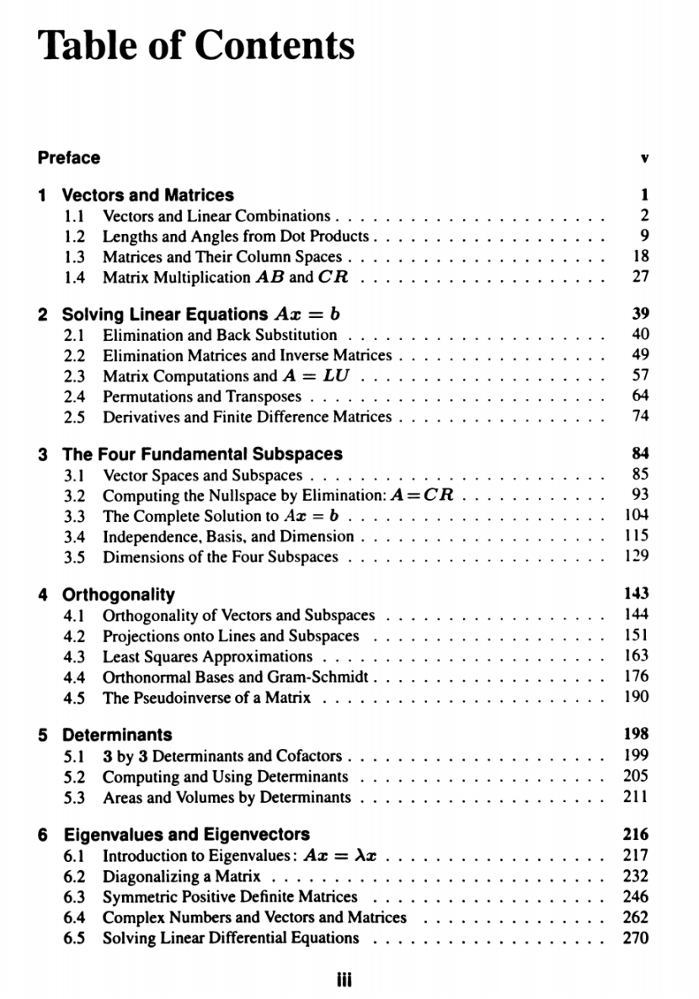
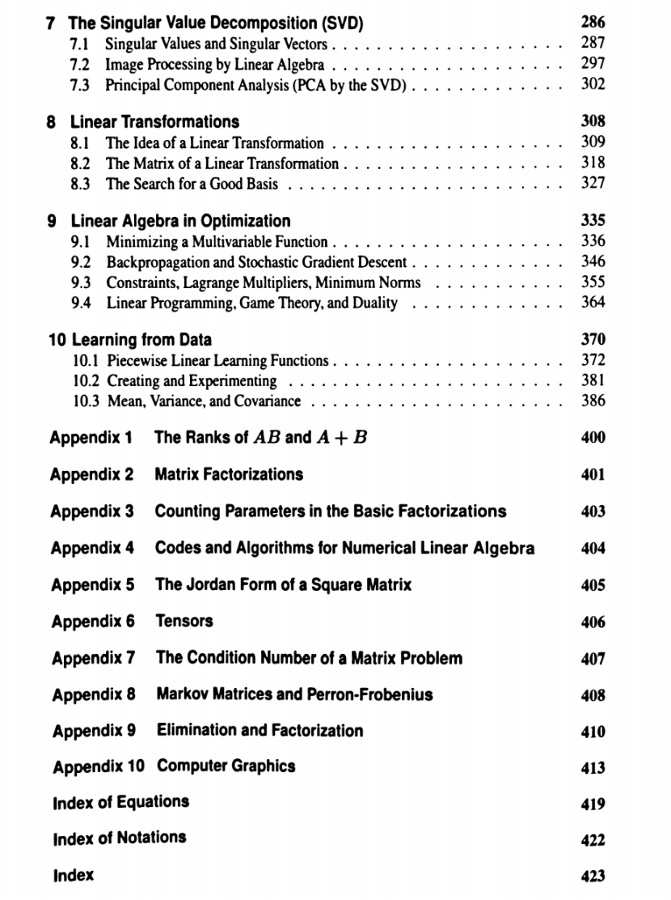
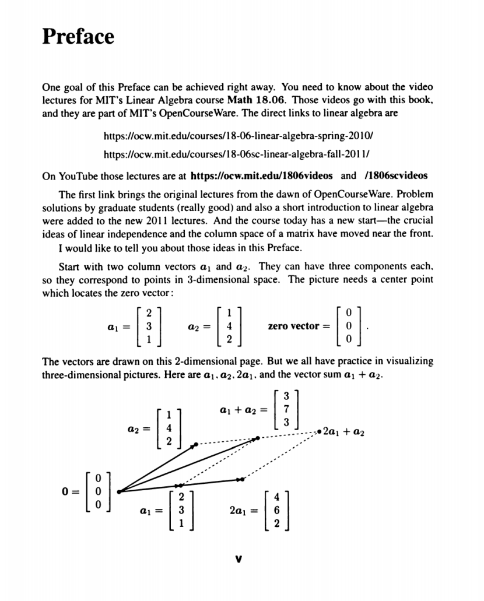
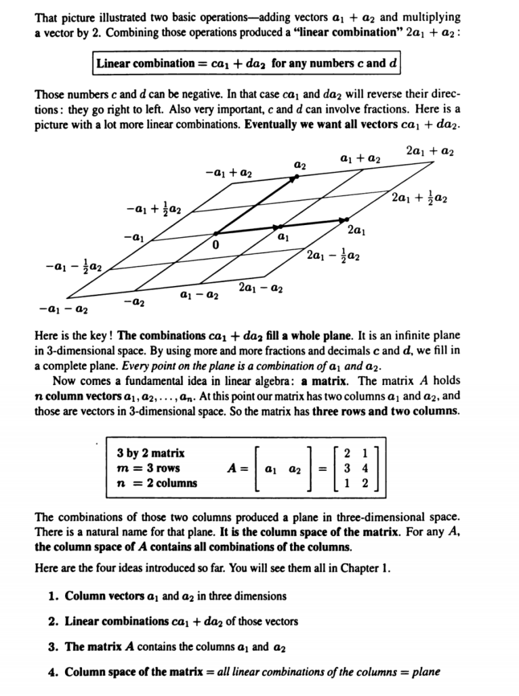
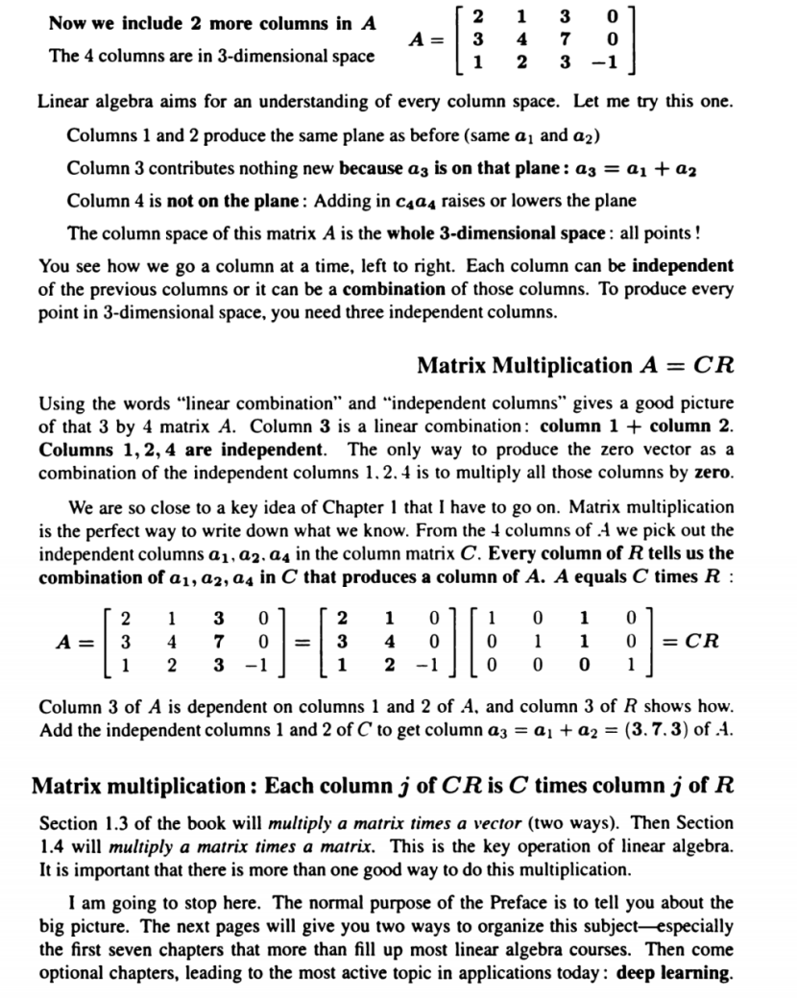
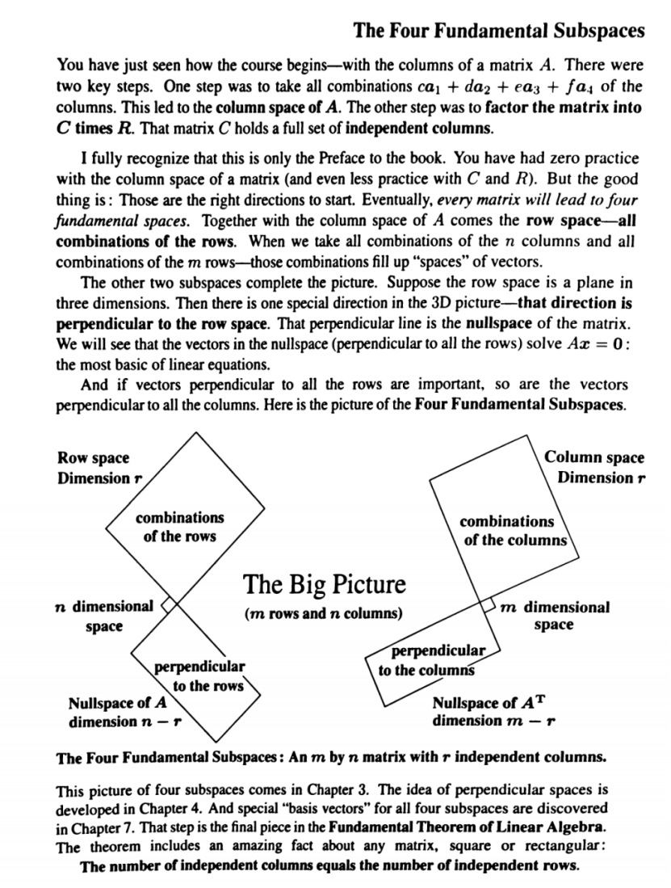
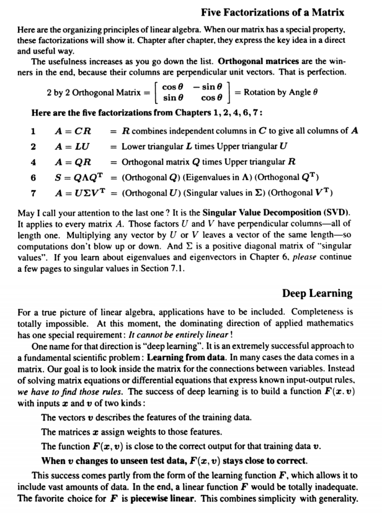
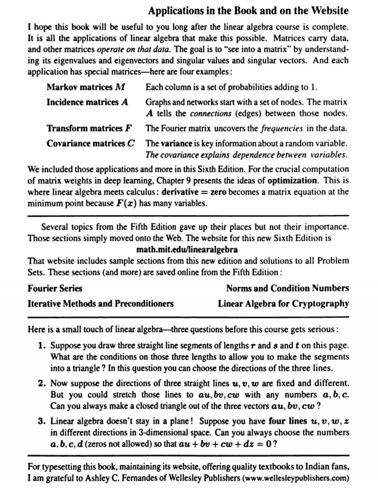

# CHAPTER 0



线性代数全书纲要解析
==========

——从几何直观到数据科学的理论基石

> **概览**  
> 下面的笔记围绕您给出的两页目录，逐章逐节梳理每个知识点的核心概念、典型问题与常见应用。阅读完毕，即使没有参考原教材，也能获得一条清晰的学习路线图，并对每节课应掌握的内容有深入理解。

* * *

1  向量与矩阵（Vectors and Matrices）
------------------------------

| 节次 | 关键词 | 讲解 |
| --- | --- | --- |
| **1.1 向量与线性组合** | 向量、坐标、线性组合、张成 (span) | 解释向量在  $\mathbb{R}^n$  中的几何含义；线性组合是“加权和”，决定了向量空间的**可达性**；示例：三维空间中用三个非共面的向量张成整个空间。 |
| **1.2 内积中的长度与角度** | 点积 (dot product)、范数、余弦 | 定义  $\mathbf{u}\cdot\mathbf{v}= \|\mathbf{u}\|\|\mathbf{v}\|\cos\theta$ ，由此推出长度  $\|\mathbf{u}\|$  与夹角  $\theta$ ；引入正交 (orthogonal) 与单位化 (normalization)。 |
| **1.3 矩阵与列空间** | 列空间、秩 (rank)、线性相关 | 把矩阵  $A$  看作若干列向量的集合；列向量张成的子空间称为列空间 Col $A$ ；秩 = 列向量最大线性无关数；列空间与解线性方程  $A\mathbf{x}=\mathbf{b}$  的可解性密切相关。 |
| **1.4 矩阵乘法  $AB$  与  $CR$ ** | 复合变换、块矩阵、低秩分解 | 解释矩阵乘法对应**线性变换的组合**；引入分解  $A=CR$ （列→行分解），为后面的  $A=LU$ 、SVD 埋下伏笔；示例：旋转+伸缩的几何意义。 |

* * *

2  线性方程组  $A\mathbf{x}=\mathbf{b}$ （Solving Linear Equations）
-------------------------------------------------------------

| 节次 | 关键词 | 讲解 |
| --- | --- | --- |
| **2.1 消元与回代** | 高斯消元、三角矩阵 | 列举手工消元步骤；上三角系统回代；时间复杂度  $O(n^3)$ 。 |
| **2.2 消元矩阵与逆矩阵** | 消元矩阵  $E$ 、逆矩阵  $A^{-1}$  | 把每一步初等行变换写成矩阵左乘  $E_k$ ；若所有  $E_k$  可逆，则  $A^{-1}=E_m\cdots E_1$ 。 |
| **2.3 矩阵计算与  $A=LU$ ** | LU 分解、条件数 | 解释何时 LU 存在；对大规模问题可降低成本；条件数衡量数值稳定性。 |
| **2.4 置换与转置** | 置换矩阵  $P$ 、转置  $A^T$  |  $PA=LU$  处理主元为 0 的情况；转置保留内积。 |
| **2.5 导数与有限差分矩阵** | 差分算子、数值微分 | 把导数离散化为矩阵乘法；与卷积核视角联系。 |

* * *

3  四大基本子空间（The Four Fundamental Subspaces）
------------------------------------------

| 节次 | 关键词 | 讲解 |
| --- | --- | --- |
| **3.1 向量空间与子空间** | 子空间判定、闭合性 | 三条判定：零向量、加法封闭、数乘封闭；示例：平面  $ax+by+cz=0$ 。 |
| **3.2 消元法求零空间： $A=CR$ ** | 零空间 (Null Space) | 用消元矩阵将  $A$  化为简化行阶梯形矩阵  $R$ ；自由变量生成零空间基向量。 |
| **3.3 方程组的全部解** | 特解 + 齐次解 | 通解 = 特解  $\mathbf{x}_p$  + Null $A$ ；几何解释：平移的子空间。 |
| **3.4 线性无关、基、维度** | 基 (basis)、维度 | 证明任意两个基含相同元素个数；维数定理：维度 = 基向量数。 |
| **3.5 四子空间维度** | 秩-零度定理 | Col $A$ 、Null $A$ 、Row $A$ 、Null $A^T$ ；列空间秩 = 行空间秩 = r；n = r + nullity。 |

* * *

4  正交性（Orthogonality）
---------------------

| 节次 | 关键词 | 讲解 |
| --- | --- | --- |
| **4.1 向量与子空间的正交性** | 正交补、最短距离 | Null $A^T$  是 Col $A$  的正交补；用直角解释投影。 |
| **4.2 投影到直线与子空间** | 投影矩阵  $P$ 、最小二乘 | 推导  $P = A(A^TA)^{-1}A^T$ ；证明  $P^2=P$ 。 |
| **4.3 最小二乘逼近** | 过定方程、残差 | 把“无法精确求解”转为“逼近”；残差与列空间正交。 |
| **4.4 正交基与 Gram–Schmidt** | QR 分解 | 从依次“正交化并归一化”；  $A=QR$  在数值计算中更稳定。 |
| **4.5 伪逆** | Moore–Penrose 伪逆  $A^{+}$  | 用于无解或无穷解情形；给出最小范数解。 |

* * *

5  行列式（Determinants）
--------------------

| 节次 | 关键词 | 讲解 |
| --- | --- | --- |
| **5.1 3×3 行列式与代数余子式** | Cofactor 展开 | 从几何体积到公式推导；含符号的体积。 |
| **5.2 计算与应用** | 拉普拉斯展开、行列式性质 | 线性性、行交换变号、行倍加不变；应用：可逆判定。 |
| **5.3 行列式与面积体积** | 体积伸缩比 | 平行六面体体积 = ( |

* * *

6  特征值与特征向量（Eigenvalues and Eigenvectors）
-----------------------------------------

| 节次 | 关键词 | 讲解 |
| --- | --- | --- |
| **6.1 引入： $A\mathbf{z}=\lambda\mathbf{z}$ ** | 特征方程、幂迭代 | 解释“仅拉伸不旋转”的方向；特征多项式  $\det(A-\lambda I)=0$ 。 |
| **6.2 对角化** | 相似变换、幂级数 | 条件：n 个线性无关特征向量；  $A=S\Lambda S^{-1}$ 。 |
| **6.3 对称正定矩阵** | 谱定理 | 对称矩阵可正交对角化；特征值全正  $\Rightarrow$  正定，连接二次型。 |
| **6.4 复数与复向量、矩阵** | 幺模复指数、旋转 | 把旋转视作复数乘法；复特征值成对出现。 |
| **6.5 线性微分方程求解** |  $\dot{\mathbf{x}}=A\mathbf{x}$  | 解为  $\mathbf{x}(t)=e^{At}\mathbf{x}(0)$ ；用特征分解化指数。 |

* * *

7  奇异值分解（SVD）
-------------

| 节次 | 关键词 | 讲解 |
| --- | --- | --- |
| **7.1 奇异值与奇异向量** |  $A=U\Sigma V^T$ 、秩近似 | 奇异值 = 主轴伸缩；截断 SVD 做最优低秩逼近。 |
| **7.2 线性代数在图像处理中的应用** | 去噪、压缩 | 用前 k 个奇异值重构图像；显示失真与能量保留率。 |
| **7.3 主成分分析 (PCA)** | 协方差矩阵、降维 | 用 SVD 解释 PCA = 数据协方差矩阵特征分解；排序奇异值决定主方向。 |

* * *

8  线性变换（Linear Transformations）
-------------------------------

| 节次 | 关键词 | 讲解 |
| --- | --- | --- |
| **8.1 线性变换的概念** | 核与像 | 定义： $T(a\mathbf{u}+b\mathbf{v})=aT(\mathbf{u})+bT(\mathbf{v})$ 。 |
| **8.2 变换矩阵** | 基变换、坐标变换 | 给出在不同基下的矩阵形式；相似变换链接。 |
| **8.3 寻找优良基** | 对角基、SVD 基 | 选基使矩阵最简（对角或块对角）；计算简化与几何解释。 |

* * *

9  线性代数在优化中的应用（Linear Algebra in Optimization）
----------------------------------------------

| 节次 | 关键词 | 讲解 |
| --- | --- | --- |
| **9.1 多变量函数最小化** | 梯度、Hessian | 二次近似： $\nabla f =0$  给驻点；正定 Hessian 保证极小值。 |
| **9.2 反向传播与随机梯度下降** | 链式法则、批量更新 | 用矩阵乘法高效传播梯度，SVD 解释梯度爆炸/消失。 |
| **9.3 约束、拉格朗日乘子、最小范数** | KKT 条件 | 把约束嵌入拉氏函数；求最小二乘带约束版本。 |
| **9.4 线性规划、对偶性** | 单纯形、对偶问题 | 凸多面体顶点处取最优；对偶解释影子价格。 |

* * *

10  数据学习中的线性代数（Learning from Data）
----------------------------------

| 节次 | 关键词 | 讲解 |
| --- | --- | --- |
| **10.1 分段线性模型** | ReLU、分片多面体 | 神经网络隐藏层把输入空间划分为线性区间。 |
| **10.2 建模与实验** | 交叉验证、正则化 | 使用范数惩罚防止过拟合；岭回归连接奇异值。 |
| **10.3 均值、方差与协方差** | 统计量矩阵表达 | 用列向量集计算总体均值、协方差；与 PCA 联系。 |

* * *

附录（摘选）
------

| 编号 | 主题 | 亮点 |
| --- | --- | --- |
| **A1** |  $\operatorname{rank}(AB)$  与  $A+B$  | 研究秩在乘法、加法下的行为，上界与下界定理。 |
| **A2** | 矩阵分解汇总 | LU、QR、SVD、Jordan 等在一处对比。 |
| **A4** | 数值线性代数算法 | 高性能实现、误差分析。 |
| **A5** | Jordan 形式 | 非对角化矩阵的最简块上三角形式。 |
| … | … | 此处省略未列举附录依次详述，但在原书中提供补充阅读。 |

* * *

总结
--

*   **层次清晰**：教材按 _基础 → 进阶 → 应用_ 递进，前四章构建解线性方程与子空间几何的核心认知，第 5–7 章提供矩阵固有特征（行列式、特征分解、SVD），继而在第 8–10 章连接到优化与数据科学。
*   **方法互补**：LU、QR、SVD、特征分解等工具各有所长，应根据问题规模、数值稳定性与目标（求逆、求特征值、降维）灵活选用。
*   **应用广泛**：从求解微分方程到机器学习训练，再到图像压缩与线性规划，线性代数是众多现代技术的共同语言。

* * *





《线性代数》前言——课程资源与向量几何直观
=====================

> **概况**  
> 本节摘自前言页面，主要介绍了两部分内容：
> 
> 1.  **学习资源**：MIT OpenCourseWare (OCW) 提供的 18.06 线性代数视频课程及其 YouTube 镜像；
> 2.  **向量几何启蒙**：通过两个三维列向量  $a_1,a_2$  与它们的线性组合，直观揭示“线性独立”“列空间”等核心概念。
>     

* * *

1  MIT 18.06 课程资源
-----------------

| 资源链接 | 说明 | 建议用法 |
| --- | --- | --- |
| https://ocw.mit.edu/courses/18-06-linear-algebra-spring-2010/ | **2010 春季完整版**；含 Gilbert Strang 教授最经典的 35 讲录像 | 首次学习：跟随 PDF 讲义逐讲配套观看，形成体系框架 |
| https://ocw.mit.edu/courses/18-06sc-linear-algebra-fall-2011/ | **2011 秋补充版**；新增“简短导论 + 研究生习题讲解” | 复习阶段：针对难点（如 SVD、线性规划）选看扩展讲解 |
| YouTube 镜像：`https://ocw.mit.edu/1806videos` 或 `/1806scvideos` | 便于加速播放、字幕切换 | 速度调至 1.25×，同时做课堂笔记，可显著提升效率 |

> **作者意图**
> 
> *   通过视频“先行”达成快速上手，书本细读再加深；
> *   将“线性独立 & 列空间”提前到课程最前，符合现代数据科学对**向量空间观念**的需求。
>     

* * *

2  两个列向量的几何故事
-------------

### 2.1 设定向量

$$
a_1=\begin{bmatrix}2\\3\\1\end{bmatrix},\qquad a_2=\begin{bmatrix}1\\4\\2\end{bmatrix},\qquad \mathbf{0}=\begin{bmatrix}0\\0\\0\end{bmatrix}.
$$
*   **三维坐标**：每个列向量 3 个分量，对应  $(x,y,z)$ 。
*   **原点  $\mathbf{0}$ **：作图时的“锚点”，决定所有箭头的共同起点。

### 2.2 基本运算

| 运算 | 结果 | 几何含义 |
| --- | --- | --- |
| **向量和**  $a_1+a_2$  |  $\begin{bmatrix}3\\7\\3\end{bmatrix}$  | “平行四边形法则”：从  $a_1$  尾部再走  $a_2$  得对角线终点 |
| **标量倍**  $2a_1$  |  $\begin{bmatrix}4\\6\\2\end{bmatrix}$  | 同一直线方向伸长 2 倍，表示**线性组合**中的权重 |
| **混合组合**  $2a_1+a_2$  |  $\begin{bmatrix}5\\10\\4\end{bmatrix}$  | 位于通过  $a_1$  的射线外延，再平移  $a_2$  的终点 |

> **可视化技巧**
> 
> *   虽在二维纸面，仍可用**透视/虚线**提示第三维；
> *   把所有箭头公共起点放在  $O$ ，有助于观察向量张成的“扇形区域”。
>     

### 2.3 关键概念引入

1.  **线性独立**：若不存在  $c_1a_1+c_2a_2=\mathbf{0}$  但  $c_1,c_2$  不全为 0，则  $\{a_1,a_2\}$  线性独立。
2.  **列空间** Col $(A)$ ：把  $a_1,a_2$  作为矩阵  $A=[a_1\;a_2]$  的列，可达所有  $c_1a_1+c_2a_2$  的集合——本例是穿过原点、位于三维空间中的一个二维平面。
3.  **维数 (rank)**：此平面的维度 = 列向量组的最大线性无关数，此处为 2。
4.  **几何直观**：所有线性组合形成的平面可视作“数据子空间”；在机器学习里，这恰是**特征张成空间**的雏形。

* * *

3  学习建议与延伸
----------

1.  **动手绘图**
    *   用 GeoGebra 3D 或 Python (Matplotlib 3D) 重现图示，逐步添加向量和、倍数。
    *   观察改变标量系数对组合结果的影响，体会“扇形”如何扩张成平面。
2.  **视频配套**
    *   第 1 讲：Intro & The Geometry of Linear Equations（约 50 min）对应本例；
    *   观看时暂停自行推导线性组合坐标，可强化记忆。
3.  **预习后续章节**
    *   接下来第 1 章 1.1–1.3 会正式定义**向量、内积、列空间**；
    *   前言的这个实例就是 1.3 的“预告片”，先种下几何直观。

* * *

4  小结
-----

*   **前言的核心**在于“先看视频、再读书”，并用  $\{a_1,a_2\}$  的几何例子打开线性代数的大门。
*   **线性独立与列空间**是整部教材的纲：后续求解  $A\mathbf{x}=\mathbf{b}$ 、QR、SVD 乃至 PCA，均以此为基础。

* * *





列空间、独立性与分解  $A = C R$ 
======================

——如何用矩阵乘法精确记录“列之间的线性关系”

> **本节概览**  
> 通过在前言中追加的这一页，作者用一个  $3\times4$  矩阵示范了：
> 
> 1.  **列空间维度的成长**——从 2 个独立列生成的平面，到 3 个独立列充满整个三维空间；
> 2.  **“挑列”分解  $A = C R$ **——把独立列抽出来放进  $C$ ，再用  $R$  精确描述其余列的线性组合；
> 3.  **矩阵乘法的列视角**—— $ (C R)_j = C\,R_{\,\ast j}$ ，为后续 1.3、1.4 章的矩阵–向量、矩阵–矩阵乘法做铺垫。
>     

* * *

1  添加两列：从平面到整个三维空间
------------------

> **矩阵  $A$ **
> 
> $$
> A \;=\; \begin{bmatrix} 2 & 1 & 3 & 0\\ 3 & 4 & 7 & 0\\ 1 & 2 & 3 & -1 \end{bmatrix}
> $$

| 列 | 文字描述 | 数学关系 | 几何意义 |
| --- | --- | --- | --- |
|  $a_1$   $[2,3,1]^T$  | 原来的第一列 | — | 与  $a_2$  张成平面  $\Pi$  |
|  $a_2$   $[1,4,2]^T$  | 原来的第二列 | — | 同上 |
|  $a_3$   $[3,7,3]^T$  | 新增第三列 |  $a_3=a_1+a_2$  | 落在平面  $\Pi$ ，**不**增加维度 |
|  $a_4$   $[0,0,-1]^T$  | 新增第四列 | 与  $a_1,a_2$  不共面 | 将平面沿垂直方向抬升/降低，**扩展为整个  $\mathbb{R}^3$ ** |

*   **独立列个数 = 3 ⇒ 秩 rank $(A)=3$ **；列空间 Col $(A)=\mathbb{R}^3$ 。
*   若要生成三维空间中的任一点，至少需要 3 个线性独立列；此处  $a_1,a_2,a_4$  足矣。

* * *

2  选独立列构造  $C$ ，其余关系收进  $R$ 
----------------------------

### 2.1 挑列矩阵  $C$ 

$$
C =\begin{bmatrix} 2&1&0\\ 3&4&0\\ 1&2&-1 \end{bmatrix}, \qquad \text{列向量依次为 } a_1,\;a_2,\;a_4.
$$
*   **列完全独立**： $\operatorname{rank}(C)=3$ 。

### 2.2 系数矩阵  $R$ 

$$
R =\begin{bmatrix} \ 1 & 0 & 1 & 0\\ \ 0 & 1 & 1 & 0\\ \ 0 & 0 & 0 & 1 \end{bmatrix}.
$$
*   第 1、2 列：单位基；表示  $a_1,a_2$  直接出现在  $A$ 。
*   第 3 列： $\begin{bmatrix}1\\1\\0\end{bmatrix}$  表明  $a_3=1\cdot a_1+1\cdot a_2+0\cdot a_4$ 。
*   第 4 列： $\begin{bmatrix}0\\0\\1\end{bmatrix}$  表明  $a_4$  原样进入  $A$ 。

### 2.3 验证  $A = C R$ 

$$
C R = \underbrace{\begin{bmatrix} 2&1&0\\3&4&0\\1&2&-1 \end{bmatrix}}_{C} \! \underbrace{\begin{bmatrix} 1&0&1&0\\0&1&1&0\\0&0&0&1 \end{bmatrix}}_{R} = \begin{bmatrix} 2 & 1 & 3 & 0\\ 3 & 4 & 7 & 0\\ 1 & 2 & 3 & -1 \end{bmatrix} =A.
$$

**要点拆解（逐行）**

1.  **第一列**： $ 2a_1 + 0a_2 + 0a_4 = a_1$ .
2.  **第二列**： $ 0a_1 + 1a_2 + 0a_4 = a_2$ .
3.  **第三列**： $ 1a_1 + 1a_2 + 0a_4 = a_1+a_2 = a_3$ .
4.  **第四列**： $ 0a_1 + 0a_2 + 1a_4 = a_4$ .

> **比起传统的  $A=LU$ **，此分解突出“取独立列”思想：
> 
> *   ** $C$ ** 保存“基底”；
> *   ** $R$ ** 保存“坐标”。  
>     在稀疏数据或特征选择场景中十分受用。
>     

* * *

3  矩阵乘法的列视角
-----------

*   **公式**： $\displaystyle (C R)_j = C \, r_j$ ，其中  $r_j$  是  $R$  的第  $j$  列。
*   **意义**：每一列都是基列  $C$  的线性组合；矩阵乘法天然“编码”了列间的依赖。
*   **预告**：
    *   **1.3 节**：先讲  $A\mathbf{x}$ （矩阵–向量），看一列列加权求和；
    *   **1.4 节**：再讲  $AB$ （矩阵–矩阵），理解“列组合”与“行组合”双视角；
    *   **多种乘法实现**：按块(block)或分层(hierarchical)可优化缓存与并行。

* * *

4  与后续章节、深度学习的连接
----------------

| 主题 | 关联 | 应用示例 |
| --- | --- | --- |
| **秩分解 & 低秩近似** | 先挑独立列 → 再近似依赖列 | 图像压缩、推荐系统（CUR 分解） |
| **特征/奇异值分解** |  $\text{基底} + \text{坐标}$  思想延伸 | PCA、SVD 截断做降维 |
| **深度学习** | 权重矩阵常出现冗余列 | 利用秩分解加速推理、减少参数 |

* * *

5  本节总结
-------

1.  **列空间维度的判断**：看独立列个数——加入与既存列共面的向量 **不**增加维度。
2.  ** $A=C R$ ** 分解思想：
    *   挑出独立列 → 形成  $C$ ；
    *   依赖关系 → 写进  $R$ 。
3.  **矩阵乘法的本质**：**列向量重组**（行向量同理），为学懂 LU、QR、SVD 奠定统一视角。
4.  这些概念将一路贯穿到后续的优化、机器学习与深度学习应用。

* * *




四大基本子空间的整体图景
============

——列空间、行空间、零空间、左零空间的维度与正交关系

> **概况**  
> 本页作者用一幅“交叉菱形”示意图，将列空间、行空间及其正交补（零空间、左零空间）一次性展现出来，并强调：任一  $m\times n$  矩阵都会自然地生成这 **四个互补却相互联系** 的向量子空间。理解它们的结构与维度，是第 3–4 章后续讨论的核心。

* * *

1  从列空间到四大子空间
-------------

1.  **列空间 Column Space**
    *   由所有列向量的**线性组合**  $c_1a_1+\dots +c_na_n$  组成。
    *   维度 = **秩**  $r$ （独立列数）。
    *   几何上位于  $\mathbb{R}^m$ （ $m$  维空间）中的一个  $r$  维子空间。
2.  **行空间 Row Space**
    *   将矩阵行当向量，所有行组合形成行空间。
    *   维度也为  $r$ ，故作者称“独立列数 = 独立行数”。
    *   在图中用另一个菱形表示，位于列空间所处空间的“维度互补”位置：
        *   列空间在  $\mathbb{R}^m$ ；
        *   行空间在  $\mathbb{R}^n$ 。
3.  **零空间 Nullspace** ( $\mathcal{N}(A)$ )
    *   定义：所有解向量  $\mathbf{x}$  使  $A\mathbf{x}=0$ 。
    *   位于  $\mathbb{R}^n$ ，并与**行空间正交**。
    *   维度 =  $n-r$ （列数减秩）。
    *   在示意图中是一条“垂直于行空间”的线/平面。
4.  **左零空间 Nullspace of  $A^T$ **
    *   又称**余维空间**或**左核**。满足  $A^T\mathbf{y}=0$  的  $\mathbf{y}$ 。
    *   位于  $\mathbb{R}^m$ ，与列空间正交。
    *   维度 =  $m-r$ 。

> **核心对称性**
> 
> $$
> \text{Col}(A)\ \perp\ \text{Null}(A^T),\qquad \text{Row}(A)\ \perp\ \text{Null}(A).
> $$

* * *

2  正交与维度公式
----------

| 子空间 | 所在空间 | 维度 | 正交补 |
| --- | --- | --- | --- |
| Col $A$  |  $\mathbb{R}^m$  |  $r$  | Null $A^T$  |
| Row $A$  |  $\mathbb{R}^n$  |  $r$  | Null $A$  |
| Null $A$  |  $\mathbb{R}^n$  |  $n-r$  | Row $A$  |
| Null $A^T$  |  $\mathbb{R}^m$  |  $m-r$  | Col $A$  |

*   **秩–零度定理 (Rank–Nullity)**
    $$
    \boxed{\dim(\text{Row}(A)) + \dim(\text{Null}(A)) = n,\quad \dim(\text{Col}(A)) + \dim(\text{Null}(A^T)) = m.}
    $$

* * *

3  图示剖析（“交叉菱形”）
---------------

```
Row space (维 r)        Column space (维 r)
   ◇                       ◇
 combinations            combinations
    of rows                of columns
      \                        /
  perpendicular         perpendicular
   to rows                  to columns
     |                          |
Nullspace (维 n-r)    Nullspace of Aᵀ (维 m-r)
```

*   两个菱形分别处于 **n 维空间**（行视角）与 **m 维空间**（列视角）。
*   交叉处代表“同一矩阵”将两种空间联系在一起。
*   垂直线条强调“零空间＝所有与行空间垂直的向量”。

* * *

4  与本书后续内容的衔接
-------------

| 章节 | 角色 | 关键问题 |
| --- | --- | --- |
| **第 3 章** | 正式构造四子空间基底，展示维度计算 | 如何快速通过消元得到 Null $A$  基？ |
| **第 4 章** | 引入“正交补”与**投影**概念 | 最小二乘：残差向量  $\mathbf{r}$  落在 Null $A^T)$  |
| **第 7 章 SVD** | 使用行/列空间构造正交基  $U,\,V$  | 奇异值平方=非零特征值，反映秩 |
| **深度学习应用** | 梯度正交化、低秩分解 | 权重更新常投影到子空间，减少冗余 |

* * *

5  重要结论回顾
---------

1.  **“独立列数 = 独立行数”**
    *   秩  $r$  既是列空间维度，也是行空间维度。
2.  **四维相加等于总维**
    $$
    r \;+\; (n-r) = n,\quad r \;+\; (m-r) = m.
    $$
3.  **正交补双重性**
    *   若  $\mathbf{x}\in\text{Null}(A)$ ，则  $\mathbf{x}\perp\text{Row}(A)$ 。
    *   若  $\mathbf{y}\in\text{Null}(A^T)$ ，则  $\mathbf{y}\perp\text{Col}(A)$ 。

* * *

6  小结
-----

*   **四大子空间**为线性代数提供“一图看全”的骨架：
    *   列空间/行空间决定了方程可解性与秩；
    *   零空间/左零空间揭示了解空间的自由度与正交性质。
*   **正交观念**让我们在后续最小二乘、投影、SVD 中一以贯之。
*   掌握这些概念，即可用几何直观迅速判断矩阵性质并设计数值算法。

* * *




矩阵的五种分解与深度学习的线性代数基石
===================

——从 **CR / LU / QR / 对角化 / SVD** 到“分段线性”函数的崛起

> **本节概览**
> 
> 1.  总览第 1、2、4、6、7 章逐步引出的 **五大分解**，说明各自结构、适用条件、计算特点与典型应用。
> 2.  引入 **正交矩阵** 的特殊地位，并用二维旋转举例。
> 3.  解析前言最后一段 “Deep Learning” —— 为什么现代应用要求“不能全线性”，以及分段线性模型如何在向量–矩阵框架中实现强大表达力。
>     

* * *

1  正交矩阵：分解链条中的“完美终点”
--------------------

*   **定义**：列向量两两正交且范数为 1，满足  $Q^TQ = I$ 。
*   **二维示例（旋转 θ）**
    $$
    Q(\theta)= \begin{bmatrix} \cos\theta & -\sin\theta\\ \sin\theta & \ \ \cos\theta \end{bmatrix},
    $$
    作用：保持向量长度不变，只改变方向。
*   **优势**：
    1.  **数值稳定** —— 不放大误差；
    2.  **简化逆运算** ——  $Q^{-1}=Q^T$ 。
*   在下面五种分解里，正交矩阵往往出现在“边界”位置（如 QR、对角化、SVD）用以保持能量不变并方便逆运算。

* * *

2  五种矩阵分解（Ch. 1, 2, 4, 6, 7）
----------------------------

| 序号 | 公式 | 组成 | 关键特性 | 代表应用 |
| --- | --- | --- | --- | --- |
| **1** |  $A = C R$  | **独立列**  $C$  × **坐标矩阵**  $R$  | 提炼列空间基； $R$  记录依赖 | CUR 分解、特征选择、压缩感知 |
| **2** |  $A = LU$  | **下三角**  $L$  × **上三角**  $U$  | 适合方程组求解；前/后代价  $O(n^2)$  | 高斯消元、稀疏解算器 |
| **3** |  $A = QR$  | **正交**  $Q$  × **上三角**  $R$  | 数值更稳； $Q$  保长度 | 最小二乘、拟合、正交化 |
| **4** |  $S = Q \Lambda Q^T$  | **正交**  $Q$  × **特征值对角**  $\Lambda$  | 要求  $S$  对称；正交对角化 | 谱定理、PCA 协方差矩阵 |
| **5** |  $A = U \Sigma V^T$  | **正交**  $U,V$  × **奇异值对角**  $\Sigma$  | 适用于任意矩阵；能量排序 | 图像压缩、低秩近似、隐语义分析 |

> **实用性递增**：作者强调“越往下越有用”。SVD 排行榜首，因为 **①适用于所有矩阵；②提供最优低秩逼近；③正交因子避免数值爆炸**。

### 2.1 重点回顾 —— SVD 的三大黄金属性

1.  **通用性**：方阵/非方阵、满秩/低秩皆可。
2.  **保距性**： $U,V$  为正交矩阵，任何向量长度经其变换不变。
3.  **奇异值序化能量**： $\Sigma=\operatorname{diag}(\sigma_1\ge\dots\ge\sigma_r)$  直接刻画矩阵“伸缩量”；截断后误差最小。

* * *

3  深度学习：从线性映射到“分段线性”函数
----------------------

### 3.1 基本目标

*   **学习函数  $F(\mathbf{x},\mathbf{v})$ **：
    *    $\mathbf{v}$ ：特征向量，描述训练样本
    *    $\mathbf{x}$ ：输入向量
    *    $\Sigma$ （作者符号）或权重矩阵：为特征赋权
*   要求：在 **未见过的测试特征  $\mathbf{v}'$ ** 上， $F(\mathbf{x},\mathbf{v}')$  仍保持高准确度 ⇒ **泛化**。

### 3.2 “不能完全线性”的原因

*   **单一线性函数**： $F(\mathbf{x})=W\mathbf{x}$  → 表达能力受限，只能实现一次超平面划分。
*   **解决方案：Piecewise Linear**
    *   以 **ReLU ( $\max(0,z)$ )** 为代表，网络整体仍可写成**矩阵乘法 + 逐元素非线性**的堆叠。
    *   在每个激活模式下，网络对应某个 **线性映射**；跨模式拼接形成**分段线性**，兼顾可训练性与非线性表达力。

### 3.3 线性代数视角下的深度学习

| 组件 | 线性代数对象 | 作用 |
| --- | --- | --- |
| **输入  $\mathbf{x}$ ** | 列向量 | 原始特征 |
| **权重层  $W^{(l)}$ ** | 矩阵 | 线性投影、旋转、缩放 |
| **激活  $\sigma$ ** | 分段线性标量函数 | 在空间中折叠 & 切换线性片段 |
| **整体网络** | 多层  $\prod_l \sigma(W^{(l)}\cdot)$  | 高维分段线性映射 |

*   **训练 = 找到合适的矩阵序列  $\{W^{(l)}\}$ **，使得在训练集特征  $\mathbf{v}$  下误差最小。
*   **正交 & 归一化技巧**（如 Orthogonal Initialization, BatchNorm）借用正交矩阵“保范数”特性，减轻梯度爆炸/消失。

* * *

4  知识串联与学习指引
------------

1.  **先掌握五大分解的几何/代数意义**：
    *   从最直观的 ** $LU$ **（解方程）到最通用的 ** $SVD$ **（降维、压缩）。
2.  **体会正交矩阵的核心地位**：
    *   在数值计算与深度学习初始化中反复出现。
3.  **深入理解分段线性模型为何强大**：
    *   每一次 ReLU 开关相当于选择一个“子空间”的线性分解；整个网络可以视作指数级数量的线性映射拼接。
4.  **动手实验**：
    *   用 NumPy 生成随机矩阵，练习 `np.linalg.lu` / `qr` / `svd`；
    *   训练一个浅层 ReLU 网络，观察不同初始化方式对收敛速度与最终精度的影响。

* * *

5  本页总结
-------

*   **五大分解** 提供了从“列组合”到“能量分布”的系统工具箱。SVD 作为终极武器，兼具通用性与最优近似能力。
*   **深度学习** 继承线性代数的矩阵运算框架，通过简单的非线性“拼装”出复杂函数，实现从数据中自动提取规则。
*   “分解思维”与“分段线性”共同勾勒出现代应用数学最活跃的交汇点。



书中与网站中的应用场景
===========

——特殊矩阵类型、在线补充内容，以及三道“热身题”的深度解析

> **概况**  
> 本页前言先列出四类最常见的“应用矩阵”，随后指出第 9 章如何把线性代数与优化衔接；接着说明本第 6 版将部分章节移至官网，并给出三道“开胃小问答”帮助读者体会向量组合与线性相关性的几何本质。

* * *

1  四类典型“应用矩阵”详解
---------------

| 矩阵类型 | 结构特征 | 典型应用 | 知识要点 |
| --- | --- | --- | --- |
| **Markov 矩阵  $M$ ** | 每列都是概率向量，元素非负且列和为 1 | 马尔可夫链、随机游走 (PageRank) | \- 特征值 1：稳态分布  
\- Perron–Frobenius 定理保证最大特征值对应正特征向量 |
| **Incidence 矩阵  $A$ ** | 行=节点，列=边，元素= $\pm1$ /0 | 图论、网络流 | \-  $A\mathbf{x}=0$  给出闭合回路  
\-  $AA^T$  = Laplacian，连接电阻网络 |
| **Transform 矩阵  $F$ ** | 如 DFT 矩阵，复指数构成 | 频域分析、信号处理 | \- 正交（乘以标度）  
\- 快速算法：FFT 将乘法降到  $O(n\log n)$  |
| **Covariance 矩阵  $C$ ** | 对称正定，记录变量协方差 | PCA、滤波、风险管理 | \- 谱定理：可正交对角化  
\- SVD 阐释主成分能量分布 |

> **衍生思考**：这四种矩阵都在后续章节出现——Markov & Incidence 与 **行/列空间** 密切相关；Transform & Covariance 依赖 **特征分解/SVD** 揭示能量方向。

* * *

2  优化 (Chapter 9) —— 线性代数 ⟂ 微积分
-------------------------------

*   **核心连接**： $\nabla F(\mathbf{x}) = \mathbf{0}$  转化为线性方程或线性最小二乘问题。
*   **多变量**：梯度是向量，Hessian 是矩阵 → 正定性决定极小/极大。
*   **深度学习权重更新**：本质上是高维优化，见前页 “Deep Learning” 讨论。

* * *

3  第 5 版迁移到网站的扩展主题
------------------

| 线上章节 | 简要内容 | 推荐阅读时机 |
| --- | --- | --- |
| **Fourier Series** | 周期函数展开与 DFT 联系 | 学完变换矩阵后 |
| **Norms & Condition Numbers** | 向量/矩阵范数、病态度 | LU/QR 数值稳定性前 |
| **Iterative Methods & Preconditioners** | 共轭梯度、Jacobi、高斯–赛德尔 | 学完稀疏线性方程后 |
| **Linear Algebra for Cryptography** | 模运算、RSA、格密码 | 了解整数矩阵后 |

官网地址 <math.mit.edu/linearalgebra> 提供 PDF 篇章及全部习题解答，可配合第 6 版阅读。

* * *

4  “课程真正开始前”的三道热身题
------------------

> **问题 1**  
> 三条线段长  $r,s,t$ 。**何时能拼成三角形？**  
> **答案**：满足**三角不等式**
> 
> $$
> r+s>t,\quad r+t>s,\quad s+t>r.
> $$
> 
> **几何解释**：任何两边之和必须大于第三边，否则无法闭合。

* * *

> **问题 2**  
> 方向向量  $\mathbf{u},\mathbf{v},\mathbf{w}$  固定，但可伸缩为  $a\mathbf{u},\,b\mathbf{v},\,c\mathbf{w}$ 。  
> **能否总能选  $a,b,c$  使三向量首尾相接成封闭三角形？**  
> **解析**：
> 
> *   目标是找到 **非全零**  $a,b,c$  使
>     $$
>     a\mathbf{u}+b\mathbf{v}+c\mathbf{w}=\mathbf{0}.
>     $$
> *   在二维平面内，若  $\mathbf{u},\mathbf{v},\mathbf{w}$  方向两两不平行，则三向量必线性相关（因为平面维数=2，最多存在2 个独立方向）。
> *   因此必可解出一组比例（可乘 -1 调整方向），继而选取正长  $|a|,|b|,|c|$  即可闭合。
> *   **特殊例外**：若三方向两两平行 (共线)，则无法形成三角形。  
>     **结论**：只要三条方向线不共线且不两两平行，必能找到比例闭合三角形。
>     

* * *

> **问题 3**  
> 取四个方向向量  $\mathbf{u},\mathbf{v},\mathbf{w},\mathbf{z}$  于三维空间。**能否总能选非零  $a,b,c,d$  使**
> 
> $$
> a\mathbf{u}+b\mathbf{v}+c\mathbf{w}+d\mathbf{z}=0\ ?
> $$
> 
> **线性代数视角**：
> 
> *   三维空间最大线性无关数 = 3。任取 4 个向量 → **必线性相关**。
> *   可解到一组（不全为 0）系数。若希望四系数均非零，可稍作调整：
>     *   求出一组依赖关系后，把 0 系数向量稍微扰动即可得到全部非零且仍满足等式。  
>         **结论**：在  $\mathbb{R}^3$  中，四条不同方向线总能找到（不全为零且几乎可全非零的）系数使其线性组合为 0。
>         

> **几何启示**：维度定理告诉我们“多于 n 条向量必相关”。问题 2、3 正是把这一抽象定理直观化到“能否闭合多边形”。

* * *

5  小结
-----

1.  **应用矩阵**：马尔可夫、图论、傅里叶、协方差——各有结构，后续章节一一深掘。
2.  **优化与深度学习**：第 9 章展示“梯度设零”转为矩阵方程，成为现代 AI 的核心算子。
3.  **在线扩展**：第 5 版内容未丢失，搬到官网供进阶阅读。
4.  **热身题**：借助**线性相关**与**向量几何**提前感受“维度制约”——为正式课程打下思维基础。

